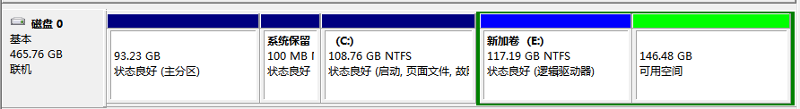
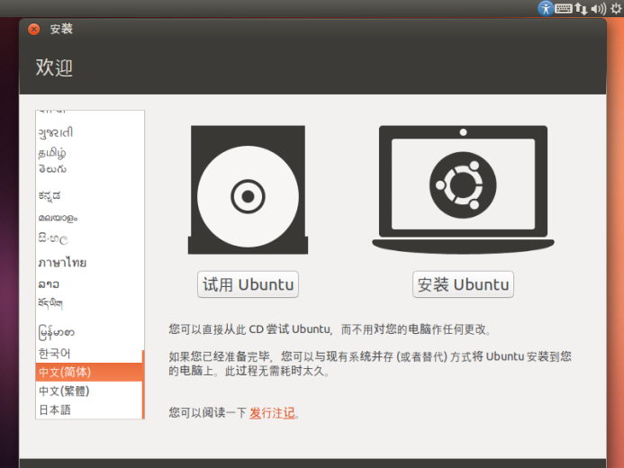
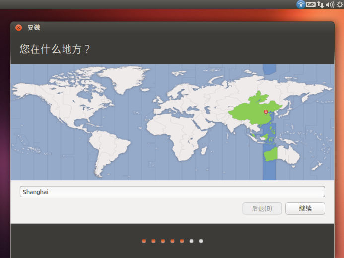

# 1.2 Ubuntu的安装

**教学目的**

使学生掌握Ubuntu的安装方法。

**知识点**

1.	物理机上安装Ubuntu

要求学生使用物理机安装Ubuntu，本课程Gazebo仿真硬件要求为物理机、I7 CPU、8G以上内存。虚拟机不能满足课程仿真环境的速度要求。

## 1. 步骤概述

1. 在Windows系统下安装Win-Ubuntu双系统

- 准备好Windows系统
- 制作Ubuntu 16.04 Live 安装U盘
- 安装Linux

2. 在虚拟机下安装Ubuntu

- 准备好Windows系统
- 在Windows下安装虚拟机软件
- 使用虚拟机软件安装Ubuntu 16.04

## 2. 制作Ubuntu安装U盘

制作启动U盘前需要做的准备
- 准备U盘（2G以上）

- [下载Rufus](https://github.com/pbatard/rufus/releases/download/v3.8/rufus-3.8.exe)
  或[下载Unetbootin](https://unetbootin.github.io/)

- [下载Ubuntu](https://isrc.iscas.ac.cn/mirror/ubuntu-release/xenial/ubuntu-16.04.4-desktop-amd64.iso)

操作步骤

1. 将U盘格式化为fat32格式，注意备份资料。
2. 打开Unetbootin，选择ISO，导入系统iso镜像文件。

3. 点击确定开始烧录U盘，完成后关闭该软件，此时启动盘已经制作完成。

## 3. 安装Ubuntu

**安装前**

1. 保证Window下有可用的空间至少40G。

2. 通过计算机单击右键->管理->磁盘管理

 **安装步骤**

1. 插入U盘，开机后一般按F2或者F12进入BIOS界面，将启动顺序设置成优先从U盘启动，按F10保存Bios设置并退出，开始装载系统，根据提示进行安装。

2. 启动顺序在BIOS中一般表示成BOOT、Boot sequence等，注意BIOS里面的解释。不同的PC进入BIOS的方式可能有差异，可以通过搜索引擎查找进入BIOS界面的方式。

3. 选择安装分区的时候，创建/为ext4格式，至少为40G以上，再创建一个swap分区，一般为内存的2倍。

 **注意，在进行系统安装选择的时候要慎重，注意选项的含义，不然可能导致数据被清空的严重后果。**

如果内部已设有Ubuntu源服务器，建议不要选择`安装中下载`和`安装这个第三方软件`。

如果多系统并存的情况下有未分区的空间可以选择`其它选项`，没有的化，选择`安装Ubuntu，与其它系统共存`。

时区可选`Shanghai`或其它中国城市。

为了方便在程序中输入中文注释，我们键盘布局选择汉语。
