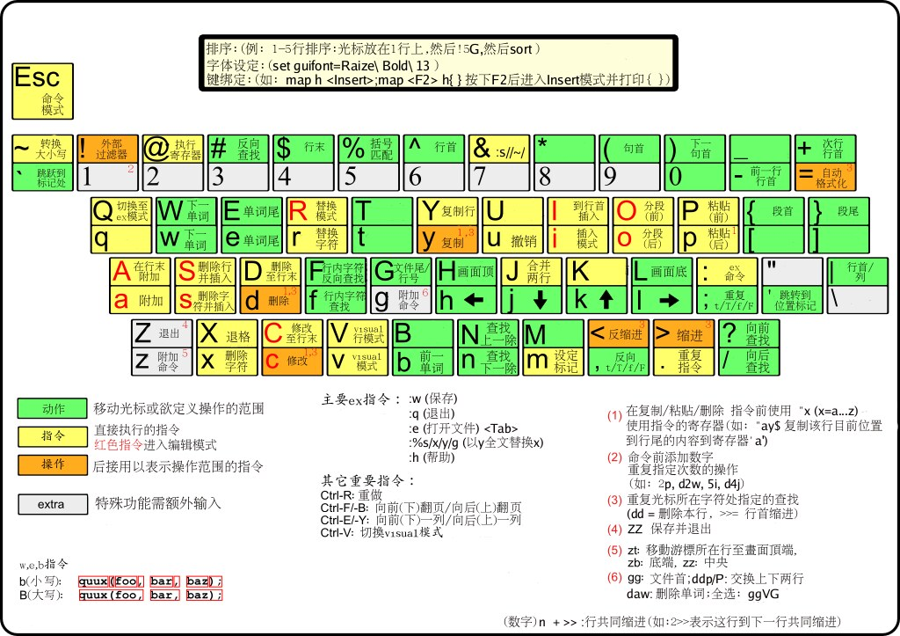
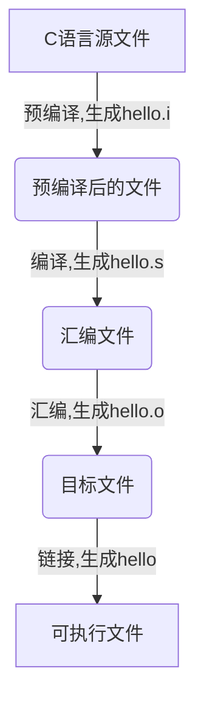
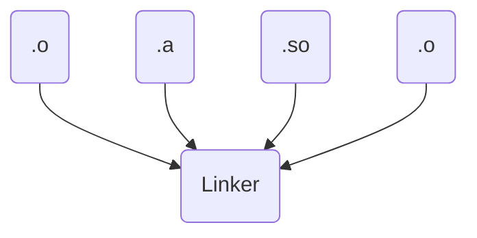
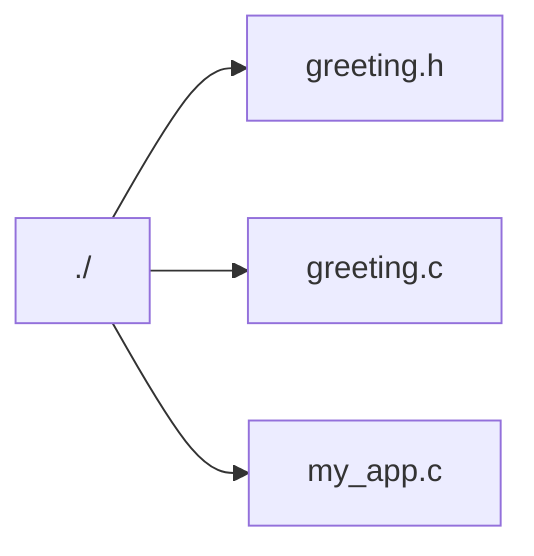
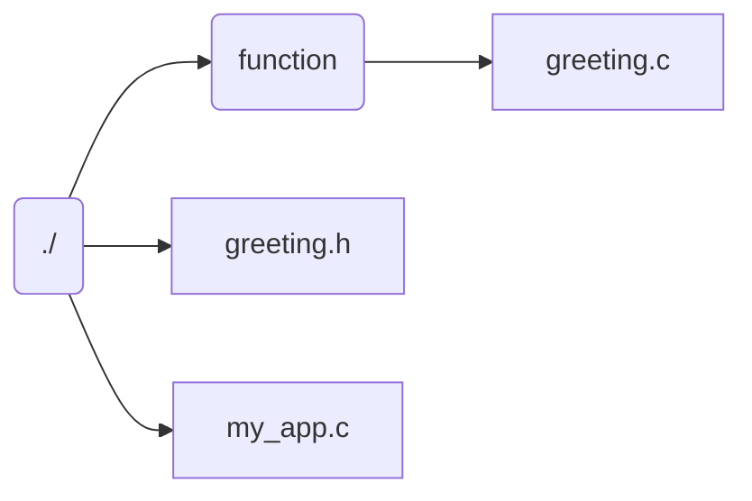
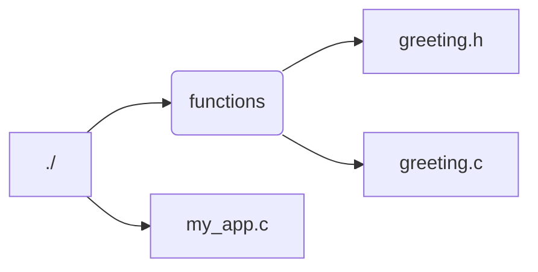
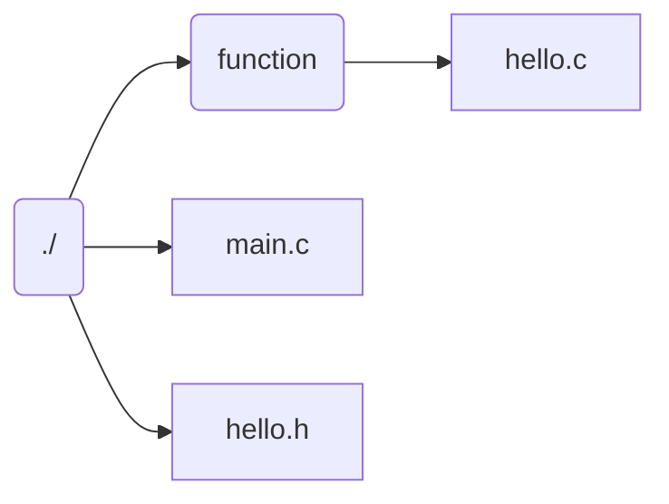

# 1.3 VIM和GCC

**知识点**

1.	Vim的安装
2.	Vim的使用
3.	Vim的配置

## 1. Vim的安装

vi编辑器是Linux和Unix上最基本的文本编辑器，工作在字符模式下。由于不需要图形界面，使它成了效率很高的文本编辑器。尽管在Linux上也有很多图形界面的编辑器可用，但vi在系统和服务器管理中的功能是那些图形编辑器所无法比拟的。vim是vi的加强版本，安装方法是`sudo apt-get install vim`。

## 2. Vim的使用

vim有3个模式：插入模式、命令模式、低行模式。

- 插入模式：在此模式下可以输入字符，按ESC将回到命令模式。

- 正常模式：可以移动光标、删除字符等。

- 命令模式：可以保存文件、退出vi、设置vi、查找等功能(低行模式也可以看作是命令模式里的)。

我们可用vim和notepad做一个对比，在notepad中，你按下`j`，就是在正文中输入`j`；要保存，就要`ctrl+s`；要下移一行，就要`↓`或鼠标。而在vim中，打开一个文件后，并不处在插入模式，而是正常模式，此时你按`j`，vi并不认为你要在正文中输入`j`，而是代表光标下移一行。此时按`i`表示进入insert模式，即插入模式，即notepad的模式。插入模式按Esc退回正常模式。正常模式下按`:`进入命令模式，用于输入较复杂的命令。比如`:w`代表保存文件，`:e a.txt`代表打开文件a.txt。vim可以不用鼠标、方向键、菜单、Ctrl、alt等发出命令。

**任务1.熟悉vim正常方式、插入方式和命令方式。**

操作步骤：

1. 正常模式

启动Vim，自动进入正常模式

以下是常用的几个命令：

i 切换到插入模式，以输入字符

x 删除当前光标所在处的字符

: 切换到底线命令模式，以在最底一行输入命令  

2. 输入模式

在命令模式下按下i就进入了输入模式

3. 命令模式

在正常模式下按下:（英文冒号）就进入了命令模式。

命令模式可以输入单个或多个字符的命令，可用的命令非常多。

在命令模式中，基本的命令有：

q 退出程序

w 保存文件

按ESC键可随时退出底线命令模式

vim功能具体参考下图。



**任务2. 编程练习**

使用vim输入以下demo1.c程序。

```c
#include <unistd.h>
#include <sys/types.h>
#include <stdio.h>

int main()
{
	pid_t pid;
	if((pid=fork())==-1)
		printf("fork error");
	else if(pid == 0)
	{
		printf("b\n");
	}
	else
	{
		printf("a\n");
		if((pid=fork())==-1)
			printf("fork error");
		else if(pid == 0)
		{
			printf("c\n");
		}
	}
}
```

编译demo1.c，`gcc demo1.c -o demo1`

运行

```bash
./demo1

a
b
c
```

**第二级 – 进阶**

上面的那些命令只能让你存活下来，现在是时候学习一些更多的命令了。

1. 各种插入模式
   - `a` → 在光标后插入
   - `o` → 在当前行后插入一个新行
   - `O` → 在当前行前插入一个新行
2. 简单的移动光标

- `0` → 数字零，到行头
- `^` → 到本行第一个不是blank字符的位置（所谓blank字符就是空格，tab，换行，回车等）
- `$` → 到本行行尾
- `g_` → 到本行最后一个不是blank字符的位置。
- `/pattern` → 搜索 `pattern` 的字符串（如果搜索出多个匹配，可按n键到下一个）

3. 拷贝/粘贴

   （p/P都可以，p是表示在当前位置之后，P表示在当前位置之前）

   - `P` → 粘贴
   - `yy` → 拷贝当前行当行于 `ddP`

4. Undo/Redo

   - `u` → undo
   - `<C-r>` → redo

5. 打开/保存/退出/改变文件

   (Buffer)

   - `:e <path/to/file>` → 打开一个文件
   - `:w` → 存盘
   - `:saveas <path/to/file>` → 另存为 `<path/to/file>`
   - `:x`， `ZZ` 或 `:wq` → 保存并退出 (`:x` 表示仅在需要时保存，ZZ不需要输入冒号并回车)
   - `:q!` → 退出不保存 `:qa!` 强行退出所有的正在编辑的文件，就算别的文件有更改。
   - `:bn` 和 `:bp` → 你可以同时打开很多文件，使用这两个命令来切换下一个或上一个文件。（用:n到下一个文件）

6. 替换

- 使用`:s` 命令来替换字符串
- `:s/pid/ppid/` 替换当前行第一个 pid 为 ppid
- `:s/pid/ppid/g` 替换当前行所有 pid 为 ppid
- `:%s/pid/ppid/g`替换每一行中所有 pid 为 ppid

花点时间熟悉一下上面的命令，一旦你掌握他们了，你就几乎可以干其它编辑器都能干的事了。但是到现在为止，你还是觉得使用vim还是有点笨拙，不过没关系，你可以进阶到第三级了。

**任务3. 编程练习**

使用vim输入以下demo2.c程序。

```c
#include <stdio.h>
#include <stdlib.h>
#define N 10

void quick_sort(int num[],int head,int tail);
int main()
{
	int i;
	int number[N];
	FILE *fp;
	if((fp = fopen("./result.txt","r"))==NULL){
		printf("can't open.\n");
		exit(0);
	}
	for(i=0;i<N;i++){
		fscanf(fp,"%d,",&number[i]);
	}
	fclose(fp);
	quick_sort(number,0,N-1);
	fp = fopen("./result.txt","w");
	for(i=0;i<N;i++){
		fprintf(fp,"%d,",number[i]);
	}
}

void quick_sort(int num[],int head,int tail)
{
	int key=0,t,i,j;
	if(head<tail)
	{
		i=head;
		j=tail;
		while(i<j)
		{
			while(i<j&&num[i]<num[j])
				j--;
			if(i<j){
				t=num[i];
				num[i]=num[j];
				num[j]=t;
				i++;
			}
			while(i<j&&num[i]<num[j])
				i++;
			if(i<j){
				t=num[i];
				num[i]=num[j];
				num[j]=t;
				j--;
			}
			key=i;
			quick_sort(num,head,key-1);
			quick_sort(num,key+1,tail);
		}
	}
}
```

使用vim输入result.txt

```txt
65,43,79,21,298,12,3,54,44,1
```

编译demo2.c，`gcc demo2.c -o demo2`

运行

```bash
./demo2
```

查看处理后的result.txt

```txt
1,3,12,21,43,44,54,65,79,298,
```

**第三级 – 精通**

在第三级，我们只谈那些和vi可以兼容的命令。

下面，让我们看一下vim是怎么重复自己的：

1. `.` → (小数点) 可以重复上一次的命令
2. N<command> → 重复某个命令N次

下面是一个示例，找开一个文件你可以试试下面的命令：

- `2dd` → 删除2行
- `3p` → 粘贴文本3次
- `100idesu [ESC]` → 会写下 “desu desu desu desu desu desu desu desu desu desu desu desu desu desu desu desu desu desu desu desu desu desu desu desu desu desu desu desu desu desu desu desu desu desu desu desu desu desu desu desu desu desu desu desu desu desu desu desu desu desu desu desu desu desu desu desu desu desu desu desu desu desu desu desu desu desu desu desu desu desu desu desu desu desu desu desu desu desu desu desu desu desu desu desu desu desu desu desu desu desu desu desu desu desu desu desu desu desu desu desu “
- `.` → 重复上一个命令—— 100 “desu “.
- `3.` → 重复 3 次 “desu” (注意：不是 300，你看，VIM多聪明啊).

更强

你要让你的光标移动更有效率，你一定要了解下面的这些命令，**千万别跳过**。

1. N`G` → 到第 N 行 （注意命令中的G是大写的，另外我一般使用 : N 到第N行，如 :137 到第137行）
2. `gg` → 到第一行。（相当于1G，或 :1）
3. `G` → 到最后一行。
4. 按单词移动：
   1. `w` → 到下一个单词的开头。
   2. `e` → 到下一个单词的结尾。

下面，让我来说说最强的光标移动：

- `%` : 匹配括号移动，包括 `(`, `{`, `[`. （陈皓注：你需要把光标先移到括号上）
- `*` 和 `#`:  匹配光标当前所在的单词，移动光标到下一个（或上一个）匹配单词（*是下一个，#是上一个）

相信我，上面这三个命令对程序员来说是相当强大的。

更快

你一定要记住光标的移动，因为很多命令都可以和这些移动光标的命令连动。很多命令都可以如下来干：

```
<start position><command><end position>
```

例如 `0y$` 命令意味着：

- `0` → 先到行头
- `y` → 从这里开始拷贝
- `$` → 拷贝到本行最后一个字符

你可以输入 `ye`，从当前位置拷贝到本单词的最后一个字符。

你也可以输入 `y2/foo` 来拷贝2个 “foo” 之间的字符串。

还有很多时间并不一定你就一定要按y才会拷贝，下面的命令也会被拷贝：

- `d` (删除 )
- `v` (可视化的选择)
- `gU` (变大写)
- `gu` (变小写)

**第四级 – Vim 精通**

你只需要掌握前面的命令，你就可以很舒服的使用VIM了。但是，现在，我们向你介绍的是VIM杀手级的功能。下面这些功能是我只用vim的原因。

在当前行上移动光标: `0` `^` `#####  `f` `F` `t` `T` `,` `;`

- `0` → 到行头
- `^` → 到本行的第一个非blank字符
- `$` → 到行尾
- `g_` → 到本行最后一个不是blank字符的位置。
- `fa` → 到下一个为a的字符处，你也可以fs到下一个为s的字符。
- `t,` → 到逗号前的第一个字符。逗号可以变成其它字符。
- `3fa` → 在当前行查找第三个出现的a。
- `F` 和 `T` → 和 `f` 和 `t` 一样，只不过是相反方向。

还有一个很有用的命令是 `dt"` → 删除所有的内容，直到遇到双引号—— `"。`

区域选择 `<action>a<object>` 或 `<action>i<object>`

在visual 模式下，这些命令很强大，其命令格式为

```
<action>a<object>` 和 `<action>i<object>
```

- action可以是任何的命令，如 `d` (删除), `y` (拷贝), `v` (可以视模式选择)。
- object 可能是： `w` 一个单词， `W` 一个以空格为分隔的单词， `s` 一个句字， `p` 一个段落。也可以是一个特别的字符：`"、` `'、` `)、` `}、` `]。`

假设你有一个字符串 `(map (+) ("foo"))`.而光标键在第一个 `o `的位置。

- `vi"` → 会选择 `foo`.
- `va"` → 会选择 `"foo"`.
- `vi)` → 会选择 `"foo"`.
- `va)` → 会选择`("foo")`.
- `v2i)` → 会选择 `map (+) ("foo")`
- `v2a)` → 会选择 `(map (+) ("foo"))

块操作: `<C-v>`

块操作，典型的操作： `0 <C-v> <C-d> I-- [ESC]`

- `^` → 到行头
- `<C-v>` → 开始块操作
- `<C-d>` → 向下移动 (你也可以使用hjkl来移动光标，或是使用%，或是别的)
- `I-- [ESC]` → I是插入，插入“`--`”，按ESC键来为每一行生效。

自动提示： `<C-n>` 和 `<C-p>`

在 Insert 模式下，你可以输入一个词的开头，然后按 `<C-p>或是<C-n>，自动补齐功能就出现了……`

- `qa` 把你的操作记录在寄存器 `a。`
- 于是 `@a` 会replay被录制的宏。
- `@@` 是一个快捷键用来replay最新录制的宏。

示例

在一个只有一行且这一行只有“1”的文本中，键入如下命令：

qaYp<C-a>q

- `qa` 开始录制
- `Yp` 复制行.
- `<C-a>` 增加1.
- `q` 停止录制.
- `@a` → 在1下面写下 2
- `@@` → 在2 正面写下3
- 现在做 `100@@` 会创建新的100行，并把数据增加到 103.

可视化选择： `v`,`V`,`<C-v>`

前面，我们看到了 `<C-v>`的示例 （在Windows下应该是<C-q>），我们可以使用 `v` 和 `V`。一但被选好了，你可以做下面的事：

- `J` → 把所有的行连接起来（变成一行）
- `<` 或 `>` → 左右缩进
- `=` → 自动给缩进 

在所有被选择的行后加上点东西：

- `<C-v>`
- 选中相关的行 (可使用 `j` 或 `<C-d>` 或是 `/pattern` 或是 `%` 等……)
- `$` 到行最后
- `A`, 输入字符串，按 `ESC。

下面是主要的命令，你可以使用VIM的帮助 `:help split`

- `:split` → 创建分屏 (`:vsplit`创建垂直分屏)
- `<C-w><dir>` : dir就是方向，可以是 `hjkl` 或是 ←↓↑→ 中的一个，其用来切换分屏。
- `<C-w>_` (或 `<C-w>|`) : 最大化尺寸 (<C-w>| 垂直分屏)
- `<C-w>+` (或 `<C-w>-`) : 增加尺寸


## 3. Vim的配置

Vim 的全局配置一般在`/etc/vim/vimrc`或者`/etc/vimrc`，对所有用户生效。用户个人的配置在`~/.vimrc`。

如果只对单次编辑启用某个配置项，可以在命令模式下，先输入一个冒号，再输入配置。举例来说，`set number`这个配置可以写在`.vimrc`里面，也可以在命令模式输入。

> ```bash
> set number
> ```

配置项一般都有"打开"和"关闭"两个设置。"关闭"就是在"打开"前面加上前缀"no"。

> ```bash
> " 打开
> set number
> 
> " 关闭
> set nonumber
> ```

上面代码中，双引号开始的行表示注释。

查询某个配置项是打开还是关闭，可以在命令模式下，输入该配置，并在后面加上问号。

> ```bash
> :set number?
> ```

上面的命令会返回`number`或者`nonumber`。

如果想查看帮助，可以使用`help`命令。

> ```bash
> :help number
> ```

### 2.1 基本配置

（1）

> ```bash
> set nocompatible
> ```

不与 Vi 兼容（采用 Vim 自己的操作命令）。

（2）

> ```bash
> syntax on
> ```

打开语法高亮。自动识别代码，使用多种颜色显示。

（3）

> ```bash
> set showmode
> ```

在底部显示，当前处于命令模式还是插入模式。

（4）

> ```bash
> set showcmd
> ```

命令模式下，在底部显示，当前键入的指令。比如，键入的指令是`2y3d`，那么底部就会显示`2y3`，当键入`d`的时候，操作完成，显示消失。

（5）

> ```bash
> set mouse=a
> ```

支持使用鼠标。

（6）

> ```bash
> set encoding=utf-8  
> ```

使用 utf-8 编码。

（7）

> ```bash
> set t_Co=256
> ```

启用256色。

（8）

> ```bash
> filetype indent on
> ```

开启文件类型检查，并且载入与该类型对应的缩进规则。比如，如果编辑的是`.py`文件，Vim 就是会找 Python 的缩进规则`~/.vim/indent/python.vim`。

### 3.2 缩进

（9）

> ```bash
> set autoindent
> ```

按下回车键后，下一行的缩进会自动跟上一行的缩进保持一致。

（10）

> ```bash
> set tabstop=2
> ```

按下 Tab 键时，Vim 显示的空格数。

（11）

> ```bash
> set shiftwidth=4
> ```

在文本上按下`>>`（增加一级缩进）、`<<`（取消一级缩进）或者`==`（取消全部缩进）时，每一级的字符数。

（12）

> ```bash
> set expandtab
> ```

由于 Tab 键在不同的编辑器缩进不一致，该设置自动将 Tab 转为空格。

（13）

> ```bash
> set softtabstop=2
> ```

Tab 转为多少个空格。

### 3.3 外观

（14）

> ```bash
> set number
> ```

显示行号

（15）

> ```bash
> set relativenumber
> ```

显示光标所在的当前行的行号，其他行都为相对于该行的相对行号。

（16）

> ```bash
> set cursorline
> ```

光标所在的当前行高亮。

（17）

> ```bash
> set textwidth=80
> ```

设置行宽，即一行显示多少个字符。

（18）

> ```bash
> set wrap
> ```

自动折行，即太长的行分成几行显示。

> ```bash
> set nowrap
> ```

关闭自动折行

（19）

> ```bash
> set linebreak
> ```

只有遇到指定的符号（比如空格、连词号和其他标点符号），才发生折行。也就是说，不会在单词内部折行。

（20）

> ```bash
> set wrapmargin=2
> ```

指定折行处与编辑窗口的右边缘之间空出的字符数。

（21）

> ```bash
> set scrolloff=5
> ```

垂直滚动时，光标距离顶部/底部的位置（单位：行）。

（22）

> ```bash
> set sidescrolloff=15
> ```

水平滚动时，光标距离行首或行尾的位置（单位：字符）。该配置在不折行时比较有用。

（23）

> ```bash
> set laststatus=2
> ```

是否显示状态栏。0 表示不显示，1 表示只在多窗口时显示，2 表示显示。

（24）

> ```bash
> set  ruler
> ```

在状态栏显示光标的当前位置（位于哪一行哪一列）。

### 3.4 搜索

（25）

> ```bash
> set showmatch
> ```

光标遇到圆括号、方括号、大括号时，自动高亮对应的另一个圆括号、方括号和大括号。

（26）

> ```bash
> set hlsearch
> ```

搜索时，高亮显示匹配结果。

（27）

> ```bash
> set incsearch
> ```

输入搜索模式时，每输入一个字符，就自动跳到第一个匹配的结果。

（28）

> ```bash
> set ignorecase
> ```

搜索时忽略大小写。

（29）

> ```bash
> set smartcase
> ```

如果同时打开了`ignorecase`，那么对于只有一个大写字母的搜索词，将大小写敏感；其他情况都是大小写不敏感。比如，搜索`Test`时，将不匹配`test`；搜索`test`时，将匹配`Test`。

### 3.5 编辑

（30）

> ```bash
> set spell spelllang=en_us
> ```

打开英语单词的拼写检查。

（31）

> ```bash
> set nobackup
> ```

不创建备份文件。默认情况下，文件保存时，会额外创建一个备份文件，它的文件名是在原文件名的末尾，再添加一个波浪号（〜）。

（32）

> ```bash
> set noswapfile
> ```

不创建交换文件。交换文件主要用于系统崩溃时恢复文件，文件名的开头是`.`、结尾是`.swp`。

（33）

> ```bash
> set undofile
> ```

保留撤销历史。

Vim 会在编辑时保存操作历史，用来供用户撤消更改。默认情况下，操作记录只在本次编辑时有效，一旦编辑结束、文件关闭，操作历史就消失了。

打开这个设置，可以在文件关闭后，操作记录保留在一个文件里面，继续存在。这意味着，重新打开一个文件，可以撤销上一次编辑时的操作。撤消文件是跟原文件保存在一起的隐藏文件，文件名以`.un~`开头。

（34）

> ```bash
> set backupdir=~/.vim/.backup//  
> set directory=~/.vim/.swp//
> set undodir=~/.vim/.undo// 
> ```

设置备份文件、交换文件、操作历史文件的保存位置。

结尾的`//`表示生成的文件名带有绝对路径，路径中用`%`替换目录分隔符，这样可以防止文件重名。

（35）

> ```bash
> set autochdir
> ```

自动切换工作目录。这主要用在一个 Vim 会话之中打开多个文件的情况，默认的工作目录是打开的第一个文件的目录。该配置可以将工作目录自动切换到，正在编辑的文件的目录。

（36）

> ```bash
> set noerrorbells
> ```

出错时，不要发出响声。

（37）

> ```bash
> set visualbell
> ```

出错时，发出视觉提示，通常是屏幕闪烁。

（38）

> ```bash
> set history=1000
> ```

Vim 需要记住多少次历史操作。

（39）

> ```bash
> set autoread
> ```

打开文件监视。如果在编辑过程中文件发生外部改变（比如被别的编辑器编辑了），就会发出提示。

（40）

> ```bash
> set listchars=tab:»■,trail:■
> set list
> ```

如果行尾有多余的空格（包括 Tab 键），该配置将让这些空格显示成可见的小方块。

（41）

> ```bash
> set wildmenu
> set wildmode=longest:list,full
> ```

命令模式下，底部操作指令按下 Tab 键自动补全。第一次按下 Tab，会显示所有匹配的操作指令的清单；第二次按下 Tab，会依次选择各个指令

实用的.vimrc的配置文件
```txt
":echo "Hello, world!"    注释:"开头表示注释 
"=========================一般设置======================================= 
set nocompatible          "vim比vi支持更多的功能，如showcmd，避免冲突和副作用，最好关闭兼容 
set encoding=utf-8	 	  "使用utf-8编码 
set number                "显示行号 
set showcmd               "显示输入命令 
set clipboard=unnamed,unnamedplus    "可以从vim复制到剪贴版中 
set mouse=a               "可以在buffer的任何地方使用鼠标 
set cursorline            "显示当前行 
set hlsearch              "显示高亮搜索 
"set incsearch 
set history=100           "默认指令记录是20 
set ruler                 "显示行号和列号（默认打开) 
set pastetoggle=<F3>      "F3快捷键于paste模式与否之间转化，防止自动缩进 
"set helplang=cn          "设置为中文帮助文档,需下载并配置之后才生效 
 
 
"===========================文本格式排版================================o 
set tabstop=4               "设置tab长度为4 
set shiftwidth=4            "设置自动对齐的缩进级别 
"set cindent                "自动缩进,以c语言风格，例如从if进入下一行，会自动缩进shiftwidth大小 
"set smartindent            "改进版的cindent,自动识别以#开头的注释，不进行换行 
set autoindent              "autoindent配合下面一条命令根据不同语言类型进行不同的缩进操作，更加智能 
filetype plugin indent on 
"set nowrap 
 
"===========================选择solarized的模式========================== 
syntax enable  
syntax on 
"solarzed的深色模式  
"set background=dark 
"solarized的浅色模式 
"set background=light 
"colorscheme solarized        "开启背景颜色模式 
 
"===========================选择molokai的模式============================ 
"let g:rehash256 = 1 
let g:molokai_original = 1    "相较于上一个模式，个人比较喜欢此种模式 
highlight NonText guibg=#060606 
highlight Folded  guibg=#0A0A0A guifg=#9090D0 
"set t_Co=256 
"set background=dark 
colorscheme  molokai   
```

### 3.6 插件安装

1. 手动安装
   

vim插件网站集合网站：http://vimawesome.com/
该网站基本搜集了所有的vim插件，而且分好各个类别，并且推出最为受人欢迎的各类插件，而且每一种插件都有相应的安装说明。
当然也可以去去vim插件集合网站http://www.vim.org
查找对应版本的.vim文件，下载到本地。
若上述网站点击不开，一般著名软件都在github存在相应的开源版本或有一个单独的门户网站进行维护，例如编写代码的背景solarized。https://github.com/altercation/vim-colors-solarized

2. 使用vundle自动安装与管理

Vundle 是 Vim bundle 的简称，是一个 Vim 插件管理器。Vundle允许

- 在.vimrc中跟踪和管理插件
- 安装特定格式的插件(a.k.a. scripts/bundle)
- 更新特定格式插件
- 通过插件名称搜索Vim scripts中的插件
- 清理未使用的插件
- 可以通过单一按键完成以上操作

Vundle 自动完成

- 管理已安装插件的runtime path

- 安装和更新后,重新生成帮助标签

**安装Vundle**

默认安装在`/.vim/bundle/vundle`下

```bash
git clone https://github.com/VundleVim/Vundle.vim.git ~/.vim/bundle/Vundle.vim
```


配置说明：

插件有三种类型:

- Github上vim-scripts仓库的插件
- Github上非vim-scripts仓库的插件
- 不在Github上的插件

对于不同的插件，vundle自动管理和下载插件的时候，有不同的地址填写方法，有如下三类：

- 在Github上vim-scripts用户下的仓库,只需要写出repos（仓库）名称
- 在Github其他用户下的repos, 需要写出"用户名/repos名"
- 不在Github上的插件，需要写出git全路径

**配置vundle插件**

可以在终端通过vim打开`~/.vimrc`文件，

```bash
vim ~/.vimrc
```

也可以直接在目录中打开（快捷键ctrl+H显示隐藏文件）。
将以下加在**.vimrc文件**中，加入之后保存之后就可以使用vundle了。

添加的配置信息（例子）
以后安装新插件就直接编辑vimrc，添加plugin就行了，在这里我们添加的plugin只是例子，你可以不安装这些插件，换上自己需要安装的插件。

```txt
set nocompatible              " 去除VI一致性,必须要添加
filetype off                  " 必须要添加

" 设置包括vundle和初始化相关的runtime path
set rtp+=~/.vim/bundle/Vundle.vim
call vundle#begin()
" 另一种选择, 指定一个vundle安装插件的路径
"call vundle#begin('~/some/path/here')

" 让vundle管理插件版本,必须
Plugin 'VundleVim/Vundle.vim'

" 以下范例用来支持不同格式的插件安装.
" 请将安装插件的命令放在vundle#begin和vundle#end之间.
" Github上的插件
" 格式为 Plugin '用户名/插件仓库名'
Plugin 'tpope/vim-fugitive'
" 来自 http://vim-scripts.org/vim/scripts.html 的插件
" Plugin '插件名称' 实际上是 Plugin 'vim-scripts/插件仓库名' 只是此处的用户名可以省略
Plugin 'L9'
" 由Git支持但不再github上的插件仓库 Plugin 'git clone 后面的地址'
Plugin 'git://git.wincent.com/command-t.git'
" 本地的Git仓库(例如自己的插件) Plugin 'file:///+本地插件仓库绝对路径'
Plugin 'file:///home/gmarik/path/to/plugin'
" 插件在仓库的子目录中.
" 正确指定路径用以设置runtimepath. 以下范例插件在sparkup/vim目录下
Plugin 'rstacruz/sparkup', {'rtp': 'vim/'}
" 安装L9，如果已经安装过这个插件，可利用以下格式避免命名冲突
Plugin 'ascenator/L9', {'name': 'newL9'}

" 你的所有插件需要在下面这行之前
call vundle#end()            " 必须
filetype plugin indent on    " 必须 加载vim自带和插件相应的语法和文件类型相关脚本
" 忽视插件改变缩进,可以使用以下替代:
"filetype plugin on
"
" 常用的命令
" :PluginList       - 列出所有已配置的插件
" :PluginInstall  	 - 安装插件,追加 `!` 用以更新或使用 :PluginUpdate
" :PluginSearch foo - 搜索 foo ; 追加 `!` 清除本地缓存
" :PluginClean      - 清除未使用插件,需要确认; 追加 `!` 自动批准移除未使用插件
"
" 查阅 :h vundle 获取更多细节和wiki以及FAQ
" 将你自己对非插件片段放在这行之后
```

安装需要的插件

将想要安装的插件，按照地址填写方法，将地址填写在vundle#begin和vundle#end之间就可以保存之后，有两种方法安装插件。

(1) 运行 vim ,再运行 :PluginInstall

```bash
vim
:PlugInstall
```

(2) 通过命令行直接安装 vim +PluginInstall +qall

```bash
vim +PluginInstall +qall
```

**移除不需要的插件**

- 编辑.vimrc文件移除的你要移除的插件所对应的plugin那一行。
- 保存退出当前的vim
- 重新打开vim，输入命令BundleClean。

其他常用命令

- 更新插件BundleUpdate
- 列出所有插件BundleList
- 查找插件BundleSearch

**练习**

要求：使用安装插件后的vim，重新编写第二部分的程序。

## 4. GCC简介

C语言程序写好后，需要编译成为可运行的文件，gcc应运而生。GNU在开发免费操作系统过程中开发几个广为流传的软件，其中最著名的是 GNU C Complier，gcc。gcc是历史上最优秀的C语言编译器， 其执行效率与一般的编译器相比平均效率要高 20%~30%。gcc是自由软件，一旦有用户发现错误，会通知 Richard Stallman，所以几乎每个月都可以推出新版本。然而，它还有一个十分特殊而且不同寻常的意义，几乎所有的自由软件都是通过它编译的。可以说，它是自由软件发展的基石与标杆。现在，gcc 已经可以支持 7 种编程语言和 30 种编程结构，是学术界最受欢迎的编译工具。

- 由GNU开发的编程语言编译器
- 以GPL及LGPL许可证所发布的自由软件，也是GNU计划的关键部分
- GCC 起初的意思是 GNU C Compiler
- 经过了多年发展，GCC 不仅仅能支持 C 语言；它现在还支持 Ada 语言、C++ 语言、Java 语言、Objective C 语言、Pascal 语言、COBOL语言等
- GCC 演变成 GNU Compiler Collection， “GNU 编译器家族”
- GCC 对于操作系统平台及硬件平台支持
- 开源

## 5.  GCC编译过程

**机器语言，汇编语言和高级语言**

- 机器语言：机器语言是用二进制代码表示的计算机能直接识别和执行的一种机器指令的集合。它是计算机的设计者通过计算机的硬件结构赋予计算机的操作功能。

  不同型号计算机之间机器语言是不相通的。

- 汇编语言：汇编语言是直接面向处理器（Processor）的程序设计语言。处理器是在指令的控制下工作的，处理器可以识别的每一条指令称为机器指令。

- 高级语言：计算机语言具有高级语言和低级语言之分。而高级语言又主要是相对于汇编语言而言的，它是较接近自然语言和数学公式的编程，基本脱离了机器的硬件系统，用人们更易理解的方式编写程序。编写的程序称之为源程序。如C，Java，Python等就是高级语言

我们平时编写的程序大都是使用高级语言编写的，想要得到可执行文件，必须将写好的程序进行编译，使用IDE工具的化可点击编译选项（可能是锤子图标播放图标等），编译的过程是怎样的呢？

**C文件的编译过程：**

- 预处理，一般是包含头文件，展开宏定义，处理注释等，生成.i格式输出文件编译，将预处理后的文件编译生成汇编代码 
- 编译，把预处理完的文件进行一系列的词法分析，语法分析，语义分析及优化后生成相应的汇编代码。
- 汇编，将汇编代码转变成机器可以执行的命令
- 链接，将多个不同的目标文件以及动态库和静态库路径链接生成最终的可执行文件

这里我们使用一个简单的“hello world“的c程序演示。

**预处理**

- 将所有的#define删除，并且展开所有的宏定义
- 处理所有的条件预编译指令，比如#if #ifdef #elif #else #endif等
- 处理#include 预编译指令，将被包含的文件插入到该预编译指令的位置。
- 删除所有注释 “//”和”/* */”.
- 添加行号和文件标识，以便编译时产生调试用的行号及编译错误警告行号。
- 保留所有的#pragma编译器指令以备编译器使用

通常使用以下命令来进行预处理

```bash
gcc -E hello.c -o hello.i
```

参数-E表示只进行预处理，打开hello.i就可以看到预处理完成的内容。

查看文件:

```bash
file hello.i
hello.i: C source, ASCII text
```

可以看到预编译后的文件依然是ASCII文本文件。

**编译**
编译过程就是把预处理完的文件进行一系列的词法分析，语法分析，语义分析及优化后生成相应的汇编代码。预处理之后，可直接对生成的hello.i文件编译，生成汇编代码。

```bash
gcc -S hello.i -o hello.s
```

gcc的-S选项，表示在程序编译期间，在生成汇编代码后，停止，-o输出汇编代码文件

查看文件：

```bash
file hello.s
hello.s: assembler source, ASCII text
```

hello.s是汇编文件。你也直接打开hello.s文件查看汇编代码，如下

```assembly
    .file   "test.c"
    .section    .rodata
.LC0:
    .string "a=%d, b=%d, a+b=%d\n"
    .text
    .globl  main
    .type   main, @function
main:
.LFB0:
    .cfi_startproc
    pushl   %ebp
    .cfi_def_cfa_offset 8
    .cfi_offset 5, -8
    movl    %esp, %ebp
    .cfi_def_cfa_register 5
    andl    $-16, %esp
    subl    $32, %esp
    movl    $2, 20(%esp)
    movl    $3, 24(%esp)
    movl    24(%esp), %eax
    movl    %eax, 4(%esp)
    movl    20(%esp), %eax
    movl    %eax, (%esp)
    call    add 
    movl    %eax, 28(%esp)
    movl    28(%esp), %eax
    movl    %eax, 12(%esp)
    movl    24(%esp), %eax
    movl    %eax, 8(%esp)
    movl    20(%esp), %eax
    movl    %eax, 4(%esp)
    movl    $.LC0, (%esp)
    call    printf
    leave
    .cfi_restore 5
    .cfi_def_cfa 4, 4
    ret 
    .cfi_endproc
.LFE0:
    .size   main, .-main
    .ident  "GCC: (Ubuntu 4.8.2-19ubuntu1) 4.8.2"
    .section    .note.GNU-stack,"",@progbits
```

**汇编**

汇编器是将汇编代码转变成机器可以执行的命令，每一个汇编语句几乎都对应一条机器指令。汇编相对于编译过程比较简单，根据汇编指令和机器指令的对照表一一翻译即可。

```bash
gcc -c hello.s -o hello.o
```

汇编hello.s生成目标文件hello.o

查看文件：

```shell
file hello.o
hello.o: ELF 64-bit LSB relocatable, x86-64, version 1 (SYSV), not stripped
```

ELF是Executable and Linkable file的缩写，说明它是一个可执行且可链接的文件，并且可以重定位。

**链接**
gcc连接器是gas提供的，负责将程序的目标文件与所需的所有附加的目标文件连接起来，最终生成可执行文件。附加的目标文件包括静态连接库和动态连接库。把汇编生成的hello.o，将其与Ｃ标准输入输出库进行连接，最终生成程序hello

```shell
gcc hello.o -o hello
```

**完成**
执行`./hello`可以向屏幕输出
HelloWorld!



## 6. GCC命令

**基本使用格式**

```bash
$ gcc  [ 选项 ]   [文件名]
```

常用选项

| 选项               | 含义                                                         |
| ------------------ | ------------------------------------------------------------ |
| -o                 | 将经过gcc处理过的结果存为文件file,这个结果文件可能是预处理文件、汇编文件、目标文件或者最终的可执行文件。假设被处理的源文件为source. suffix,如果这个选项被省略了，那么生成的可执行文件默认名称为a.(out），目标文件默认名为source. o;汇编文件默认名为source. s;生成的预处理文件则发送到标准输出设备。 |
| -c                 | 只编译，不链接生成可执行文件，编译器只是由输入的.c等源代码文件生成.o为后缀的目标文件。在对源文件进行差错时，或者需产生目标文件时可以使用该选项。 |
| -g                 | 在可执行文件中加入调试信息，方便进行程序的调试。如果使用中的括号中的选项，表示加入gdb扩展的调试信息，方便使用gdb来进行调试。 |
| -O[0,1,2,3]        | 在可执行文件中加入调试信息，方便进行程序的调试。如果使用中括号中的选项，表示加入gdb扩展的调试信息，方便使用gdb来进行调试对生成的代码使用优化，中括号中的部分为优化级缺省的情况为2级优化，0为不进行优化。注意，采用更高级的优化并不一定得到效率更高的代码。 |
| -I dirname         | 将dirname所指出的目录加入到程序头文件目录列表中，是在预编译过程中使用的参数。 |
| -L dirname         | 将dirname所指出的目录加入到程序函数档案库文件的目录列表中，是在连接过程中使用的参数。在预设状态下，连接程序id在系统的预设路径中（如/usr/lib）寻找所需要的档案库文件，这个选项告诉连接程序，首先找到-L指定的目录中取寻找，然后到系统预设路径中寻找，如果函数库存放在多个目录下，就需要一次使用这个选项，给出响应的存放目录。 |
| -lname             | 在连接是，装载名字为‘libname.a’的函数库，该函数库位于系统预设的目录或者由-L选项确定的目录下。例如，-lm表示连接名为‘libm.a’的数学函数库。 |
| -w                 | 禁止所有警告                                                 |
| -W warning         | 允许产生warning类型的警告，warning可以使：mian,unused等很多取值，最常用的是-Wall，表示产生所有警告。如果warning取值为error，其含义是将所有的警告作为错误（error），即出现警告就停止编译。 |
| -pedantic[-errors] | 表示gcc只发出ANSI/ISO C标准列出的所有警告，-pendantic -errors 仅仅针对错误。 |
| -ansi              | 支持ANSI/ISO C 的标准语法，取消GNU的语法中与该标准有冲突的部分，但并不保证生成与ANSI兼容的代码。 |

例子：编写打印”hello，world“的main.c程序。

```c
#include <stdio.h>
int main()
{
	printf("Hello World!\n");
	return 0;
}
```

-o选项：输出指定名称的可执行文件

```bash
gcc main.c -o hello
```

生成可执行文件hello。

运行：

```bash
./hello

Hello World!
```

```bash
gcc -o hello1 main.c
```

上面命令编译main.c文件产生可执行文件hello1。这个hello1文件与之前的hello文件内容是相同的。main.c文件和hello1两个顺序不会影响输出。

```bash
gcc mian.c
```

上面命令没有-o选项，没有指定可执行文件的名称，输出的可执行文件为`./a.out`。

```bash
ls

a.out   main.c
```

发现生成了默认的a.out文件，运行结果同hello。

```bash
./a.out

Hello World!
```

实际上，在很多gcc编译选项之后都可以加上-o选项，然后在-o选项之后加上想要生成的文件名称，就可以生成对应的文件。

例子

```shell
gcc -c main.c -o hello.o
```

编译main.c，生成目标文件hello.o。

**-c选项：**

```shell
gcc -c main.c
```

查看结果

```shell
ls

main.c  main.o
```

产生了目标文件main.o

查看main.o文件：

```bash
file main.o

main.o: ELF 64-bit LSB relocatable, x86-64, version 1 (SYSV), not stripped
```

ELF表示`executable and linkable file`表示他可执行并可链接，实际上，我们`-c`选项已经生了可执行文件（但是没有权限运行），只是没有链接。只需要在进一步链接就可执行了。

**-g选项：**

```bash
gcc -g main.c -o hi
```

加入调试信息，然后可以打开gdb debug

```bash
gdb hi

GNU gdb (Ubuntu 7.11.1-0ubuntu1~16.5) 7.11.1
Copyright (C) 2016 Free Software Foundation, Inc.
License GPLv3+: GNU GPL version 3 or later <http://gnu.org/licenses/gpl.html>
This is free software: you are free to change and redistribute it.
There is NO WARRANTY, to the extent permitted by law.  Type "show copying"
and "show warranty" for details.
This GDB was configured as "x86_64-linux-gnu".
Type "show configuration" for configuration details.
For bug reporting instructions, please see:
<http://www.gnu.org/software/gdb/bugs/>.
Find the GDB manual and other documentation resources online at:
<http://www.gnu.org/software/gdb/documentation/>.
For help, type "help".
Type "apropos word" to search for commands related to "word"...
Reading symbols from hi...done.
(gdb) run
Starting program: /home/leiyunfei/playground/demo1/hi 
Hello World!
[Inferior 1 (process 11501) exited normally]
```

**-O[0,1,2,3]选项：**

设置优化等级，等级越高并不意味者结果代码效果越好。

```bash
gcc -O3 main.c 
```

**链接过程和库：**

- 链接：

我们将hello world分开分成两块代码和一个头文件。

hello.c

```c
#include<stdio.h>
#include"hello.h"
  
void hello(const char* name)
{
        printf("Hello %s!\n",name);
}
```

这块代码只包含一个函数hello，这个函数的作用是打印hello+一个输入的参数。注意这里调用了头文件hello.h。

main.c

```c
#include"hello.h"

int main()
{
        hello("World");
        return 0;
}
```

这个程序包含主函数，主函数调用hello函数，也调用了头文件hello.h。

头文件hello.h

```c
#ifndef LZ_HELLO_H_
#define LZ_HELLO_H_

void hello(const char* name);

#endif
```

头文件里声明了函数hello。

在这种情况下我们该如何编译呢？

```bash
gcc hello.c main.c -o hello
```

可以得到可执行文件hello。为什么可以这样这就要知道链接的定义。链接过程将多个目标文以及所需的库文件(.a,.so等)链接成最终的可执行文件(executable file)。比如我们调用了printf函数，它的内容在标准库stdio中，我们的代码中并没有它的定义，但是经过将分别编译完成的目标文件和库文件链接在一起就可以生成最后的可执行文件，而目标文件的个数不一定唯一。



动态链接库和静态链接库

上面的例子使用的是静态链接库，静态链接库和动态链接库两个名称来自链接时采用的是静态链接方法还是动态链接方法。两种方法的区别在于库函数是否被编译到程序内部。静态链接库，顾名思义，它是被编译到程序内部的，动态链接库是当程序需要的时候才会去访问的。

静态链接库的后缀为.a，动态链接库的后缀是.so。

**-I dirname 选项：**

指定头文件目录。

main.c

```c
#include<stdio.h>
#include"header.h"

int main()
{
        int i = NUM;
        printf("Hello World!\n");
        printf("Now, I am %d years old.\n",i);
        return 0;
}
```

我们引用了头文件header.h，我们没有这个头文件，在home目录下创建文件夹lib

````bash
mkdir lib
````

然后在文件夹中创建header.h头文件

header.h

```c
#define NUM 5
```

这样就可以使用-I选项了

```bash
gcc -I ~/lib main.c -o hi
```

这是告诉gcc在哪个文件夹下寻找需要的库文件。

**-L选项和-l选项（大小写l，L）：**

-L：指定链接库目录。

-l：指定库的名字。比如-lmath,（注意这里l后跟的苦命是省去lib和后缀.a,.so的）。

例子

```bash
gcc main.c -lmath -o hi
```

表示包括库libmath.so（也可以是静态库）进行编译。

```bash
gcc main.c -Llibs -lm -o hi
```

**-Wall选项：**

修改程序main.c

```c
#include<stdio.h>
int main()
{
	printf("Hello World!\n");
	printf("Now, I am %d years old.\n",21.);
	return 0;
}
```

加入一条信息，打印年龄，%d，但是后面跟的是浮点型21. 这样的话虽然编译可以通过，但实际上程序是有问题的，程序的输出也是不对的：

```bash
./hi

Hello World!
Now, I am 22024208 years old.
```

并不是21岁。这个时候加入-Wall选项就是必要的，打印警告信息。

```shell
gcc -Wall main.c -o hi
```

```shell
gcc -Wall main.c -o hi

main.c: In function ‘main’:
main.c:5:9: warning: format ‘%d’ expects argument of type ‘int’, but argument 2 has type ‘double’ [-Wformat=]
  printf("Now, I am %d years old.\n",21.);
         ^
```

它会将警告的信息显示出来。`Wall`选项一般推荐任何时候都要加上，因为这样可以减少很多程序不应该有的错误。

**检错选项**

```bash
gcc -Wall illcode.c -o illcode
```

- Wall选项，能够使GCC产生尽可能多的警告信息

多个程序文件的编译，为了方便代码重用，通常将主函数和其他函数放在不同文件中的方法
每个函数都有函数声明（函数头）和函数实现（函数体）两部分组成，函数头一般放在头文件中（*.h）中，而函数的定义文件放在实现文件（*.c、*.cpp)中

假设有一个由test1.c和 test2.c两个源文件组成的程序，对它们进行编译，并最终生成可执行程序test，可以使用下面这条命令

```bash
gcc test1.c test2.c -o test
```

事实上，上面这条命令相当于依次执行如下三条命令：

```bash
gcc -c test1.c -o test1.o
gcc -c test2.c -o test2.o
gcc test1.o test2.o -o test
```

**练习1**

greeting.h

```c
#ifndef GREETING_H
#define GREETING_H

void greeting(char *name);

#endif
```

greeting.c

```c
#include<stdio.h>
#include"greeting.h"

void greeting(char *name)
{
  printf("Hello %s!\r\n",name); 
}
```

my_app.c

```c
#include <stdio.h>
#include "greeting.h"
#define N 10

int main(void)
{
    char name[N];
    printf("Your name,Please:");
    scanf("%s",name);
    greeting(name);
    return 0;
}
```

要求在如下的目录结构下编译产生可执行文件。

**目录结构(1)**



编译

```bash
gcc  my_app.c  greeting.c  –o  my_app
```

**目录结构(2)**



编译

```bash
gcc my_app.c function/greeting.c -I ./ -o my_app
```

**目录结构(3)**



**编译方式(1)**

```bash
gcc my_app.c  functions/greeting.c  –o my_app  -I functions
```

**编译方式(2)**
分步编译

```shell
gcc  -c  my_app.c  -I function
gcc  -c  functions/greeting.c
gcc  my_app.o  greeting.o  –o my_app
```

思路：编译每一个.c文件，得到.o的目标文件；

**练习2**

目录结构



要求在`/function`目录下分别产生链接库`libhello.a`和`libhello.so`到lib文件夹下，然后利用main.c和链接库进行编译。

产生链接库：

生成链接库需要目标文件，所以第一步先生成目标文件：

```bash
gcc -c hello.c -o hello.o -I..
```

然后

```bash
ar -rc libhello.a hello.o
```

生成静态库libhello.a。

```bash
mv libhello.a ../lib
```

移动`libhello.a`到lib文件夹下。

编译

```bash
gcc main.c -o hello -L./lib -lhello 
```
