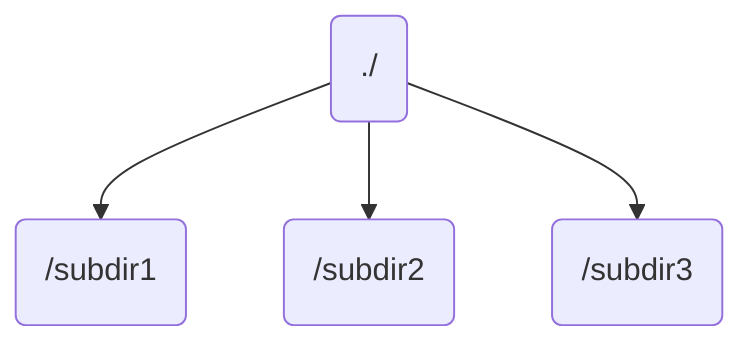
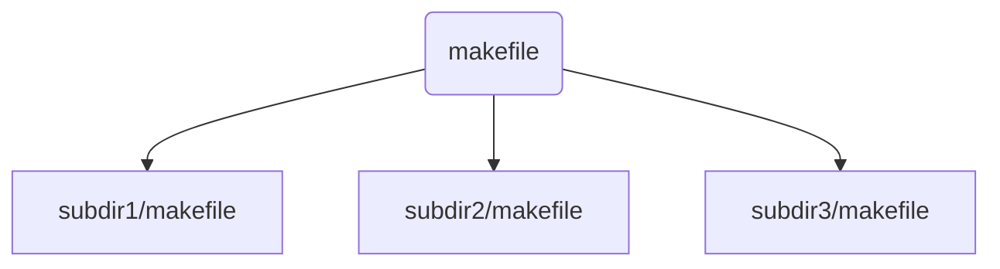
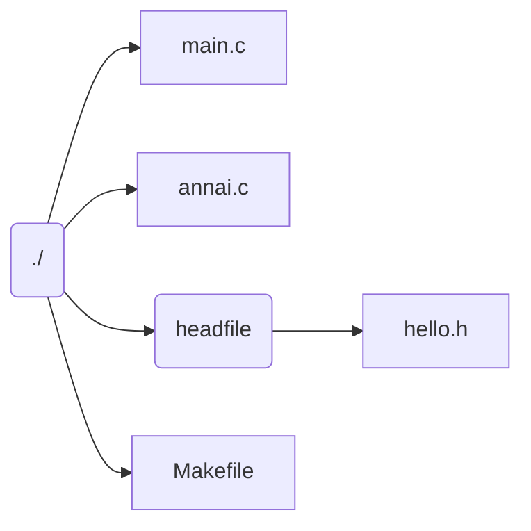

# 1.4 Makefile

C源代码到可执行二进制文件，需要编译。当有一个非常大的工程包，工程包里有很多需要编译的代码并且这些代码之间存在特殊的依赖关系的时候，该怎么办呢？是一个一个gcc编译？肯定不是！不用烦恼，MakeFile就是干这个的。

## 1.  MakeFile基础

编译：把源代码编译成二进制文件  
链接：把二进制文件链接成一个可执行文件

**Makefile的作用**

自动化的完成编译和链接的过程。

**MakeFile文件** 

- 描述了整个工程的编译、链接规则

  - 工程中的哪些源文件需要编译以及如何编译
  - 需要创建哪些库文件以及如何创建这些库文件
  - 如何产生期望得到的最终可执行文件`

- 自动化编译器配置文件可以起以下名字：

  - Makefile或者makefile

  **注意：不能写成MakeFile**

  - 在Linux命令行提示符输入make，它会在当前目录下按顺序寻找GNUmakefile、Makefile和makefile，如未找到则报错，找到则把Makefile文件中的第一个目标作为最终目标。

- make命令按照以上顺序在当前目录搜索
  也可使用别的文件名来书写makefile，此时make命令要加选择：-f
  例如： ` make –f conifg.mk`

- MakeFile的执行
  运行时，make会检测每个命令的执行的返回码，如果命令返回成功，make会执行下一条命令，否则make终止

- MakeFile命令构成 

  基本结构由描述规则组成，规则负责描述在何种情况下如何重建目标文件，通常规则中包括了目标的依赖关系和重建目标的命令。

- 规则：

  1）如果这个工程没有编译过，那么我们的所有C文件都要编译并被链接。

  2）如果这个工程的某几个C文件被修改，那么我们只编译被修改的C文件，并链接目标程序。

  3）如果这个工程的头文件被改变了，那么我们需要编译引用了这几个头文件的C文件，并链接目标程序。

只要Makefile写得够好，所有的这一切，我们只用一个make命令就可以完成，make命令会自动智能的根据当前的文件修改的情况来确定哪些文件需要重编译，从而自己编译所需要的文件和链接目标程序。

- 一个简单的Makefile描述规则如下

```bash
target...:prerequisites...
	command...
	...
```

target也就是一个目标文件，可以是Object File，也可以是执行文件。prerequisites就是，要生成那个target所需要的文件或是目标。command也就是make需要执行的命令。（任意的Shell命令）command**一定要以Tab键开始**，否者编译器无法识别command。

这是一个文件的依赖关系，也就是说，target这一个或多个的目标文件依赖于prerequisites中的文件，其生成规则定义在command中。说白一点就是说，prerequisites中如果有一个以上的文件比target文件要新的话，command所定义的命令就会被执行。这就是Makefile的规则。也就是Makefile中最核心的内容。

**例子**

```bash
myapp：main.o my.o
	gcc...
main.o: main.c a.h
	gcc...
my.o: my.c b.h
	gcc...
```

依赖关系：它表示目标`myapp`依赖于`main.o`和`my.o`，`main.o`依赖于`main.c`和`a.h`。这组依赖关系形成一个层次结构，它显示了源文件之间的关系，如果`a.h`发生了变化，就需要重新编译`main.o`。

- make命令按照以上顺序在当前目录搜索
也可使用别的文件名来书写makefile，此时make命令要加选择：-f
例如： ` make –f conifg.mk`

- MakeFile的执行
运行时，make会检测每个命令的执行的返回码，如果命令返回成功，make会执行下一条命令，否则make终止

**例子**

1. 对比gcc编译：`gcc hello.c –o hello`与Makefile方式：使用GNU make工具编译程序：`make`，需要编写Makefile，内容如下：

```shell
#Makefile的内容
hello:hello.c
	gcc hello.c -o hello
```

2. 两种方式的区别？

- gcc是编译器，make不是。make是依赖于Makefile来编译多个源文件的工具，在Makefile里同样是用gcc(或者别的编译器)来编译程序。

- gcc是编译一个文件，make是编译多个源文件的工程文件的工具。 

- make是一个命令工具，是一个解释makefile中指令的命令工具。

makefile

```bash
gcc hello.c -o hello
```

当你输入命令make时，会自动运行命令`gcc hello.c -o hello`。

## 2. 文件优化

Makefile的写法远远不止上面所讲的把依赖关系说明那么简单，Makefile里主要包含显式规则、隐晦规则、变量定义、文件指示和注释。

1. 显式规则。显式规则说明了，如何生成一个或多的的目标文件。这是由Makefile的书写者明显指出，要生成的文件，文件的依赖文件，生成的命令。

2. 隐晦规则。由于我们的make有自动推导的功能，所以隐晦的规则可以让我们比较粗糙地简略地书写Makefile，这是由make所支持的。

3. 变量的定义。在Makefile中我们要定义一系列的变量，变量一般都是字符串，这个有点你C语言中的宏，当Makefile被执行时，其中的变量都会被扩展到相应的引用位置上。

4. 文件指示。其包括了三个部分，一个是在一个Makefile中引用另一个Makefile，就像C语言中的`include`一样；另一个是指根据某些情况指定Makefile中的有效部分，就像C语言中的预编译`#if`一样；还有就是定义一个多行的命令。有关这一部分的内容，我会在后续的部分中讲述。

5. 注释。Makefile中只有行注释，和UNIX的Shell脚本一样，其注释是用`#`字符，这个就像C/C++中的`//`一样。如果你要在你的Makefile中使用`#`字符，可以用反斜框进行转义，如：`\#`。

## 3. 宏

宏值符号

```
=
：=
+=
```

**注意：赋值符号前面除了空格之外，不能有制表符或其他分隔符，否则make会把它作为宏名的一部分。**

宏的引用格式有两种

**$(宏名)**或者**${宏名}**

**示例**

```shell
objects= main.o my.o
CC=gcc
myapp: $(objects)
	$(CC) –o myapp $(objects)
main.o: main.c a.h
	$(CC) –c main.c 
my.o : my.c b.h
	$(CC) –c my.c 
clean:
	rm myapp $(objects)
```

**宏定义使用的地方：**

可以在三种地方对宏进行定义：

- 第一是在Makefile中

- 第二是在Makefile命令行中

- 第三是在载入环境中。类似于属性的控制

  这几种宏的定义也要区分优先级。Make在处理Makefile时，它将先给内定义的宏赋值，再给载入的shell宏赋值，然后给Makefile中的宏赋值，最后才处理make命令行中的宏定义

## 4. 隐晦规则

GNU的make很强大，它可以自动推导文件以及文件依赖关系后面的命令，于是我们就没必要去在每一个`[.o]`文件后都写上类似的命令，因为，我们的`make`会自动识别，并自己推导命令。只要`make`看到一个`[.o]`文件，它就会自动的把`[.c]`文件加在依赖关系中，如果make找到一个`whatever.o`，那么`whatever.c`，就会是`whatever.o`的依赖文件。并且`cc -c whatever.c`也会被推导出来，于是，我们的`Makefile`再也不用写得这么复杂。

我们一起看一个示例

```shell
objects= main.o my.o
CC=gcc
myapp: $(objects)
	$(CC) –o myapp $(objects)
main.o:main.c a.h
my.o:my.c b.h
clean:
	rm myapp $(objects)
```

## 5. 清空目标文件的规则

每个Makefile中都应该写一个清空目标文件（.o和执行文件）的规则，这不仅便于重编译，也很利于保持文件的清洁。一般的风格都是

```bash
clean:
rm myapp $(objects)
```

命令使用

```bash
make clean
```

就会删除clean规定的内容

makefile

```bash
CFLAGS = -g -Wall -I/home/xxx/makefile/make/3/include
SRC = /home/xxx/makefile/make/3/src/myfun.c
hello : hello.o myfun.o
        gcc hello.o myfun.o  -o  hello
hello.o : hello.c
        gcc $(CFLAGS) -c hello.c -o hello.o
myfun.o : ./src/myfun.c
        gcc $(CFLAGS) -c $(SRC) -o myfun.o

clean :
        rm -f *.o hello
```

```shell
make clean
rm -f *.o hello
```

但是当你创建一个clean目录时，这个命令将不起作用，因为，`clean`作为一个伪目标其实也相当是一个文件。我们有更好的方法：

```shell
.PHONY : clean
clean :
-rm myapp $(objects)
```

.PHONY意思表示`clean`是一个`伪目标`，而在`rm`命令前面加了一个小减号的意思就是，也许某些文件出现问题，但不要管，继续做后面的事。当然，`clean`的规则不要放在文件的开头，不然，这就会变成`make`的默认目标，相信谁也不愿意这样。不成文的规矩是——`clean`从来都是放在文件的最后。

## 6. 多个源码文件的单Makefile

GNU make中有一些内置或**隐含的规则**，这些规则定义了如何从不同的依赖文件建立特定类型的目标。

GNU make支持两种类型的隐含规则：

1. **后缀规则：** 是定义隐含规则的老风格方法。后缀规则定义了将一个一个具有某个后缀的文件转换具有另外一个后缀的文件的方法。每个后缀规则以两个承兑出现的后缀名定义，例如，将.c文件转换为.o文件的后缀规则可以定义为：

```shell
.c.o:
$(CC) $(CCFLAGS) $(CPPFLAGS) –c –o $@ $<
```

2. **模式规则：** 这种规则更加通用，因为可以利用这种模式规则定义更加复杂的依赖规则。模式规则看起来更加类似于正则规则，但在目标名称的前面多了一个%号，同时可以用来定义目标和依赖文件之间的关系，例如下面的模式规则定义了如何将任意一个X.c文件转换为X.o文件：

```shell
%.c:%.o
	$(CC) $(CCFLAGS) $(CPPFLAGS) –c –o $@ $<
```

**文件引用：** 

在`Makefile`中使用`include`关键字可以把别的`Makefile`包含进来，这很像C语言中的`#include`，被包含的文件会原模原样的放在当前文件的包含位置。

例如有这样几个`Makefile`：`a.mk b.mk c.mk`，还有这样一个文件`foo.make`，以及一个变量`$(bar)`，其中包含了`e.mk`和`f.mk`，那么下面的语句：

```bash
include foo.make *.mk $(bar)
```

等价于

```bash
include foo.mk a.mk b.mk c.mk e.mk f.mk
```

`make`命令开始时会找寻`include`所指出的其他`Makefile`，并把内容安置在当前位置。如果文件没有指定绝对路径或相对路径的话，`make`首先会在当前目录下寻找，如果当前目录下没找到，那么，`make`会在下面的几个目录寻找：

1. 如果make执行时，有`--I`或`--include-dir`参数，那么`make`就会在这个参数指定的目录下寻找
2. 如果目录`/include`，一般是`/usr/local/bin`或`/usr/include`，存在的话，`make`会去找。

如果文件没有找到的话，make会生成一条警告信息，但不会马上出现致命错误，它会继续载入其他的文件，一旦完成Makefile的读取，make会在重试这些没有找到的，或是不能读取的文件，如果还是不行，make才会出现一条致命信息。

**Makefile中的函数：** 

在Makefile中可以使用函数来处理变量，从而让命令和规则更为灵活和具有智能，函数调用很像变量的使用，也是以`$`来标示的，函数调用后，函数的返回值可以当做变量来使用。

例如`wildcard`函数，可以展开成一列所有符合由其参数描述的文件名。文件间以空格间隔，语法如下：

```shell
$(wildcard PARTERN…)
```

用`wildcard`函数找出目录中所有的`.c`文件

```shell
：sources=$(wildcard *.c)
```

。实际上，GNU make还有许多如字符串处理函数，文件名操作函数等其他函数。

**make的执行：** 

一般来说，最简单的就是直接在命令行下输入`make`命令，GNU make找寻默认的`Makefile`的规则是在当前目录下一次找到三个文件——`GNUmakefile`，`makefile`和`Makefile`。按顺序找这三个文件，一旦找到，就开始读取文件并执行，也可以给`make`命令指定一个特殊名字的`Makefile`，要达到这个功能，要求使用`make`的`-f`或是`--file`参数，例如：

```shell
make –f hello.makefile
```

## 7. 实例练习

在这个例子中，我们会看到一份主程序代码`main.c`、三份函数代码`getop.c、stack.c、getch.c`以及一个头文件`calc.h`，代码内容同学们可以自行设计，例如`main.c`依此调用`getop.c、stack.c、getch.c`中提供的各一个函数。通常情况下，我们需要这样编译它：

```
gcc -o calc main.c getch.c getop.c stack.c 
```

如果没有makefile，在开发+调试程序的过程中，我们就需要不断地重复输入上面这条编译命令，要不就是通过终端的历史功能不停地按上下键来寻找最近执行过的命令。这样做两个缺陷：

1. 一旦终端历史记录被丢失，我们就不得不从头开始；
2. 任何时候只要我们修改了其中一个文件，上述编译命令就会重新编译所有的文件，当文件足够多时这样的编译会非常耗时。

那么Makefile又能做什么呢？我们先来看一个最简单的makefile文件：

```
calc: main.c getch.c getop.c stack.c
    gcc -o calc main.c getch.c getop.c stack.c 
```

现在你看到的就是一个最基本的Makefile语句，它主要分成了三个部分，第一行冒号之前的`calc`，我们称之为目标`target`，被认为是这条语句所要处理的对象，具体到这里就是我们所要编译的这个程序`calc`。冒号后面的部分`main.c  getch.c getop.c  stack.c`，我们称之为依赖关系表，也就是编译`calc`所需要的文件，这些文件只要有一个发生了变化，就会触发该语句的第三部分，我们称其为命令部分，相信你也看得出这就是一条编译命令。现在我们只要将上面这两行语句写入一个名为`Makefile`或者`makefile`的文件，然后在终端中输入`make`命令，就会看到它按照我们的设定去编译程序了。

> 请注意，在第二行的“gcc”命令之前必须要有一个tab缩进。语法规定Makefile中的任何命令之前都必须要有一个tab缩进，否则make就会报错。

接下来，让我们来解决一下效率方面的问题，先初步修改一下上面的代码：

```
cc = gcc
prom = calc
source = main.c getch.c getop.c stack.c
 
$(prom): $(source)
    $(cc) -o $(prom) $(source)
```

如你所见，我们在上述代码中定义了三个常量`cc、prom以及source`。它们分别告诉了make我们要使用的编译器、要编译的目标以及源文件。这样一来，今后我们要修改这三者中的任何一项，只需要修改常量的定义即可，而不用再去管后面的代码部分了。

> 请注意，很多教程将这里的cc、prom和source称之为变量，个人认为这是不妥当的，因为它们在整个文件的执行过程中并不是可更改的，作用也仅仅是字符串替换而已，非常类似于C语言中的宏定义。或者说，事实上它就是一个宏。

但我们现在依然还是没能解决当我们只修改一个文件时就要全部重新编译的问题。而且如果我们修改的是calc.h文件，make就无法察觉到变化了（所以有必要为头文件专门设置一个常量，并将其加入到依赖关系表中）。下面，我们来想一想如何解决这个问题。考虑到在标准的编译过程中，源文件往往是先被编译成目标文件，然后再由目标文件连接成可执行文件的。我们可以利用这一点来调整一下这些文件之间的依赖关系：

```makefile
cc = gcc
prom = calc
deps = calc.h
obj = main.o getch.o getop.o stack.o
 
$(prom): $(obj)
    $(cc) -o $(prom) $(obj)

main.o: main.c $(deps)
    $(cc) -c main.c

getch.o: getch.c $(deps)
    $(cc) -c getch.c

getop.o: getop.c $(deps)
    $(cc) -c getop.c

stack.o: stack.c $(deps)
    $(cc) -c stack.c                
```

这样一来，上面的问题显然是解决了，但同时我们又让代码变得非常啰嗦，啰嗦往往伴随着低效率，是不祥之兆。经过再度观察，我们发现所有.c都会被编译成相同名称的.o文件。我们可以根据该特点再对其做进一步的简化：

```makefile
cc = gcc
prom = calc
deps = calc.h
obj = main.o getch.o getop.o stack.o

$(prom): $(obj)
    $(cc) -o $(prom) $(obj)

%.o: %.c $(deps)
    $(cc) -c $< -o $@
```

在这里，我们用到了几个特殊的宏。首先是`%.o:%.c`，这是一个模式规则，表示所有的.o目标都依赖于与它同名的.c文件（当然还有`deps`中列出的头文件）。再来就是命令部分的`$<和$@`，其中`$<`代表的是依赖关系表中的第一项（如果我们想引用的是整个关系表，那么就应该使用`$^`），具体到我们这里就是`%.c`。而`$@`代表的是当前语句的目标，即`%.o`。这样一来，`make`命令就会自动将所有的`.c`源文件编译成同名的`.o`文件。不用我们一项一项去指定了。整个代码自然简洁了许多。

到目前为止，我们已经有了一个不错的makefile，至少用来维护这个小型工程是没有什么问题了。当然，如果要进一步增加上面这个项目的可扩展性，我们就会需要用到一些`Makefile`中的伪目标和函数规则了。例如，如果我们想增加自动清理编译结果的功能就可以为其定义一个带伪目标的规则；

```makefile
cc = gcc
prom = calc
deps = calc.h
obj = main.o getch.o getop.o stack.o

$(prom): $(obj)
    $(cc) -o $(prom) $(obj)

%.o: %.c $(deps)
    $(cc) -c $< -o $@

clean:
    rm -rf $(obj) $(prom)
```

有了上面最后两行代码，当我们在终端中执行`make clean`命令时，它就会去删除该工程生成的所有编译文件。

另外，如果我们需要往工程中添加一个`.c或.h`，可能同时就要再手动为`obj`常量再添加第一个`.o`文件，如果这列表很长，代码会非常难看，为此，我们需要用到Makefile中的函数，这里我们演示两个：

```makefile
cc = gcc
prom = calc
deps = $(shell find ./ -name "*.h")
src = $(shell find ./ -name "*.c")
obj = $(src:%.c=%.o) 

$(prom): $(obj)
    $(cc) -o $(prom) $(obj)

%.o: %.c $(deps)
    $(cc) -c $< -o $@

clean:
    rm -rf $(obj) $(prom)
```

其中，shell函数主要用于执行shell命令，具体到这里就是找出当前目录下所有的`.c和.h`文件。而`$(src:%.c=%.o)`则是一个字符替换函数，它会将src所有的`.c`字串替换成`.o`，实际上就等于列出了所有`.c`文件要编译的结果。有了这两个设定，无论我们今后在该工程加入多少`.c`和`.h`文件，Makefile都能自动将其纳入到工程中来。

## 7. 多目录/多源码文件的单Makefile

**相关知识**

一些大的工程中,有大量的源文件，我们通常的做法是把这许多的源文件分类,并存放在不同的目录中。所以当 `make`需要去找寻文件的依赖关系时，你可以在文件前加上路径,但最好的方法是把一个路径告诉`make`，让`make`在自动去找。

Makefile文件中的特殊变量`VPATH`就是完成这个功能的。如果没有指明这个变量，`make`只会在当前的目录中去找寻依赖文件和目标文件。如果定义了这个变量，那么`make`就会在当前目录找不到的情况下，到所指定的目录中去找寻文件了。

```shell
VPATH = src:../headers
```

上面的的定义指定两个目录,`src`和`../headers`,make 会按照这个顺序进行搜索。目录由`冒号`分隔。

另一个设置文件搜索路径的方法是使用make 的`vpath`关键字,这不是变量,这是一个make的关键字,这和上面提到的那个`VPATH`变量很类似,但是它

更为灵活。 它可以指定不同的文件在不同的搜索目录中。这是一个很灵活的功能。 它的使用方

法有三种：

```makefile
vpath <pattern>  <directories>
```

为符合模式的文件指定搜索目录。

```makefile
vpath <pattern>
```

清除符合模式的文件的搜索目录。

```makefile
vpath
```

清除所有已被设置好了的文件搜索目录。

`vapth`使用方法中的需要包含`%`字符。`%`的意思是匹配零或若干字符，例如`%.h`表示

所有以`.h`结尾的文件。指定了要搜索的文件集,而则指定了的文件集的搜索的目录。例如：

```
vpath %.h ../headers
```

该语句表示,要求 make 在`../headers`目录下搜索所有以`.h`结尾的文件。(如果某文件在当前目录没有找到的话)

我们可以连续地使用`vpath`语句,以指定不同搜索策略。如果连续的`vpath`语句中出现了相同的，或是被重复了的，那么`make`会按照`vpath`语句的先后顺序来执行搜索。如：

```shell
vpath %.c foo
vpath % blish
vpath %.c bar
```

其表示“.c”结尾的文件,先在`foo`目录,然后是`blish`,最后是`bar`目录。

```shell
vpath %.c foo:bar
vpath % blish
```

而上面的语句则表示`.c`结尾的文件,先在`foo`目录,然后是`bar`目录,最后才是`blish`目录。

**一些变量的含义：**

**变量定义：**

**$^**

所有的依赖目标的集合。以空格分隔。如果在依赖目标中有多个重复的，那个这个变量

会去除重复的依赖目标，只保留一份。

 **$@**

表示规则中的目标文件集。在模式规则中，如果有多个目标，那么，"$@"就是匹配于

目标中模式定义的集合

 **$?**

所有比目标新的依赖目标的集合。以空格分隔。

**$<**

依赖目标中的第一个目标名字。如果依赖目标是以模式（即`%`）定义的，那么`$<`将

是符合模式的一系列的文件集。注意，其是一个一个取出来的。

**示例：**

1. main.c test.c test1.c test2.c

```bash
gcc -c $< -o $@
```

把所以的c文件编译生成对应的`.o`文件，`$<`代表每次取的c文件，`$@`代表每次c文件对应的目标文件

2. main: main.o test.o test1.o test2.o

```shell
gcc -o $@ $^
```

把所有的o文件编译生成可执行的main文件，`$^`代表所以的依赖文件集合`（main.o  test.o  test1.o  test2.o）`，@代表目标文件`（main）`

3. lib: test.o test1.o test2.o

```shell
ar r lib &?
```

把有更新的依赖文件重新打包到库lib中， 如果只有test1.o更新，则$?代表test1.o， 如果test.o  test1.o都有更新，则$?代表test.o  test1.o的集合。

**$(@D)**

表示`$@`的目录部分（不以斜杠作为结尾） ，如果`$@`值是`dir/foo.o`，那么`$(@D)`就

是`dir`，而如果`$@`中没有包含斜杠的话，其值就是`.`（当前目录） 。

**$(@F)**

表示`$@`的文件部分，如果"$@"值是`dir/foo.o`，那么`$(@F)`就是`foo.o`，`$(@F)`相

当于函数`$(notdir $@)`

## 8. 多目录/多源码文件的多Makefile

**相关知识** 

```
嵌套执行make
在一些大的工程中，不同模块或是不同功能的源文件放在不同的目录下，可以在每一个目录中都写一个该目录下的Makefile，这有利于Makefile变得更加地简洁，而不至于把所有的东西都写在同一个Makefile中，这项技术对于进行模块编译和分段编译有着非常大的好处。
```

例如，有一个子目录叫`subdir`，这个目录下有个Makefile文件指明了这个目录下的变异规则。那么总控的Makefile可以这么写：

```shell
subsystem：
	cd subdir && $(MAKE)
```

假如有一个这样的目录结构的工程：



那么他的makefile文件分布应该如下：



也就是每一个目录下都有一个makefile。

而总控的makefile应该这样写：

```makefile
.PHONY: both
both: a b c
a: 
	gcc a.c -o a
b:
	cd subdir1;make
c:
	cd subdir2;make 
```

subdir1/makefile:

```makefile
b:b.c
	gcc b.c -o b
```

subdir2/makefile;

```makefile
c:c.c
	gcc c.c - o c
```

**练习3**

多个目录下，多个源文件的单个Makefile的编写。

目录结构如下：



代码：

```c
//main.c
#include<stdio.h>
#include"hello.h"
int main()
{
        printf("hello!\n");
        annai("ka mi na ri");
        return 0;
}
```

```c
//annai.c
#include<stdio.h>
#include"hello.h"

void annai(const char* name)
{
        printf("Ko ni chi wa! %s san\n",name);
}
```

```c
//hello.h
#ifndef _HELLO_H_
#define _HELLO_H_
#include<stdio.h>
#include<stdlib.h>
void annai(const char* naiyou);
#endif
```

答案：

```makefile
CFLAGS=-c -g -Wall -I headfile
hello:main.o annai.o
        gcc main.o annai.o -o hello
main.o:main.c
        gcc ${CFLAGS} main.c -o main.o
annai.o:annai.c
        gcc ${CFLAGS} annai.c -o annai.o
.PHONY: clean
clean:
        rm *.o hello 
```
## 9. CMake简介

Cmake是一个编译、构建工具。使用CMakeLists.txt来描述构建过程，可以生成标准的构建文件，如Makefile。一般先编写CMakeLists.txt，然后通过cmake来生成Makefile，最后执行make进行编译。

### 9.1 Cmake安装

 在[Ubuntu](https://www.linuxidc.com/topicnews.aspx?tid=2)上安装cmake非常简单，执行sudo apt-get install cmake即可。如果想安装最新的cmake版本，就需要自己进行源码编译安装。源码下载路径：https://cmake.org/download。

### 9.2 查看Cmake版本

cmake安装完成后，执行cmake --version，即可查看cmake的版本号。我的是3.5.1

## 10. CMake的使用流程

- 编写`CMakeLists.txt`
- 执行`cmake`，一般在工程根目录下`mkdir build;cd build;`然后执行`cmake .`这样的目的是为了保证源码不会污染
- 执行`make`进行编译

## 11.  CMake示例

这里给出一个简单的使用cmake进行构建的工程示例，目录结构如下:

test01
​ ├── build
​ ├── CMakeLists.txt
​ └── main.c

main.c文件如下:

```c
#include <stdio.h>

int main(int argc, char** argv)
{
    printf("hello cmake\n");

    return 0;
}
```

CMakeLists.txt内容如下:

```cmake
#设置cmake的最小版本
CMAKE_MINIMUM_REQUIRED(VERSION 2.6)
#设置项目名称
project(test01)
#设置源文件
aux_source_directory(. dir_srcs)
#设置可执行程序
add_executable(test01 ${dir_srcs})
```

我这里mkdir 了build 目录，

cd build

cmake ..

make

最后就会在当前目录下看到生成的test01可执行程序。

接下来，对上例中的CMakeLists.txt的语法进行解释。

- CMakeLists.txt 的语法比较简单,由命令、注释和空格组成,其中**命令是不区分大小写**的,**符号"#"后面的内容被认为是注释**。

  > Call the [`cmake_minimum_required()`](https://cmake.org/cmake/help/v3.13/command/cmake_minimum_required.html#command:cmake_minimum_required) command at the beginning of the top-level `CMakeLists.txt` file even before calling the `project()` command. It is important to establish version and policy settings before invoking other commands whose behavior they may affect. See also policy [`CMP0000`](https://cmake.org/cmake/help/v3.13/policy/CMP0000.html#policy:CMP0000).

- cmake_minimun_required

  格式`cmake_minimum_required(VERSION <min>[...<max>][FATAL_ERROR])`

  设置该工程的`cmake`最低支持版本，注意`VERSION`不能写成小写，否则会报`cmake_minimum_required called with unknown argument "version"`.

- project

  > ```
  > project(<PROJECT-NAME> [LANGUAGES] [<language-name>...])
  > project(<PROJECT-NAME>
  >         [VERSION <major>[.<minor>[.<patch>[.<tweak>]]]]
  >         [DESCRIPTION <project-description-string>]
  >         [HOMEPAGE_URL <url-string>]
  >         [LANGUAGES <language-name>...])
  > ```

- aux_source_directory

  > ```
  > aux_source_directory(<dir> <variable>)
  > ```

  Find all source files in a directory.Collects the names of all the source files in the specified directory and stores the list in the

- add_executable

  > ```
  > add_executable(<name> [WIN32] [MACOSX_BUNDLE]
  >                [EXCLUDE_FROM_ALL]
  >                [source1] [source2 ...])
  > ```

  将源文件编译成可执行程序

## 11. catkin_make 与cmake

程序在`cmake`编译的流程： `cmake`指令依据你的`CMakeLists.txt `文件,生成makefiles文件,make再依据此makefiles文件编译链接生成可执行文件.

catkin_make是将cmake与make的编译方式做了一个封装的指令工具, 规范了工作路径与生成文件路径.

#### 11. cmake标准流程

```
 $ mkdir build  
$ cd build  
$ cmake ..  
$ make  
$ make install  # (可选)  
```

#### 11.2 catkin_make 的流程

```
# In a catkin workspace  $ catkin_make  
$ catkin_make install  # (可选)  
如果源码不在默认工作空间,需要指定编译路径:  
  
# In a catkin workspace  
$ catkin_make --source my_src  
$ catkin_make install --source my_src  # (optionally) 
```

## 12. catkin_make

### 12.1 catkin_make默认的路径信息

```
catkin_make运行后终端输出文件部分解析  
  
#基本路径  
Base path: /home/user/catkin_ws  
Source space: /home/user/catkin_ws/src   
Build space: /home/user/catkin_ws/build  
Devel space: /home/user/catkin_ws/devel  
Install space: /home/user/catkin_ws/install  
  
  
#catkin_make 封装运行中cmake运行的情况  
Running command: "cmake /home/user/catkin_ws/src -DCATKIN_DEVEL_PREFIX=/home/user/catkin_ws/devel   
-DCMAKE_INSTALL_PREFIX=/home/user/catkin_ws/install" in "/home/user/catkin_ws/build"    
  
#编译工具查找  
-- Using CATKIN_DEVEL_PREFIX: /tmp/catkin_ws/devel  
-- Using CMAKE_PREFIX_PATH: /opt/ros/groovy  
-- This workspace overlays: /opt/ros/groovy  
  
#编译的包  
<pre name="code" class="cpp">#catkin_make 封装运行中make运行的情况
```

`Running command: "make -j4" in "/home/user/catkin_ws/build"`


### 12.2  ros工作空间

```
    workspace_folder/        --WORKSPACE  工作空间
      src/                   --SOURCE SPACE  源空间
        CMakeLists.txt/      --This is symlinked to catkin/cmake/toplevel.cmake  
        package_1/  
          CMakeLists.txt  
          package.xml  
        ...  
        package_n/  
          CMakeLists.txt  
          package.xml  
      build/                 --BUILD SPACE 编译空间 (this is where build system is invoked, not necessarily within workspace)  
        CATKIN_IGNORE        --Marking the folder to be ignored when crawling for packages (necessary when source   
                                space is in the root of the workspace, the file is emtpy)  
                                #此选项可用于忽略某个包编译  
     devel/                 --DEVEL SPACE 开发空间(targets go here, parameterizable, but defaults to peer of Build Space)  
                               # 生成二值 库 可执行文件   
        bin/  
        etc/  
        /include/  
        lib/  
        share/  
        .catkin              --Marking the folder as a development space (the file contains a semicolon separated list of Source space paths)  
                                #  
        env.bash  
        setup.bash  
        setup.sh  
        ...  
      install/               --INSTALL SPACE 安装空间[-DCMAKE_INSTALL_PREFIX=/any/directorycmake默认是/usr/local](this is where installed targets for test installations go, not necessarily within workspace)  
        bin/  
        etc/  
        include/  
        lib/  
        share/  
        .catkin              --Marking the folder as an install space (the file is emtpy)  
        env.bash  
        setup.bash    -- Environment setup file for Bash shell  
        setup.sh      -- Environment setup file for Bourne shell   
        ...  
      
      
    /  系统安装空间         /opt/ros/ROSDISTRO
      opt/  
        ros/  
          groovy/  
            setup.bash -- Environment setup file for Bash shell  
            setup.sh   -- Environment setup file for Bourne shell  
            setup.zsh  -- Environment setup file for zshell  
            ...  结果空间    source RESULT-SPACE/setup.sh     类似扫描安装空间与开发空间,替换系统通用下的对应文件.
```
catkin_make小结

```
src/       --SOURCE SPACE  源空间
build/     --BUILD SPACE 编译空间
devel/     --DEVEL SPACE 开发空间
/opt/ros/kinetic  --ROS系统安装空间
```

### 12.3 Overlays]

catkin支持包的逐层覆盖, 当前最高,其它依据source的顺序逐层变高, 高层可覆盖低层.  

```bash
Example 4: Overlaying workspace 3 on top of local workspace2 install space on top of workspace1 devel space on top of system install  
      
cd ~/workspace2/build  
cmake -DCMAKE_INSTALL_PREFIX=~/ws2_installed ../src  
make  
make install  
      
source ~/ws2_installed/setup.bash  
      
cd ~/workspace3/build  
cmake ../src  
make  
```

ros 环境变量设置 可以参考

```bash
source /opt/ros/kinetic/setup.bash    
source /home/yhzhao/slam_ws/devel/setup.bash    
    
export ROS_PACKAGE_PATH=~/slam_ws/src:$ROS_PACKAGE_PATH    
export ROS_WORKSPACE=~/slam_ws/src    
```

### 12.4  catkin_make编译指定的包

`$ catkin_make -DCATKIN_WHITELIST_PACKAGES="package1;package2"`

恢复编译所有的包

`$ catkin_make -DCATKIN_WHITELIST_PACKAGES=""`

**3. 对这句命令进行解释：**

```
catkin build rovio --cmake-args -DCMAKE_BUILD_TYPE=Release -DMAKE_SCENE=ON
```

**catkin build – Build Packages，编译rovio包**

如果工作空间未初始化，可以自动完成工作空间初始化 （`source ~/catkin_ws/devel/setup.bash）`
It  is used to build one or more packages in a catkin workspace. If a  workspace is not yet initialized（初始化）, build can initialize it with the  default configuration（默认配置）, but only if it is called from the workspace  root. Specific workspaces can also be built from arbitrary working  directories with the --workspace option.

```cmake
--cmake-args    #cmake参数-DCMAKE_BUILD_TYPE=Release
```

使用 CMake我们可以生成 debug 版和 release 版的程序。debug 版的项目生成的可执行文件需要有调试信息并且不需要进行优化,而 release 版的不需要调试信息但需要优化。这些特性在 gcc/g++ 中是通过编译时的参数来决定的,如果将优化程度调到最高需要设置参数-O3,最低是 -O0 即不做优化;添加调试信息的参数是 -g -ggdb ,如果不添加这个参数,调试信息就不会被包含在生成的二进制文件中。

CMake 中有一个变量 CMAKE_BUILD_TYPE ,可以的取值是 Debug、 Release、 RelWithDebInfo 和 MinSizeRel。当这个变量值为 Debug 的时候,CMake 会使用变量 CMAKE_CXX_FLAGS_DEBUG 和 CMAKE_C_FLAGS_DEBUG 中的字符串作为编译选项生成 Makefile ,当这个变量值为 Release 的时候,工程会使用变量 CMAKE_CXX_FLAGS_RELEASE 和 CMAKE_C_FLAGS_RELEASE 选项生成 Makefile。

现假设项目中只有一个文件 main.cpp ,下面是一个可以选择生成 debug 版和 release 版的程序的 CMakeList.txt 

```cmake
PROJECT(main)
CMAKE_MINIMUM_REQUIRED(VERSION 2.6) 
SET(CMAKE_SOURCE_DIR .) 
SET(CMAKE_CXX_FLAGS_DEBUG "$ENV{CXXFLAGS} -O0 -Wall -g -ggdb")    SET(CMAKE_CXX_FLAGS_RELEASE "$ENV{CXXFLAGS} -O3 -Wall") AUX_SOURCE_DIRECTORY(. DIR_SRCS) 
ADD_EXECUTABLE(main ${DIR_SRCS}) 
```
