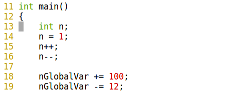

# 1.5 GDB

本讲知识点
1. GDB参数
2. GDB程序调试方法

GDB是一个由GNU开源组织发布的、Unix/Linux操作系统下的、基于命令行的、功能强大的程序调试工具。GDB中的命令固然很多，但我们只需掌握其中十个左右的命令，就大致可以完成日常的基本的程序调试工作。

| 命令                                                         | 解释                                                         | 示例                                                         |
| ------------------------------------------------------------ | ------------------------------------------------------------ | ------------------------------------------------------------ |
| file                                                         | 加载被调试的可执行程序文件。因为一般都在被调试程序所在目录下执行GDB，因而文本名不需要带路径。 | (gdb) 			file gdb-sample                            |
| r                                                            | Run的简写，运行被调试的程序。如果此前没有下过断点，则执行完整个程序；如果有断点，则程序暂停在第一个可用断点处。 | (gdb) 			r                                          |
| c                                                            | Continue的简写，继续执行被调试程序，直至下一个断点或程序结束。 | (gdb) 			c                                          |
| b <行号> <br> b <函数名称> <br> b <函数名称> <br> b <代码地址> <br> d [编号] | b:Breakpoint的简写，设置断点。两可以使用“行号”“函数名称”“执行地址”等方式指定断点位置。其中在函数名称前面加“”，符号表示将断点设置在“由编译器生成的prolog代码处”。如果不了解汇编，可以不予理会此用法。<br>d: Delete breakpoint的简写，删除指定编号的某个断点，或删除所有断点。断点编号从1开始递增。 | (gdb) b 8 <br> (gdb) b main (gdb) <br> b \*main <br> (gdb) b \*0x804835c <br> (gdb) d |
| s,n                                                          | s: 执行一行源程序代码，如果此行代码中有函数调用，则进入该函数；<br>n:执行一行源程序代码，此行代码中的函数调用也一并执行。<br>s相当于其它调试器中的“Step Into (单步跟踪进入)”；n相当于其它调试器中的“StepOver (单步跟踪)”。这两个命令必须在有源代码调试信息的情况下才可以使用（GCC编译时使用“-g”参数）。 | <br> (gdb) s <br> (gdb) n                              |
| si,ni                                       | si命令类似于s命令，ni命令类似于n命令。所不同的是，这两个命令（si/ni）所针对的是汇编指令，而s/n针对的是源代码。 | <br> (gdb) si <br> (gdb) ni                           |
| p <变量名称>                         | Print的简写，显示指定变量（临时变量或全局变量）的值。 | (gdb) p i <br> (gdb) p nGlobalVar                 |
| display <br> undisplay <编号> | display，设置程序中断后欲显示的数据及其格式。例如，如果希望每次程序中断后可以看到即将被执行的下一条汇编指令，可以使用命令“display /i $pc 其中 $pc 代表当前汇编指令， /i 表示以十六进行显示。当需要关心汇编代码时，此命令相当有用。 undispaly，取消先前的display设置，编号从1开始递增。 | <br> (gdb) display /i $pc 			(gdb) 			undisplay 1 |
| i                                                        | Info的简写，用于显示各类信息，详情请查阅“help i”。 | <br> (gdb) i r                                     |
| q                                                        | Quit的简写，退出 GDB调试环境。                | <br> (gdb) q                                      |
| help [命令名称]                      | GDB帮助命令，提供对GDB名种命令的解释说明。如果指定了“命令名称”参数，则显示该命令的详细说明；如果没有指定参数，则分类显示所有GDB命令，供用户进一步浏览和查询。| <br> (gdb) help display                           |

例子，gdb-sample.c

```c
#include <stdio.h>

int nGlobalVar = 0;

int tempFunction(int a, int b)
{
    printf("tempFunction is called, a = %d, b = %d /n", a, b);
    return (a + b);
}

int main()
{
    int n;
    n = 1;
    n++;
    n--;

    nGlobalVar += 100;
    nGlobalVar -= 12;

    printf("n = %d, nGlobalVar = %d /n", n, nGlobalVar);

    n = tempFunction(1, 2);
    printf("n = %d", n);

    return 0;
}
```

```bash
gcc gdb-sample.c -o gdb-sample -g
```

在上面的命令行中，使用 -o 参数指定了编译生成的可执行文件名为gdb-sample，使用参数 -g 表示将源代码信息编译到可执行文件中。如果不使用参数 -g，会给后面的GDB调试造成不便。当然，如果我们没有程序的源代码，自然也无从使用 -g 参数，调试/跟踪时也只能是汇编代码级别的调试/跟踪。

```
GNU gdb (Ubuntu 7.11.1-0ubuntu1~16.5) 7.11.1
Copyright (C) 2016 Free Software Foundation, Inc.
License GPLv3+: GNU GPL version 3 or later <http://gnu.org/licenses/gpl.html>
This is free software: you are free to change and redistribute it.
There is NO WARRANTY, to the extent permitted by law.  Type "show copying"
and "show warranty" for details.
This GDB was configured as "x86_64-linux-gnu".
Type "show configuration" for configuration details.
For bug reporting instructions, please see:
<http://www.gnu.org/software/gdb/bugs/>.
Find the GDB manual and other documentation resources online at:
<http://www.gnu.org/software/gdb/documentation/>.
For help, type "help".
Type "apropos word" to search for commands related to "word".
(gdb) 
```

上面最后一行`(gdb)`为GDB内部命令引导符，等待用户输入GDB命令。

```
(gdb) file gdb-sample 
Reading symbols from gdb-sample...done.
```

上面最后一行提示已经加载成功。

```
(gdb) r
Starting program: /home/lyx/demo/gdb-sample 
n = 1, nGlobalVar = 88 /ntempFunction is called, a = 1, b = 2 /nn = 3[Inferior 1 (process 19999) exited normally]
```

```
(gdb) b main
Breakpoint 1 at 0x40055d: file demo/demo2.c, line 14.
```

上面最后一行提示已经成功设置断点，并给出了该断点信息。在源文件`gdb-sample.c`第14行处设置断点；这是本程序的第一个断点，序号为1；断点处的代码地址为0x40055d（此值可能仅在本次调试过程中有效）。看源代码，第14行中的代码为`n= 1`，恰好是main函数中的第一个可执行语句，前面的“`int n;`为变量定义语句，并非可执行语句）



```
(gdb) r
Starting program: /home/lyx/demo/gdb-sample 

Breakpoint 1, main () at demo/demo2.c:14
14	    n = 1;
```

 程序中断在`gdb-sample.c`第14行处，即`main`函数是第一个可执行语句处。最后一行信息为下一条将要执行的源代码为`n = 1;`，它是源代码文件gdb-sample.c中的第14行。

```
(gdb) s
15	    n++;
```

上面的信息表示已经执行完`n= 1;`，并显示下一条要执行的代码为第20行的`n++;`。

```
(gdb) p n
$3 = 1
```

`n=1`，$1表示这是第一次使用`p`命令，再次执行`p n`将显示`$2= 1`，$3表示这是第三次使用`p`命令。

```
(gdb) b 20
Breakpoint 2 at 0x40058a: file demo/demo2.c, line 20.

(gdb) b tempFunction
Breakpoint 3 at 0x400534: file demo/demo2.c, line 7.
```

```
(gdb) c
Continuing.

Breakpoint 2, main () at demo/demo2.c:21
21	    printf("n = %d, nGlobalVar = %d /n", n, nGlobalVar);
(gdb) p nGlobalVar 
$4 = 88

(gdb) c
Continuing.

Breakpoint 3, tempFunction (a=1, b=2) at demo/demo2.c:7
7	    printf("tempFunction is called, a = %d, b = %d /n", a, b);
(gdb) p a
$5 = 1
(gdb) p b
$6 = 2

(gdb) c
Continuing.
n = 1, nGlobalVar = 88 /ntempFunction is called, a = 1, b = 2 /nn = 3[Inferior 1 (process 20313) exited normally]
```

`c`跳到断点或程序结束，程序正常退出。

有时候需要看到编译器生成的汇编代码，以进行汇编级的调试或跟踪，又该如何操作呢？

```
(gdb) display /i $pc
1: x/i $pc
<error: No registers.>
(gdb) r
Starting program: /home/lyx/demo/gdb-sample 

Breakpoint 1, main () at demo/demo2.c:14
14	    n = 1;
1: x/i $pc
=> 0x40055d <main+8>:	movl   $0x1,-0x4(%rbp)
```

看到了汇编代码，`n= 1;`”对应的汇编代码是`movl   $0x1,-0x4(%rbp)`。

```assembly
(gdb) si
15	    n++;
1: x/i $pc
=> 0x400564 <main+15>:	addl   $0x1,-0x4(%rbp)
(gdb) si
16	    n--;
1: x/i $pc
=> 0x400568 <main+19>:	subl   $0x1,-0x4(%rbp)
(gdb) si
18	    nGlobalVar += 100;
1: x/i $pc
=> 0x40056c <main+23>:	
    mov    0x200aca(%rip),%eax        # 0x60103c <nGlobalVar>
(gdb) si
0x0000000000400572	18	    nGlobalVar += 100;
1: x/i $pc
=> 0x400572 <main+29>:	add    $0x64,%eax
```

si命令类似于s命令，ni命令类似于n命令。所不同的是，这两个命令所针对的是汇编指令，而s/n针对的是源代码。

接下来我们试一下命令`b <函数名称>`。

```
(gdb) d
删除所有断点吗？ (y or n) y
(gdb) 
```

当被询问是否删除所有断点时，输入`y`并按回车键即可。

断点设置在main函数入口，`step in`显示对应下条程序对应的汇编代码。

```assembly
(gdb) b *main
Breakpoint 4 at 0x400555: file demo/demo2.c, line 12.
(gdb) r
The program being debugged has been started already.
Start it from the beginning? (y or n) y
Starting program: /home/lyx/demo/gdb-sample 

Breakpoint 4, main () at demo/demo2.c:12
12	{
1: x/i $pc
=> 0x400555 <main>:	push   %rbp
(gdb) si
0x0000000000400556	12	{
1: x/i $pc
=> 0x400556 <main+1>:	mov    %rsp,%rbp
(gdb) si
0x0000000000400559	12	{
1: x/i $pc
=> 0x400559 <main+4>:	sub    $0x10,%rsp
(gdb) si
14	    n = 1;
1: x/i $pc
=> 0x40055d <main+8>:	movl   $0x1,-0x4(%rbp)
(gdb) si
15	    n++;
1: x/i $pc
=> 0x400564 <main+15>:	addl   $0x1,-0x4(%rbp)
(gdb) si
16	    n--;
1: x/i $pc
=> 0x400568 <main+19>:	subl   $0x1,-0x4(%rbp)
(gdb) si
18	    nGlobalVar += 100;
1: x/i $pc
=> 0x40056c <main+23>:	
    mov    0x200aca(%rip),%eax        # 0x60103c <nGlobalVar>
```

```assembly
(gdb) i r
rax            0x400555	4195669
rbx            0x0	0
rcx            0x0	0
rdx            0x7fffffffd9e8	140737488345576
rsi            0x7fffffffd9d8	140737488345560
rdi            0x1	1
rbp            0x7fffffffd8f0	0x7fffffffd8f0
rsp            0x7fffffffd8e0	0x7fffffffd8e0
r8             0x400650	4195920
r9             0x7ffff7de7ac0	140737351940800
r10            0x846	2118
r11            0x7ffff7a2d740	140737348032320
r12            0x400430	4195376
r13            0x7fffffffd9d0	140737488345552
r14            0x0	0
r15            0x0	0
rip            0x40056c	0x40056c <main+23>
eflags         0x202	[ IF ]
cs             0x33	51
ss             0x2b	43
ds             0x0	0
es             0x0	0
fs             0x0	0

(gdb) i r eax
eax            0x400555	4195669

(gdb) q
A debugging session is active.

	Inferior 1 [process 20709] will be killed.

Quit anyway? (y or n) y
```

`(gdb) i r`显示寄存器中的当前值。`(gdb) i r eax`为显示寄存器`eax`存储的值。`(gdb) q`退出。

**练习1. 用gdb发现eg.c程序错误。**

这个程序将运行 10 次 for 循环，使用 'wib()" 函数计算出累积值，最后打印出结果。程序代码如下

```c
#include <stdio.h> 

int wib(int no1, int no2)
{
  int result, diff;
  diff = no1 - no2;
  result = no1 / diff;
  return result;
}

int main(int argc, char *argv[])
{
  int value, div, result, i, total;
  value = 10;
  div = 6;
  total = 0;
  for(i = 0; i < 10; i++)
  {
    result = wib(value, div);
    total += result;
    div++;
    value--;
  }
  printf("%d wibed by %d equals %d\n", value, div, total);
  return 0;
}
```

1. 编译

```
gcc -g eg.c -o eg
```

2. 运行gdb

```c
$ gdb
GNU gdb (Ubuntu 7.11.1-0ubuntu1~16.5) 7.11.1
Copyright (C) 2016 Free Software Foundation, Inc.
License GPLv3+: GNU GPL version 3 or later <http://gnu.org/licenses/gpl.html>
This is free software: you are free to change and redistribute it.
There is NO WARRANTY, to the extent permitted by law.  Type "show copying"
and "show warranty" for details.
This GDB was configured as "x86_64-linux-gnu".
Type "show configuration" for configuration details.
For bug reporting instructions, please see:
<http://www.gnu.org/software/gdb/bugs/>.
Find the GDB manual and other documentation resources online at:
<http://www.gnu.org/software/gdb/documentation/>.
For help, type "help".
Type "apropos word" to search for commands related to "word".
(gdb) fie eg
Undefined command: "fie".  Try "help".
(gdb) 
```


在`gdb`中，使用 `file`命令装入要调试的程序，例`file eg`。装入程序后，用命令`run` 来启动程序。使用`run`运行程序会产生以下消息：

```
(gdb) run
Starting program: /home/lyx/eg 

Program received signal SIGFPE, Arithmetic exception.
0x000000000040053d in wib (no1=8, no2=8) at demo4.c:7
7	  result = no1 / diff;
```

gdb指出在程序第7行发生一个算术异常`Arithmetic exception`，通常它会打印这一行以及 wib() 函数的自变量值。要查看第 7 行前后的源代码，请使用`list`命令，它通常会打印 10 行。再次输入 'list'（或者按回车重复上一条命令）将列出程序的下 10 行。从 gdb  消息中可以看出，第 7 行中的除法运算出了错，程序在这一行中将变量 `no1`除以`diff`。

```c
(gdb) list
6	
7		int count = 0;
8	
9		printf("\n");
10	
11		for(i=0; i<6; i++){
12	
13			for(j=0; j<11; j++){
14	
15				if((i>j) || (10-j)<i){

(gdb) list
16	
17					printf(" ");
18	
19				}else{
20	
21					fflush(stdout);
22	
23					printf("*");	
24	
25					count++;
```

要查看变量的值，使用`print`或`p`命令并指定变量名。输入`print no1`和`print diff`，可以相应看到 `no1`和 `diff`的值，结果如下

```c
(gdb) p no1
$1 = 8
(gdb) p diff
$2 = 0
(gdb) p no1-no2
$3 = 0
```

gdb指出`no1`等于8，`diff`等于0。根据这些值和第7行中的语句，我们可以推断出算术异常是由除数为 0 
的除法运算造成的。清单显示了第6行计算的变量`diff`，我们可以打印`diff`表达式（使用`p no1-no2`命令），来重新估计这个变量。gdb告诉我们wib函数的这两个自变量都等于 8，于是我们要检查调用wib()函数的main()函数，以查看这是在什么时候发生的。在允许程序自然终止的同时，我们使用`continue`命令告诉 gdb 继续执行。

```c
(gdb) c
Continuing.

Program terminated with signal SIGFPE, Arithmetic exception.
The program no longer exists.
```

GNU调试器是所有程序员工具库中的一个功能非常强大的工具。本讲只介绍了gdb的一小部分功能。要了解更多知识，建议您阅读GNU调试器手册。

### 1.5.1 GDB分析实例1

```cpp
#include <iostream>
using namespace std;  

int divint(int, int);  
int main() 
{ 
   int x = 5, y = 2; 
   cout << divint(x, y); 
   
   x =3; y = 0; 
   cout << divint(x, y); 
   
   return 0; 
}  

int divint(int a, int b) 
{ 
   return a / b; 
}   
```

[Debug讲解](./sample1.md)

### 1.5.2 GDB分析实例2

```cpp
#include<iostream>
 
using namespace std;
 
long factorial(int n);
 
int main()
{
    int n(0);
    cin>>n;
    long val=factorial(n);
    cout<<val;
    cin.get();
    return 0;
}
 
long factorial(int n)
{
    long result(1);
    while(n--)
    {
        result*=n;
    }
    return result;
}
```

[Debug讲解](./sample2.md)

