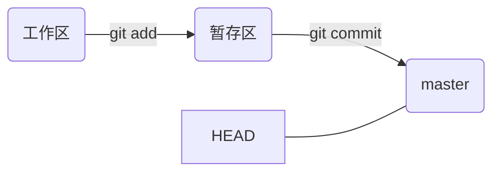
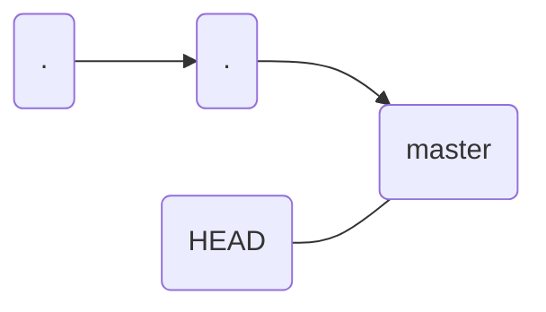
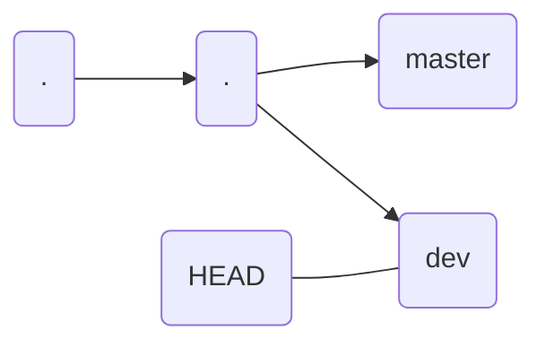
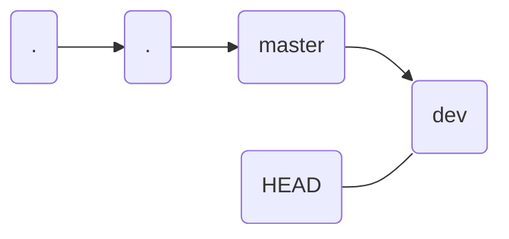
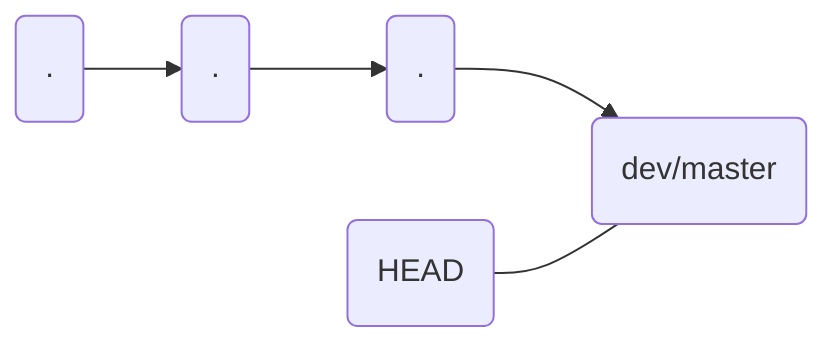
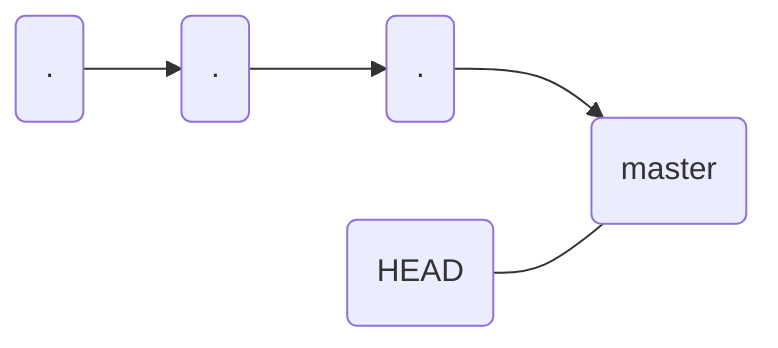

# Git简易步骤

**安装：**

```shell
sudo apt-get install git
```

**设置：**

```shell
git config --global user.name "your name"
git config --global user.email "your email"
```

**在本地创建仓库**

```shell
#首先创建目录
mkdir learngit
cd learngit
#然后git初始化
$ git init
Initialized empty Git repository in ~/learngit/.git/
```

**添加文件至版本库**

```shell
#分为两步
git add readme.txt
git commit -m "description"
```

**查看版本库状态**

```shell
git status
```

**查看修改的内容（未被提交的文件的修改）**

```shell
git diff 文件名
```

同时`git status`会提示哪些文件进行了修改。

**版本回退**

- 查看log为

  ```shell
  #详细查看
  git log
  #单行查看
  git log --pretty=oneline
  #查看图状log(分支管理)
  git log --graph --pretty=oneline --abbrev-commit
  ```

- 回退

  ```shell
  git reset --hard "commit id"
  ```

  此版本为HEAD,上一个版本为HEAD^,上100个版本为HEAD~100,可以输入HEAD，也可以输入版本号的前4位。

- 回退到新版本

  ```shell
  #查看reflog
  git reflog
  #然后操作与上面的相同
  ```

**工作区暂存区模型**



其中暂存区和master组成版本库，工作区位于你个人的电脑上,HEAD指向master在时间轴上进行哥更新。每次commit只是将add的内容进行提交。

**丢弃修改**

```shell
git checkout -- "file"
```

**暂存区放回工作区**

```shell
git reset HEAD "file"
```

**删除文件**

```shell
rm <file>
git rm <file>
git commit -m "remove file"
```

**回复误删的文件（前提是没有commit）**

```shell
git checkout -- <file>
```

**远程仓库的使用**

github为例

首先，使用本地的SSH key，在github官网上添加SSH  key。

- 关联仓库

  ```shell
  #在本地仓库下
  git remote add origin git@github.com:name/learngit.git
  #然后将本地文件推向远程仓库(第一次推荐使用-u参数)
  git push -u origin master
  ```

  如果出现问题，按照指示解决就好。

- 从远程仓库克隆

  两种SSH还有https，两个协议，操作基本相同。

  ```shell
  git clone <url>
  ```

**分支管理**

一条时间线就是一条分支，一般master分支就是最后发布的文件所在的分支，dev分支专门用来开发，还有一些用来处理bug的分支。

在dev开发好了之后需要融合dev和master分支。

有一个指针HEAD指向不同的分支，指向的分支会按照时间戳记录提交。

合并dev到master的过程









删除dev



**创建新的分支**

```shell
git　checkout -b <branch name>
```

**转换到不同的分支**

```shell
git checkout <branch name>
```

**查看当前分支**

```shell
git branch
```

**删除分支**

```shell
git branch -d <branch name>
```

**合并分支**

两种策略

ff

```shell
#注意是合并到当前分支
git merge <branch name>
```

recursive

```shell
git merge --no-ff -m "commit info" <branch name>
```

与上一条的区别是加入了一条commit，可以帮助回复。

解决冲突的方法很简单，手动修改。

**bug分支**

首先将dev正在进行的工作藏起来：

```shell
git stash 
```

然后转到master下：

```shell
git checkout -b issue-bugnum
```

修改bug然后与master融合。

转到dev下，回复工作内容：

```shell
#查看stash
git stash list
#删除stash
git stash pop 或
git stash apply stash@{num}
```

**在dev应用bug修复**

```shell
git cherry-pick <bug的修复号>
```

