# 1.7 Git

本讲内容

1. Git简介  
2. Git基础
3. 版本控制
4. 远程仓库
5. 分支管理
6. 标签管理  

第2、3、4小节讲解本地版本库和远程版本库控制管理的相关概念、命令，教会大家使用`git`做版本控制的基本方法；难点是5，讲解版本控制中的分支管理问题，加深理解分支管理的原理，可以让同学们在使用`git`时，头脑更加清晰，做到“知其然、知其所以然”

## 1. 简介

在大学的时候，可能会有一个课程作业需要写5000字论文。假如你第一天写了1000字；第二天看看觉得其中的500字写得不好，删掉了；第三天又觉得删错了，但是又没备份，这时只能重新敲一遍。  每次备份太麻烦，版本控制工具就有用处了。它记录每个版本的历史，什么时候改的，改了什么内容，可以很方便的恢复到原来某个版本。 

一般软件专业的文档，如需求文档、开发文档等，一开始都有一个“版本修改说明”表，它列出每个版本的历史，什么时候改的，改了什么内容，谁改的，这就是简单的版本控制。但如果是个很大的工程，有成百上千个文件，比如Linux内核这个有几千万行代码的工程，靠人工填写表格记录修改历史，就太不现实了。Linux的开发者Linus对当时的版本控制不满意，他自己做了一个版本管理软件git。现在所有的Linux内核，还有很多开源软件都是由git在维护。

版本控制工具主要分2种，集中式的和分布式的，集中式版本控制工具，整个小组的所有人的代码都放在一个服务器上，用的时候直接在服务器上下载。Git的区别就在于它没有一个中央服务器，每个人的电脑都可以当作一个服务器。优点是任何一处协同工作用的服务器发生故障，事后都可以用其他镜像出来的本地版本库恢复。缺点就是不能保证所有的代码都是一致的。Git的安装比较简单，`sudo apt-get install git`。Git和其他版本控制系统，如SVN，的一个不同之处是有暂存区，我们首先了解一下什么是“暂存区”，以及工作区、暂存区、分支、本地版本库、远程版本库之间的层次关系。

工作区也就是一个工作目录。在工作区目录下有一个隐藏文件.git，它就是版本库。

```bash
cd git_demo
ls -a

drwxrwxr-x  8 lyx lyx  4096 1月  10 10:42 .git/
```

版本库包括两个部分，一个是暂存区，一个是分支。暂存区是.git版本库里面的一个重要部分，就在 .git/index目录下，也就是图中的stage(鼠标指向标号3)。  “分支”就是一条时间线。每提交一个新版本时，Git把它们自动串成一条时间线，这条时间线就是一个分支。对应图中标号4的部分。  “分支”这个概念在讲第5小节“分支管理”时，会更加清晰的理解。  

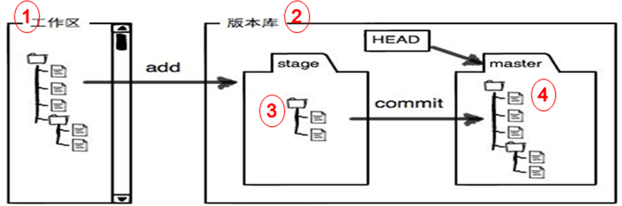

说到版本库，用github提交文件时用的是git add，git commit，git push三个命令。这三个命令非常有代表性，能够体现出工作区、暂存区、当前分支、本地版本库、远程版本库之间的层次关系。git add：把在工作区中文件的修改添加到暂存区，即从标号1到标号2；git commit：把暂存区多有内容提交到当前分支，即从标号3到标号4；  

git push：把本地版本库推送到远程版本库，即从标号2到标号5。  

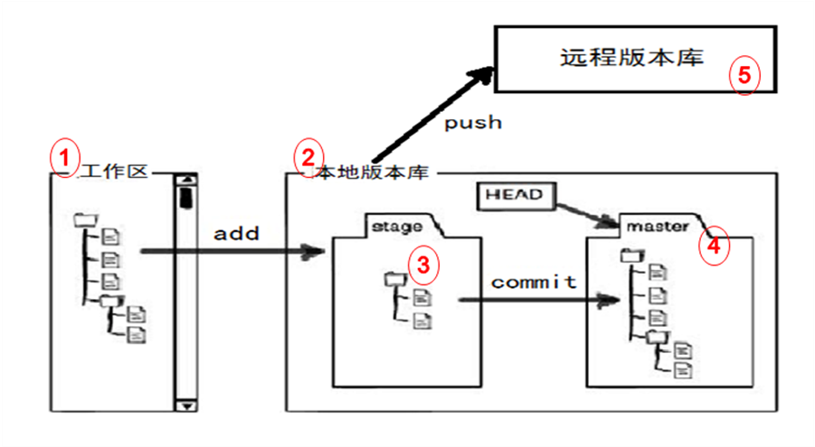

## 2. Git常用命令

下表介绍了常见的git命令，包括新建`init`、添加`add`、提交`commit`、查看`status`、撤回`reset`、删除`rm`。

| 命令                | 功能                               |
| ------------------- | ---------------------------------- |
| git init            | 初始化git管理的仓库                |
| git add             | 添加到暂存区                       |
| git commit          | 提交到仓库                         |
| git status          | 查看当前仓库状态                   |
| git diff            | 查看修改了的内容                   |
| git log             | 查看仓库历史记录                   |
| git relog           | 查看所有分支的所有操作记录         |
| git checkout        | 切换分支                           |
| git reset HEAD      | 回退到指定版本（HEAD表示最新版本） |
| git reset HEAD file | 撤销暂存区的修改                   |
| git rm              | 删除Git仓库文件                    |

```bash
mkdir learngit        #创建一个learngit目录作为工作区
cd learngit           #切换目录到learngit目录
git init              #初始化git仓库，会产生一个.git隐藏文件，是本地版本库
git add readme.txt    #添加readme.txt文件到暂存区
git commit -m "wrote a readme file"    #提交文件到版本库
git status            #查看当前的状态
```

```bash
echo "hello world" > hello.txt
git status

位于分支 master
您的分支与上游分支 'origin/master' 一致。
尚未暂存以备提交的变更：
  （使用 "git add <文件>..." 更新要提交的内容）
  （使用 "git checkout -- <文件>..." 丢弃工作区的改动）
  （提交或丢弃子模组中未跟踪或修改的内容）

	修改：     "\346\272\220\347\240\201/code" (修改的内容)     #标号2
	修改：     "\351\207\215\345\272\206\345\237\271\350\256\255/day01 Linux\345\237\272\347\241\200/class7 Git/1.7 Git.md"   #标号3

未跟踪的文件:
  （使用 "git add <文件>..." 以包含要提交的内容）

	hello.txt         #标号1
```

上面代码所示新建了hello.txt文件，改变了但是没有更新，见注释`标识1`，同时修改了部分内容，见注释`标号2和标号3`。可以用 git add <file> 命令进行更新，也可以用 git checkout <file> 命令撤销工作区的修改。指出已经修改的文件是
`hello.txt`。

```bash
git diff     #标号1

diff --git "a/\346\272\220\347\240\201/code" "b/\346\272\220\347\240\201/code"
--- "a/\346\272\220\347\240\201/code"
+++ "b/\346\272\220\347\240\201/code"
@@ -1 +1 @@
-Subproject commit 79baf341569aa35321727a24b8e38a5f2b99a11f
+Subproject commit 79baf341569aa35321727a24b8e38a5f2b99a11f-dirty
diff --git "a/\351\207\215\345\272\206\345\237\271\350\256\255/day01 Linux\345\237\272\347\241\200/class7 Git/1.7 Git.md" "b/\351\207\215\345\272\206\345\237\271\350\256\255/day01 Linux\345\237\272\347\241\200/class7 Git/1.7 Git.md"
index 527f4a7..7a68d32 100644
--- "a/\351\207\215\345\272\206\345\237\271\350\256\255/day01 Linux\345\237\272\347\241\200/class7 Git/1.7 Git.md"      
+++ "b/\351\207\215\345\272\206\345\237\271\350\256\255/day01 Linux\345\237\272\347\241\200/class7 Git/1.7 Git.md"      
@@ -83,8 +83,5 @@ git status
        hello.txt         #标号1
```

-上面代码所示新建了hello.txt文件，改变了但是没有更新，见注释`标识1`，同时修改了部分内容，见注释`标号2和标号3`。可以用 git add <file> 命令进行更新，也可以用 git checkout -- <file> 命令撤销工
-作区的修改(鼠标指向标号 3)
-。指出已经修改的文件是
-readme.txt(鼠标指向标号 4)
-。
\ No newline at end of file
+上面代码所示新建了hello.txt文件，改变了但是没有更新，见注释`标识1`，同时修改了部分内容，见注释`标号2和标号3`。可以用 git add <file> 命令进行更新，也可以用 git checkout <file> 命令撤销工作区的修改。指出已经修改的文件是
+hello.txt。
\ No newline at end of file
```

`git diff`是查看修改了的内容。上面所示，因为修改了`hello.txt`文件`,git`是用`a`和`b`两个版本来区分修改前后的版本，最后一行可以看出 `hello.txt`文件添加了`+上面代码所示新建了hello.txt文件，改变了但是没有更新，见注释`标识1`，同时修改了部分内容，见注释`标号2和标号3`。可以用 git add <file> 命令进行更新，也可以用 git checkout <file> 命令撤销工作区的修改。指出已经修改的文件是`。

```bash
git log
commit 332c2bb1eec71fcf59716bb98e05b6ccaa392bb7
Author: luoyunxiang <yunxiang.luo@gmail.com>
Date:   Tue Jan 14 14:26:54 2020 +0800

    1.8

commit 1b1a37e804f29ba0ac0a79909d6f0670e355e118
Author: luoyunxiang <yunxiang.luo@gmail.com>
Date:   Tue Jan 14 11:57:54 2020 +0800

    1.7

commit 7b271ee330db97c4a463e67e7f61d2dcf5b40c40
Author: luoyunxiang <yunxiang.luo@gmail.com>
Date:   Tue Jan 14 11:27:06 2020 +0800

    1.8

commit 558f661b4feeb973b0de29e170847df800633142
Author: luoyunxiang <yunxiang.luo@gmail.com>
Date:   Fri Jan 10 12:01:01 2020 +0800

    1.7
:
```

`git log`查看仓库历史记录，可以看到所有的提交的列表。如上所示提交了4次,显示分别的做了什么,显示提交后参数后带的注释。可以看到提交的时候给出的所有信息，其中`Commit`表示提交的版本`id`，Author表示谁提交的。`Date`表示提交的日期，还有添加的注释。

`git log --pretty=oneline`给出的是`git log`的所有版本信息的更简单的形式。

```bash
git log --pretty=oneline
574b45efde3f7862ed9f11b564279550d468beac 1.7
332c2bb1eec71fcf59716bb98e05b6ccaa392bb7 1.8
1b1a37e804f29ba0ac0a79909d6f0670e355e118 1.7
7b271ee330db97c4a463e67e7f61d2dcf5b40c40 1.8
558f661b4feeb973b0de29e170847df800633142 1.7
3b29ee194038850bc73bb4df322a1aecd0dc4ef5 1.7
c339a36b28f43846821cc0cbc63cba38e93f091b shell
59f1477131bdcc827a09dcf6cd9b672f6f875f21 1.7
d1532900ed8974312a2e7f540335f7f794af66c3 1.7
b3dc98a0a6859d8bbcb1558db2f202cdecfb8686 1.6
4e212ffb58ca2c565efbe11443b3f9707787abab 1.6
7909e8b225b4eab82f183cfdc9c11f2014e5e3cc 1.6
ea069f486a8fd604b71da5cb0b7ec34b4f0d82f7 CLion
8c7e7d95f26f4c31817b7d16df91f12a4c38be8a CLion
7385e3b0c93ce26a8585c625bf043dac843029b6 CLion
d5b3e4222af412a3a8735fd82d240ca51957f0a1 CLion
b2ddab1fb4db7f57113e391a3f270381475d14b1 1.6
7b3ce264504f422f60525b105772a65aa92de2a1 1.6
a06f02697f23443b29d8ae1a867e5cb20c547823 1.6
1768c33601e311d733576fee656a97792e7c9ffa 1.6
1110e68397324bfe4bd67c07c5285319cfa060b5 1.6
cf0664bb02a06ffac799d3cc1808074ac88c5d12 1.6
451afff67a79a4a2336cc6c2cbc4454030274a11 1.6
```

`git reset`用的会比较多，`git reset HEAD^`，`HEAD`表示当前版本，每`commit`一次就多一个版本。当你感觉版本不对需要回退，就直接回退到HEAD的前一个版`git reset HEAD^`你就会发现版本库下所有的内容回退到原来的内容。前面是直接回退到当前版本的前一个版本`HEAD^`，但是当你想回退到指定版本号的时候，可以先用`git log`查看版本号，就是`commit id`的前 7 位。`git reset --hard ed5b16c`给出了回退到指定的版本。

```bash
commit ed5b16cffbb698bc19ba5193e16223e8d7da7dd0
Author: luoyunxiang <yunxiang.luo@gmail.com>
Date:   Tue Jan 14 16:30:50 2020 +0800

    1.7

commit 8424f26db527ec5c8d03b3ce7befe94dc65f21a9
Author: luoyunxiang <yunxiang.luo@gmail.com>
Date:   Tue Jan 14 16:24:48 2020 +0800
```

`git checkout`只是想提交某一个文件。撤销修改`git checkout -- readme.txt`撤销修改。这里需要特别注意 `checkout`后面的这两个`--`(横杠)一定是前后都要有空格，否则就会出错。

`git reset HEAD file`撤销暂存区的修改。撤销`index`的内容，放回到工作区。

```bash
echo `hello world` > hello
git add hello
git status

位于分支 master
您的分支与上游分支 'origin/master' 一致。
要提交的变更：
  （使用 "git reset HEAD <文件>..." 以取消暂存）

	新文件：   hello

尚未暂存以备提交的变更：
  （使用 "git add <文件>..." 更新要提交的内容）
  （使用 "git checkout -- <文件>..." 丢弃工作区的改动）
  （提交或丢弃子模组中未跟踪或修改的内容）

	修改：     "\346\272\220\347\240\201/code" (修改的内容)
	修改：     "\351\207\215\345\272\206\345\237\271\350\256\255/day01 Linux\345\237\272\347\241\200/class7 Git/1.7 Git.md"

git reset HEAD hello
重置后取消暂存的变更：
M	重庆培训/day01 Linux基础/class7 Git/1.7 Git.md
lyx@yangziling-ThinkPad-T470p:~/chongyou$ git status
位于分支 master
您的分支与上游分支 'origin/master' 一致。
尚未暂存以备提交的变更：
  （使用 "git add <文件>..." 更新要提交的内容）
  （使用 "git checkout -- <文件>..." 丢弃工作区的改动）
  （提交或丢弃子模组中未跟踪或修改的内容）

	修改：     "\346\272\220\347\240\201/code" (修改的内容)
	修改：     "\351\207\215\345\272\206\345\237\271\350\256\255/day01 Linux\345\237\272\347\241\200/class7 Git/1.7 Git.md"

未跟踪的文件:
  （使用 "git add <文件>..." 以包含要提交的内容）

	hello
```

删除文件后可以用`git checkout -- filename`还原这个文件从暂存区拷贝到工作区。

```bash
echo aaa > hello
git add .
rm hello
git checkout -- hello
ls hello

hello
```

如果误删就用到了前面讲的撤销修改，`git checkout -- filename`

练习

1. `mkdir learngit`创建一个 learngit 目录作为工作区

2. `git init。初始化 git 管理的仓库`，显示初始化成功learngit目录下有`.git`隐藏文件夹，为本地版本库。

3. `echo "This is first write" > readme.txt`，新建一个 readme.txt 文件，写入了`This is first write`。

4. `git add readme.txt,`添加readme.txt文件到暂存区。

5. `git status`查看当前仓库的状态，显示readme.txt 的改变等待提交。

6. `git commit –m "wrote a redeme.txt file"提交文件到版本库并且附带注释``wrote a readme.txt file`。

7. `git diff`显示修改了的文件的信息。

8. `git status`显示当前没有需要提交的。

9. `git log`查看仓库历史记录,显示提交的 id 号，作者和日期。

10. `git checkout -- readme.txt`撤销`readme.txt`文件的修改。

11. `git status`，查看当前仓库的状态。

12. `git rm readme.txt`删除`readme.txt`文件

## 3. Gitlab服务器
第一步：创建 SSH Key 秘钥，复制.ssh/id_rsa.pub 内容；

```bash
ssh-keygen -t rsa -C "youremail@example.com"
```

第二步：登陆Gitlab服务器，如Github，打开`Account settings` `SSH Keys`
`Add SSH key``Add key`；将`.ssh/id_rsa.pub`内容贴到Gitlab服务器上。

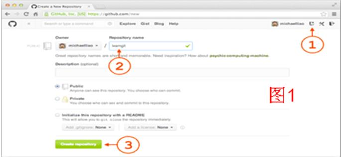

添加远程库主要分2步，同步本地仓库到远程 GitHub 服务器；具体的步骤，如图1已经标出来了相关顺序步骤1，2，3。建议大家初始化一个readme.md文件。操作完成后就会出现图2的界面。

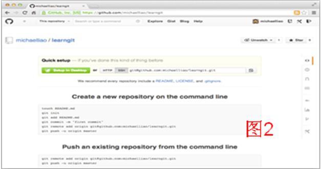

执行`git remote add origin git@github.com.cn:michaelliao/learngit.git`和`git push`把当前主分支master推送到服务器上。如果在第一次提交的时候加上`-u`参数，可以将远程的`master`分支和本地的`master`分支关联，之后可以使用`git push` 取代` git push  origin master`。

从远程库克隆到本地步骤如下：

1. 登陆GitHub，创建一个新的仓库，名`gitskills`。勾选`Initialize this repository with a README`，这样 GitHub 会自动创建一个`README.md`文件。创建完毕后,可以看到 README.md 文件。


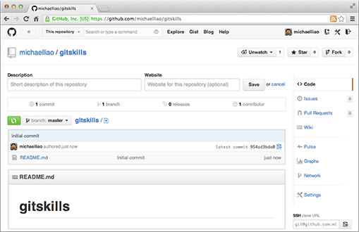

2. 用命令`git clone`克隆一个本地库。

```bash
git clone git@github.com.cn:michaelliao/gitskills.git
```

**分支管理**

分支管理的基本流程就是首先创建分支，合并时做冲突判断。如果不冲突的话，直接合并分支；如果冲突的话会被提示，解决冲突后再合并。其中 Bug 分支、Feature 分支、多人协作处理的过程都是类似的。下表是创建、查看、合并、删除分支git命令。

| 命令                   | 描述                     |
| ---------------------- | ------------------------ |
| git checkout -b 分支名 | 创建新分支并切换到该分支 |
| git branch             | 查看当前的分支           |
| git add 文件名         | 添加文件                 |
| git commit 文件名      | 提交文件                 |
| git merge 分支名       | 合并分支                 |
| git branch -d 分支名   | 删除分支                 |
| git stash              | 把当前工作现场“储藏”起来 |
| git remote             | 查看远程库的信息         |
| git push origin 分支名 | 推送修改到分支上         |
| git pull               | 把最新提交的内容抓取下来 |

分支管理是git的一个非常有用的功能，git是一个分布式的版本控制工具。假设2名同学来合作做一个作业，`hello.c`是公共的文件，不同的学生都对 `hello.c`进行了不同的修改，这个时候会产生冲
突，`git merge`会列出2个版本中的不同点，有冲突的自己解决。这个时候注意`master`主分支还没有动，要修改代码一般都先创建分支，几个分支可以独立完成。

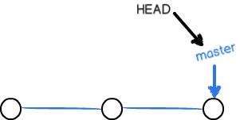

如上图所示`master`是主分支，`HEAD`指针指向 `master`。每提交一次，`master`分支就向前移动一步。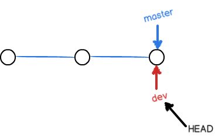

如上图所示新建了一个分支`dev`，刚开始什么都没有做，这个`dev`和`master`是一样的，只是改变了 `HEAD`的指针的指向。

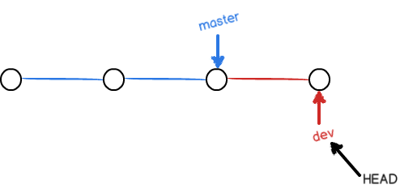

如上图只要在`dev`上做了修改，并且提交了`dev` 指针就往前走了一步，master 指针还在那没动。

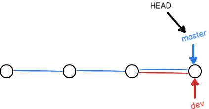

如果这个时候`dev`和`master`没有冲突，合并的时候直接把`master`放过来就好了，如果有人在` master`上面做了改动，那图上就会多出一个分支。

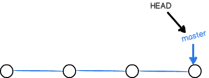

最后都做完了可以把其他的分支删除`git branch -d dev`，如上，只有一个分支`master`。

创建分支

```bash
git checkout -b dev

Switched to a new branch 'dev'
```

`git checkout`加一个`-b`的参数，这个`-b`是`branch`分支的意思，`dev`是这个分支的名字。

```bash
git branch dev
git checkout dev

Switched to branch 'dev'
```

第二种方法是先`git branch dev`创建一个`dev`分支，再切换到`dev`，下面的提示就会显示切换到了`dev`的分支。

```bash
git branch

* dev
  master
```

`git branch`列出所有的分支，`*`所在的分支是当前工作的分支，例如上面当前的分支是`master`。

```
git checkout dev
git add readme.txt
git commit -m "branch test"

[dev fec145a] branch test
1 file changed, 1 insertion(+)
```

上面例子，`dev`分支添加文件`readme.txt`，见下图，图中`dev`比`master`要往前的一个位置。

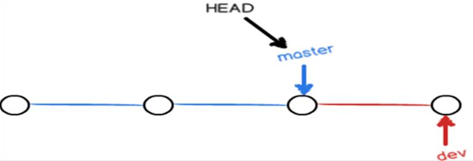

```bash
git merge dev
Updating d173fd8..fec145a
Fast-forward
	readme.txt | 1+
	1 file changed, 1 insertion(+)
```

由于`master`分支没改，就可以直接合并，如图所示显示`Fast-follow`模式，把`dev`里的东西合并到`master`分支。

```bash
git branch -d dev
Deleted branch dev (was fec145a).

git branch
*	master
```

合并完以后，可以删除`dev`分支，`git branch -d dev`，其中`-d`是指`delete`的意思，查看当前的分支发现只存在一个master分支。

```bash
git checkout -b feature

Switched to a new branch 'feature1'

git add readme.txt
git commit -m "AND simple"
[feature1 75a857c] AND simple
1 file changed, 1 insertion(+)，1 deletion(-)

git checkout master

Switched to branch 'master'
Your branch is ahead of 'origin/master ' by 1 commit.

git add readme.txt
git commit -m "& simple"

[master 400b400] & simple
1 file changed, 1 insertion(+), 1 deletion(-)
```

下面是具体解决分支冲突的。

首先创建一个`feature1`分支，并且修改了`readme.txt`文件，添加并且提交到仓库。其次对`master`分支修改，切换到`master`分支上，修改`readme.txt`文件，加上和`feature1`分支不一样的内容。

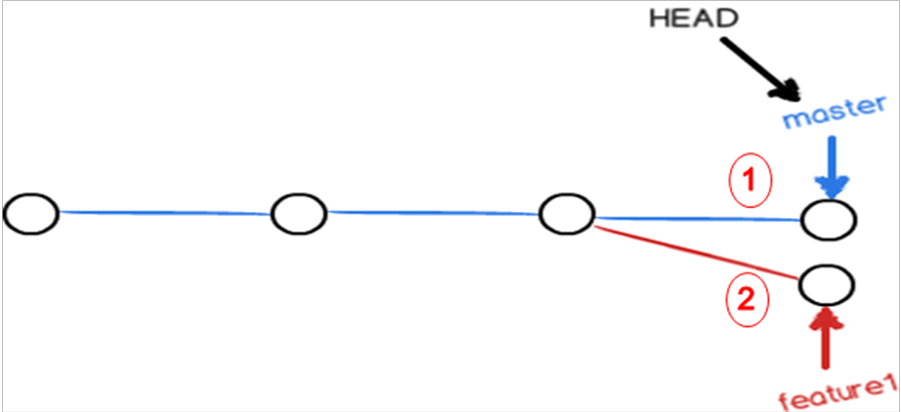

因为`feature1 `分支和`master`分支都提交了修改后的`readme.txt`文件，并且修改的内容不一样，所以这时产生了冲突，如上图。

```bash
git merge feature1

Auto-merging readme.txt
CONFLICT(content):Merge conflict in readme.txt
Automatic merage failed; fix conflicts and then commit the result.

git status

# On branch master
# Your branch is ahead of 'origin/master' by 2 commits.
#
# Unmerged paths:
# 	(use “git add/rm <file>...” as appropriate to mark resolution)
#
#	both modified	readme.txt
#	no changes to commit (use "git add" and/or "git commit -a")
```

合并时，系统会提示有冲突(conflict)，`CONFLICT(content):Merge conflict in readme.txt`。`git status`会直接列出冲突的文件产生`both modified	readme.txt`。

```bash
git diff

Git is a distributed version control system.
Git is free software distributed under the GPL.
Git has a mutable index called stage.
Git tracks changes of files.

<<<<<<<HEAD
Creating a new branch is quick & simple.
==========
Creating a new branch is quick AND simple.
>>>>>>> feature1
```

第一部分，如下，显示2个版本产生的冲突，多个等号是分割线，等号上面是主分支的内容，等号下面是`feature1`的内容，

```
<<<<<<<HEAD
Creating a new branch is quick & simple.
==========
Creating a new branch is quick AND simple.
>>>>>>> feature1
```

把`feature1`分支修改成`master`分支的内容，修改，保存，提交，最后合并到`master`上。

```bash
git add readme.txt
git commit -m "conflict fixed"
[master 59bc1cb] conflict fixed
```

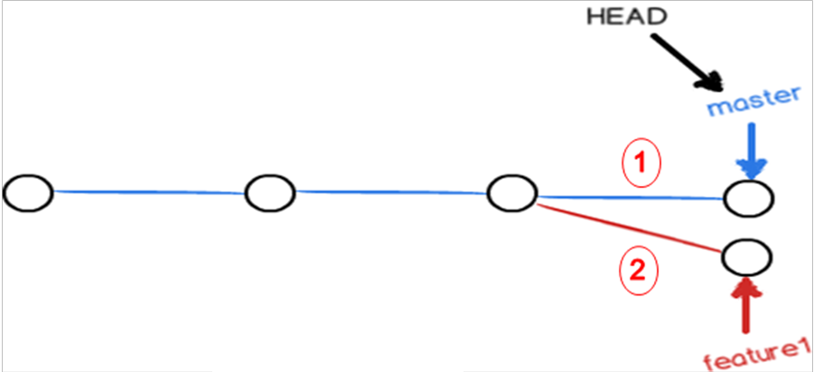

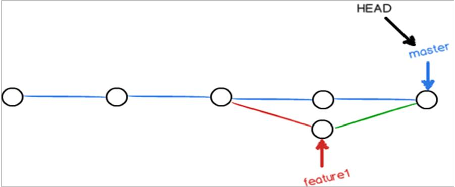

```bash
git log --graher --pretty=online --abbrev.commit
*	59bc1cb
|\
|	* 75a857c AND simple
*	| 400b400 & simple
|/
*	fec145a branch test
...
```

这个`git log`后面带这些参数可以看出提交的信息。如第一部分上面*表示刚才的提交， `|`线表示刚才的分支线，最后删除掉`feature1`分支。

```bash
git branch -d feature1

Deleted branch feature1 (was 75a857c).
```

最后删除掉`feature1`分支。

```bash
git checkout -b dev

Switched to a new branch 'dev'
```

```bash
git add readme.txt
git commit -m "add merge"

[dev 6224937] add merge
1 file changed, 1 insertion(+)
```

分支合并管理有两种方式，`fast-forward`和`no-fast-forward`，`fast-forward`模式是可以强制不采用的。下面举一个不采用`fast-forward`的例子，首先创建一个`dev`分支，修改`readme.txt`文件，并进行一次新的`commit`。

```bash
git checkout master

Switched to branch 'master'

git merge --on-ff -m "merge with no-ff" dev 

Merge made by the 'recursive' strategy.
	readme.txt | 1+
1 file changed, 1 insertion(+)
```

切换到`master`分支上，加上--no-ff参数进行合并。

```bash
git log --graph --pretty=online --abbrev-commit
*	7825a50 merge with no-ff
|\
|	* 6224937 add merge
\/
*	59bc1cb	conflict fixed
...
```

`git log`给出了各分支的历史，合并后如上，` 6224937 add merge`。

下面这个图是一个比较常用的分支示意图。图中蓝色的就是`master`主分支，下面这几个就是子分支，下图是一个多人协作的例子。`michoel`新建了一个自己的分支，`bob`新建了一个自己的分支，`dev`分支是专门做开发用的，每次代码测试成功后才合并到`master`，这样`master`分支上永远都是可用的代码，那些有bug的代码就在自己的分支上，保证`master`就可以随时随地可以用,这样就可以避免在`master`主分支上出现有bug的代码。

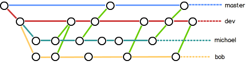

下面是一个应用场景，用`git`来修复bug。假设有个网站突然被黑了，如果直接停掉服务器这样肯定不可行的，因为网站要正常工作的。如果建一个开发`dev`分支，用于打补丁。用户是看不到`debug` 的
过程，用户只会感觉网站的前1秒的有漏洞后1秒被改好了，可以掩盖掉整个`bug`修复的过程，分支的修改不会反应到用户的面前，这种特性非常有用。

```bash
git stash

Saved working directory and index state WIP on dev: 6224937 add merge HEAD is now at 6224937 add merge
```

`git stash`可以把当前的工作区储藏起来临时存档。不会`commit`到仓库里，也不会存到云服务器上，而是放在本地。

```bash
git checkout master

Switched to branch 'master'
Your branch is ahead of 'origin/master' by 6 commits.

git checkout -b issue-101
```

比如有bug要修复，新建一个分支来修复这个bug，等bug修复好了后，讲`git stash`的内容恢复。`git checkout master`切换到`master`分支，一般不建议这么做，通常是建立一个`bug`处理分支，改完以后`merge`进去。假设需要修订bug 的时侯，当前的分支为`master`分支。`git checkout –b issue-101`建立一个修
复bug的分支，然后修复后提交接着合并。