# 3.1 ROS简介与安装

大家好，我们这门课程的名字是《ROS机器人开发技术》，这是一门零基础课程，教学目标是通过本课程的学习，使学习者能够系统地掌握ROS的基本概念、主要功能，具备熟练的使用ROS和Python语言在Ubuntu操作系统下进行机器人程序设计、编写、调试、运行跟踪的综合能力。

**本讲重点**

- 机器人和人工智能发展
- 什么是ROS？
- ROS的安装与配置
- 教学软件包的安装和使用

**教学目的**

- 了解机器人和人工智能的发展历史和它们之间的关系
- 了解什么是ROS，ROS的特点和它的优势
- 学习ROS的安装和配置方法
- 掌握教学软件包的安装，通过验证教学软件包的安装，初步了解ROS相关基础知识

本讲的内容分为四个方面，首先我们会简单讲述一下机器人和人工智能的发展概况，然后是介绍ROS的由来，了解使用ROS进行机器人开发的优势，练习ROS的安装与配置，最后再讲一下教学代码包的应用和练习一些相关操作。

## 1. 机器人和人工智能发展

**什么是机器人？**

<video src="src\videos\Video_1.1.1.mp4"></video>
什么是机器人呢，机器人是自动执行工作的机器装置。它既可以接受人类指挥，又可以运行预先编排的程序，也可以根据以人工智能技术制定的原则纲领行动。它的任务是协助或取代人类工作的工作，例如生产业、建筑业，或是危险的工作。我们可以把它分成三类

1、人造人（Artificial Human）
2、可编程机器（Programmable Machines）
3、感知、思考、动作（Sense Think Act）

**人工智能和机器人的关系**

<video src="src\videos\Video_1.1.2.mp4"></video>
人工智能是计算机科学的一个分支。人可以听和说，通过语言来交流，这是语音识别，语音识别很大程度是基于统计的。 人可以通过语言来读写，这是NLP，自然语言处理。例如我们常见的机器翻译就是NLP。人可以通过眼睛看，并且处理眼睛看到的东西，这个领域是计算机视觉，计算机视觉可以是基于符号的，也可以是基于机器学习的。人通过周围的图像认识世界，这个领域是图像识别，这个领域不仅仅和AI相关。人可以了解周围的环境，并且在其中运动，这个领域是机器人学。人可以识别图案，例如不同图案的组合。这个领域是模式识别。计算机在图案识别方面比人还要强，因为它可以使用更多的数据，这个领域是机器学习。现在我们来看一下人类的大脑，大脑是一种神经网络，我们通过它来学习事物。如果我们能用某种结构来描述大脑的组成，我们或许能了解大脑感知的能力来源。这个领域是神经网络，这个网络非常复杂，我们使用深度学习来学习复杂的事物。有多种不同的深度学习，代表了不同种类的人的神经网络，如卷积神经网络，这个领域连接计算机视觉和物品识别。如果神经网络能够记忆历史，这种神经网络是循环神经网络。我们可以看到有两种不同的AI，一个是基于符号的，另一种是基于数据的。基于数据的叫做机器学习，我们需要给机器提供大量的数据，用于学习。

**机器人的任务**

机器人的任务是协助或取代人类的工作，例如服务业、生产业、建筑业，或是危险的工作。曾经有学者把机器人的任务定义为协助人类工作，到了今天我们发现很多场景下机器人已经完全取代了人类，开始全自动化工作。例如建设银行的全自动储蓄所，沃尔玛的全自动超市和德国的全自动汽车轮胎装配车间。2018年建设银行推出了无人全自动储蓄所，各项服务全部实现了无人自动化。

<video src="src\videos\Video_1.1.3.mp4"></video>
2016年12月沃尔玛率先推出无人超市，用户刷手机二维码进入超市，购买到物品后可直接走出超市，随后系统会把账单自动发送到用户手机。2019年上海机场的国产云拿无人超市也实现了类似的功能。云拿都使用了计算机视觉、深度学习、重力传感器等技术。

<video src="src\videos\Video_1.1.4.mp4"></video>
2019年德国的轮胎装配厂实现了全自动无人化，每个装配点有大量的深度摄像头，三台机械臂，其中一台负责轮胎进料，两台负责安装。

<video src="src\videos\Video_1.1.5.mp4"></video>
我要跟大家分享一句话，“AI is  the  new  electricity”，人工智能是新的电力。 这句话是著名的华裔人工智能科学家吴恩达说的。我们都知道电力技术是第二次工业技术革命的代表，电力技术的发展给世界文明带来了巨大的发展，像电灯、电报、电话都是那个时代的产物，这些新技术也是当时科技进步的象征。从此，人类的生活就再也离不开电了。

1879年爱迪生发明了电灯


1880年发明电报


1917年壁式电话机


2007年 iPhone

今天的人工智能呢，就像100年前的电力一样，正在改变着各种行业。你可能并不觉得人工智有什么影响，但是你想想十年前。十年前第一代iPhone发布，乔布斯在发布会上演示了滑动以解锁的功能，当时台下的所有媒体都震惊了。再看看今天的，iPhone早就成了街机，它可以自动帮你把照片按人分类，可以陪你聊天，告诉你今天天气。你想想这十年的变化有多大。所以，身处这个人工智能的时代，我们自己可能感觉不到，但是回头看看，只看十年，这些变化就让人惊奇不已。


**人工智能（AI）**

在这波人工智能浪潮里，有一个领域你一定不能忽视，是什么呢？那就是机器人。


其实，早在远古时期，我们的祖先就提出了机器人的构想，在墨子的一本书中就有记载2000多年前，中国建筑与木匠的鼻祖鲁班就曾造过飞鸟，至于造出来与否，我们也并不知道，但是这也反映了祖先们对科技的追求。

	

**今天的机器人**

提到机器人，你可能马上会想到说波士顿动力的机器狗，谷歌的无人车，还有我们国产的大疆无人机。最近几年啊这个领域真的是非常火爆。下面我们看几个有代表性的机器人，Sofia是目前公认最聪明的机器人之一，她有62种表情。

<video src="src/videos/Video_1.1.6.mp4"></video>
下面这个视频是波士顿动力的机器狗

<video src="./src/videos/Video_1.1.7.MP4"></video>
Atlas双足机器人

<video src="./src/videos/Video_1.1.8.MP4"></video>
我们正在用UR机器人进行结合视觉的物品分拣，这是国际上用的较多的一种工业机器人。

<video src="./src/videos/Video_1.1.9.mp4"></video>
这提到国内这两年的机器人领域的发展就不得不提一下百度的Apollo，大家可能并不陌生，相信大家也都看了2018年的春晚上的百度Apollo无人车展。Apollo无人车是百度基于ROS开发的，来让我们一起回顾一下Apollo机器人的精彩时刻。

<video src="./src/videos/Video_1.1.10.MP4"></video>
国产大疆无人机已居于世界领先水平。

<video src="./src/videos/Video_1.1.11.MP4"></video>
## 2. 什么是ROS？

什么是ROS呢？我们首先看看ROS能做些什么？下面这个视频是2017年底ROS官方发布的。

<video src="./src/videos/Video_1.2.1.MP4"></video>


这些高大上的产品。都用到了一个共同的运行支撑软件，或者叫软件工具集，那就是我们的这门课的主题机器人操作系统ROS，Robot Operating System， R-O-S是它的缩写。大家可能会问了，为什么我们要用ROS来开发机器人呢？

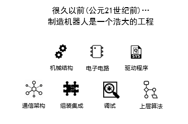

之前造一个机器人很麻烦，我们要设计机械结构、画电路板、然后写硬件驱动、设计通信架构、还要组装硬件和调试、最后是编写各种各样的上层算法。大家可以想象一下工作量有多大。所以机器人工程师很辛苦的，且进入门槛高。


我们希望机器人零部件厂商，比如机械臂、底盘、摄像头、激光雷达的这些生产厂商们都在一个通用的“机器人软件平台”上进行开发，开发者买回来，直接就能用，这是最好的。对不对？

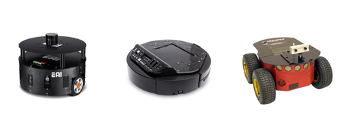

所以说，机器人领域也出现一个ROS这样的平台，其实是早晚的事。ROS事实上已经成为机器人界的主流操作系统。今天的机器人上跑的ROS，就是八九十年代PC上的Winows和Mac。那有了机器人操作系统ROS，机器人开发和使用就变得相对简单和高效，我们程序员再也不用担心去造轮子了。


**ROS发展史**

说完了为什么要用ROS，下面我们来看下ROS的发展史,ROS已经有大约十年的历史。其实最早啊，大概是2000几年，斯坦福大学，有一个人工智能实验室做机器人项目，它们开发的一套机器人软件系统框架，后来成为了ROS的前身，那说到这里必须提到一个人，美籍华裔人工智能专家吴恩达教授，他的早期工作就是参与了这个项目。

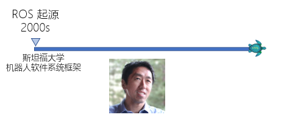


2007年ROS项目由柳树车库Willow Garage组织发起。这个组织很厉害，像PCL点云库和OpenCV，他们都是发起者或主要代码贡献者，此外我们机器人的业界标杆，PR2，也是他们开发的。

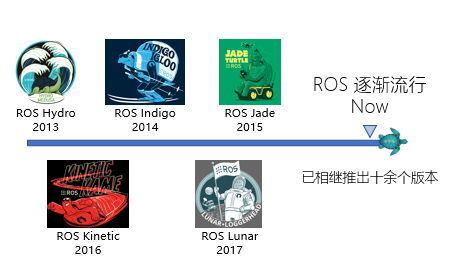

2007年之后，ROS就逐渐流行开来，到现在已经有了十多个版本，像Indigo、Jade、Kinetic、Melodic。

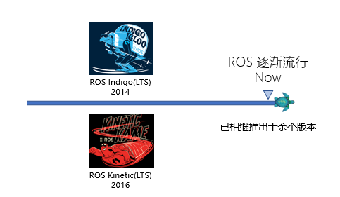

每个ROS版本都是依附于对应的Ubuntu版本的，比如Indigo和Ubuntu 14.04对应，Kinetic和Ubuntu16.04对应，Melodic和Ubuntu 18.04对应。目前用的人最多的版本，就是后面这两个，他们是Long term support长期支持版，官方的维护时间是5年，其他的ROS版本是两年。我们教学演示采用的ROS版本为Kinetic，我也建议各位同学安装Ubuntu16.04和ROS Kinetic。

**什么是ROS？**

到底什么是机器人操作系统ROS? ROS并不是我们传统意义上说的Windows Linux这样的计算机操作系统。它是跑在Linux等操作系统上的上的一个中间件，或者叫”运行时环境“，连接了真正的操作系统和你写的程序。只不过ROS提供了类似于操作系统的功能，包含硬件抽象、设备管理、通信架构、软件分发等功能，还提供了一些工具包和函数库，专门用于机器人开发。官方给出ROS解释是这样的：(点)框架+工具+功能+生态系统。


**框架**

框架是ROS的规范，ROS采用了分布式架构，可以同时运行多个功能模块，每个功能模块能单独设计，然后放在一起组合起来。


- 分布式
- 进程管理
- 进程间通信

**节点（进程）**

在ROS里面我们把不同功能的程序，叫做节点Node。以上图为例，一个节点可以是控制机器人的程序，激光雷达程序，构建地图的程序，也可以是定位和路径规划程序。ROS就提供了这样的一套框架，管理这些节点，然后提供了它们相互之通信的桥梁。有了这样的一套程序组织，我们运行了这几个节点，机器人就可以实现自主导航功能。为什么要用这种分布式架构呢？分布式框架的好处是扩展性好，软件复用率高。比如现在我想换一个更高级的激光雷达，怎么办呢？告诉大家，只用改这个激光雷达节点就行了，甚至，我们连通信都不用改，只要让新的传感器按照ROS规定的这个通信方式传输数据就可以。是不是很方便？这就是分布式架构的好处。当然在实际情况下，各种节点啊要比这张图复杂很多，我们以后再讲。

**工具**

ROS提供了很多基础工具，比如Gazebo，Rviz，rqt等等，用来仿真和调试，以后我们会一一介绍。有了这些工具，我们开发人员面对的是可视化界面，而不再是字符串或者16进制数据，仿真和调试就容易多了。


- 仿真
- 数据可视化
-  图形界面
-  数据记录

**Gazebo**

Gazebo是ROS中的一个实现物理仿真的工具包，Gazebo本身就是一款机器人的仿真软件，可以模拟机器人以及环境中的很多物理特性。

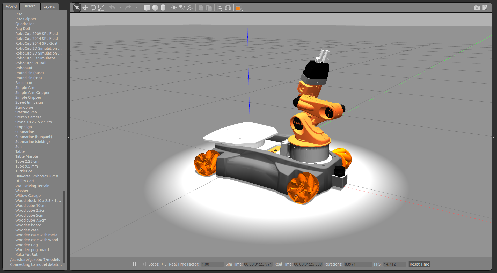

**Rviz**

Rviz是ROS自带的一个图形化工具，可以方便的对ROS的程序进行图形化操作。其使用也是比较简单。


**功能**

第三点是功能。ROS提供了各种基础功能包，像控制、规划、视觉等等，你可以直接使用。 比如说你现在正在研究人脸识别算法，你想把它用在机器人上，让机器人识别你的脸，然后跟随你，你不需要自己去写一套路径规划、建图、定位、控制的算法，可以直接用它的开源程序，加上我写的人脸识别算法。有了这些基础功能，你们就可以只做自己擅长的那一部分。这也体现了ROS分布式框架的好处。去哪里找找些软件包？ 我告诉大家，有两个。


 一个是机器人操作系统的官方网站--ROS Wiki ，我们可以看到有各种介绍和新闻，那最重要的就是这里，ROS Wiki，他相当于ROS提供的一个百科，或者官方手册里面包含了从安装到入门，各种软件包，以及ROS支持的机器人、传感器，还有相关的书籍和课程。如果你做ROS开发，这里会是你经常来的地方。

 - http://wiki.ros.org/cn
 - http://wiki.ros.org/APIs


另一个是Github，是一个面向开源及私有软件项目的托管平台,因为只支持git 作为唯一的版本库格式进行托管，故名gitHub，我们来看一下公司在github上的官方网页。

 - https://github.com/DroidAITech

重德智能目前推出的产品和解决方案包括面向高校和科研院所的XBot系列科研教学机器人专业平台、校企共建联合实验室整体解决方案、服务机器人解决方案、共享机器人以及面向学校和机器人爱好者的基于ROS的机器人教学平台-睿思学院（ROSAcademy）。

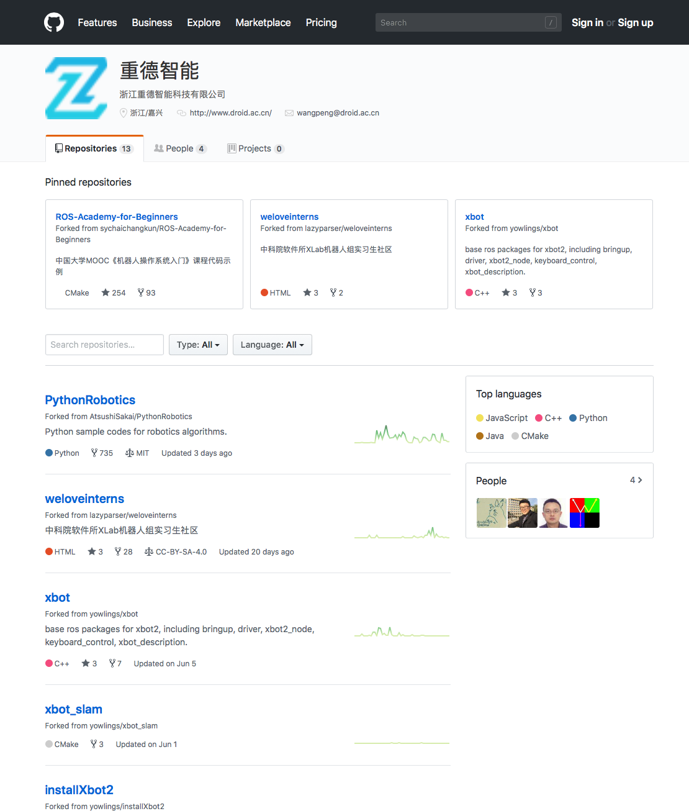

- https://github.com/DroidAITech/xbot

我们可以点开XBot这个项目，点开之后我们可以看到这个目录下的一些项目文件，在最下方的README部分，有我们Xbot机器人的介绍，在ROS官方网站中也可以找到我们的Xbot机器人。

**社区**

最后一点，广义上ROS也是一个庞大的生态系统。很多ROS程序都是以软件包形式管理，其实就是apt-get，apt是Ubuntu的包管理工具，安装和使用都很方便。另外，ROS还提供了大量的文档和教程，官网上都有。 


- 软件包管理
- 文档
- 教程

**机器人开发者社区**

https://q.droid.ac.cn/

机器人开发者社区面向所有的机器人相关的问题，包括且不限于机械硬件、机器人学（Robotics）、传感器、控制、SLAM、机器视觉、ASR、NLP等，由中国科学院软件研究所与中科重德机器人公司专家在线参与解答课程问题。

经过以上对ROS的讲解，我们来回顾一下ROS具有哪些特点：

1. 分布式点对点： ROS采用了分布式的框架，通过点对点的设计让机器人的进程可以分别运行，节点以分布式网络的形式建立，每个节点可以运行在不同的主机，便于模块化的修改和定制，提高了系统的容错能力。

2. 工具包与各组件丰富： ROS采用组件化的方式将已有的工具和软件进行了集成，比如ROS中三维可视化平台Rviz，Rviz是ROS自带的一个图形化工具，可以方便的对ROS的程序进行图形化操作；ROS中常用的物理仿真平台Gazebo，在该仿真平台下可以创建一个虚拟的机器人仿真环境，还可以在仿真环境下添加一些需要的参数。

3. 支持多种语言编程： ROS支持多种编程语言。C++、Python和已经在ROS中实现编译，是目前应用最广的ROS开发语言，Lisp、C#、Java等语言的测试库也已经实现。为了支持多语言编程，ROS采用了一种语言中立的接口定义语言来实现各模块之间消息传送。通俗的理解就是，ROS的通信格式和用哪种编程语言来写无关，它使用的是自身定义的一套通信接口。

4. 开源社区： ROS具有一个庞大的社区ROS WIKI，这个网站将会始终伴随着你ROS开发，无论是查阅功能包的参数、搜索问题还是。当前使用ROS开发的软件包已经达到数千万个，相关的机器人已经多达上千款。此外，ROS遵从BSD协议，对个人和商业应用及修改完全免费。这也促进了ROS的流行

## 3. ROS的安装和配置

XBot-U教学机器人


- 配套课程
- 提供实验室解决方案
- 迎宾接待，引导带领，定点导航
- 人脸识别，语音识别，定向讲解
- 丰富的讲解语料库，在线延伸讲解
- 白天接待服务，夜晚监控守护
- WIFI和4G网络接入，便于云应用和大数据处理开发

课程使用XBot-U教学机器人进行实验，提供实验室解决方案。Xbot机器人使用NUC主机，操作系统安装请参考
https://developer.ubuntu.com/core/get-started/intel-nuc

**学生机安装Ubuntu**

**软硬件要求**

- 一台Intel CPU电脑 
- USB2.0或3.0盘 (最小2GB)
- Internet网络连接
- 安装盘制作工具 [Rufus下载](https://rufus.ie/)
Rufus是一个Linux USB安装盘制作工具，可用于格式化和创建可启动的USB flash drives
- Ubuntu Desktop 16.04.4 LTS 安装镜像 [下载](https://isrc.iscas.ac.cn/mirror/ubuntu-release/xenial/ubuntu-16.04.4-desktop-amd64.iso)

**安装ROS**

现在我们来安装和配置ROS环境，在操作演示之前，先跟大家介绍一下ROS的网站ROS Wiki。我们打开浏览器，地址是ros.org，回车那这就是ROS的官方网站，我们可以看到有各种介绍和新闻，最重要的就是这里，ROS Wiki，相当于ROS提供的一个百科，或者官方手册。里面包含了从安装到入门，各种软件包，以及ROS支持的机器人、传感器，还有相关的书籍和课程。做ROS开发，这里会是你经常来的地方。我们的安装从install开始，选好ROS版本，ROS Kinetic版本是在Ubuntu 16.04上运行，千万不要安装错了，然后是安装步骤，我们看到很多命令，为了节约时间，我总结了一下，大致就四步，就四步，如果你看不懂命令行什么意思， 不要紧，复制进terminal里就可以了，首先是添加镜像源，这里推荐国内的源，我们用的是在软件所专门给课程做的镜像。第二步是添加公钥，我们把它拷进来，然后需要更新一下系统 sudo apt-get update。这里提醒一下各位，在Ubuntu 16.04上，apt-get有了一个简化版本apt，如果你是这之前的版本，还是得用apt-get update。下一步是安装ROS，请注意选对版本，这里是ROS Kinetic，ROS我们就安装完了。

1、替换Ubuntu源镜像

- 首先备份本地默认源列表文件 `sudo mv /etc/apt/sources.list /etc/apt/sources.list.bak`

- 执行以下命令，替换源

```bash
sudo wget https://isrc.iscas.ac.cn/mirror/help/mirror/xlab_ubuntu16.04.list -O /etc/apt/sources.list.d/xlab_ubuntu16.04.list
```

或者单独下载软件源文件 [xlab_ubuntu16.04.list](https://isrc.iscas.ac.cn/mirror/help/mirror/xlab_ubuntu16.04.list)

2、Ubuntu添加 ROS 源命令

- 首先添加 ROS 源公钥

```bash
wget -qO - https://isrc.iscas.ac.cn/mirror/ros/ros.gpg | sudo apt-key add -
```
- 添加软件源列表

```bash
sudo sh -c 'echo "deb http://isrc.iscas.ac.cn/mirror/ros/ $(lsb_release -sc) main" > /etc/apt/sources.list.d/ros-latest.list'
```

3、**系统更新**

升级软件列表

```bash
sudo apt-get update 
```
下一步来配置好ROS环境，三步，照着说明来做就行。rosdep是一个系统依赖项的管理工具，把它装好，然后把我们安装好的ROS环境导入到bashrc。这里注意，我们刚才apt安装的ros安装到哪里了？ 就在/opt/ros/kinetic下面。我们希望每次打开一个终端，就可以添加ros环境，所以我们把ROS环境放到.bashrc里面，每次自动刷新环境。最后是安装ROS包管理的一些工具，成功之后我们的ROS就安装完了。

**桌面全安装（推荐）**: ROS, rqt, rviz, robot-generic libraries, 2D/3D simulators, navigation and 2D/3D perception

```bash
sudo apt-get install ros-kinetic-desktop-full
sudo apt install ros-kinetic-ros-controllers
```

**单独安装特定包**：用户可以安装特定的 ROS package

```bash
sudo apt-get install ros-kinetic-PACKAGE
e.g.
sudo apt-get install ros-kinetic-slam-gmapping
```

**查找可用的packages**

```bash
apt-cache search ros-kinetic
```

- **rosdep初始化**
使用ROS之前你需要使用rosdep进行初始化。rosdep用于安装ROS核心部件编译或运行时需要的系统依赖。 

```bash
sudo apt install python-rosdep
sudo rosdep init
rosdep update
```

- **环境设置**
把ROS环境变量自动添加到每次自动启动的shell session
```bash
echo "source /opt/ros/kinetic/setup.bash" >> ~/.bashrc
source ~/.bashrc
```
安装完了，我们来测试一下有没有装好。用几条ROS指令，看不懂不用着急，这几句指令我们后面会讲到。今天只是来测试一下ROS有没有安装好，我们来演示一下，看看这台机器上的ROS有没有安装好。以上步骤可以写一个bash脚本。

```bash
sudo mv /etc/apt/sources.list /etc/apt/sources.list.bak

sudo wget https://isrc.iscas.ac.cn/mirror/help/mirror/xlab_ubuntu16.04.list -O /etc/apt/sources.list.d/xlab_ubuntu16.04.list

wget -qO - https://isrc.iscas.ac.cn/mirror/ros/ros.gpg | sudo apt-key add -

sudo sh -c 'echo "deb http://isrc.iscas.ac.cn/mirror/ros/ $(lsb_release -sc) main" > /etc/apt/sources.list.d/ros-latest.list'

sudo apt-get update

sudo apt-get install ros-kinetic-desktop-full -y
sudo apt install ros-kinetic-ros-controllers

sudo rosdep init
rosdep update

echo "source /opt/ros/kinetic/setup.bash" >> ~/.bashrc
source ~/.bashrc
roscore
```

安装分屏显示的小工具terminator

```bash
sudo apt-get install terminator
```

这里要介绍给大家一个分屏显示的小工具——terminator，先安装，我们希望程序的运行效果都可以呈现给大家，所以我们用一个分屏工具，terminator就是用来平铺显示多个窗口的工具。我们按ctrl+alt+t打开terminaltor。F11全屏。怎么用呢，很简单，右键首选项我们看到，有快捷键配置功能。当然要一个合格的码农啊，教你几个快捷键，这样显得更专业。第一个是ctr+shift+o，是水平切一刀，其实是新开了一个页面。第二是ctr+shift+e,是竖直切，那要切换怎么办呢？ Ctr+tab, ctr+tab，关闭窗口是ctr+shift+w ，就这四个快捷键。

**ZSH**

- 兼容 bash
- 强大的历史纪录功能，输入 grep 然后用上下箭头可以翻阅你执行的所有 grep 命令。
- 智能拼写纠正，输入gtep mactalk * -R，系统会提示：zsh: correct ‘gtep’ to ‘grep’ [nyae]? 
- 各种补全：路径补全、命令补全，命令参数补全，插件内容补全等等。触发补全只需要按一下或两下 tab 键，补全项可以使用 ctrl+n/p/f/b上下左右切换。比如你想杀掉 java 的进程，只需要输入 kill java + tab键，如果只有一个 java 进程，zsh 会自动替换为进程的 pid，如果有多个则会出现选择项供你选择。ssh + 空格 + 两个tab键，zsh会列出所有访问过的主机和用户名进行补全

- 智能跳转，安装了autojump之后，zsh 会自动记录你访问过的目录，通过 j + 目录名 可以直接进行目录跳转，而且目录名支持模糊匹配和自动补全，例如你访问过hadoop-1.0.0目录，输入j hado 即可正确跳转。j –stat 可以看你的历史路径库。
- 目录浏览和跳转：输入 d，即可列出你在这个会话里访问的目录列表，输入列表前的序号，即可直接跳转。
- 在当前目录下输入 .. 或 … ，或直接输入当前目录名都可以跳转，你甚至不再需要输入 cd 命令了。
- 通配符搜索：ls -l **/*.sh，可以递归显示当前目录下的 shell 文件，文件少时可以代替 find，文件太多就歇菜了。

**安装ZSH**


```bash
sudo apt-get install zsh
```

**修改用户默认Shell**

```bash
sudo vi /etc/passwd
登录名:x:1001:1001:yunxiang,,,:/home/yunxiang:/bin/bash
改为
登录名:x:1001:1001:yunxiang,,,:/home/yunxiang:/bin/zsh
```
**查看zsh是否安装成功** 

```bash
zsh --version
```

如果你用zsh取代bash，你需要运行以下命令设置shell环境 

```bash
echo "source /opt/ros/kinetic/setup.zsh" >> ~/.zshrc
source ~/.zshrc
```


- **ROS工具安装** 

目前已完成了ROS核心包运行环境安装。为了创建和管理ROS工作空间，需要安装大量工具，例如 rosinstall 是一个高频使用的命令行工具，它用于下载ROS package需要的大量资源

**以下命令可安装这些工具** 

```bash
sudo apt-get install python-rosinstall python-rosinstall-generator python-wstool build-essential
```

- **ROS安装成功验证**

输入roscore命令可以验证ROS已经安装成功

```bash
roscore
```


打开一个终端，输入`roscore`，如果显示如上图，恭喜你，已经成功的安装，ROS安装配置就到这里。

## 4. 教学代码包的安装

接下来我们会下载并安装本书配套的ROS-Academy-for-Beginners软件包，演示源码包下载-编译-
运行的完整流程。后续章节的主要代码都基于这个软件包，所以希望大家熟悉这一过程。

- 登录重德智能GitHub网页 ： https://github.com/DroidAITech/
- 下载和安装教学软件包：ROS-Academy-for-Beginners

教学软件包源代码在github上。

1.确保git已经安装
2.创建一个名为catkin_ws的工作空间，在它的的src路径下克隆ROS-Academy-for-Beginners软件包
3.安装依赖项，查看Gazebo版本
4.在工作空间下进行编译
5.source环境变量
6.运行仿真环境

ROS-Academic-for-Beginners教学包是贯穿整个学习过程所使用的教学代码包，本教学包是源码包，需要下载后对其进行编译才可以使用。该教学包中集成了Xbot仿真环境，在后续的课程中会大量的用到，初学者通过对本章的学习可以熟悉XBot仿真环境。

**任务一：安装教学包**

1.二级制包和源码包

第一步，需要弄清楚二进制包和源码包的区别。一般软件包可以分成二进制包和源码包两种，二进制包里包含了已经编译完成，并可以直接运行的程序，源码包里是程序的原始代码，下载完成后必须编译成可执行文件才可以安装。ROS-Academic-for-Beginners教学包是源码包。

2.建立工作空间

catkin工作空间是组织和管理包的文件夹，以catkin工具进行编译；catkin工作空间下应该有源码src目录用于存放源代码。第二步就是我们需要建立一个工作空间；ROS的工作空间使用到了catkin，catkin工作空间是组织和管理包的文件夹，以catkin工具进行编译，catkin工作空间下应该有源码src目录用于存放源代码。

3.下载源码包

git clone命令用于从服务器上克隆完整的git仓库（包括代码和版本信息）到单机上；需要将教学源码包克隆到源码目录下。第三步，建立好工作空间后我们需要将教学包源码下载下来，刚刚也说了ROS-Academic-for-Beginners教学包是源码包，需要将其下载并编译才可以使用。

4.安装依赖项

缺少依赖项会导致软件包无法正常编译和运行。第四步，我们需要安装教学包所需要的依赖项，因为缺少依赖项会导致软件包无法正常编译和运行。

5.查看Gazebo版本

第五步，查看Gazebo的版本，Gazebo是ROS中的一个实现物理仿真的工具包，Gazebo本身就是一款机器人的仿真软件，可以模拟机器人以及环境中的很多物理特性，这一步主要是看一看Gazebo的版本是不是在7.0 以上，如果低于7.0就需要对其进行更新。

6.编译工作空间

最后一步也就是编译，编译的过程中用到了catkin_make，在来学习catkin_make之前我们需要先了解一下cmake，cmake是一个跨平台的编译(Build)工具,可以用简单的语句来描述所有平台的编译过程；cmake的核心是读取一个容易理解的文本文件CMakeLists.txt，通过使用cmake命令根据CMakeLists.txt内容生成对用的项目文件；关于cmake的知识，推荐大家花一些时间去阅读一下《CMake实践》这本书。catkin是ROS定制的编译构建系统，是对cmake的扩展。

**1  二级制包 vs 源码包**

- 二进制包和源码包的安装是有区别的
- 二进制包里不包含源码，可通过sudo apt-get install进行下载和安装
- 源码包的安装必须将源码clone到本地并进行编译

先来看第一个子任务，关于二进制包和源码包的区别，刚刚也已经说到了，二进制包可以直接运行，而源码包需要编译后才可以使用。其中二进制包可以通过`sudo apt-get install`直接下载并安装；而源码包需要先从网上clone到本地，再进行编译后才可以运行。

| 区别          | 二进制包                   | 源代码包                         |
| ------------- | -------------------------- | -------------------------------- |
| 下载方式      | apt- get install／直接下载 | git clone /连接下载源代码        |
| ROS包存放位置 | /opt/ros/kinetic           | 通常 ~/catkin_ws/src             |
| 编译方式      | 无需编译                   | 通过make/cmake/caktin            |
| 来源          | 官方apt软件源              | 开源项目、第三方开发者           |
| 扩展性        | 无法修改                   | 通过源代码修改                   |
| 可读性        | 无法查看源代码             | 方便阅读源代码                   |
| 优点          | 下载简单，安装方便         | 源码可修改，便于定制功能         |
| 缺点          | 无法修改                   | 编译工具、软件包依赖、版本和参数 |
| 应用场景      | 基础软件                   | 需要查看、开发和修改的程序       |

**2  建立工作空间**

`mkdir -p catkin_ws/src`
其中工作空间` catkin_ws`名可任意修改，但工作空间下必须带有src目录。关于catkin工作空间的组织和结构，这里先不介绍，我们会在下一节向大家详细的介绍，在这里我们需要注意的是catkin工作空间下应该有源码src目录用于存放源代码；`mkdir -p catkin_ws/src`这个是建立catkin工作空间的指令，工作空间的名字可以随便取，但是一定要包含src目录。

```bash
mkdir -p catkin_ws/src          #创建catkin工作空间
cd catkin_ws/src                #进入catkin_ws下的src目录
```

**3  下载源码包**

建立好工作空间之后，我们需要将教学包源码下载到src目录下用于后续对教学包源码的编译；首先我们需要在github上找到我们的教学包；教学包下面有本教学包的安装教程，大家可以根据教程完成对教学包的安装；下载到本地之前我们需要确认系统中是否已经安装git；源码需要下载到src目录下，可以通过教学包的地址直接进行clone。

```bash
sudo apt-get install git        #安装git
cd catkin_ws/src                #进入catkin_ws下的src目录
git clone --branch fix_cartographer https://github.com/DroidAITech/ROS-Academy-for-Beginners.git                   #下载教学包
```

**4  安装依赖**

下载完代码后，我们需要安装其相应的依赖，缺少依赖会导致软件包无法正常编译和运行。

```bash
cd ~/catkin_ws                                                       #进入catkin_ws目录
rosdep install --from-paths src --ignore-src --rosdistro=kinetic -y  #安装依赖项
```

**5  查看Gazebo版本**

第五个子任务是查看Gazebo的版本，看一下Gazebo的版本是不是在7.0以上；我这里的Gazebo的版本是高于7.0 的。在终端中输入`gazebo –v`用以查看gazebo版本。

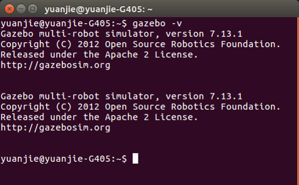

如果版本过低

```bash
sudo sh -c 'echo "deb http://packages.osrfoundation.org/gazebo/ubuntu-stable `lsb_release -cs` main" > /etc/apt/sources.list.d/gazebo-stable.list'
wget http://packages.osrfoundation.org/gazebo.key -O - | sudo apt-key add -
#添加安装公钥

sudo apt-get update              #更新软件源
sudo apt-get install gazebo7     #更新Gazebo7
```

打开Gazebo

```bash
roslaunch gazebo_ros empty_world.launch #打开一个空的Gazebo世界
```


**6  编译工作空间**

刷新环境变量方法只在本终端中有效，`source ~/catkin_ws/devel/setup.bash`是在本终端中刷新catkin工作空间环境变量。在新开的终端中需要重新刷新环境变量，为解决此问题，可将刷新指令添加到`~/.bashrc`文件中，`~/.bashrc`是一个bash脚本，会在打开新的终端时自动执行。

```bash
echo "source ~/catkin_ws/devel/setup.bash" >> ~/.bashrc
```
`vim ~/.bashrc`修改~/.bashrc，添加环境变量和主从计算机，ROS使用分布式结构，主机运行Master节点，从机可运行各种进程，因此要设置ROS Master主机，设置方法为`export ROS_MASTER_URI=http://127.0.0.1:11311`，和设置从机`export ROS_HOSTNAME=127.0.0.1       `，使得分布在不同计算机上的程序可以彼此通信，以上例子是Master节点和从机都运行在笔记本电脑上。当连接XBot的WIFI时，XBot地址固定为`http://192.168.8.101:11311`，设置方法是`export ROS_MASTER_URI=http://192.168.8.101:11311`，从机是客户机，IP由DHCP动态分配，可使用`ifconfig`查看客户机IP。

```bash
source /opt/ros/kinetic/setup.bash            #添加ROS Kinetic环境
source ~/catkin_ws/devel/setup.bash           #添加ROS源码工作空间环境     

#添加主从机，当使用仿真时添加如下
export ROS_MASTER_URI=http://127.0.0.1:11311  #主机IP和端口，默认为11311端口
export ROS_HOSTNAME=127.0.0.1                 #从机IP。仿真为主从机使用同一台计算机

#添加主从机，当使用XBot时添加如下
#export ROS_MASTER_URI=http://192.168.8.101:11311   #主机IP和端口，默认为11311端口
#export ROS_HOSTNAME=192.168.8.x              #从机IP，请在笔记本上使用ifconfig查看实际IP
```
接下来就是本次教学包安装的最后一步了，编译。需要注意的是编译必须在源码所在的工作空间目录下。编译完成后必须刷新一下工作空间的环境，通过输入指令`source ~/catkin_ws/devel/setup.bash`来刷新环境，但是这样只满足于当前终端，在其他终端中需要重新刷新，为了使每次打开终端不用重新刷新环境，可以将`source`命令追加到`~/.bashrc`文件中。


```bash
# 1、打开终端，cd进入刚刚建好的工作空间下
cd ~/catkin_ws

# 2、输入指令catkin_make进行编译
catkin_make

# 3、刷新环境变量
source ~/catkin_ws/devel/setup.bash

# 4、将”source ~/catkin_ws/devel/setup.bash"写入~/.bashrc
echo "source ~/catkin_ws/devel/setup.bash" >> ~/.bashrc
```

对`catkin_make`运行后终端部分内容解析如图。

**~/.bashrc**

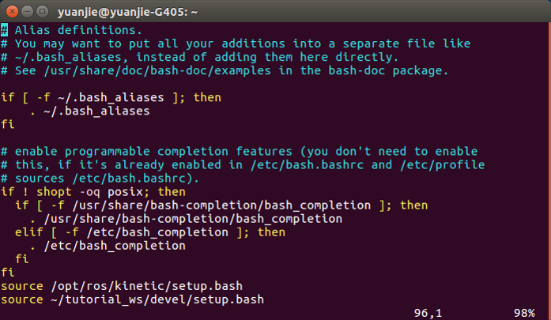

**编译后的工作空间**

安装完成后的教学包其内容如图所示


以上教学包安装命令可总结为

```bash
mkdir -p catkin_ws/src
cd catkin_ws/src
git clone --branch fix_cartographer https://github.com/DroidAITech/ROS-Academy-for-Beginners.git
cd ..
sudo rosdep install --from-paths src --ignore-src --rosdistro=kinetic -y
catkin_make

echo "source ~/catkin_ws/devel/setup.bash" >> ~/.bashrc
echo "export ROS_MASTER_URI=http://127.0.0.1:11311" >> ~/.bashrc
echo "export ROS_HOSTNAME=127.0.0.1" >> ~/.bashrc

source ~/.bashrc
```
启动XBot仿真
```bash
roslaunch robot_sim_demo robot_spawn.launch 
```

常见问题：Gazebo打开时有些会出现长时间等待或黑屏空白，因为http://gazebosim.org/models/地址已经变换http://models.gazebosim.org， 导致在线下载Gazebo模型文件时，访问无法自动转换地址。

解决方法

```bash
#1. 打开新终端，输入gazebo，打开gazebo
gazebo

#2. 关闭gazebo

#3. 打开新终端，cd ~/.gazebo/models/
cd ~/.gazebo/models/

# 4. 将课件包中src目录下的osrf-gazebo_models-e6d645674e8a.zip解压，把所有文件连同目录拷贝到~/.gazebo/models目录下
unzip osrf-gazebo_models-e6d645674e8a.zip -d ~/.gazebo/models
```

**任务二：XBot仿真环境**

接下来我们尝试在XBot仿真环境中控制XBot机器人移动。任务要点主要有以下两个方面，首先需要启动XBot环境，XBot仿真环境是根据我们软件博物馆实际结构建立的，我们可以通过在仿真环境中操作XBot机器人进行实验，在后续的课程中，我们会频繁的用得到；第二个就是要控制仿真环境中的Xbot机器人移动。

1. 启动XBot仿真环境。打开一个终端，输入以下命令。

```bash
roslaunch robot_sim_demo robot_spawn.launch
```

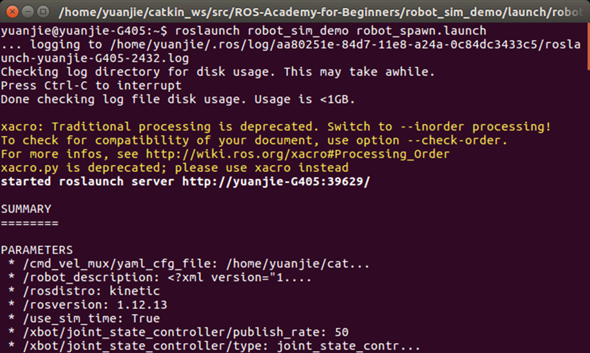

当终端出现上图所示情况，说明之前ROS-Academic-for-Beginners教学包的安装没有问题，并且可以正确打开仿真环境。

常见问题：

当Gazebo进程未被关闭时，新启动Gazebo会出现错误。需要关闭所有Gazebo进程，参考以下命令

```bash
ps -ef | grep gazebo                  #查看gazebo进程
kill -9 xxx xxx xxx                   #kill gazebo进程
```

XBot仿真环境

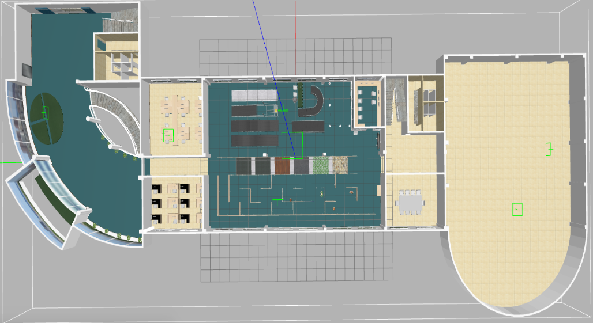

仿真环境如上图所示，是按照软件博物馆所做的模型，中间是XBot机器人，许多必要的参数已经加入了进去，像激光雷达等传感器。我们可以通过鼠标来移动我们的视角。

2. 控制XBot机器人移动

我们的任务需要在仿真环境中移动XBot机器人，我们需要调用控制机器人移动的程序，在我们的教学代码包里有一个早已经写好的Python脚本，我们可以直接调用。

```bash
#1、打开一个终端

#2、启动控制机器人移动的Python脚本
rosrun robot_sim_demo robot_keyboard_teleop.py
```

启动机器人控制


调用该脚本后我们可以看到图示界面，从界面中我们可以看到控制小车移动的按键，使用i件控制机器人前进，k为停止键，j和l为左右转；通过这些命令，这里我们控制仿真环境中的机器人移动。


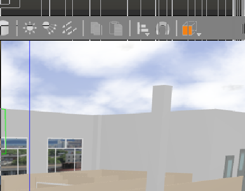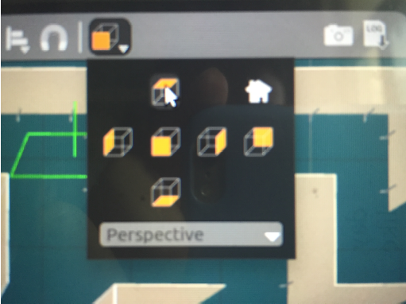

由于赛迪场地障碍物较多，可能在初次启动时xbot机器人不容易被发现，使用键盘控制移动过程中可能会将机器人卡在角落里，此时可以使用gazebo中的上帝视角对场地进行查看，在页面上端选择投影页面。


查看当前摄像头所对应的画面，打开一个终端，输入一下命令，启动rqt_image_view。

```bash
rosrun image_view image_view image:=/camera/rgb/image_raw
```

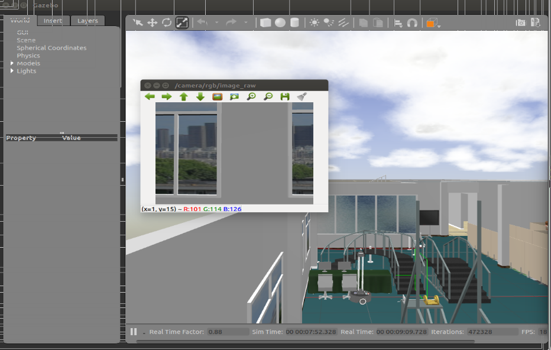

接下来我们尝试一下查看机器人的摄像头所对应的画面，可以看到此时摄像头正好面对窗户。


我们打开一个终端，输入如下命令，启动键盘控制程序，如下。看一下机器人在运动过程中摄像头画面的变化情况。

```bash
roslaunch robot_sim_demo robot_keyboard_teleop.py
```
学会了控制机器人之后我们来了解一下，Xbot机器人的启动涉及到了多少个节点。可以看到gazebo的前端和后端，robot state publisher用来发布机器人当前的状态，spawner用来启动我们的机器人模型。cmd_vel_mux,这是一个速度选择器的节点。

```bash
rosnode list              #列出所有节点
```

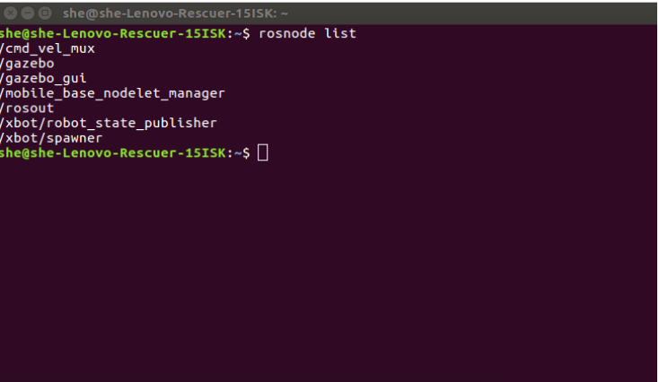

我们来看一下这个cmd_vel_mux节点的详细信息。

```bash
rosnode info /cmd_vel_mux  #查看/cmd_vel_mux节点信息
```

ROS入门教程的代码示例，包括以下ROS软件包

| 软件包                        | 内容                                                      |
| ----------------------------- | --------------------------------------------------------- |
| **robot_sim_demo**            | 机器人仿真程序，大部分示例会用到这个软件包                |
| **topic_demo**                | topic通信，自定义msg，包括C++和python两个版本实现         |
| **service_demo**              | service通信，自定义srv，分别以C++和python两种语言实现     |
| **action_demo**               | action通信，自定义action，C++和python两种语言实现         |
| **param_demo**                | param操作，分别以C++和python两种语言实现                  |
| **msgs_demo**                 | 演示msg、srv、action文件的格式规范                        |
| **tf_demo**                   | tf相关API操作演示，tf示例包括C++和python两个版本          |
| **tf_follower**               | 制作mybot机器人 实现mybot跟随xbot的功能                   |
| **urdf_demo**                 | 创建机器人urdf模型，在RViz中显示                          |
| **navigation_sim_demo**       | 导航演示工具包，包括AMCL, Odometry Navigation等演示       |
| **slam_sim_demo**             | 同步定位与建图演示，包括Gmapping, Karto, Hector等SLAM演示 |
| **robot_orbslam2_demo**       | ORB_SLAM2的演示                                           |
| **ros_academy_for_beginners** | Metapacakge示例，依赖了本仓库所有的pacakge                |

任务三：查看XBot环境

1.连接XBot机器人WIFI
- WIFI 名称：xbot-netowrk-xxx
- WIFI 密码：xbot1234

2.登录XBot机器人

```bash
ssh xbot@192.168.8.101
```
SSH 密码：xbot1234

3.启动XBot机器人

```bash
roslaunch xbot_bringup xbot-u.launch                                  
```

4.查询机器人启动后的ROS话题信息

```bash
rostopic list
```

输出显示

```bash
xbot@nuc:~$ rostopic list
/camera/aligned_depth_to_color/camera_info
/camera/aligned_depth_to_color/image_raw
/camera/aligned_depth_to_color/image_raw/compressed
/camera/aligned_depth_to_color/image_raw/compressed/parameter_descriptions
/camera/aligned_depth_to_color/image_raw/compressed/parameter_updates
/camera/aligned_depth_to_color/image_raw/compressedDepth
/camera/aligned_depth_to_color/image_raw/compressedDepth/parameter_descriptions
/camera/aligned_depth_to_color/image_raw/compressedDepth/parameter_updates
/camera/aligned_depth_to_color/image_raw/theora
/camera/aligned_depth_to_color/image_raw/theora/parameter_descriptions
/camera/aligned_depth_to_color/image_raw/theora/parameter_updates
/camera/color/camera_info
/camera/color/image_raw
/camera/color/image_raw/compressed
/camera/color/image_raw/compressed/parameter_descriptions
/camera/color/image_raw/compressed/parameter_updates
/camera/color/image_raw/compressedDepth
/camera/color/image_raw/compressedDepth/parameter_descriptions
/camera/color/image_raw/compressedDepth/parameter_updates
/camera/color/image_raw/theora
/camera/color/image_raw/theora/parameter_descriptions
/camera/color/image_raw/theora/parameter_updates
/camera/depth/camera_info
/camera/depth/color/points
/camera/depth/image_rect_raw
/camera/depth/image_rect_raw/compressed
/camera/depth/image_rect_raw/compressed/parameter_descriptions
/camera/depth/image_rect_raw/compressed/parameter_updates
/camera/depth/image_rect_raw/compressedDepth
/camera/depth/image_rect_raw/compressedDepth/parameter_descriptions
/camera/depth/image_rect_raw/compressedDepth/parameter_updates
/camera/depth/image_rect_raw/theora
/camera/depth/image_rect_raw/theora/parameter_descriptions
/camera/depth/image_rect_raw/theora/parameter_updates
/camera/extrinsics/depth_to_color
/camera/realsense2_camera_manager/bond
/camera/realsense2_camera_manager/parameter_descriptions
/camera/realsense2_camera_manager/parameter_updates
/cmd_vel_mux/active
/cmd_vel_mux/input/avoid
/cmd_vel_mux/input/navi
/cmd_vel_mux/input/safety_controller
/cmd_vel_mux/input/switch
/cmd_vel_mux/input/teleop
/cmd_vel_mux/parameter_descriptions
/cmd_vel_mux/parameter_updates
/diagnostics
/joint_states
/mobile_base/commands/led
/mobile_base/commands/lift
/mobile_base/commands/motor_disable
/mobile_base/commands/pitch_platform
/mobile_base/commands/reset_odometry
/mobile_base/commands/sound_enable
/mobile_base/commands/velocity
/mobile_base/commands/yaw_platform
/mobile_base/sensors/battery
/mobile_base/sensors/core
/mobile_base/sensors/echo
/mobile_base/sensors/extra
/mobile_base/sensors/imu_data
/mobile_base/sensors/infrared
/mobile_base/sensors/motor_disabled
/mobile_base/sensors/pitch_platform_degree
/mobile_base/sensors/raw_imu_data
/mobile_base/sensors/sound_enabled
/mobile_base/sensors/yaw_platform_degree
/mobile_base/xbot/state
/mobile_base_nodelet_manager/bond
/odom
/rosout
/rosout_agg
/scan
/tf
/tf_static
/welcome/leave
/xbot/camera/image
/xbot/camera/image/compressed
/xbot/camera/image/compressed/parameter_descriptions
/xbot/camera/image/compressed/parameter_updates
/xbot/camera/image/compressedDepth
/xbot/camera/image/compressedDepth/parameter_descriptions
/xbot/camera/image/compressedDepth/parameter_updates
/xbot/camera/image/theora
/xbot/camera/image/theora/parameter_descriptions
/xbot/camera/image/theora/parameter_updates
/xbot/face_result
/xbot/talk_state
```

4.使用键盘控制机器人移动

启动XBot键盘运动控制工具

```bash
rosrun xbot_tools keyboard_teleop.py
```

进入机器人操作界面，界面中已有提示控制命令如下图，可试验机器人行动是否正常，使用i和，控制机器人前进后退，使用j、l控制机器人旋转，使用q、z控制机器人加减速。

```bash
Reading from the keyboard  and Publishing to Twist!
---------------------------
Moving around:
   u    i    o
   j    k    l
   m    ,    .
For Holonomic mode (strafing), hold down the shift key:
---------------------------
   U    I    O
   J    K    L
   M    <    >
t : up (+z)
b : down (-z)
anything else : stop
q/z : increase/decrease max speeds by 10%
w/x : increase/decrease only linear speed by 10%
e/c : increase/decrease only angular speed by 10%
CTRL-C to quit

currently:	speed 0.5	turn 1.0 
```

查看当前摄像头所对应的画面

```bash
rosrun image_view image_view image:=/xbot/camera/image
```

与摄像头相关Topic：Realsense-rgb图像：/camera/color/image_raw，人脸识别摄像头：/xbot/camera/image。

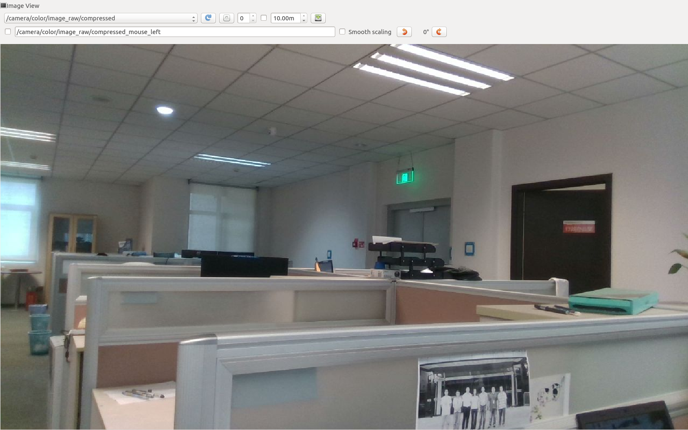
