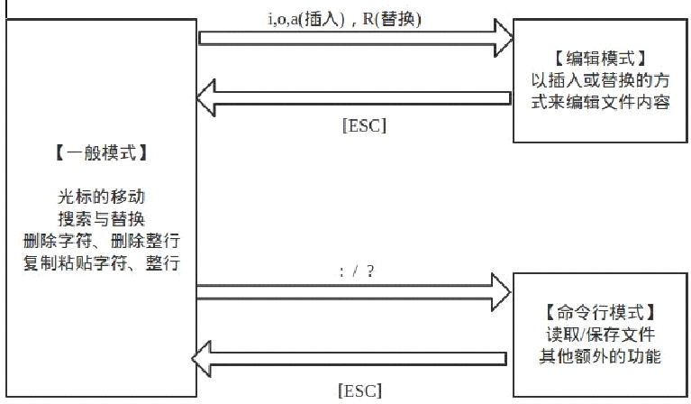
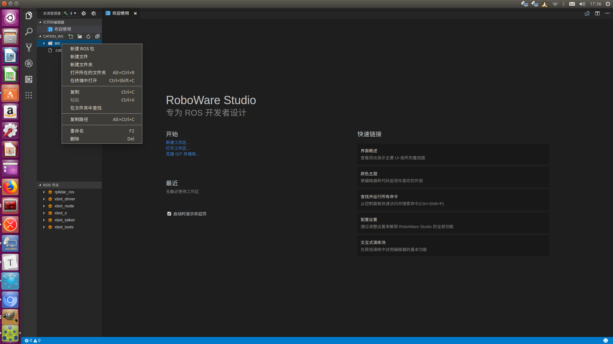
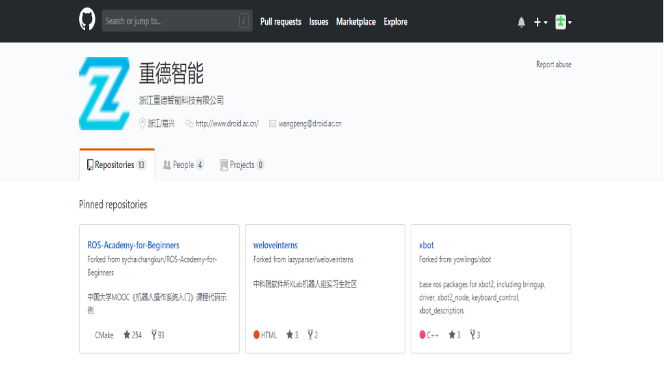
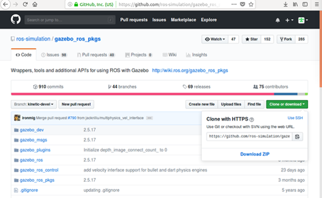
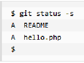
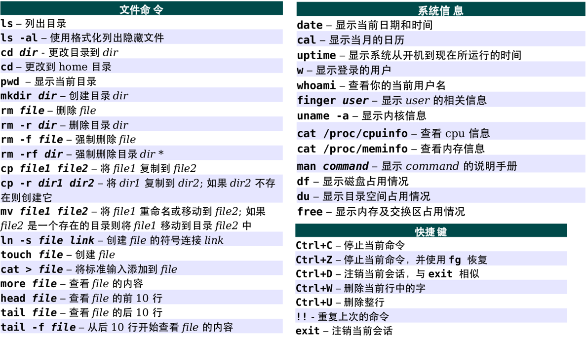

# 3.2 常用开发和代码管理工具

第二讲介绍一下Ubuntu下的常用开发和代码管理工具VIM，Roboware Studio和Git。

**本讲重点**

- VIM
- Roboware Studio
- 代码管理器Git

**教学目的**

- 了解VIM的使用方法，使用XBot ROSPY进行练习，熟练相关操作
- 了解ROS IDE工具Roboware Studio的使用方法，使用XBot ROSPY进行练习，熟练相关操作
- 了解代码管理工具Git的使用方法

## 1. VIM

很多场景下并不适合使用图形化编程工具，比如通过ssh远程登陆到机器时。vim是一个万能的编辑器，正好适用于这种场合，将一些最常用的操作烂熟于心，你会发现编辑效率会得到非常大的提升。所有的Unix /linux系统都会内建vi文书编辑器，其他的文书编辑器则不一定会存在。但是目前我们使用比较多的是vim编辑器。vim具有程序编辑的能力，可以主动的以字体颜色辨别语法的正确性，方便程序设计。vi/vim的区别简单点来说，它们都是多模式编辑器，不同的是vim是vi的升级版本，它不仅兼容vi的所有指令，而且还有一些新的特性在里面，例如语法加亮。



**第一级 – 入门**

1. 安装 vim

```bash
sudo apt-get install vim
```

2. 启动 vim

当你安装好一个编辑器后，你一定会想在其中输入点什么东西，然后看看这个编辑器是什么样子。但vim不是这样的，请按照下面的命令操作：

- 打开一个新的终端，输入`vim`来启动vim
- 启动vim后，vim在 *Normal* （正常）模式下，正常模式主要用来浏览和修改文本内容，一般打开vim都是正常模式。在任何模式下，只要按下 Esc 键就可以返回正常模式。
- 让我们进入 *Insert* （插入）模式，插入模式则用来向文本中添加内容，按下键 i进入 插入模式。
- 此时，你可以输入文本了，就像你用“记事本”一样。
- 现在，你知道如何在 *Insert* 和 *Normal* 模式下切换了。下面是一些命令，可以让你在 *Normal* 模式下熟悉基本的使用方法：

> - `i` → *Insert* 模式，按 `ESC` 回到 *Normal* 模式.
> - `x` → 删当前光标所在的一个字符。
> - `:wq` → 存盘 + 退出 (`:w` 存盘, `:q` 退出)   （w 后可以跟文件名）
> - `dd` → 删除当前行，并把删除的行存到剪贴板里
> - `p` → 粘贴剪贴板
>
> **推荐**:
>
> - `hjkl` (强例推荐使用其移动光标，但不必需) →你也可以使用光标键 (←↓↑→). 注: `j` 就像下箭头。
> - `:help <command>` → 显示相关命令的帮助。你也可以就输入 `:help` 而不跟命令。

你能在vim幸存下来只需要上述的那5个命令，你就可以编辑文本了，你一定要把这些命令练成一种下意识的状态。于是你就可以开始进阶到第二级了。**在vim的常规模式下，所有的键就是功能键**。

标记:

- 以 `:` 开始的命令你需要输入 `<enter>`回车，例如 — 如果我写成 `:q` 也就是说你要输入 `:q<enter>`.

练习：为了熟悉vim的基本使用方法，我们用vim编写一个ROSPY程序（rotate.py），程序源码如下，这段程序的功能是使XBot机器人进行原地旋转。

**仿真下运行**

```python
#!/usr/bin/env python
# coding=utf-8

import rospy
import time
from geometry_msgs.msg import Twist

class multi_keybroad_handle():
	def __init__(self):
		self.pub = rospy.Publisher('/cmd_vel', Twist, queue_size = 1)
		r=rospy.Rate(20)
		try:
			while not rospy.is_shutdown():
				self.cmd = Twist()
				self.cmd.angular.z = 3.1415926*30/180
				self.pub.publish(self.cmd)
				r.sleep()

		except :
			print 'error'

		finally:
			self.pub.publishf(self.cmd)

if __name__=='__main__':
	rospy.init_node('xbot_auto_control')
	try:
		rospy.loginfo( "initialization system")
		multi_keybroad_handle()
		print "process done and quit"
	except rospy.ROSInterruptException:
		rospy.loginfo("node terminated.")
```

修改~/.bashrc，添加ROS主从配置

```bash
vim ~/.bashrc
```

```bash
#export ROS_MASTER_URI=http://192.168.8.101:11311
export ROS_MASTER_URI=http://127.0.0.1:11311       #设置主机（仿真或机器人）IP和端口

#export ROS_HOSTNAME=192.168.8.xxx
export ROS_HOSTNAME=127.0.0.1                      #设置从机（客户端笔记本）IP
```

启动Gazebo XBot仿真环境

```bash
roslaunch robot_sim_demo robot_spawn.launch    
```

运行rotate.py，仿真中XBot机器人开始旋转

```bash
python rotate.py
```

**在XBot上运行**

```python
#!/usr/bin/env python
# coding=utf-8

import rospy
import time
from geometry_msgs.msg import Twist

class multi_keybroad_handle():
	def __init__(self):
		self.pub = rospy.Publisher('/cmd_vel_mux/input/teleop', Twist, queue_size = 1)
		r=rospy.Rate(20)
		try:
			while not rospy.is_shutdown():
				self.cmd = Twist()
				self.cmd.angular.z = 3.1415926/180
				self.pub.publish(self.cmd)
				r.sleep()

		except :
			print 'error'

		finally:
			self.pub.publishf(self.cmd)

if __name__=='__main__':
	rospy.init_node('xbot_auto_control')
	try:
		rospy.loginfo( "initialization system")
		multi_keybroad_handle()
		print "process done and quit"
	except rospy.ROSInterruptException:
		rospy.loginfo("node terminated.")
```

修改`~/.bashrc`，添加ROS主从配置

```bash
vim ~/.bashrc
```

```bash
export ROS_MASTER_URI=http://192.168.8.101:11311
#export ROS_MASTER_URI=http://127.0.0.1:11311

export ROS_HOSTNAME=192.168.8.xxx                #客户端笔记本下使用ifconfig本机DHCP IP
#export ROS_HOSTNAME=127.0.0.1
```

启动XBot（通常XBot开机自启，也可运行以下命令手动启动XBot）

```bash
roslaunch xbot_bringup xbot-u.launch
```

运行rotate.py，XBot机器人开始旋转

```bash
python rotate.py
```

**第二级 –熟练**

上面的那些命令只能让你存活下来，现在是时候学习一些更多的命令了。

1. 各种插入模式

   > - `a` → 在光标后插入
   > - `o` → 在当前行后插入一个新行
   > - `O` → 在当前行前插入一个新行
   > - `cw` → 替换从光标所在位置后到一个单词结尾的字符

2. 简单的移动光标

   > - `0` → 数字零，到行头
   > - `^` → 到本行第一个不是blank字符的位置（所谓blank字符就是空格，tab，换行，回车等）
   > - `$` → 到本行行尾
   > - `g_` → 到本行最后一个不是blank字符的位置。
   > - `/pattern` → 搜索 `pattern` 的字符串（如果搜索出多个匹配，可按n键到下一个）

3. 拷贝/粘贴

    （p/P都可以，p是表示在当前位置之后，P表示在当前位置之前）

   > - `P` → 粘贴
   > - `yy` → 拷贝当前行当行于 `ddP`

4. Undo/Redo

   > - `u` → undo
   > - `<Ctrl-r>` → redo

5. 打开/保存/退出/改变文件

   (Buffer)

   > - `:e <path/to/file>` → 打开一个文件
   > - `:w` → 存盘
   > - `:saveas <path/to/file>` → 另存为 `<path/to/file>`
   > - `:x`， `ZZ` 或 `:wq` → 保存并退出 (`:x` 表示仅在需要时保存，ZZ不需要输入冒号并回车)
   > - `:q!` → 退出不保存 `:qa!` 强行退出所有的正在编辑的文件，就算别的文件有更改。
   > - `:bn` 和 `:bp` → 你可以同时打开很多文件，使用这两个命令来切换下一个或上一个文件。（使用:n到下一个文件）

花点时间熟悉一下上面的命令，一旦你掌握他们了，你就几乎可以干其它编辑器都能干的事了。但是到现在为止，你还是觉得使用vim还是有点笨拙，不过没关系，你可以进阶到第三级了。

练习：使用以上命令操作第一级练习。

**第三级 – 精通**

在第三级，我们只谈那些和vi可以兼容的命令。

下面，让我们看一下vim是怎么重复自己的：

1. `.` → (小数点) 可以重复上一次的命令
2. N<command> → 重复某个命令N次

下面是一个示例，找开一个文件你可以试试下面的命令：

> - `2dd` → 删除2行
> - `3p` → 粘贴文本3次
> - `100idesu [ESC]` → 会写下 “desu desu desu desu desu desu desu desu desu desu desu desu desu desu desu desu desu desu desu desu desu desu desu desu desu desu desu desu desu desu desu desu desu desu desu desu desu desu desu desu desu desu desu desu desu desu desu desu desu desu desu desu desu desu desu desu desu desu desu desu desu desu desu desu desu desu desu desu desu desu desu desu desu desu desu desu desu desu desu desu desu desu desu desu desu desu desu desu desu desu desu desu desu desu desu desu desu desu desu desu “
> - `.` → 重复上一个命令—— 100 “desu “.
> - `3.` → 重复 3 次 “desu” (注意：不是 300，你看，VIM多聪明啊).

你要让你的光标移动更有效率，你一定要了解下面的这些命令，**千万别跳过**。

1. N`G` → 到第 N 行 （注意命令中的G是大写的，另外我一般使用 : N 到第N行，如 :137 到第137行）

2. `gg` → 到第一行。（相当于1G，或 :1）

3. `G` → 到最后一行。

4. 按单词移动：

   > 1. `w` → 到下一个单词的开头。
   > 2. `e` → 到下一个单词的结尾。
   >
   > \> 如果你认为单词是由默认方式，那么就用小写的e和w。默认上来说，一个单词由字母，数字和下划线组成（陈皓注：程序变量）
   >
   > \> 如果你认为单词是由blank字符分隔符，那么你需要使用大写的E和W。
   >

下面，让我来说说最强的光标移动：

> - `%` : 匹配括号移动，包括 `(`, `{`, `[`. （陈皓注：你需要把光标先移到括号上）
> - `*` 和 `#`:  匹配光标当前所在的单词，移动光标到下一个（或上一个）匹配单词（*是下一个，#是上一个）

相信我，上面这三个命令对程序员来说是相当强大的。

你一定要记住光标的移动，因为很多命令都可以和这些移动光标的命令连动。很多命令都可以如下来干：

```
<start position><command><end position>
```

例如 `0y$` 命令意味着：

- `0` → 先到行头
- `y` → 从这里开始拷贝
- `$` → 拷贝到本行最后一个字符

你可以输入 `ye`，从当前位置拷贝到本单词的最后一个字符。

你也可以输入 `y2/foo` 来拷贝2个 “foo” 之间的字符串。

还有很多时间并不一定你就一定要按y才会拷贝，下面的命令也会被拷贝：

- `d` (删除 )
- `v` (可视化的选择)
- `gU` (变大写)
- `gu` (变小写)

练习：使用以上命令操作第一级练习。 

**第四级 – 深入**

你只需要掌握前面的命令，你就可以很舒服的使用vim了。现在，我们向你介绍的是vim杀手级的功能。下面这些功能是我只用vim的原因。

在当前行上移动光标: `0` `^` `#####  `f` `F` `t` `T` `,` `;`

> - `0` → 到行头
> - `^` → 到本行的第一个非blank字符
> - `$` → 到行尾
> - `g_` → 到本行最后一个不是blank字符的位置。
> - `fa` → 到下一个为a的字符处，你也可以fs到下一个为s的字符。
> - `t,` → 到逗号前的第一个字符。逗号可以变成其它字符。
> - `3fa` → 在当前行查找第三个出现的a。
> - `F` 和 `T` → 和 `f` 和 `t` 一样，只不过是相反方向。

还有一个很有用的命令是 `dt"` → 删除所有的内容，直到遇到双引号—— `"。`

区域选择 `<action>a<object>` 或 `<action>i<object>`

在visual 模式下，这些命令很强大，其命令格式为

```
<action>a<object>` 和 `<action>i<object>
```

- action可以是任何的命令，如 `d` (删除), `y` (拷贝), `v` (可以视模式选择)。
- object 可能是： `w` 一个单词， `W` 一个以空格为分隔的单词， `s` 一个句字， `p` 一个段落。也可以是一个特别的字符：`"、` `'、` `)、` `}、` `]。`

假设你有一个字符串 `(map (+) ("foo"))`.而光标键在第一个 `o `的位置。

> - `vi"` → 会选择 `foo`.
> - `va"` → 会选择 `"foo"`.
> - `vi)` → 会选择 `"foo"`.
> - `va)` → 会选择`("foo")`.
> - `v2i)` → 会选择 `map (+) ("foo")`
> - `v2a)` → 会选择 `(map (+) ("foo"))

块操作: `<Ctrl-v>`

块操作，典型的操作： `0 <Ctrl-v> <Ctrl-d> I-- [ESC]`

- `^` → 到行头
- `<Ctrl-v>` → 开始块操作
- `<Ctrl-d>` → 向下移动 (你也可以使用hjkl来移动光标，或是使用%，或是别的)
- `I-- [ESC]` → I是插入，插入“`--`”，按ESC键来为每一行生效。

自动提示： `<Ctrl-n>` 和 `<Ctrl-p>`

在 Insert 模式下，你可以输入一个词的开头，然后按 `<Ctrl-p>或是<Ctrl-n>，自动补齐功能就出现了……`

- `qa` 把你的操作记录在寄存器 `a。`
- 于是 `@a` 会replay被录制的宏。
- `@@` 是一个快捷键用来replay最新录制的宏。

> **示例**
>
> 在一个只有一行且这一行只有“1”的文本中，键入如下命令：
>
> ```
>   qaYp<Ctrl-a>q
> ```
>
> ```
>   - `qa` 开始录制
>   - `Yp` 复制行.
>   - `<Ctrl-a>` 增加1.
>   - `q` 停止录制.
> 
> - `@a` → 在1下面写下 2
> 
> - `@@` → 在2 正面写下3
> 
> - 现在做 `100@@` 会创建新的100行，并把数据增加到 103.
> ```


可视化选择： `v`,`V`,`<Ctrl-v>`

前面，我们看到了 `<Ctrl-v>`的示例 （在Windows下应该是<Ctrl-q>），我们可以使用 `v` 和 `V`。一但被选好了，你可以做下面的事：

- `J` → 把所有的行连接起来（变成一行）
- `<` 或 `>` → 左右缩进
- `=` → 自动给缩进 

在所有被选择的行后加上点东西：

- `<Ctrl-v>`
- 选中相关的行 (可使用 `j` 或 `<Ctrl-d>` 或是 `/pattern` 或是 `%` 等……)
- `$` 到行最后
- `A`, 输入字符串，按 `ESC。

下面是主要的命令，你可以使用VIM的帮助 `:help split`

> - `:split` → 创建分屏 (`:vsplit`创建垂直分屏)
> - `<Ctrl-w><dir>` : dir就是方向，可以是 `hjkl` 或是 ←↓↑→ 中的一个，其用来切换分屏。
> - `<Ctrl-w>_` (或 `<Ctrl-w>|`) : 最大化尺寸 (<Ctrl-w>| 垂直分屏)
> - `<Ctrl-w>+` (或 `<Ctrl-w>-`) : 增加尺寸

**任务**

以教学软件包中任意一个launch文件为样本，使用vim对其操作。（上重德智能GitHub的网站下载）

重德智能GitHub： https://github.com/DroidAITech/

主要有编写，保存退出，复制整个launch文件到另一个文档。

下面我们进行模拟练习，主要对针对vim的使用，这里我们尽量选择与我们学习机器人相关的知识。以教学软件包中任意1个程序为样本，练习程序编写、拷贝、删除等。这里我们以重写和复制navigation_demo.launch文件为例


```xml
<launch>
    <!-- Map server -->
    <arg name="map_file" default="$(find slam_sim_demo)/maps/Software_Museum.yaml"/>
    <node name="map_server" pkg="map_server" type="map_server" args="$(arg map_file)" />
    <!-- Localization -->
    <arg name="initial_pose_x" default="5.0"/>
    <arg name="initial_pose_y" default="0.0"/>
    <arg name="initial_pose_a" default="-2.0"/>
    <arg name="custom_amcl_launch_file" default="$(find navigation_sim_demo)/launch/include/robot_amcl.launch.xml"/>
    <include file="$(arg custom_amcl_launch_file)">
        <arg name="initial_pose_x" value="$(arg initial_pose_x)"/>
        <arg name="initial_pose_y" value="$(arg initial_pose_y)"/>
        <arg name="initial_pose_a" value="$(arg initial_pose_a)"/>
    </include>
    <!-- Move base -->
    <include file="$(find navigation_sim_demo)/launch/include/move_base.launch.xml"/>
</launch>
```

## 2. Roboware Studio

1. 点击Roboware Studio图标打开软件，点击`new workspace`，新建工作区。


选择路径并添加工作区的名字catkin_ws，生成了工作区 效果等同于catkin_init_workspace


2. 创建程序包

工作空间的src目录下，右键鼠标，选择新建ROS包。点击程序包，右键，选择“编辑依赖的ROS包列表”。



3. 添加并编写.py源文件  

4. 运行文件

点击左上角 资源管理器右边的小锤子,进行编译文件，锤子旁边的选项卡选择为release。其他选项卡除了Debug之外都是远程编译。


我们了解一下关于保存log文件的位置  

在上面的运行结果中，保存日志的位置是“/home/xxx/.ros/log /”，但实际上它被记录在设置ROS_HOME环境变量的地方。如果ROS_HOME环境变量未设置，则默认值为“~/.ros/log /”

**Roboware Studio练习**

本节我们手动编写的第一个ROS程序，控制XBot向前走。编写这个程序主要分为五个步骤1. 创建Catkin工作空间、2. 创建一个Package、3. 创建src目录、4. 在src文件夹中创建一个forward.py文件，编写程序代码如下、5.运行forward.py。此程序的功能是控制XBot向前走5s。

**仿真下运行**

```python
#!/usr/bin/env python
# coding=utf-8

import rospy
import time
from geometry_msgs.msg import Twist

class multi_keybroad_handle():
	def __init__(self):
		self.pub = rospy.Publisher('/cmd_vel', Twist, queue_size = 1)
		r=rospy.Rate(20)
		try:
			for x in range(0, 100):
				self.cmd = Twist()
				self.cmd.linear.x = 0.5
				self.pub.publish(self.cmd)
				r.sleep()
			self.cmd = Twist()                        
			self.cmd.linear.x = 0
			self.pub.publish(self.cmd)

		except :
			print 'error'

		finally:
			self.pub.publish(self.cmd)
		
if __name__=='__main__':
	rospy.init_node('xbot_auto_control')
	try:
		rospy.loginfo( "initialization system")
		multi_keybroad_handle()
		print "process done and quit"
	except rospy.ROSInterruptException:
		rospy.loginfo("node terminated.")
```
forward.py添加可执行权限
```bash
chmod u+x forward.py
```

添加ROS主从配置

```
vim ~/.bashrc
```

```bash
#export ROS_MASTER_URI=http://192.168.8.101:11311
export ROS_MASTER_URI=http://127.0.0.1:11311
#export ROS_HOSTNAME=192.168.8.xxx
export ROS_HOSTNAME=127.0.0.1
```

启动仿真

```bash
roslaunch robot_sim_demo robot_spawn.launch    
```

运行程序
```
python forward.py
```

**在XBot上运行**

```python
#!/usr/bin/env python
# coding=utf-8

import rospy
import time
from geometry_msgs.msg import Twist

class multi_keybroad_handle():
	def __init__(self):
		self.pub = rospy.Publisher('/cmd_vel_mux/input/teleop', Twist, queue_size = 1)
		r=rospy.Rate(20)
		try:
			for x in range(0, 100):
				self.cmd = Twist()
				self.cmd.linear.x = 0.5
				self.pub.publish(self.cmd)
				r.sleep()
			self.cmd = Twist()                        
			self.cmd.linear.x = 0
			self.pub.publish(self.cmd)

		except :
			print 'error'

		finally:
			self.pub.publish(self.cmd)
		
if __name__=='__main__':
	rospy.init_node('xbot_auto_control')
	try:
		rospy.loginfo( "initialization system")
		multi_keybroad_handle()
		print "process done and quit"
	except rospy.ROSInterruptException:
		rospy.loginfo("node terminated.")
```
forward.py添加可执行权限
```bash
chmod u+x forward.py
```

修改~/.bashrc，添加ROS主从配置

```
vim ~/.bashrc
```

```bash
export ROS_MASTER_URI=http://192.168.8.101:11311
#export ROS_MASTER_URI=http://127.0.0.1:11311
export ROS_HOSTNAME=192.168.8.xxx                    #学生笔记本下使用ifconfig本机DHCP IP
#export ROS_HOSTNAME=127.0.0.1
```

启动XBot（XBot开机自启，或运行以下命令）

```
roslaunch xbot_bringup xbot-u.launch
```

运行forward.py，XBot机器人开始旋转

```
python forward.py
```

常见问题：

1. 设置和刷新catkin_ws工作空间。

`source  ~/catkin_ws/devel/setup.bash`

2. 我们介绍一下source

- source: 在当前shell内去读取、执行a.sh，而a.sh不需要有"执行权限"。若script的环境有所改变， 当然也会改变当前process环境了。
- bash: 打开一个subshell去读取、执行a.sh，而a.sh不需要有"执行权限"
- ./: 打开一个subshell去读取、执行a.sh，但a.sh需要有"执行权限"

通常在subshell里运行的脚本里设置变量，不会影响到父shell的。
编译完成后必须使用source命令刷新一下工作空间的环境。初学时可能以为，在工作空间中进行一次source之后就一劳永逸以后都不用source了，这种看法是错的。事实是，每次进行catkin_make之后，都要进行source。

进行package创建时，当加入了新的package编译完成后，也要进行source刷新环境，否则会出现找不到“package XXX not found” 的问题。

如first_pkg 为我们自己创建的package包名, 如果新建终端再进行rosrun就提示package test找不到，因为此时重新编译了但未刷新环境。source之后，就可以运行了。

3. 权限设置

可以用`chmod u+x`添加执行权限


这样每次都要source都很麻烦，解决办法是使用如下命令 

`echo “source ~/catkin_ws/devel/setup.bash” >> ~/.bashrc `

这样在每次打开终端时，让系统自动刷新工作空间环境。在这个工作空间下的所有package都可以编译后就可以直接运行了，不用再source。 

注： echo $ROS_PACKAGE_PATH可以查看系统包含的package路径。

## 3. 代码管理Git

这一部分我们介绍一下github中下载与上传操作，gitHub是一个面向开源项目代码管理平台，因为只支持git，作为唯一的版本库格式进行托管，故名gitHub。使用ROS系统，需要用到许多数据包，有些时候你需要使用的ROS数据包并没有Debian包的形式，这时你需要从数据源安装它。代码开发人员通常使用的有三种主流的版本控制系统：SVN，Git和Mercurial。如何使用Git来下载你需要的代码资源呢？ 首先要说明的是在github上只能clone一个完整的项目，为了保证一个项目的完整性，github不允许仅clone单个件或文件夹。

登录github  https://github.com在搜索框中通过关键字搜索你需要的项目 (https://github.com/DroidAITech)



下载项目，可以看到 Clone or download 选项，点击地址栏右侧图标对地址进行复制



创建一个你自己的工作空间，并在终端中克隆该项目

```bash
# 1、打开一个新终端，输入
cd ~/catkin_ws/src 

#2、克隆软件项目
git clone https://github.com/ros-simulation/gazebo_ros_pkgs.git
```


**任务一：创建Github账号和绑定SSH**

操作步骤

1. 创建Github账号

2. 安装git  

```bash
sudo apt-get install git
```

3. 配置本机git的两个重要信息，user.name和user.email,终端输入如下命令即可设置

```bash
git config --global user.name "Your Name"
git config --global user.email "email@example.com"
```

接下来我们介绍如何上传本地文件到Github仓库，首先需要创建Github账号和绑定SSH，创建账号的过程在此不进行详细叙述了。

4. 通过命令 git config --list，查看是否设置成功，以下为我本机显示

```
user.name=luoyunxiang
user.email=yunxiang.luo@gmail.com
```

5. 查看home目录下是否有.ssh目录，一般情况是没有的，需要我们敲命令生成这个目录，在终端输入

```bash
ssh-keygen -t rsa -C youremail@example.com
```

6. 进入home目录下的.ssh目录你会看到两个文件id_rsa和id_rsa.pub,id_rsa是私钥，id_rsa.pub是公钥。将id_rsa.pub文件中的内容拷贝一下。

7. 进入你自己的github，进入Settings->SSH and GPG keys->New SSH key。在Key那栏下面将6.拷贝的东西粘贴进去就可以了，最后点击 Add SSH key按钮添加。

**任务二：上传文件到Github仓库**

操作步骤

1. 进入到要上传文件的文件夹，右键“在终端打开”

2. 打开终端输入`git init`    ，初始化本地仓库(文件夹) 

3. 打开终端输入 `git add .`， 添加本地仓库（当前文件夹）的所有文件

4. 终端输入 `git commit -m "first commit"`，参数-m可以说明本次提交的描述信息

5. 终端输入 `git remote rm origin`，清空当前远程oringin

6. 终端输入 `git remote add origin https://github.com/你的账号名/你新建的仓库名.git`

7. 终端输入`git push -u origin master`上传 


上传成功如上图。

**git命令详细介绍**

**git init**

在执行完成`git init`命令后，Git 仓库会生成一个 .git 目录，该目录包含了资源的所有元数据，其他的项目目录保持不变（不像 SVN 会在每个子目录生成 .svn 目录，Git 只在仓库的根目录生成 .git 目录）。使用当前目录作为Git仓库，我们只需使它初始化。

使用指定目录作为Git仓库

```bash
git init newrepo
```

初始化后，会在 newrepo 目录下会出现一个名为 .git 的目录，所有 Git 需要的数据和资源都存放在这个目录中。

**git fetch**

从远程获取最新版本到本地，不会自动合并。

```bash
git fetch origin master
```

首先从远程的origin的master主分支下载最新的版本到origin/master分支上 然后比较本地的master分支和origin/master分支的差别 最后进行合并。实际使用中，相较于git pull，git fetch更安全一些，因为在merge前，我们可以查看更新情况，然后再决定是否合并。

**git pull**

`git pull`命令用于从另一个存储库或本地分支获取并集成(整合),取回远程主机某个分支的更新，再与本地的指定分支合并，它的完整格式稍稍有点复杂：

```bash
git pull <repository>
```

将远程存储库中的更改合并到当前分支中。在默认模式下，git pull是git fetch后跟git merge FETCH_HEAD的缩写。更准确地说，git pull使用给定的参数运行git fetch，并调用git merge将检索到的分支头合并到当前分支中。 使用--rebase，它运行git rebase而不是git merge。

**git push**

git push命令用于将本地分支的更新，推送到远程主机。它的格式与git pull命令相似

```
git push <远程主机名> <本地分支名>:<远程分支名>
```
使用本地引用更新远程引用，同时发送完成给定引用所需的对象。可以在每次推入存储库时，通过在那里设置挂钩触发一些事件。

当命令行不指定使用<repository>参数推送的位置时，将查询当前分支的branch.*.remote配置以确定要在哪里推送。 如果配置丢失，则默认为origin

```bash
git push origin master
```

上面命令表示，将本地的master分支推送到origin主机的master分支。如果master不存在，则会被新建。如果省略本地分支名，则表示删除指定的远程分支，因为这等同于推送一个空的本地分支到远程分支。

```bash
git push origin :master 等同于 git push origin --delete master
```

**git clone**

我们使用 git clone 从现有 Git 仓库中拷贝项目（类似 svn checkout）。

```bash
git clone <repo>
```

如果我们需要克隆到指定的目录，可以使用以下命令格式：

```bash
git clone <repo> <directory>
```

其中， repo:Git 仓库， directory:本地目录。例如要克隆 Ruby 语言的 Git 代码仓库 Grit，可以用下面的命令：

```
git clone git@yt.droid.ac.cn:rosmentor/bro2018fall.git
```

如果要自己定义要新建的项目目录名称，可以在上面的命令末尾指定新的名字：

```bash
git@yt.droid.ac.cn:rosmentor/bro2018fall.git mygit
```

**git add**  

**git status**

git add 命令可将该文件添加到缓存

git status 命令用于查看项目的当前状态

执行 git add 命令来添加文件：

```
git add README hello.php
```

再执行 git status，就可以看到这两个文件已经加上去了



此外使用 git add . 命令可以添加当前项目的所有文件

**git diff**

执行 git diff 来查看执行git status 的结果的详细信息。git diff 命令显示已写入缓存与已修改但尚未写入缓存的改动的区别。git diff 有两个主要的应用场景:

- 尚未缓存的改动：git diff
- 查看已缓存的改动： git diff --cached
- 查看已缓存的与未缓存的所有改动：git diff HEAD
- 显示摘要而非整个 diff：git diff --stat

通俗来说， git status 显示你上次提交更新后的更改或者写入缓存的改动， 而 git diff 一行一行地显示这些改动具体是啥

**git commit** 

执行 git commit 将缓存区内容添加到仓库中。
Git 为你的每一个提交都记录你的名字与电子邮箱地址，所以第一步需要配置用户名和邮箱地址。

```
git config --global user.name
git config --global user.email
```

上述代码后要跟具体的名字


如果觉得 git add 提交缓存的流程太过繁琐，Git 也允许你用 -a 选项跳过这一步。命令格式如下：

```
git commit -a
```

**git reset HEAD**

用于取消已缓存的内容
将README，hello.php修改提交缓存区后执行

```
git reset HEAD hello.php
```

再执行 git commit，只会将 README 文件的改动提交，而 hello.php 是没有的

**git rm**

要从 Git 中移除某个文件，就必须要从已跟踪文件清单中移除，然后提交。可以用以下命令完成此项工作

```
git rm <file>
```

如果删除之前修改过并且已经放到暂存区域的话，则必须要用强制删除选项 -f

```
git rm -f <file>
```

如果把文件从暂存区域移除，但仍然希望保留在当前工作目录中，换句话说，仅是从跟踪清单中删除，使用 --cached 选项即可

```
git rm --cached <file>
```

**git commit** 
git mv 命令用于移动或重命名一个文件、目录、软连接
先把刚移除的 README 添加回来：

```
git add README
```

然后对其重命名：

```bash
git mv README README.md
```

**分支管理**

- 列出分支：git branch

- 删除分支：git branch -d <branchname>

- 合并分支：git merge

- 查看远程分支：git branch -a

- 切换分支（若要切换不存在，则创建该分支）：git branch -b master

本讲就到此结束了，谢谢各位同学的收听，希望大家多回顾这部分的讲义，起到记忆的效果。

附：Linux 基本指令



最后我们提供了一些Linux基本指令，希望可以帮助大家进行操作，本讲课程就到这里。
