# 2.1 ROS工程结构

大家好，本讲我们介绍ROS工程结构。

**本讲重点**

- catkin工作空间
- package和metapackage

**教学目的**

- 了解catkin工作空间基础知识，掌握程序编译和运行方法
- 了解什么是package和metapackage

以下是典型的ROS工程目录结构。


**catkin工作空间** 

首先要给大家介绍catkin工作空间，因为他是整个ROS工程框架里层次最高的概念，工作空间就是工作空间，为什么前面要加一个catkin呢？catkin工作空间就是catkin加工作空间。

catkin

- ROS定制的编译构建系统
- 对CMake的扩展

我们讲一下catkin的概念，catkin是ROS定制的编译构建系统，它是对CMake编译系统的扩展，和Cmake很像，但是ROS这样体量很大的工程，catkin可以有更好的支持，也简化了操作。这里涉及到编译系统的概念，如果有兴趣可以看看相关的书籍，在此我们就不展开了，总之你要知道，catkin是用来编译ROS程序的，就行了。

catkin工作空间

- 组织和管理功能包的文件夹
- 以catkin工具编译

catkin工作空间其实就是个文件夹，用来组织和管理你的软件功能包，比如对功能包的创建、克隆、修改这些操作都是在这个文件夹里面。然后用catkin对它们编译构建。各种代码都放在这个catkin workspace里面。

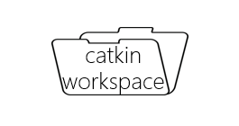

下面我们讲一下ROS编程的步骤。

1. 建立工作空间

```bash
mkdir -p  ~/catkin_ws/src  #~/catkin_ws为用户定义的工作空间目录
```

2. 编译工作空间

```bash
cd ~/catkin_ws                      #回到工作空间  
catkin_make                         #编译工作空间
source ~/catkin_ws/devel/setup.bash #编译完成后要source刷新环境
```

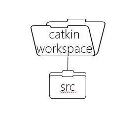

首先是创建工作空间，当我们用指令来创建工作空间，那就必须讲到caktin_make这个指令。先是创建一个叫catkin_ws的文件夹，名字可以任意取，但是里面要有src目录，这一点要注意。然后进入工作空间，接着运行了一个命令`catkin_make`，这个命令很重要，它的作用是初始化工作空间，这样我们的工作空间就建好了。其实`catkin_make`不只是初始化工作空间，他最重要的功能是编译。我们写完了代码，然后catkin_make一下，这样系统就会进行自动构建，注意啊，运行`catkin_make`之前一定要回到workspace目录，否则编译会失败。一定要`cd ~/catkin_ws`,创建完工作空间，catkin_make之后，这个workspace下就会创建相关目录和文件。

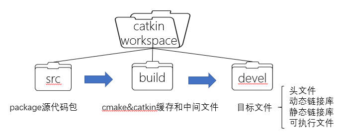

你会发现工作空间下面会多出来两个文件夹，build和devel。这两个文件夹是干嘛的呢？ build里面是Cmake和catkin缓存信息和中间文件，devel里面是生成的目标文件，包括（头文件、动态静态库，还有可执行文件）。src是我们真正写代码的地方，catkin_make之后，build和devel这两个文件夹你都不用管，catkin系统会帮我们做好这些工作。我们日常开发只和src打交道。


build和devel可以忽视，我们就来看看src里面放的是什么？

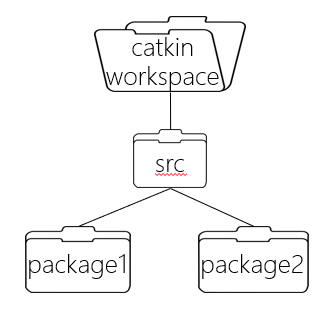

什么呢？是各种package功能包。

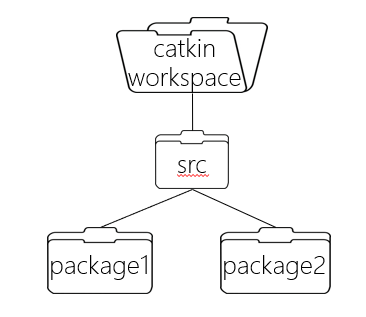

同学们在一些ROS教材还有博客上，会看到stack，功能包集这个概念，实际上说的不准确，ROS里stack这个概念早就没有了，在ROS groovy版本之后就取消了，不用去管它。Stack的作用是把一些功能相似的package组织在一起，举个例子，比如navigation导航模块，我们打开它的github页面看一下。

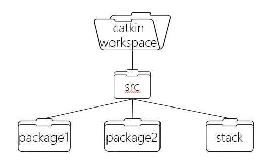

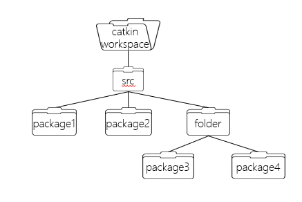

做法很简单，直接新建一个文件夹，比如xbot或navigation，这个xbot或navigation现在不叫stack，叫做metapackage。把它的包含的package都放进来，不用编写规则。这就是catkin工作空间的结构，编译的时候系统会在src下递归的查找你的package，然后编译。这个stack是我觉得现在很多资料没有讲清的，是初学者容易被困惑的一个地方，我们专门讲一下，希望能对各位有所帮助。下面讲这讲最重要的概念，功能包--package。

**metapackage**

多个package的集合。例如：Navitation---导航、Moveit---运动规划、XBot---XBot机器人。


这个navigation是用来实现机器人自主导航的，里面这每一个都是package，如amcl用于定位。这些包耦合性比较强，所以都放在一个文件夹下。navigation这个package的集合称为stack。


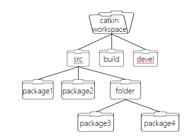

上面讲到工作空间下管理着很多package，那什么是package呢？

**package**

package这是ROS文件系统层面最重要的概念，现在我们深入看一下package是什么？

- ROS软件的基本组织形式
- catkin编译的基本单元
- 一个package可以包含多个可执行文件（节点）

package功能包是ROS软件的基本组织形式，我们在用`catkin_make`进行编译的时候，以pkg为基本单位编译。catkin找到一个个package进行编译，一个package可以对应多个ROS的可执行文件，`catkin_make`可构建出来多个目标文件。判断一个包是不是package的依据是什么呢？为什么说`dwa_navigation`是一个package？

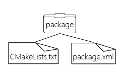

很简单，是因为这个package下面包含了这两个文件，CMakeLists.txt和package.xml。一个package要想被catkin编译系统认定为一个package，至少得有这两个文件，缺一不可，这两个文件就定义好了一个package。这张图片上的这个结构，就是一个简单的package。我们来看看navigation的这些package，https://github.com/ros-planning/navigation。

**CMakeLists.txt**

CMakeLists.txt规定了catkin的编译规则，告诉编译系统，比如怎么样去编译我这个package里的代码，编译哪些文件，需要哪些依赖，生成哪些可执行目标，怎么样链接等信息。

| 名称                                                       | 内容                                  |
| ---------------------------------------------------------- | ------------------------------------- |
| cmake_minimum_required()                                   | 指定catkin最低版本                    |
| project()                                                  | 指定软件包的名称                      |
| find_package()                                             | 指定编译时需要的依赖项                |
| add_message_files()/add_service_files()/add_action_files() | 添加消息文件/服务文件/动作            |
| generate_messages()                                        | 生成消息、服务、动作                  |
| catkin_package()                                           | 指定catkin信息给编译系统生成Cmake文件 |
| add_library()/add_executable()                             | 指定生成库文件、可执行文件            |
| target_link_libraries()                                    | 指定可执行文件去链接哪些库            |
| catkin_add_gtest()                                         | 添加测试单元                          |
| install()                                                  | 生成可安装目标                        |

必须按照以下格式和顺序编写。具体的写法是这样的，一个CMakeLists.txt文件必须按照这个规则来写，如github navigation项目。Cmake的知识点比较多，我们讲的话可以讲一天，但是作为初学者不用去记住每一项什么意思，我们创建一个package的时候会自动生成模板，模板里面有很详细的描述，我们直接按照模板来改就行了。此外使用Roboware Studio时系统会自动生成CMakeLists.txt文件。一般看到Cmake出了什么问题，多半和这个文件以及依赖的包有关系。

**package.xml**

另一个必备的文件是package.xml，它定义了一个Package的一些属性信息，比如包名、版本、作者、依赖等等信息。 相当于我这个package的自我描述。在有些地方你会看到manifest.xml，这个manifest.xml是比较老的写法，它是之前rosbuild这个编译系统所用到的属性描述，相当于我们现在catkin的package.xml。


包名，许可是必须要有的，包名要和CMakeLists的project名称匹配，否则编译不过。编译工具，当然是catkin了。编译这个pkg时依赖的其他pkg，运行这个pkg时依赖的其他pkg。package.xml在创建包时也帮你写好了模板，我们一般只用添加build depend和run depend这两项就行，当我们使用Roboware Studio时，package.xml会自动产生和配置。


有了这两个文件的package，是一个最精简的package，它里面什么文件都没有，要运行一些功能，我们得对package的内容进行填充。那代码放在哪里呢？

**代码文件**

- 脚本(shell、python)
- C++(头文件、源文件)


ROS的节点或者叫进程通常是有两种，一种使用C++写的，一种是用Python脚本语言写的，在XBot中我们把Python脚本放在scripts目录里，当使用Roboware Studio时我们把C++和Python程序都放在src目录中。include用来放C++的头文件，经过catkin的编译，就生成了我们ROS上可以运行的可执行文件。一般我们就是按照这样的文件结构来组织代码的，当然你可以不这么写，自己建一个abc文件夹放src，这不会报错，但是别人阅读起来会很麻烦，所以我们约定俗成的就是按这种目录结构来写。

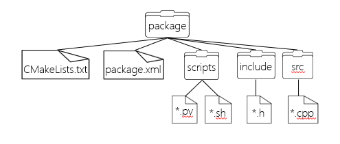

自定义的通信格式有消息(msg)、服务(srv)和动作(action)

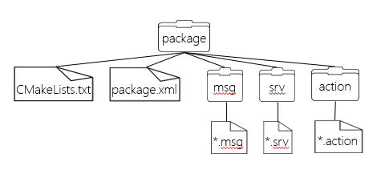

除了代码文件（C++、Python、Shell）这么放之外，通常我们还把自定义的msg消息文件、srv服务文件也,注意这个是service服务，不是src源码，别弄混了。建一个目录，然后放在里面，这里的消息和服务具体怎么写我们后面会讲，你要知道我们自定义的通信格式也放在package目录下就行。 还有就是launch文件，刚才的代码可以产生可执行文件，一个package可能放了不止一个可执行文件，那launch文件的作用就是通过这一个脚本来同时启动多个进程，节约我们的时间，提高效率。

**launch以及配置文件**

- launch文件(launch)
- 配置文件(yaml)

配置文件通常为yaml格式，launch和yaml都是XML文件，分别存放在launch和config文件夹下，如下图。

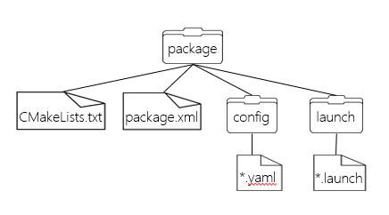


package里还有没有其他东西呢？没有了。上图是一个典型的pkg的结构，除此之外，大家还要学一些指令，日常调试会更加方便。

**常用指令**

| 命令              | 用法                                    | 说明                    |
| ----------------- | --------------------------------------- | ----------------------- |
| rospack           | rospack find package_name               | 查找某个pkg的地址       |
| roscd             | roscd package_name                   | 跳转到某个pkg路径下     |
| rosls             | rosls package_name                  | 列举某个pkg下的文件信息 |
| rosed             | roscd package_name file_name      | 编辑pkg中的文件         |
| catkin_create_pkg | catkin_create_pkg <pkg_name> [deps] | 创建一个pkg             |
| rosdep            | rosdep install [pkg_name]             | 安装某个pkg所需的依赖   |

上表列举一些了常用的命令，记住这几个指令，够最基本的ROS开发的工作了。

`rospack`：比如你忘记把pkg放到哪里，想查一下，那就可以用这个命令。

`roscd`：最常用的命令，比cd快多了，帮你直达pkg目录下。

`rosls`:  ls的简化版本， 直接指定一个包名，就可以帮你ls。

`catkin_create_pkg`: 创建一个pkg，通常我们要写清楚包名，以及它需要的依赖。

`rosdep`: 安装某个包所需要的依赖，这种情况通常是你从github上下载了一个ros的pkg，

但是有些依赖没有安装，这时候就需要用到这条指令。

默认的`rosed`编辑器为vim，如果需要设置为其他的默认编辑器，则需要编辑文件~/.bashrc，包含如下信息：

`exportEDITOR='gedit`'


还记得编译工作空间的步骤吗？先回到catkin_ws工作空间目录，然后`catkin_make`编译，生成的中间文件和目标文件放在build和devel下，最后我们得刷新一下环境变量，这样系统才知道我们的工作空间，新生成的目标文件在哪里。

**Metapackge**

安装ROS包

```bash
sudo apt-get install ros-kinetic-包名
```

| Metapacakge名称 | 描述                                   | 链接                                            |
| --------------- | -------------------------------------- | ----------------------------------------------- |
| navigation      | 导航相关的功能包集                     | https://github.com/ros-planning/navigation      |
| moveit          | 运动规划相关的（主要是机械臂）功能包集 | https://github.com/ros-planning/moveit          |
| image_pipeline  | 图像获取、处理相关的功能包集           | https://github.com/ros-perception/image_common  |
| vision_opencv   | ROS与OpenCV交互的功能包集              | https://github.com/ros-perception/vision_opencv |
| turtlebot       | Turtlebot机器人相关的功能包集          | https://github.com/turtlebot/turtlebot          |
| pr2_robot       | pr2机器人驱动功能包集                  | https://github.com/PR2/pr2_robot                |

练习1. 创建catkin_ws工作空间，并且编译教学软件包

1. 创建工作空间

```bash
mkdir  -p catkin_ws/src
```
2. 初始化工作空间

```bash
cd ~/catkin_ws/src
catkin_init_workspace
```
3. 克隆教学软件包

```bash
git clone --branch fix_cartographer https://github.com/DroidAITech/ROS-Academy-for-Beginners.git
```

4. 安装依赖

```bash
cd ~/catkin_ws
sudo rosdep install --from-paths src --ignore-src --rosdistro=kinetic -y
```
5. 编译工作空间

```bash
catkin_make
```

练习2. 显示工作空间的目录结构

1. 安装`tree`工具

```bash
sudo apt-get install tree
```

2. 显示工作空间目录结构

```bash
cd ~/catkin_ws              #进入工作空间
tree -L 2                   #列出工作空间下两层目录结构
```

src目录是存放各个package的位置。

build目录是build space的默认所在位置，同时cmake和make也是调用和配置并编译你的程序包的位置。

devel目录是devel space的默认所在位置, 同时也是在你安装程序包之前，存放可执行文件和库文件的地方。

练习3. 使用rospack查找功能包

1. rospack使用方法

```bash
rospack find pkg_name 
```

2. 查找navigation_sim_demo包

```bash
rospack find navigation_sim_demo 
```

3. 列出所有的包

```bash
rospack list
```

4. 查看rospack使用帮助：rospack help

```bash
rospack help
```

**roscd**

用于进入相关功能包目录，使用方法

```bash
roscd pkg_name 
```

例如进入navigation_sim_demo包目录，注意使用时可以结合Tab键的补全功能。

```bash
roscd navigation_sim_demo
```

**rosls**

用于列出目录包含的文件和目录名。

第一种用法：作为简易的ls指令

```bash
rosls dir_name(package_name) 
```

列出主目录下文件和目录

```bash
rosls 
```

第二种用法：直接跟ros包名：

```bash
rosls package_name 
```

例如查找navigation_sim_demo包，输入指令：

```bash
rosls navigation_sim_demo
```

**rosed**

用指定的编辑软件编辑指定包中的文件。

```bash
rosed package_name file_name 
```

修改navigation_sim_demo包下的amcl_demo.launch文件

```bash
rosed navigation_sim_demo amcl_demo.launch
```

我们可以在~/.bashrc中设置rosed使用的编辑器，如`exportEDITOR='gedit'`，不设置时默认使用vi编辑器。

**roslaunch**

运行指定ROS包下的launch文件。

用法：

```bash
roslaunch package 文件名.launch 
```

例如运行robot_sim_demo包下的robot_spawn.launch文件

```bash
roslaunch robot_sim_demo robot_spawn.launch
```

注意运行launch文件时不需要运行roscore，它会默认运行roscore。launch文件是ROS提供的，可以同时运行多个node的文件，launch文件用xml格式编写。

举例：robot_sim_demo里面的robot_spawn.launch

部分文件讲解：

1. launch文件中找到gazebo_ros的package，引入empty_world.launch

```xml
<include file="$(find gazebo_ros)/launch/empty_world.launch">
```

2. 启动urdf_spawner节点，并且配置相应的参数

```xml
<node name="urdf_spawner" pkg="gazebo_ros" type="spawn_model" respawn="false" output="screen"
  args="-urdf -param robot_description -x 3.0 -y 0 -z 0 -R 0 -P 0 -Y 0 -model simple_arm"/>
```

```xml
<launch>
  <!--Include description and control launch files-->
  <include file="$(find simple_arm)/launch/robot_description.xml"/>
  <include file="$(find simple_arm)/launch/robot_control.xml"/>
  <!--Launch a gazebo world-->
  <include file="$(find gazebo_ros)/launch/empty_world.launch">
    <arg name="world_name" value="$(find simple_arm)/worlds/ROS-Academy.world"/>
    <arg name="paused" value="false"/>
    <arg name="use_sim_time" value="true"/>
    <arg name="gui" value="true"/>
    <arg name="headless" value="false"/>
    <arg name="debug" value="false"/>
  </include>
  <!--spawn a robot in gazebo world-->
  <node name="urdf_spawner" pkg="gazebo_ros" type="spawn_model" respawn="false" output="screen"
  args="-urdf -param robot_description -x 3.0 -y 0 -z 0 -R 0 -P 0 -Y 0 -model simple_arm"/>
  <!-- The arm mover node -->
  <node name="arm_mover" type="arm_mover" pkg="simple_arm">
    <rosparam>
      min_joint_1_angle: 0
      max_joint_1_angle: 1.57
      min_joint_2_angle: 0
      max_joint_2_angle: 1.0
    </rosparam>
  </node>
</launch>
```

**catkin_create_pkg**

用于创建ROS package

用法：

```bash
catkin_create_pkg <package_name> [depend1] [depend2] [depend3]
```

举例：创建mypackage 依赖于roscpp rospy std_msgs

1. 进入工作空间下的src文件夹

```bash
cd ~/catkin_ws/src              
```
2. 创建包mypackage，添加依赖rospy和std_msgs

```bash
catkin_create_pkg mypackage rospy std_msgs
```

3. 编译工作空间

```bash
cd ~/catkin_ws               #进入工作空间
catkin_make                  #编译工作空间
```

也可以单独编译指定package

```bash
cd ~/catkin_ws               #进入工作空间 
catkin_make --pkg=mypackage  #编译指定包mypackage
```

一个规范的package有以下结构

| 目录           | 描述                                            |
| -------------- | ----------------------------------------------- |
| src            | 存放.cpp源文件                                  |
| srv            | 存放.srv文件 设置服务器类型（可选）             |
| action         | 存放.action文件 设置actionlib（可选）           |
| cfg            | 存放.cfg文件 设置动态调节参数（可选）           |
| launch         | 存放launch文件 启动节点以及配置相应参数（可选） |
| msg            | 存放.msg文件 存放数据类型 （可选）              |
| include        | 存放.h头文件                                    |
| config         | 存放URDF模型文件，已经其他配置文件 （可选）     |
| scripts        | 存放python文件（可选）                          |
| package.xml    |                                                 |
| cmakeLists.txt |                                                 |

package.xml提供有关功能包的信息，分成以下4个部分

1. 描述标签

```xml
<description>The mypackage </description>
```

2. 维护者标签

```xml
 <maintainer email="daviahan@todo.todo">davidhan</maintainer> 
```

3. 许可标签

```xml
<license>TODO</license>
```

4. 依赖功能包标签

```xml
  <buildtool_depend>catkin</buildtool_depend>
  <build_depend>roscpp</build_depend>
  <build_depend>rospy</build_depend>
  <build_depend>std_msgs</build_depend>
  <run_depend>roscpp</run_depend>
  <run_depend>rospy</run_depend>
  <run_depend>std_msgs</run_depend>
```

```xml
<?xml version="1.0"?>
<package>
  <name>mypackage</name>
  <version>0.0.0</version>
  <description>The mypackage </description>
  <maintainer email="daviahan@todo.todo">davidhan</maintainer>
<license>TODO</license>
  <buildtool_depend>catkin</buildtool_depend>
  <build_depend>roscpp</build_depend>
  <build_depend>rospy</build_depend>
  <build_depend>std_msgs</build_depend>
  <run_depend>roscpp</run_depend>
  <run_depend>rospy</run_depend>
  <run_depend>std_msgs</run_depend>
  <export>
  </export>
</package>
```

cmakelist.txt结构

由以下5个部分：

1. cmake要求的最低版本

```xml
cmake_minimum_required(VERSION 2.8.3)
```

2. package名称

```xml
project(mypackage)
```

3. 编译package需要的依赖项

```xml
find_package(catkin REQUIRED COMPONENTS )
```

4. 生成catkin程序包

```xml
catkin_package()
```

5. 添加所需头文件

```xml
include_directories( ${catkin_INCLUDE_DIRS})
```

实例如下

```makefile
cmake_minimum_required(VERSION 2.8.3)
project(mypackage)
find_package(catkin REQUIRED COMPONENTS
  rospy
  std_msgs
)
catkin_package()
include_directories(
  ${catkin_INCLUDE_DIRS}
)
```

cmake是非常高效的编译工具，如果需要深入了解，建议阅读：《cmake实践》