# 2.2 ROS通信机制

大家好，本讲我们介绍ROS的通信机制和常见命令。

**本讲重点**

- 节点
- 话题
- 服务
- 动作

**教学目的**

- 了解节点工作原理
- 熟练使用节点相关命令
- 了解什么是话题，掌握话题注册、订阅和通信的工作流程
- 熟练使用话题相关命令

下图PR2机器人，由柳树车库设计，它是里程碑式的机器人产品。为什么这么讲呢？这是因为这款机器人见证了ROS的诞生和发展。


我们拿谷歌Nexus系列Android手机打个比方，见下图。Android操作系统每一次发布新的版本，谷歌会推出一个最佳适配的机型，以它作为标准硬件平台，上面跑着这个版本最纯正的Android系统。这个和Android操作系统最佳适配的手机就被大家叫做谷歌的亲儿子，它原来叫nexus，现在改名叫pixel。


在机器人领域，伴随着ROS系统的诞生，同样有这么一个亲儿子，它就是PR2机器人。最初很多ROS的功能，还有package都是基于这台机器人开发出来的。不过机器人迭代没有像手机这么频繁，从ROS诞生到现在，PR2是一直作为标杆产品在ROS官网上挂着，当然价格也是非常的贵，20多万美元一台。

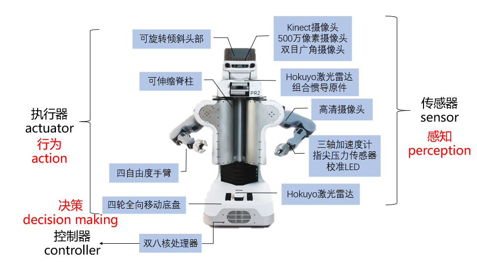

我们来看一下它为什么卖的这么贵，它的设计非常复杂，下图文字标注只是截取了一部分。机器人是一个复杂的系统，PR2的配置非常高端。给大家解释一下，在日常的机器人开发中就可能用到这些零部件，包含多种执行机构，传感器和处理器。例如PR2机器人，它的头部有两个自由度，脊柱有一个自由度，手臂有四个关节。这么多的零部件、传感器放到一块运行，跑两三个进程肯定是不够的。每个零部件，比如激光雷达，运行起来至少就要占一个进程，这还只是机器人硬件启动这个层面的的进程。如果还要路径规划、目标跟踪，就更麻烦了。这么多进程运行起来，会出现两个问题

1. 如何管理这些进程 
2. 进程之间如何发布和接收信息

为了解决这些问题，ROS登场了，下图左侧是ROS的官方Logo。ROS就是为这种大体量的结构而生，它的首要目的就是方便各个模块之间的通信。


## 2.2.1 节点

在ROS里要启动大量的进程，首先需要有一个管家来管理这些进程，这个管家叫做master。

**master**


- 每个node启动时都要向master注册

- 管理node之间的通信

master中文叫作节点管理器，它是用来管理所有的节点。master作用有两个，首先每个node启动时都要向master注册，其次master用于管理node之间的通信。master就像一个大管家，维护好各个node，让node之间能够相互找对彼此。node之间本身相互不认识，在master的介绍下，大家就可以实现点对点通信。所以在我们启动ROS程序前，首先就要启动master。

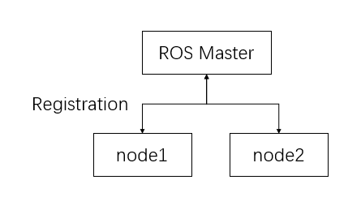

**roscore**

启动的方法非常简单，用`roscore`这条指令，在终端命令行输入`roscore`会启动master，当然他还顺带启动了rosout和parameter Service。rosout负责日志输出，它是一个node，告诉我们现在系统有什么错误，我们可使用这些信息用于调试。Parameter Service用于进行一些参数的配置，`roscore`是启动ROS的第一步。

1. 打开一个终端
2. 输入`roscore`

当你看到类似如下输出时，说明你的master已正常启动。

```bash
... logging to /home/lyx/.ros/log/36f6ea5a-163b-11ea-b571-185e0f5437a1/roslaunch-yangziling-ThinkPad-T470p-6453.log
Checking log directory for disk usage. This may take awhile.
Press Ctrl-C to interrupt
Done checking log file disk usage. Usage is <1GB.

started roslaunch server http://127.0.0.1:39463/
ros_comm version 1.12.14


SUMMARY
========

PARAMETERS
 * /rosdistro: kinetic
 * /rosversion: 1.12.14

NODES

auto-starting new master
process[master]: started with pid [6479]
ROS_MASTER_URI=http://127.0.0.1:11311/

setting /run_id to 36f6ea5a-163b-11ea-b571-185e0f5437a1
process[rosout-1]: started with pid [6492]
started core service [/rosout]
```

**node**

`roscore`启动了master，第二步我们要启动一些具体的ROS程序。这里讲一下node（节点）这个概念，节点是什么呢？ node其实就是进程，在ROS里面我们有个专门的名字叫做node（节点）。node是ROS的一个进程，我们之前说过，一个pkg可以有多个可执行文件，可以是C++编译生成的可执行文件，也可以是Python脚本，这每一个可执行文件，运行起来就是一个个node。`roscore`本质上是启动了一个node，只不过稍微做了封装。

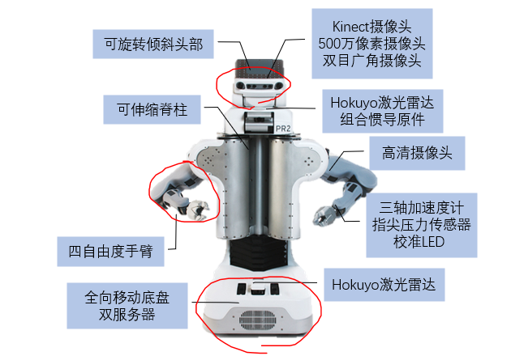

一般来说一个节点就来做某个特定的功能，比如上图，一个节点用来控制手臂运动，一个节点来控制摄像头，一个来控制底盘，等等。我们不要想着只写一个大而全的node，来控制所有零部件的运动。这样做是可以的，但是如果全写成一个node，运行起来，一旦某个部分出问题，比如头部坏了，整个系统就会瘫痪。最好的设计思路就是模块化，这样便于提高容错能力。


node和master具体是什么关系呢？首先我们得有ROS master，然后启动几个node。

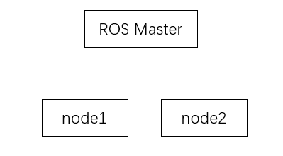

node1和node2，这两个node必须完成一个动作，先向master进行注册，告诉大管家master，我是node1，我来了，然后这个node才会开始它的工作。node只有注册了，才能运行在我们的ROS环境里，不过注册这个过程不需要我们来做，要输入指令启动node，系统就会帮我们来做这个工作。


**rosrun**

启动一个node用什么指令呢？我们使用`rosrun`，用法是`rosrun [pkg_name] [node_name]`，这样一个node就启动起来了。

```bash
rosrun [pkg_name] [node_name]
```

**rosnode**

`rosnode`这个指令作用是管理和调试node。列出当前运行的node信息使用`rosnode list`

```bash
rosnode list
```

显示某个node的详细信息使用`rosnode info`

```
rosnode info [node_name]
```

结束某个node使用`rosnode kill`

```bash
rosnode kill [node_name]
```

| 命令                   | 描述                                                         |
| ---------------------- | ------------------------------------------------------------ |
| rosnode list           | 列出当前运行的node信息                                       |
| rosnode info node_name | 显示出node的详细信息                                         |
| rosnode kill node_name | 结束某个或多个node                                           |
| rosnode kill           | 进入交互模式。能够从编号列表中选择要结束的节点，这对于结束匿名节点非常有用。 |
| rosnode kill -a/--all  | 结束所有节点                                                 |
| rosnode cleanup        | 清除不可到达节点的注册信息                                   |

我们可以启动XBot Gazebo仿真，之后打开一个终端，练习上表命令。

**roslaunch**

如果我们的node很多怎么办？比如一个机器人系统设计的很完备，有多node，我们是不是需要依此使用命令`roscore`，`rosrun` ，`rosrun`...`rosrun`。实际上不用，ROS为我们提供了一个更简便的方法，`roslaunch`可以帮我们同时启动master和多个node和配置参数服务器。我们之前讲ROS的工程结构，通常可以在包目录下建一个launch文件夹，里面有.launch文件，这个.launch文件就是我们这里要运行的这个launch。通过配置好启动规则，要启动哪些node，传什么参数进去等等，就可以达到批量启动node的目的。如果我们没有运行`roscore`，运行	roslaunch`会帮我们自动启动roscore。

```bash
roslaunch [pkg_name] [file_name.launch]
```

**launch文件**

Launch文件规则和packag.xml写法规则一样，它遵循xml标签语言规范。在launch里面可以指定要启动的node，配置参数，还可以嵌套其他的launch文件，设置参数等。初学者自己在写的时候，建议直接找别人的模板来改，
遇到问题上官网查一下具体的写法。

| 标签              | 说明                         |
| ----------------- | ---------------------------- |
| <launch></launch> | 根标签                       |
| <node>            | 需要启动的node及参数         |
| <include>         | 包含其他launch文件           |
| <machine>         | 指定运行的机器               |
| <env-loader>      | 设置环境变量                 |
| <param>           | 定义参数到参数服务器         |
| <rosparam>        | 启动yaml文件参数到参数服务器 |
| <arg>             | 定义参数传入到launch文件中   |
| <remap>           | 设定参数映射                 |
| <group>           | 设定命名空间                 |


学到这里，我们已经知道ROS是如何启动一个机器人的。机器人是一个复杂的系统，我们在ROS里用模块化分布式的方式来启动各个部件，其实就是启动很多个node。我们看看PR2机器人启动了哪些node。

PR2启动的node

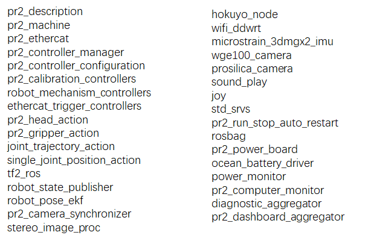

果然和PR2的结构一样， 要启动的node非常多，有30多个。这还只是启动机器人的功能接口，还没有启动导航功能，可见这个体量有多大，写了很多node，它的好处是容错能力高。我们按什么顺序启动呢？ 首先是`roscore`启动master， 需要有一个master来提供对节点的管理，然后在启动这些节点，我们想到用`rosrun`来启动。不过需要启动的node太多了，我们编写好launch文件，用`roslaunch`命令一次性启动这些node，PR2机器人到底是用什么命令呢？使用` roslaunch pr2_brinup  pr2.launch`,pr2_brinup是包名，pr2.launch是写好了的launch文件。 现在比较通行的一个做法，是把启动机器人的那个pkg命名为xxx_bringup， 比图xbot_bringup、pr2_bringup、turtlebot_bringup，这是约定俗成的一种做法。用户只用敲这一个命令，pr2就可以跑起来了。很方便。pr2.launch里面具体怎么写呢？大家可以看一下github上它的源码。

**通信方式**

ROS的通信方式大致可以分为话题、服务、动作和参数服务器。

- Topic
- Service
- Actionlib
- Parameter Service

## 2.2.2 话题

Topic（话题）是ROS用的最多的一种通信方式，两个node之间要通信，一般会先定义好一个共同的话题，然后节点a向这个话题publish消息，node b 会subscribe订阅这个话题，那么a说话b就能收到。

- ROS中的异步通信方式
- node间通过publish-subscriber机制通信


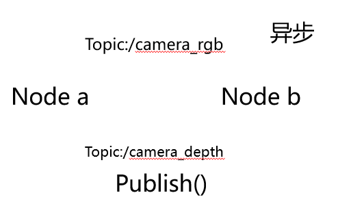

首先，消息的传递一定是在两个或者两个以上节点之间传输的，例如node a和node b。假设node a是摄像头的一个node，用来采集图像信息，那这个node会把数据发到一个topic上。topic的名称需要在程序里定义好，例如叫它/camera/rgb，注意ROS里面的topic前面要带一个斜杠，这样node a就会往这个topic上发消息，至于有没有其它node收到，它不用去管。发完数据，node a就去执行程序的下一步，例如另外发一个topic。这就是异步通信，在publish之后就直接返回了，不用等待反馈结果，就继续做这个node下一步的任务。  同步通信是什么呢？后面要讲的service，是发送之后要等待接收者处理完后才能继续下一步的任务，service就是同步通信。 

**Topic工作原理**

节点之间最重要的通信机制就是基于发布（Publish）/订阅（Subscrib）模型的Topic（话题）消息通信。每一个消息都是一种严格的数据结构，支持标准数据类型（整型、浮点型、布尔型等），也支持嵌套结构和数组，还可以根据需求由开发者自主定义。

一个完整的Topic通信有以下七个步骤

1. Publisher注册
2. Subscriber注册
3. ROS master进行信息匹配
4. Subscriber发送连接请求
5. Publisher确认连接请求
6. Subscriber尝试与Publisher建立连接
7. Publisher向Subscriber发送数据

Topic在ROS中是使用最为频繁的一种方式。在ROS中有两个节点，一个是发布者（publisher），一个是订阅者（Subscriber），两个节点分别发布和订阅同一个Topic，它们的启动顺序没有强制要求，此处假设Publisher先启动，我们来逐步骤分析通信的详细过程。

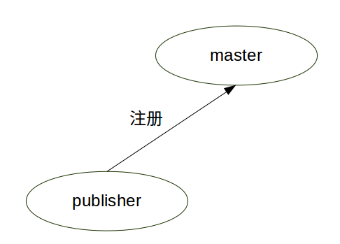

1. Publisher注册

Publisher启动，向ROS master注册发布者的信息，包含所发布消息的话题名，ROS master会将节点的注册信息加入到注册列表中。

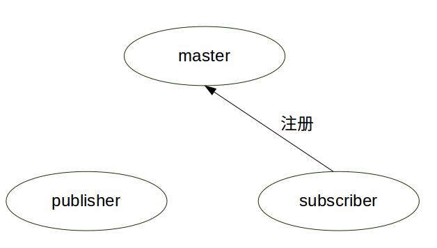

2. Subscriber注册

Subscriber启动，同样向ROS master注册订阅者的消息，包含需要订阅的话题名。

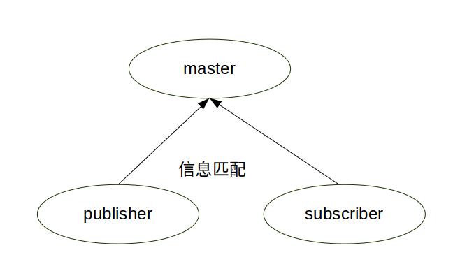

3. ROS master进行信息匹配

master根据Subscriber的订阅信息从注册列表中查找，如果没有找到匹配的发布者，则等待发布者的加入；如果找到匹配的发布者的信息，则向Subscriber发送Publisher的地址信息。

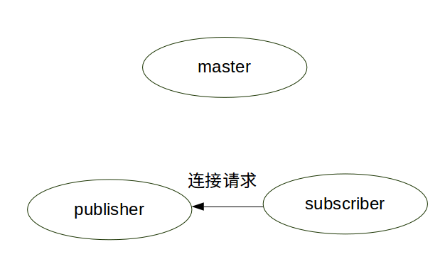

4. Subscriber发送连接请求

Subscriber接收到master发回的Subscriber的地址信息，尝试向Publisher发送连接请求，传输订阅的话题名、消息类型以及通信协议。

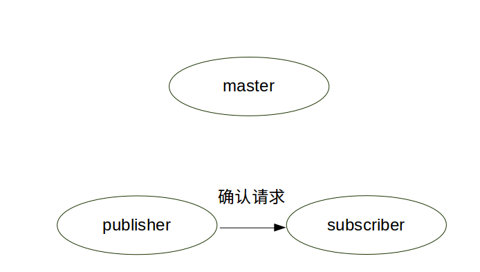

5. Publisher确认连接请求

Publisher接收到连接请求后，继续向Subscriber确认连接信息，其中包含了自身的TCP地址信息。

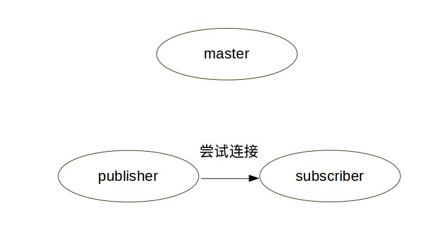

6. Subscriber尝试与Publisher建立

Publisher接收到确认信息后，使用TCP尝试与Subscriber建立网络连接。

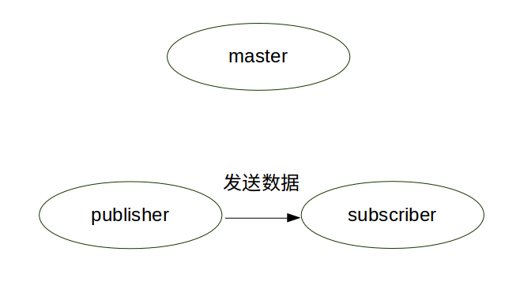

7. Publisher向Subscriber发送数据

成功建立连接后，Publisher开始向Subscriber发送话题消息数据。

Subscriber接收到消息会进行处理，一般这个过程叫做回调（callback）。就是提前定义好了一个处理函数(写在代码中),当有消息来就会触发这个处理函数,函数会对消息进行处理。

**Message**

Topic有严格的格式要求，必须遵循一个格式，这个数据格式就是message，它定义在*.msg文件中。

基本msg包括

- bool, int8, int16, int32, int64(以及uint)
- float32, float64, string
- time, duration, header
- 可变长数组array[]， 固定长度数组array[C] 

例如一个message格式名称是sensor_msgs/Image，这里sensor_msgs是包名，Image是.msg文件的文件名，它的存放位置是sensor_msgs/msg/Image.msg。下面是image.msg的定义。

```
std_msgs/Header  header
     uint32     seq
     time       stamp
     string     frame_id
uint32    height
uint32    width
string    encoding
uint8     is_bigendian
uint32    step
uint8[]   data
```

**rostopic**

`rostopic`用于查询topic的信息，`rostopic`的子命令比较多，大家可以参考下表。

| rostopic info topic_name    | 显示某个topic的属性信息  |
| --------------------------- | ------------------------ |
| rostopic echo topic_name    | 显示某个topic的内容      |
| rostopic pub topic_name ... | 向某个topic发布内容      |
| rostopic bw topic_name      | 查看某个topic的带宽      |
| rostopic hz topic_name      | 查看某个topic的频率      |
| rostopic list               | 列出当前所有的topic      |
| rostopic find topic_type    | 查找某个类型的topic      |
| rostopic type topic_name    | 查看某个topic的类型(msg) |

查看话题/cmd_vel的信息类型

```bash
rostopic info /cmd_vel
```
结果显示

```
Type: geometry_msgs/Twist

Publishers: 
 * /mobile_base_nodelet_manager (http://127.0.0.1:35065/)

Subscribers: 
 * /gazebo (http://127.0.0.1:36873/)
```

**rosmsg**

| 命令                          | 说明                    |
| ----------------------------- | ----------------------- |
| rosmsg list     | 列出系统上所有msg|
| rosmsg show /msg_name  | 显示某个msg内容|

显示message类型为geometry_msgs/Twist的信息格式

```bash
rosmsg show geometry_msgs/Twist
```

结果显示

```
geometry_msgs/Vector3 linear
  float64 x
  float64 y
  float64 z
geometry_msgs/Vector3 angular
  float64 x
  float64 y
  float64 z
```

回顾一下本讲知识点对应的ROS命令

| 知识点      | 命令                |
| ----------- | ------------------- |
| master      | roscore             |
| node        | rosrun<br />rosnode |
| topic       | rostopic            |
| msg         | rosmsg              |
| .launch文件 | roslaunch           |

## 2.2.3 练习

**练习1**

任务要求：使用topic控制机器人运动，观察相机采集到的图像。

**仿真环境下运行**

1. 添加ROS主从配置

```
vim ~/.bashrc
```

```bash
#export ROS_MASTER_URI=http://192.168.8.101:11311
export ROS_MASTER_URI=http://127.0.0.1:11311
#export ROS_HOSTNAME=192.168.8.xxx
export ROS_HOSTNAME=127.0.0.1
```

2. 启动仿真

```
roslaunch robot_sim_demo robot_spawn.launch
```

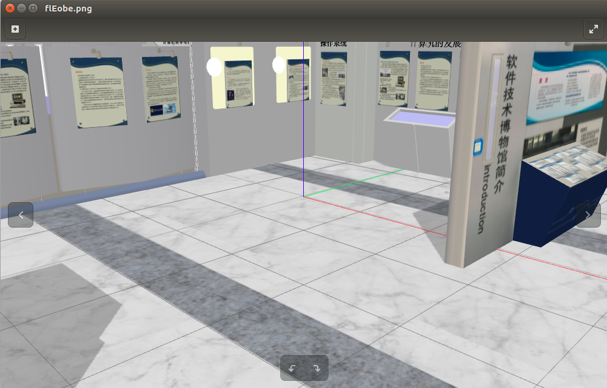

3. 查看当前topic

打开终端，输入命令

```bash
rostopic list
```

结果显示

```
/camera/depth/camera_info
/camera/depth/image_raw
/camera/depth/points
/camera/parameter_descriptions
/camera/parameter_updates
/camera/rgb/camera_info
/camera/rgb/image_raw
/camera/rgb/image_raw/compressed
/camera/rgb/image_raw/compressed/parameter_descriptions
/camera/rgb/image_raw/compressed/parameter_updates
/camera/rgb/image_raw/compressedDepth
/camera/rgb/image_raw/compressedDepth/parameter_descriptions
/camera/rgb/image_raw/compressedDepth/parameter_updates
/camera/rgb/image_raw/theora
/camera/rgb/image_raw/theora/parameter_descriptions
/camera/rgb/image_raw/theora/parameter_updates
/clock
/cmd_vel
/cmd_vel_mux/active
/cmd_vel_mux/input/avoid
/cmd_vel_mux/input/navi
/cmd_vel_mux/input/safety_controller
/cmd_vel_mux/input/switch
/cmd_vel_mux/input/teleop
/cmd_vel_mux/parameter_descriptions
/cmd_vel_mux/parameter_updates
/gazebo/link_states
/gazebo/model_states
/gazebo/parameter_descriptions
/gazebo/parameter_updates
/gazebo/set_link_state
/gazebo/set_model_state
/gazebo_gui/parameter_descriptions
/gazebo_gui/parameter_updates
/imu
/joint_states
/mobile_base_nodelet_manager/bond
/odom
/rosout
/rosout_agg
/scan
/tf
/tf_static
/xbot/joint_states
/xbot/pitch_platform_position_controller/command
/xbot/pitch_platform_position_controller/pid/parameter_descriptions
/xbot/pitch_platform_position_controller/pid/parameter_updates
/xbot/pitch_platform_position_controller/state
/xbot/yaw_platform_position_controller/command
/xbot/yaw_platform_position_controller/pid/parameter_descriptions
/xbot/yaw_platform_position_controller/pid/parameter_updates
/xbot/yaw_platform_position_controller/state
```

3. 查看全部订阅者

- 打开新终端。
- 输入`rostopic list -s`

结果显示

```
/clock
/cmd_vel
/cmd_vel_mux/input/avoid
/cmd_vel_mux/input/navi
/cmd_vel_mux/input/safety_controller
/cmd_vel_mux/input/switch
/cmd_vel_mux/input/teleop
/gazebo/set_link_state
/gazebo/set_model_state
/mobile_base_nodelet_manager/bond
/rosout
/xbot/joint_states
/xbot/pitch_platform_position_controller/command
/xbot/yaw_platform_position_controller/comman
```

4. 查看全部发布者

- 打开新终端
- 输入`rostopic list -p`

结果显示

```
/camera/depth/camera_info
/camera/depth/image_raw
/camera/depth/points
/camera/parameter_descriptions
/camera/parameter_updates
/camera/rgb/camera_info
/camera/rgb/image_raw
/camera/rgb/image_raw/compressed
/camera/rgb/image_raw/compressed/parameter_descriptions
/camera/rgb/image_raw/compressed/parameter_updates
/camera/rgb/image_raw/compressedDepth
/camera/rgb/image_raw/compressedDepth/parameter_descriptions
/camera/rgb/image_raw/compressedDepth/parameter_updates
/camera/rgb/image_raw/theora
/camera/rgb/image_raw/theora/parameter_descriptions
/camera/rgb/image_raw/theora/parameter_updates
/clock
/cmd_vel
/cmd_vel_mux/active
/cmd_vel_mux/parameter_descriptions
/cmd_vel_mux/parameter_updates
/gazebo/link_states
/gazebo/model_states
/gazebo/parameter_descriptions
/gazebo/parameter_updates
/gazebo_gui/parameter_descriptions
/gazebo_gui/parameter_updates
/imu
/joint_states
/mobile_base_nodelet_manager/bond
/odom
/rosout
/rosout_agg
/scan
/tf
/tf_static
/xbot/joint_states
/xbot/pitch_platform_position_controller/pid/parameter_descriptions
/xbot/pitch_platform_position_controller/pid/parameter_updates
/xbot/pitch_platform_position_controller/state
/xbot/yaw_platform_position_controller/pid/parameter_descriptions
/xbot/yaw_platform_position_controller/pid/parameter_updates
/xbot/yaw_platform_position_controller/state
```

5. 查看topic `/camera/rgb/image_raw`的信息

- 打开新终端
- 输入`rostopic info /camera/rgb/image_raw`

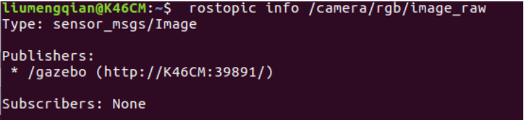

可以看到 `/camera/rgb/image_raw` 的type是`sensor_msgs/Image`，它的发布node是Gazabo，目前没有node订阅这个话题。

6. 查看topic `/camera/rgb/image_raw`的类型

- 打开新终端
- 输入`rostopic type /camera/rgb/image_raw`

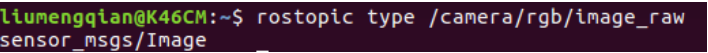

7. 查找所有`sensor_msgs/Image`类型的topic

- 打开新终端
- 输入`rostopic find sensor_msgs/Image`

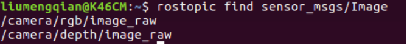

8. 查看sensor_msgs/Image类型的信息

- 打开新终端
- 输入`rosmsg show sersor_msgs/Image`

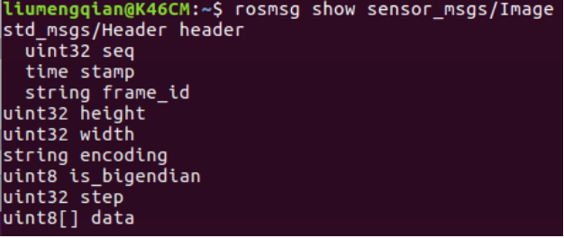

`sersor_msgs/Image`包含了常规类型数据，如int、string、time等。

给image_view包中的image_view程序设置参数，它的命令格式如下。[transport]部分可以忽略，只改掉尖括号里面的内容。输出是弹出一个窗口，上面显示的是模拟器中机器人摄像头拍摄到的场景。

```bash
rosrun	image_view	image_view	image:=<image   topic>	[transport]  
```

例如我们指定它接收摄像头的rgb未压缩图像信息。

```bash
rosrun	image_view	image_view  image:=/camera/rgb/image_raw
```

结果显示

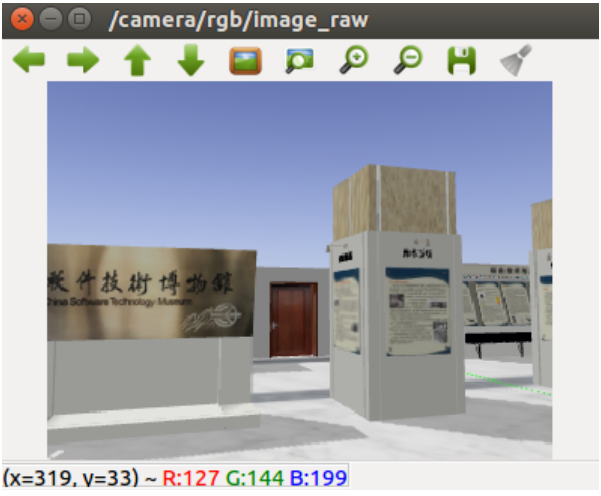

9. 通过键盘控制机器人的运动

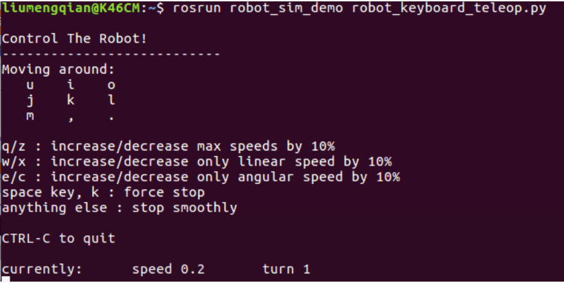

- 打开新终端
- 输入`rosrun robot_sim_demo robot_keyboard_teleop.py`

我们通过键盘来控制机器人的移动。

- 打开新终端
- 输入`rosrun	image_view	image_view  image:=/camera/rgb/image_raw`

我们可以看到摄像头获取的图像随着小车的移动而改变。

10. 查看`/camera/rgb/image_raw`信息

- 打开新终端
- 输入`rostopic info /camera/rgb/image_raw`

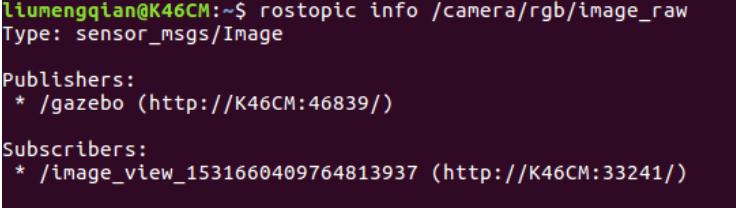


我们看到`/camera/rgb/image_raw`多了一个订阅node`gazebo`，它就是屏幕上的窗口节点。

11. `/camera/depth/image_raw`是深度相机的发布的图像，如何显示这个深度相机的图像呢？

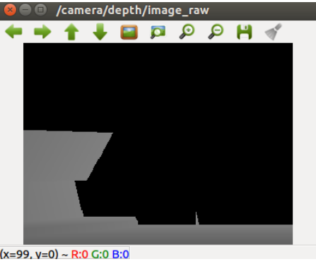

- 打开新终端
- 输入`rosrun image_view  image_view image:=/camera/depth/image_raw`

得到深度相机的图像后我们再次操纵机器人移动，能看出相机对应的场景里面的内容。

12. 在机器人运动的过程中，如何查看速度指令topic `/cmd_vel`？

- 打开新终端
- 输入`rostopic echo /cmd_vel`

操作机器人移动，我们看到终端上不断有信息刷新，这些就是机器人的速度话题/cmd_vel的信息。这些信息经由键盘传递到模拟器的机器人当中，控制机器人的移动。

**在XBot上运行**

修改~/.bashrc，添加ROS主从配置

```
vim ~/.bashrc
```

```bash
export ROS_MASTER_URI=http://192.168.8.101:11311
#export ROS_MASTER_URI=http://127.0.0.1:11311
export ROS_HOSTNAME=192.168.8.xxx                    #学生笔记本下使用ifconfig本机DHCP IP
#export ROS_HOSTNAME=127.0.0.1
```

启动XBot（XBot开机自启，或运行以下命令）

```
roslaunch xbot_bringup xbot-u.launch
```

重复仿真中运行的任务1到任务12，修改的内容如下。

1. 速度控制话题改为`/cmd_vel_mux/input/teleop`
2. 启动键盘控制机器人运动命令改为`rosrun xbot_tools keyboard_teleop.py`
3. rgb图像话题改为`/xbot/camera/image/rgb/image_raw`
4. 深度图像话题改为`/xbot/camera/image/depth/image_raw`

**练习2**

任务要求：用键盘控制XBot机器人移动。

**仿真环境下运行**

1. 添加ROS主从配置

```
vim ~/.bashrc
```

```bash
#export ROS_MASTER_URI=http://192.168.8.101:11311
export ROS_MASTER_URI=http://127.0.0.1:11311
#export ROS_HOSTNAME=192.168.8.xxx
export ROS_HOSTNAME=127.0.0.1
```

2. 启动仿真

```
roslaunch robot_sim_demo robot_spawn.launch
```


3.  启动XBot键盘移动控制程序

```bash
rosrun robot_sim_demo robot_keyboard_teleop.py
```

**在XBot上运行**

1. 修改~/.bashrc，添加ROS主从配置

```
vim ~/.bashrc
```

```bash
export ROS_MASTER_URI=http://192.168.8.101:11311
#export ROS_MASTER_URI=http://127.0.0.1:11311
export ROS_HOSTNAME=192.168.8.xxx                    #学生笔记本下使用ifconfig本机DHCP IP
#export ROS_HOSTNAME=127.0.0.1
```

2. 启动XBot（XBot开机自启，或运行以下命令）

```
roslaunch xbot_bringup xbot-u.launch
```

3. 启动XBot键盘移动控制程序

```bash
rosrun xbot_tools keyboard_control.py
```

结果显示


我们使用键盘控制小车移动，对应按键为
- 使用i件控制机器人前进
- k为停止键
- j和l为左右转
通过这些命令，我们可以控制机器人移动。

**练习3**

任务要求：了解XBot中的节点

**仿真环境下运行**

1. 添加ROS主从配置

```
vim ~/.bashrc
```

```bash
#export ROS_MASTER_URI=http://192.168.8.101:11311
export ROS_MASTER_URI=http://127.0.0.1:11311
#export ROS_HOSTNAME=192.168.8.xxx
export ROS_HOSTNAME=127.0.0.1
```

2. 启动仿真

```bash
roslaunch robot_sim_demo robot_spawn.launch
```


3. 查看XBot节点信息

```bash
rosnode list
```

4. 使用以下命令练习，了解XBot在仿真下的节点信息，掌握`rosnode`命令使用方法

| 命令            | 描述                 |
| --------------- | -------------------- |
| rosnode list    | 列出所有的活动节点   |
| rosnode info    | 打印节点信息         |
| rosnode machine | 列出运行节点的计算机 |
| rosnode kill    | 杀掉节点进程         |
| rosnode cleanup | 删除不能到达的节点   |
| rosnode ping    | 测试节点的连同状态   |

**在XBot上运行**

1. 修改~/.bashrc，添加ROS主从配置

```bash
vim ~/.bashrc
```

```bash
export ROS_MASTER_URI=http://192.168.8.101:11311
#export ROS_MASTER_URI=http://127.0.0.1:11311
export ROS_HOSTNAME=192.168.8.xxx                    #学生笔记本下使用ifconfig本机DHCP IP
#export ROS_HOSTNAME=127.0.0.1
```

2. 启动XBot（XBot开机自启，或运行以下命令）

```bash
roslaunch xbot_bringup xbot-u.launch
```

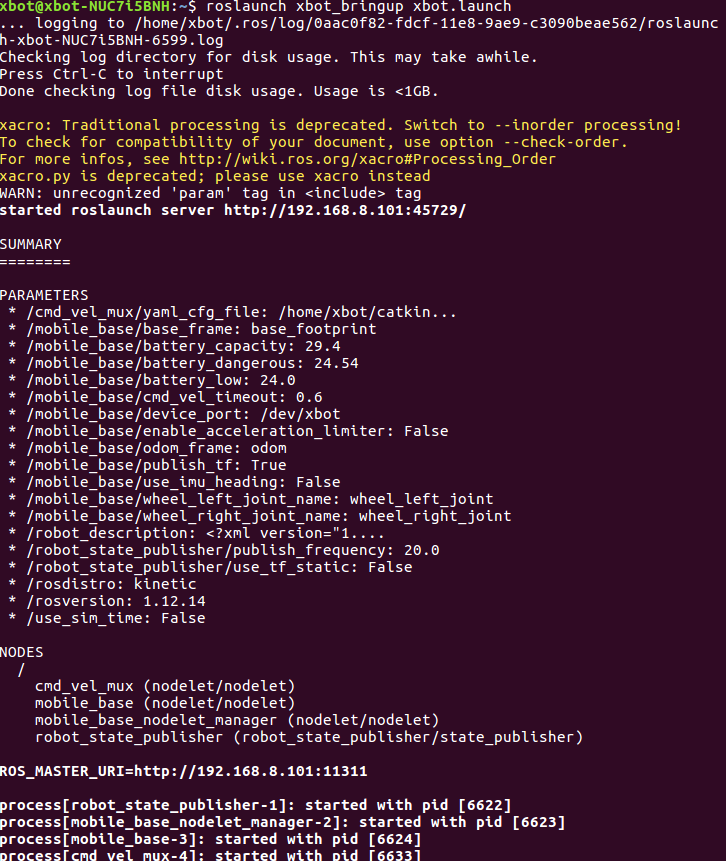

3. 查看XBot节点信息

```bash
rosnode list
```

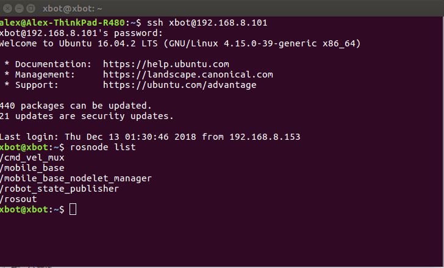

4. 使用`rosnode info`查看`/cmd_vel_mux`话题信息

```bash
rosnode info /cmd_vel_mux
```

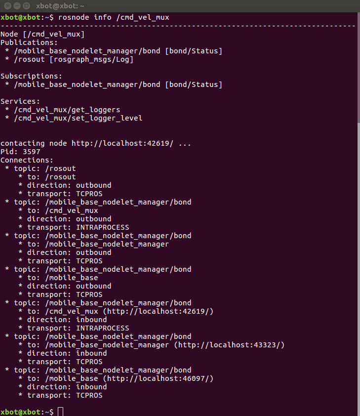

5. 使用`rosnode kill`删除所有运行中的node

```bash
rosnode kill
```

rosnode kill命令用于删除节点，`rosnode kill --all`或`rosnode kill -a`用于删除所有节点，注意这条命令不能删除`roscore`启动的master，我们需要使用`killall -9 rosmaster`来删除master。

**练习4**

任务要求：练习topic和msg相关命令

**仿真环境下运行**

1. 添加ROS主从配置

```
vim ~/.bashrc
```

```bash
#export ROS_MASTER_URI=http://192.168.8.101:11311
export ROS_MASTER_URI=http://127.0.0.1:11311
#export ROS_HOSTNAME=192.168.8.xxx
export ROS_HOSTNAME=127.0.0.1
```

2. 启动仿真

```bash
roslaunch robot_sim_demo robot_spawn.launch
```


3. 用键盘控制机器人移动

- 打开一个新终端
- 启动键盘控制机器人移动程序

```bash
rosrun robot_sim_demo robot_keyboard_teleop.py
```
**在XBot上运行**

1. 修改~/.bashrc，添加ROS主从配置

```bash
vim ~/.bashrc
```

```bash
export ROS_MASTER_URI=http://192.168.8.101:11311
#export ROS_MASTER_URI=http://127.0.0.1:11311
export ROS_HOSTNAME=192.168.8.xxx                    #学生笔记本下使用ifconfig本机DHCP IP
#export ROS_HOSTNAME=127.0.0.1
```

2. 启动XBot（XBot开机自启，或运行以下命令）

```bash
roslaunch xbot_bringup xbot-u.launch
```

3. 运行rosnode list命令，查看当前运行的节点

```bash
rosnode list
```

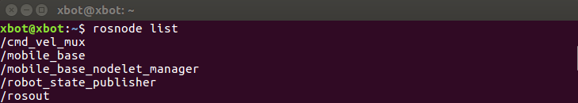

运行rosnode list命令查看当前运行的节点，其中/rosout是用来收集和记录节点调试输出信息的node，/rosout在roscore启动master时启动

4. 用键盘控制机器人移动

- 打开一个新终端
- 启动键盘控制机器人移动程序

```bash
rosrun xbot_tools keyboard_control.py
```

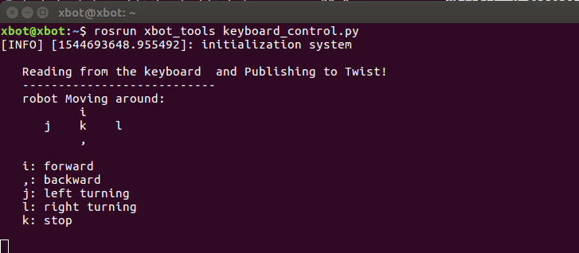

再次运行`rosnode list`命令，查看启动keyboard_control之后运行的节点

```bash
rosnode list
```

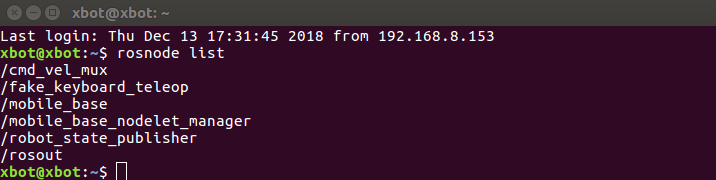

可以看到当前正在运行的6个node，比之前多了一个/fake_keyboard_teleop的节点，这个节点即启动keyboard_control后运行的节点。

5. 重新配置节点名称

如果你忘了具体的`rosnode`子命令可以通过help来查看。

```bash
rosnode help
```

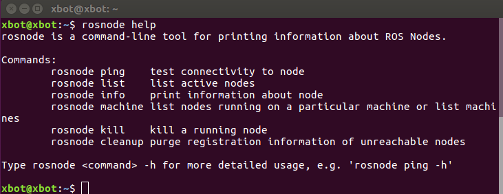

通过命令行重新设置node名称

```bash
rosrun xbot_tools keyboard_control.py __name:=my_teleop
```

重新查看node列表

```bash
rosnode list
```
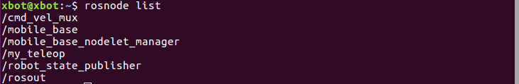

`rosnode cleanup`用于清除无用的节点。

```bash
rosnode cleanup
```

重新查看node列表，我们会看到无效的节点被清除了。

```bash
rosnode list
```

使用`rosnode ping`指令来测试节点是否存活，使用Ctrl+c结束ping。

```bash
rosnode ping my_teleop
```

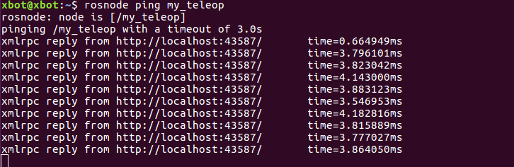

也可以使用设置次数的方式得到有限次数ping的结果，如设置只ping四次。输入命令`rosnode ping -c 4 my_teleop`

关闭一个节点`/my_teleop `

```bash
rosnode kill /my_teleop 
```

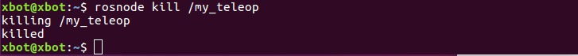

再次输入`rosnode list`

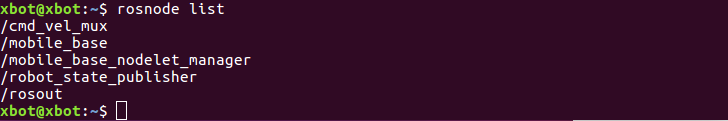

当一个节点我们不再需要了，可以用`rosnode kill`命令关闭它:

可以使用`rostopic list -h`查看`rostopic list`子命令需要的参数

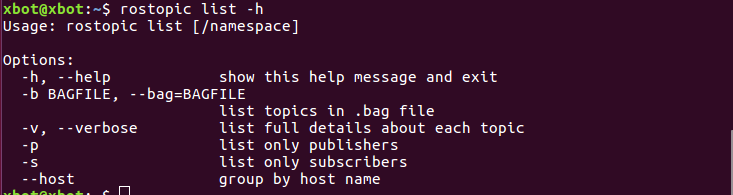

- 打开新终端
- 输入`rostopic list -h`

h：查看帮助

b:bagfile：ROS提供的数据记录与回放的功能包：rosbag，可以帮助开发者收集ROS运行时的消息数据，然后再离线状态下回放。

v：显示出有关所发布和订阅的话题及其类型的详细信息。

`rostopic list -v`显示出有关所发布和订阅的话题及其类型的详细信息


上图可以看到有11个话题正在发布中，被订阅的话题有16个。
```

`rostopic list -p`和`rostopic list -s`分别用于显示发布者和显示订阅者

``bash
rostopic list -p
```
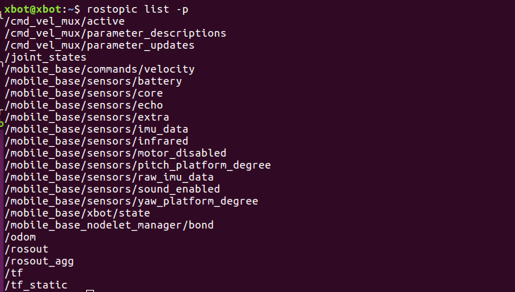


```bash
rostopic list -s
```

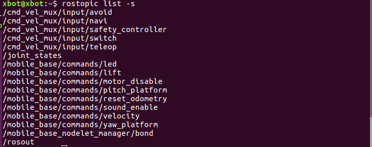

列出当前所有订阅和发布的话题， hostname 为标准分组

```bash
rostopic list--host
```

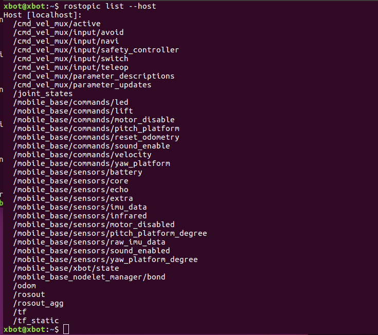

显示某个 topic 的属性信息

```bash
rostopic info
```
查看`/cmd_vel_mux/input/teleop`这个 topic 的信息

```bash
rostopic info /cmd_vel_mux/input/teleop
```

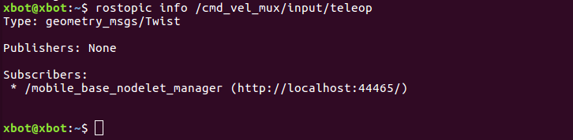
```

可以看到这个`/cmd_vel_mux/input/teleop`话题的type为geometry_msgs/Twist。


**rostopic type**

查看某个 topic 的类型

​```bash
rostopic type /cmd_vel_mux/input/teleop
```


查看消息的详细情况

```bash
rosmsg show geometry_msgs/Twist
```
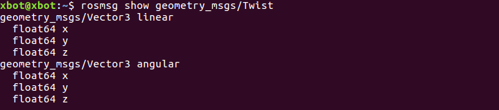

把数据发布到当前某个正在广播的话题上，使XBot运动一个弧度

可以把数据发布到当前某个正在广播的话题上，用法如下图


```bash
rostopic pub -1 /cmd_vel_mux/input/teleop geometry_msgs/Twist '{linear: {x: 0, y: 0, z: 0}, angular: {x: 0, y: 0, z: -0.4}}'
```

-1：表示只发布一个命令，然后⻢上退出

`/cmd_vel_mux/input/teleop`：消息所发布到的话题的名称


使XBot持续旋转，命令为

```bash
rostopic pub -r 0.5 /cmd_vel_mux/input/teleop geometry_msgs/Twist '{linear: {x: 0, y: 0, z: 0}, angular: {x: 0, y: 0, z: -0.4}}'
```

-r：发布一个稳定的命令流,使Xbot持续运动

0.5：代表 0.5hz 

查看 XBot` /cmd_vel_mux/input/teleop`话题的频率

用法是`rostopic hz [topic]`，比如我们想要查看发布`/cmd_vel_mux/input/teleop`的频率

```bash
rostopic hz /cmd_vel_mux/input/teleop
```

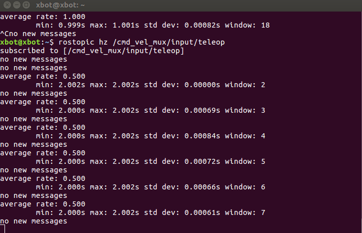

此讲所有的命令都已经练习结束，谢谢同学们。