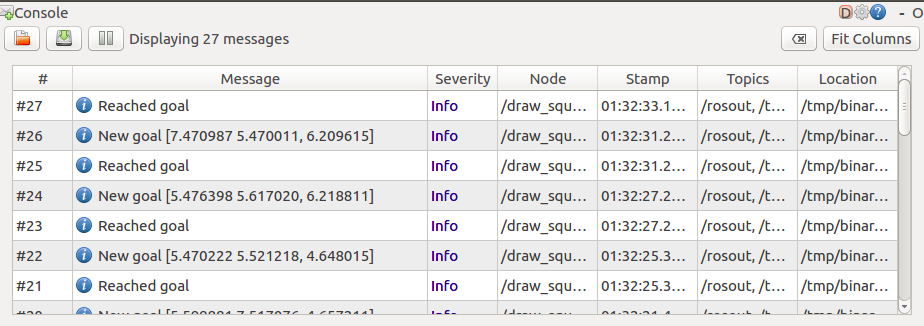
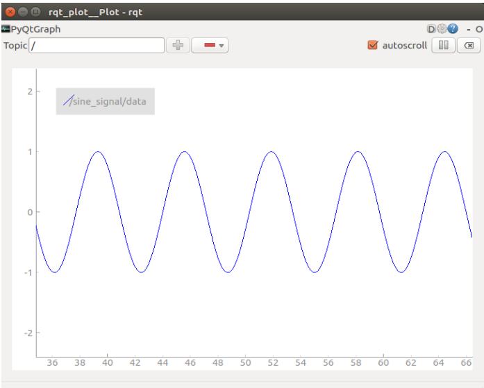
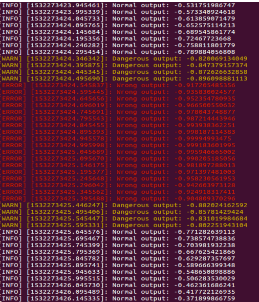
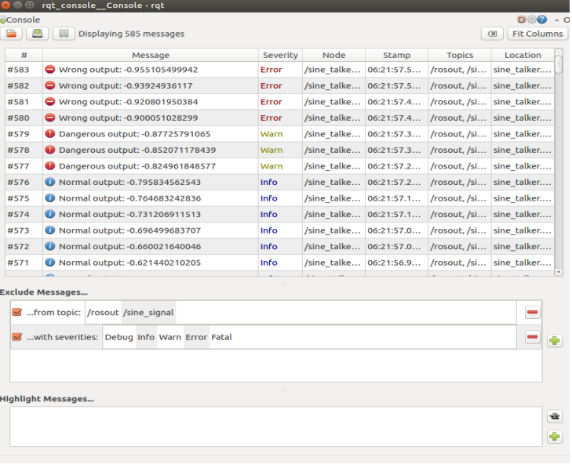

## 5.1 ROS工具(上)

本讲我们介绍ROS常用工具，简介之后详细讲解每个工具的用法。

**本讲重点**

- ROS工具简介
- rqt
- rviz

**教学目的**

- 了解ROS有哪些工具
- 熟练使用rqt系列工具
- 熟练使用rviz系列工具

### 1. 简介

ROS下有仿真、可视化调试、命令行、专用领域四种工具。

| 种类           | 工具                                    |
| -------------- | --------------------------------------- |
| 仿真环境       | Gazebo                                  |
| 可视化调试工具 | Rviz、rqt系列工具                       |
| 命令行工具     | roscore、rostopic、rosservice、rosbag等 |
| 专用工具       | Moveit!等                               |

**Gazebo**

Gazebo是一个机器人的仿真工具，即模拟器。目前市面上的机器人模拟器有一些，例如Vrep、Webots，Gazebo是对ROS兼容最好的的开源工具。Gazebo不是ROS的组件，ROS和Gazebo都由OSRF（Open Source Robotics Foundation）来维护，所以它是对ROS的兼容性比较好。Gazebo支持多种物理引擎，例如ODE、Bullet、Simbody等。

Gazebo的视觉效果前几讲大家都看到了，但千万不要以为仿真就是做个3D动画，做个漂亮的3D场景。仿真的真正意义是给机器人一个非常逼近现实场景的环境，让机器人去做一些不易完成的任务。举个例子，如果想实验无人车在车流、人流密集场合的效果，这种危险的实验一般都会先在仿真环境里做好，做到万无一失再上路实验。在模拟器里，可以把车辆的性能、驾驶的策略、车流、人流的行为模式都做到和真实世界非常接近，这样就可以避免实地测试的危险，也可以节约很多时间和开支。其实仿真工具在工业界用的非常普遍，例如机械臂的动力学仿真、机器人的导航、强化学习等。

**rqt**

`rqt`是一个可视化的调试工具，`rqt`是基于qt开发的，跨平台性能好，支持自定义的插件。rqt的功能较多，例如`rqt_graph`查看通信架构计算图，`rqt_plot`绘制topic数据曲线，`rqt_console`查看日志等。

**rosbag**

`rosbag`两个核心功能，一个是记录，一个是回放。例如一台无人车上路测试，我们需要把它各个传感器的数据记录下来，这时就需要有一个记录的功能。`rosbag record`可以记录指定任意的单个或多个topic，可以设置录制的长度和消息个数。`rosbag play`可以回放这些信息。它的原理就是创建了一个node，然后订阅或发布指定的topic，记录时它把消息保存为一个bag文件。


| 命令                        | 说明                     |
| --------------------------- | ------------------------ |
| rosbag record <topic-names> | 记录某些topic到bag文件中 |
| rosbag record -a            | 记录所有topic到bag文件中 |
| rosbag play <bag-files>     | 回放bag                  |

**RViz**

Rviz是一个可视化工具，你可能感觉它像Gazebo，但Rviz不是用来仿真的，它是用来图形化显示我们需要的一些信息。

我们查看一下XBot中相关传感器的数据。

**仿真下运行**

1. 添加ROS主从配置

```bash
vim ~/.bashrc
```

```bash
#export ROS_MASTER_URI=http://192.168.8.101:11311
export ROS_MASTER_URI=http://127.0.0.1:11311
#export ROS_HOSTNAME=192.168.8.xxx
export ROS_HOSTNAME=127.0.0.1
```

2. 启动仿真

```bash
roslaunch robot_sim_demo robot_spawn.launch 
```

3. 启动Rviz

```bash
rviz
```

4. 添加相关控件

Rviz GUI中左边是要在Rviz里显示的各种类型的控件，点击add，加入robot model，就会载入当前的机器人模型。我们依此加入image，Laserscan。大家要注意，Rviz是可视化工具，这里面每个控件都是subscriber相关topic。大家打开每个空间设置，在下拉菜单中选择订阅的topic。

**在XBot上运行**

1. 修改~/.bashrc，添加ROS主从配置[为什么，解释]

```
vim ~/.bashrc
```

```bash
export ROS_MASTER_URI=http://192.168.8.101:11311
#export ROS_MASTER_URI=http://127.0.0.1:11311
export ROS_HOSTNAME=192.168.8.xxx                    #学生笔记本下使用ifconfig本机DHCP IP
#export ROS_HOSTNAME=127.0.0.1
```

2. 启动XBot（XBot开机自启，或运行以下命令）

```bash
roslaunch xbot_bringup xbot-u.launch
```

重复仿真中操作第3和第4步。

### 2. rqt

rqt是基于qt开发的可视化工具，扩展性好，灵活易用，可跨平台。r代表ROS，qt是指它是Qt图形界面（GUI）工具包。rqt由三个部分组成，除了rqt核心模块,还有rqt_common_plugin（后端图形工具套件），以及rqt_robot_plugins（机器人运行时的交互工具）。

**运行集成图形界面rqt_gui**

- 打开一个终端
- 输入`rqt`
- 也可以运行单个插件

```bash
rqt –standalone <plugin-name>
```

要运行rqt插件，最好的方式是使用集成图形界面`rqt_gui`。`rqt_gui`的特点是把不同的插件集成在一个单独的窗口中，页面布局更加灵活，易于操作。运行的时候直接在终端输入rqt即可。如果要运行单个插件，输入`rqt -standalone`加插件名称。

**常用插件**

rqt核心包提供了一些不需要rosrun就能运行的常用的插件，包括`rqt_console`, `rqt_graph`, `rqt_plot`，`rqt_logger_level`和`rqt_bag`。这些工具主要用于机器人的调试。前三个应该是在调试工作中会经常用到的。

**rqt_console**

首先来看看`rqt_console`，这个插件会随时间变化动态收集消息，它允许设置消息过滤。查看的时候列表视图列出的内容会实时更新。我们同样是先启动仿真，用一个很简单的XBot走正方形的小例子看看效果，运行square_dance_demo之后，在终端输入`rqt_console`。

窗口里显示了很多信息，包括message（用户指定的消息)，severity（消息的严重性级别，例如debug，info, warn, error等等），node（广播节点的名称），time（广播消息的时间），topics，location。同时可以看到窗口里面的信息一直在更新。

随时间收集消息，在列表视图里显示并实时更新，包括如下内容

- message（用户指定的消息)
- everity（消息的严重性级别，例如debug，info, warn, error等等）
- node（广播节点的名称）
- time（广播消息的时间），topics，location

**仿真下运行**

1. 添加ROS主从配置

```bash
vim ~/.bashrc
```

```bash
#export ROS_MASTER_URI=http://192.168.8.101:11311
export ROS_MASTER_URI=http://127.0.0.1:11311
#export ROS_HOSTNAME=192.168.8.xxx
export ROS_HOSTNAME=127.0.0.1
```

2. 启动仿真

```bash
roslaunch robot_sim_demo robot_spawn.launch    
```

3. 启动square_dance_demo.py，仿真下XBot机器人开始运动

```bash
python ./square_dance_demo.py
```

4. 启动`rqt_console`

```bash
rqt_console
```



**XBot环境下**

1. 修改~/.bashrc，添加ROS主从配置

```
vim ~/.bashrc
```

```bash
export ROS_MASTER_URI=http://192.168.8.101:11311
#export ROS_MASTER_URI=http://127.0.0.1:11311
export ROS_HOSTNAME=192.168.8.xxx                    #学生笔记本下使用ifconfig本机DHCP IP
#export ROS_HOSTNAME=127.0.0.1
```

2. 启动XBot（XBot开机自启，或运行以下命令）

```
roslaunch xbot_bringup xbot-u.launch
```

3. 运行square_dance_demo_xbot.py，XBot机器人开始运动

```
python ./square_dance_demo_xbot.py
```

4. 启动`rqt_console`

```bash
rqt_console
```

常用操作

对于列表中的项目有几个常用操作，在大型的ROS系统中会很有用。第一是暂停和恢复消息显示，点击左上角的播放键，如果窗口中的信息滚动的太快可以使用这个操作。第二是清除，前面一次操作失败了就点击右上角的小叉，清除显示的内容。要把当先的信息保存下来用于离线的分析，这里有保存消息到文件的选项。

双击将在单独的框中显示有关该消息的所有信息，便于检查和复制。右键单击将弹出一个菜单，可以根据所选消息的某些方面过滤列表，筛选出你需要的信息类别，例如errors。

用途

`rqt_console`有哪些用途呢？当ROS系统出现异常，调试的第一步往往是用`rqt_console`来检查相关消息，尤其是errors和warnings。在运行包含多个节点的ROS系统的时候，最好设置一下`rqt_console`，这样能快速的查找问题。需要注意的是，`rqt_console`只能显示它开始运行之后接收到的消息，在出现错误之后开启`rqt_console`通常不会告诉你引发错误的原因。

**rqt_graph**

`rqt_graph`是一个图像化显示通信架构的工具，直观的展示当前正在运行的node、topic和消息的流向。`rqt_graph`不会自动更新信息，需要手工点击刷新按钮进行刷新。

同样的用XBot作为例子来看看实际效果。在终端输入`rqt_graph`，图形界面展示了当前的通信架构，其中的椭圆表示节点，方框表示主题，箭头则表示消息的流向，也就是发布或者订阅消息。这种情况下显示的是整个系统最精简的形式。如果要查看完整的结构，点击左上角，选择Nodes/Topics(all)，然后取消`hide debug`和`hide dead sinks`。   

用途

`rqt_graph`能简洁直观的显示通信架构，它有助于理解ROS系统的package和信息流。当怀疑系统连接有问题时，也可以用来查看各节点和主题。

**rqt_plot**

有时候我们想要检查一些单独topic的数据，`rqt_plot`提供了这样功能。它主要用于查看参数，将一些参数，尤其是动态参数，以曲线图的形式绘制出来。`rqt_plot`的GUI提供了大量特征功能，包括开始和停止绘图，平移和缩放，导出图像等。

下面做个练习，启动XBot后输入`rqt_plot`来启动工具，现在窗口里面只有一个空白的坐标系，因为还没有接收任何topic的信息。如果要查看XBot的相关数据，在topic那里输入`/scan`。也可以同时显示多个topic的参数，或者减少topic,用左上角的“+”，“-”实现。

**仿真下运行**

1. 添加ROS主从配置

```bash
vim ~/.bashrc
```

```bash
#export ROS_MASTER_URI=http://192.168.8.101:11311
export ROS_MASTER_URI=http://127.0.0.1:11311
#export ROS_HOSTNAME=192.168.8.xxx
export ROS_HOSTNAME=127.0.0.1
```

2. 启动仿真

```bash
roslaunch robot_sim_demo robot_spawn.launch    
```

3. 启动GMapping SLAM建图程序

```bash
roslaunch slam_sim_demo gmapping_demo.launch    #启动GMapping SLAM程序
```

4. 启动`rqt_plot`，输入需要跟踪的topic `/scan`

```bash
rqt_plot
# 或
rqt_plot topic_name
```


**XBot环境下**

1. 修改~/.bashrc，添加ROS主从配置

```bash
vim ~/.bashrc
```

```bash
export ROS_MASTER_URI=http://192.168.8.101:11311
#export ROS_MASTER_URI=http://127.0.0.1:11311
export ROS_HOSTNAME=192.168.8.xxx                  #学生笔记本下使用ifconfig本机DHCP IP
#export ROS_HOSTNAME=127.0.0.1
```

2. 启动XBot（XBot开机自启，或运行以下命令）

```bash
roslaunch xbot_bringup xbot-u.launch
```

3. 启动GMapping SLAM程序[为什么启动]

```bash
ssh xbot@192.168.8.101                             #ssh登录XBot
roslaunch xbot_navi build_map.launch               #启动GMapping SLAM程序
```

4. 启动`rqt_plot`，输入需要跟踪的topic `/scan`，也可以选择/mobile_base/sensors/echo后选择front或者rear，这几个topic只在XBot上有效。

```bash
rqt_plot
# 或
rqt_plot topic_name
```

用途

`rqt_plot`的用途是图形化的查看单独的数据，例如调试机器人关节上的位置控制器时，可能会需要检查位置误差或者力矩的时间序列，这时就可以使用`rqt_plot`画出发布在ROS系统上的数据。

**rqt_bag**

用于图形化的查看包的内容

**rqt_logger_lever**

配合rqt_console查看日志的级别

**rqt命令汇总**

| 命令             | 描述                                                         | 使用场景                           |
| ---------------- | ------------------------------------------------------------ | ---------------------------------- |
| rqt_console      | 允许您通过节点查看发布的消息，包括info、warn、error、fatal。 | 用于节点出现错误时，查看重要信息。 |
| rqt_logger_level | 查看调试消息                                                 | 查看低级信息                       |
| rqt              | 通用`rqt`控制台，包括rqt_graph、rqt_plot等程序               |                                    |

**练习1**

任务要求：用Python写一个简单的正弦曲线信号数据发布者节点sine_talker，产生正弦信号sin(t)，在rqt_console日志中实时产生该信号的info信息，当幅值处于0.8～0.9时，产生warning信息，当幅值大于0.9时产生error信息。

要点

1. 熟悉`rqt_plot`、`rqt_graph`、`rqt_console`的使用方法和节点调试技巧。
2. 使用rqt_plot画出正弦曲线，熟悉工具界面
3. 使用rqt_garph查看系统通信结构
4. 使用rqt_console查看系统日志和INFO、WARN、ERROR三种输出

操作步骤

1. 创建sine_plot功能包（建议使用roboware）

```bash
cd ~/catkin_ws/src  
catkin_create_pkg sine_plot std_msgs rospy
cd .. 
catkin_make 
```

2. 配置该工作空间的环境变量

```bash
source devel/setup.bash
```

3. 编写节点sine_talker.py

```python
#!/usr/bin/env python

import rospy
import math
from std_msgs.msg import Float64

def sine_talker():
    pub = rospy.Publisher('sine_signal',Float64,queue_size=5)
    rospy.init_node('sine_talker')
    rate = rospy.Rate(20)
    while not rospy.is_shutdown():
        time_now = rospy.get_time()
        sine_signal = math.sin(time_now)
        if 0.8 > abs(sine_signal):
            out_put = "Normal output: %s" % sine_signal
            rospy.loginfo(out_put)  
        elif 0.8 < abs(sine_signal) and 0.9 > abs(sine_signal):
            out_put = "Dangerous output: %s" %sine_signal
            rospy.logwarn(out_put)
        elif 0.9 < abs(sine_signal):
            out_put = "Wrong output: %s" %sine_signal
            rospy.logerr(out_put)
        pub.publish(sine_signal)
        rate.sleep()

if __name__ == '__main__':
    try:
        sine_talker()
    except rospy.ROSInterruptException:
        pass
```

4. 放置代码到合适的位置，并进行配置

将创建好的sine_talker.py放在包sine_plot目录下的src文件夹中，为了rosrun的时候可以执行该节点，我们使用如下命令对其添加可执行权限

```bash
chmod u+x sine_talker.py
```

5. 运行sine_talker.py

- 在一个新的终端中输入`roscore`启动master
- 原终端中输入`rosrun sine_plot sine_talker.py`，启动sine_talker.py

6. 查看当前ROS话题

```bash
rostopic list
```

结果显示

```bash
/rosout
......

/sine_signal
```

7. 查看sine_talker正在发布的信息

```bash
rostopic echo /sine_plot
```

8. 查看/sine_signal话题中的变量随时间变化的曲线

```bash
rqt_plot /sine_signal
```

通过鼠标左键可以拖动，滚轮可以放大缩小，图像是动态呈现的，如果要看某一个时间段的静态图像，可以去掉autoscroll的对勾。在左上角的topic框中可以手动输入增加或减少需要呈现的话题名称。



在右上角的齿轮图标中可以点选不同的呈现模式，如图所示其余两种模式需要其他的设置，各有优缺点。


如图是MatPlot画图模式，在这个模式下功能，得到了拓展，相应的CPU占用率变高，可以通过左上角的诸多图标完成平移、拖动、放大缩小、XY轴范围定制等操作。


通过指令rqt_graph可以调出当前系统运行的节点和消息发布、订阅等情况


在节点运行的终端窗口中，可以看到不同颜色的信息输出。通过指令`rqt_console`也可以调出当前系统的debug、info、warn、error、fatal等消息，如下图





**练习2**

任务要求：用Python写一个10赫兹的随机数产生程序rqt_plot_randomnu.py，产生出的数据由chatter话题发布，使用`rqt_plot`查看。

1. 编写rqt_plot_randomnu.py

```python
#!/usr/bin/env python

import rospy
from random import random
from std_msgs.msg import Float32

def talker():
    pub = rospy.Publisher('chatter', Float32, queue_size=10)
    rospy.init_node('demo')
    rate = rospy.Rate(10) # 10hz
    while not rospy.is_shutdown():
        hello_int = random() * 50
        rospy.loginfo(hello_int)
        pub.publish(hello_int)
        rate.sleep()

if __name__ == '__main__':
    try:
        talker()
    except rospy.ROSInterruptException:
        pass

```

2. 运行rqt_plot_randomnu.py

- 在一个新的终端中输入`roscore`启动master
- 输入`python ./rqt_plot_randomnu.py`，启动rqt_plot_randomnu.py

3. 查看当前ROS话题

```bash
rostopic list
```

4. 查看话题/chatter正在发布的信息

```bash
rostopic echo /chatter
```

5. 查看 /chatter话题中的变量随时间变化的曲线[图]

```bash
rqt_plot  /chatter
```

