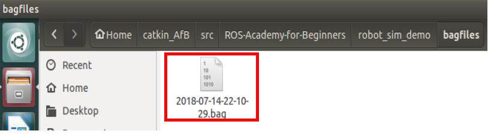
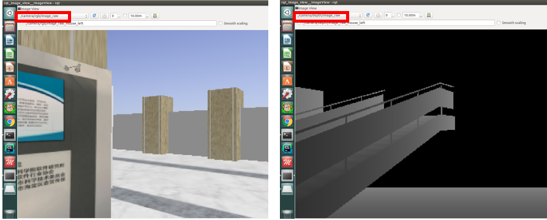
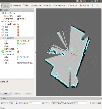
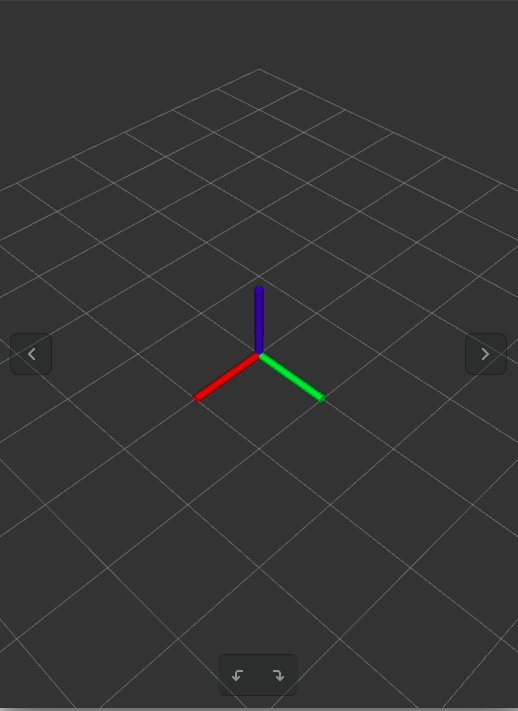
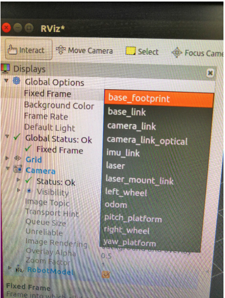
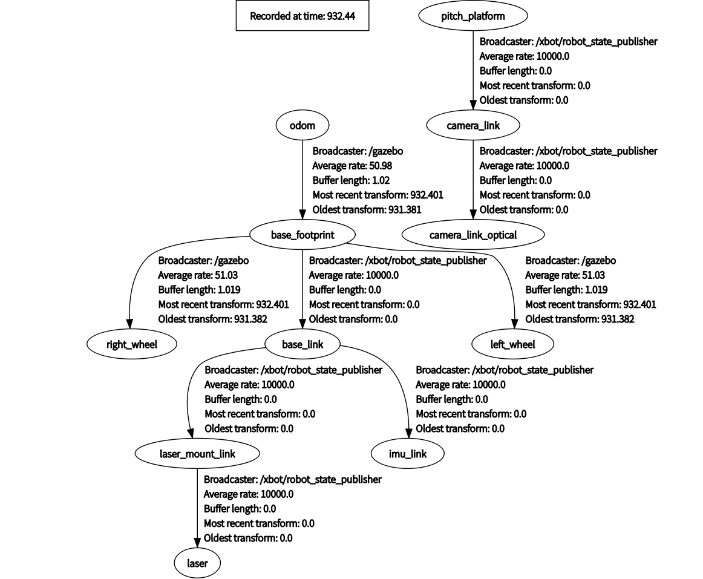
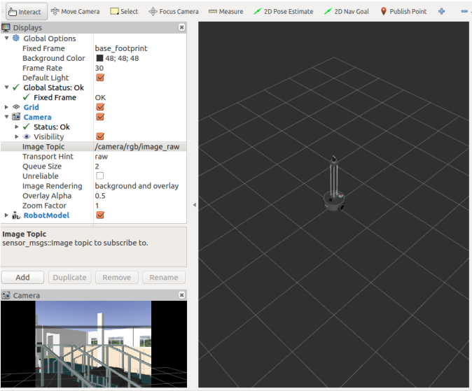
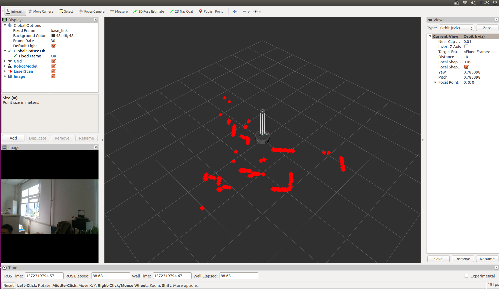

## 5.2 ROS工具(下)

**本讲重点**

- rosbag
- rviz

**教学目的**

- 熟练使用rosbag工具
- 熟练使用rviz系列工具

### 1. rosbag

`rosbag`主要的作用是记录发布在一个或多个topic上的信息，并在需要的时候回放这些信息。这两项功能可以用于调试机器人程序。具体来讲，就是我们可以先运行机器人，记录下关注的topic，例如摄像头或者另外一些传感器，之后多次回放这些topic的信息，然后通过实验来处理这些数据。这样就能方便的获取和分析来自各个传感器的信息。bag是一种特殊格式的文件，它用来储存带有时间戳的message数据，命名以.bag作为后缀。这类文件通常就是由`rosbag`之类的工具创建的。文件中的信息可以根据用户的需求反复回放。

**rosbag**

- 用来记录和回放发布在一个或多个topic上的信息
- 作用：记录机器人的运行信息，回放并处理这些数据

**bag（包）**:

- 一种特定格式的文件，用来储存带有时间戳的message数据
- 命名以.bag作为后缀 
- 通常由诸如rosbag之类的工具创建

**rosbag命令汇总**

| 命令       | 描述                                                 |
| ---------- | ---------------------------------------------------- |
| record     | 用指定topics的内容记录一个包（.bag）文件             |
| info       | 查看包中的内容                                       |
| play       | 回放包中的内容                                       |
| check      | 确定一个包是否可以在当前系统中使用，或者是否可以迁移 |
| fix        | 修复包中的消息，以便在当前系统中播放                 |
| filter     | 用Python表达式转换包                                 |
| compress   | 压缩一个或多个包                                     |
| decompress | 解压一个或多个包                                     |
| reindex    | 重新索引一个或多个包                                 |

最常见的命令是前三个，首先是record，也就是记录，将指定的topic的内容记录到一个包文件中去。然后是info，information的缩写，用于查看包中的信息。第三个play，也就是播放，用于回放包中的内容。这三个命令基本实现了rosbag的常用功能，另外还有check检查，fix修复等命令，大家也可以了解一下。接下来我们具体看看这些命令的用法。

**记录包文件**

记录所有的topic

```bash
rosbag record –a
```

记录所有topic的信息，这里的a就是all的意思。按Ctrl+C结束录制，带有时间戳的包就会被保存在当前文件夹下。比如2018-07-03-31-15.bag。要注意的是，记录下所有的topic对于一个小规模的系统而言可能没有什么问题，但是在实际的机器人系统，例如PR2系统，包括我们的XBot，通常都会有很多节点同时运行，记录下所有正在运行的topic可能会快速产生非常大的包文件。所以`rosbag record –a`这条指令要慎用。

记录特定的topic

```bash
rosbag record <topic-names>
```
自定义包的名称

```bash
rosbag record -O <filename.bag> < topic-names>
```

上面这两条命令要更常用一些，第一个是记录特定的topic的信息，在`rosbag record`后接上topic的名称即可。另外一个是自定义包的名称。前面说过包文件默认的命名就是时间戳，如果我们想自己命名，就要用到这条命令，rosbag record -O 加包名再加topic名称。

**显示包信息**

``` bash
rosbag info <filename.bag>
```

信息包括包的长度，topics和时间戳。另外我们可以用`rosbag info`加上包名来显示包的信息，查看时长，消息数量，话题等等一些内容。

**回放包文件**

按照发布时的时间顺序播放

```bash
rosbag play <filename.bag>
```

循环播放

```bash
rosbag play -l <filename.bag>
```

只播放240秒

```bash
rosbag play -u 240 <filename.bag>
```

回放包文件的指令，最简单的就是rosbag play加包名，这条指令会按照信息发布时的时间顺序来播放包中的内容。在play后面加上-l，会无限循环播放。另外可以设定播放时间，比如在play后面加-u 240，包中的内容播放到240秒就会停止。

**练习3**

任务要求：录制数据，将ROS系统运行过程中的数据录制到一个.bag文件中，并且按照用户的需求对录制的默认参数进行更改，满足录制要求

**仿真环境下运行**

1. 添加ROS主从配置

```
vim ~/.bashrc
```

```bash
#export ROS_MASTER_URI=http://192.168.8.101:11311
export ROS_MASTER_URI=http://127.0.0.1:11311
#export ROS_HOSTNAME=192.168.8.xxx
export ROS_HOSTNAME=127.0.0.1
```

2. 启动仿真

```
roslaunch robot_sim_demo robot_spawn.launch
```

3. 启动键盘控制机器人运动程序

```bash
rosrun robot_sim_demo robot_keyboard_teleop.py
```

4. 记录所有topic数据以及部分数据

```bash
rosbag record –a
或
rosbag record –a -O <filename.bag>
```

要点：熟悉使用rosbag record命令及理解其参数含义
-a, -O，-j

`rosbag record -a`命令可以记录下所有主题的信息，使用这条命令要慎重。大部分搭载摄像头的机器人系统中存在多个节点发布与图像相关的话题，记录所有的话题将创建巨大的包文件。因此在使用-a选项前应该注意，或者在录制过程中控制包文件的大小。`rosbag record  -O <filename.bag>`命令可以将录制包存为指定名称的bag包。另外可以使用`rosbag record -j`启用包文件的压缩。完成录制后，按Ctrl+C以停止rosbag。

结果显示

目录中会看到一个以年份、日期和时间命名并以.bag作为后缀的文件。这个就是bag文件，它包含`rosbag record`运行期间所有节点发布的话题。



5. 使用`rosbag record <topic_names>`命令记录指定topic数据

- 终端输入`rosbag record <topic_names>`命令记录选定话题的数据
- 运行robot_keyboard_teleop.py控制XBot移动

```bash
rosrun robot_sim_demo robot_keyboard_teleop.py
```

6. 使用命令`rosbag help record`查看更多记录消息的选项

包括包文件的大小，记录的时长，将文件分割成指定大小等。 

**练习2**

任务要求：回放数据，将ROS系统运行过程中录制的数据通过回放操作来重现相似的运行过程。

**仿真环境下运行**

1. 添加ROS主从配置

```
vim ~/.bashrc
```

```bash
#export ROS_MASTER_URI=http://192.168.8.101:11311
export ROS_MASTER_URI=http://127.0.0.1:11311
#export ROS_HOSTNAME=192.168.8.xxx
export ROS_HOSTNAME=127.0.0.1
```

2. 启动仿真

```
roslaunch robot_sim_demo robot_spawn.launch
```

3. 运行`rosbag play`命令，rosbag程序会回放消息记录包文件

```bash
rosbag play <file_name>
```

4. 运行`rosbag record`命令，并附加-l选项，即loop，rosbag程序会循环回放消息记录包文件

```bash
rosbag play -l <file_name>
```

5. 查看当前的话题，在回放的过程中会出现/clock话题 

```bash
rostopic list
```

`rostopic list`可以看到`/clock`这个话题，用于指定系统时钟以便加快仿真的回放速度。这可以通过-r选项来设置。`/clock`话题以可配置的频率发布仿真时间，默认频率为100Hz。

6. 使用rosbag play中的-s和-u选项回放信息

- 进入已经保存的bag文件所在目录
- 终端输入rosbag play -s 数字 <file_name>命令
- 终端输入rosbag play -u 数字 <file_name>命令

进入实训课时1已经保存的包文件所在的目录，打开终端输入

```bash
rosbag play -s 数字 <file_name>
rosbag play -u 数字 <file_name>
```

运行`rosbag record`命令，并附加-s选项，rosbag程序会从某一时间节点（数字代表的秒数）开始发布消息。`rosbag play -s 数字 <file_name>`

运行`rosbag record`命令，并附加-u选项，rosbag程序会回放至选定时间的内容`rosbag play -u 数字 <file_name>`

`rosbag play -s 数字 	<file_name>`

-s参数选项让rosbag play命令等待一段时间跳过bag文件初始部分后再开始真正回放，-s后的数字用来设定等待的时长。

`rosbag play -u 数字 <file_name>`

运行rosbag record命令，并附加-u选项，rosbag程序会回放至选定时间的内容，-u后的数字用来设定播放的时长。

从第3秒开始播放subset.bag

```bash
rosbag play -s 3 subset.bag
```

结构显示

```
[ INFO][1531593785.141717197]: Opening subset.bag
Waiting 0.2 seconds after advertising topics... done.
Hit space to toggle paused, or 's' to step.
[RUNNING]  Bag Time:   2734.875477   Duration: 22.771477 / 22.919000               1073.24
Done.
```

附加-s选项选项时，则从某一时间节点（此处为3秒）开始发布消息，此时回放数据的有效时间也因此减少了3秒 （25.922000 -22.919000=3.003秒≈3秒）。


只播放前30秒subset.bag

```bash
rosbag play –u 30 subset.bag
```

7. 使用`rosbag play --clock <file_name>`命令发布与每个消息相关的时间

- 进入已经保存的bag文件所在目录
- 打开终端输入`rosbag play --clock <file_name>`命令

发布消息的时钟时间，默认频率为100Hz，将频率设定为200Hz

```bash
rosbag play --clock –hz=200 <file_name>
```

频率不变，回放subset.bag

```bash
rosbag play --clock subset.bag

频率设定为200Hz，回放subset.bag

​```bash
rosbag play --clock –hz=200 subset.bag
```

**练习3**

任务要求：
使用rqt工具中的rqt_image_view查看回放数据，回放的数据包括摄像头图像话题，通过rqt_image_view获取摄像头数据并显示。

要点

- 检查数据:
- 如何查看.bag文件中包含的信息
- 加深理解rosbag的回放功能
- 熟悉使用rqt_image_view命令
- 操作并显示不同图像话题的信息

**子任务：使用rosbag info <file_name>命令查看所有topic数据信息（10分钟）**

1. 进入已经保存的bag文件所在目录

2. 打开终端输入`rosbag info <file_name>`命令，输出bag文件中所包含话题的名称、类型和消息数量，如下

```bash
rosbag info xxx.bag
```

结果显示（只列出部分内容）

```
path:        2018-07-14-22-10-29.bag
version:     2.0
duration:    22.6s
start:       Jan 01 1970 08:35:31.28 (2131.28)
end:         Jan 01 1970 08:35:53.89 (2153.89)
size:        135.3 MB
messages:    81616
compression: none [82/82 chunks]
types: …
	geometry_msgs/Twist                   [9f195f881246fdfa2798d1d3eebca84a]
	nav_msgs/Odometry                     [cd5e73d190d741a2f92e81eda573aca7]
…
topics: …
	/camera/rgb/image_raw                                                    35 msgs    : sensor_msgs/Image
	/clock                                                                22622 msgs    : rosgraph_msgs/Clock
	/cmd_vel                                                                672 msgs    : geometry_msgs/Twist
	/odom                                                                  1135 msgs    : nav_msgs/Odometry
	/scan                                                                    34 msgs    : sensor_msgs/LaserScan
…
```

从运行结果可以看到有消息记录包文件本身的信息，例如创建的日期、持续时间、文件大小，以及内部消息的数量和文件的压缩格式（如果有压缩），然后还会有文件内部数据类型的列表。

**子任务：使用GUI工具rqt_bag命令检查包信息（10分钟）**

允许我们回放消息记录包、查看图像（如果有）、绘制标量数据图和消息的数据原结构(RAW)。
只需要传递记录包文件的名称

1. 新建终端，输入`rqt_bag`

2. 在打开的GUI中Load Bag定位到之前录制的bag文件，选中之后Open

3. 点击Play/Pause即可像在命令行中一样回放/停止打开的bag文件

4. 在新打开的bag文件的rqt_bag GUI界面中，空白处右键view (by topic)-/cmd_vel-Plot就把rqt_plot插件放到同一窗口中

5. 再次空白处右键Publish-/cmd_vel， rqt_plot接收到/cmd_vel话题的数据后显示其关于时间的变化轨迹

6. 点击Play/Pause键回放bag文件subset.bag

7. 在rqt_plot图中选择linear-x，angular-z

结果显示


可以根据需求借助rqt_plot绘制感兴趣的话题信息的时序图。一幅图中可以多个y轴坐标进行显示
绘图工具不生成文件中所有数值， 它只是简单显示数据的回放和发布，还能够播放、暂停、停止和移动到文件头或者文件结尾。

**子任务：使用rosbag play 文件名命令回放bag文件储存数据（10分钟）**

1. 进入bag文件所在目录
2. 打开终端，输入`rosbag play` 文件名命令

知识点

1. `rosbag play 文件名`

运行`rosbag play`命令，rosbag程序会回放消息记录包文件

2. ` rosbag play -l 文件名`
运行`rosbag record`命令，并附加-l选项，rosbag程序会循环回放消息记录包文件

3. `rosbag play -s 数字 文件名`

运行`rosbag record`命令，并附加-s选项，rosbag程序会从某一时间节点（数字代表的秒数）开始发布消息

操作步骤

1. 打开新终端，输入`roscore`

2. 打开新终端，输入`roslaunch robot_sim_demo robot_spawn.launch`

3. 进入bag包所在目录

4. 输入`rosbag play -l xxx.bag`

5. 打开新终端，输入`rosrun rqt_image_view rqt_image_view `



由rqt可视化彩色图可知，当前显示的是`/camera/rgb/image_raw`话题的图像信息，此话题由XBot机器人的摄像头发布。`rqt_image_raw`还可显示其他由Xbot机器人的摄像头发布的图像话题信息，例如`/camera/depth/image_raw`， `/camera/rgb/image_raw/compressed`，`/camera/rgb/image_raw/theora`。

### 2. rviz

rviz代表ROS visualization,是一个通用的3D可视化环境。它提供了机器人的视角，让我们可以图形化的查看来自机器人传感器的数据和信息，比如说摄像头、激光，还有一些算法等。rviz为远程操作，机器人的开发和调试都提供了很大的帮助。

这里列出了几个rviz的应用举例和技巧。首先rviz可以用来查找视觉系统的错误，当我们打开rviz，左边的菜单栏的信息可以根据需要显示或者隐藏，后面会给大家展示。另外，在调试机器人的时候我们尽量选择对传感器处理的每个阶段都进行可视化。例如如果对相机图像进行一系列过滤处理，确保将每一阶段的过滤器的输出都发布出来，便于检查中间结果。

由于rviz提供了3D可视化环境，所以只需要控制鼠标就能实现导航功能。rviz还可以用于同时查看多个传感器的数据。例如机器人在同时使用激光和深度相机，能够在同一个坐标系里观察和对比两者的画面。

查找视觉系统的错误。打开rviz后，可以在左边菜单栏选择隐藏或显示选定信息。对传感器处理的每个阶段都进行可视化。例如在对相机图像进行一系列过滤处理时，确保将每一阶段的过滤器的输出都发布出来，便于检查中间结果。



讲了这么多用途，我们现在就来实际的看看rviz的简单操作。首先如果你还没有装上rviz，用这两行指令来安装。注意在运行rviz之前要先启动master,所以我们在终端输入`roscore & rviz`  

中间黑色的区域就是3D视图，我们载入的可视化对象就在这里显示。左边是显示面板，可以显示各种用户加载的选项，目前显示了global options全局选项还有grid这些选项。其中global options的列表下有比较重要的一项fixed frame，它是用于表示世界frame的参照frame,通常是map--虚拟世界中固定的frame,z轴指向正上方，也就是天空。要添加新的显示选项，点击左侧面板的“add”


**练习5**

任务要求：

1. 打开终端

2. 启动rviz

```bash
roscore & rviz
```

由于rviz提供了3D可视化环境，只需控制鼠标就能实现导航功能。同时查看多个传感器的数据。比如当机器人同时在使用激光和深度相机，可以在同一个坐标系中观察两者的画面。Display type显示类型，显示将要可视化的数据类型，description描述，是对所选中的显示的简要介绍，还有display name显示名称，这个名称是可以自定义的，必须是独一无二的名称。

显示类型（部分）

| 名称              | 描述                                                       |
| ----------------- | ---------------------------------------------------------- |
| Axes              | 显示一组坐标轴                                             |
| Camera            | 从该摄像机的视角创建一个新的渲染窗口，在其上覆盖原来的图像 |
| Grid              | 显示2D或3D网格                                             |
| Grid Cells        | 从网格中提取单元，通常是代价地图中的障碍物                 |
| Image             | 创建一个带有图像的渲染窗口                                 |
| InteractiveMarker | 从一个或多个交互标记服务器显示3D对象                       |
| Laser Scan        | 显示来自激光扫描仪的数据                                   |
| Map               | 在地平面显示地图                                           |
| Markers           | 允许程序员通过主题显示任意的原始形状                       |

我们可以看到这个显示类型非常多，这里列出了其中一部分，第一个axes，坐标，会显示一组坐标轴，我们试一下，点击”add”,然后确定。鼠标滚轮是放缩，左键控制旋转，鼠标滚轮中键平移。还有grid，网格。这两个类型都是用来给作为参照的。每条显示都有自己的属性列表，点开grid，color改变网格的颜色、linestyle、billboards、网格的宽度等。

**操作步骤**
1. 点击“add”，添加”axes”
2. 演示color,linestyle选项
3. “remove”,移除”axes”



| 名称        | 描述                                             |
| ----------- | ------------------------------------------------ |
| Path        | 从导航功能包集显示一条路径                       |
| Point       | 将点绘制成一个小球体                             |
| Pose        | 将位姿绘制成箭头或轴                             |
| Pose Array  | 绘制箭头“云”，每一个箭头代表位姿阵列中的一个位姿 |
| Point Cloud | 由点云显示数据                                   |

除此之外还有path,从导航功能包显示一条路径，point将点绘制成一个小球体，pose将位姿绘制成箭头或轴等等。

**窗口内容**

看一下窗口的其他部分，最下面显示的是时间，右上方view的type是可选的，基本上Orbit和TopDownOrtho两个就已经够用了，一个用于3D视图，另一个则是2D俯视图。在窗口最上方，菜单栏上是关于当前模式的选项,interact显示当前的交互式标记，move camera是view中提到过的3D视图，select允许以鼠标点击的形式选择条目。


| 状态    | 意义 | 颜色 |
| ------- | ---- | ---- |
| OK      | 正常 | 黑色 |
| Warning | 警告 | 黄色 |
| Error   | 错误 | 红色 |
| Disable | 禁用 | 灰色 |

每个显示都有一个相应的状态与之对应，通过状态可以了解某一显示是否正常。状态一共有四种：OK（正常），Warning（警告），Error（错误）和Disabled（禁用）。不同的状态用不同的背景色表示，黑色为OK，黄色为Warning，红色为Error，灰色为Disabled

**练习6**

任务要求：为可视化环境选择参考系（frame of reference） ，查看XBot机器人的3D模型，并添加相机查看图片。在这个任务中，我们需要机器人的可视化视图，用于在机器人行驶时进行跟踪。首先应当选择坐标系，之后添加RobotModel，最后添加相机。

知识点

- map：地图坐标系，一般与机器人所在的世界坐标系一致
- base_link：机器人本体坐标系，与机器人中心重合，有些机器人是base_footprint
- odom：里程计坐标系
- base_laser：激光雷达的坐标系，与激光雷达的安装点有关



对于一个特定的机器人，可能的参考坐标系往往有很多，比如说移动平台的中心，机器人结构中的不同环节，甚至是一个轮子（这个坐标系会不停的旋转，此时使用rviz能凸显出优势）。为了进行远程操作，这里选择Xbot机器人本体坐标系（base_footprint)。选定固定参考系是rviz实现可视化最重要的配置之一。

RobotModel: 由URDF（Unified Robot Description Format,描述机器人硬件尺寸布局的模型语言)定义。Properties中的visual enable用来显示机器人的外观，collision enable用来显示其碰撞模型。为了远程控制机器人，我们需要借助它的传感器。camera订阅的topics有/camera/rgb/image_raw  和/camera/depth/image_raw ，一个是rgb图像，一个是深度图。


**仿真环境下运行**

1. 添加ROS主从配置

```
vim ~/.bashrc
```

```bash
#export ROS_MASTER_URI=http://192.168.8.101:11311
export ROS_MASTER_URI=http://127.0.0.1:11311
#export ROS_HOSTNAME=192.168.8.xxx
export ROS_HOSTNAME=127.0.0.1
```

2. 启动仿真

```
roslaunch robot_sim_demo robot_spawn.launch
```

3. 启动地图绘制

```bash
roslaunch slam_sim_demo gmapping_demo.launch
```


4. 查看坐标系关系[解释]

```bash
rosrun rqt_tf_tree rqt_tf_tree
```



5. 开启可视化界面

打开另一个终端，输入
```bash
rviz
```


6. 选定参考系

在弹出的窗口中点击左边列表中的“Fixed Frame”，选择odom


7. 添加机器人模型

点击左下角的“add”，在弹出的窗口中选择RobotModel,点击“OK”确认


8. 添加相机

点击“add”,选择”camera”,点击“OK”


9. 添加rgb图像

在“camera”下的“topic”中选择”/camera/rgb/image_raw”


效果图



**XBot操作演示**

1. 客户机连接机器人WIFI

2. 修改主从

```
vim ~/.bashrc
```

```bash
export ROS_MASTER_URI=http://192.168.8.101:11311
#export ROS_MASTER_URI=http://127.0.0.1:11311
export ROS_HOSTNAME=192.168.8.xxx
#export ROS_HOSTNAME=127.0.0.1
```

3. 启动XBot

```bash
ssh xbot@192.168.8.101   #密码 xbot1234
roslaunch xbot_bringup xbot-u.launch 
```

4. 启动rviz

```bash
rosrun rviz rviz
```

5. Fixed Frame修改map为base_link

6. 添加robotmodel

7. 添加laserscan，选择topic为/scan

8. 添加image，选择topic为/camera/color/image_raw

