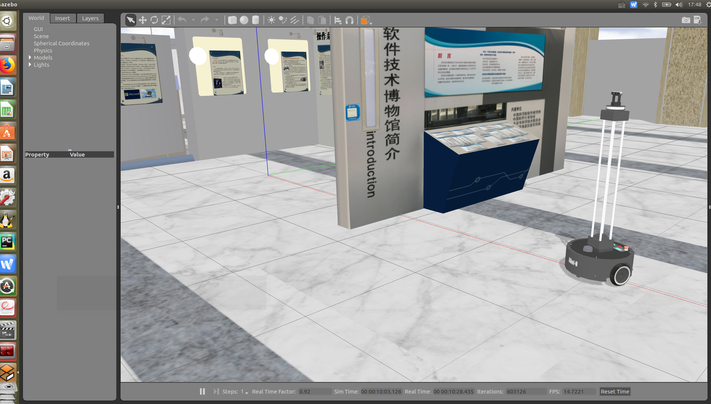
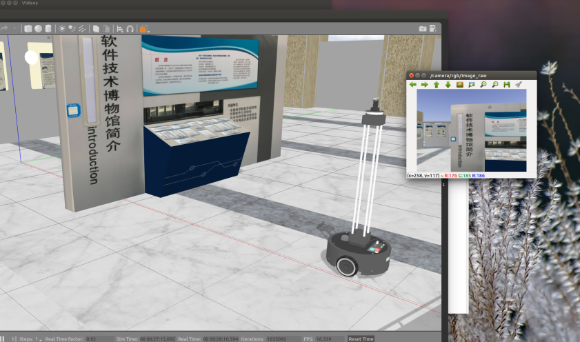
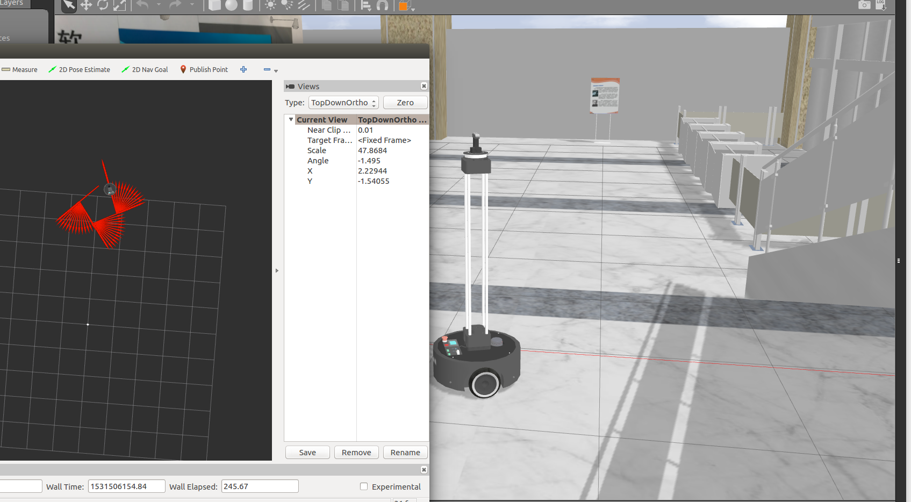
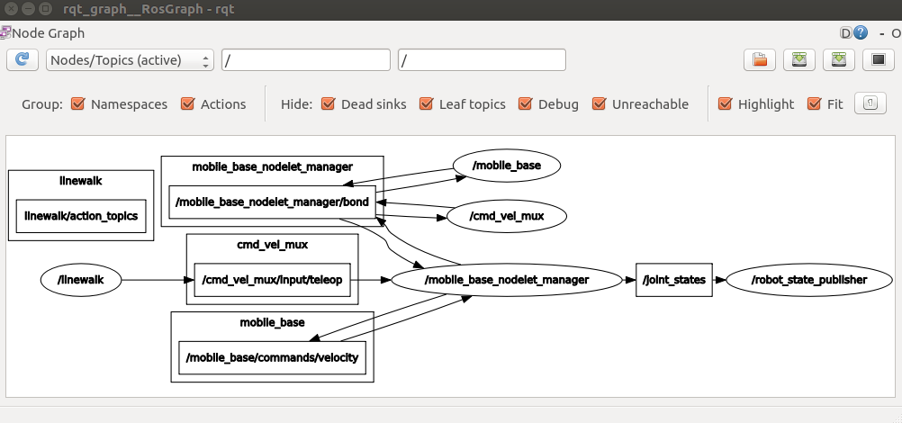
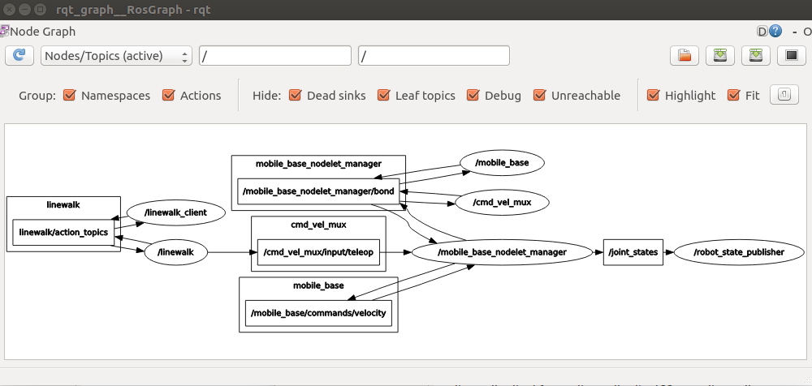

# 4.2 ROSPY（下）

本讲我们继续详细讲解和练习ROSPY。

**本讲重点**

- Param
- 命令行参数
- 日志
- 时间
- Topic

**教学目的**

- 熟练使用ROSPY获取和设置Param
- 熟练ROSPY命令行参数的获取和使用
- 熟练使用ROSPY日志进行编程
- 熟练使用ROSPY时间进行编程
- 熟练使用ROSPY Topic进行编程

## 4.2.1 Param

1. 获取参数

```python
rospy.get_param(param_name)
```

- 获取全局参数

  全局参数以`/`开头。

  ```python
  rospy.get_param('/global_param_name')
  ```

- 获取目前命名空间的参数

  ```python
  rospy.get_param('param_name')
  ```

  目前命名空间下的参数开头不带`/`，通常在`lauch`文件中有`group`定义。

  ```/xml
   <group ns="/robot1/camera">
   </group>
  ```
  
  例如`*ns="/xbot/camera"`，当参数定义为` <param name="brightness" type="double" value="0.5" />`时，这个参数的全局名称需要前面加上命名空间，为`/xbot/camera/brightness`
  
  ```xml
  <launch>
      <group ns="/xbot/camera">
          <param name="brightness" type="double" value="0.5" />
          <node name="camera_node" pkg="your_package" type="your_executable" output="screen" /> 
      </group>
  </launch>
  ```

  获取私有命名空间参数
  
  私有命名空间参数以`~`开头，获取这个参数的值时需要在名字前加`~`，如下


- ```python
rospy.get_param('~private_param_name')
  ```
  
- 获取参数，如果没，使用默认值

  ```python
  rospy.get_param('foo', 'default_value')
  ```

上面是获取参数名为“param_name”的参数值，`/global_param_name`为全局变量，param_name目前命名空间的参数，`~private_param_name`获取私有命名空间参数，获取参数`foo`的值，如果没有，使用默认值`default_value`。

2. 设置参数

设置参数为列表，布尔值或运算后的结果。

```python
rospy.set_param(param_name, param_value)

rospy.set_param('some_numbers', [1., 2., 3., 4.])
rospy.set_param('truth', True)
rospy.set_param('~private_bar', 1+2)
```

3. 删除参数

使用rospy.delete_param('param_name')

```python
rospy.delete_param('to_delete')
```

删除参数“param_name”

4. 判断参数是否存在

```python
rospy.has_param('param_name')

if rospy.has_param('to_delete'):
	rospy.delete_param('to_delete')
```

```python
rospy.resolve_name(name)

value = rospy.get_param('~foo')
rospy.loginfo('Parameter %s has value %s',  rospy.resolve_name('~foo'), value)
```

搜索参数

对参数进行搜索，即便不知道命名空间，也可以搜索参数。搜索由私有命名空间开始，向上到全局命名空间。获取参数名后，可以进行参数操作。

使用`rospy.search_param(param_name)`

```python
full_param_name = rospy.search_param('foo')
param_value = rospy.get_param(full_param_name)
```

**练习1 param的设置和读取**

任务要求：使用rospy提供的接口，运用设置参数，打印参数以及删除参数的方法，并最终打印出参数信息。

param_demo1.py程序的功能是设置参数、获取参数，测试参数是否存在，列出所有参数名称。程序从`if __name__=="__main__":`入口，调用`param_demo()`。`param_demo()`中首先初始化一个节点`rospy.init_node("param_demo")`，设置执行频率为每秒1次，`rate = rospy.Rate(1)`，当程序没有异常中断时`rate = rospy.Rate(1)`，运行循环中部分。设置当前命令空间下的参数`a_string`为字符串`baz`，`rospy.set_param('a_string', 'baz')`。设置私有参数`~private_int`为整数`2`，`rospy.set_param('~private_int', 2)`。设置当前命令空间下的参数`list_of_floats`为一个数组，值为`[1., 2., 3., 4.]`，`rospy.set_param('list_of_floats', [1., 2., 3., 4.])`。设置当前命令空间下的参数`bool_True`为布尔值`True`，`rospy.set_param('bool_True', True)`。设置当前命令空间下的参数`gains`，为字典`{'p': 1, 'i': 2, 'd': 3}`，`rospy.set_param('gains', {'p': 1, 'i': 2, 'd': 3})`。获取全局参数`/a_string`的值，如果没有获取到，如没有获取到使用默认值为字符串`empty`。获取当前命令空间下的参数`list_of_floats`，`relative_name = rospy.get_param("list_of_floats")`。获取私有参数`~private_int`，`private_param = rospy.get_param('~private_int')`。获取当前命令空间下的参数`bool_True`，如没有获取到使用默认值为布尔值`False`。获取当前命令空间下的参数`gains`，返回值为字典类型值` {'p': 1, 'i': 2, 'd': 3}`，`gains = rospy.get_param('gains')`。将字典中的值分别赋值给变量`p, i, d`，`p, i, d = gains['p'], gains['i'], gains['d']`，其中`p=1,i=2,d=3`。检查全局参数`/a_string`是否存在，`ifglobal_name = rospy.has_param("/a_string")`。如果存在，`if(ifglobal_name):`，在终端后台打印出字符串`/a_string exists value:`后结`/a_string`的值`baz`，`rospy.loginfo('/a_string exists value:'+global_name)`。否则打印字符串`/a_string does not exist`。删除全局参数`/a_string'`，`rospy.delete_param('/a_string')`。获取所有的参数名称，赋值给变量`params`，`params = rospy.get_param_names()`。打印参数名列表信息，`rospy.loginfo('param list: %s', params)`。`sleep`从循环开始到结束共计1秒钟，`rate.sleep()`。

```  python
#!/usr/bin/env python
# coding:utf-8

import rospy

def param_demo():
    rospy.init_node("param_demo")
    rate = rospy.Rate(1)
    while(not rospy.is_shutdown()):
        #参数设置
        rospy.set_param('a_string', 'baz')
        rospy.set_param('~private_int', 2)
        rospy.set_param('list_of_floats', [1., 2., 3., 4.])
        rospy.set_param('bool_True', True)
        rospy.set_param('gains', {'p': 1, 'i': 2, 'd': 3})
        
        #获取参数
        global_name = rospy.get_param("/a_string", default="empty")
        relative_name = rospy.get_param("list_of_floats")
        private_param = rospy.get_param('~private_int')
        default_param = rospy.get_param('bool_True', default=False)

        # 使用dictionary获取一组参数
        gains = rospy.get_param('gains')
        p, i, d = gains['p'], gains['i'], gains['d']

        #检查参数是否存在
        ifglobal_name = rospy.has_param("/a_string")
        if(ifglobal_name):
            rospy.loginfo('/a_string exists value:'+global_name)
        else:
            rospy.loginfo('/a_string does not exist')

        #删除参数
        rospy.delete_param('/a_string')

        params = rospy.get_param_names()
        rospy.loginfo('param list: %s', params)

        rate.sleep()

if __name__=="__main__":
    param_demo()
```

运行param_demo1.py

- 设置param_demo1.py可执行权限

```bash
chmod u+x param_demo1.py
```

- 运行

```bash
rosrun param_demo param_demo1.py
```

**练习2**

任务要求：使用launch(param_demo.launch)文件设置和读取param。

1. 编写param_demo.launch

   在launch文件中`param`和`rosparam`的功能相同，但格式不同。`param`的格式是`<param name=参数名称 value=参数值 />`，`rosparam`的格式是`<rosparam file=yaml参数文件路径 command="load" />`或

```xml
<rosparam>   
     参数1名: 参数1值
           ...
     参数n名: 参数n值
</rosparam>
```
下面是一个`launch`文件中设置参数的例子。
```xml
<launch>
	<!--param参数配置-->
	<param name="param1" value="1" />
	<param name="param2" value="2" />
	<!--rosparam参数配置-->
	<rosparam>   
        param3: 3
        param4: 4
        param5: 5
    </rosparam>
	<!--以上写法将参数转成YAML文件加载，注意param前面必须为空格，不能用Tab，否则YAML解析错误-->
	<node pkg="param_demo" type="param_demo2.py" name="param_demo" output="screen" />
</launch>
```

2. 编写参数设置程序param_demo2.py

param_demo2.py程序的功能是获取在`launch`文件中设置的参数，打印出参数的值，删除参数，设置参数值，查询指定名称参数是否存在，列出所有参数名称。程序入口为`if __name__=="__main__":`，之后调用`param_demo()`。`param_demo()`首先初始化节点`param_demo`，`rospy.init_node("param_demo")`。之后设置处理的频率为每秒1次，`rate = rospy.Rate(1)`。当程序退出前运行循环部分，`while(not rospy.is_shutdown()):`。获取全局参数`/param1`的值，`parameter1 = rospy.get_param("/param1")`。获取全局参数`/param2`的值，如果获取不到，使用默认值整数`222`，`parameter2 = rospy.get_param("/param2", default=222)`。在终端中打印参数` parameter1`的值，`rospy.loginfo('Get param1 = %d', parameter1)`。在终端中打印参数`parameter2`的值。删除全局参数`/param2`，`rospy.delete_param('/param2')`。设置全局参数`/param2`，设置会失败，上面全局变量`/param2`已被删除，`rospy.set_param('/param2',2)`。测试全局参数`/param3`是否存在，`ifparam3 = rospy.has_param('/param3')`。如果`/param3`存在，终端打印字符串`/param3 exists`，`rospy.loginfo('/param3 exists')`。否则终端打印字符串`/param3 does not exist`，`rospy.loginfo('/param3 does not exist')`。获取全部参数名称，`params = rospy.get_param_names()`。打印参数名称列表，`rospy.loginfo('param list: %s', params)`。程序`sleep`到从循环开始到1秒，`rate.sleep()`，继续循环。

```python
#!/usr/bin/env python
# coding:utf-8

import rospy

def param_demo():
    rospy.init_node("param_demo")
    rate = rospy.Rate(1)
    while(not rospy.is_shutdown()):
        #get param
        parameter1 = rospy.get_param("/param1")
        parameter2 = rospy.get_param("/param2", default=222)
        rospy.loginfo('Get param1 = %d', parameter1)
        rospy.loginfo('Get param2 = %d', parameter2)

        #delete param
        rospy.delete_param('/param2')

        #set param
        rospy.set_param('/param2',2)
        
        #check param
        ifparam3 = rospy.has_param('/param3')
        if(ifparam3):
            rospy.loginfo('/param3 exists')
        else:
            rospy.loginfo('/param3 does not exist')

        #get all param names
        params = rospy.get_param_names()
        rospy.loginfo('param list: %s', params)

        rate.sleep()

if __name__=="__main__":
    param_demo()
```

运行参数设置程序

- 设置param_demo2.py可执行权限

`u`是指文件的拥有者，由于当前用户创建了param_demo2.py文件，所以当前的用户就是此文件的拥有者，`+x`是添加执行权限，`x`是`excute`缩写。

```bash
chmod u+x param_demo2.py
```

- 运行param_demo.launch

```bash
roslaunch param_demo param_demo.launch
```

## 4.2.2 如何获取命令行参数

接下来我们学习和练习如何获取命令行参数，`args = rospy.myargv(argv=sys.argv)`用于rospy获取程序执行时后面跟着的参数。`method = args[1]`，是将第一个参数赋值给变量`method`，其中`args[0]`是程序名，`arg[2]`是第二个参数。

```python
args = rospy.myargv(argv=sys.argv)
method = args[1]
```

获取程序参数可以通过launch文件，也可以直接`rosrun`的程序后面加上参数。

**练习1**

任务要求：使用launch文件获取程序参数（sin，cos等），绘制出对应曲线

1. 编写信号处理话题发布程序，输入是数学方法（sin，cos等），输出是使用该数学方法发布处理后信息到`signal`话题的数据。

ros_singal.py用于显示用户输入的数学方法运行值到话题`signal`。程序入口是`if __name__ == '__main__':`。之后获取程序后跟着的参数，`args = rospy.myargv(argv=sys.argv)`。判断程序运行是否带有1个参数，`if len(args) != 2:`。如没有参数则在终端中打印信息后退出，`print "no method provided"; sys.exit(1)`。获取第一个参数，赋值给变量`method`，`method = args[1]`，其中`args[0]`是程序名称，`args[2]`是第2个参数。调用函数`my_func(method)`。`my_func(method)`中，首先初始化节点`talker`，`rospy.init_node('talker')`。创建话题发布方，`pub = rospy.Publisher('signal',Float64,queue_size=5)`，话题是`signal`，类型是`Float64`。处理频率为每秒20次，`rate = rospy.Rate(20)`。当程序没有退出循环执行，`while not rospy.is_shutdown():`。获取当前时间，time_now = rospy.get_time()。调用str_to_obj()函数，`str_to_obj("math." + method)(time_now)`，输入为`math.sin`等`math.输入的数学方法`。进入`str_to_obj(astr)`，首先打印字符串，`print('processing %s'%astr)`，如`procssing math.sin`。返回类型为全局变量的数学方法，`return globals()[astr]`，之下为错误处理。`signal = str_to_obj("math." + method)(time_now)`，获取参数输入为当前时间的数学函数，如`math.sin(当前时间)`，赋值给变量`signal`。之下是根据`signal`的范围，分别在终端中打印`loginfo`,`logwarn`和`logerr`信息。

```python
#!/usr/bin/env python

import rospy
import math
import sys
from std_msgs.msg import Float64

def str_to_obj(astr):
    print('processing %s'%astr)
    try:
        return globals()[astr]
    except KeyError:
        try:
            __import__(astr)
            mod=sys.modules[astr]
            return mod
        except ImportError:
            module,_,basename=astr.rpartition('.')
            if module:
                mod=str_to_obj(module)
                return getattr(mod,basename)
            else:
                raise

def my_func(method):
    rospy.init_node('talker')
    pub = rospy.Publisher('signal',Float64,queue_size=5)
    rate = rospy.Rate(20)
    while not rospy.is_shutdown():
        time_now = rospy.get_time()
        signal = str_to_obj("math." + method)(time_now)
        if 0.8 > abs(signal):
            out_put = "Normal output: %s" % signal
            rospy.loginfo(out_put)  
        elif 0.8 < abs(signal) and 0.9 > abs(signal):
            out_put = "Dangerous output: %s" % signal
            rospy.logwarn(out_put)
        elif 0.9 < abs(signal):
            out_put = "Wrong output: %s" %signal
            rospy.logerr(out_put)
        pub.publish(signal)
        rate.sleep()

if __name__ == '__main__':
    try:
        args = rospy.myargv(argv=sys.argv)
        if len(args) != 2:
            print "no method provided"
            sys.exit(1)
        method = args[1]
        my_func(method)
    except rospy.ROSInterruptException:
        pass
```

2. 编写launch文件arg_demo.launch

使用`launch`文件执行，`<node name="talker" pkg="paramtest" type="xxx.py" args="cos" />`转换为的命令为`rosrun paramtest xxx.py cos`。
```xml
<launch>
  <node name="talker" pkg="paramtest" type="xxx.py" args="cos" />
</launch>
```

运行arg_demo.launch

```bash
roslaunch actiontest arg_demo.launch
```

## 4.2.3 日志的使用

ROS为开发者提供了一套日志记录和输出系统，这套系统的实现方式是基于topic，也就是每个节点都会把一些日志信息发到一个统一的topic上去，这个topic就是`/rosout`。`/rosout`本身也是一个node，它专门负责进行日志的记录。我们在启动master的时候，系统就会附带启动`/rosout`。下面依次介绍日志级别、日志API和日志的使用。

**日志级别**

日志按严重程度，分为DEBUG，INFO，WARN，ERROR和FATAL。我们对五种等级进行逐一介绍，并举出一些通熟易懂的例子。

| 日志级别 | 说明     | 例子 |
| -------- | -------- | ---- |
| DEBUG    | 调试输出 |收到来自来电者Y的主题X的消息      |
| INFO     | 信息 | 节点初始化，新订阅的主题X：Y |
| WARN     |警告          |无法从<路径>中加载配置文件>。使用默认值。      |
| ERROR    |一些严重的，已经错了的信息          |没有收到关于主题X的更新10秒。直到X继续广播停止机器人。     |
| FATAL    | 事情发生了不可恢复的         | 电机着火了     |

DEBUG（调试）

您永远不需要查看系统是否正常工作的信息。

实例：
“收到来自来电者Y的主题X的消息”
“发送20个字节的套接字9”。

INFO(信息) 
少量的信息，可能是有用的用户。

实例：

- “节点初始化”
- “在主题X上的广告与消息类型Y”
- “新订阅的主题X：Y”

WARN（警告）
用户可能会发现报警，并可能会影响应用程序的输出，但是该系统的预期工作的一部分。

实例：

- “无法从<路径>中加载配置文件>。使用默认值。”

ERROR（错误）

一些严重的，已经错了的信息。

实例：

- “没有收到关于主题X的更新10秒。直到X继续广播停止机器人。”
- “在转换X中接收到的意外的值……”

FATAL（致命）

事情发生了不可恢复的。

实例：

- “电机着火了！"

以下程序首先初始化节点`talker`，`rospy.init_node('talker')`。之后创建一个话题发布者，`pub = rospy.Publisher(topic, String)`，发布的话题是`chatter`。在终端中打印话题信息，`rospy.loginfo("I will publish to the topic %s", topic)`。当程序退出前执行循环，`while not rospy.is_shutdown():`。获取当前时间，连接字符串`hello world`之后，赋值给变量`str`，`str = "hello world %s"%rospy.get_time()`。终端中打印变量`str`的值，`rospy.loginfo(str)`。发布变量`str`数据到话题`chatter`，pub.publish(str)。程序睡眠0.1秒，`rospy.sleep(0.1)`。

```python
rospy.init_node('talker')
topic = 'chatter'
pub = rospy.Publisher(topic, String)
rospy.loginfo("I will publish to the topic %s", topic)
  while not rospy.is_shutdown():
      str = "hello world %s"%rospy.get_time()
      rospy.loginfo(str)
      pub.publish(str)
      rospy.sleep(0.1)
```

运行以上程序(需要先启动`roscore`)，使用`rostopic echo rosout`来显示`master`节点上`rosout`话题信息。

```bash
rostopic echo rosout

---
header: 
  seq: 1
  stamp: 1247874193220264911
  frame_id: 0
level: 2
name: /talker-13716-1247874192981
msg: hello world 1247874193.14
file: 
function: 
line: 0
topics: ['/time', '/chatter', '/rosout']
```

**日志API**

|函数      | 说明     |
| ---- | ---- |
|rospy.logdebug(msg, *args)      | 记录debug信息     |
|rospy.logwarn(msg, *args)      |  记录warn信息    |
|rospy.loginfo(msg, *args)      |  记录info信息    |
|rospy.logerr(msg, *args)      |  记录error信息    |
|rospy.logfatal(msg, *args)      | 记录fatal信息     |
|rospy.log*_throttle(period, msg)     | 周期性写log |

上表函数和日志等级是一对一对应的。

**周期性写log**
rospy.log*_throttle(period, msg)

```python
while True:
   rospy.loginfo_throttle(60, "This message will print every 60 seconds")
```

**一次性写log**

rospy.log*_once(msg)

```python
while True:
    rospy.loginfo_once("This message will print only once")
```
注意：

- 节点完全初始化前，信息将不会出现在`/rosout`话题，所以你可能看不到最初的消息。

- 当你看到一个消息输出在`stdout`，不在`/rosout`，很可能是初始化未完成，或者你忘记调`rospy.init_node`。

- 节点日志文件一般位于`ROS_ROOT/log or ~/.ros/log`，你可以可以通过`ROS_LOG_DIR`环境变量来更改它

- 如果你想看到DEBUG信息，可以在初始化节点如：

  ```python
  rospy.init_node('my_node', log_level=rospy.DEBUG)
  ```

- 每个`rospy.log*()`函数可以输入格式化的字符串内容，如：
  `rospy.logerr("%s returned the invalid value %s", other_name, other_value)`


## 4.2.4 时间的使用

ROS里经常用到的一个功能就是时钟，比如计算机器人移动距离、设定一些程序的等待时间、设定计时器等等。ROSPY同样给我们提供了时钟方面的操作。

Time和Duration

- ROS具有内置的时间和持续的原始类型
- 在rospy由`rospy.Time`和`rospy.Duration`实现
- `Time`是一个特定的时刻（如“今天下午”）而`Duration`是持续一段时间（如5小时）。持续时间可以是负的。
- 时间和持续时间有相同的表现形式
  - int32 secs
  - int32 nsecs

- ROS有能力为节点设置一个模拟时钟。不必使用Python的time.time模块，而是使用ros的时间函数来获取当前时间

rospy里有两种时间的表示方法，一种是时刻（ros::Time），一种是时长 （ros::Duration）。无论是Time还是Duration都具有相同的表示方法： int32 sec int32 nsec Time/Duration都由秒和纳秒组成。Time和Duration表示的概念并不相同，Time指的是某个时刻，而Duration指的是某个时段，尽管他们的数据结构都相同，但是用在不同的场景下。

获取当前时间

- rospy.Time.now(), rospy.get_rostime()两个是相同的
  now = rospy.get_rostime()
  rospy.loginfo("Current time %i %i", now.secs, now.nsecs)
- rospy.get_time()，获取浮点值的秒数

可以通过`rospy.Time.now()`, `rospy.get_rostime()`获取当前时间，这两个方法是相同的。`rospy.get_time()`可获取浮点值的秒数。

时间为0值是什么意思？0指使用模拟时钟的时间，直到在`/clock`上收到第一条消息，否则`get_rostime()`会得到0值。0值意味客户端还不知道时间，需要区别对待，循环获取`get_rostime()`直到非0值。

**创建时间**

- rospy.Time(secs=0, nsecs=0)

```python
epoch = rospy.Time() 		  # secs=nsecs=0
t = rospy.Time(10)	 		  # t.secs=10
t = rospy.Time(12345, 6789)
```

- rospy.Time.from_sec(float_secs)

```python
t = rospy.Time.from_sec(123456.789)
```

**时间和时长单位转换**

时间和时长的情况下可以转换为秒以及纳秒，便于非ROS库使用

```python
t = rospy.Time.from_sec(time.time())
seconds = t.to_sec() #浮点数
nanoseconds = t.to_nsec()
```

```python
d = rospy.Duration.from_sec(60.1)
seconds = d.to_sec() #浮点数
nanoseconds = d.to_nsec()
```

**时间和时长算术运算**

- 支持算术运算

1 hour + 1 hour = 2 hours (duration + duration = duration)
2 hours - 1 hour = 1 hour (duration - duration = duration)
Today + 1 day = tomorrow (time + duration = time)
Today - tomorrow = -1 day (time - time = duration)
Today + tomorrow = error (time + time is undefined)

ROS为我们重载了Time、Duration类型之间的加减运算。以上是Time、Duration之间的加减运算，要注意没有Time+Time的做法。

**Sleeping和Rates（睡眠和速率）**

通常在机器人任务执行中可能有需要等待的场景，这时就要用到sleep功能，rospy中提供了两种sleep的方法：

1 采用duration的方法
2 定义sleep的频率以达到效果

`rospy.sleep(10)`和`d=rospy.Duration(10);rospy.sleep(d)`实现的效果相同，都是睡眠10秒。

```python
#方法1
# rospy.sleep(duration)，duration可以是rospy.Duration或秒。会睡眠指定的时间。
# sleep for 10 seconds
rospy.sleep(10)

# sleep for duration
d = rospy.Duration(10, 0)
rospy.sleep(d)
```

```python
#方法2
r = rospy.Rate(10) # 10hz
while not rospy.is_shutdown():
	pub.publish("hello")
	r.sleep(）
```
- rospy.Rate(hz)，可以保持一定的速率来进行循环。
- rospy.sleep(duration)，duration可以是rospy.Duration或秒。会指定睡眠的时间。
- rospy.sleep()如果出现错误，会抛出rospy.ROSInterruptException

Timer

Rate的功能是指定一个频率，让某些动作按照这个频率来循环执行。与之类似的是ROS中的定时器Timer，它是通过设定回调函数和触发时间来实现某些动作的反复执行，创建方法和topic中的subscriber很像。

- 函数定义：`rospy.Timer(period, callback, oneshot=False)`，实现方便定期调用回调函数。

- period，调用回调函数的时间间隔，如`rospy.Duration(0.1)`即为10分之1秒。

- callback，定义回调函数，会传递TimerEvent实例

- oneshot，定时器，是否执行多次。false即一直执行

实例

```python
def my_callback(event):
	print 'Timer called at ' + str(event.current_real)
	rospy.Timer(rospy.Duration(2), my_callback)
```

Timer实例会每2秒调用my_callback

- TimerEvent实例包含如下字段：

  last_expected，上一个触发回调函数应该发生的时间
  last_real，上一个触发回调函数实际发生的时间
  current_expected，当前触发回调函数应该发生的时间
  current_real，当前触发回调函数实际发生的时间
  last_duration，上一个触发回调函数发生时间间隔（结束时间-开始时间）

- 调用shutdown()关闭

## 4.2.5 ROSPY强化练习

例子：更改激光雷达的参数以及将`/scan`消息remap到`/rplidar_scan`以提供cut_scan.py使用，位于xbot_bringup程序包的launch文件夹中

XBot环境下

```xml
<launch>
	<!-- sensor rplidar-A2 lidar scan -->
	<node name="rplidarNode"          pkg="rplidar_ros"  type="rplidarNode" output="screen">
		<param name="serial_port"         type="string" value="/dev/rplidar"/>
		<param name="serial_baudrate"     type="int"    value="115200"/>
		<param name="frame_id"            type="string" value="laser"/>
		<param name="inverted"            type="bool"   value="false"/>
		<param name="angle_compensate"    type="bool"   value="true"/>
		<remap from="scan"          to="rplidar_scan"/>
	</node>
</launch>
```

仿真环境下

1. 查看`/scan` topic对应的发布`node`程序

```bash
rostopic info /scan

---

Type: sensor_msgs/LaserScan

Publishers: 
 * /gazebo (http://127.0.0.1:35743/)

Subscribers: None
```

课件发布这个topic的是`/gazebo`节点。

打开启动仿真的`robot_spawn.launch`，可见`empty_world.launch`启动了Gazebo。

```xml
  <!-- Start Gazebo with a blank world -->
  <include file="$(find gazebo_ros)/launch/empty_world.launch">
    <arg name="world_name" value="$(find robot_sim_demo)/worlds/ROS-Academy.world"/>
    <!--arg name="world_name" value="$(find turtlebot_gazebo)/worlds/playground.world"/-->
    <arg name="debug" value="$(arg debug)" />
    <arg name="gui" value="$(arg gui)" />
    <arg name="paused" value="false"/>
    <arg name="use_sim_time" value="true"/>
    <arg name="headless" value="$(arg headless)"/>
  </include>
```

编辑`empty_world.launch`

```xml
<?xml version="1.0"?>
<launch>

  <!-- these are the arguments you can pass this launch file, for example paused:=true -->
  <arg name="paused" default="false"/>
  <arg name="use_sim_time" default="true"/>
  <arg name="extra_gazebo_args" default=""/>
  <arg name="gui" default="true"/>
  <arg name="recording" default="false"/>
  <!-- Note that 'headless' is currently non-functional.  See gazebo_ros_pkgs issue #491 (-r arg does not disable
       rendering, but instead enables recording). The arg definition has been left here to prevent breaking downstream
       launch files, but it does nothing. -->
  <arg name="headless" default="false"/>
  <arg name="debug" default="false"/>
  <arg name="physics" default="ode"/>
  <arg name="verbose" default="false"/>
  <arg name="output" default="screen"/>
  <arg name="world_name" default="worlds/empty.world"/> <!-- Note: the world_name is with respect to GAZEBO_RESOURCE_PATH environmental variable -->
  <arg name="respawn_gazebo" default="false"/>
  <arg name="use_clock_frequency" default="false"/>
  <arg name="pub_clock_frequency" default="100"/>

  <!-- set use_sim_time flag -->
  <param name="/use_sim_time" value="$(arg use_sim_time)"/>

  <!-- set command arguments -->
  <arg unless="$(arg paused)" name="command_arg1" value=""/>
  <arg     if="$(arg paused)" name="command_arg1" value="-u"/>
  <arg unless="$(arg recording)" name="command_arg2" value=""/>
  <arg     if="$(arg recording)" name="command_arg2" value="-r"/>
  <arg unless="$(arg verbose)" name="command_arg3" value=""/>
  <arg     if="$(arg verbose)" name="command_arg3" value="--verbose"/>
  <arg unless="$(arg debug)" name="script_type" value="gzserver"/>
  <arg     if="$(arg debug)" name="script_type" value="debug"/>

  <!-- start gazebo server-->
  <group if="$(arg use_clock_frequency)">
    <param name="gazebo/pub_clock_frequency" value="$(arg pub_clock_frequency)" />
  </group>
  <node name="gazebo" pkg="gazebo_ros" type="$(arg script_type)" respawn="$(arg respawn_gazebo)" output="$(arg output)"
  args="$(arg command_arg1) $(arg command_arg2) $(arg command_arg3) -e $(arg physics) $(arg extra_gazebo_args) $(arg world_name)" />

  <!-- start gazebo client -->
  <group if="$(arg gui)">
    <node name="gazebo_gui" pkg="gazebo_ros" type="gzclient" respawn="false" output="$(arg output)" args="$(arg command_arg3)"/>
  </group>

</launch>
```

node`gazebo`处添加`<remap from="scan" to="rplidar_scan"/>`

```xml
<?xml version="1.0"?>
<launch>
    <!-- these are the arguments you can pass this launch file, for example paused:=true -->
    <arg name="paused" default="false"/>
    <arg name="use_sim_time" default="true"/>
    <arg name="extra_gazebo_args" default=""/>
    <arg name="gui" default="true"/>
    <arg name="recording" default="false"/>
    <!-- Note that 'headless' is currently non-functional.  See gazebo_ros_pkgs issue #491 (-r arg does not disable
       rendering, but instead enables recording). The arg definition has been left here to prevent breaking downstream
       launch files, but it does nothing. -->
    <arg name="headless" default="false"/>
    <arg name="debug" default="false"/>
    <arg name="physics" default="ode"/>
    <arg name="verbose" default="false"/>
    <arg name="output" default="screen"/>
    <arg name="world_name" default="worlds/empty.world"/>
    <!-- Note: the world_name is with respect to GAZEBO_RESOURCE_PATH environmental variable -->
    <arg name="respawn_gazebo" default="false"/>
    <arg name="use_clock_frequency" default="false"/>
    <arg name="pub_clock_frequency" default="100"/>
    <!-- set use_sim_time flag -->
    <param name="/use_sim_time" value="$(arg use_sim_time)"/>
    <!-- set command arguments -->
    <arg unless="$(arg paused)" name="command_arg1" value=""/>
    <arg     if="$(arg paused)" name="command_arg1" value="-u"/>
    <arg unless="$(arg recording)" name="command_arg2" value=""/>
    <arg     if="$(arg recording)" name="command_arg2" value="-r"/>
    <arg unless="$(arg verbose)" name="command_arg3" value=""/>
    <arg     if="$(arg verbose)" name="command_arg3" value="--verbose"/>
    <arg unless="$(arg debug)" name="script_type" value="gzserver"/>
    <arg     if="$(arg debug)" name="script_type" value="debug"/>
    <!-- start gazebo server-->
    <group if="$(arg use_clock_frequency)">
        <param name="gazebo/pub_clock_frequency" value="$(arg pub_clock_frequency)" />
    </group>
    <node name="gazebo" pkg="gazebo_ros" type="$(arg script_type)" respawn="$(arg respawn_gazebo)" output="$(arg output)" args="$(arg command_arg1) $(arg command_arg2) $(arg command_arg3) -e $(arg physics) $(arg extra_gazebo_args) $(arg world_name)">
        <remap from="scan"          to="rplidar_scan"/>
    </node>
    <!-- start gazebo client -->
    <group if="$(arg gui)">
        <node name="gazebo_gui" pkg="gazebo_ros" type="gzclient" respawn="false" output="$(arg output)" args="$(arg command_arg3)"/>
    </group>
</launch>
```

**练习1：Topic强化练习XBot正方形轨迹行走**

任务要求：通过向`/cmd_vel`话题发布`geometry_msg/Twist`消息，控制机器人移动，使机器人在仿真环境里走正方形轨迹。

任务描述：基于XBot机器人模拟器，编写Python脚本，通过向`/cmd_vel`话题发布`geometry_msg/Twist`消息，控制机器人移动，使机器人在仿真环境里走正方形轨迹。 

1. 搭建XBot仿真环境（之前已有环境的同学，此步可省略）

切换到catkin工作空间中的src目录下；将robot_sim_demo文件copy到src文件下，回到catkin工作空间下编译。

```bash
catkin_make 
```
配置环境变量

`source devel/setup.bash`用于设置环境变量，每次当我们新创建一个包，运行其下文件时需要进行设置，设置后环境变量会增加到`$ROS_PACKAGE_PATH`中。我们使用`echo $ROS_PACKAGE_PATH`可以看到当前的工作空间的绝对路径已经加入到变量中，同时还可以使用`rospack list | grep 包名`查看到我们新建的包已经可以找到。

```bash
source devel/setup.bash  //设置环境变量  
echo $ROS_PACKAGE_PATH   //检查环境变量 
```

正确情况下可以在$ROS_PACKAGE_PATH变量输出看到工作空间所在目录，如`~/catkin_ws/src`。

运行`.launch`文件：

```bash
roslaunch robot_sim_demo robot_spawn.launch 
```



可以看到，我们在.launch文件里集成了跟Gazebo和URDF相关的节点，所以在启动.launch文件时，我们同时启动了Gazebo仿真环境。成功后，我们可以运用之前学过的`rosnode list`，`rosmsg list`等命令看看运行了哪些节点，有哪些消息。

如果想查看摄像头返回的画面，可运行以下命令

```bash
rosrun image_view image_view image:=/camera/rgb/image_raw
```

可以看到出现了一个小框，里面是机器人顶部的RGB摄像头拍摄到的画面，当机器人移动时，返回的画面也会跟着改变。同时我们也可以先不指定`image`对应的话题，运行`rosrun image_view image_view`，当软件启动后在左上角选框中选择对应的话题名称，如`/camera/rgb/image_raw`，高清单目摄像头原始数据话题。



2. 编写square_dance_demo.py脚本文件

**仿真环境下**

在模拟器robot_sim_demo/src目录下新建脚本文件square_dance_demo.py，实现XBot每到达一个点，都输入到达这个点的INFO日志消息，后面都是先前进一米，暂停一下，再逆时针旋转90度。

`if  __name__ == '__main__':`是程序的入口，之后新建类`OutAndBack()`，`class OutAndBack():`中的`__init__`私有函数，`def __init__(self):`，首先初始化节点`square_dance`，之后`rospy.init_node('square_dance')`。设置回调函数，让机器人停下来，`rospy.on_shutdown(self.shutdown)`。我们看一下`shutdown()`

```python
def shutdown(self):
        rospy.loginfo("Stopping the robot...")
        self.cmd_vel.publish(Twist())
        rospy.sleep(1)
```

`self.cmd_vel.publish(Twist())`，话题`cmd_vel`发布一个初始化`Twist()`变量，即速度和角速度都是0，让机器人停止。`self.cmd_vel = rospy.Publisher('/cmd_vel', Twist, queue_size=5)`用于创建挂提`/cmd_vel`的发布方，它的消息类型是`Twist`。设置当前命名空间下的参数`test_rate`为50。获取参数`test_rate`的值(50)给变量`rate`，设置处理速度为每秒50次，`r = rospy.Rate(rate)`。设置机器人线速度`linear_speed`为每秒0.2米，`linear_speed = 0.2`。行进的距离为1.0米，`goal_distance = 1.0`。计算直线运动的时长，`linear_duration = goal_distance / linear_speed`，5秒。设置角速度为每秒1弧度，`angular_speed = 1.0`，目标旋转角度为pi，180度。终端下在`loginfo`中打印机器人启动信息，`rospy.loginfo("The robot is ready to move……")`。获取当前时间，`start_time = rospy.get_rostime()`。下面的代码分分为几个行动部分，每部分均是首先设置速度，之后通过计算运行时间乘以运行的频率，获得运行的步数，`ticks = int(linear_duration *rate)`。之后在步数内，发布速度和角速度数据到话题`/cmd_vel`，实现机器人的运动，如下

```python
for t in range(ticks):
            self.cmd_vel.publish(move_cmd)
            r.sleep()
```

各阶段运动代码类似，讲解可参考上面的第一步，省略。

```python
#!/usr/bin/env python 
# -*- coding:utf-8 -*-

import rospy  # 引用ROS的核心Python库
from geometry_msgs.msg import Twist
from math import pi

class OutAndBack():
    def __init__(self):
        # 初始化节点
        rospy.init_node('square_dance')
        # 设置回调函数，让机器人停下来
        rospy.on_shutdown(self.shutdown)

        # 定义用来发布twist命令给 /cmd_vel话题的ROS发布者
        self.cmd_vel = rospy.Publisher('/cmd_vel', Twist, queue_size=5)
        # 设置频率
        rospy.set_param('test_rate',50)
        rate = rospy.get_param('test_rate')  
        r = rospy.Rate(rate)
    
        # 设置线速度，角速度，目标距离，计算需要的时间
        linear_speed = 0.2
        goal_distance = 1.0
        linear_duration = goal_distance / linear_speed
        angular_speed = 1.0
        goal_angle = pi
    
        rospy.loginfo("The robot is ready to move……")
        # 获取起始时刻时间
        start_time = rospy.get_rostime()
        rospy.loginfo("Start time %i %i", start_time.secs, start_time.nsecs)
    
        # 前进一米，到达第一个节点
        move_cmd = Twist()
        move_cmd.linear.x = 0.2
        ticks = int(linear_duration *rate)
    
        for t in range(ticks):
            self.cmd_vel.publish(move_cmd)
            r.sleep()
        # 旋转之前暂停一下
        move_cmd = Twist()
        self.cmd_vel.publish(move_cmd)
        rospy.sleep(1)
        rospy.loginfo("The robot has arrived at the first point;")
    
        # 逆时针旋转90度
        move_cmd.angular.z = angular_speed
        ticks = int(goal_angle/2 *rate)
        for t in range(ticks):
            self.cmd_vel.publish(move_cmd)
            r.sleep()
        # 暂停一下
        move_cmd = Twist()     
        self.cmd_vel.publish(move_cmd)
        rospy.sleep(1)
        # 前进1米,到达第二个点
        move_cmd.linear.x = 0.2
        ticks = int(linear_duration *rate)
        for t in range(ticks):
            self.cmd_vel.publish(move_cmd)
            r.sleep()
        # 旋转之前暂停一下
        move_cmd = Twist()
        self.cmd_vel.publish(move_cmd)
        rospy.sleep(1)
        rospy.loginfo("The robot has arrived at the second point;")
    
        # 逆时针旋转90度
        move_cmd.angular.z = angular_speed
        ticks = int(goal_angle/2 *rate)
        for t in range(ticks):
            self.cmd_vel.publish(move_cmd)
            r.sleep()
        # 暂停一下
        move_cmd = Twist()     
        self.cmd_vel.publish(move_cmd)
        rospy.sleep(1)
    
        # 前进1米,到达第三个点
        move_cmd.linear.x = 0.2
        ticks = int(linear_duration *rate)
        for t in range(ticks):
            self.cmd_vel.publish(move_cmd)
            r.sleep()
        # 暂停一下
        move_cmd = Twist()     
        self.cmd_vel.publish(move_cmd)
        rospy.sleep(1)
    
        rospy.loginfo("The robot has arrived at the third point;")
    
        # 逆时针旋转90度
        move_cmd.angular.z = angular_speed
        ticks = int(goal_angle / 2 * rate)
        for t in range(ticks):
            self.cmd_vel.publish(move_cmd)
            r.sleep()
        # 暂停一下
        move_cmd = Twist()
        self.cmd_vel.publish(move_cmd)
        rospy.sleep(1)
        # 前进1米到达第四个点
        move_cmd.linear.x = 0.2
        ticks = int(linear_duration * rate)
        for t in range(ticks):
            self.cmd_vel.publish(move_cmd)
            r.sleep()
        move_cmd = Twist()
        self.cmd_vel.publish(move_cmd)
        rospy.sleep(1)
        rospy.loginfo("The robot has arrived at the last point;")
    
        # 结束时间
        finish_time = rospy.get_rostime()
        # print(finish_time)
        rospy.loginfo("Finish time %i %i", finish_time.secs, finish_time.nsecs)
    
        # 停止机器人
        self.cmd_vel.publish(Twist())
        rospy.loginfo("The robot has finished the task.")
    
    # 我们的停机回调函数，如果脚本因任何原因停止运行，我们就会通过发布一条空的Twist消息让它停止运动
    def shutdown(self):
        rospy.loginfo("Stopping the robot...")
        self.cmd_vel.publish(Twist())
        rospy.sleep(1)


if  __name__ == '__main__':
    try:
        OutAndBack()

    except:
        rospy.loginfo("Out-and-Back node terminated.")
```

**XBot环境下**

XBot下的底盘驱动话题和仿真环境中有所变化，`/cmd_vel`变为`'/cmd_vel_mux/input/teleop'`，其它相同。额可以程序不变，使用`.launch`文件启动相关节点，使用`<remap from="/cmd_vel" to="/cmd_vel_mux/input/teleop"/>`，效果也是一样的。格式为

```xml
<launch>    
    <node pkg="包名" type="运行文件名" name="自定，不重要" output="screen">
        <!--将节点发布的原话题映射到新话题的名字上去：改名字-->
        <remap from="原话题" to="新话题" />        
    </node> 
</launch>
```

```python
#!/usr/bin/env python 
# -*- coding:utf-8 -*-


import rospy  # 引用ROS的核心Python库
from geometry_msgs.msg import Twist
from math import pi


class OutAndBack():
    def __init__(self):
        # 初始化节点
        rospy.init_node('square_dance')
        # 设置回调函数，让机器人停下来
        rospy.on_shutdown(self.shutdown)

        # 定义用来发布twist命令给 /cmd_vel话题的ROS发布者
        self.cmd_vel = rospy.Publisher('/cmd_vel_mux/input/teleop', Twist, queue_size=5)
        # 设置频率
        rospy.set_param('test_rate',50)
        rate = rospy.get_param('test_rate')  
        r = rospy.Rate(rate)
    
        # 设置线速度，角速度，目标距离，计算需要的时间
        linear_speed = 0.2
        goal_distance = 1.0
        linear_duration = goal_distance / linear_speed
        angular_speed = 1.0
        goal_angle = pi
    
        rospy.loginfo("The robot is ready to move……")
        # 获取起始时刻时间
        start_time = rospy.get_rostime()
        rospy.loginfo("Start time %i %i", start_time.secs, start_time.nsecs)
    
        # 前进一米，到达第一个节点
        move_cmd = Twist()
        move_cmd.linear.x = 0.2
        ticks = int(linear_duration *rate)
    
        for t in range(ticks):
            self.cmd_vel.publish(move_cmd)
            r.sleep()
        # 旋转之前暂停一下
        move_cmd = Twist()
        self.cmd_vel.publish(move_cmd)
        rospy.sleep(1)
        rospy.loginfo("The robot has arrived at the first point;")
    
        # 逆时针旋转90度
        move_cmd.angular.z = angular_speed
        ticks = int(goal_angle/2 *rate)
        for t in range(ticks):
            self.cmd_vel.publish(move_cmd)
            r.sleep()
        # 暂停一下
        move_cmd = Twist()     
        self.cmd_vel.publish(move_cmd)
        rospy.sleep(1)
        # 前进1米,到达第二个点
        move_cmd.linear.x = 0.2
        ticks = int(linear_duration *rate)
        for t in range(ticks):
            self.cmd_vel.publish(move_cmd)
            r.sleep()
        # 旋转之前暂停一下
        move_cmd = Twist()
        self.cmd_vel.publish(move_cmd)
        rospy.sleep(1)
        rospy.loginfo("The robot has arrived at the second point;")
    
        # 逆时针旋转90度
        move_cmd.angular.z = angular_speed
        ticks = int(goal_angle/2 *rate)
        for t in range(ticks):
            self.cmd_vel.publish(move_cmd)
            r.sleep()
        # 暂停一下
        move_cmd = Twist()     
        self.cmd_vel.publish(move_cmd)
        rospy.sleep(1)
    
        # 前进1米,到达第三个点
        move_cmd.linear.x = 0.2
        ticks = int(linear_duration *rate)
        for t in range(ticks):
            self.cmd_vel.publish(move_cmd)
            r.sleep()
        # 暂停一下
        move_cmd = Twist()     
        self.cmd_vel.publish(move_cmd)
        rospy.sleep(1)
    
        rospy.loginfo("The robot has arrived at the third point;")
    
        # 逆时针旋转90度
        move_cmd.angular.z = angular_speed
        ticks = int(goal_angle / 2 * rate)
        for t in range(ticks):
            self.cmd_vel.publish(move_cmd)
            r.sleep()
        # 暂停一下
        move_cmd = Twist()
        self.cmd_vel.publish(move_cmd)
        rospy.sleep(1)
        # 前进1米到达第四个点
        move_cmd.linear.x = 0.2
        ticks = int(linear_duration * rate)
        for t in range(ticks):
            self.cmd_vel.publish(move_cmd)
            r.sleep()
        move_cmd = Twist()
        self.cmd_vel.publish(move_cmd)
        rospy.sleep(1)
        rospy.loginfo("The robot has arrived at the last point;")
    
        # 结束时间
        finish_time = rospy.get_rostime()
        # print(finish_time)
        rospy.loginfo("Finish time %i %i", finish_time.secs, finish_time.nsecs)
    
        # 停止机器人
        self.cmd_vel.publish(Twist())
        rospy.loginfo("The robot has finished the task.")
    
    # 我们的停机回调函数，如果脚本因任何原因停止运行，我们就会通过发布一条空的Twist消息让它停止运动
    def shutdown(self):
        rospy.loginfo("Stopping the robot...")
        self.cmd_vel.publish(Twist())
        rospy.sleep(1)


if  __name__ == '__main__':
    try:
        OutAndBack()

    except:
        rospy.loginfo("Out-and-Back node terminated.")
```

3. 测试

启动脚本前，首先修改权限`chmod u+x square_dance_demo.py`使脚本变为可执行文件。

打开新终端，运行launch文件

**仿真环境下**

添加ROS主从配置，将`ROS_MASTER_URI`定义为仿真对应的IP和默认端口`11311`，`export ROS_MASTER_URI=http://127.0.0.1:11311`。将`ROS_HOSTNAME`定义为客户机IP，仿真情况下为本机`127.0.0.1`，`export ROS_HOSTNAME=127.0.0.1`。

```bash
vim ~/.bashrc
```

```bash
#export ROS_MASTER_URI=http://192.168.8.101:11311
export ROS_MASTER_URI=http://127.0.0.1:11311
#export ROS_HOSTNAME=192.168.8.xxx
export ROS_HOSTNAME=127.0.0.1
```

启动XBot Gazebo仿真

```bash
roslaunch robot_sim_demo robot_spawn.launch
```

**XBot环境下**

添加ROS主从配置，将`ROS_MASTER_URI`定义为XBot对应的IP`192.168.8.101`和默认端口`11311`，`export ROS_MASTER_URI=http://192.168.8.101:11311`。将`ROS_HOSTNAME`定义为客户机IP，仿真情况下为本机`192.168.8.xxx`，`export ROS_HOSTNAME=192.168.8.xxx`，由于XBot上的无限路由器使用DHCP动态分配客户端IP，因此需要使用`ifconfig -a`查看本机无线网卡动态被分配的IP，如下。

```bash
wlp3s0    Link encap:以太网  硬件地址 18:5e:0f:54:37:a1  
          inet 地址:192.168.2.133  广播:192.168.2.255  掩码:255.255.255.0
          inet6 地址: fe80::dc72:e47b:e7f2:ac38/64 Scope:Link
          UP BROADCAST RUNNING MULTICAST  MTU:1500  跃点数:1
          接收数据包:216611 错误:0 丢弃:0 过载:0 帧数:0
          发送数据包:131887 错误:0 丢弃:0 过载:0 载波:0
          碰撞:0 发送队列长度:1000 
          接收字节:235327477 (235.3 MB)  发送字节:16454268 (16.4 MB)
```

编辑打开新终端时自动运行的脚本`~/.bashrc`。

```bash
vim ~/.bashrc
```

```bash
export ROS_MASTER_URI=http://192.168.8.101:11311
#export ROS_MASTER_URI=http://127.0.0.1:11311
export ROS_HOSTNAME=192.168.8.xxx
#export ROS_HOSTNAME=127.0.0.1
```

启动XBot

```bash
roslaunch xbot_bringup xbot-u.launch
```

打开新终端，启动Rviz模拟器

```bash
rviz
```


运行square_dance_demo.py

```bash
python square_dance_demo.py
```

我们将看到机器人在rviz中移动，最后轨迹如图所示，可以看出走的正方形误差很大。如何减少误差呢？



**练习2：使用Service控制XBot运动**

任务描述：通过service的方式，控制机器人移动。

1. 编写.srv文件:Xbotwalk.srv，使用catin_make进行编译

```python
int64 request
---
int64 result
```

2. 编写服务端xbot_server.py

**仿真环境下**

程序从`if __name__=="__main__":`入口。首先初始化节点`xbot_server`，`rospy.init_node("xbot_server")`。创建话题发布方，话题名字为`/cmd_vel`，信息格式为`Twist`，`pub = rospy.Publisher('/cmd_vel',Twist,queue_size=5)`。调用函数`server_ser()`，server_srv()。`server_srv()`中，第一步是初始化一个`service`的服务端，`s = rospy.Service("xbotwalk",Xbotwalk,handle_function)`，其中服务的名称是`xbotwalk`，`srv`的类型是Xbotwalk，即`Xbotwalk.srv`，回调方法是`handle_function`。`handle_function`中首先判断`req.request`的值是多少，如果为0，`if req.request==0:`设置x方向的线性速度为0,`twist=Twist();twist.linear.x = 0`，发布速度到话题`/cmd_vel`，`pub.publish(twist)`。返回调用反馈`1`成功，`return XbotwalkResponse(1)`。以下各部分类似，分别设置`x`方向的线性速度、`z`方向的旋转速度等`twist.angular.z = -0.5`。

```python
#!/usr/bin/env python
# -*- coding:utf-8 -*-

# 上面指定编码utf-8，使python能够识别中文

# 加载必需模块，注意service模块的加载方式，from 包名.srv import * 获取刚刚定义的服务
# 其中srv指的是在包根目录下的srv文件夹，也即srv模块
import rospy
from service_robot_demo.srv import *
from geometry_msgs.msg import Twist

def server_srv():
    # 定义service的server端，service名称为"xbotwalk"， service类型为Xbotwalk
    # 收到的request请求信息将作为参数传递给handle_function进行处理
    s = rospy.Service("xbotwalk",Xbotwalk,handle_function)
    rospy.loginfo("The xbot is ready to handle the request:")
    # 用来触发所有的topic或者service，必须有
    rospy.spin()

def handle_function(req):
    # 注意我们是如何调用request请求内容的，是将其认为是一个对象的属性，通过对象调用属性，在我们定义
    # request部分的内容包含一个变量
    try:
        #客户端请求为0时,xbot停止运动
        if req.request==0:
            rospy.loginfo("Stop!")
            twist=Twist()
            twist.linear.x = 0
            pub.publish(twist)
            return XbotwalkResponse(1)
        #客户端请求为1时,xbot以0.5的速度向前运动
        if req.request==1:
            rospy.loginfo("Move forward!")
            twist=Twist()
            twist.linear.x = 0.5
            pub.publish(twist) 
            return XbotwalkResponse(1)  
        #客户端请求为2时,xbot以0.5的速度向后运动
        if req.request==2:
            rospy.loginfo("Move backward!")
            twist=Twist()
            twist.linear.x = -0.5
            pub.publish(twist) 
            return XbotwalkResponse(1)
        #客户端请求为3时,xbot以0.5的角速度正向旋转
        if req.request==3:
            rospy.loginfo("Positive rotate!")
            twist=Twist()
            twist.angular.z = 0.5
            pub.publish(twist) 
            return XbotwalkResponse(1) 
        #客户端请求为3时,xbot以0.5的角速度逆向旋转
        if req.request==4:
            rospy.loginfo("Reverse rotate!")
            twist=Twist()
            twist.angular.z = -0.5
            pub.publish(twist) 
            return XbotwalkResponse(1)    

    except rospy.ServiceException as exc:
        rospy.loginfo("The xbot service did not process request:")+str(exc)

# 如果单独运行此文件，则将上面定义的server_srv作为主函数运行
if __name__=="__main__":
    # 初始化节点，命名为 "xbot_server"
    rospy.init_node("xbot_server")
    pub = rospy.Publisher('/cmd_vel',Twist,queue_size=5)
    server_srv()
```

**XBot环境下**

```python
#!/usr/bin/env python
# -*- coding:utf-8 -*-

# 上面指定编码utf-8，使python能够识别中文

# 加载必需模块，注意service模块的加载方式，from 包名.srv import * 获取刚刚定义的服务
# 其中srv指的是在包根目录下的srv文件夹，也即srv模块
import rospy
from service_robot_demo.srv import *
from geometry_msgs.msg import Twist

def server_srv():
    # 初始化节点，命名为 "xbot_server"
    rospy.init_node("xbot_server")
    # 定义service的server端，service名称为"xbotwalk"， service类型为Xbotwalk
    # 收到的request请求信息将作为参数传递给handle_function进行处理
    s = rospy.Service("xbotwalk",Xbotwalk,handle_function)
    rospy.loginfo("The xbot is ready to handle the request:")
    # 用来触发所有的topic或者service，必须有
    rospy.spin()

def handle_function(req):
    # 注意我们是如何调用request请求内容的，是将其认为是一个对象的属性，通过对象调用属性，在我们定义
    # request部分的内容包含一个变量
    try:
        #客户端请求为0时,xbot停止运动
        if req.request==0:
            rospy.loginfo("Stop!")
            twist=Twist()
            twist.linear.x = 0
            pub.publish(twist)
            return XbotwalkResponse(1)
        #客户端请求为1时,xbot以0.5的速度向前运动
        if req.request==1:
            rospy.loginfo("Move forward!")
            twist=Twist()
            twist.linear.x = 0.5
            pub.publish(twist) 
            return XbotwalkResponse(1)  
        #客户端请求为2时,xbot以0.5的速度向后运动
        if req.request==2:
            rospy.loginfo("Move backward!")
            twist=Twist()
            twist.linear.x = -0.5
            pub.publish(twist) 
            return XbotwalkResponse(1)
        #客户端请求为3时,xbot以0.5的角速度正向旋转
        if req.request==3:
            rospy.loginfo("Positive rotate!")
            twist=Twist()
            twist.angular.z = 0.5
            pub.publish(twist) 
            return XbotwalkResponse(1) 
        #客户端请求为3时,xbot以0.5的角速度逆向旋转
        if req.request==4:
            rospy.loginfo("Reverse rotate!")
            twist=Twist()
            twist.angular.z = -0.5
            pub.publish(twist) 
            return XbotwalkResponse(1)    

    except rospy.ServiceException as exc:
        rospy.loginfo("The xbot service did not process request:")+str(exc)

# 如果单独运行此文件，则将上面定义的server_srv作为主函数运行
if __name__=="__main__":
    pub = rospy.Publisher('/cmd_vel_mux/input/teleop',Twist,queue_size=5)
    server_srv()
```

3. 编写客户端，该客户端实现的功能为规定通过键盘输入XBot运动的过程,包括运动方式,运动速度以及运动的时间,并将命令发送给服务器。

**仿真和XBot环境下相同**

```python
#!/usr/bin/env python
# coding:utf-8

# 上面的第二句指定编码类型为utf-8，是为了使python能够识别中文

# 加载所需模块
import rospy
from service_robot_demo.srv import *
import time

def client_srv():
    number = 0
    rospy.init_node("xbot_client")
    rospy.loginfo("The xbot is waiting for server...")

    try:
        # 等待有可用的服务 "xbotwalk",阻塞，直到有一个server来提供xbotwalk时才执行
        rospy.wait_for_service("xbotwalk")
        # 定义service客户端，创建服务处理句柄.service名称为“xbotwalk”，service类型为Xbotwalk
        xbot_client=rospy.ServiceProxy("xbotwalk",Xbotwalk)
       
        #首先,以0.5的速度旋转2s
        resq = xbot_client(3)
        #上述为简化风格，也可用正式的。
        #resp = xbot_client.call(XbotwalkRequest(m,p,n))
        number+=resq.result
        print number
        time.sleep(2)
    
        #然后,以0.5的速度前进4s
        resq = xbot_client(1)
        number+=resq.result
        print number
        time.sleep(4)
    
        #再然后,停止4s
        rospy.wait_for_service("xbotwalk")
        resq = xbot_client(0)
        number+=resq.result
        print number
        time.sleep(4)
    
        #以-0.5的速度旋转2s
        resq = xbot_client(4)
        number+=resq.result
        print number
        time.sleep(2)
    
        #停止4s
        rospy.wait_for_service("xbotwalk")
        resq = xbot_client(0)
        number+=resq.result
        print number
        time.sleep(4)
    
        #最后,以0.5的速度后退4s
        rospy.wait_for_service("xbotwalk")
        resq = xbot_client(2)
        number+=resq.result
        print number
    
        rospy.loginfo("The motion of the xbot changes %s"%number)
    
    except rospy.ServiceException as e:
        rospy.loginfo("Service call failed: %s"%e)


# 如果单独运行此文件，则将上面定义的client_srv作为主函数运行
if __name__=="__main__":
   client_srv()
```

4. 编译，将目录进入到/catkin_ws,将workplace进行编译

```bash
catkin_make
```

将xbot_server.py和xbot_client.py编辑完成以后,将其转换成可执行文件。

``` bash
#进入navi_server.py和navi_client.py所在的目录
cd catkin_ws/src/service_robot_demo/src
#将其赋予可执行权限
chmod u+x xbot_server.py xbot_client.py
```

5. 运行

**仿真环境下**

添加ROS主从配置

```bash
vim ~/.bashrc
```

```bash
#export ROS_MASTER_URI=http://192.168.8.101:11311
export ROS_MASTER_URI=http://127.0.0.1:11311
#export ROS_HOSTNAME=192.168.8.xxx
export ROS_HOSTNAME=127.0.0.1
```

启动仿真

```bash
roslaunch robot_sim_demo robot_spawn.launch
```

运行服务器，输入指令

```bash
rosrun service_robot_demo xbot_server.py 
```

运行客户端，输入指令

```bash
rosrun service_robot_demo xbot_client.py 
```


**XBot环境下**

添加ROS主从配置

```bash
vim ~/.bashrc
```

​```bash
export ROS_MASTER_URI=http://192.168.8.101:11311
#export ROS_MASTER_URI=http://127.0.0.1:11311
export ROS_HOSTNAME=192.168.8.xxx
#export ROS_HOSTNAME=127.0.0.1
```

启动XBot

```bash
roslaunch xbot_bringup xbot-u.launch 
```

运行服务器，输入指令:

```bash
rosrun service_robot_demo xbot_server.py 
```

运行客户端，输入指令:

```bash
rosrun service_robot_demo xbot_client.py 
```

**练习3**

任务要求：使用Actione控制XBot运动。

1. 编写.action文件，使用catin_make进行编译

Linewalk.action编写说明：

- 定义action的目标goal，它有一个 int32型变量 order来区分不同的目标指令
- 用三横刚表示分割，然后定义action的结果result，它同样有一个 int32型变量 finished 来记录已经完成的指令数
- 用三横刚表示分割，然后定义action的返回feedback，它有一个 float32型变量 processin来对action客户端请求进行反馈，编写完成后保存并关闭文件

```
#goal definition
int32 order
---
#result definition
int32 finished
---
#feedback
float32 processing
```

2. 编写服务端，action server，编写action服务端文件linewalk_server.py

**仿真环境下**

程序从`if __name__ == '__main__':`入口，首先初始化节点`linewalk`，`rospy.init_node('linewalk')`。建立一个话题发布方，话题名为`/cmd_vel`，消息格式是`Twist`，`pub = rospy.Publisher('/cmd_vel', Twist, queue_size=5)`。创建类变量`server`，`LinewalkAction（）`，`server = LinewalkAction(rospy.get_name())`。定义私有变量`_feedback`为`action_test.msg.LinewalkFeedback()`，`_feedback = action_test.msg.LinewalkFeedback()`。定义私有变量`_result`为`action_test.msg.LinewalkResult()`，`_result = action_test.msg.LinewalkResult()`。定义私有变量`_result.finished = 0`，`_feedback.processing = 0`。初始化服务器，`def __init__(self,name):`。获取action名称，`self._action_name = name`。设置action服务器，四个参数分别为（action名称、action类型、Callback函数、自启动设置），`self._as = actionlib.SimpleActionServer(self._action_name, action_test.msg.LinewalkAction, execute_cb=self.move, auto_start = False)`。启动服务器，`self._as.start()`。服务端回调函数`move()`， `def move(self,goal):`。判断服务是否被占用，`if self._as.is_preempt_requested():`。如果被占用，终端`loginfo`打印忙信息，`rospy.loginfo('Too busy!!!')`。设置`x`方向线速度为0，`twist.linear.x = 0`。发布速度信息到节点`/cmd_vel`， `pub.publish(twist)`，是XBot停止运动。修改通信标识为0，`success = False`。如果通信成功，`if success:`。根据`goal`的取值，驱动XBot做不同的运动。

```python
twist = Twist()
twist.linear.x = 0;
pub.publish(twist)
```

修改反馈和结果信息的值。以下各部分类似。阻塞，等待客户端访问，直到关闭服务器，`rospy.spin()`。

```python
self._feedback.processing += 33.4
self._result.finished += 1
```


```python
#! /usr/bin/env python
# -*- coding: UTF-8 -*-

# action_test服务器端
# 导入action_test中的文件
import roslib
# 导入rospy,进行python编写
import rospy
# 导入actionlib进行action通信
import actionlib
# 导入action_test中的msg,其中action_test为包名，用于Goal、Feedback、Result的调用
import action_test.msg
# Twist用于控制Xbot进行移动
from geometry_msgs.msg import Twist

# 定义LinewalkAction类，建立LinewalkAction服务器端
class LinewalkAction(object):
  # 定义变量_feedback用于查看任务进度,result查看完成的指令个数
  _feedback = action_test.msg.LinewalkFeedback()
  _result = action_test.msg.LinewalkResult()
  # 初始化对应变量
  _result.finished = 0
  _feedback.processing = 0
  
  # 初始化服务器
  def __init__(self,name):
      # 打印提示信息
      rospy.loginfo('Initing!')
      # 获取action名称
      self._action_name = name
      # 设置action服务器，四个参数分别为（action名称、action类型、Callback函数、自启动设置）
      self._as = actionlib.SimpleActionServer(self._action_name, action_test.msg.LinewalkAction, execute_cb=self.move, auto_start = False)
      # 启动服务器
      self._as.start()
      # 显示提示信息
      rospy.loginfo('Start the server')
      
  # 定义函数move，实现Xbot直线行走
  def move(self,goal):  
      # 状态标识，如果通信失败，则进行修改
      success = True
      # 输出服务器总任务进度
      rospy.loginfo('total finished order: %s' %self._result.finished)
      rospy.loginfo('total process: %.1f%%' %self._feedback.processing)
      # 输出提示信息
      rospy.loginfo('moving!')

      # 如果服务被占用
      if self._as.is_preempt_requested():
          # 输出提示信息
          rospy.loginfo('Too busy!!!')
          # 设置占用状态
          self._as.set_preempted()
          # 停止Xbot移动
          twist = Twist()
          twist.linear.x = 0
          pub.publish(twist)
          # 修改通信标识
          success = False
      # 如果通信成功
      if success:
          # 输出提示信息，进行指令判断
          rospy.loginfo('Success! Checking order/...')

          # 指令0，停止XBot运动
          if goal.order==0:
              # 输出提示信息
              rospy.loginfo('Stop!!')
              # 停止XBot移动
              twist = Twist()
              twist.linear.x = 0;
              pub.publish(twist)
              # 修改服务器状态
              self._feedback.processing += 33.4
              self._result.finished += 1
              # 输出服务器状态
              rospy.loginfo('total finished order: %s' %self._result.finished)
              rospy.loginfo('total process: %.1f%%' %self._feedback.processing)

          # 指令1，使XBot向前直线行驶
          if goal.order==1:
              # 输出提示信息
              rospy.loginfo('Move!!')
              # 控制XBot移动
              twist = Twist()
              twist.linear.x = 0.5;
              pub.publish(twist)
              # 修改服务器状态
              self._feedback.processing += 33.3
              self._result.finished += 1
              # 输出服务器状态
              rospy.loginfo('total finished order: %s' %self._result.finished)
              rospy.loginfo('total process: %.1f%%' %self._feedback.processing)

          # 指令2，使XBot向后直线行驶
          if goal.order==2:
              # 输出提示信息
              rospy.loginfo('Goback!!')
              # 控制XBot移动
              twist = Twist()
              twist.linear.x = -0.5;
              pub.publish(twist)
              # 修改服务器状态
              self._feedback.processing += 33.3
              self._result.finished += 1
              # 输出服务器状态
              rospy.loginfo('total finished order: %s' %self._result.finished)
              rospy.loginfo('total process: %.1f%%' %self._feedback.processing)
          
      # 报告错误指令提示
      else:
           rospy.loginfo('Error order!!')

# 主函数
if __name__ == '__main__':
   # 初始化linewalk节点
   rospy.init_node('linewalk')
   # 发布XBot控制
   pub = rospy.Publisher('/cmd_vel', Twist, queue_size=5)
   # 建立Linewalk服务器
   server = LinewalkAction(rospy.get_name())
   # 等待关闭服务器
   rospy.spin()
```

**XBot环境下**

编写linewalk_server.py

XBot下的`service`服务端程序基本上和仿真中的一样，话题`/cmd_vel`改为`'/cmd_vel_mux/input/teleop'`。同样也可以在`./launch`文件调用这个节点，`remap`话题`/cmd_vel`到`/cmd_vel/input/teleop`，`<remap from="/cmd_vel" to="/cmd_vel/input/teleop"/>`

```python
#! /usr/bin/env python
# -*- coding: UTF-8 -*-
# action_test服务器端
# 导入action_test中的文件
import roslib
# 导入rospy,进行python编写
import rospy
# 导入actionlib进行action通信
import actionlib
# 导入action_test中的msg,用于Goal、Feedback、Result的调用
import action_test.msg
# Twist用于控制Xbot进行移动
from geometry_msgs.msg import Twist

# 定义LinewalkAction类，建立LinewalkAction服务器端
class LinewalkAction(object):
  # 定义变量_feedback用于查看任务进度,result查看完成的指令个数
  _feedback = action_test.msg.LinewalkFeedback()
  _result = action_test.msg.LinewalkResult()
  # 初始化对应变量
  _result.finished = 0
  _feedback.processing = 0
  
  # 初始化服务器
  def __init__(self,name):
      # 打印提示信息
      rospy.loginfo('Initing!')
      # 获取action名称
      self._action_name = name
      # 设置action服务器，四个参数分别为（action名称、action类型、Callback函数、自启动设置）
      self._as = actionlib.SimpleActionServer(self._action_name, action_test.msg.LinewalkAction, execute_cb=self.move, auto_start = False)
      # 启动服务器
      self._as.start()
      # 显示提示信息
      rospy.loginfo('Start the server')
      
  # 定义函数move，实现Xbot直线行走
  def move(self,goal):  
      # 状态标识，如果通信失败，则进行修改
      success = True
      # 输出服务器总任务进度
      rospy.loginfo('total finished order: %s' %self._result.finished)
      rospy.loginfo('total process: %.1f%%' %self._feedback.processing)
      # 输出提示信息
      rospy.loginfo('moving!')

      # 如果服务被占用
      if self._as.is_preempt_requested():
          # 输出提示信息
          rospy.loginfo('Too busy!!!')
          # 设置占用状态
          self._as.set_preempted()
          # 停止XBot移动
          twist = Twist()
          twist.linear.x = 0;
          pub.publish(twist)
          # 修改通信标识
          success = False
      # 如果通信成功
      if success:
          # 输出提示信息，进行指令判断
          rospy.loginfo('Success! Checking order/...')

          # 指令0，停止XBot运动
          if goal.order==0:
              # 输出提示信息
              rospy.loginfo('Stop!!')
              # 停止XBot移动
              twist = Twist()
              twist.linear.x = 0;
              pub.publish(twist)
              # 修改服务器状态
              self._feedback.processing += 33.4
              self._result.finished += 1
              # 输出服务器状态
              rospy.loginfo('total finished order: %s' %self._result.finished)
              rospy.loginfo('total process: %.1f%%' %self._feedback.processing)

          # 指令1，使XBot向前直线行驶
          if goal.order==1:
              # 输出提示信息
              rospy.loginfo('Move!!')
              # 控制XBot移动
              twist = Twist()
              twist.linear.x = 0.5;
              pub.publish(twist)
              # 修改服务器状态
              self._feedback.processing += 33.3
              self._result.finished += 1
              # 输出服务器状态
              rospy.loginfo('total finished order: %s' %self._result.finished)
              rospy.loginfo('total process: %.1f%%' %self._feedback.processing)

          # 指令2，使XBot向后直线行驶
          if goal.order==2:
              # 输出提示信息
              rospy.loginfo('Goback!!')
              # 控制XBot移动
              twist = Twist()
              twist.linear.x = -0.5;
              pub.publish(twist)
              # 修改服务器状态
              self._feedback.processing += 33.3
              self._result.finished += 1
              # 输出服务器状态
              rospy.loginfo('total finished order: %s' %self._result.finished)
              rospy.loginfo('total process: %.1f%%' %self._feedback.processing)
          
      # 报告错误指令提示
      else:
           rospy.loginfo('Error order!!')

# 主函数
if __name__ == '__main__':
   # 初始化linewalk节点
   rospy.init_node('linewalk')
   # 发布XBot控制
   pub = rospy.Publisher('/cmd_vel_mux/input/teleop', Twist, queue_size=5)
   # 建立Linewalk服务器
   server = LinewalkAction(rospy.get_name())
   # 等待关闭服务器
   rospy.spin()
```

3. 编写客户端，linewalk_client.py

**仿真和XBot环境下相同**

客户端程序入口为`if __name__ == '__main__':`，首先初始化节点`linewalk_client`，`rospy.init_node('linewalk_client')`。之后调用客户端请求，`feedback = linewalk_client()`。`linewalk_client()`中，第一步是创建一个`action`的客户端，`client = actionlib.SimpleActionClient('linewalk', action_test.msg.LinewalkAction)`，其中`action`名称是`linewalk`，即action的文件名是`linewalk.action`。数据类型是`action_test.msg.LinewalkAction`。客户端请求服务，`client.wait_for_server()`。定义指令1，`goal = action_test.msg.LinewalkGoal(order=1)`。向服务器发送指令1，控制Xbot向前直线行驶，`client.send_goal(goal)`，调用服务端。保持Xbot向前移动5s，`time.sleep(5)`。等待服务结果，`client.wait_for_result()`。输出XBot移动提示，`rospy.loginfo('Xbot: All ready moving!!');rospy.loginfo('task process: 33.3%')`。以下部分类似，为将`order`赋值为2和0，是XBot做不同种类的运动。


```python
#! /usr/bin/env python
# -*- coding: UTF-8 -*-
# action_test客户端
# 导入action_test中的文件
import roslib
# 导入rospy,进行python编写
import rospy
# 导入actionlib.进行action通信
import actionlib
# 导入action_test中的msg,用于Goal、Feedback、Result的调用
import action_test.msg
# 导入time，控制Xbot运动时间
import time

# 定义linewalk客户端函数，与服务器端建立连接并控制Xbot移动
def linewalk_client():
    
    # 建立客户端，包含两个参数(服务器名称，action类型)
    client = actionlib.SimpleActionClient('linewalk', action_test.msg.LinewalkAction)
    # 输出请求服务提示信息
    rospy.loginfo('Waiting for server/...')
    # 请求服务
    client.wait_for_server()
    # 输出建立服务提示信息
    rospy.loginfo('***Connected***')
    # 输出XBot控制提示
    rospy.loginfo('Xbot: I am going to linewalking')
    # 输出客户端请求进度
    rospy.loginfo('task process: 0%')
    # 定义指令1
    goal = action_test.msg.LinewalkGoal(order=1)
    # 向服务器发送指令1,控制Xbot向前直线行驶
    client.send_goal(goal)
    # 保持Xbot向前移动5s
    time.sleep(5)
    # 等待服务结果
    client.wait_for_result()
    # 输出XBot移动提示
    rospy.loginfo('Xbot: All ready moving!!')
    # 更新客户端进度
    rospy.loginfo('task process: 33.3%')

    # 等待下个指令
    time.sleep(2)
    # 输出新的指令提示
    rospy.loginfo('Xbot: New order moving back!!')
    # 定义指令2
    goal = action_test.msg.LinewalkGoal(order=2)
    # 向服务器发送指令1,控制Xbot向后直线行驶
    client.send_goal(goal)
    # 保持XBot向后移动5s
    time.sleep(5)
    # 等待服务结果
    client.wait_for_result()
    # 输出XBot移动提示
    rospy.loginfo('Xbot: Back home!!')
    # 更新客户端进度
    rospy.loginfo('task process: 66.6%')

    # 等待下个指令
    time.sleep(2)
    # 定义指令0
    goal = action_test.msg.LinewalkGoal(order=0)
    # 向服务器发送指令0,停止XBot移动
    client.send_goal(goal)
    # 输出XBot提示
    rospy.loginfo('Xbot: I am tired now!!')
    # 更新客户端进度
    rospy.loginfo('task process: 100%')

    # 等待下个指令
    time.sleep(2)
    # 等待服务结果
    client.wait_for_result()
    # 返回服务结果
    return client.get_result()

# 主函数
if __name__ == '__main__':
    # 初始化客户端节点
    rospy.init_node('linewalk_client')
    # 调用客户端请求
    feedback = linewalk_client()
    # 输出终止信息
    print("Ending processing\...."
```

修改程序可执行权限，`chmod u+x *.py`

4. 运行演示

**仿真环境下**

添加ROS主从配置

```bash
vim ~/.bashrc
```

```bash
#export ROS_MASTER_URI=http://192.168.8.101:11311
export ROS_MASTER_URI=http://127.0.0.1:11311
#export ROS_HOSTNAME=192.168.8.xxx
export ROS_HOSTNAME=127.0.0.1
```

启动仿真

```bash
roslaunch robot_sim_demo robot_spawn.launch
```
运行服务端
```bash
rosrun action_test linewalk_server.py
```
运行客户端
```bash
rosrun action_test linewalk_client.py 
```


使用rqt查看服务器节点(选择node/Topics（active）)

```bash
rqt_graph
```



在linewalk_client请求linewalk_server服务的过程中，点击rqt_graph刷新，查看节点变化。



**XBot环境下**

添加ROS主从配置

```
vim ~/.bashrc
```

```bash
export ROS_MASTER_URI=http://192.168.8.101:11311
#export ROS_MASTER_URI=http://127.0.0.1:11311
export ROS_HOSTNAME=192.168.8.xxx
#export ROS_HOSTNAME=127.0.0.1
```

启动XBot

```bash
roslaunch xbot_bringup xbot-u.launch
```

运行服务端

```bash
rosrun action_test linewalk_server.py
```

运行客户端（换图，目前没图，需要稍后替换）

```bash
rosrun action_test linewalk_client.py 
```

<video src="./src/videos/action.mp4"></video>
5. 更改参数,改变XBot运动过程

**仿真和XBot环境下相同**

尝试更改linewalk_server.py中的运动参数,例如`twist.linear.x=0.5`改成`twist.angular.z=1`，重复4.4中的过程,观察XBot的运动。

6. 不阻塞等待

将客户端由阻塞改成非阻塞，代码如下。

```python
#! /usr/bin/env python
# -*- coding: UTF-8 -*-
# action_test客户端
# 导入action_test中的文件
import roslib
# 导入rospy,进行python编写
import rospy
# 导入actionlib.进行action通信
import actionlib
# 导入action_test中的msg,用于Goal、Feedback、Result的调用
import actiontest.msg
# 导入time，控制XBot运动时间
import time

PENDING = 0
ACTIVE = 1
DONE = 2
WARN = 3
ERROR = 4

nImage = 1

# 定义linewalk客户端函数，与服务器端建立连接并控制XBot移动
def linewalk_client():
    # 建立客户端，包含两个参数(服务器名称，action类型)
    client = actionlib.SimpleActionClient('linewalk', actiontest.msg.LinewalkAction)
    # 输出请求服务提示信息
    rospy.loginfo('Waiting for server/...')
    # 请求服务
    client.wait_for_server()
    # 输出建立服务提示信息
    rospy.loginfo('***Connected***')
    # 输出XBot控制提示

    steps = [1, 2, 0]
    for index in range(len(steps)):
        print 'Current step :', steps[index]
        goal = actiontest.msg.LinewalkGoal(order=steps[index])
        # rate =rospy.Rate(0.001)
        client.send_goal(goal)
        state_result = client.get_state()
        rospy.loginfo("state result: "+str(state_result))
        
        while state_result < DONE:
            rospy.loginfo("Doing staff while waiting")
            state_result = client.get_state()
            rospy.loginfo("state result: "+str(state_result))       
 
    return client.get_result()

# 主函数
if __name__ == '__main__':
    # 初始化客户端节点
    rospy.init_node('linewalk_client')
    # 调用客户端请求
    feedback = linewalk_client()
    # 输出终止信息
    print("Ending processing\....")
```