# 7.1 TF

**本讲重点**

- 坐标系的矩阵表示
- TF和坐标系
- TF in ROSPY

**教学目的**

- 了解坐标系的矩阵表示
- 了解TF和坐标系的基础知识，熟练使用相关命令
- 熟练使用ROSPY进行TF编程

每个机器人中都必然有坐标系和坐标转换，正是坐标系间的变换实现了机器人的运动控制。本讲的内容可视化的比较少，属于比较抽象的部分，等到学完这讲进入URDF后，会直观的看到这讲的内容。下面我们安装一下相关的包Package。


```bash
sudo apt-get install ros-kinetic-ros-tutorials ros-kinetic-geometry-tutorials ros-kinetic-rviz ros-kinetic-rosbash ros-kinetic-rqt-tf-tree 
```

我们运行一个实例turtle_tf_demo.launch

```bash
roslaunch turtle_tf turtle_tf_demo.launch
```

打开一个终端，运行turtle_teleop_key，使用方向键控制turtle1运动。我们可以看到第二只小乌龟不断朝第一只小乌龟运动。

```bash
rosrun turtlesim turtle_teleop_key 
```

这个例用到tf库创建三个坐标系，世界坐标系、turtle1坐标系、turtle2坐标系。这里使用了tf broadcaster来发布turtle的坐标系，并且使用了一个tf listener来计算坐标系之间的差异，从而使得一个turtle朝向另外一个turtle运动。打开turtle_tf_demo.launch，可以看到运行了哪些节点，有`turtle1_tf_broadcaster`, `turtle2_tf_broadcaster`, `turtle_pointer`等,launch文件路径，计算机/opt/ros/share/turtle_tf/

```xml
<launch>
    <!-- Turtlesim Node-->
    <node pkg="turtlesim" type="turtlesim_node" name="sim"/>
    <node pkg="turtlesim" type="turtle_teleop_key" name="teleop" output="screen"/>
    <!-- Axes -->
    <param name="scale_linear" value="2" type="double"/>
    <param name="scale_angular" value="2" type="double"/>
    <node name="turtle1_tf_broadcaster" pkg="turtle_tf" type="turtle_tf_broadcaster.py" respawn="false" output="screen" >
        <param name="turtle" type="string" value="turtle1" />
    </node>
    <node name="turtle2_tf_broadcaster" pkg="turtle_tf" type="turtle_tf_broadcaster.py" respawn="false" output="screen" >
        <param name="turtle" type="string" value="turtle2" />
    </node>
    <node name="turtle_pointer" pkg="turtle_tf" type="turtle_tf_listener.py" respawn="false" output="screen" ></node>
</launch>
```

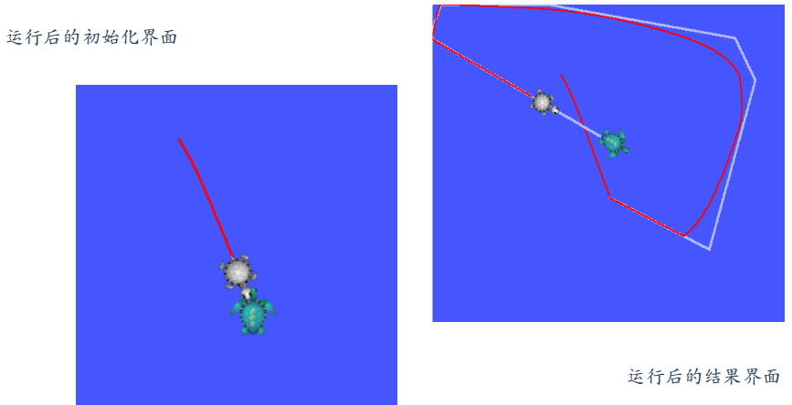

上图是运行的结果，解释一下，小乌龟1连接坐标系turtle1，小乌龟2连接坐标系turtle2，还有一个世界坐标系world frame。这几个坐标系的不断发布位置，监听位置，从而实现坐标变换让小乌龟2始终追随小乌龟1。从这个例子可以看出，tf针对的是坐标系。tf是英文单词transform的缩写，transform的意思是转换。顾名思义比较容易理解tf命令的主要对象是坐标系。它的主要功能是坐标系的转换和坐标系间关系的维护。其中，坐标系信息包括位置和姿态。

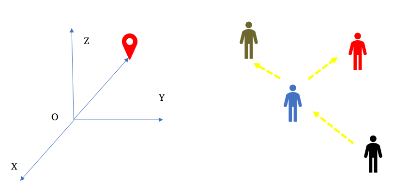

下面我们修改一下实例，使仿真中的机器人跟随XBot机器人运动

tf_broadcaster.py

```python
#!/usr/bin/env python  

import rospy
import tf
import turtlesim.msg

def handle_turtle_pose(msg, turtlename):
	br = tf.TransformBroadcaster()
	br.sendTransform((msg.x-5, msg.y-5, 0),
					 tf.transformations.quaternion_from_euler(0, 0, msg.theta),
					 rospy.Time.now(),
					 turtlename,
					 "odom")

if __name__ == '__main__':
	rospy.init_node('turtle_tf_broadcaster')
	turtlename = rospy.get_param('~turtle')
	rospy.Subscriber('/%s/pose' % turtlename,
					 turtlesim.msg.Pose,
					 handle_turtle_pose,
					 turtlename)
	rospy.spin()
```

tf_follow.py

```python
#!/usr/bin/env python  
# coding:utf-8
import rospy
import math
import tf
import geometry_msgs.msg
import turtlesim.srv

'''
该程序为了与仿真一致，在原来的两个小乌龟相互追随的样例基础上改编而来
换成使用仿真的小乌龟turtle1去追随xbot-u机器人的运动
使用前如果是分别在主从上运行请先将两个系统时间对齐
'''
if __name__ == '__main__':
	rospy.init_node('turtle_tf_listener')

	listener = tf.TransformListener()

	turtle_vel = rospy.Publisher('/turtle1/cmd_vel', geometry_msgs.msg.Twist,queue_size=1)

	rate = rospy.Rate(10.0)
	while not rospy.is_shutdown():
		try:
			(trans,rot) = listener.lookupTransform('turtle1', 
				'base_footprint',rospy.Time(0))
		except (tf.LookupException, tf.ConnectivityException, tf.ExtrapolationException):
			rospy.loginfo(tf.ExtrapolationException)
			continue

		angular = 4 * math.atan2(trans[1], trans[0])
		linear = 0.5 * math.sqrt(trans[0] ** 2 + trans[1] ** 2)
		# 习题：为什么turtle1在追上xbot之后方向会出现随机变化？而且幅度相当大。如何解决该问题？答案为取消注释下面两行
		# if(linear<0.01):
		# 	angular=0.0
		cmd = geometry_msgs.msg.Twist()
		cmd.linear.x = linear
		cmd.angular.z = angular
		turtle_vel.publish(cmd)

		rate.sleep()
```

tf_follow.launch

```xml
<launch>
	<!-- Turtlesim Node-->
	<node pkg="turtlesim" type="turtlesim_node" name="sim"/>

	<node name="turtle1_tf_broadcaster" pkg="course" type="tf_broadcaster.py" respawn="false" output="screen" >
	  <param name="turtle" type="string" value="turtle1" />
	</node>
	<node pkg="course" type="tf_follow.py" name="tf_follow" />
	<node pkg ="rviz" type="rviz" name ="tf_rviz" args="-d $(find course)/rviz/tf_follow.rviz"/>
  </launch>
```

运行tf_follow.launch

**仿真环境下**

添加ROS主从配置

```bash
vim ~/.bashrc
```

```bash
#export ROS_MASTER_URI=http://192.168.8.101:11311
export ROS_MASTER_URI=http://127.0.0.1:11311
#export ROS_HOSTNAME=192.168.8.xxx
export ROS_HOSTNAME=127.0.0.1
```

启动仿真

```bash
roslaunch robot_sim_demo robot_spawn.launch
```

运行tf_follow.launch

```bash
roslaunch 包名 tf_follow.launch
```

**XBot下运行**

添加ROS主从配置

```bash
vim ~/.bashrc
```

```bash
export ROS_MASTER_URI=http://192.168.8.101:11311
#export ROS_MASTER_URI=http://127.0.0.1:11311
export ROS_HOSTNAME=192.168.8.xxx
#export ROS_HOSTNAME=127.0.0.1
```

将xbot_server.py和xbot_client.py赋予可执行权限

```
chmod u+x tf_broadcaster.py tf_follow.py
```

启动仿真环境

```bash
roslaunch xbot_bringup xbot-u.launch
```

运行tf_follow.launch

```bash
roslaunch 包名 tf_follow.launch
```

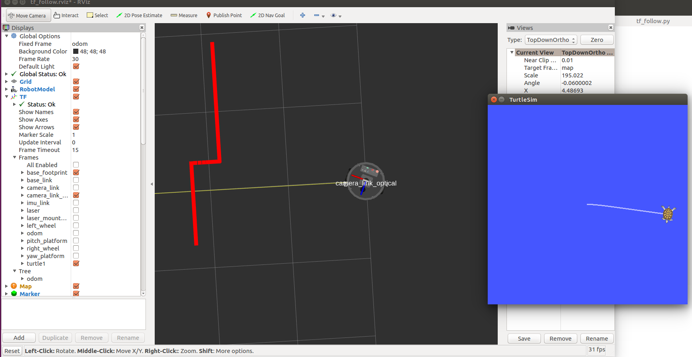

## 1. 坐标系的矩阵表示

坐标系大家不陌生，例如卫星发射要指定的位置坐标，日常生活中使用的导航，也是坐标的应用。对于机器人中的坐标主要是图中的这种三维直角坐标系，我们要定位一个位置，例如当前这个图标的位置，只需要知道它的坐标值就可以了，准确的定量描述，才能让机器人准确的到达位置。当有四个人分散在一个区域里，如果将这四个人的位置在同一个坐标系下定位，每个人只需要具体的一组坐标数值就够，系统需要不断地发送信号探测他们的位置，如果这四个人的相对距离不变，只是发生角度变化，就像太阳系的行星，那么通过转角就可以进行定位，在一个机器人系统中多是这种情况。

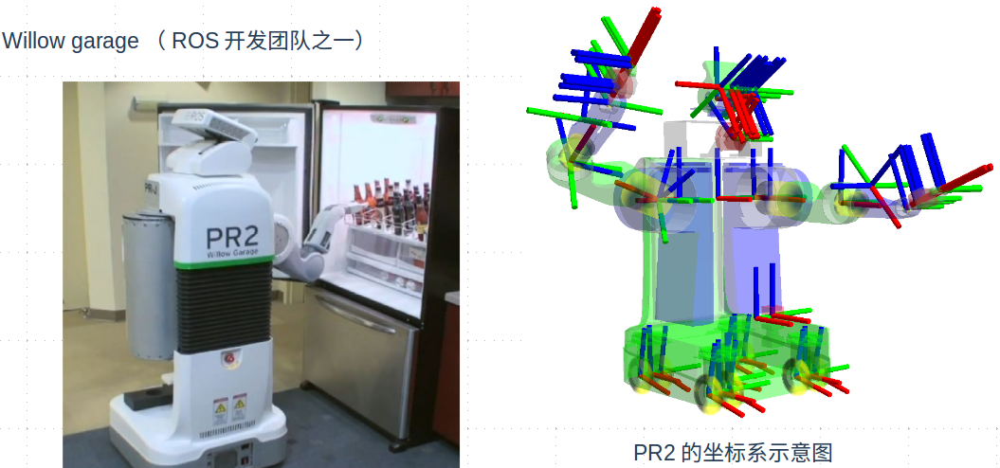

左图是PR2机器人，它正在从冰箱里取出一瓶饮料，对于人这是很容易的事，但是对于机器人而言，这是一个很复杂的过程。首先，机器人需要知道自己在哪儿，有没有到冰箱前，然后需要判断饮料在哪里，该拿哪瓶。右图是PR2的三维模型，可以看到很多的坐标系，每个关节都会连接到上面的坐标系。这个坐标系是跟随着所在的部件运动的。我们称每个部件是一个`link`。为什么需要这么多的坐标系，原因在于连接的每个固定点，它的位置容易得到。我们只需要知道这个部件的转动角度，固定点距离坐标的距离，就能用矩阵说出一个点的位置。但是对于这个部件连接的另一个旋转的部件，就需要再次考虑旋转件的角度，距离。

**欧拉角（euler angle）**

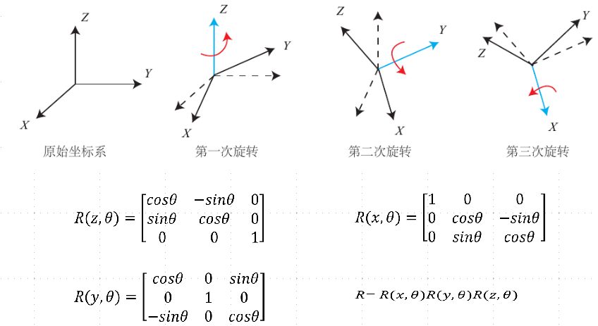

欧拉角是描述坐标系旋转的一种方式，最左边这张图代表着原始坐标系，当坐标系只绕Z轴旋转，可以形成一个新的坐标系。对于这个坐标系和它的父坐标系（父坐标系这里就指原始坐标系），他们之间的变化，对应的数学表达就是R(z,theta)，可以看到Z轴代表的第三列，是没有发生变化的，只是x, y 轴代表的坐标跟随转动的角度发生了变化。如果以第一次旋转为基准，再次仅围绕Y轴旋转一个角度，就会得到R(y,theta)，第三次也是一样的过程。这里有一点要注意，R(y,theta)的起始是第一次旋转的基础，而不是在原来的坐标系。通过这样一个过程，可以将任意的一个旋转角度，变换成三个的仅围绕一个坐标轴旋转，这就是欧拉角的好处。当完成三次旋转后，原始坐标系和第三次旋转的关系就可以通过三个旋转矩阵的左乘得到。

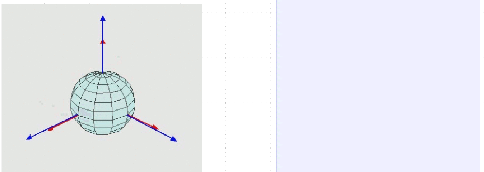

欧拉角也存在着缺陷，人们发现了欧拉角的一个万向节锁死问题。就像视频演示的这样，时间限制，这里不做太多的数学引入和解释，需要知道的是欧拉角在表示旋转使可能会出现不可控的情况，导致这种现象的原因，在数学上来看就是角度和实际情况的非一一对应性，即一种旋转可能对应的不只一个欧拉角，而一个欧拉角也没有准确的对应着同一种情况。所以ROS中引入了更为复杂的旋转表示方式，即下面的四元数。

**四元数（quaternion)**

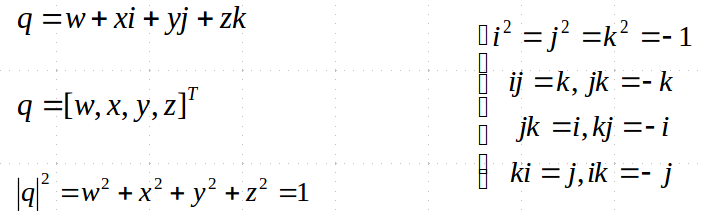

四元数的定义牵扯到了虚数因子，这个公式中的i, j, k 都是不能和实数直接计算的，这也正好维持了x, y, z的数值。四元数也表示旋转，可以从数学表达上看出，它的表示方法2欧拉角多了一个参数，复杂度更高。四元数的表示与欧拉角相同，区别在于他的方式是一步到位，欧拉角通过三次只针对一个坐标轴的旋转，可以旋转成目标的样子。四元数将初始的状态和最后的状态间引入一个旋转轴，即三个虚数因子的系数（x, y, z)所表示的向量，绕着这个轴，旋转θ角即实数w所表示的值，就可以使初始的状态旋转到末了的状态。

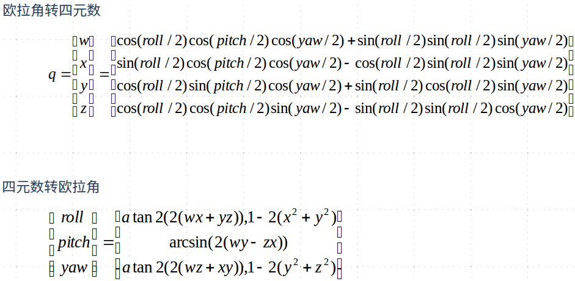

**欧拉角和四元数的转换关系**

这里是从欧拉角向四元数转换的数学方法，这些ROS tf提供了相关函数，大家不必深究计算过程。

**刚体的位姿表示**

![3.1.`，`(src/im`a`ges/3.1`.`10.png)`

`刚体的位置`建立器人中件的位置也在不停的变化，相应坐标也会随着改变，根据向量可以表示平移，欧拉角和四元数表示旋转，就可以表示坐标系的平移和旋转，也就是位置和姿态。坐标系改变的过程如下图所示。

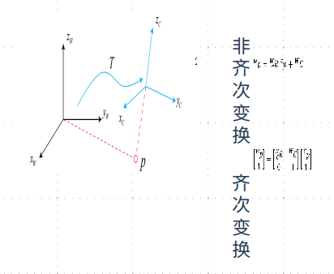

## 2. TF和坐标系

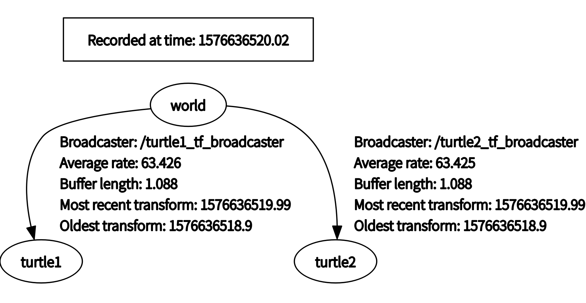

上图是一个TF tree，是实例中的tf_tree ，可以到有三个坐标系统`world` ，`turtle1`，`turtle2`。`turtle1`和`turtle2`通过`world`建立了联系。

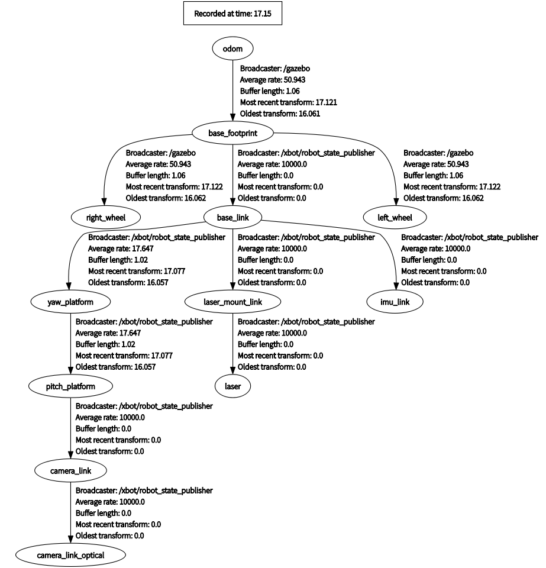

实际上大多的tf_tree会更为复杂。上图是XBot的tf_tree，图中的每一个圆圈代表一个frame，对应着机器人上的一个link，任意两个frame之间都必须是连通的，如果有一个环节出现断裂，就会引发系统报错，所以完整的tf tree不能有任何的断层的地方，这样我们才能查清楚任意两个frame之间的关系，从圆圈间连线的箭头方向可以看到两个frame间会有一个broadcaster，这是为了使得两个frame能够连通，会有一个node broadcaster两个frame间的相对运动信息。可以看到两个frame之间的消息node和broadcaster，这些都是在发布tf消息。

TF的消息格式是`TransformStamped.msg`

```bash
rosmsg show geometry_msgs/TransformStamped
```

```
std_msgs/Header	header
uint32	seq
time	stamp
string	frame_id
string	child_frame_id
geometry_msgs/Transform	transform
geometry_msgs/Vector3	translation
float64	x
float64	y
float64	z
geometry_msgs/Quaternion	rotation
float64	x
float64	y
flaot64	z
float64	w
```

首先header定义了序号、时间以及frame的名称，接着还写了child_frame，这两个frame之间要做那种变换就是由geometry_msgs/Transform来定义，Vector3三维向量表示平移，Quaternion四元数表示旋转。


TF tree中的两个frame之间的消息，就是由`geometry_msgs/TransformStamped`格式来定义的，`odom`就是frame_id，`baselink_footprint`就是child_frame_id。我们知道，一个topic上面可能会有多个node在向上发送消息。最终，许多的TransformStamped.msg发往tf，形成TF tree，这就是TF的消息格式。

1. tf broadcaster类

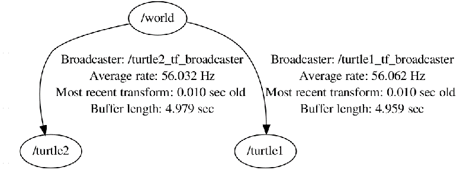
主要函数为：sendTransform() & sendTransformmessage()
功能：发布坐标转换

2. tf listener类函数

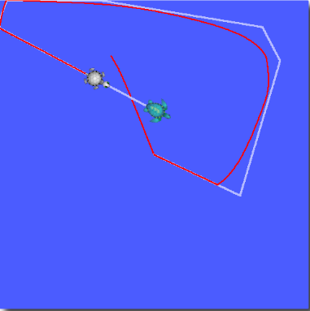

主要函数为：waitforTransform(), Lookuptransform()和canTransform()
功能：监听坐标系变换

3. tf工具

**view_frames**

功能：生成一个显示tf tree的pdf文件。

```bash
rosrun tf view_frames
```

查看生成的pdf文件

```bash
evince frames.pdf
```

**rqt_tf_tree**

功能：显示坐标树

```bash
rosrun rqt_tf_tree rqt_tf_tree
```

**tf_echo**

功能：任意两个坐标系间的转换关系

```bash
rosrun tf tf_echo turtle1 turtle2
```

**rviz**

功能：可视化坐标系

```bash
rosrun rviz rviz
```

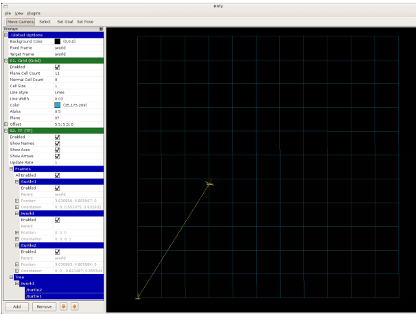

下面我们做个小结，TF是一套规范，也就是标准，这套标准就定义了数据格式和转换。本质上就是前面提到过的树状结构`tf_tree`。TF也可以理解为package，其中包含了很多的工具。它也是一套接口，提供了roscpp和rospy的API。总结起来TF是坐标转换的一套标准，也是话题topic，还是可以查看消息和坐标系关系的工具，也可以是和其他编程语言的接口工具。

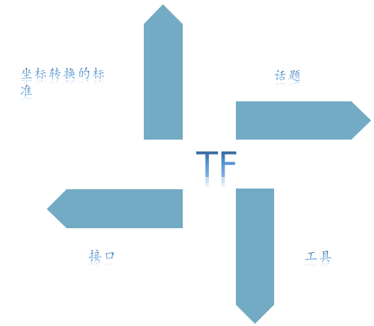

## 3. TF in ROSPY

**TF相关数据类型**

向量、点、四元数、矩阵都表示成类似数组形式，可以使用Tuple，List，Numpy Array。

例如
t = (1.0, 1.5, 0)                 #平移
q = [1, 0, 0, 0]                  #四元数
m = numpy.identity(3)  #旋转矩阵

第一个平移数据使用Tuple表示的，同时也可以用List表示成t=[1.0, 1.5, 0]，也能用numpy.array(1.0, 1.5, 0)来表示。这些数据类型没有特殊对应，全部通用，所以减少了数据间的类型转换。

TF在python中的用法相对于C++而言就简单很多。Python中的数据类型通用，所以不必担心数据的类型转换。ROSPY中有一个tf的库，在用的时候，需要先`import tf`，其中有一个transformations，提供了基本的数学运算函数，会使数学运算非常方便。

tf.transformations

基本数学运算函数

| 函数                                           | 描述           |
| ---------------------------------------------- | -------------- |
| euler_matrix(ai, aj, ak, axes=‘sxyz’)          | 欧拉角到矩阵   |
| euler_from_matrix(matrix, axes=‘sxyz’)         | 矩阵到欧拉角   |
| euler_from_quaternion(quaternion, axes=‘sxyz’) | 四元数到欧拉角 |
| quaternion_from_euler(ai, aj, ak, axes=‘sxyz’) | 欧拉角到四元数 |
| quaternion_matrix(quaternion)                  | 四元数到矩阵   |
| quaternion_from_matrix(matrix)                 | 矩阵到四元数   |

tf.TransformListener类

| 函数                                                         | 描述                                 |
| ------------------------------------------------------------ | ------------------------------------ |
| canTransform(self, target_frame, source_frame, time)         | frame是否相通                        |
| waitForTransform(self, target_frame, source_frame, time, timeout) | 阻塞直到frame相通                    |
| lookupTransform(self, target_frame, source_frame, time)      | 查看相对的tf,返回(trans, quat)       |
| chain(target_frame, target_time, source_frame, source_time, fixed_frame) | frame的连接关系                      |
| frameExists(self, frame_id)                                  | frame是否存在                        |
| getFrameStrings(self)                                        | 返回所有tf的名称                     |
| fromTranslationRotation(translation, rotation)               | 根据平移和旋转返回4x4矩阵            |
| transformPoint(target_frame, point_msg)                      | 将PointStamped消息转换到新frame 下   |
| transformPose(target_frame, pose_msg)                        | 将PoseStamped消息转换到新frame 下    |
| transformQuaternion(target_frame, quat_msg)                  | #将QuaternionStamped…  #返回相同类型 |


tf.TransformListener类中主要的三个函数，一个是`cantransform`，查看是否两个坐标系相通；第二个是`waitfortransform`，阻塞等待直至两个frame相通；`Lookuptransform`是查看两个frame间的transform，这里的time一般填`rospy.time(0)`，而不是`rospy.time.now()`，这是因为坐标传输也是有延时的，要查看的应该是最近的状态，而不是完全同步的状态。

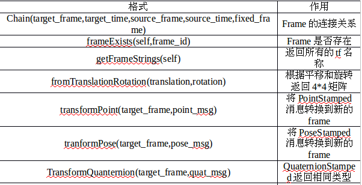

 **View frame**

作用：订阅5秒topic的信息，根据这段时间的信息，生成一个tf tree的pdf图

用法：`rosrun tf view_frames`

 **rqt_tf_tree**

作用：查看当前的tf tree，动态的查询tf tree，当前的变化都可以看到

用法：`rosrun rqt_tf_tree rqt_tf_tree`

 **tf_echo**

作用：查看两个frame间的变换关系

用法：`rosrun tf tf_echo [reference_frame][target_frame]`

**Rviz**

作用：使坐标系在三维空间可视化

用法：详见第三章，Rviz不是专门的tf工具，用法也不局限于此。

除了上页提到的主要的三个函数，listener类还包括很多的辅助函数，可参考http://docs.ros.org/api/tf/html/python/tf_python.html

**Broadcaster类**

第二个比较重要的类就是`tf.transformbroadcaster`类。

函数`sendtransform`的功能是发布从child frame到parent frame的转换到topic `tf`。它的参数包括平移、旋转、转换时间、child frame和parent frame。还有一个函数是`transformmessage`，把child frame和parent frame的转换信息发送到`tf`。

## 4. 练习1

1. 实例演示

安装相关Package

```bash
sudo apt-get install ros-kinetic-ros-tutorials ros-kinetic-geometry-tutorials ros-kinetic-rviz ros-kinetic-rosbash ros-kinetic-rqt-tf-tree
```

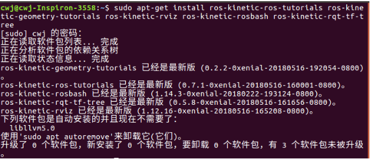

打开一个终端，运行

```bash
roslaunch turtle_tf turtle_tf_demo.launch
```

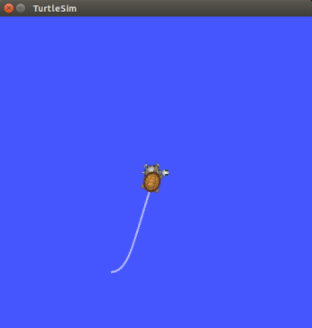

生成tf_tree pdf文件

```bash
rosrun tf view_frames
```

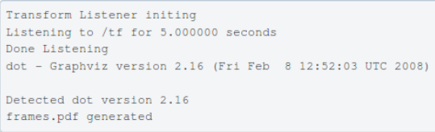

查看pdf文件

```bash
evince frames.pdf
```

使用` rqt_tf_tree `查看tf_tree

```bash
rosrun rqt_tf_tree rqt_tf_tree 
```

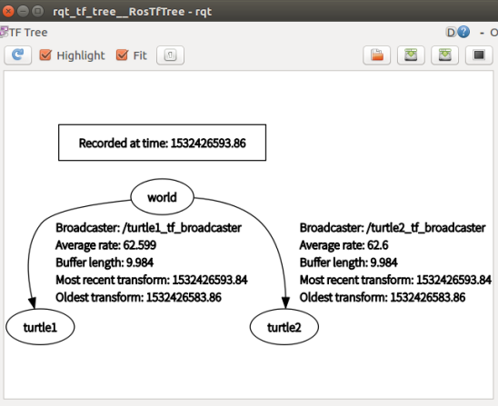

**tf_echo**

格式`rosrun tf tf_echo [reference_frame] [target_frame]`

例如`rosrun tf tf_echo turtle1 turtle2`

**rviz**

```bash
rosrun rviz rviz -d `rospack find turtle_tf`/rviz/turtle_rviz.rviz
```

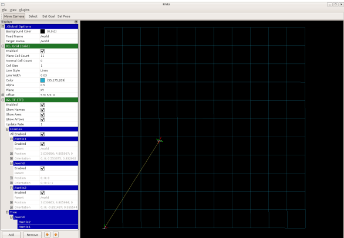

**tf中常用的坐标转换**

建立一个package，在该路径下创建一个script的文件夹，新建一个名为py_coordinate_translation.py的文件。

**tf.transformations.random_quaternion(rand=None)**
功能：返回一个均匀随机的四元数
例子如下，运行，观察返回值。

```python
#!/usr/bin/env python
# coding:utf-8

import rospy
import tf

if __name__ == '__main__':
    q=tf.transformations.random_quaternion(rand=None)
    print '定义均匀随机四元数：'
    print q
```

**tf.transformations.random_rotation_matrix(rand=None)**
功能：返回一个均匀随机单位旋转矩阵
例子如下，运行，观察返回值。

```python
#!/usr/bin/env python
# coding:utf-8

import rospy
import tf

if __name__ == '__main__':
    m=tf.transformations.random_rotation_matrix(rand=None)
    print '定义均匀随机单位旋转矩阵：'
    print m
```

| 序号 | 函数名称                                                     | 功能                               |
| ---- | ------------------------------------------------------------ | ---------------------------------- |
| 1    | tf.transformation.random_vector(size)                        | 返回均匀随机单位向量               |
| 2    | tf.transformations.translation_matrix(v)                     | 根据向量求旋转矩阵                 |
| 3    | tf.transformations.translation_from_matrix(m)                | 通过旋转矩阵求平移向量             |
| 4    | tf.transformation.quaternion_about_axis(angle axis)          | 通过旋转轴和旋转角返回四元数       |
| 5    | tf.transformations.quaternion_conjugate(quaternion)          | 返回四元数的共轭                   |
| 6    | tf.transformations.quaternion_from_euler(ai,aj,ak,axes'ryxz') | 从欧拉角和旋转轴求四元数           |
| 7    | tf.transformations.quaternion_from_matrix(matrix)            | 从旋转矩阵返回四元数               |
| 8    | tf.transformation.quaternion_multiply(quaternion1,quaternion2) | 两个四元数相乘                     |
| 9    | tf.transformations.euler_matrix(ai,aj,ak,axes='xyz')         | 由欧拉角和旋转轴返回旋转矩阵       |
| 10   | tf.transformations.euler_from_matrix(matrix)                 | 由旋转矩阵和特定的旋转轴返回欧拉角 |
| 11   | tf.transformation.euler_from_quaternion(quaternion)          | 由四元数和特定的轴得到欧拉角       |

**建立一个broadcaster**

1. 对于broadcaster类函数的回顾

```python
sendTransform(translation,rotation,time,child,parent)
```
作用：传递详细的frame流

```python
sendTransformmessage(transform)
```
作用：将平移旋转这些信息封装好的message发送到/tf
两者之间形式不同，功能一致。

**步骤**

1. 创建py_tf_broadcaster.py，例如在package test1中的src文件夹下。

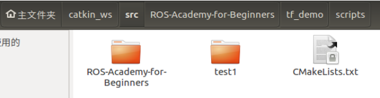

2. 输入所需要的库函数`import tf`等
   输入`br=tf.TransformBroadcaster()`，创建一个名为br的broadcaster对象

```python
#!/usr/bin/env python  
# -*- coding:utf-8 -*-  

import rospy  
import math  
import tf   
  
if __name__ == '__main__':  
    rospy.init_node('py_tf_broadcaster')
    br = tf.TransformBroadcaster()
```

3、 设置一个向量和欧拉角

```python
	x=1.0 
    y=2.0
    z=3.0  
    roll=0 
    pitch=0
    yaw=1.57 
```

4. 设置频率和循环

```python
    rate = rospy.Rate(1)
    while not rospy.is_shutdown(): 
        yaw=yaw+0.1   
        br.sendTransform((x,y,z),  
                     tf.transformations.quaternion_from_euler(roll,pitch,yaw),  
                     rospy.Time.now(),  
                     "base_link",  
                     "link1")  #发布base_link到link1的平移和翻转   
        rate.sleep()  
```

源码

```python
#!/usr/bin/env python  
# -*- coding:utf-8 -*-  

import rospy  
import math  
import tf   
  
if __name__ == '__main__':  
    rospy.init_node('py_tf_broadcaster')
    print '讲解tf.transformBroadcaster类'
    print '第1种发布方式：sendTransform(translation,rotation,time,child,parent)'
#第一部分，发布sendTransform(translation,rotation,time,child,parent)
    br = tf.TransformBroadcaster()
#输入相对原点的值和欧拉角
    x=1.0 
    y=2.0
    z=3.0  
    roll=0 
    pitch=0
    yaw=1.57 
    rate = rospy.Rate(1)
    while not rospy.is_shutdown(): 
        yaw=yaw+0.1   
        br.sendTransform((x,y,z),  
                     tf.transformations.quaternion_from_euler(roll,pitch,yaw),  
                     rospy.Time.now(),  
                     "base_link",  
                     "link1")  #发布base_link到link1的平移和翻转   
        rate.sleep()  
```

校验结果：通过node和topic来检验broadcaster

在终端输入

```bash
roscore
```
打开新的终端，输入

```bash
rosrun tf_demo py_tf_broadcaster.py
```

打开新的终端，输入`rostopic list`查看topic列表，其中的`/tf`就是发布的topic。

```bash
rostopic info /tf
```

结果

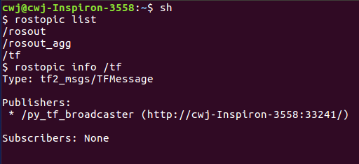

**创建broadcaster**

1. 创建Package 

```bash
cd ~/catkin_ws/src
catkin_create_pkg learning_tf tf rospy
#创建一个package
cd ~/catkin_ws
catkin_make
source ./devel/setup.bash
```

2. 建立broadcaster，turtle_tf_broadcaster.py

```python
#!/usr/bin/env python  

import rospy
import tf
import turtlesim.msg

def handle_turtle_pose(msg, turtlename):
    br = tf.TransformBroadcaster()
    br.sendTransform((msg.x, msg.y, 0),
                     tf.transformations.quaternion_from_euler(0, 0, msg.theta),
                     rospy.Time.now(),
                     turtlename,
                     "world")
if __name__ == '__main__':
    rospy.init_node('turtle_tf_broadcaster')
    turtlename = rospy.get_param('~turtle') #
    rospy.Subscriber('/%s/pose' % turtlename, #
                     turtlesim.msg.Pose,
                     handle_turtle_pose,
                     turtlename)
    rospy.spin()
```

3. 添加可执行权限

```bash
chmod u+x nodes/turtle_tf_broadcaster.py
```

4. 创建launch文件start_demo.launch

```xml
<launch>
    <!-- Turtlesim Node-->
    <node pkg="turtlesim" type="turtlesim_node" name="sim"/>
    <node pkg="turtlesim" type="turtle_teleop_key" name="teleop" output="screen"/>
    <node name="turtle1_tf_broadcaster" pkg="learning_tf" type="turtle_tf_broadcaster.py" respawn="false" output="screen" >
        <param name="turtle" type="string" value="turtle1" />
    </node>
    <node name="turtle2_tf_broadcaster" pkg="learning_tf" type="turtle_tf_broadcaster.py" respawn="false" output="screen" >
        <param name="turtle" type="string" value="turtle2" />
    </node>
</launch>
```

5. 运行start_demo.launch

```bash
roslaunch learning_tf start_demo.launch
```

6. 使用`tf_echo`检查结果

```bash
rosrun tf tf_echo /world /turtle1
```

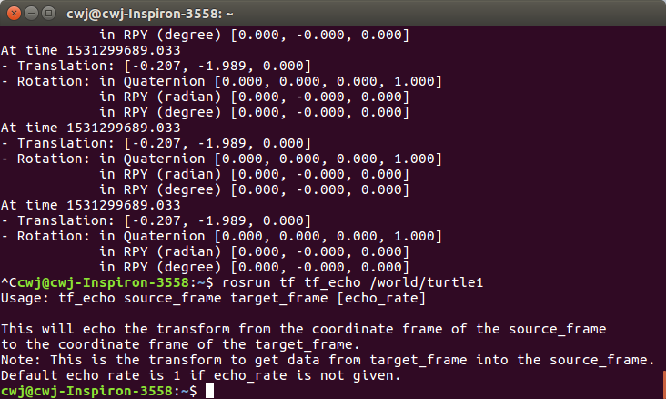

## 5. 练习2

在练习1中，我们创建了一个`tf_broadcaster`去发布turtle的位置信息到`tf`，现在我们要创建一个`tf listener`。

这个listener的程序做了3件事
1. 放 turtle2乌龟到仿真中，用`turtlesim/Spawn`服务；
2. 用`tf.TransformListener`类下的`lookupTransform`方法，查询turtle2 相对于 turtle1 的位置；
3. 用查到的相对位置来发布速度和角速度信息，引导 turtle2 运动。

我们先从构建一个简单的tf listener开始，然后深入的构建listener，最后新建一个frame。

编写turtle_tf_listener.py

```python
#!/usr/bin/env python  
import rospy
import math
import tf
import geometry_msgs.msg
import turtlesim.srv

if __name__ == '__main__':
    rospy.init_node('turtle_tf_listener')

    listener = tf.TransformListener()
    
    rospy.wait_for_service('spawn')
    spawner = rospy.ServiceProxy('spawn', turtlesim.srv.Spawn)
    spawner(4, 2, 0, 'turtle2')
    
    turtle_vel = rospy.Publisher('turtle2/cmd_vel', geometry_msgs.msg.Twist,queue_size=1)
    
    rate = rospy.Rate(10.0)
    while not rospy.is_shutdown():
        try:
            (trans,rot) = listener.lookupTransform('/turtle2', '/turtle1', rospy.Time(0))
        except (tf.LookupException, tf.ConnectivityException, tf.ExtrapolationException):
            continue
    
        angular = 4 * math.atan2(trans[1], trans[0])
        linear = 0.5 * math.sqrt(trans[0] ** 2 + trans[1] ** 2)
        cmd = geometry_msgs.msg.Twist()
        cmd.linear.x = linear
        cmd.angular.z = angular
        turtle_vel.publish(cmd)
    
        rate.sleep()
```

listener类函数主要包括三个函数`waitForTransform()`，`LookupTransform()`，`canTransform()`。 功能分别是阻塞直到转换关系可获得；查询坐标系间的转换关系；判断两个frame是否相通。

首先学习tf listener的创建，首先回顾一下提到的listener类函数

1. 创建tf_listener.py，引入`tf`

```python
#!/usr/bin/env python  
# -*- coding:utf-8 -*-  

import rospy  
import math  
import tf   
```

2. 注册初始化节点

```python
if __name__ == '__main__':  
    rospy.init_node('py_tf_turtle')
```

3. 创建listener类的对象并设置频率

target_frame是目标坐标系，source_frame源坐标系，time转换时间， timeout等待时间。
polling_sleep_duration=None

```python
    listener = tf.TransformListener() #TransformListener创建后就开始接受tf广播信息，最多可以缓存10s  目前存在的问题，是四个数值的顺序我还有点问题
    rate = rospy.Rate(1.0)  
    #1. 阻塞直到frame相通
    print '1. 阻塞直到frame相通'  
    listener.waitForTransform("/base_link", "/link1", rospy.Time(), rospy.Duration(4.0))
```

3. 构建循环结构不断地查询两个坐标系变换

target_frame，source_frame，time指的是目标坐标系，源坐标系和时间。

```python
    while not rospy.is_shutdown():  
        try:  
       #2. 监听对应的tf,返回平移和旋转
            print '2. 监听对应的tf,返回平移和旋转'  
            (trans,rot) = listener.lookupTransform('/base_link', '/link1', rospy.Time(0)) #rospy.Time(0)不表示0时刻的tf，而是指最近一帧tf 
        except (tf.LookupException, tf.ConnectivityException, tf.ExtrapolationException):  
            continue   
```

4. 判断两个frame是否相通，这里使用canTransform函数

```python
        rospy.loginfo('距离原点的位置: x=%f ,y= %f，z=%f \n 旋转四元数: w=%f ,x= %f，y=%f z=%f ',trans[0],trans[1],trans[2],rot[0],rot[1],rot[2],rot[3])
        #3. 判断两个frame是否相通
        print '3. 判断两个frame是否相通'
        if listener.canTransform('/link1','/base_link',rospy.Time(0)) :
            print 'true'
        else :
            print 'false'
        rate.sleep()  
```

完整源码（tf_listener.py）

```python
#!/usr/bin/env python  
# -*- coding:utf-8 -*-  

import rospy  
import math  
import tf   
  
if __name__ == '__main__':  
    rospy.init_node('py_tf_turtle')
    listener = tf.TransformListener() #TransformListener创建后就开始接受tf广播信息，最多可以缓存10s  目前存在的问题，是四个数值的顺序我还有点问题
    rate = rospy.Rate(1.0)  
    #1. 阻塞直到frame相通
    print '1. 阻塞直到frame相通'  
    listener.waitForTransform("/base_link", "/link1", rospy.Time(), rospy.Duration(4.0))
    while not rospy.is_shutdown():  
        try:  
       #2. 监听对应的tf,返回平移和旋转
            print '2. 监听对应的tf,返回平移和旋转'  
            (trans,rot) = listener.lookupTransform('/base_link', '/link1', rospy.Time(0)) #rospy.Time(0)不表示0时刻的tf，而是指最近一帧tf 
        except (tf.LookupException, tf.ConnectivityException, tf.ExtrapolationException):  
            continue  
        
        rospy.loginfo('距离原点的位置: x=%f ,y= %f，z=%f \n 旋转四元数: w=%f ,x= %f，y=%f z=%f ',trans[0],trans[1],trans[2],rot[0],rot[1],rot[2],rot[3])
        #3. 判断两个frame是否相通
        print '3. 判断两个frame是否相通'
        if listener.canTransform('/link1','/base_link',rospy.Time(0)) :
            print 'true'
        else :
            print 'false'
        rate.sleep()  
```

1. 编写turtle_tf_listener.py

```python
#!/usr/bin/env python  
# -*- coding:utf-8 -*-   

import rospy
import math
import tf
import geometry_msgs.msg
import turtlesim.srv
```

引入`tf`库，`tf.TransformListener`以简化接受坐标转换。

```python
if __name__ == '__main__':
    rospy.init_node('turtle_tf_listener')

    listener = tf.TransformListener()

    rospy.wait_for_service('spawn')
    spawner = rospy.ServiceProxy('spawn', turtlesim.srv.Spawn)
    spawner(4, 2, 0, 'turtle2')
```

`listener = tf.TransformListener()`，创建的一个`tf.TransformListener`对象，它接收坐标转换，并缓存这些转换10秒钟。

```python
    turtle_vel = rospy.Publisher('turtle2/cmd_vel', geometry_msgs.msg.Twist,queue_size=1)

    rate = rospy.Rate(10.0)
    while not rospy.is_shutdown():
        try:
            (trans,rot) = listener.lookupTransform('/turtle2', '/turtle1', rospy.Time(0))
        except (tf.LookupException, tf.ConnectivityException, tf.ExtrapolationException):
            continue
```

`while`循环中间部分是核心工作，通过`lookupTransform`查询listener的转换，有三个参数，从哪个frame转换到哪个frame，还有起始时间，这里表示从最近的可获得时间开始。

```python
        angular = 4 * math.atan2(trans[1], trans[0])
        linear = 0.5 * math.sqrt(trans[0] ** 2 + trans[1] ** 2)
        cmd = geometry_msgs.msg.Twist()
        cmd.linear.x = linear
        cmd.angular.z = angular
        turtle_vel.publish(cmd)

        rate.sleep()
```

完整源码

```python
#!/usr/bin/env python  
import roslib
roslib.load_manifest('learning_tf')
import rospy
import math
import tf
import geometry_msgs.msg
import turtlesim.srv

if __name__ == '__main__':
    rospy.init_node('turtle_tf_listener')

    listener = tf.TransformListener()

    rospy.wait_for_service('spawn')
    spawner = rospy.ServiceProxy('spawn', turtlesim.srv.Spawn)
    spawner(4, 2, 0, 'turtle2')

    turtle_vel = rospy.Publisher('turtle2/cmd_vel', geometry_msgs.msg.Twist,queue_size=1)

    rate = rospy.Rate(10.0)
    while not rospy.is_shutdown():
        try:
            (trans,rot) = listener.lookupTransform('/turtle2', '/turtle1', rospy.Time(0))
        except (tf.LookupException, tf.ConnectivityException, tf.ExtrapolationException):
            continue

        angular = 4 * math.atan2(trans[1], trans[0])
        linear = 0.5 * math.sqrt(trans[0] ** 2 + trans[1] ** 2)
        cmd = geometry_msgs.msg.Twist()
        cmd.linear.x = linear
        cmd.angular.z = angular
        turtle_vel.publish(cmd)

        rate.sleep()
```

turtle_tf_listener.py 添加可执行权限

```bash
chmod u+x turtle_tf_listener.py
```

编写launch文件start_demo.launch

```xml
<launch>
    ... #这里是前面broadcaster的launch内容
    <node pkg="learning_tf" type="turtle_tf_listener.py" 
          name="listener" />
</launch>
```

运行 

```bash
roslaunch learning_tf start_demo.launch
```

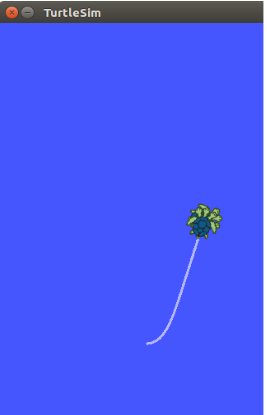

如果出现下面的报错信息：

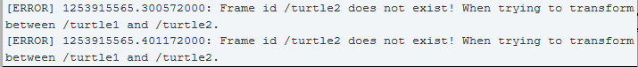

是因为listener在尝试计算turtle2还未接收到的转换信息，因为这个转换需要些许的时间并开始广播坐标系。

**增加一个坐标系**

1. 添加frame的必要性
PR2的坐标系不止三个，而在实际的情况中，坐标系的数量也远不止3个，比如工业的6自由度机械臂，至少需要7个frame，因此这节课的内容是十分必要的。

2. 添加frame的位置
tf形成和维护的是tf tree，即树形的坐标系结构，所以坐标系的整体呈现是一个从父到子的关系，或者说从1到多的关系，不允许出现封闭的坐标系结构，如环形。每一个坐标系只能有一个上层的父坐标系，而这个父坐标系可以有多个子坐标系。在实例中，一共有三个坐标系，其中world frame是父坐标系，而turtle1和turtle2是子坐标系。

任务说明：在现在的坐标树中添加一个carrot坐标系


在src文件夹下创建名为fixed_tf_broadcaster.py的文件

```python
#!/usr/bin/env python  
import roslib

import rospy
import tf

if __name__ == '__main__':
    rospy.init_node('fixed_tf_broadcaster')
    br = tf.TransformBroadcaster()
    rate = rospy.Rate(10.0)
    while not rospy.is_shutdown():
        br.sendTransform((0.0, 2.0, 0.0), (0.0, 0.0, 0.0, 1.0), rospy.Time.now(), "carrot1", "turtle1")
        rate.sleep()
```

创建tfbroadcaster的实例br，设定频率为10Hz，循环发布坐标变换，功能让carrot1距turtle1距离2米的处以每秒1弧度的速度旋转。

给fixed_tf_broadcaster.py添加可执行权限

```bash
chmod u+x fixed_tf_broadcaster.py
```

编写start_demo.launch

```xml
<launch>
    ...
    <node pkg="learning_tf" 	type="fixed_tf_broadcaster.py"
          name="broadcaster_fixed" />
</launch>
```

运行

```bash
roslaunch learning_tf start_demo.launch
```

打开turtle_tf_listener.py文件，将turtle1替换为carrot1，更改launch的执行顺序

turtle_tf_listener.py

```python
#!/usr/bin/env python  
import rospy
import math
import tf
import geometry_msgs.msg
import turtlesim.srv

if __name__ == '__main__':
    rospy.init_node('turtle_tf_listener')

    listener = tf.TransformListener()

    rospy.wait_for_service('spawn')
    spawner = rospy.ServiceProxy('spawn', turtlesim.srv.Spawn)
    spawner(4, 2, 0, 'turtle2')

    turtle_vel = rospy.Publisher('turtle2/cmd_vel', geometry_msgs.msg.Twist,queue_size=1)

    rate = rospy.Rate(10.0)
    while not rospy.is_shutdown():
        try:
            (trans,rot) = listener.lookupTransform('/turtle2', '/turtle1', rospy.Time(0))
        except (tf.LookupException, tf.ConnectivityException, tf.ExtrapolationException):
            continue

        angular = 4 * math.atan2(trans[1], trans[0])
        linear = 0.5 * math.sqrt(trans[0] ** 2 + trans[1] ** 2)
        cmd = geometry_msgs.msg.Twist()
        cmd.linear.x = linear
        cmd.angular.z = angular
        turtle_vel.publish(cmd)

        rate.sleep()
```

```python
            (trans,rot) = listener.lookupTransform('/turtle2', '/turtle1', rospy.Time(0))
```

改为

```python
            (trans,rot) = listener.lookupTransform('/turtle2', '/carrot1', rospy.Time(0))
```

运行start_demo.launch

```bash
roslaunch learning_tf start_demo.launch
```

注：这里需要注意，在运行前需要停止之前的运行文件，方法是使用Ctrl+C，在执行前停止以前的执行文件

运行结果

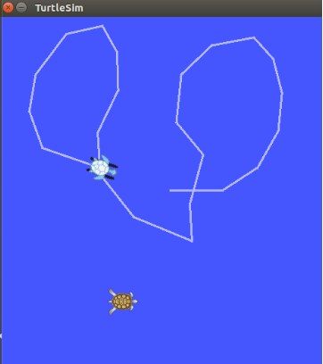

turtle2不再移动，也没有程序报错，说明listener关系还在，而不再跟随turtle1，这样侧面证明了carrot1建立。

运行结果

```bash
rosrun rviz rviz
```

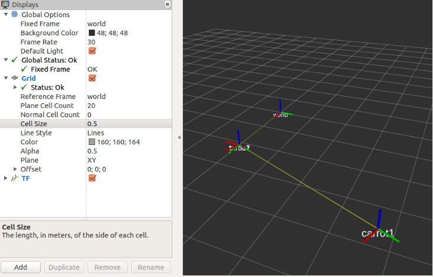

查看空间中的坐标转换

面我们提到的frame是一个固定的坐标系，相对于父坐标系不会随时间而改变。如果想要公布一个移动的坐标系，可以编写代码去使坐标系随时间而改变，我们尝试修改坐标系carrot1相对于turtle1随时间而改变。在nodes下创建一个名为dynamic_tf_broadcaster.py的文件，同时将下面代码复制到文件中。

dynamic_tf_broadcaster.py

```python
#!/usr/bin/env python  
import rospy
import tf
import math

if __name__ == '__main__':
    rospy.init_node('dynamic_tf_broadcaster')
    br = tf.TransformBroadcaster()
    rate = rospy.Rate(10.0)
    while not rospy.is_shutdown():
        t = rospy.Time.now().to_sec() * math.pi
        br.sendTransform((2.0 * math.sin(t), 2.0 * math.cos(t), 0.0),
                         (0.0, 0.0, 0.0, 1.0),
                         rospy.Time.now(),
                         "carrot1","turtle1")
        rate.sleep()
```

相对于固定于turtle1的偏移量，我们使用了关于当前时间的sin和cos函数来定义坐标系偏移量，这样就会随时间而改变。

给dynamic_tf_broadcaster.py添加可执行权限。

```bash
chmod u+x dynamic_tf_broadcaster.py`
```

修改launch文件，将launch文件指向新的文件即dynamic_tf_broadcaster，而不是原先的fixed_tf_turtle。

start_demo.launch

```xml
<launch>
    ...
    <node pkg="learning_tf" type="dynamic_tf_broadcaster.py" name="broadcaster_dynamic" />
</launch>
```

运行结果

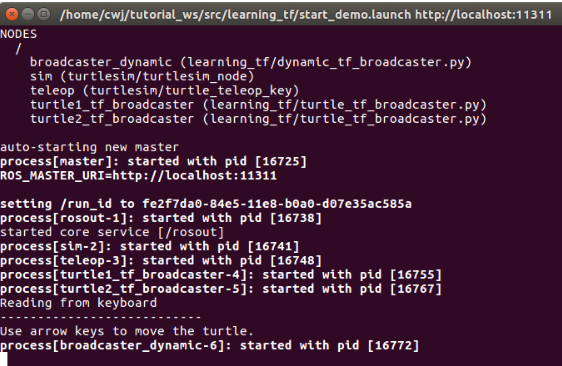

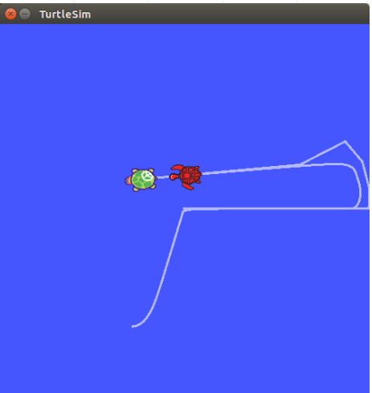

```bash
rosrun rviz rviz
```

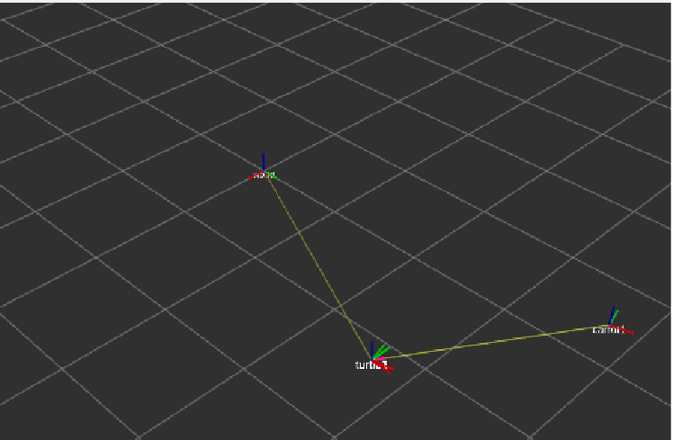

注：这里的carrot1一直在运动，就像钟表秒针一样。

运行start_demo.launch

```bash
roslaunch learning_tf start_demo.launch
```

使用命令tf_echo，查看坐标转换关系

```bash
rosrun tf tf_echo carrot1 turtle1
```

## 6. 练习3

tf可以维护坐标系树tf_tree间的关系。这个树会随着时间而改变，而且tf可以缓存一小段时间的转换关系（默认为最长10s）。使用`lookupTransform`函数，可以得到tf tree中最近的转换，不必知道什么时间这个转换被记录下来， 我们尝试寻求一种可以在特定时间点转换的方法。

演示和演练tf和time中的两个实例，明白如何设置`waitfortransform`的参数，从而得到特定时间点的转换，另一方面明白日常使用的时间函数，加深对常用函数和time(0)的理解。

**任务1. tf&time**

1. turtle_tf_listener.py

```python
#!/usr/bin/env python  

import rospy
import math
import tf
import geometry_msgs.msg
import turtlesim.srv

if __name__ == '__main__':
    rospy.init_node('turtle_tf_listener')

    listener = tf.TransformListener()

    rospy.wait_for_service('spawn')
    spawner = rospy.ServiceProxy('spawn', turtlesim.srv.Spawn)
    spawner(4, 2, 0, 'turtle2')

    turtle_vel = rospy.Publisher('turtle2/cmd_vel', geometry_msgs.msg.Twist,queue_size=1)

    rate = rospy.Rate(10.0)
    while not rospy.is_shutdown():
        try:
            (trans,rot) = listener.lookupTransform('/turtle2', '/turtle1', rospy.Time(0))
        except (tf.LookupException, tf.ConnectivityException, tf.ExtrapolationException):
            continue

        angular = 4 * math.atan2(trans[1], trans[0])
        linear = 0.5 * math.sqrt(trans[0] ** 2 + trans[1] ** 2)
        cmd = geometry_msgs.msg.Twist()
        cmd.linear.x = linear
        cmd.angular.z = angular
        turtle_vel.publish(cmd)

        rate.sleep()
```

其中

```python
        try:
            (trans,rot) = listener.lookupTransform('/turtle2', '/turtle1', rospy.Time(0))
        except (tf.LookupException, tf.ConnectivityException, tf.ExtrapolationException):
            continue
```

替换为

```
        try:
            (trans,rot) = listener.lookupTransform('/turtle2', '/carrot1', rospy.Time(0))
        except (tf.LookupException, tf.ConnectivityException, tf.ExtrapolationException):
            continue
```
Time(0)，含义是得到最近的坐标变换关系，也是最常用的方法。如果我们将这段代码替换成这样，会有什么样的结果呢？

运行结果

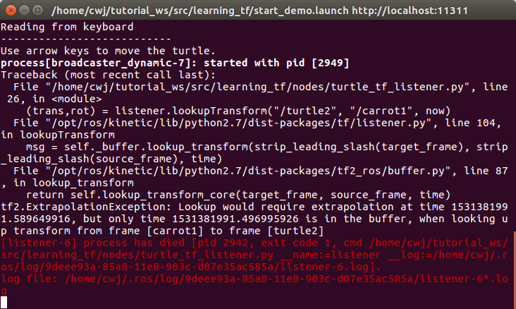

解释一下，目标坐标系的时间和`tf`传递过来的时间不一致，`tf`有0.0xx或者0.001s的延时，这个延时太大了，完全不是now（实时的）。原因是每个监听器（listener）都有一个缓存区，用来储存来自全部坐标系转换的tf 广播（broadcasters）。而broadcaster发布了转换，需要一小段时间才能由listener监听并放到缓存里，就像人听到发出的指令，需要想一下该怎么做，而listener是需要把这些信息放到缓存里，这一段时间通常是0.002s，所以做不到完全的“now”，需要等上这么几微秒。

2. waitForTransform

功能：等待，直到坐标系变换可以获得

```python
        try:
        	now = rospy.Time.now()
        	Listener.waitForTransform(“/turtle2”, “/carrot1”, rospy.Time(), rospy.Duration(4.0))
            (trans,rot) = listener.lookupTransform('/turtle2', '/carrot1', now)
        except (tf.Exception, tf.LookupException ):
            continue
```
这里要强调的四个注意的地方

1. 等待的是哪个坐标系
2. 向哪个坐标系转换
3. 开始的时间
4. 等待的时间：最长不会超过这个时间值

所以`waitransform()`的执行是这样一个过程，阻塞，等待着变换可以获得，或者超过设定的最大时长还没有获得变换。

运行结果

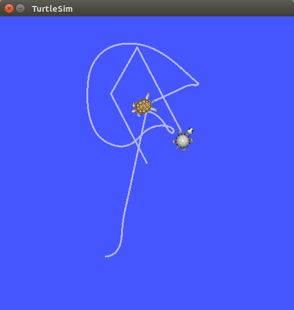

再次运行结果，会发现第二个乌龟将会接着跟随第一个乌龟，这两种情况之间没有明显的差异，是因为时间的差值非常小只有几微秒，而举出`time(0)`和`now()`也是为了区别tf缓存和时间延时之间的区别和联系，在实际的情况中，通常更多的使用Time(0)。

tf的时间迁移，修改文件中的代码为

```python
try:
​	now = rospy.Time.now() - rospy.Duration(5.0)
​	#此时的now已经是5s前的时间了，要注意这一点
​	listener.waitForTransform("/turtle2", "/turtle1", now, rospy.Duration(1.0))
​	 (trans, rot) = listener.lookupTransform("/turtle2","/turtle1", now)
except (tf.Exception, tf.LookupException, tf.ConnectivityException):
```

时间迁移步骤
1. 编辑turtle_tf_listener.py文件，替换对应的代码段落如下

```python
	try:
	        now = rospy.Time.now() - rospy.Duration(5.0)
 			# 此时的now已经是5s前的时间了，要注意这一点
            listener.waitForTransform("/turtle2", "/turtle1", now, rospy.Duration(1.0))
            (trans, rot) = listener.lookupTransform("/turtle2","/turtle1", now)
    except (tf.Exception, tf.LookupException, tf.ConnectivityException):
```

可以猜测乌龟可能的运动，在运行的前五秒，显然第二只turtle不知道去哪儿，因为不清楚第一只乌龟前五秒的历史位置，但是五秒钟后，turtle2该如何行动呢？

2. 运行launch文件

```bash
roslaunch learning_tf start_demo.launch
```
运行结果

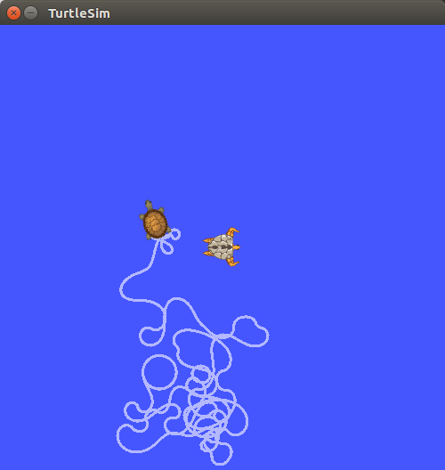

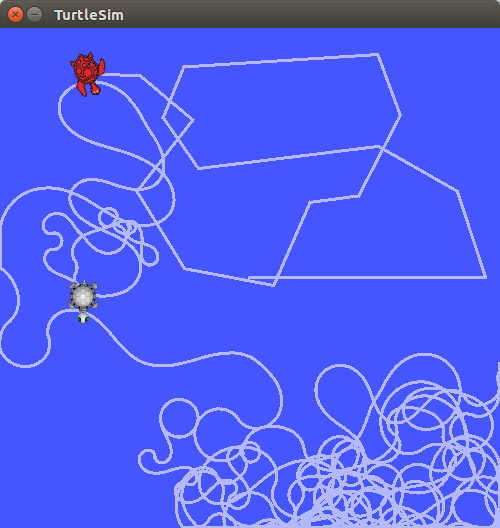

可以看到turtle2无法控制了，那么导致这个结果的原因是什么呢？实际上，我们让tf做的事是五秒前，记录turtle2相对于turtle1的位置，然后根据这个位置去控制现在的turtle2去追赶turtle1，可想而知，这个结果就变得无法预测了。我们想要达成的目标是让现在的turtle2去追赶5秒前的turtle1，需要的是现在的turtle2相对于5秒前的turtle1，那么这该如何实现呢？

修改文件中的代码为

```python
try:
           now = rospy.Time.now()
           past = now - rospy.Duration(5.0)
           listener.waitForTransformFull("/turtle2", now,"/turtle1", past,"/world", rospy.Duration(1.0))
           (trans, rot) = listener.lookupTransformFull("/turtle2", now, "/turtle1", past, "/world")
```

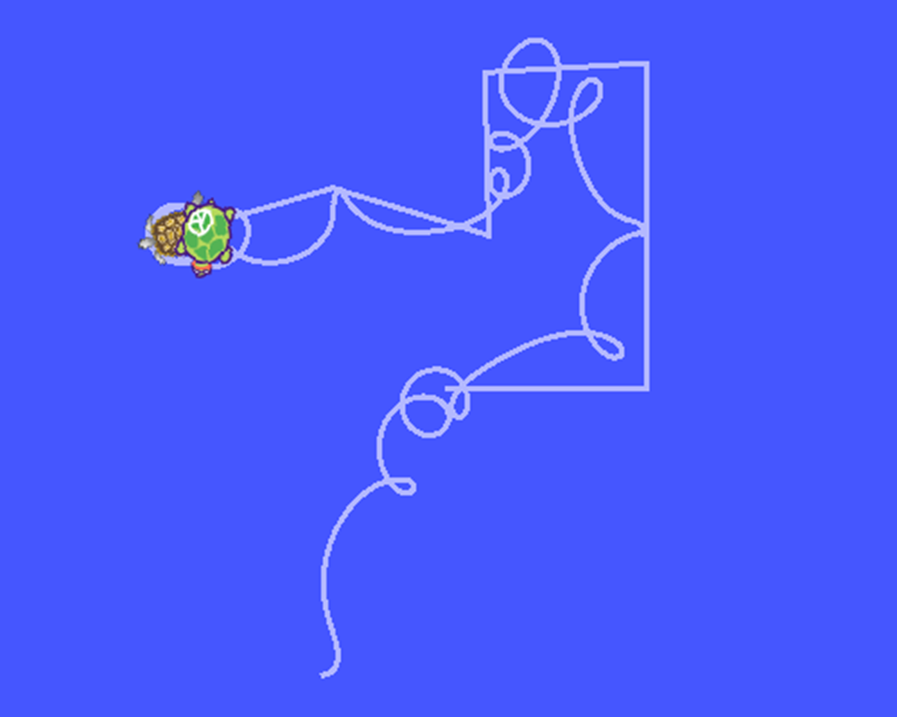

可以看到这里的参数多了now， past和world，命令的含义是给定的转换是从哪个坐标系（第一个frame位置），在哪个时间（第一个时间位置），到哪个坐标系（第二个frame位置），第二个坐标系的时间，制定的固定的坐标系（第三个frame位置）和储存结果的变量。


迁移原理

Turtle1在过去的5秒前将转换信息发送给world坐标系，到了5秒后的现在，由world frame向turtle2转换，着就实现了时间的迁移，从过去到现在，计算的结果是过去的turtle1和现在的turtle2的转换。

校验结果：再次运行代码，理解时间迁移

## 7. 练习4

在这个练习中我们学习tf broadcaster和listener代码，学会编写broadcaster和listener。

**1. Turtle1跟随Turtle2移动**

任务要求：让turtle1跟随turtle2移动

**创建learn_tf包**

打开终端，输入

```bash
cd ~/catkin_ws/src
catkin_create_pkg learning_tf tf rospy turtlesim
cd ..
catkin_make
```

编写turtle_tf_broadcaster.py

```python
#!/usr/bin/env python  

import rospy
import tf
import turtlesim.msg

def handle_turtle_pose(msg, turtlename):
    br = tf.TransformBroadcaster()
    br.sendTransform((msg.x, msg.y, 0),
                     tf.transformations.quaternion_from_euler(0, 0, msg.theta),
                     rospy.Time.now(),
                     turtlename,
                     "world")
if __name__ == '__main__':
    rospy.init_node('turtle_tf_broadcaster')
    turtlename = rospy.get_param('~turtle') #
    rospy.Subscriber('/%s/pose' % turtlename, #
                     turtlesim.msg.Pose,
                     handle_turtle_pose,
                     turtlename)
    rospy.spin()
```

给turtle_tf_broadcaster.py添加可执行权限

```bash
chmod u+x turtle_tf_broadcaster.py
```

编写fixed_tf_broadcaster.py

```python
#!/usr/bin/env python  

import rospy
import tf

if __name__ == '__main__':
    rospy.init_node('fixed_tf_broadcaster')
    br = tf.TransformBroadcaster()
    rate = rospy.Rate(10.0)
    while not rospy.is_shutdown():
        br.sendTransform((0.0, 2.0, 0.0),
                         (0.0, 0.0, 0.0, 1.0),
                         rospy.Time.now(),
                         "carrot1",
                         "turtle1")
        rate.sleep()
```

`sendTransform()`我们创建一个新的转换，从父“turtle1”到新的子“carrot1”。carrot1与turtle1的偏移为y方向2米。

给fixed_tf_broadcaster.py添加可执行权限。

```bash
chmod u+x fixed_tf_broadcaster.py
```

编写start_demo.launch

```xml
<launch>
    <!-- Turtlesim Node-->
    <node pkg="turtlesim" type="turtlesim_node" name="sim"/>
    <node pkg="turtlesim" type="turtle_teleop_key" name="teleop" output="screen"/>
    <node name="turtle1_tf_broadcaster" pkg="learning_tf" type="turtle_tf_broadcaster.py" respawn="false" output="screen" >
        <param name="turtle" type="string" value="turtle1" />
    </node>
    <node name="turtle2_tf_broadcaster" pkg="learning_tf" type="turtle_tf_broadcaster.py" respawn="false" output="screen" >
        <param name="turtle" type="string" value="turtle2" />
    </node>
    <node pkg="learning_tf" type="turtle_tf_listener.py" 
          name="listener" />
    <node pkg="learning_tf" type="fixed_tf_broadcaster.py"
          name="broadcaster_fixed" />
    <node pkg="learning_tf" type="dynamic_tf_broadcaster.py"
          name="broadcaster_dynamic" />
</launch>
```

运行start_demo.launch

```bash
roslaunch learning_tf start_demo.launch
```
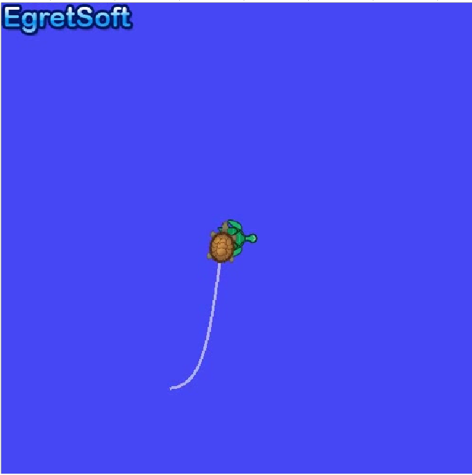

Fixed TF tree
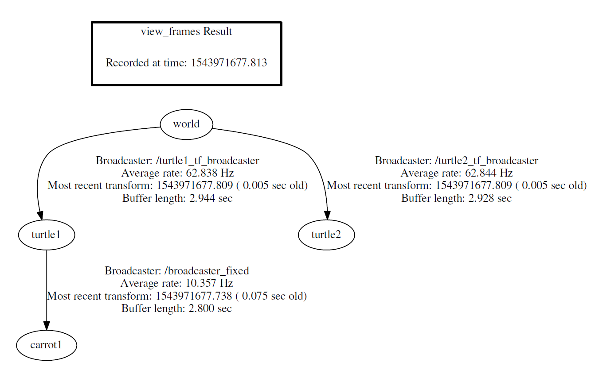

**2. turtle1以turtle2为圆心移动**

编写dynamic_tf_broadcaster.py

```python
#!/usr/bin/env python  

import rospy
import tf
import math

if __name__ == '__main__':
    rospy.init_node('dynamic_tf_broadcaster')
    br = tf.TransformBroadcaster()
    rate = rospy.Rate(10.0)
    while not rospy.is_shutdown():
        t = rospy.Time.now().to_sec() * math.pi
        br.sendTransform((2.0 * math.sin(t), 2.0 * math.cos(t), 0.0),
                         (0.0, 0.0, 0.0, 1.0),
                         rospy.Time.now(),
                         "carrot1","turtle1")
        rate.sleep()
```

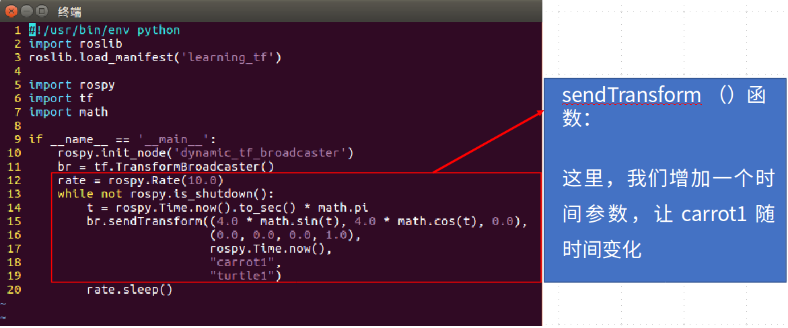

修改turtle_tf_listener.py

```
#!/usr/bin/env python  
import roslib
roslib.load_manifest('learning_tf')
import rospy
import math
import tf
import geometry_msgs.msg
import turtlesim.srv

if __name__ == '__main__':
    rospy.init_node('turtle_tf_listener')

    listener = tf.TransformListener()

    rospy.wait_for_service('spawn')
    spawner = rospy.ServiceProxy('spawn', turtlesim.srv.Spawn)
    spawner(4, 2, 0, 'turtle2')

    turtle_vel = rospy.Publisher('turtle2/cmd_vel', geometry_msgs.msg.Twist,queue_size=1)

    rate = rospy.Rate(10.0)
    while not rospy.is_shutdown():
        try:
            (trans,rot) = listener.lookupTransform('/turtle2', '/carrot1', rospy.Time(0))
        except (tf.LookupException, tf.ConnectivityException, tf.ExtrapolationException):
            continue

        angular = 4 * math.atan2(trans[1], trans[0])
        linear = 0.5 * math.sqrt(trans[0] ** 2 + trans[1] ** 2)
        cmd = geometry_msgs.msg.Twist()
        cmd.linear.x = linear
        cmd.angular.z = angular
        turtle_vel.publish(cmd)

        rate.sleep()
```

给dynamic_tf_broadcaster.py添加可执行权限

```bash
chmod u+x nodes/fixed_tf_broadcaster.py
```

在start_demo.launch中添加如下命令

```xml
  <node pkg="learning_tf" type="dynamic_tf_broadcaster.py" name="broadcaster_dynamic" />
```

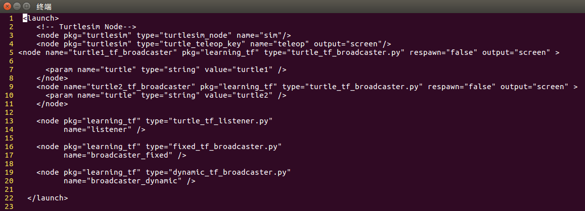

然后运行start_demo.launch

```bash
roslaunch learning_tf start_demo.launch
```
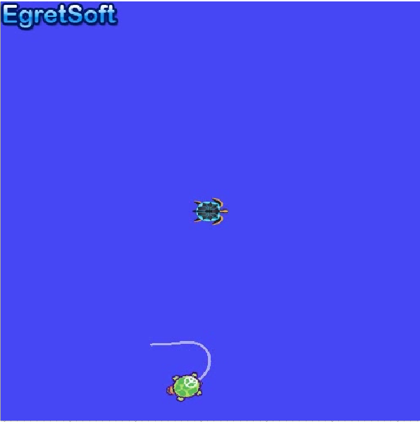

**3. turtle1以turtle2为中心椭圆移动**

修改dynamic_tf_broadcaster.py

dynamic_tf_broadcaster.py修改

```python
#!/usr/bin/env python  
import rospy
import tf
import math

if __name__ == '__main__':
    rospy.init_node('dynamic_tf_broadcaster')
    br = tf.TransformBroadcaster()
    rate = rospy.Rate(10.0)
    while not rospy.is_shutdown():
        t = rospy.Time.now().to_sec() * math.pi
        br.sendTransform((4.0 * math.sin(t), 4.0 * math.cos(t), 0.0),
                         (0.0, 0.0, 0.0, 1.0),
                         rospy.Time.now(),
                         "carrot1",
                         "turtle1")
        rate.sleep()
```

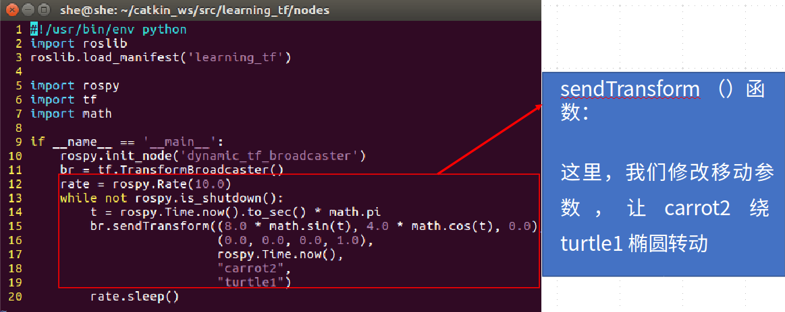
```python
#!/usr/bin/env python  
import roslib
import rospy
import math
import tf
import geometry_msgs.msg
import turtlesim.srv

if __name__ == '__main__':
    rospy.init_node('turtle_tf_listener')

    listener = tf.TransformListener()
    
    rospy.wait_for_service('spawn')
    spawner = rospy.ServiceProxy('spawn', turtlesim.srv.Spawn)
    spawner(4, 2, 0, 'turtle2')
    
    turtle_vel = rospy.Publisher('turtle2/cmd_vel', geometry_msgs.msg.Twist,queue_size=1)
    
    rate = rospy.Rate(10.0)
    while not rospy.is_shutdown():
        try:
            #(trans,rot) = listener.lookupTransform('/turtle2', '/turtle1', rospy.Time(0))
            (trans,rot) = listener.lookupTransform("/turtle2", "/carrot1", rospy.Time(0))
            #(trans,rot) = listener.lookupTransform("/turtle2", "/carrot2", rospy.Time(0))
        except (tf.LookupException, tf.ConnectivityException, tf.ExtrapolationException):
            continue
    
        angular = 4 * math.atan2(trans[1], trans[0])
        linear = 0.5 * math.sqrt(trans[0] ** 2 + trans[1] ** 2)
        cmd = geometry_msgs.msg.Twist()
        cmd.linear.x = linear
        cmd.angular.z = angular
        turtle_vel.publish(cmd)
    
        rate.sleep()
```

运行start_demo.launch

```bash
roslaunch learning_tf start_demo.launch
```

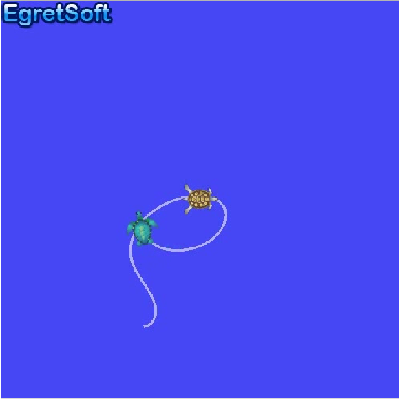

Dynamic TF tree


**XBot TF tree**
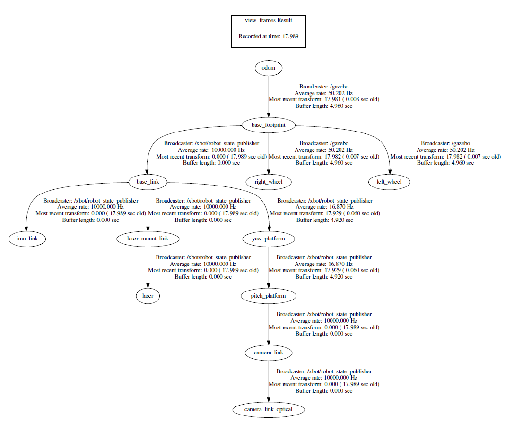

