# 7.2 URDF

**本讲重点**

- URDF基础知识
- 使用URDF创建一个可视化机器人模型
- 为可视化模型的关节增加运动物理属性
- Xacro

**教学目的**

- 了解URDF基础知识
- 熟练使用URDF创建可视化机器人模型
- 熟练为可视化模型的关节增加运动物理属性
- 了解Xacro基础知识，熟练使用Xacro编程

## 1. URDF介绍

URDF是统一机器人描述格式（Unified Robot Description Format）的英文简写， 是一种特殊的xml文件格式。例如pr2_decription，baxter_descrition，ur_description等。

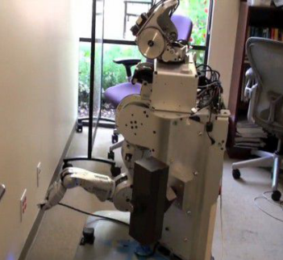


上图是PR2机器人插插座的例子，它和URDF有什么联系呢？首先URDF是一种特殊的xml文件格式，作为机器人的一种描述文件，在ROS里面大量使用。 ROS里经常见到一种类似`(package) – xxx_description`命名的包。这个包里面就是某种机器人的描述文件。例如pr2_decription， baxter_descrition，ur_description等，这里举例的机器人描述包都是可以通过apt-get的方式进行安装。

```bash
sudo apt-get install ros-kinetic-pr2-description 
```

其中kinetic是所安装的ROS版本名, 后面就是所需要安装的包名, 下划线用中画线代替。

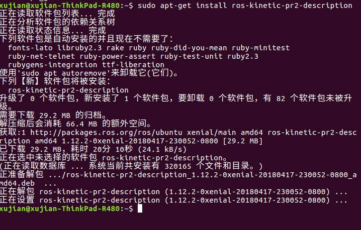

可以ROS安装目录下找到对应的文件

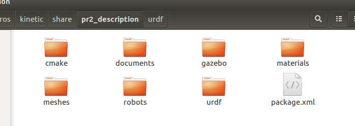

如果想使用开源库moveit对机器人进行路径规划，在`moveit setup assistant`中，见第七章，第一步就是将机器人模型导入，导入的机器人模型就是URDF文件。导入xacro格式时也是先调用`rosrun xacro xacro.py xxx.urdf.xacro > xxx.urdf`, 将其解析成对应的URDF文件，然后再使用。

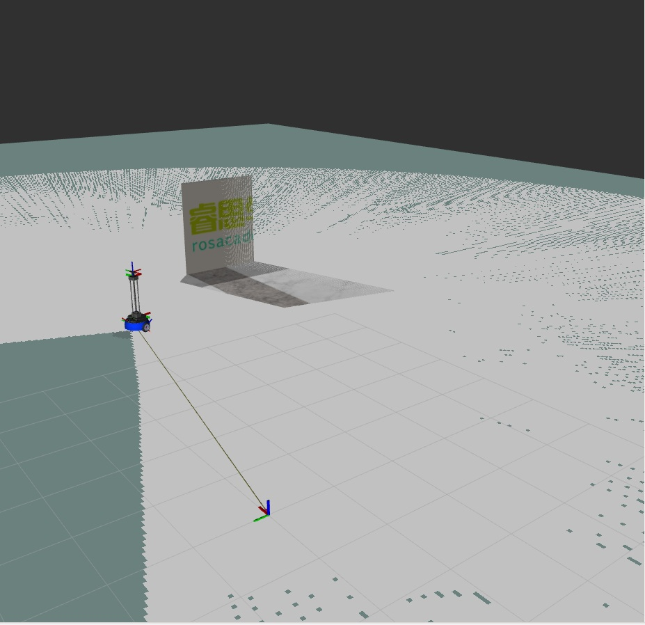

xacro（XML Macros）是一种XML宏语言。 使用xacro，可以通过使用宏命令构建更精悍短小但又具有更高可读性的XML文件，这种宏命令可以扩展达到更大的XML表达范围。 xacro文件是URDF文件的进阶版，可以通过宏定义，文件包含来精简模型文件。还可以通过定义常量、变量等来反复调用，相当有用。

**机器人URDF模型主要由两个文件组成**

- .xacro是主文件，包含URDF项，包括关节，连杆；

- Gazebo包含Gazebo的具体信息以便在Gazebo中仿真这里会包括一些运动属性和物理属性。 

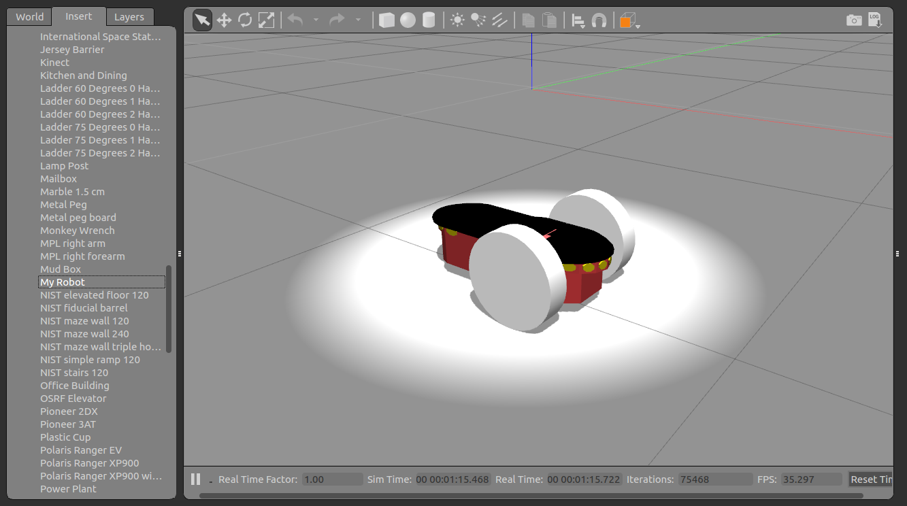

对机器人使用gazebo进行仿真时, 需要加载的机器人模型就是URDF模型, 当然, 单纯的URDF是不能精确描述机器人以及所需要仿真的世界的。Gazebo对其进行了扩展, 感兴趣的同学可以查看gazebo官网的一些教程. 其中会提供一些标签, 对系统动态, 重心等的设定。

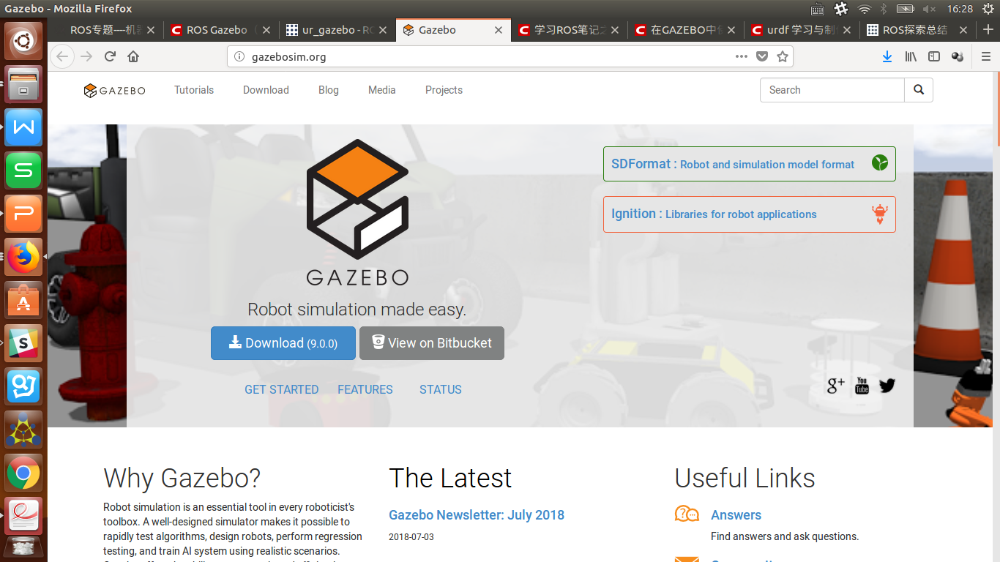

上图是Gazebo官网，URDF语法规范可参考链接http://wiki.ros.org/urdf/XML 和ROSWIKI相关内容 http://wiki.ros.org/urdf

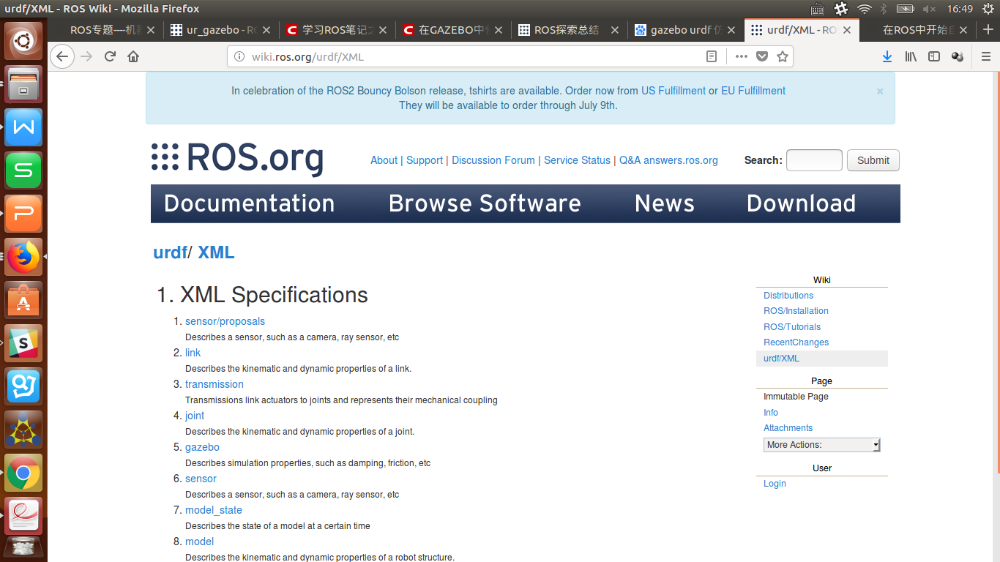

**URDF组件的具体内容**

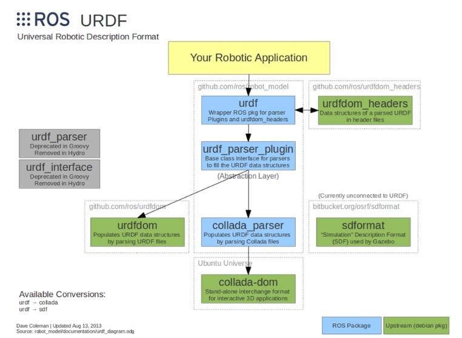

URDF组件具体有哪些呢？上图给出了答案，URDF组件由不同的功能包和组件组成。其中`urdf_parser`和`urder_interface`已经在hydro之后的版本中去除了。	`urdf_paser_plugin`是URDF基础的插件，衍生出了urdfdom(面向URDF文件)和collar_parser(面向相互文件)。`link`属性和`joint`的属性都定义在了urdf文件里，urdf文件和我们之前见到的launch文件一样，遵循xml标签语言语法。

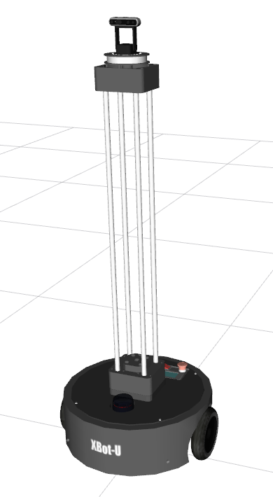

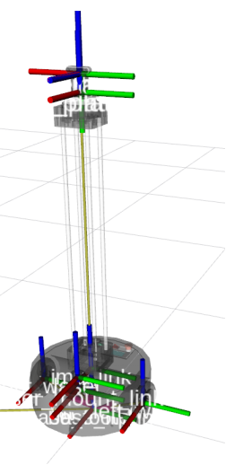

上图是XBot机器人的模型，它由两部分组成，一部分是`link`，一部分是`joint`。所谓link就是部件、零件，每个link都有xyz三轴，就是这个rgb三个轴，joint是连接两个link的关节。看一下之前讲的`tf`，`tf`是树型的数据结构，`tf`反应了`link`和`link`之间的关系。

**xbot-u.urdf.xacro**

```xml
<?xml version="1.0"?>
<robot
    xmlns:controller="http://playerstage.sourceforge.net/gazebo/xmlschema/#controller"
    xmlns:interface="http://playerstage.sourceforge.net/gazebo/xmlschema/#interface"
    xmlns:sensor="http://playerstage.sourceforge.net/gazebo/xmlschema/#sensor"
    xmlns:xacro="http://ros.org/wiki/xacro">
    <xacro:macro name="xbot2_base">
        <link name="base_footprint"/>
        <joint name="base_footprint_to_base" type="fixed">
            <axis rpy="0 0 0" xyz="0 0 0"/>
            <parent link="base_footprint"/>
            <child link="base_link"/>
            <origin rpy="0 0 0" xyz="0 0 0"/>
        </joint>
        <link name="base_link">
            <inertial>
                <origin rpy="0 0 0" xyz="-0.015 0.0 0.0014" />
                <mass value="35" />
                <inertia ixx="0.6125" ixy="0.00495" ixz="0.0031" iyy="0.6426" iyz="-0.0017" izz="0.494" />
            </inertial>
            <visual>
                <origin xyz="0 0 0" rpy="0 0 0" />
                <geometry>
                    <mesh filename="package://robot_sim_demo/models/meshes/base_link.dae" />
                </geometry>
            </visual>
            <collision name="front_omniwheel">
                <origin xyz="0.18 0 0.02" rpy="0 0 0" />
                <geometry>
                    <sphere radius="0.019"/>
                </geometry>
            </collision>
            <collision name="back_omniwheel">
                <origin xyz="-0.18 0 0.02" rpy="0 0 0" />
                <geometry>
                    <sphere radius="0.019"/>
                </geometry>
            </collision>
            <collision name="collision1">
                <origin xyz="0.0 0 0.135" rpy="0 0 0" />
                <geometry>
                    <cylinder length="0.15" radius="0.25"/>
                </geometry>
            </collision>
            <collision name="collision2">
                <origin xyz="0.03 0 0.25" rpy="0 0 0" />
                <geometry>
                    <cylinder length="0.08" radius="0.045"/>
                </geometry>
            </collision>
            <collision name="collision3">
                <origin xyz="0 0 0.68" rpy="0 0 0" />
                <geometry>
                    <cylinder length="0.8" radius="0.08"/>
                </geometry>
            </collision>
            <collision name="collision4">
                <origin xyz="0 0 1.135" rpy="0 0 0" />
                <geometry>
                    <box size="0.04 0.17 0.09"/>
                </geometry>
            </collision>
        </link>
        <link name="laser_mount_link"/>
        <joint name="base_to_laser" type="fixed">
            <axis rpy="0 0 0" xyz="0 0 0"/>
            <parent link="base_link"/>
            <child link="laser_mount_link"/>
            <origin rpy="0 0 0" xyz=".114 0 .17"/>
        </joint>
        <link name="imu_link"/>
        <joint name="base_to_imu" type="fixed">
            <axis rpy="0 0 0" xyz="0 0 0"/>
            <parent link="base_link"/>
            <child link="imu_link"/>
            <origin rpy="0 0 0" xyz="0 0 .2"/>
        </joint>
        <link name="left_wheel">
            <collision name="collision">
                <origin xyz="0 0 0" rpy="1.57079632 0 0"/>
                <geometry>
                    <cylinder radius="0.095" length="0.05"/>
                </geometry>
            </collision>
            <visual name="left_wheel_visual">
                <origin xyz="0 0 0" rpy="0 0 -1.57079632"/>
                <geometry>
                    <mesh filename="package://robot_sim_demo/models/meshes/wheel.dae" />
                </geometry>
            </visual>
            <inertial>
                <origin rpy="0 0 0" xyz="0 0 0" />
                <mass value="4.3542" />
                <inertia ixx="0.0045" ixy="0" ixz="0" iyy="0.005" iyz="0" izz="0.0045" />
            </inertial>
        </link>
        <joint type="continuous" name="left_wheel_hinge">
            <axis xyz="0 1 0" rpy="0 0 0"/>
            <origin xyz="0 0.23 .095" rpy="0 0 0"/>
            <parent link="base_link"/>
            <child link="left_wheel"/>
            <limit effort="6" velocity="1.0"/>
            <joint_properties damping="0.0" friction="0.0"/>
        </joint>
        <link name="right_wheel">
            <collision name="collision">
                <origin xyz="0 0 0" rpy="-1.57079632  0 0"/>
                <geometry>
                    <cylinder radius="0.095" length="0.05"/>
                </geometry>
            </collision>
            <visual name="right_wheel_visual">
                <origin xyz="0 0 0" rpy="0 0 1.57079632"/>
                <geometry>
                    <mesh filename="package://robot_sim_demo/models/meshes/wheel.dae" />
                </geometry>
            </visual>
            <inertial>
                <origin rpy="0 0 0" xyz="0 0 0" />
                <mass value="4.3542" />
                <inertia ixx="0.0045" ixy="0" ixz="0" iyy="0.005" iyz="0" izz="0.0045" />
            </inertial>
        </link>
        <joint type="continuous" name="right_wheel_hinge">
            <axis xyz="0 1 0" rpy="0 0 0"/>
            <origin xyz="0 -0.23 .095" rpy="0 0 0"/>
            <parent link="base_link"/>
            <child link="right_wheel"/>
            <limit effort="6" velocity="1.0"/>
            <joint_properties damping="0.0" friction="0.0"/>
        </joint>
        <link name="yaw_platform">
            <inertial>
                <mass value="1e-5" />
                <origin xyz="0 0 0" rpy="0 0 0"/>
                <inertia ixx="1e-6" ixy="0" ixz="0" iyy="1e-6" iyz="0" izz="1e-6" />
            </inertial>
            <visual>
                <origin xyz="0 0 0" rpy="0 0 1.57079632" />
                <geometry>
                    <mesh filename="package://robot_sim_demo/models/meshes/yaw_platform.dae" />
                </geometry>
            </visual>
            <collision>
                <origin xyz="0 0 0" rpy="0 0 1.57079632" />
                <geometry>
                    <box size="0.1 0.1 0.1"/>
                </geometry>
            </collision>
        </link>
        <joint name="base_to_yaw_platform" type="revolute">
            <axis xyz="0 0 1"/>
            <parent link="base_link"/>
            <child link="yaw_platform"/>
            <origin rpy="0 0 0" xyz="0 0 1.305"/>
            <limit effort="100" velocity="100" lower="-1.57" upper="1.57" />
            <dynamics damping="0.0" friction="10.0"/>
        </joint>
        <link name="pitch_platform">
            <inertial>
                <mass value="1e-5" />
                <origin xyz="0 0 0" rpy="0 0 0"/>
                <inertia ixx="1e-6" ixy="0" ixz="0" iyy="1e-6" iyz="0" izz="1e-6" />
            </inertial>
            <visual>
                <origin xyz="0 0 0" rpy="0 0 0" />
                <geometry>
                    <mesh filename="package://robot_sim_demo/models/meshes/pitch_platform.dae" />
                </geometry>
            </visual>
            <collision>
                <origin xyz="0 0 0" rpy="0 0 0" />
                <geometry>
                    <box size="0.1 0.1 0.1"/>
                </geometry>
            </collision>
        </link>
        <joint name="yaw_to_pitch_platform" type="revolute">
            <axis xyz="0 1 0"/>
            <parent link="yaw_platform"/>
            <child link="pitch_platform"/>
            <origin rpy="0 0 0" xyz="0 0 0"/>
            <limit effort="100" velocity="100" lower="-1.57" upper="1.57" />
            <dynamics damping="0.0" friction="10.0"/>
        </joint>
        <!-- Camera -->
        <link name="camera_link">
            <collision>
                <origin xyz="0 0 0" rpy="0 0 0"/>
                <geometry>
                    <box size="0.1 0.1 0.1"/>
                </geometry>
            </collision>
            <visual>
                <origin xyz="0 0 0" rpy="0 0 0"/>
                <geometry>
                    <!--<mesh filename="package://robot_sim_demo/models/meshes/xtion_pro_camera.dae" />-->
                    <mesh filename="package://robot_sim_demo/models/meshes/realsense.dae" />
                </geometry>
            </visual>
            <inertial>
                <mass value="1e-5" />
                <origin xyz="0 0 0" rpy="0 0 0"/>
                <inertia ixx="1e-6" ixy="0" ixz="0" iyy="1e-6" iyz="0" izz="1e-6" />
            </inertial>
        </link>
        <joint name="camera_joint" type="fixed">
            <axis xyz="0 1 0" /><?xml version="1.0"?>
<robot xmlns:controller="http://playerstage.sourceforge.net/gazebo/xmlschema/#controller"
  xmlns:interface="http://playerstage.sourceforge.net/gazebo/xmlschema/#interface"
  xmlns:sensor="http://playerstage.sourceforge.net/gazebo/xmlschema/#sensor"
  xmlns:xacro="http://ros.org/wiki/xacro">

  <xacro:macro name="xbot2_base">
  <link name="base_footprint"/>
  <joint name="base_footprint_to_base" type="fixed">
    <axis rpy="0 0 0" xyz="0 0 0"/>
    <parent link="base_footprint"/>
    <child link="base_link"/>
    <origin rpy="0 0 0" xyz="0 0 0"/>
  </joint>

  <link name="base_link">
    <inertial>
      <origin rpy="0 0 0" xyz="-0.015 0.0 0.0014" />
      <mass value="35" />
      <inertia ixx="0.6125" ixy="0.00495" ixz="0.0031" iyy="0.6426" iyz="-0.0017" izz="0.494" />
    </inertial>
    <visual>
      <origin xyz="0 0 0" rpy="0 0 0" />
      <geometry>
        <mesh filename="package://robot_sim_demo/models/meshes/base_link.dae" />
      </geometry>
    </visual>

    <collision name="front_omniwheel">
      <origin xyz="0.18 0 0.02" rpy="0 0 0" />
      <geometry>
        <sphere radius="0.019"/>
      </geometry>
    </collision>
    <collision name="back_omniwheel">
      <origin xyz="-0.18 0 0.02" rpy="0 0 0" />
      <geometry>
        <sphere radius="0.019"/>
      </geometry>
    </collision>
    <collision name="collision1">
      <origin xyz="0.0 0 0.135" rpy="0 0 0" />
      <geometry>
        <cylinder length="0.15" radius="0.25"/>
      </geometry>
    </collision>
    <collision name="collision2">
      <origin xyz="0.03 0 0.25" rpy="0 0 0" />
      <geometry>
        <cylinder length="0.08" radius="0.045"/>
      </geometry>
    </collision>
    <collision name="collision3">
      <origin xyz="0 0 0.68" rpy="0 0 0" />
      <geometry>
        <cylinder length="0.8" radius="0.08"/>
      </geometry>
    </collision>
    <collision name="collision4">
      <origin xyz="0 0 1.135" rpy="0 0 0" />
      <geometry>
        <box size="0.04 0.17 0.09"/>
      </geometry>
    </collision>
  </link>

  <link name="laser_mount_link"/>
  <joint name="base_to_laser" type="fixed">
    <axis rpy="0 0 0" xyz="0 0 0"/>
    <parent link="base_link"/>
    <child link="laser_mount_link"/>
    <origin rpy="0 0 0" xyz=".114 0 .17"/>
  </joint>

  <link name="imu_link"/>
  <joint name="base_to_imu" type="fixed">
    <axis rpy="0 0 0" xyz="0 0 0"/>
    <parent link="base_link"/>
    <child link="imu_link"/>
    <origin rpy="0 0 0" xyz="0 0 .2"/>
  </joint>

  <link name="left_wheel">
    <collision name="collision">
      <origin xyz="0 0 0" rpy="1.57079632 0 0"/>
      <geometry>
        <cylinder radius="0.095" length="0.05"/>
      </geometry>
    </collision>
    <visual name="left_wheel_visual">
      <origin xyz="0 0 0" rpy="0 0 -1.57079632"/>
      <geometry>
        <mesh filename="package://robot_sim_demo/models/meshes/wheel.dae" />
      </geometry>
    </visual>    
    <inertial>
      <origin rpy="0 0 0" xyz="0 0 0" />
      <mass value="4.3542" />
      <inertia ixx="0.0045" ixy="0" ixz="0" iyy="0.005" iyz="0" izz="0.0045" />
    </inertial>
  </link>

  <joint type="continuous" name="left_wheel_hinge">
    <axis xyz="0 1 0" rpy="0 0 0"/>
    <origin xyz="0 0.23 .095" rpy="0 0 0"/>
    <parent link="base_link"/>
    <child link="left_wheel"/>
    <limit effort="6" velocity="1.0"/>
    <joint_properties damping="0.0" friction="0.0"/>
  </joint>

  <link name="right_wheel">
    <collision name="collision">
      <origin xyz="0 0 0" rpy="-1.57079632  0 0"/>
      <geometry>
        <cylinder radius="0.095" length="0.05"/>
      </geometry>
    </collision>
    <visual name="right_wheel_visual">
      <origin xyz="0 0 0" rpy="0 0 1.57079632"/>
      <geometry>
        <mesh filename="package://robot_sim_demo/models/meshes/wheel.dae" />
      </geometry>
    </visual>    
    <inertial>
      <origin rpy="0 0 0" xyz="0 0 0" />
      <mass value="4.3542" />
      <inertia ixx="0.0045" ixy="0" ixz="0" iyy="0.005" iyz="0" izz="0.0045" />
    </inertial>
  </link>

  <joint type="continuous" name="right_wheel_hinge">
    <axis xyz="0 1 0" rpy="0 0 0"/>
    <origin xyz="0 -0.23 .095" rpy="0 0 0"/>
    <parent link="base_link"/>
    <child link="right_wheel"/>
    <limit effort="6" velocity="1.0"/>
    <joint_properties damping="0.0" friction="0.0"/>
  </joint>

  <link name="yaw_platform">
    <inertial>
      <mass value="1e-5" />
      <origin xyz="0 0 0" rpy="0 0 0"/>
      <inertia ixx="1e-6" ixy="0" ixz="0" iyy="1e-6" iyz="0" izz="1e-6" />
    </inertial>
    <visual>
      <origin xyz="0 0 0" rpy="0 0 1.57079632" />
      <geometry>
        <mesh filename="package://robot_sim_demo/models/meshes/yaw_platform.dae" />
      </geometry>
    </visual>
    <collision>
      <origin xyz="0 0 0" rpy="0 0 1.57079632" />
      <geometry>
        <box size="0.1 0.1 0.1"/>
      </geometry>
    </collision>
  </link>

  <joint name="base_to_yaw_platform" type="revolute">
    <axis xyz="0 0 1"/>
    <parent link="base_link"/>
    <child link="yaw_platform"/>
    <origin rpy="0 0 0" xyz="0 0 1.305"/>
    <limit effort="100" velocity="100" lower="-1.57" upper="1.57" />
    <dynamics damping="0.0" friction="10.0"/>
  </joint>

  <link name="pitch_platform">
    <inertial>
      <mass value="1e-5" />
      <origin xyz="0 0 0" rpy="0 0 0"/>
      <inertia ixx="1e-6" ixy="0" ixz="0" iyy="1e-6" iyz="0" izz="1e-6" />
    </inertial>
    <visual>
      <origin xyz="0 0 0" rpy="0 0 0" />
      <geometry>
        <mesh filename="package://robot_sim_demo/models/meshes/pitch_platform.dae" />
      </geometry>
    </visual>
    <collision>
      <origin xyz="0 0 0" rpy="0 0 0" />
      <geometry>
        <box size="0.1 0.1 0.1"/>
      </geometry>
    </collision>
  </link>

  <joint name="yaw_to_pitch_platform" type="revolute">
    <axis xyz="0 1 0"/>
    <parent link="yaw_platform"/>
    <child link="pitch_platform"/>
    <origin rpy="0 0 0" xyz="0 0 0"/>
    <limit effort="100" velocity="100" lower="-1.57" upper="1.57" />
    <dynamics damping="0.0" friction="10.0"/>
  </joint>

  <!-- Camera -->
  <link name="camera_link">
    <collision>
      <origin xyz="0 0 0" rpy="0 0 0"/>
      <geometry>
        <box size="0.1 0.1 0.1"/>
      </geometry>
    </collision>
    <visual>
      <origin xyz="0 0 0" rpy="0 0 0"/>
      <geometry>
        <!--<mesh filename="package://robot_sim_demo/models/meshes/xtion_pro_camera.dae" />-->
        <mesh filename="package://robot_sim_demo/models/meshes/realsense.dae" />
      </geometry>
    </visual>
    <inertial>
      <mass value="1e-5" />
      <origin xyz="0 0 0" rpy="0 0 0"/>
      <inertia ixx="1e-6" ixy="0" ixz="0" iyy="1e-6" iyz="0" izz="1e-6" />
    </inertial>
  </link>

  <joint name="camera_joint" type="fixed">
    <axis xyz="0 1 0" />
    <origin xyz="-0.005 0 .06" rpy="0 0 0"/>
    <parent link="pitch_platform"/>
    <child link="camera_link"/>
  </joint>

  <!-- generate an optical frame http://www.ros.org/reps/rep-0103.html#suffix-frames
      so that ros and opencv can operate on the camera frame correctly -->
  <joint name="camera_optical_joint" type="fixed">
    <!-- these values have to be these values otherwise the gazebo camera image
        won't be aligned properly with the frame it is supposedly originating from -->
    <origin xyz="0 0 0" rpy="-1.5708 0 -1.5708"/>
    <parent link="camera_link"/>
    <child link="camera_link_optical"/>
  </joint>

  <link name="camera_link_optical">
  </link>


  </xacro:macro>
</robot>
            <origin xyz="-0.005 0 .06" rpy="0 0 0"/>
            <parent link="pitch_platform"/>
            <child link="camera_link"/>
        </joint>
        <!-- generate an optical frame http://www.ros.org/reps/rep-0103.html#suffix-frames
      so that ros and opencv can operate on the camera frame correctly -->
        <joint name="camera_optical_joint" type="fixed">
            <!-- these values have to be these values otherwise the gazebo camera image
        won't be aligned properly with the frame it is supposedly originating from -->
            <origin xyz="0 0 0" rpy="-1.5708 0 -1.5708"/>
            <parent link="camera_link"/>
            <child link="camera_link_optical"/>
        </joint>
        <link name="camera_link_optical"></link>
    </xacro:macro>
</robot>
```

首先定义base_link ，laser_link ，imu_link这些部件，还有连接这些部件的关节`joint`，如`base_footprint`到`base_link`，base_link到`left_wheel`、`right_wheel`。

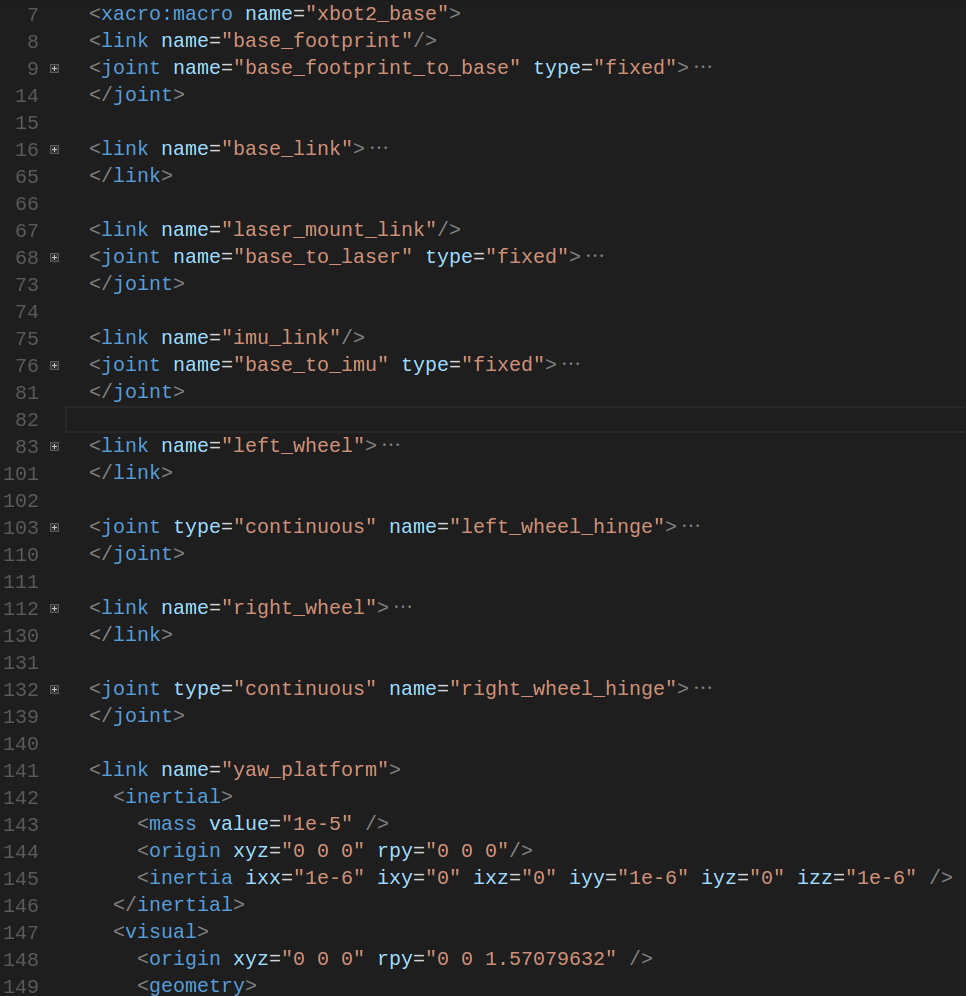

`link`和`joint`标签有一套属性，其中的一些形状等外观属性可以在rviz和Gazebo中体现，物理碰撞等属性在Gazebo中能体现。各标签的描述如下。

```xml
<link>   
      <inertial>          惯性属性
           <origin>       相对link的坐标
           <mass>         质量
           <inertial>     转动惯量
      <visual>            视觉属性
           <origin>       相对link的坐标
           <geometry>     形状
           <material>     材质
      <collision>         碰撞属性
           <origin>       相对坐标
           <geometry>     形状

<joint>   
      <origin>       从父link到子link的变换
      <parent>       父link
      <child>        子link
      <axis>         关节轴
      <calibration>  视觉属性
      <dynamics>     动力学参数
      <limit>        关节限位
```

## 2. URDF文件

URDF中，要描述一个机器人的时候，例如小车的`base_link`底盘和`right_wheel`右轮，两个`link`（`base_link`和`right_wheel`）之间需要`joint`来连接。机器人由`link`和`joint`进行描述，如下图。


URDF树状结构，如下图，由一个根`link`(link1) ，分别出现了两个分支`link2`和`link3`，分别由`joint`连接`link`。

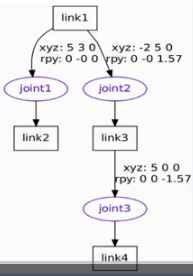

三维坐标系使用的是右手坐标系，上图是`tf_tree`，xyz：5 3 0，表示x轴平移5个单位，y轴平移3个单位，z轴平移0个单位。rpy表示旋转的欧拉角对应的三个分量。

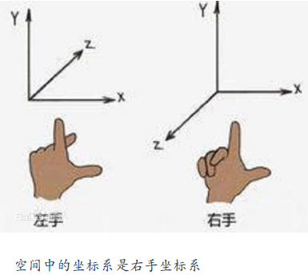

上面的URDF不能够唯一确定一个机器人或者一个物品，每个`link`长什么样子，`link`之间是什么样子的位置关系，这些在上面都没有定义。

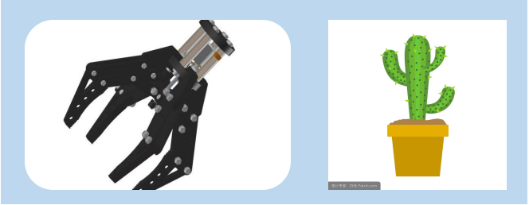

根据上面的URDF内容，每一个同学联想到的样子都不一样，是一个仙人掌还是一个两指的夹持器？urdf文件不能够被正确解析，也是不能够可视化出来。上面内容类似于机器人的骨架, 机器人由这些组成. 一共拥有4个link, 和3个joint, 像图中所示的样子连接起来。

## 3. 制作URDF模型

在URDF当中，要描述一个机器人，例如小车的底座`base_link`和右轮`right`，两个`link`之间需要`joint`来连接。首先构建`base_link`作为小车的父坐标系，然后在`base_link`基础上再构建`left_wheel`、`right_wheel`、和`aser_link`。最后不同的`link`之间通过`joint`连接。

相关代码注释

```xml
<robot name="mycar">  
```

机器人的名字定义为`mycar`

```xml
  <link name="base_link" />  
  <link name="right" />  
  <link name="left" />  
  <link name="rplidar"/>
```

定义4个`link`，名字分别为`base_link`、`right`、`left`、`rplidar`，其中`base_link`为小车的父坐标系。

```xml
  <joint name="right" type="continuous"> 
    <parent link="base_link"/>  
    <child link="right"/>  
  </joint>  
```

joint名为`right`，类型是可连续旋转运动的，父`link`是`base_link`，子`link`是`right`，下面代码的类似。

mycar_link_joint.urdf

```xml
<robot name="mycar">
    <link name="base_link" />
    <link name="right" />
    <link name="left" />
    <link name="rplidar"/>
    <joint name="right" type="continuous">
        <parent link="base_link"/>
        <child link="right"/>
    </joint>
    <joint name="left" type="continuous">
        <parent link="base_link"/>
        <child link="left"/>
    </joint>
    <joint name="rplidar_joint" type="fixed">
        <parent link="base_link"/>
        <child link="rplidar"/>
    </joint>
</robot>   
```

安装check_urdf工具

```bash
sudo apt-get install liburdfdom-tools
```

检查my_car.urdf

```bash
check_urdf my_car.urdf
```

如果语法正确，输出见下图。

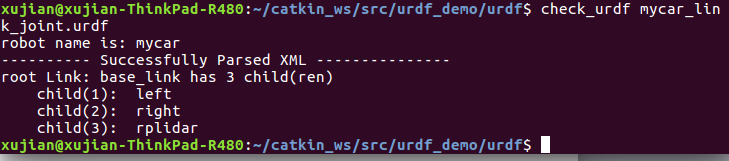

display_urdf_link_joint.launch

```xml
<launch>
    <arg name="model" default="$(find urdf_demo)/urdf/mycar_link_joint.urdf"/>
    <param name="robot_description" command="$(find xacro)/xacro.py $(arg model)" />
    <param name="use_gui" value="true"/>
    <node name="joint_state_publisher" pkg="joint_state_publisher" type="joint_state_publisher" />
    <node name="robot_state_publisher" pkg="robot_state_publisher" type="state_publisher" />
    <node pkg="rviz" type="rviz" name="rviz" args="-d $(find urdf_demo)/urdf.rviz" output="screen"/>
</launch>
```
打开一个终端，输入

```bash
roslaunch urdf_demo display_urdf_link_joint.launch
```

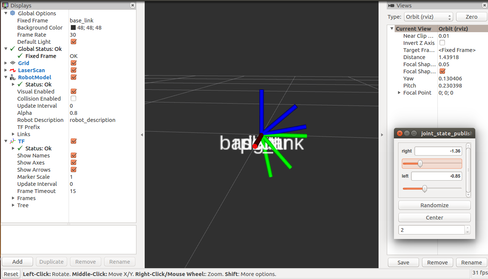

**相关代码注释**

Origin中的rpy的三个分量，指的是欧拉角的三个分量，xyz指的是相对base_link的位移情况。

mycar_link_position.urdf

```xml
<robot name="mycar">
    <link name="base_link" />
    <link name="right" />
    <link name="left" />
    <link name="rplidar"/>
    <joint name="right" type="continuous">
        <origin rpy="0  0  0" xyz="0 -0.2 0.07"/>
        <parent link="base_link"/>
        <child link="right"/>
    </joint>
    <joint name="left" type="continuous">
        <origin rpy="0 0 0" xyz="0 0.2 0.07"/>
        <parent link="base_link"/>
        <child link="left"/>
    </joint>
    <joint name="rplidar_joint" type="fixed">
        <origin xyz="0.2 0 0.12"/>
        <parent link="base_link"/>
        <child link="rplidar"/>
    </joint>
</robot>   
```

添加机器人`link`之间的相对位置关系。在基础模型之上，需要为机器人之间`link`来设相对位置和朝向的关系，URDF中通过`<origin>`来描述这种关系。

打开一个终端，输入

```bash
roslaunch urdf_demo display_urdf_link_position.launch
```

回车之后,发现所有的`link`和`joint`已经有在固定的位置上。

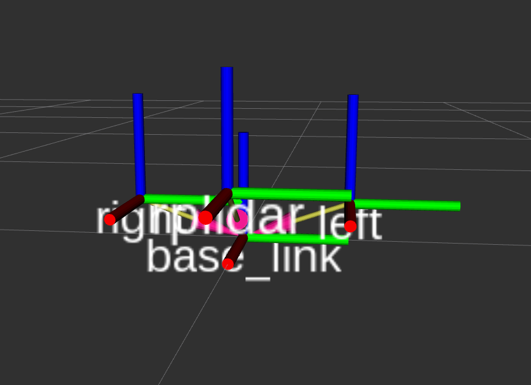

mycar_color_geometry.urdf

```xml
<robot name="mycar">  
  <link name="base_link">  
    <visual>  
       <geometry>  
          <cylinder length=".06" radius="0.27"></cylinder>  
       </geometry>  
       <origin rpy="0 0 0" xyz="0 0 0.1"/>  
       <material name="white">  
         <color rgba="1 1 1 1"/>  
       </material>  
    </visual>  
  </link>  
  
  <link name="right">  
    <visual>  
      <geometry>  
        <cylinder length="0.04" radius="0.07"/>  
      </geometry>  
      <origin rpy="1.5707  0  0" xyz="0 0 0"/>  
      <material name="black">  
        <color rgba="0 0 0 1"/>  
      </material>  
    </visual>  
  </link>  
  
  <link name="left">  
    <visual>  
      <geometry>  
        <cylinder length="0.04" radius="0.07"/>  
      </geometry>  
      <origin rpy="1.5707  0  0" xyz="0 0 0"/>  
      <material name="black"/>  
    </visual>  
  </link>  
  
  <joint name="right" type="continuous"> 
    <origin rpy="0  0  0" xyz="0 -0.2 0.07"/>   
    <parent link="base_link"/>  
    <child link="right"/>  
  </joint>  
  
  <joint name="left" type="continuous">  
    <origin rpy="0 0 0" xyz="0 0.2 0.07"/>
    <parent link="base_link"/>  
    <child link="left"/>   
  </joint>  
 
 <link name="rplidar">
    <inertial>
      <mass value="1e-5"/>
      <origin rpy="0 0 0" xyz="0 0 0"/>
      <inertia ixx="1e-6" ixy="0" ixz="0" iyy="1e-6" iyz="0" izz="1e-6"/>
    </inertial>
    <visual>
      <origin rpy="0 0 0" xyz="0 0 0"/>
      <geometry>
        <mesh filename="package://urdf_demo/urdf/rplidar.dae"/>
      </geometry>
    </visual>
    <collision>
      <origin rpy="0 0 0" xyz="0 0 0"/>
      <geometry>
        <cylinder length=".04" radius="0.035"></cylinder>  
      </geometry>
    </collision>
  </link>
  <joint name="rplidar_joint" type="fixed">
    <axis xyz="0 1 0"/>
    <origin xyz="0.2 0 0.12"/>
    <parent link="base_link"/>
    <child link="rplidar"/>
  </joint>
</robot>  
```

**相关代码注释**

添加模型的尺寸，形状和颜色等

在已经设置好模型的`link`基础上添加模型的形状，例如圆柱或长方体，相对于`link`的位置，颜色等。其中形状用`<geometry>`来描述，颜色用`<color>`来描述。形状为圆柱体，半径0.27米，高为0.06米。

```xml
       <geometry>  
          <cylinder length=".06" radius="0.27"></cylinder>  
       </geometry> 
```

`material name`为white，`color rgba`代表颜色的四个通道，分别代表R（Red）红色、G（Green）绿色、B（Blue）蓝色、和A（Alpha）透明度。

```xml
       <material name="white">  
         <color rgba="1 1 1 1"/>  
       </material>  
```

显示URDF模型

想要在rviz中显示出我们制作好的小车的URDF模型，可写一个launch文件。

display_urdf_color_geometry.launch

```xml
<launch>
    <arg name="model" default="$(find urdf_demo)/urdf/mycar_color_geometry.urdf"/>
    <param name="robot_description" command="$(find xacro)/xacro.py $(arg model)" />
    <param name="use_gui" value="true"/>
    <node name="joint_state_publisher" pkg="joint_state_publisher" type="joint_state_publisher" />
    <node name="robot_state_publisher" pkg="robot_state_publisher" type="state_publisher" />
    <node pkg="rviz" type="rviz" name="rviz" args="-d $(find urdf_demo)/urdf.rviz" output="screen"/>
</launch>
```

相关代码注释

```xml
<launch>
...
</launch>
```

标示这是一个launch档。

```xml
    <arg name="model" default="$(find urdf_demo)/urdf/mycar_color_geometry.urdf"/>
```

`<arg name="…" value="…">`，name是参数的名称。value是参数的值。有时候也用default=”…”来设预设值。`$(find  <pkg>)`用于取代包`<pkg>`的路径，所以不管包`<pkg>`的路径是否更改，`$(find  <pkg>)`可照样能找得到它的路径。

```xml
    <param name="robot_description" command="$(find xacro)/xacro.py $(arg model)" />
```

`<param>`用来设置参数，参数存储在parameter server上。`name=”namespace/name”`是参数的名字。`value=”value”`（可选）定义参数的值。

```xml
    <node name="joint_state_publisher" pkg="joint_state_publisher" type="joint_state_publisher" />
```

运行节点程序joint_state_publisher，`<node pkg="…" type="…" name="…" respawn=true ns="…" args="…."/>`    。`pkg`表示该节点所在的包。`type`表示这个节点程序的名称，也就是开发的时候取的名字。`name`节点的名称，你也可以再另外给这个节点取名字。`respawn/required`，当该节点由于不明原因停止执行的时候，会自动重新启动。而required比较霸道一点，当该节点停止执行的时候，会让整个launch都停止执行。

**问题：我们之前每次运行出现的下图在launch文件哪里能够体现出来？**


```xml
    <param name="use_gui" value="true"/>
    <node name="joint_state_publisher" pkg="joint_state_publisher" type="joint_state_publisher" />
    <node name="robot_state_publisher" pkg="robot_state_publisher" type="state_publisher" />
```

将launch文件中的`param name="use_gui"`的值由`false`改成`true`会弹出一个窗口，显示移动条，可以临时改变`joint`的朝向。

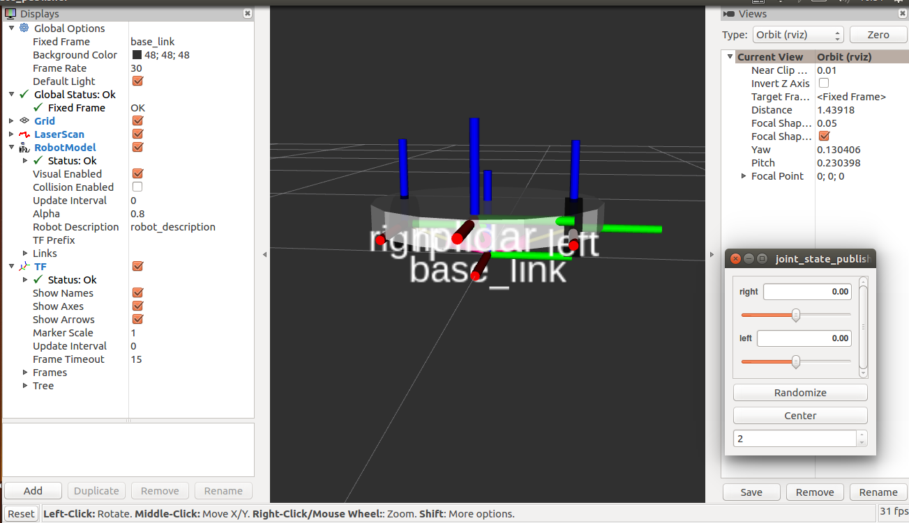

练习

1. 打开终端，输入

```bash
roslaunch urdf_demo display_urdf_color_geometry.launch
```

2. 修改`display_urdf_color_geometry.launch`中`param name="use_gui"`的值由`true`改成`false`，观察之前弹出的窗口是否再次出现。

```xml
    <param name="use_gui" value="true"/>
```

查看tf_tree

```bash
rosrun rqt_tf_tree rqt_tf_tree
```

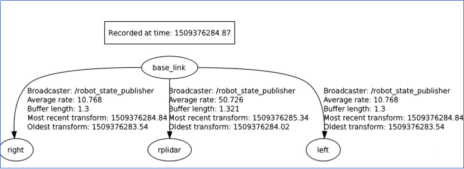

这里展示的是XBot模型。

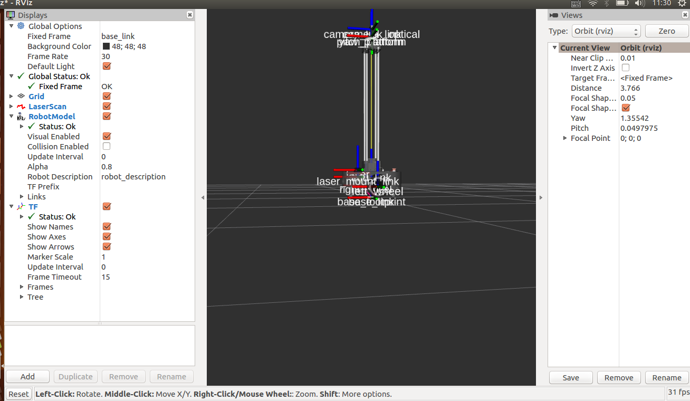

查看robot_sim_demo下的robot.xacro

```xml
<?xml version="1.0"?>
<robot
    xmlns:controller="http://playerstage.sourceforge.net/gazebo/xmlschema/#controller"
    xmlns:interface="http://playerstage.sourceforge.net/gazebo/xmlschema/#interface"
    xmlns:sensor="http://playerstage.sourceforge.net/gazebo/xmlschema/#sensor"
    xmlns:xacro="http://ros.org/wiki/xacro"
  name="sick_tim">
    <xacro:include filename="$(find robot_sim_demo)/urdf/sick_tim.urdf.xacro" />
    <!-- Choose your laser -->
    <!--<xacro:sick_tim571 name="laser" ros_topic="scan"   />-->
    <xacro:rplidarA2 name="laser" ros_topic="scan"   />
    <xacro:include filename="$(find robot_sim_demo)/urdf/materials.xacro" />
    <xacro:include filename="$(find robot_sim_demo)/urdf/xbot-u.urdf.xacro" />
    <xacro:include filename="$(find robot_sim_demo)/urdf/xbot-u.gazebo" />
    <xacro:xbot2_base/>
</robot>
```

拷贝robot.xacro

```bash
roscd urdf_sim_demo
cd urdf
cp robot.xacro ~/catkin_ws/src/urdf_demo/urdf
```

修改launch文件

display_xbot.launch

```xml
<launch>
    <arg name="model" default="$(find urdf_demo)/urdf/robot.xacro"/>
    <arg name="gui" default="true" />
    <arg name="rvizconfig" default="$(find urdf_demo)/rviz/urdf.rviz" />
    <param name="robot_description" command="$(find xacro)/xacro.py $(arg model)" />
    <param name="use_gui" value="$(arg gui)"/>
    <node name="joint_state_publisher" pkg="joint_state_publisher" type="joint_state_publisher" />
    <node name="robot_state_publisher" pkg="robot_state_publisher" type="state_publisher" />
    <node name="rviz" pkg="rviz" type="rviz" args="-d $(arg rvizconfig)" required="true" />
</launch>
```

运行，在终端输入

```bash
roslaunch urdf_demo display_xbot.launch
```

下图是去掉坐标轴和名称的效果图。去掉Rviz中TF中的axis和name。

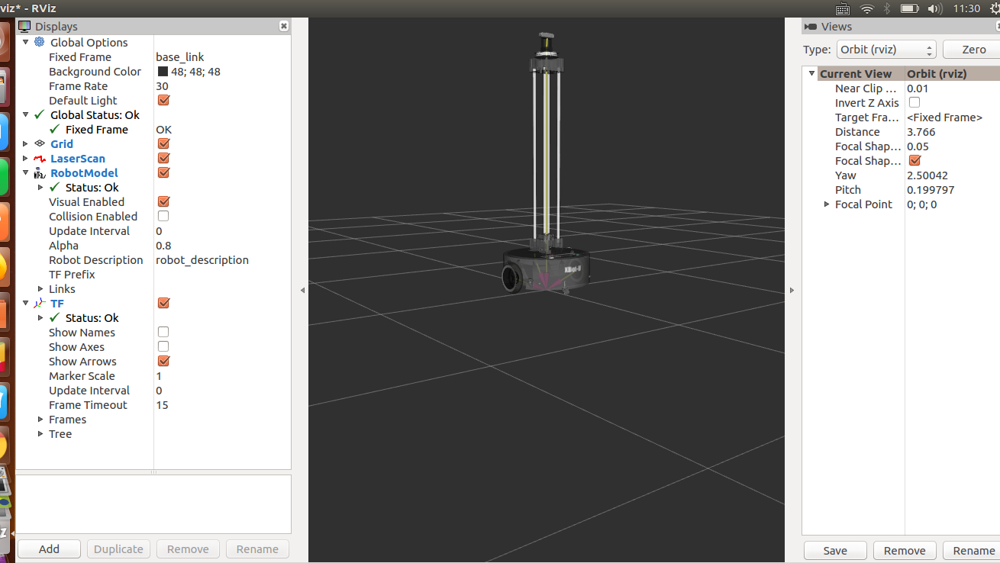

## 4. 使用URDF创建一个可视化机器人模型

这个任务是利用urdf来可视化一个看起来像星球大战里的R2D2的机器人可视化模型。第一个子任务是建立一个圆柱体模型；第二个子任务是建立完整的机器人模型。

任务包括3个重要方面，创建机器人主躯干的圆柱体；思考urdf_tutorial软件包提供的display.launch是如何将urdf文件解析显示出来的；学习整个机器人造型的构造。

**任务分解**

**1. 创建机器人主躯干的圆柱体**

任务要求：创建一个看起来像星球大战里的R2D2的机器人可视化模型，在后面的练习中，我们学习如何表达模型，如何增加一些物理属性，如何使用xacro生成更为简洁的代码和如何使模型可以在Gazebo中呈现，此练习从基础开始，让大家从简单的圆柱体入手构造形状。

知识点：URDF文件的理解以及launch文件的理解

**步骤1. 安装软件包**

确认安装了`joint_state_publisher`软件包，否则可视化模型无法在rviz中显示。另外也要确认我们已经安装了urdf_tutorial软件包，如果没有安装，把这个软件包也安装上，因为urdf_tutorial 中有本练习中所有机器人模型代码。

```bash
sudo apt-get install ros-kinetic-joint-state-publisher ros-kinetic-urdf-tutorial
```

在安装之前，我们可以检查是否安装过这些ROS软件包。

打开终端，输入

```bash
rospack list | grep joint_state_publisher && rospack list | grep urdf_tutorial
```

如下显示，表明已安装过。

```bash
joint_state_publisher /opt/ros/kinetic/share/joint_state_publisher
urdf_tutorial /opt/ros/kinetic/share/urdf_tutorial
```

**步骤2. 熟悉R2-D2的外观造型**

R2-D2的头部是一个半球体，上面还有一个凸出的圆柱体，是眼睛；主躯干就是一个圆柱体；左右两边是两条长方体的支撑腿；主躯干下面有一个类似于金字塔造型的支撑腿。有了以上的几大模块，一个R2-D2的造型基本上就出来了。

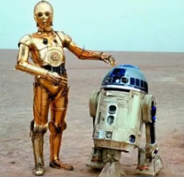

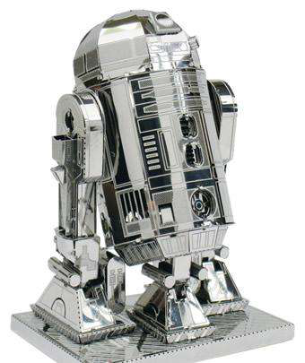

**步骤3. 创建pkg r2d2_urdf**

创建一个pkg r2d2_urdf，创建src、launch、urdf、rivz目录。src目录用于存放源码，launch文件夹用于存放launch文件，urdf文件夹用于存放urdf文件，rivz文件夹用于存放rviz文件。

```bash
catkin_create_pkg r2d2_urdf std_mags rospy 
mkdir -vp ~/catkin_ws/src/r2d2_urdf/{src,launch,urdf,rviz}
```

步骤4. 编写urdf文件

创建R2D2的主躯干就是一个圆柱体，我们假设主躯干的半径0.2米，长度0.6米，ROS里面把每个可视化子模块称为`link`，子模块与子模块之间通过关节`joint`连接，机器人底盘的`link`统一称为`base_link`，其它的`link`都要依附到`base_link`上。

01-myfirst.urdf

```xml
<?xml version="1.0"?>
<robot name="myfirst">
  <link name="base_link">
    <visual>
      <geometry>
        <cylinder length="0.6" radius="0.2"/>
      </geometry>
    </visual>
  </link>
</robot>
```

几何结构除了`<cylinder>`圆柱体以外还有`<box>`立方体、`<cylinder>`圆柱体、`<sphere>`球体。

**步骤5. 拷贝URDF文件夹下面的文件**

1. 把urdf_tutorial下的urdf、rviz、launch文件夹拷贝到我们之前创建的包。

2. 修改display.launch

修改前的display.launch

```xml
<launch>
    <arg name="model" default="$(find r2d2_urdf)/urdf/r2d2.xacro"/>
    <arg name="gui" default="true" />
    <arg name="rvizconfig" default="$(find r2d2_urdf)/rviz/urdf.rviz" />
    <param name="robot_description" command="$(find xacro)/xacro.py $(arg model)" />
    <param name="use_gui" value="$(arg gui)"/>
    <node name="joint_state_publisher" pkg="joint_state_publisher" type="joint_state_publisher" />
    <node name="robot_state_publisher" pkg="robot_state_publisher" type="state_publisher" />
    <node name="rviz" pkg="rviz" type="rviz" args="-d $(arg rvizconfig)" required="true" />
</launch>
```

相关代码注释

```xml
    <node name="joint_state_publisher" pkg="joint_state_publisher" type="joint_state_publisher" />
```

`pkg`表示该节点所在的包，`type`是节点可执行文件名称，`name`节点的名称，不过你另取名字，原名会被覆盖，以这个名称表示。`respawn/required`，`respawn`是当该节点由于不明原因停止执行的时候，会自动重新启动该节点。`required`是当该节点停止执行的时候，会让整个launch 文档都停止执行。

修改后的display.launch

```xml
<launch>
    <arg name="model" default="$(find r2d2_urdf)/urdf/01-myfirst.urdf"/>
    <arg name="gui" default="true" />
    <arg name="rvizconfig" default="$(find r2d2_urdf)/rviz/urdf.rviz" />
    <param name="robot_description" command="$(find xacro)/xacro.py $(arg model)" />
    <param name="use_gui" value="$(arg gui)"/>
    <node name="joint_state_publisher" pkg="joint_state_publisher" type="joint_state_publisher" />
    <node name="robot_state_publisher" pkg="robot_state_publisher" type="state_publisher" />
    <node name="rviz" pkg="rviz" type="rviz" args="-d $(arg rvizconfig)" required="true" />
</launch>
```

**步骤6. 在Rviz中可视化**

要想用launch文件，首先需要切换到catkin_ws工作空间下，catkin_make编译。运行`source devel/setup.bash`设置环境，这时launch文件中的`$(find r2d2_urdf)`才能找到r2d2_urdf目录，最后通过roslaunch加载该display.launch文件。

编译。打开一个终端，运行

```bash
cd catkin_ws
source devel/setup.bash
```

运行display.launch

```bash
roslaunch r2dr_urdf display.launch mode:=01-myfirst.urdf
```
或
```bash
roslaunch r2dr_urdf display.launch
```

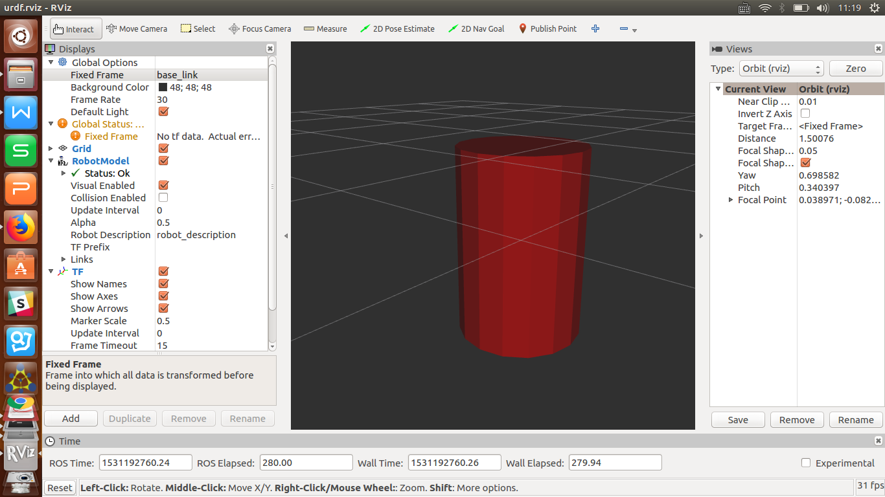

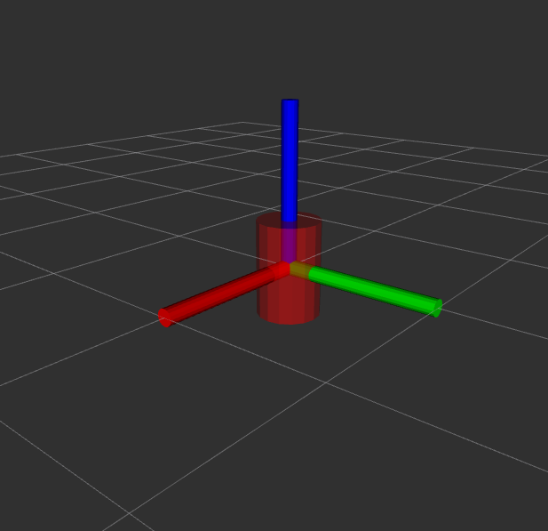

我们添加TF后得到上图，可以清楚的看到红绿蓝对应坐标系的xyz轴。

课堂作业：

请自己在工作空间新建一个包，包的名字叫做homework，之后建立一个半径为0.3，长度为0.6的圆柱体模型，让它在rviz中可视化。代码在<源码>文件夹下面的<homework>里，图片在<其他素材>文件夹下。

**2. 创建机器人整个模型**

任务要求：创建一个看起来像星球大战里的R2D2的机器人可视化模型。在上一个子任务中，已经能够完成简单的模型创建。事实上，很多模型都可以看做一系列简单的模型的空间组合，但是如何把这些简单的模型连接起来，如何确定模型的颜色等参数，都是我们需要在设计的过程中考虑的，本练习的重点在于如何正确的创建出可视化的机器人模型。

02-multipleshapes.urdf

```xml
<?xml version="1.0"?> 
<robot name="multipleshapes">
  <link name="base_link">
    <visual>
      <geometry>
        <cylinder length="0.6" radius="0.2"/>
      </geometry>
    </visual>
  </link>

  <link name="right_leg">
    <visual>
      <geometry>
        <box size="0.6 .1 .2"/>
      </geometry>
    </visual>
  </link>

  <joint name="base_to_right_leg" type="fixed">
    <parent link="base_link"/>
    <child link="right_leg"/>
  </joint>

</robot>
```


修改后的display.launch

```xml
<launch>
    <arg name="model" default="$(find r2d2_urdf)/urdf/02.multipleshapes.urdf"/>
    <arg name="gui" default="true" />
    <arg name="rvizconfig" default="$(find r2d2_urdf)/rviz/urdf.rviz" />
    <param name="robot_description" command="$(find xacro)/xacro.py $(arg model)" />
    <param name="use_gui" value="$(arg gui)"/>
    <node name="joint_state_publisher" pkg="joint_state_publisher" type="joint_state_publisher" />
    <node name="robot_state_publisher" pkg="robot_state_publisher" type="state_publisher" />
    <node name="rviz" pkg="rviz" type="rviz" args="-d $(arg rvizconfig)" required="true" />
</launch>
```

运行。打开终端，输入

```bash
roslaunch r2d2_urdf display.launch
```
或
```bash
roslaunch r2d2_urdf display.launch model:=02.multipleshapes.urdf
```
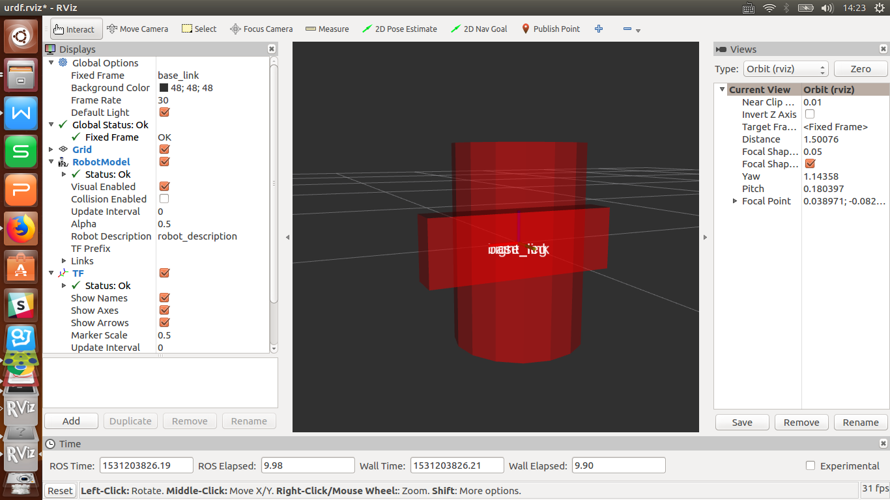

可以发现两个形状重叠在一起。

修改urdf文件

03-origins.urdf

```xml
<?xml version="1.0"?>
<robot name="origins">
  <link name="base_link">
    <visual>
      <geometry>
        <cylinder length="0.6" radius="0.2"/>
      </geometry>
    </visual>
  </link>

  <link name="right_leg">
    <visual>
      <geometry>
        <box size="0.6 .1 .2"/>
      </geometry>
      <origin rpy="0 1.57075 0" xyz="0 0 -0.3"/>
    </visual>
  </link>

  <joint name="base_to_right_leg" type="fixed">
    <parent link="base_link"/>
    <child link="right_leg"/>
    <origin xyz="0 -0.22 .25"/>
  </joint>
    
</robot>
```

我们可以看到立方体的长宽高分别为0.6米，0.1米和0.2米。

```xml
      <geometry>
        <box size="0.6 .1 .2"/>
      </geometry>
```

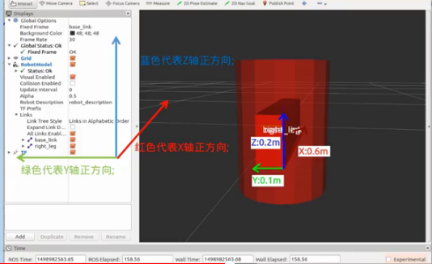

从rviz中可以看出两个形状现在重叠在一起，那是因为这两个link有相同的坐标原点，如果我们不想从这两个link重叠在一块就必须为right_leg定义不同的坐标原点，即设定不同的origin属性值。

```xml
      <origin rpy="0 1.57075 0" xyz="0 0 -0.3"/>
```

roll横滚角=0，pitch俯仰角=0，yaw偏行角=-0.3度

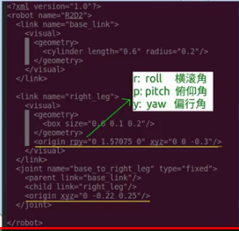

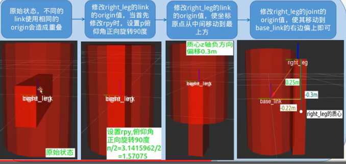

上图可以看到，这两个形状的拼接，可以分解成图中的过程。

运行。打开一个终端，运行

```bash
roslaunch urdf_tutorial display.launch model:=03-origins.urdf  
```

Launch文件运行后会根据机器人模型URDF文件中的每一个`link`创建一个`tf`坐标，rviz将根据这些`tf`坐标信息来判断每一个`link`该如何显示，如果URDF中的`link`没有生成对应的`tf`坐标，那么rviz将会其以白色的形式在`base_link`的`origin`处显示。

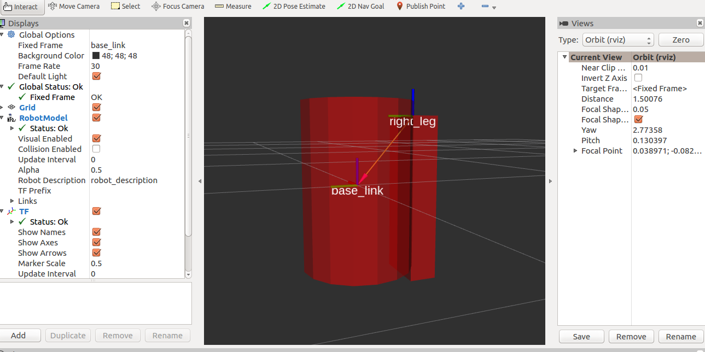

接下来继续完善该模型，增加R2D2的左腿而且修改一下颜色，因为默认的颜色是红色。在原来代码的基础上增加left_leg的`link`和`joint`。为`link`增加颜色的宏定义，方便后面多次调用，减少代码量且方便代码维护。RGB值，最后一个是透明度：1代表黑色。0代表白色。

04-materials.urdf

```xml
<?xml version="1.0"?>
<robot name="materials">

  <material name="blue">
    <color rgba="0 0 .8 1"/>
  </material>

  <material name="black">
    <color rgba="0 0 0 1"/>
  </material>

  <material name="white">
    <color rgba="1 1 1 1"/>
  </material>


  <link name="base_link">
    <visual>
      <geometry>
        <cylinder length="0.6" radius="0.2"/>
      </geometry>
      <material name="blue"/>
    </visual>
  </link>

  <link name="right_leg">
    <visual>
      <geometry>
        <box size="0.6 .2 .1"/>
      </geometry>
      <origin rpy="0 1.57075 0" xyz="0 0 -0.3"/>
      <material name="white"/>
    </visual>
  </link>

  <joint name="base_to_right_leg" type="fixed">
    <parent link="base_link"/>
    <child link="right_leg"/>
    <origin xyz="0 -0.22 .25"/>
  </joint>

  <link name="left_leg">
    <visual>
      <geometry>
        <box size="0.6 .2 .1"/>
      </geometry>
      <origin rpy="0 1.57075 0" xyz="0 0 -0.3"/>
      <material name="white"/>
    </visual>
  </link>

  <joint name="base_to_left_leg" type="fixed">
    <parent link="base_link"/>
    <child link="left_leg"/>
    <origin xyz="0 0.22 .25"/>
  </joint>

</robot>
```

添加`material`定义

```xml
  <material name="blue">
    <color rgba="0 0 .8 1"/>
  </material>

  <material name="black">
    <color rgba="0 0 0 1"/>
  </material>

  <material name="white">
    <color rgba="1 1 1 1"/>
  </material>
```

引用`material`定义

```xml
  <link name="left_leg">
    <visual>
      <geometry>
        <box size="0.6 .2 .1"/>
      </geometry>
      <origin rpy="0 1.57075 0" xyz="0 0 -0.3"/>
      <material name="white"/>
    </visual>
  </link>
```

运行。打开一个终端，输入

```bash
roslaunch urdf_tutorial display.launch model:=04-materials.urdf
```

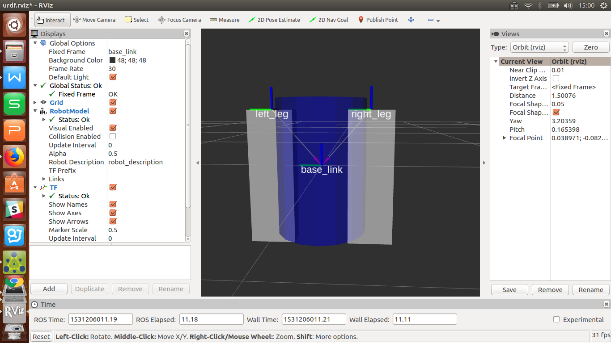


05-visual.urdf

```xml
<?xml version="1.0"?>
<robot name="visual">
    <material name="red">
        <color rgba="0.8 0 0 1"/>
    </material>
    <material name="green">
        <color rgba="0 0.8 0 1"/>
    </material>
    <material name="blue">
        <color rgba="0 0 0.8 1"/>
    </material>
    <material name="black">
        <color rgba="0 0 0 1"/>
    </material>
    <material name="white">
        <color rgba="1 1 1 1"/>
    </material>
    <link name="base_link">
        <visual>
            <geometry>
                <cylinder length="0.6" radius="0.2"/>
            </geometry>
            <material name="red"/>
        </visual>
    </link>
    <link name="right_leg">
        <visual>
            <geometry>
                <box size="0.6 .1 .2"/>
            </geometry>
            <origin rpy="0 1.57075 0" xyz="0 0 -0.3"/>
            <material name="blue"/>
        </visual>
    </link>
    <joint name="base_to_right_leg" type="fixed">
        <parent link="base_link"/>
        <child link="right_leg"/>
        <origin xyz="0 -0.22 .25"/>
    </joint>
    <link name="right_base">
        <visual>
            <geometry>
                <box size="0.4 .1 .1"/>
            </geometry>
            <material name="white"/>
        </visual>
    </link>
    <joint name="right_base_joint" type="fixed">
        <parent link="right_leg"/>
        <child link="right_base"/>
        <origin xyz="0 0 -0.6"/>
    </joint>
    <link name="right_front_wheel">
        <visual>
            <origin rpy="1.57075 0 0" xyz="0 0 0"/>
            <geometry>
                <cylinder length="0.1" radius="0.035"/>
            </geometry>
            <material name="black"/>
            <origin rpy="0 0 0" xyz="0 0 0"/>
        </visual>
    </link>
    <joint name="right_front_wheel_joint" type="fixed">
        <axis rpy="0 0 0" xyz="0 1 0"/>
        <parent link="right_base"/>
        <child link="right_front_wheel"/>
        <origin rpy="0 0 0" xyz="0.133333333333 0 -0.085"/>
    </joint>
    <link name="right_back_wheel">
        <visual>
            <origin rpy="1.57075 0 0" xyz="0 0 0"/>
            <geometry>
                <cylinder length="0.1" radius="0.035"/>
            </geometry>
            <material name="black"/>
        </visual>
    </link>
    <joint name="right_back_wheel_joint" type="fixed">
        <axis rpy="0 0 0" xyz="0 1 0"/>
        <parent link="right_base"/>
        <child link="right_back_wheel"/>
        <origin rpy="0 0 0" xyz="-0.133333333333 0 -0.085"/>
    </joint>
    <link name="left_leg">
        <visual>
            <geometry>
                <box size="0.6 .1 .2"/>
            </geometry>
            <origin rpy="0 1.57075 0" xyz="0 0 -0.3"/>
            <material name="blue"/>
        </visual>
    </link>
    <joint name="base_to_left_leg" type="fixed">
        <parent link="base_link"/>
        <child link="left_leg"/>
        <origin xyz="0 0.22 .25"/>
    </joint>
    <link name="left_base">
        <visual>
            <geometry>
                <box size="0.4 .1 .1"/>
            </geometry>
            <material name="white"/>
        </visual>
    </link>
    <joint name="left_base_joint" type="fixed">
        <parent link="left_leg"/>
        <child link="left_base"/>
        <origin xyz="0 0 -0.6"/>
    </joint>
    <link name="left_front_wheel">
        <visual>
            <origin rpy="1.57075 0 0" xyz="0 0 0"/>
            <geometry>
                <cylinder length="0.1" radius="0.035"/>
            </geometry>
            <material name="black"/>
        </visual>
    </link>
    <joint name="left_front_wheel_joint" type="fixed">
        <parent link="left_base"/>
        <child link="left_front_wheel"/>
        <origin rpy="0 0 0" xyz="0.133333333333 0 -0.085"/>
    </joint>
    <link name="left_back_wheel">
        <visual>
            <origin rpy="1.57075 0 0" xyz="0 0 0"/>
            <geometry>
                <cylinder length="0.1" radius="0.035"/>
            </geometry>
            <material name="black"/>
        </visual>
    </link>
    <joint name="left_back_wheel_joint" type="fixed">
        <axis rpy="0 0 0" xyz="0 1 0"/>
        <parent link="left_base"/>
        <child link="left_back_wheel"/>
        <origin rpy="0 0 0" xyz="-0.133333333333 0 -0.085"/>
    </joint>
    <joint name="gripper_extension" type="prismatic">
        <parent link="base_link"/>
        <child link="gripper_pole"/>
        <limit effort="1000.0" lower="-0.38" upper="0" velocity="0.5"/>
        <origin rpy="0 0 0" xyz="0.19 0 .2"/>
    </joint>
    <link name="gripper_pole">
        <visual>
            <geometry>
                <cylinder length="0.2" radius=".01"/>
            </geometry>
            <origin rpy="0 1.57075 0 " xyz="0.1 0 0"/>
        </visual>
    </link>
    <joint name="left_gripper_joint" type="fixed">
        <origin rpy="0 0 0" xyz="0.2 0.01 0"/>
        <parent link="gripper_pole"/>
        <child link="left_gripper"/>
    </joint>
    <link name="left_gripper">
        <visual>
            <origin rpy="0.0 0 0" xyz="0 0 0"/>
            <geometry>
                <mesh filename="package://pr2_description/meshes/gripper_v0/l_finger.dae"/>
            </geometry>
        </visual>
    </link>
    <joint name="left_tip_joint" type="fixed">
        <parent link="left_gripper"/>
        <child link="left_tip"/>
    </joint>
    <link name="left_tip">
        <visual>
            <origin rpy="0.0 0 0" xyz="0.09137 0.00495 0"/>
            <geometry>
                <mesh filename="package://pr2_description/meshes/gripper_v0/l_finger_tip.dae"/>
            </geometry>
        </visual>
    </link>
    <joint name="right_gripper_joint" type="fixed">
        <origin rpy="0 0 0" xyz="0.2 -0.01 0"/>
        <parent link="gripper_pole"/>
        <child link="right_gripper"/>
    </joint>
    <link name="right_gripper">
        <visual>
            <origin rpy="-3.1415 0 0" xyz="0 0 0"/>
            <geometry>
                <mesh filename="package://pr2_description/meshes/gripper_v0/l_finger.dae"/>
            </geometry>
        </visual>
    </link>
    <joint name="right_tip_joint" type="fixed">
        <parent link="right_gripper"/>
        <child link="right_tip"/>
    </joint>
    <link name="right_tip">
        <visual>
            <origin rpy="-3.1415 0 0" xyz="0.09137 0.00495 0"/>
            <geometry>
                <mesh filename="package://pr2_description/meshes/gripper_v0/l_finger_tip.dae"/>
            </geometry>
        </visual>
    </link>
    <link name="head">
        <visual>
            <geometry>
                <sphere radius="0.2"/>
            </geometry>
            <material name="white"/>
        </visual>
    </link>
    <joint name="head_swivel" type="fixed">
        <parent link="base_link"/>
        <child link="head"/>
        <origin xyz="0 0 0.3"/>
    </joint>
    <link name="box">
        <visual>
            <geometry>
                <box size=".08 .08 .08"/>
            </geometry>
            <material name="green"/>
        </visual>
    </link>
    <joint name="tobox" type="fixed">
        <parent link="head"/>
        <child link="box"/>
        <origin xyz="0.1814 0 0.1414"/>
    </joint>
</robot>
```
05-visual.urdf添加了左右底座的代码，加底座下面的轮子，加脑袋，加眼睛，加连接杆。下面讲一下连接杆的代码，我们可以把连接杆看成一个圆柱体。它的半径为0.01米，高度为0.2米。欧拉角的三个分量为<0 1.57075 0>，朝x轴方向位移0.1米。连接类型是fixed，表示不可移动。它连接`base_link`和`gripper_pole`两个部分，该joint相对`base_link`坐标轴往x轴移动0.19米，往z轴移动0.2米

```xml
<joint name="gripper_extension" type="prismatic">
    <parent link="base_link"/>
    <child link="gripper_pole"/>
    <limit effort="1000.0" lower="-0.38" upper="0" velocity="0.5"/>
    <origin rpy="0 0 0" xyz="0.19 0 .2"/>
  </joint>

  <link name="gripper_pole">
    <visual>
      <geometry>
        <cylinder length="0.2" radius=".01"/>
      </geometry>
      <origin rpy="0 1.57075 0 " xyz="0.1 0 0"/>
    </visual>
  </link>
```

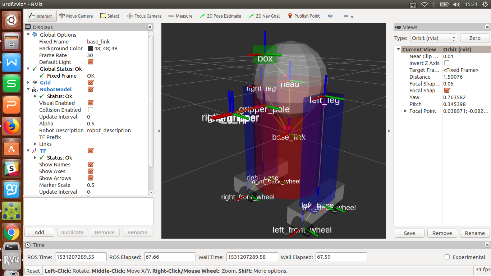

去掉rviz左边的RobotModel选项，在TF选项下只勾出：`Show Names`和`Show arrows`。下图，我们可以看到可视化的模型是什么样子，这个框架都是固定的，不能动。

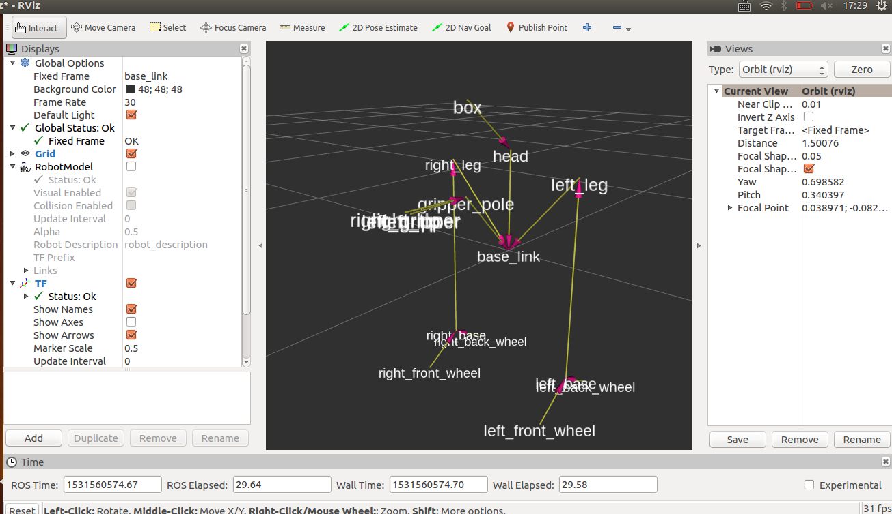

## 5. 为可视化模型的关节增加运动物理属性

**要点**

- 修改代码为URDF模型增加`joint`属性
- 运行URDF模型，查看修改后的结果
- 为URDF模型增加物理属性

**任务分解**

修改代码为URDF模型增加`joint`属性

任务要求：前面我们搭建了R2D2的机器人可视化模型，然而，之前搭建的模型就像是积木一样，不能够运动，并不能满足我们实际想要的需求。在实际的生活中，我们看到过商城的扫地机器人、公司中的智能对话机器人等，它们能够运动，人脸识别，甚至能够像人一样对话，这里从简单的操作开始，为可视化模型的关节增加运动属性。

**知识点** 了解urdf文件中的continuous、revolute、prismatic

**子任务1**

为了能够给模型增添类似于轮子的属性。这个练习的代码是在修改前面练习代码基础上进行修改的，为`joint`增加相应的移动属性。我们首先为r2d2的车轮`joint`增加`continuous`属性，这样车轮就可以旋转运动了。参考07-physics.urdf

步骤1. 增加`continuous`连续不断旋转的`joint`

右前轮

```xml
  <link name="right_front_wheel">
    <visual>
      <origin rpy="1.57075 0 0" xyz="0 0 0"/>
      <geometry>
        <cylinder length="0.1" radius="0.035"/>
      </geometry>
      <material name="black"/>
      <origin rpy="0 0 0" xyz="0 0 0"/>
    </visual>
  </link>
  <joint name="right_front_wheel_joint" type="continuous">
    <axis rpy="0 0 0" xyz="0 1 0"/>
    <parent link="right_base"/>
    <child link="right_front_wheel"/>
    <origin rpy="0 0 0" xyz="0.133333333333 0 -0.085"/>
  </joint>
```

右后轮

```xml
  <link name="right_back_wheel">
    <visual>
      <origin rpy="1.57075 0 0" xyz="0 0 0"/>
      <geometry>
        <cylinder length="0.1" radius="0.035"/>
      </geometry>
      <material name="black"/>
    </visual>
  </link>
  <joint name="right_back_wheel_joint" type="continuous">
    <axis rpy="0 0 0" xyz="0 1 0"/>
    <parent link="right_base"/>
    <child link="right_back_wheel"/>
    <origin rpy="0 0 0" xyz="-0.133333333333 0 -0.085"/>
  </joint>
```

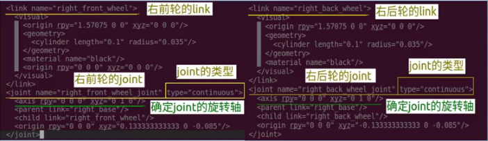

相关代码讲解

将右前轮和右后轮的`joint`类型从`fixed`改为`continus`，这样`joint`就可以不断的旋转，但是如果要想旋转，就需要确定`joint`的旋转轴，因此增加了`axis`属性，这里`rpy`属性没用可设置为0或者不写也行，对于xyz我们将y设置为1，说明我们需要让该joint围绕y轴进行旋转。

问题：为什么我们要增加axis增加为属性，并且把y置为1？

答：我们之所以想要车轮的joint围绕y轴进行旋转是由于x轴朝前，y轴是横向的，如下图所示，我们可以得知4个车轮的坐标轴方向都相同，我们需要4个车轮都围绕坐标轴的y轴旋转，同理我们修改左前后轮的代码也应该相同，在这里我们将axis的rpy属性删除也是可以的，因此我们只需要xyz属性。

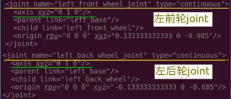

下图是三个坐标轴，进一步理解轮子转动的过程。

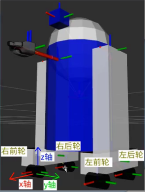

r2d2的头部joint也增加continuous属性

```xml
  <link name="head">
    <visual>
      <geometry>
        <sphere radius="0.2"/>
      </geometry>
      <material name="white"/>
    </visual>
  </link>
  <joint name="head_swivel" type="continuous">
    <axis xyz="0 0 1"/>
    <parent link="base_link"/>
    <child link="head"/>
    <origin xyz="0 0 0.3"/>
  </joint>
```

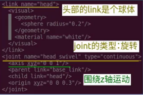

机器人头部的坐标系

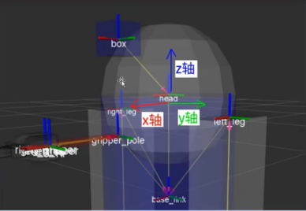

问题：为什么这个机器人模型能够左右摇头？

答：如上图所示，头部的`joint`在旋转时要围绕z轴了，因为只有围绕z轴旋转才能让脑袋左右旋转，如果我们改为围绕y轴旋转那么就会实现成让脑袋上下点头的运动了。

步骤2. 增加`revolute`外向旋转的`joint`。为r2d2的抓取手指joint设置运动属性revolute，这是一种新的运动属性，类似于我们人的手指，就像拇指和食指的运动特性，只能向外旋转和向内合拢，这样就能夹住物体。

```xml
  <joint name="left_gripper_joint" type="revolute">
    <axis xyz="0 0 1"/>
    <limit effort="1000.0" lower="0.0" upper="0.548" velocity="0.5"/>
    <origin rpy="0 0 0" xyz="0.2 0.01 0"/>
    <parent link="gripper_pole"/>
    <child link="left_gripper"/>
  </joint>

  <link name="left_gripper">
    <visual>
      <origin rpy="0.0 0 0" xyz="0 0 1"/>
      <geometry>
        <mesh filename="package://pr2_description/meshes/gripper_v0/l_finger.dae"/>
      </geometry>
    </visual>
  </link>
```

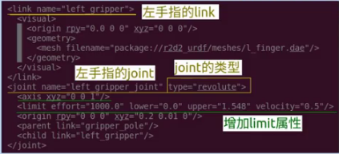

手指的坐标系

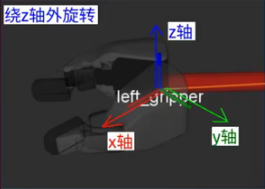

```xml
  <joint name="right_gripper_joint" type="revolute">
    <axis xyz="0 0 -1"/>
    <limit effort="1000.0" lower="0.0" upper="0.548" velocity="0.5"/>
    <origin rpy="0 0 0" xyz="0.2 -0.01 0"/>
    <parent link="gripper_pole"/>
    <child link="right_gripper"/>
  </joint>

  <link name="right_gripper">
    <visual>
      <origin rpy="-3.1415 0 0" xyz="0 0 0"/>
      <geometry>
        <mesh filename="package://pr2_description/meshes/gripper_v0/l_finger.dae"/>
      </geometry>
    </visual>
    <collision>
      <geometry>
        <mesh filename="package://pr2_description/meshes/gripper_v0/l_finger.dae"/>
      </geometry>
      <origin rpy="-3.1415 0 0" xyz="0 0 0"/>
    </collision>
    <inertial>
      <mass value="0.05"/>
      <inertia ixx="1.0" ixy="0.0" ixz="0.0" iyy="1.0" iyz="0.0" izz="1.0"/>
    </inertial>
  </link>
```

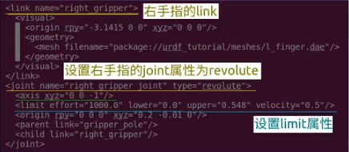

对于`limit`属性只有`revolute`和`prismatic`。`limit`属性只能在`joint`中设置，`effort`属性设置的是抓取的力量的大小限制，单位是N牛顿。只有`revolute`这种抓取的`joint`才用设置`effort`属性。`lower`属性设置的是外旋转的下限，单位是rad弧度，同理`upper`设置向外旋转的上限，1.548rad约是89度。`velocity`设置的是手指运动的速度，对于`revolute`设置的是rad/s，`velocity`设置对于`prismatic`设置的是m/s。


问题:左右手指的设定有什么不同？

答：同样需要设置右边手指的`joint`属性为`revolute`，同样也需要增加旋转轴`axis`属性和限制属性`limit`，包括限制`revolute`的夹取力量大小`effort`。`revolute`外旋时的`lower`最小值和`upper`最大值，它们用弧度表示。最后限制的是`revolute`在夹区时的速度`velocity`，单位为rad/s。我们可以发现，右边手指和左边手指的设定稍有不同，绕着z轴是顺时针旋转，xyz的z轴应该置成-1。

我们可通过下图坐标系来看左右手指的区别

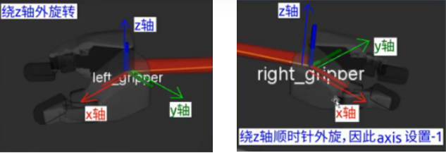

这个练习对于limit中的`effort`和`velocity`属性没有起到明显作用，只关心手指的张开`upper`最大值和合拢起来的`lower`最小值各是多少就行。

步骤3. 增加`prismatic`可以伸长缩短的`joint`，类似于机器人机械臂的伸长和缩短的运动属性。

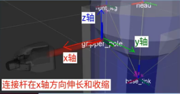

连接杆的伸缩

```xml
  <joint name="gripper_extension" type="prismatic">
    <parent link="base_link"/>
    <child link="gripper_pole"/>
    <limit effort="1000.0" lower="-0.38" upper="0" velocity="0.5"/>
    <origin rpy="0 0 0" xyz="0.19 0 .2"/>
  </joint>

  <link name="gripper_pole">
    <visual>
      <geometry>
        <cylinder length="0.2" radius=".01"/>
      </geometry>
      <origin rpy="0 1.57075 0 " xyz="0.1 0 0"/>
    </visual>
    <collision>
      <geometry>
        <cylinder length="0.2" radius=".01"/>
      </geometry>
      <origin rpy="0 1.57075 0 " xyz="0.1 0 0"/>
    </collision>
    <inertial>
      <mass value="0.05"/>
      <inertia ixx="1.0" ixy="0.0" ixz="0.0" iyy="1.0" iyz="0.0" izz="1.0"/>
    </inertial>
  </link>
```
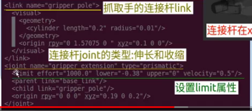


子任务2. 运行URDF模型，查看修改后的结果

任务要求：创建一个看起来像星球大战里的R2D2的机器人可视化模型，事实上，在游戏中，这些机器人能随着键盘的操作，会产生一些复杂的交互。我们在上一个子任务中，已经添加了一些机器人的运动属性，现在我们需要真正的在rviz中可视化我们的机器人结构，并且能够让它动起来。

知识点：
- urdf_to_graphiz的使用
- display.launch来运行出模型，可以让模型动起来

检查r2d2.urdf的语法是否正确

打开一个终端，运行

```bash
check_urdf r2d2.urdf
```

假如我们在编写urdf文件时不小心将属性标签写错，`check_urdf`会检查语法是否正确，有助于快速定位错误后改正。

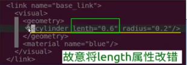

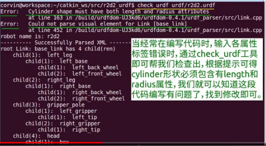

接下来我们就可以尝试使用graphiz将URDF可视化

```bash
urdf_to_graphiz 05-visual.urdf
```

上述命令会新生成.gv和.pdf两个文件，一般情况下我们只需要pdf就可以了，gv 文件本身就是一个类似于txt的文本，和刚刚那个pdf 的数状图一样，只不过是png格式。下图是生成的pdf文件。

```bash
evince 05-visual.pdf
```

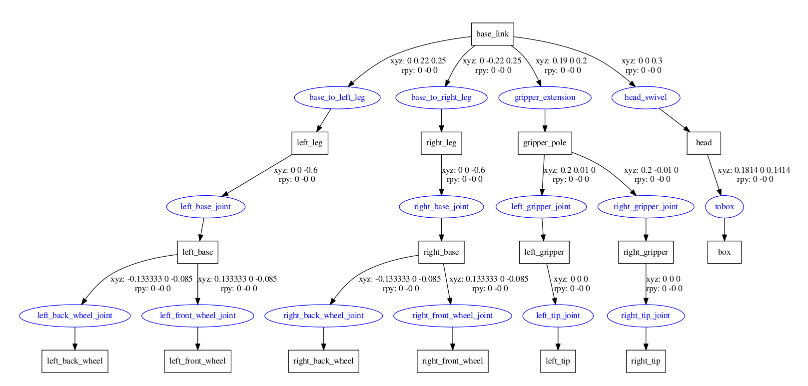

运行launch文件过后，得到的三维立体机器人造型

```bash
roslaunch r2d2_urdf display.launch
```

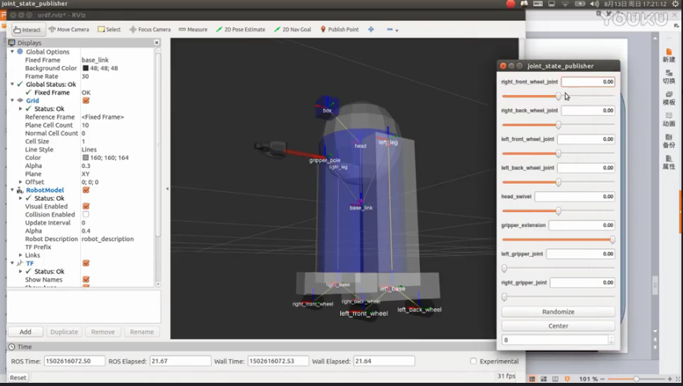

查看topic和node之间的连接图

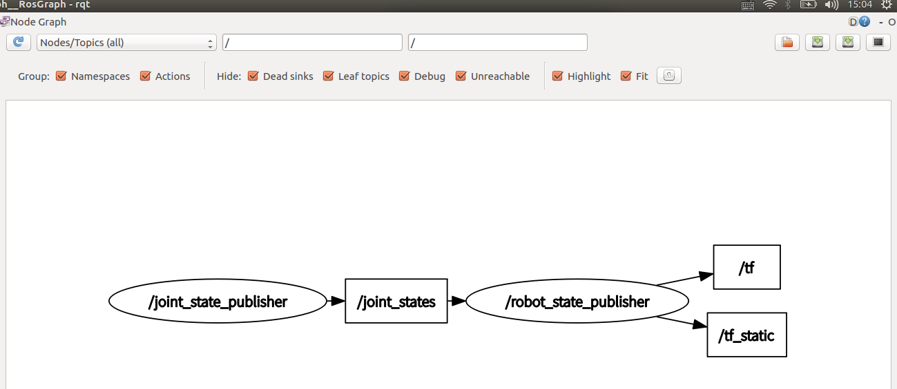

问题：当我们使用rviz中的GUI控制面板来控制各个joint运动，背后机制如何实现呢？

答：GUI首先解析urdf文件，找到所有的非固定joint和相应的limit属性。当滑动GUI上的滑动条时，会发送消息到`/joint_states`话题。节点`/robot_state_publisher`订阅`/joint_states`话题，该节点会计算所有的坐标转换，将计算得到的TF树发送到rviz中进行显示。这样就可以看到机器人当前的位姿信息。

查看所有的话题和节点列表

```bash
rostopic list
rosnode list
```

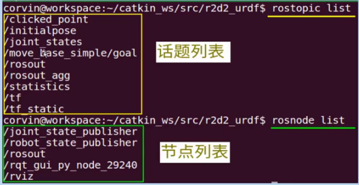

子任务3. 修改代码为URDF模型增加`joint`属性

任务要求：我们学习了如何给机器人增加一些运动属性，现在需要更加丰富一下模型，让它更加接近真实的机器人。真实机器人会有一些物理属性：它的身体和手可能会发生碰撞，连接的关节在运动时会产生摩擦力，关节在运动的过程中会有一个阻尼系数。为了能够让机器人达到我们想要的目的，我们需要增加一些物理属性。

知识点
- 增加物理和碰撞检测属性
- 知道一些常见的物理量的基本定义

问题：如何编写代码增加collision？

答：到目前为止，我们为`link`增加了一个标签`visual`，这个功能是显示机器人的基本形状。为了能够让各个`link`之间具备碰撞检测或者为了可以让机器人在`Gazebo`中进行仿真，我们需要定义`collision`标签，这样`link`就具备了碰撞检测功能。`collsion`是`link`对象的子元素，和`visual`标签在同一个等级。`collision`也需要定义它的形状，和`visual`差不多也是需要`geometry`标签。这个`geometry`标签的格式和`visual`中使用方式相同。

参考07-physics.urdf

相关代码讲解：

1. 更快速的处理：由于为这两个模型做碰撞检测需要进行很复杂的运算，为了简化运算，我们就使用简单的模型。

2. 安全区域：当想为敏感的link设置限制区域时，防止其他link靠近，就需要设置一个比link更大的空间才行。

```xml
  <link name="base_link">
    <visual>
      <geometry>
        <cylinder length="0.6" radius="0.2"/>
      </geometry>
      <material name="red"/>
    </visual>
    <collision>
      <geometry>
        <cylinder length="0.6" radius="0.2"/>
      </geometry>
    </collision>
    <inertial>
      <mass value="10"/>
      <inertia ixx="1.0" ixy="0.0" ixz="0.0" iyy="1.0" iyz="0.0" izz="1.0"/>
    </inertial>
  </link>
```

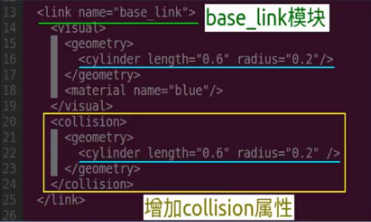

其他link也需要增加的collision属性

```xml
  <link name="right_leg">
    <visual>
      <geometry>
        <box size="0.6 .1 .2"/>
      </geometry>
      <origin rpy="0 1.57075 0" xyz="0 0 -0.3"/>
      <material name="blue"/>
    </visual>
    <collision>
      <geometry>
        <box size="0.6 .1 .2"/>
      </geometry>
      <origin rpy="0 1.57075 0" xyz="0 0 -0.3"/>
    </collision>
    <inertial>
      <mass value="10"/>
      <inertia ixx="1.0" ixy="0.0" ixz="0.0" iyy="1.0" iyz="0.0" izz="1.0"/>
    </inertial>
  </link>
```

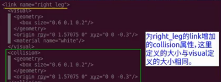

为了使模型能够正常仿真，需要为机器人定义若干物理属性，因为这些属性在物理仿真引擎（Gazebo）需要，每一个`link`元素在进行物理仿真的时候都需要`inertial`惯性标签。`inertial`可从solidworks自动到处，也可以计算，例如调用以下xacro程序，在线计算程序链接https://skyciv.com/free-moment-of-inertia-calculator/。

```xml
<macro name="cylinder_inertia" params="m r h">
      <inertia  ixx="${m*(3*r*r+h*h)/12}" ixy = "0" ixz = "0"
                  iyy="${m*(3*r*r+h*h)/12}" iyz = "0"
                  izz="${m*r*r/2}" /> 
      </macro>

<macro name="box_inertia" params="m x y z">
        <inertia  ixx="${m*(y*y+z*z)/12}" ixy = "0" ixz = "0"
                  iyy="${m*(x*x+z*z)/12}" iyz = "0"
                  izz="${m*(x*x+z*z)/12}" /> 
</macro>

<macro name="sphere_inertia" params="m r">
        <inertia  ixx="${2*m*r*r/5}" ixy = "0" ixz = "0"
                  iyy="${2*m*r*r/5}" iyz = "0"
                  izz="${2*m*r*r/5}" /> 
</macro>
```

下面是07-physics.urdf中`base_link`的`inertial`定义。

```xml
    <inertial>
      <mass value="10"/>
      <inertia ixx="1.0" ixy="0.0" ixz="0.0" iyy="1.0" iyz="0.0" izz="1.0"/>
    </inertial>
```


为机器人的头部增加惯性属性标签

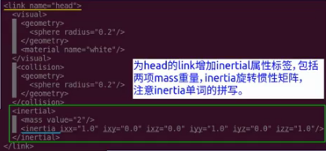

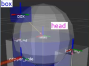

问题：对于3*3的旋转惯性矩阵是怎么得到的呢？

答：我们可以通过模型编程软件（Meshlab）来计算得到，它是一款处理和编辑三维模型的开源软件，它提供处理3D数字化工具产生的原始数据的功能。事实上，Meshlab软件可以计算一些不规则物体的旋转惯性矩阵数据，如果是一些基本的常规物体，可以通过以下网址来查看：

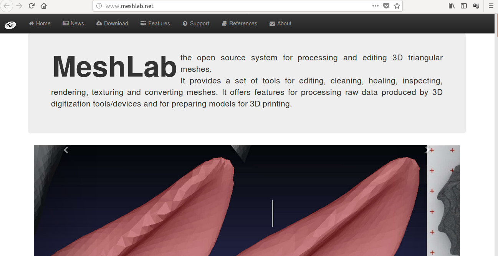

https://en.wikipedia.org/wiki/List_of_moments_of_inertia 

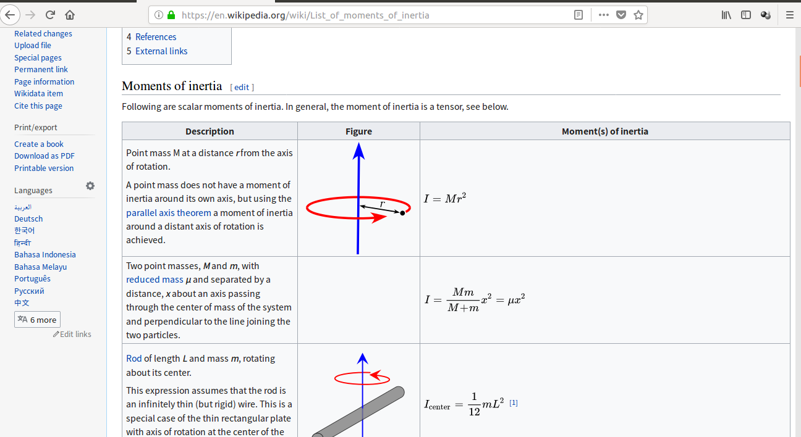

我们也可以定义在`link`间的接触系数，需要在`collsion`标签内定义的子元素，这里有3个属性需要指定：`Mu`摩擦系数，`kp`刚性系数，`kd`阻尼系数。

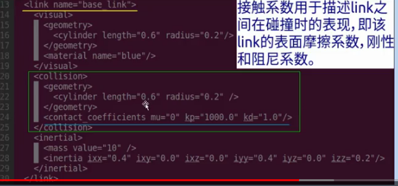

对于关节的动力学模型我们也需要指定`dynamics`标签，在关节运动时主要用到两个属性`Friction`物体的静态摩擦力，对于`prismatic`关节，单位是：牛（N），对于`revolving`关节，单位是（N.m）。`Damping`物体的阻尼值。

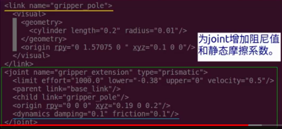

最终修改好的代码在rviz中演示查看结果，发现没有区别，主要是因为增加的这些属性主要是在进行物理仿真时用到的，在后面的Gazebo中运行时就会发现这次增加的代码的效果。

**作业：**尝试给之前的机器人模型添加一些运动属性和物理属性。

 答案：

 参考urdf_tutorial-kinetic文件夹下的urdf文件夹下

- 06-flexible.urdf和07-physics.urdf里面的代码

- 06-flexible.urdf增加了运动属性。

- 07-physics.urdf增加了物理属性。

## 6. Xacro

下面介绍使用Xacro来整理URDF文件描述和搭建URDF可视化模型，有三个子任务，一是使用Xacro来整理URDF文件描述。二是利用URDF构建长方体和小车的模型，并在rviz中可视化。三是在rviz和gazebo中呈现自己的模型。

**子任务1：使用Xacro来整理URDF文件描述**

在机器人各种各样的模型里，我们需要构建自己的造型，我们在之前构造的机器人URDF文件的过程中，发现代码有很多重复的地方，因此，我们希望能够找到一个统一简便的方式来简化代码，通过使用宏命令来构建更精悍短小但又具有更高可读性的XML文件，这里，我们就需要了解使用Xacro来整理URDF文件。

要求：将URDF文件简化为xacro文件

知识点：了解xacro文件带来的简便性和可读性

问题：我们为什么要使用Xacro来整理URDF文件？

答：Xacro（XML Macros）Xacro是一种XML宏语言。使用xacro，可以通过使用宏命令构建更精悍短小但又具有更高可读性的XML文件，这种宏命令可以扩展达到更大的XML表达范围。此包在处理大型XML文档（如机器人说明）时最为有用，它在URDF的包中大量使用。

07-physics.urdf右前轮和右后轮的代码重复性很高。

右前轮

```xml
  <link name="right_front_wheel">
    <visual>
      <origin rpy="1.57075 0 0" xyz="0 0 0"/>
      <geometry>
        <cylinder length="0.1" radius="0.035"/>
      </geometry>
      <material name="black"/>
    </visual>
    <collision>
      <origin rpy="1.57075 0 0" xyz="0 0 0"/>
      <geometry>
        <cylinder length="0.1" radius="0.035"/>
      </geometry>
    </collision>
    <inertial>
      <mass value="1"/>
      <inertia ixx="1.0" ixy="0.0" ixz="0.0" iyy="1.0" iyz="0.0" izz="1.0"/>
    </inertial>
  </link>

  <joint name="right_front_wheel_joint" type="continuous">
    <axis rpy="0 0 0" xyz="0 1 0"/>
    <parent link="right_base"/>
    <child link="right_front_wheel"/>
    <origin rpy="0 0 0" xyz="0.133333333333 0 -0.085"/>
  </joint>
```

右后轮

```xml
  <link name="right_back_wheel">
    <visual>
      <origin rpy="1.57075 0 0" xyz="0 0 0"/>
      <geometry>
        <cylinder length="0.1" radius="0.035"/>
      </geometry>
      <material name="black"/>
    </visual>
    <collision>
      <origin rpy="1.57075 0 0" xyz="0 0 0"/>
      <geometry>
        <cylinder length="0.1" radius="0.035"/>
      </geometry>
    </collision>
    <inertial>
      <mass value="1"/>
      <inertia ixx="1.0" ixy="0.0" ixz="0.0" iyy="1.0" iyz="0.0" izz="1.0"/>
    </inertial>
  </link>

  <joint name="right_back_wheel_joint" type="continuous">
    <axis rpy="0 0 0" xyz="0 1 0"/>
    <parent link="right_base"/>
    <child link="right_back_wheel"/>
    <origin rpy="0 0 0" xyz="-0.133333333333 0 -0.085"/>
  </joint>
```

我们可以看到下面的代码是上面代码的升级版，可维护性更好

```xml
  <xacro:macro name="wheel" params="prefix suffix reflect">

    <link name="${prefix}_${suffix}_wheel">
      <visual>
        <origin xyz="0 0 0" rpy="${pi/2} 0 0" />
        <geometry>
          <cylinder radius="${wheeldiam/2}" length="0.1"/>
        </geometry>
        <material name="black"/>
        <origin xyz="0 0 0" rpy="0 0 0" />
      </visual>
      <collision>
        <origin xyz="0 0 0" rpy="${pi/2} 0 0" />
        <geometry>
          <cylinder radius="${wheeldiam/2}" length="0.1"/>
        </geometry>
        <origin xyz="0 0 0" rpy="0 0 0" />
      </collision>
      <xacro:default_inertial mass="1"/>
    </link>
    <joint name="${prefix}_${suffix}_wheel_joint" type="continuous">
      <axis xyz="0 1 0" rpy="0 0 0" />
      <parent link="${prefix}_base"/>
      <child link="${prefix}_${suffix}_wheel"/>
      <origin xyz="${baselen*reflect/3} 0 -${wheeldiam/2+.05}" rpy="0 0 0"/>
    </joint>
  </xacro:macro>
  
  <xacro:macro name="leg" params="prefix reflect">    
  ...
      <xacro:leg prefix="right" reflect="-1" />
      <xacro:leg prefix="left" reflect="1" />
  ...
  </xacro:macro>
  
  <xacro:wheel prefix="${prefix}" suffix="front" reflect="1"/>
  <xacro:wheel prefix="${prefix}" suffix="back" reflect="-1"/>
```
同样可以比较一下'base_link'，xacro改进过的代码

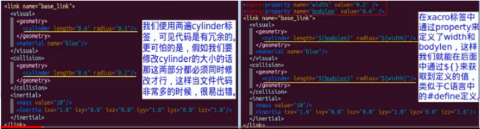

```xml
  <xacro:property name="width" value=".2" />
  <xacro:property name="bodylen" value=".6" />

  <link name="base_link">
    <visual>
      <geometry>
        <cylinder radius="${width}" length="${bodylen}"/>
      </geometry>
      <material name="red"/>
    </visual>
    <collision>
      <geometry>
        <cylinder radius="${width}" length="${bodylen}"/>
      </geometry>
    </collision>
    <xacro:default_inertial mass="10"/>
  </link>
```

技巧1. `property`设置常量

Xacro允许使用`property`设置常量，这样我们可将重复使用的属性值定义为常量，不仅方便了代码的维护，也增强了代码的可读性。如果需要修改`cylinder`的`length`和`radius`属性的值，直接在最开头的property部分修改`width`和`bodylen`的值即可，在取值时需要使用${}，这样所有引用了`width`和`bodylen`的值都会相应的修改。使用xacro后最终生成的代码与urdf原始定义是相同的，只不过完成了简单的字符串替换。在使用xacro的`property`时需要知道，`name`所对应的`value`值会直接替换到${}取值的地方，和C语言宏定义效果相同。

将`xxx.urdf`解析成对应的urdf文件xxx.urdf，命令格式`rosrun xacro xacro.py xxx.urdf.xacro > xxx.urdf`

打开一个终端，输入

```bash
rosrun xacro xacro.py r2d2.xacro > r2d2.urdf
```
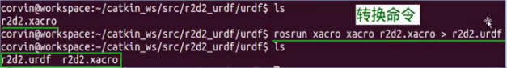

下面我们讲一下常见错误。如果报错，如下图

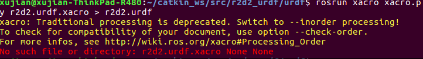

解决办法是重新输入如下，如果没有语法错误，问题解决。

```bash
$ rosrun xacro xacro.py r2d2.urdf.xacro --inorder > r2d2.urdf
```

如xacro文件定义有错误，转换时会报错，如

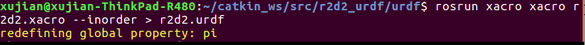

解决办法是打开r2d2.xacro，把重复定义了两遍的`pi`定义那行删去。

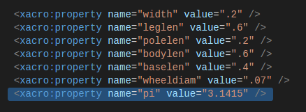

技巧2. 通过macro来简化

我们可以将雷同的代码通过macro来简化

urdf

```xml
  <link name="right_leg">
    <visual>
      <geometry>
        <box size="0.6 .1 .2"/>
      </geometry>
      <origin rpy="0 1.57075 0" xyz="0 0 -0.3"/>
      <material name="blue"/>
    </visual>
    <collision>
      <geometry>
        <box size="0.6 .1 .2"/>
      </geometry>
      <origin rpy="0 1.57075 0" xyz="0 0 -0.3"/>
    </collision>
    <inertial>
      <mass value="10"/>
      <inertia ixx="1.0" ixy="0.0" ixz="0.0" iyy="1.0" iyz="0.0" izz="1.0"/>
    </inertial>
  </link>
```

xacro

```xml
  <xacro:property name="leglen" value=".6" />
  <xacro:property name="pi" value="3.1415" />
  
  <xacro:macro name="leg" params="prefix reflect">
    <link name="${prefix}_leg">
      <visual>
        <geometry>
          <box size="${leglen} .1 .2"/>
        </geometry>
        <origin xyz="0 0 -${leglen/2}" rpy="0 ${pi/2} 0"/>
        <material name="blue"/>
      </visual>
      <collision>
        <geometry>
          <box size="${leglen} .1 .2"/>
        </geometry>
        <origin xyz="0 0 -${leglen/2}" rpy="0 ${pi/2} 0"/>
      </collision>
      <xacro:default_inertial mass="10"/>
    </link>
    ...
  </xacro:macro>
  <xacro:leg prefix="right" reflect="-1" />
```

使用时可以通过把xacro文件转换为URDF文件，转换后的URDF文件和之前的一样。

parameterized Macro带参数的宏定

URDF原代码

```xml
  <link name="right_base">
    <visual>
      <geometry>
        <box size="0.4 .1 .1"/>
      </geometry>
      <material name="white"/>
    </visual>
    <collision>
      <geometry>
        <box size="0.4 .1 .1"/>
      </geometry>
    </collision>
    <inertial>
      <mass value="10"/>
      <inertia ixx="1.0" ixy="0.0" ixz="0.0" iyy="1.0" iyz="0.0" izz="1.0"/>
    </inertial>
  </link>
```

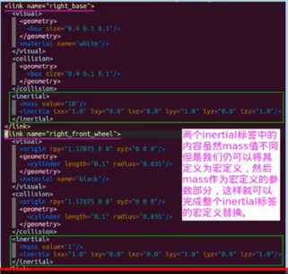

xacro代码

```xml
  <xacro:macro name="default_inertial" params="mass">
    <inertial>
      <mass value="${mass}" />
      <inertia ixx="1.0" ixy="0.0" ixz="0.0" iyy="1.0" iyz="0.0" izz="1.0" />
    </inertial>
  </xacro:macro>

  <link name="base_link">
    <visual>
      <geometry>
        <cylinder radius="${width}" length="${bodylen}"/>
      </geometry>
      <material name="red"/>
    </visual>
    <collision>
      <geometry>
        <cylinder radius="${width}" length="${bodylen}"/>
      </geometry>
    </collision>
    <xacro:default_inertial mass="10"/>
  </link>
```

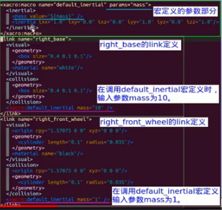

技巧3. 通过Parameterized Macro来简化

我们还可以使用整个块整体作为参数，这样的话，大大减少我们的代码量

- 在指定块参数时，需要在参数名前加上

- 在调用块参数时，需要在xacro后加上insert_block 

- 对于块参数在宏定义中可以多次调用

URDF原代码

```xml
<link name="right_front_wheel">
    <visual>
        <origin rpy="1.57075 0 0" xyz="0 0 0"/>
        <geometry>
            <cylinder length="0.1" radius="0.035"/>
        </geometry>
        <material name="black"/>
    </visual>
    <collision>
        <origin rpy="1.57075 0 0" xyz="0 0 0"/>
        <geometry>
            <cylinder length="0.1" radius="0.035"/>
        </geometry>
    </collision>
    <inertial>
        <mass value="1"/>
        <inertia ixx="1.0" ixy="0.0" ixz="0.0" iyy="1.0" iyz="0.0" izz="1.0"/>
    </inertial>
</link>

<link name="right_back_wheel">
    <visual>
        <origin rpy="1.57075 0 0" xyz="0 0 0"/>
        <geometry>
            <cylinder length="0.1" radius="0.035"/>
        </geometry>
        <material name="black"/>
    </visual>
    <collision>
        <origin rpy="1.57075 0 0" xyz="0 0 0"/>
        <geometry>
            <cylinder length="0.1" radius="0.035"/>
        </geometry>
    </collision>
    <inertial>
        <mass value="1"/>
        <inertia ixx="1.0" ixy="0.0" ixz="0.0" iyy="1.0" iyz="0.0" izz="1.0"/>
    </inertial>
</link>
```

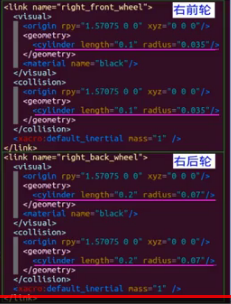

xacro代码

```xml
  <xacro:macro name="wheel" params="prefix suffix reflect">

    <link name="${prefix}_${suffix}_wheel">
      <visual>
        <origin xyz="0 0 0" rpy="${pi/2} 0 0" />
        <geometry>
          <cylinder radius="${wheeldiam/2}" length="0.1"/>
        </geometry>
        <material name="black"/>
        <origin xyz="0 0 0" rpy="0 0 0" />
      </visual>
      <collision>
        <origin xyz="0 0 0" rpy="${pi/2} 0 0" />
        <geometry>
          <cylinder radius="${wheeldiam/2}" length="0.1"/>
        </geometry>
        <origin xyz="0 0 0" rpy="0 0 0" />
      </collision>
      <xacro:default_inertial mass="1"/>
    </link>
    <joint name="${prefix}_${suffix}_wheel_joint" type="continuous">
      <axis xyz="0 1 0" rpy="0 0 0" />
      <parent link="${prefix}_base"/>
      <child link="${prefix}_${suffix}_wheel"/>
      <origin xyz="${baselen*reflect/3} 0 -${wheeldiam/2+.05}" rpy="0 0 0"/>
    </joint>
  </xacro:macro>
  
  <xacro:macro name="leg" params="prefix reflect">    
  ...
      <xacro:leg prefix="right" reflect="-1" />
      <xacro:leg prefix="left" reflect="1" />
  ...
  </xacro:macro>
  
  <xacro:wheel prefix="${prefix}" suffix="front" reflect="1"/>
  <xacro:wheel prefix="${prefix}" suffix="back" reflect="-1"/>
```

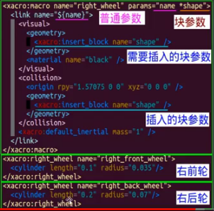

r2d2的左右腿的link和joint定义，发现只有命令时的字符串不同和joint字段的origin不同

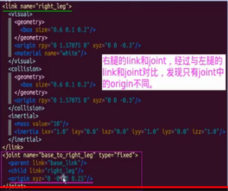

在创建`link`时经常会发现有许多的`link`模块比较雷同，只不过有些`origin`方向略微不同，这时可以使用xacro的宏定义来将这种大块的代码定义为宏定义，这样可以大幅度的减少代码量，我们来看r2d2的左右腿的`link`和`joint`定义，发现只有命令时的字符串不同和joint字段的origin不同。可以将上述的左右腿差不多的代码通过宏定义方式来简化代码结构并增加可维护性。

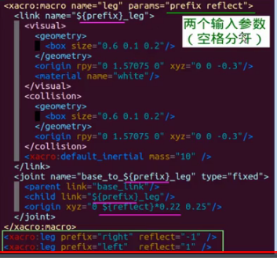

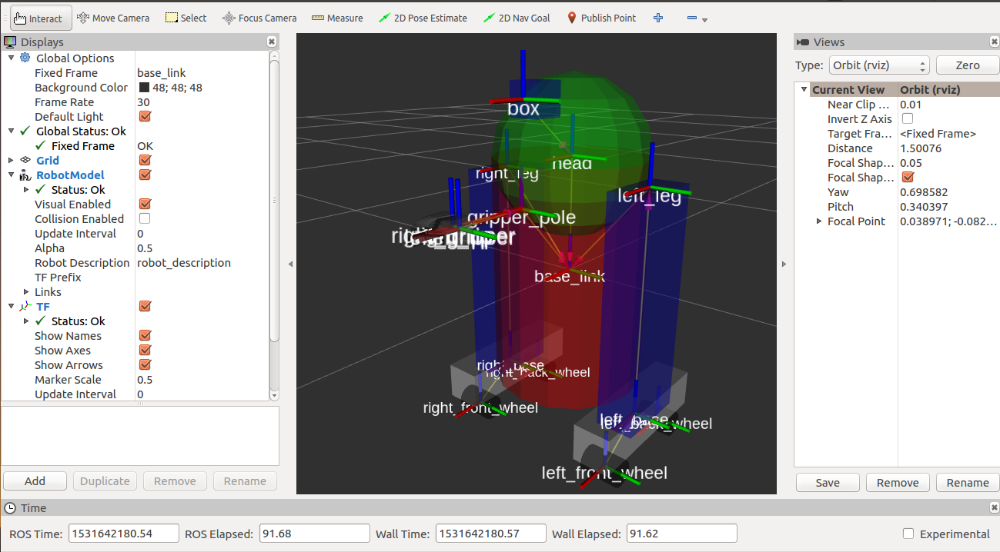

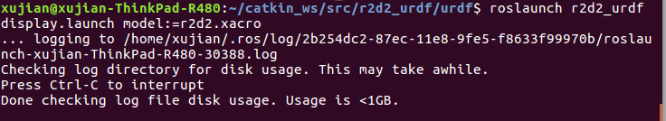

最后，我们在launch文件中加载xacro文件，可视化我们之前的那个机器人模型。

练习：
１. 请把<源码>文件夹下的r2d2_urdf文件夹下的URDF文件夹下的r2d2.xacro转换成r2d2.urdf
２. 到<源码>文件夹下的r2d2_urdf文件夹下的URDF文件夹下08-macroed.urdf.xacro，并理解xacro带来的代码的简洁性

08-macroed.urdf.xacro

```xml
<?xml version="1.0"?>
<robot name="macroed" xmlns:xacro="http://ros.org/wiki/xacro">

  <xacro:property name="width" value=".2" />
  <xacro:property name="leglen" value=".6" />
  <xacro:property name="polelen" value=".2" />
  <xacro:property name="bodylen" value=".6" />
  <xacro:property name="baselen" value=".4" />
  <xacro:property name="wheeldiam" value=".07" />
  <xacro:property name="pi" value="3.1415" />

  <material name="red">
    <color rgba="0.8 0 0 1"/>
  </material>  
  <material name="green">
    <color rgba="0 0.8 0 1"/>
  </material>
  <material name="blue">
    <color rgba="0 0 0.8 1"/>
  </material>
  <material name="black">
    <color rgba="0 0 0 1"/>
  </material>
  <material name="white">
    <color rgba="1 1 1 1"/>
  </material>

  <xacro:macro name="default_inertial" params="mass">
    <inertial>
      <mass value="${mass}" />
      <inertia ixx="1.0" ixy="0.0" ixz="0.0" iyy="1.0" iyz="0.0" izz="1.0" />
    </inertial>
  </xacro:macro>

  <link name="base_link">
    <visual>
      <geometry>
        <cylinder radius="${width}" length="${bodylen}"/>
      </geometry>
      <material name="red"/>
    </visual>
    <collision>
      <geometry>
        <cylinder radius="${width}" length="${bodylen}"/>
      </geometry>
    </collision>
    <xacro:default_inertial mass="10"/>
  </link>


  <xacro:macro name="wheel" params="prefix suffix reflect">

    <link name="${prefix}_${suffix}_wheel">
      <visual>
        <origin xyz="0 0 0" rpy="${pi/2} 0 0" />
        <geometry>
          <cylinder radius="${wheeldiam/2}" length="0.1"/>
        </geometry>
        <material name="black"/>
      </visual>
      <collision>
        <origin xyz="0 0 0" rpy="${pi/2} 0 0" />
        <geometry>
          <cylinder radius="${wheeldiam/2}" length="0.1"/>
        </geometry>
      </collision>
      <xacro:default_inertial mass="1"/>
    </link>
    <joint name="${prefix}_${suffix}_wheel_joint" type="continuous">
      <axis xyz="0 1 0" rpy="0 0 0" />
      <parent link="${prefix}_base"/>
      <child link="${prefix}_${suffix}_wheel"/>
      <origin xyz="${baselen*reflect/3} 0 -${wheeldiam/2+.05}" rpy="0 0 0"/>
    </joint>

  </xacro:macro>

  <xacro:macro name="leg" params="prefix reflect">
    <link name="${prefix}_leg">
      <visual>
        <geometry>
          <box size="${leglen} .1 .2"/>
        </geometry>
        <origin xyz="0 0 -${leglen/2}" rpy="0 ${pi/2} 0"/>
        <material name="blue"/>
      </visual>
      <collision>
        <geometry>
          <box size="${leglen} .1 .2"/>
        </geometry>
        <origin xyz="0 0 -${leglen/2}" rpy="0 ${pi/2} 0"/>
      </collision>
      <xacro:default_inertial mass="10"/>
    </link>

    <joint name="base_to_${prefix}_leg" type="fixed">
      <parent link="base_link"/>
      <child link="${prefix}_leg"/>
      <origin xyz="0 ${reflect*(width+.02)} .25" />
    </joint>
    
    <link name="${prefix}_base">
      <visual>
        <geometry>
          <box size="${baselen} .1 .1"/>
        </geometry>
        <material name="white"/>
      </visual>
      <collision>
        <geometry>
          <box size="${baselen} .1 .1"/>
        </geometry>
      </collision>
      <xacro:default_inertial mass="10"/>
    </link>
    
    <joint name="${prefix}_base_joint" type="fixed">
      <parent link="${prefix}_leg"/>
      <child link="${prefix}_base"/>
      <origin xyz="0 0 ${-leglen}" />
    </joint>
    <xacro:wheel prefix="${prefix}" suffix="front" reflect="1"/>
    <xacro:wheel prefix="${prefix}" suffix="back" reflect="-1"/>
  </xacro:macro>
  <xacro:leg prefix="right" reflect="-1" />
  <xacro:leg prefix="left" reflect="1" />

  <joint name="gripper_extension" type="prismatic">
    <parent link="base_link"/>
    <child link="gripper_pole"/>
    <limit effort="1000.0" lower="-${width*2-.02}" upper="0" velocity="0.5"/>
    <origin rpy="0 0 0" xyz="${width-.01} 0 .2"/>
  </joint>

  <link name="gripper_pole">
    <visual>
      <geometry>
        <cylinder length="${polelen}" radius=".01"/>
      </geometry>
      <origin xyz="${polelen/2} 0 0" rpy="0 ${pi/2} 0 "/>
    </visual>
    <collision>
      <geometry>
        <cylinder length="${polelen}" radius=".01"/>
      </geometry>
      <origin xyz="${polelen/2} 0 0" rpy="0 ${pi/2} 0 "/>
    </collision>
    <xacro:default_inertial mass=".05"/>
  </link>

  <xacro:macro name="gripper" params="prefix reflect">
    <joint name="${prefix}_gripper_joint" type="revolute">
      <axis xyz="0 0 ${reflect}"/>
      <limit effort="1000.0" lower="0.0" upper="0.548" velocity="0.5"/>
      <origin rpy="0 0 0" xyz="${polelen} ${reflect*0.01} 0"/>
      <parent link="gripper_pole"/>
      <child link="${prefix}_gripper"/>
    </joint>
    <link name="${prefix}_gripper">
      <visual>
        <origin rpy="${(reflect-1)/2*pi} 0 0" xyz="0 0 0"/>
        <geometry>
          <mesh filename="package://pr2_description/meshes/gripper_v0/l_finger.dae"/>
        </geometry>
      </visual>
      <collision>
        <geometry>
          <mesh filename="package://pr2_description/meshes/gripper_v0/l_finger.dae"/>
        </geometry>
        <origin rpy="${(reflect-1)/2*pi} 0 0" xyz="0 0 0"/>
      </collision>
      <xacro:default_inertial mass=".05"/>
    </link>

    <joint name="${prefix}_tip_joint" type="fixed">
      <parent link="${prefix}_gripper"/>
      <child link="${prefix}_tip"/>
    </joint>
    <link name="${prefix}_tip">
      <visual>
        <origin rpy="${(reflect-1)/2*pi} 0 0" xyz="0.09137 0.00495 0"/>
        <geometry>
          <mesh filename="package://pr2_description/meshes/gripper_v0/l_finger_tip.dae"/>
        </geometry>
      </visual>
      <collision>
        <geometry>
          <mesh filename="package://pr2_description/meshes/gripper_v0/l_finger_tip.dae"/>
        </geometry>
        <origin rpy="${(reflect-1)/2*pi} 0 0" xyz="0.09137 0.00495 0"/>
      </collision>
      <xacro:default_inertial mass=".05"/>
    </link>
  </xacro:macro>

  <xacro:gripper prefix="left" reflect="1" />
  <xacro:gripper prefix="right" reflect="-1" />

  <link name="head">
    <visual>
      <geometry>
        <sphere radius="${width}"/>
      </geometry>
      <material name="green"/>
    </visual>
    <collision>
      <geometry>
        <sphere radius="${width}"/>
      </geometry>
    </collision>
    <xacro:default_inertial mass="2"/>
  </link>

  <joint name="head_swivel" type="continuous">
    <parent link="base_link"/>
    <child link="head"/>
    <axis xyz="0 0 1"/>
    <origin xyz="0 0 ${bodylen/2}"/>
  </joint>

  <link name="box">
    <visual>
      <geometry>
        <box size=".08 .08 .08"/>
      </geometry>
      <material name="blue"/>
      <origin xyz="-0.04 0 0"/>
    </visual>
    <collision>
      <geometry>
        <box size=".08 .08 .08"/>
      </geometry>
    </collision>
    <xacro:default_inertial mass="1"/>
  </link>

  <joint name="tobox" type="fixed">
    <parent link="head"/>
    <child link="box"/>
    <origin xyz="${.707*width+0.04} 0 ${.707*width}"/>
  </joint>

</robot>
```
**代码注释**

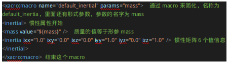

通过macro来简化leg和wheel

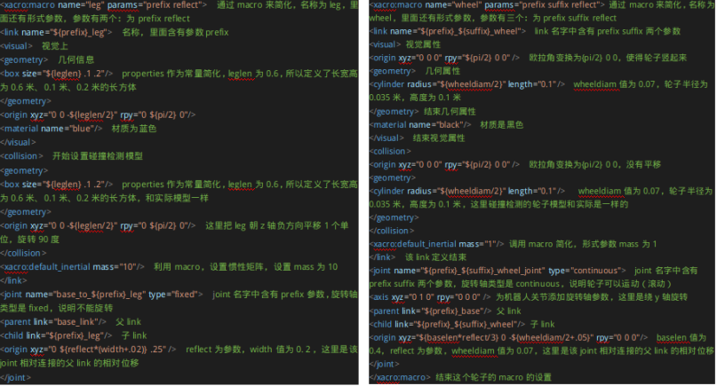

**子任务2：利用urdf中构建长方体和小车的模型， 并在rviz中可视化**

构建复杂模型，往往从简单的模型开始，这个练习我们尝试自己去构建一些基本造型，再去构建小车模型，最后在仿真环境中模拟小车模型，从而实现让我们的机器人模型在实验室环境中呈现。

步骤
- 建立package

- 编写display.launch和urdf文件

编写urdf文件，参考robot1.urdf

```xml
<?xml version="1.0"?>
  <robot name="Robot1">
    <link name="base_link">
      <visual>
        <geometry>
          <box size="0.2 .3 .1"/>
        </geometry>
        <origin rpy="0 0 0" xyz="0 0 0.05"/>
        <material name="white">
          <color rgba="1 1 1 1"/>
        </material>
      </visual>
    </link>

    <link name="wheel_1">
      <visual>
        <geometry>
          <cylinder length="0.05" radius="0.05"/>
        </geometry>
        <origin rpy="0 1.5 0" xyz="0.1 0.1 0"/>
          <material name="black">
            <color rgba="0 0 0 1"/>
          </material>
      </visual>
    </link>

    <link name="wheel_2">
      <visual>
        <geometry>
          <cylinder length="0.05" radius="0.05"/>
        </geometry>
        <origin rpy="0 1.5 0" xyz="-0.1 0.1 0"/>
        <material name="black"/>
      </visual>
    </link>
    <link name="wheel_3">
      <visual>
        <geometry>
          <cylinder length="0.05" radius="0.05"/>
        </geometry>
        <origin rpy="0 1.5 0" xyz="0.1 -0.1 0"/>
        <material name="black"/>
      </visual>
    </link>

    <link name="wheel_4">
      <visual>
        <geometry>
          <cylinder length="0.05" radius="0.05"/>
        </geometry>
        <origin rpy="0 1.5 0" xyz="-0.1 -0.1 0"/>
        <material name="black"/>
      </visual>
    </link>

    <joint name="base_to_wheel1" type="fixed">
      <parent link="base_link"/>
      <child link="wheel_1"/>
      <origin xyz="0 0 0"/>
    </joint>

    <joint name="base_to_wheel2" type="fixed">
      <parent link="base_link"/>
      <child link="wheel_2"/>
      <origin xyz="0 0 0"/>
    </joint>

    <joint name="base_to_wheel3" type="fixed">
      <parent link="base_link"/>
      <child link="wheel_3"/>
      <origin xyz="0 0 0"/>
    </joint>

    <joint name="base_to_wheel4" type="fixed">
      <parent link="base_link"/>
      <child link="wheel_4"/>
      <origin xyz="0 0 0"/>
    </joint>
  </robot>
```

编写launch文件，参考display.launch

```xml
<launch>
    <arg name="model" />
    <arg name="gui" default="False" />
    <param name="robot_description" textfile="$(find sam_load_urdf_into_rviz)/urdf/robot1.urdf" />
    <param name="use_gui" value="$(arg gui)"/>
    <node name="joint_state_publisher" pkg="joint_state_publisher" type="joint_state_publisher" ></node>
    <node name="robot_state_publisher" pkg="robot_state_publisher" type="state_publisher" />
    <node name="rviz" pkg="rviz" type="rviz" />
</launch>
```

运行，打开终端，输入`roslaunch sam_load_urdf_into_rviz display.launch`，手动添加`RobotModel`，`Fixed Frame`选择`base_link`或其它非`map`帧，如`wheel_1`。

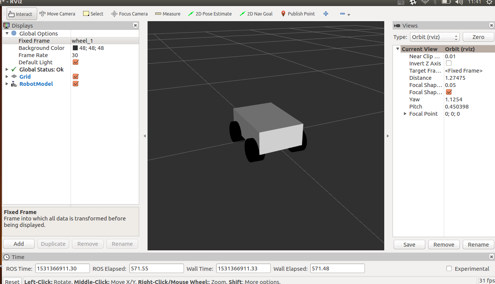

**子任务3. 在仿真环境中呈现自己的模型**

机器人往往是在一定场景下工作的，我们需要在实际的场景下仿真它的三维模型，这样就能够考察模型的运动属性和物理属性，这个练习，是在rviz和Gazebo中可视化新的小车模型。 

知识点
- 了解urdf
- rviz和Gazebo

display_gazebo_rviz.launch

```xml
<launch>
  <!-- these are the arguments you can pass this launch file, for example paused:=true -->
  <arg name="paused" default="false"/>
  <arg name="use_sim_time" default="true"/>
  <arg name="gui" default="true"/>
  <arg name="headless" default="false"/>
  <arg name="debug" default="false"/>

  <!-- We resume the logic in empty_world.launch, changing only the name of the world to be launched -->
  <include file="$(find gazebo_ros)/launch/empty_world.launch">
    <arg name="world_name" value="$(find urdf_demo)/worlds/mybot.world"/>
    <arg name="debug" value="$(arg debug)" />
    <arg name="gui" value="$(arg gui)" />
    <arg name="paused" value="$(arg paused)"/>
    <arg name="use_sim_time" value="$(arg use_sim_time)"/>
    <arg name="headless" value="$(arg headless)"/>
  </include>

 <rosparam file="$(find urdf_demo)/mybot_control/config/mybot_control.yaml" command="load"/>
    <param name="robot_description"
	 command="$(find xacro)/xacro.py '$(find urdf_demo)/mybot_description/xacro/mybot.xacro'" />
    <node name="joint_state_publisher" pkg="joint_state_publisher" type="joint_state_publisher"/>
    <node name="robot_state_publisher" pkg="robot_state_publisher" type="state_publisher" />
    <node name="urdf_spawner" pkg="gazebo_ros" type="spawn_model" respawn="false" output="screen" 
        args="-urdf -model mybot -param robot_description -x 0 -y 0 -z 0"/> 
	<node pkg="rviz" type="rviz" name="rviz" args="-d $(find urdf_demo)/gazebo.rviz" output="screen"/> 

</launch>
```
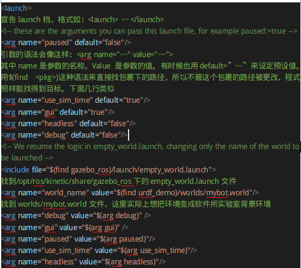

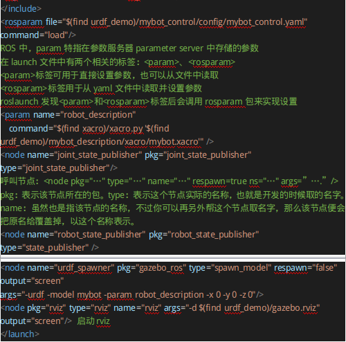

mybot_control.yaml

参数文件

```
mybot:
  # Publish all joint states -----------------------------------
  joint_state_controller:
    type: joint_state_controller/JointStateController
    publish_rate: 50  
  

  # Effort Controllers ---------------------------------------
  leftWheel_effort_controller:
    type: effort_controllers/JointEffortController
    joint: mybot_left_wheel_hinge
    pid: {p: 100.0, i: 0.1, d: 10.0}
  rightWheel_effort_controller:
    type: effort_controllers/JointEffortController
    joint: mybot_right_wheel_hinge
    pid: {p: 100.0, i: 0.1, d: 10.0}
```

mybot.world

Gazebo场景文件

```xml
<?xml version="1.0" ?>
<sdf version="1.4">
  <!-- We use a custom world for the rrbot so that the camera angle is launched correctly -->

  <world name="default">
    <include>
      <uri>model://ground_plane</uri>
    </include>

    <!-- Global light source -->
    <include>
      <uri>model://sun</uri>
    </include>

    <!-- Focus camera on tall pendulum -->
    <gui fullscreen='0'>
      <camera name='user_camera'>
        <pose>4.927360 -4.376610 3.740080 0.000000 0.275643 2.356190</pose>
        <view_controller>orbit</view_controller>
      </camera>
    </gui>

  </world>
</sdf>
```
mybot.xacro

作用：urdf模型文件，嵌套包含materials.xacro、macros.xacro、mybot.gazebo三个文件。

```xml
<?xml version="1.0"?>
<robot name="mybot" xmlns:xacro="http://www.ros.org/wiki/xacro">
        <!-- Put here the robot description -->
<xacro:property name="PI" value="3.1415926535897931"/>

<xacro:property name="chassisHeight" value="0.1"/>
<xacro:property name="chassisLength" value="0.4"/>
<xacro:property name="chassisWidth" value="0.2"/>
<xacro:property name="chassisMass" value="5"/>

<xacro:property name="casterRadius" value="0.05"/>
<xacro:property name="casterMass" value="3"/>

<xacro:property name="wheelWidth" value="0.05"/>
<xacro:property name="wheelRadius" value="0.1"/>
<xacro:property name="wheelPos" value="0.2"/>
<xacro:property name="wheelMass" value="2"/>

<xacro:property name="cameraSize" value="0.05"/>
<xacro:property name="cameraMass" value="0.1"/>
<xacro:include filename="$(find urdf_demo)/mybot_description/xacro/mybot.gazebo" />
<xacro:include filename="$(find urdf_demo)/mybot_description/xacro/materials.xacro" />
<xacro:include filename="$(find urdf_demo)/mybot_description/xacro/macros.xacro" />
<link name="mybot_link" />

<joint name="base_joint" type="fixed">
  <parent link="mybot_link"/>
  <child link="mybot_chassis"/>
</joint>
<link name='mybot_chassis'>
  <collision> 
    <origin xyz="0 0 ${wheelRadius}" rpy="0 0 0"/> 
    <geometry> 
      <box size="${chassisLength} ${chassisWidth} ${chassisHeight}"/> 
    </geometry> 
  </collision>
  <visual> 
    <origin xyz="0 0 ${wheelRadius}" rpy="0 0 0"/> 
    <geometry> 
      <box size="${chassisLength} ${chassisWidth} ${chassisHeight}"/> 
    </geometry> 
    <material name="orange"/>
  </visual>
  <inertial> 
    <origin xyz="0 0 ${wheelRadius}" rpy="0 0 0"/> 
    <mass value="${chassisMass}"/> 
    <box_inertia m="${chassisMass}" x="${chassisLength}" y="${chassisWidth}" z="${chassisHeight}"/>
  </inertial>
</link>
<joint name="fixed" type="fixed">
  <parent link="mybot_chassis"/>
  <child link="mybot_caster_wheel"/>
</joint>

<link name="mybot_caster_wheel">
  <collision>
    <origin xyz="${casterRadius-chassisLength/2} 0 ${casterRadius-chassisHeight+wheelRadius}" rpy="0 0 0"/>
    <geometry>
      <sphere radius="${casterRadius}"/>
    </geometry>
  </collision>
  
  <visual>
    <origin xyz="${casterRadius-chassisLength/2} 0 ${casterRadius-chassisHeight+wheelRadius}" rpy="0 0 0"/>
    <geometry>
      <sphere radius="${casterRadius}"/>
    </geometry>
    <material name="white"/>
  </visual>

  <inertial>
    <origin xyz="${casterRadius-chassisLength/2} 0 ${casterRadius-chassisHeight+wheelRadius}" rpy="0 0 0"/>
    <mass value="${casterMass}"/>
    <sphere_inertia m="${casterMass}" r="${casterRadius}"/>
  </inertial>
</link>
<link name="mybot_left_wheel">
  <collision>
    <origin xyz="0 0 0" rpy="0 ${PI/2} ${PI/2}" />
    <geometry>
      <cylinder length="${wheelWidth}" radius="${wheelRadius}"/>
    </geometry>
  </collision>

  <visual>
    <origin xyz="0 0 0" rpy="0 ${PI/2} ${PI/2}" />
    <geometry>
      <cylinder length="${wheelWidth}" radius="${wheelRadius}"/>
    </geometry>
    <material name="white"/>
  </visual>

  <inertial>
    <origin xyz="0 0 0" rpy="0 ${PI/2} ${PI/2}" />
    <mass value="${wheelMass}"/>
    <cylinder_inertia m="${wheelMass}" r="${wheelRadius}" h="${wheelWidth}"/>
  </inertial>
</link>

<joint name="mybot_left_wheel_hinge" type="continuous">
  <parent link="mybot_chassis"/>
  <child link="mybot_left_wheel"/>
<origin xyz="${-wheelPos+chassisLength/2} ${1*wheelWidth/2+1*chassisWidth/2} ${wheelRadius}" rpy="0 0 0" />
  <axis xyz="0 1 0" rpy="0 0 0" />
  <limit effort="100" velocity="100"/>
  <joint_properties damping="0.0" friction="0.0"/>
</joint>


<transmission name="left_trans">
  <type>transmission_interface/SimpleTransmission</type>
  <joint name="mybot_left_wheel_hinge"> 
  	<hardwareInterface>EffortJointInterface</hardwareInterface>
  </joint>
  <actuator name="leftMotor">
    <hardwareInterface>EffortJointInterface</hardwareInterface>
    <mechanicalReduction>1</mechanicalReduction>
  </actuator>
</transmission>
<link name="mybot_right_wheel">
  <collision>
    <origin xyz="0 0 0" rpy="0 ${PI/2} ${PI/2}" />
    <geometry>
      <cylinder length="${wheelWidth}" radius="${wheelRadius}"/>
    </geometry>
  </collision>

  <visual>
    <origin xyz="0 0 0" rpy="0 ${PI/2} ${PI/2}" />
    <geometry>
      <cylinder length="${wheelWidth}" radius="${wheelRadius}"/>
    </geometry>
    <material name="white"/>
  </visual>

  <inertial>
    <origin xyz="0 0 0" rpy="0 ${PI/2} ${PI/2}" />
    <mass value="${wheelMass}"/>
    <cylinder_inertia m="${wheelMass}" r="${wheelRadius}" h="${wheelWidth}"/>
  </inertial>
</link>

<joint name="mybot_right_wheel_hinge" type="continuous">
  <parent link="mybot_chassis"/>
  <child link="mybot_right_wheel"/>
<origin xyz="${-wheelPos+chassisLength/2} ${-1*wheelWidth/2+(-1)*chassisWidth/2} ${wheelRadius}" rpy="0 0 0" />
  <axis xyz="0 1 0" rpy="0 0 0" />
  <limit effort="100" velocity="100"/>
  <joint_properties damping="0.0" friction="0.0"/>
</joint>


<transmission name="right_trans">
  <type>transmission_interface/SimpleTransmission</type>
  <joint name="mybot_right_wheel_hinge">
  <hardwareInterface>EffortJointInterface</hardwareInterface>
   </joint>
  <actuator name="rightMotor">
    <hardwareInterface>EffortJointInterface</hardwareInterface>
    <mechanicalReduction>1</mechanicalReduction>
  </actuator>
</transmission>

</robot>
```

materials.xacro

作用：设置material颜色

```xml
<?xml version="1.0"?>
<robot name="mybot" xmlns:xacro="http://www.ros.org/wiki/xacro">
<material name="black">
  <color rgba="0.0 0.0 0.0 1.0"/>
</material>

<material name="blue">
  <color rgba="0.0 0.0 0.8 1.0"/>
</material>

<material name="green">
  <color rgba="0.0 0.8 0.0 1.0"/>
</material>

<material name="grey">
  <color rgba="0.2 0.2 0.2 1.0"/>
</material>

<material name="orange">
  <color rgba="${255/255} ${108/255} ${10/255} 1.0"/>
</material>

<material name="brown">
  <color rgba="${222/255} ${207/255} ${195/255} 1.0"/>
</material>

<material name="red">
  <color rgba="0.8 0.0 0.0 1.0"/>
</material>

<material name="white">
  <color rgba="1.0 1.0 1.0 1.0"/>
</material>
</robot>
```

mybot.gazebo

作用：添加gazebo需要的控制器和设置物理属性

```xml
<?xml version="1.0"?>
<robot xmlns:xacro="http://www.ros.org/wiki/xacro">
 <gazebo>
   <plugin name="gazebo_ros_control" filename="libgazebo_ros_control.so">
   </plugin>
 </gazebo>

 <gazebo>
  <plugin name="differential_drive_controller" filename="libgazebo_ros_diff_drive.so">
    <robotNamespace>/</robotNamespace>
    <alwaysOn>true</alwaysOn>
    <legacyMode>false</legacyMode>
    <updateRate>50</updateRate>
    <leftJoint>mybot_left_wheel_hinge</leftJoint>
    <rightJoint>mybot_right_wheel_hinge</rightJoint>
    <wheelSeparation>${chassisWidth+wheelWidth}</wheelSeparation>
    <wheelDiameter>${2*wheelRadius}</wheelDiameter>
    <torque>20</torque>
    <commandTopic>mybot_cmd_vel</commandTopic>
    <odometryTopic>mybot_odom</odometryTopic>
    <odometryFrame>odom</odometryFrame>
    <robotBaseFrame>mybot_link</robotBaseFrame>
  </plugin>
</gazebo>

 <gazebo>
  <plugin name="ground_truth" filename="libgazebo_ros_p3d.so">
    <frameName>map</frameName>
    <bodyName>mybot_chassis</bodyName>
    <topicName>odom</topicName>
    <updateRate>30.0</updateRate>
  </plugin>
</gazebo>

<gazebo reference="mybot_chassis">
  <material>Gazebo/Orange</material>
</gazebo>
<gazebo reference="caster_wheel">
  <mu1>0.0</mu1>
  <mu2>0.0</mu2>
  <material>Gazebo/Red</material>
</gazebo>
<gazebo reference="right_wheel">
  <mu1 value="1.0"/>
  <mu2 value="1.0"/>
  <kp  value="10000000.0" />
  <kd  value="1.0" />
  <fdir1 value="1 0 0"/>
  <material>Gazebo/Black</material>
</gazebo>
<gazebo reference="left_wheel">
  <mu1 value="1.0"/>
  <mu2 value="1.0"/>
  <kp  value="10000000.0" />
  <kd  value="1.0" />
  <fdir1 value="1 0 0"/>
  <material>Gazebo/Black</material>
</gazebo>

</robot>
```

macros.xacro

作用：计算inertia

```xml
<?xml version="1.0"?>
<robot name="mybot" xmlns:xacro="http://www.ros.org/wiki/xacro">
<macro name="cylinder_inertia" params="m r h">
  <inertia  ixx="${m*(3*r*r+h*h)/12}" ixy = "0" ixz = "0"
    iyy="${m*(3*r*r+h*h)/12}" iyz = "0"
    izz="${m*r*r/2}"
  />
</macro>

<macro name="box_inertia" params="m x y z">
  <inertia  ixx="${m*(y*y+z*z)/12}" ixy = "0" ixz = "0"
    iyy="${m*(x*x+z*z)/12}" iyz = "0"
    izz="${m*(x*x+z*z)/12}"
  />
</macro>

<macro name="sphere_inertia" params="m r">
  <inertia  ixx="${2*m*r*r/5}" ixy = "0" ixz = "0"
    iyy="${2*m*r*r/5}" iyz = "0"
    izz="${2*m*r*r/5}"
  />
</macro>
</robot>
```
可视化的小车

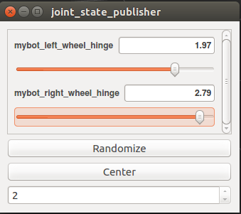


把机器人模型隐藏后，坐标系的分布情况，显示各`link`的坐标系。

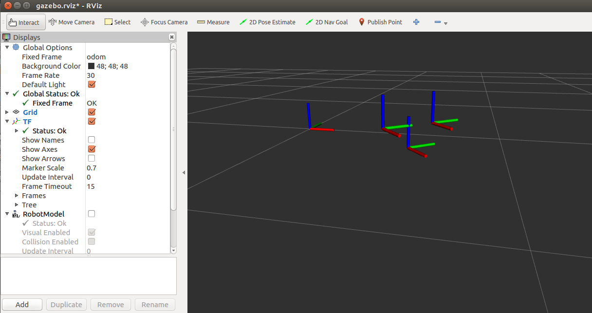

Gazebo可视化的结果


## 7. URDF练习三连结杆的制作

大家已经了解了URDF的相应参数的含义，下面动手做一个实际的机器人例子。

**多角度旋转**

对于一般的轴承连结，两个杆连结就只能实现平面上的360度旋转，这也是我们一般的工艺上能够解决的方式，那么要实现空间上的旋转又应该如何呢？

下图只能进行平面上的旋转


**多角度旋转**

下图台灯可以实现多角度的旋转，只要加一个旋转单位就行了。


下图是一个多角度旋转的例子，可以看出，经过多轴承的连结，实现了空间上的旋转。


**link连结图**

下图是要建立模型的`link-joint`结构图，长方体为`link`，椭圆为`joint`，图由三个`joint`连结四个`link`组合而成。


**步骤**

**1. 配置工作空间**

把代码放在自己的软件包路径下。创建一个pkg，命名为r2d2_urdf，创建launch、urdf、rviz、src等目录。

```bash
catkin_create_pkg r2d2_urdf std_mags rospy
cd ~/catkin_ws/src/r2d2_urdf
mkdir urdf launch rviz
```

**拷贝文件**

```bash
roscd urdf_tutorial/rviz
cp * ~/catkin_ws/src/r2d2_urdf/rviz/
cp ../launch/* ~/catkin_ws/src/r2d2_urdf/launch/
```

**更改display.launch**

```xml
<launch>
    <arg name="model" default="$(find r2d2_urdf)/urdf/my_robot.urdf"/>
    <arg name="gui" default="true" />
    <arg name="rvizconfig" default="$(find r2d2_urdf)/rviz/urdf.rviz" />
    <param name="robot_description" command="$(find xacro)/xacro.py $(arg model)" />
    <param name="use_gui" value="$(arg gui)"/>
    <node name="joint_state_publisher" pkg="joint_state_publisher" type="joint_state_publisher" />
    <node name="robot_state_publisher" pkg="robot_state_publisher" type="state_publisher" />
    <node name="rviz" pkg="rviz" type="rviz" args="-d $(arg rvizconfig)" required="true" />
</launch>
```

**编辑urdf文件**

my_robot.urdf

```xml
<?xml version="1.0"?>
<robot name="hand">
    <material name="blue">
        <color rgba="0 0 0.8 1"/>
    </material>
    <material name="black">
        <color rgba="0 0 0 1"/>
    </material>
    <material name="white">
        <color rgba="1 1 1 1"/>
    </material>
    <link name="base_link">
        <visual>
            <geometry>
                <box size="0.4 0.4 0.2"/>
            </geometry>
            <material name="blue"/>
        </visual>
        <collision>
            <geometry>
                <box size="0.4 0.4 0.2"/>
            </geometry>
        </collision>
        <inertial>
            <mass value="10"/>
            <inertia ixx="1.0" ixy="0.0" ixz="0.0" iyy="1.0" iyz="0.0" izz="1.0"/>
        </inertial>
    </link>
    <link name="leg1">
        <visual>
            <geometry>
                <box size="0.05 0.05 0.3"/>
            </geometry>
            <origin rpy="0 0 0" xyz="0 0 -0.15"/>
            <material name="white"/>
        </visual>
        <collision>
            <geometry>
                <box size="0.05 0.05 0.3"/>
            </geometry>
            <origin rpy="0 0 0" xyz="0 0 -0.15"/>
        </collision>
        <inertial>
            <mass value="10"/>
            <inertia ixx="1.0" ixy="0.0" ixz="0.0" iyy="1.0" iyz="0.0" izz="1.0"/>
        </inertial>
    </link>
    <joint name="base_to_leg1" type="continuous">
        <parent link="base_link"/>
        <child link="leg1"/>
        <origin xyz="0 0.15 -0.1"/>
    </joint>
    <link name="leg11">
        <visual>
            <geometry>
                <box size="0.05 0.05 0.3"/>
            </geometry>
            <origin rpy="0 0 0" xyz="0 0 -0.15"/>
            <material name="blake"/>
        </visual>
        <collision>
            <geometry>
                <box size="0.05 0.05 0.3"/>
            </geometry>
            <origin rpy="0 0 0" xyz="0 0 -0.15"/>
        </collision>
        <inertial>
            <mass value="10"/>
            <inertia ixx="1.0" ixy="0.0" ixz="0.0" iyy="1.0" iyz="0.0" izz="1.0"/>
        </inertial>
    </link>
    <joint name="base_to_leg1to11" type="continuous">
        <parent link="leg1"/>
        <child link="leg11"/>
        <axis xyz="0 1 0"/>
        <origin xyz="0 0 -0.3" />
    </joint>
    <link name="leg111">
        <visual>
            <geometry>
                <box size="0.05 0.05 0.3"/>
            </geometry>
            <origin rpy="0 0 0" xyz="0 0 -0.15"/>
            <material name="white"/>
        </visual>
        <collision>
            <geometry>
                <box size="0.05 0.05 0.3"/>
            </geometry>
            <origin rpy="0 0 0" xyz="0 0 -0.15"/>
        </collision>
        <inertial>
            <mass value="10"/>
            <inertia ixx="1.0" ixy="0.0" ixz="0.0" iyy="1.0" iyz="0.0" izz="1.0"/>
        </inertial>
    </link>
    <joint name="base_to_leg11to111" type="continuous">
        <parent link="leg11"/>
        <child link="leg111"/>
        <origin xyz="0 0 -0.3" />
    </joint>
</robot>
```
**my_robot.urdf**

定义机器人名为`hand`，设置`material`颜色。

```xml
<?xml version="1.0"?>
<robot name="hand">
<material name="blue">
    <color rgba="0 0 0.8 1"/>
  </material>
  <material name="black">
    <color rgba="0 0 0 1"/>
  </material>
  <material name="white">
    <color rgba="1 1 1 1"/>
  </material>
```

建立“base_link”。第一个‘link’名称为“base_link”，代表底盘。定义它的`geometry`几何形状，`collision`碰撞形状，`inertial`惯性变量（可使用提供的网上工具计算）。

```xml
<link name="base_link">
    <visual>
      <geometry>
        <box size="0.4 0.4 0.2"/>
      </geometry>
      <material name="blue"/>
    </visual>
    <collision>
      <geometry>
        <box size="0.4 0.4 0.2"/>
      </geometry>
    </collision>
    <inertial>
      <mass value="10"/>
      <inertia ixx="1.0" ixy="0.0" ixz="0.0" iyy="1.0" iyz="0.0" izz="1.0"/>
    </inertial>
  </link>
```

没有`base_link`时会出现如下错误，有时即使不报错，虽然图片正常显示，但是`link`颜色位置就会设置的不准确。
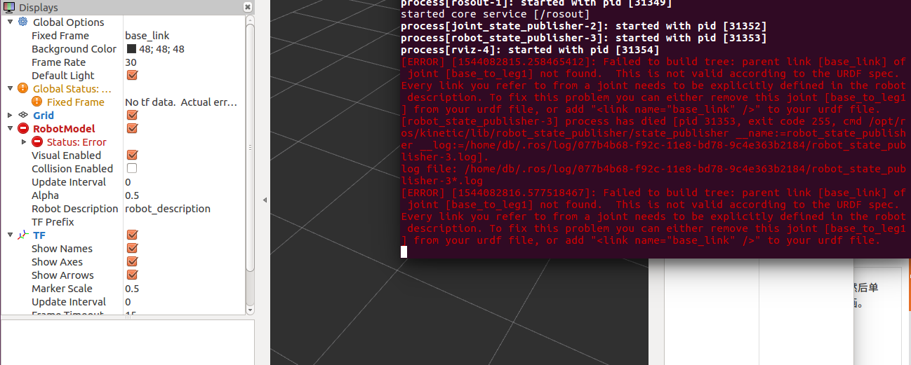
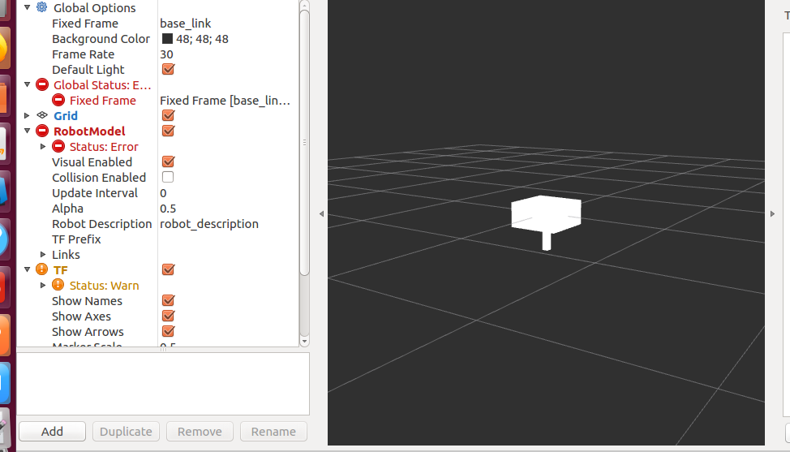

建立了一个蓝色的长0.4米、宽0.4米 高0.2米的长方体。

```xml
    <visual>
      <geometry>
        <box size="0.4 0.4 0.2"/>
      </geometry>
      <material name="blue"/>
    </visual>
```

`collision`是给这个`link`设置了碰转的检测，它的形状是一个长0.4米、宽0.4米 高0.2米的长方体。

```xml
    <collision>
      <geometry>
        <box size="0.4 0.4 0.2"/>
      </geometry>
    </collision>
```

`inertial`是给这个`link`添加惯性矩阵，用于模拟它的物理特性，重量是10kg，`inertia`可以使用给出的网上工具计算，和物体的形状相关。

```xml
    <inertial>
      <mass value="10"/>
      <inertia ixx="1.0" ixy="0.0" ixz="0.0" iyy="1.0" iyz="0.0" izz="1.0"/>
    </inertial>
```

建立`link leg1`

```xml
 <link name="leg1">
    <visual>
      <geometry>
        <box size="0.05 0.05 0.3"/>
      </geometry>
<origin rpy="0 0 0" xyz="0 0 -0.15"/>
      <material name="white"/>
    </visual>
    <collision>
      <geometry>
        <box size="0.05 0.05 0.3"/>
      </geometry>
      <origin rpy="0 0 0" xyz="0 0 -0.15"/>
    </collision>
    <inertial>
      <mass value="10"/>
      <inertia ixx="1.0" ixy="0.0" ixz="0.0" iyy="1.0" iyz="0.0" izz="1.0"/>
    </inertial>
 </link>
```

`leg1`是一个长宽高为0.05m 0.05m 0.3m的长方体。`leg1`基本和之前建立的`base_link`一样，但是多了一些其它的参数,`link`标签的`origin`里的`x,y,z`和`r,p,y`是在使用了`joint`节点后，`link`在`joint`坐标系下的旋转和平移，只改变`link`相对于`joint`的位置，不改变`joint`坐标系的朝向和位置。

```xml
    <visual>
      <geometry>
        <box size="0.05 0.05 0.3"/>
      </geometry>
      <origin rpy="0 0 0" xyz="0 0 -0.15"/>
      <material name="white"/>
    </visual>
    <collision>
```

child `link`标签的`origin`里的`x,y,z`和`r,p,y`是在使用了`joint`节点后，`link`在`joint`坐标系下的旋转和平移，只改变`link`相对于`joint`的位置，不改变`joint`坐标系的朝向和位置。

创建joint`base_to_leg1`

```xml
 <joint name="base_to_leg1" type="continuous">
    <parent link="base_link"/>
    <child link="leg1"/>
    <origin xyz="0 0.15 -0.1"/>
 </joint>
```

参数continuous表示所连结的`child link`是可以旋转的。`parent link`表示这个`joint`所连结的父`link`为`base_link`，`child link`表示这个`joint`连结的`child link`为`leg1`。`joint`中的`x,y,z`和`r,p,y`定义的是`child link`坐标系在`parent link`坐标系中的位置和朝向，如果都为零，则`child link`与`parent link`的坐标系保持一致。

运行display.launch

```bash
$ roslaunch r2d2_urdf display.launch
```


和`base_link`一样，每个`link`的坐标轴的原点一定是在它自己的中心。对于`joint`定义的`origin xyz`是`父子link`坐标原点之间的差向量。


```xml
 <joint name="base_to_leg1" type="continuous">
    <parent link="base_link"/>
    <child link="leg1"/>
    <origin xyz="0 0.15 -0.1"/>
 </joint>
```
同样的我们要实现一个leg长在了一个base盒子上，我们已经将子link坐标恰好移动到盒子的边缘，而其坐标原点是在子link正中，此时根据这里的origin我们移动子link就可以由上一页的图得到这个


```xml
    <visual>
      <geometry>
        <box size="0.05 0.05 0.3"/>
      </geometry>
      <origin rpy="0 0 0" xyz="0 0 -0.15"/>
      <material name="white"/>
    </visual>
```

我们继续建立`joint base_to_leg11`和`base_to_leg111`。由于几个`leg`的大小一样，所以它们与`base_to_leg1`并无不同。

```xml
<link name="leg11">
    <visual>
        <geometry>
            <box size="0.05 0.05 0.3"/>
        </geometry>
        <origin rpy="0 0 0" xyz="0 0 -0.15"/>
        <material name="blake"/>
    </visual>
    <collision>
        <geometry>
            <box size="0.05 0.05 0.3"/>
        </geometry>
        <origin rpy="0 0 0" xyz="0 0 -0.15"/>
    </collision>
    <inertial>
        <mass value="10"/>
        <inertia ixx="1.0" ixy="0.0" ixz="0.0" iyy="1.0" iyz="0.0" izz="1.0"/>
    </inertial>
</link>
<joint name="base_to_leg1to11" type="continuous">
    <parent link="leg1"/>
    <child link="leg11"/>
    <axis xyz="0 1 0"/>
    <origin xyz="0 0 -0.3" />
</joint>
<link name="leg111">
    <visual>
        <geometry>
            <box size="0.05 0.05 0.3"/>
        </geometry>
        <origin rpy="0 0 0" xyz="0 0 -0.15"/>
        <material name="white"/>
    </visual>
    <collision>
        <geometry>
            <box size="0.05 0.05 0.3"/>
        </geometry>
        <origin rpy="0 0 0" xyz="0 0 -0.15"/>
    </collision>
    <inertial>
        <mass value="10"/>
        <inertia ixx="1.0" ixy="0.0" ixz="0.0" iyy="1.0" iyz="0.0" izz="1.0"/>
    </inertial>
</link>
```

这几个‘link’与`base_to_leg1`并无不同，但它们的`joint`却不大相同，对应的`origin xyz`的参数有了改变。为了让`leg`与`leg`之间首尾相连，将`z`的值改为-0.3。

```xml
 <joint name="base_to_leg1to11" type="continuous">
    <parent link="leg1"/>
    <child link="leg11"/>
	<axis xyz="0 1 0"/>
    <origin xyz="0 0 -0.3" />
 </joint>
```

```xml
<joint name="base_to_leg11to111" type="continuous">
    <parent link="leg11"/>
    <child link="leg111"/>
	<axis xyz="0 1 0"/>
	<origin xyz="0 0 -0.3" />
 </joint>
```

保存`urdf`文件到`urdf`目录下


打开一个终端，运行

```bash
roslaunch r2d2_urdf display.launch
```
结果


我们可以通过下图所示的工具，调节参数，使得各个`leg`旋转


