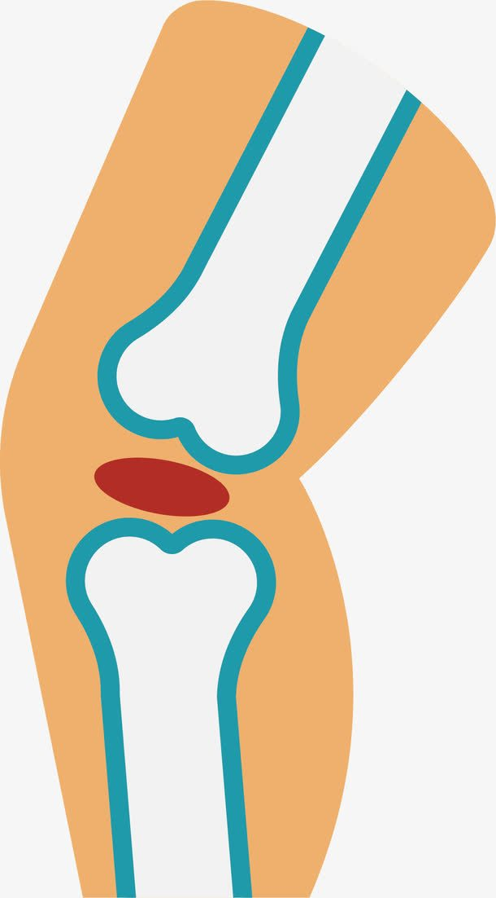
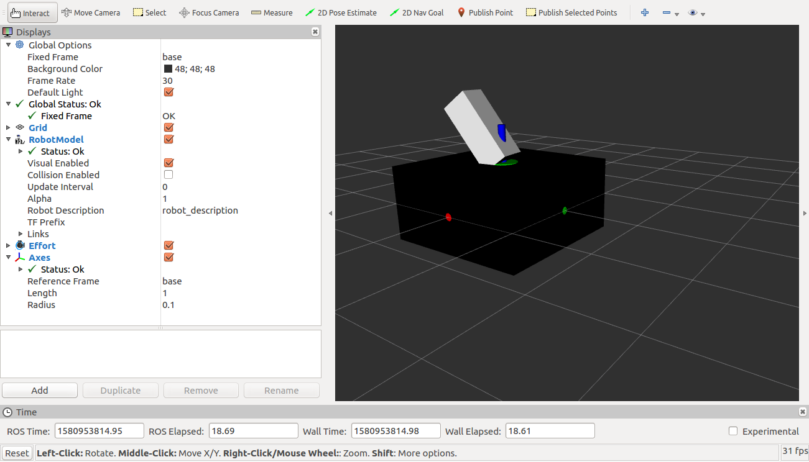
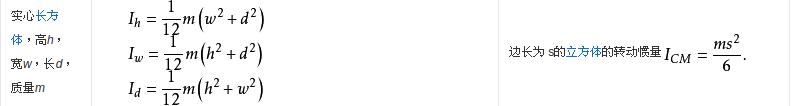
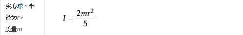
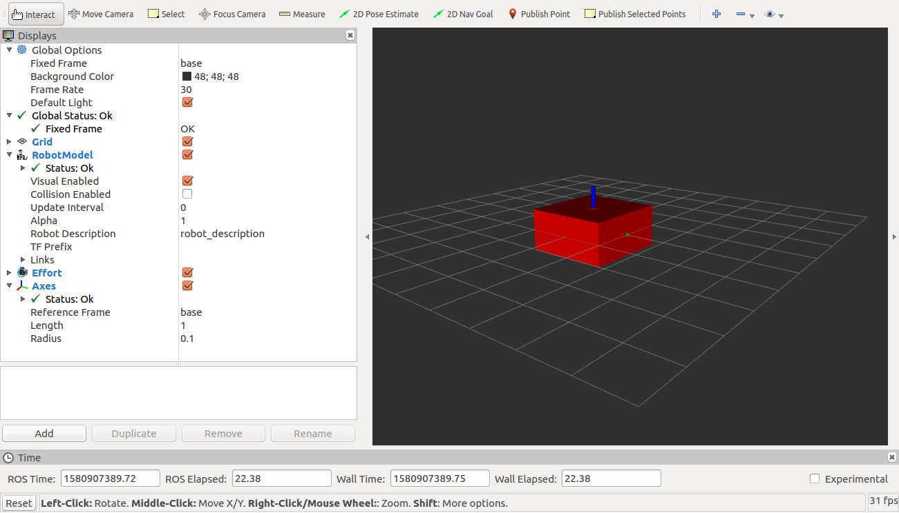

# 7.3 URDF演示

URDF使用xml作为模型描述语言。下面使用一个例子介绍URDF机器人建模。

## 1. URDF的最小结构

两个link，一个joint，一个对应的launch文件。

arm0.urdf:

```xml
<?xml version="1.0"?>
    <robot name="arm">

        <link name="base">
            <visual>
                <geometry>
                    <box size="2 2 1" />
                </geometry>
            </visual>
        </link>

        <link name="arm_base">
            <visual>
                <geometry>
                    <cylinder length="0.01" radius="0.2" />
                </geometry>
                <origin rpy="0 0 0" xyz="0 0 0.005" />
            </visual>
        </link>

        <joint name="base_to_arm_base" type="continuous">
            <parent link="base" />
            <child link="arm_base" />
            <origin rpy="0 0 0" xyz="0 0 0.5" />
            <axis xyz="0 0 1" />
        </joint>

    </robot>
```

注意遵守xml语法规则。

link`base`和`arm_base`，joint用来连接两个link`base_to_arm_base`，joint的类别为`coutinuous`。

## 2. rviz的使用

采用右手定则确定，也可以打开rviz进行确定。红轴是x轴，绿轴是y轴，蓝轴是z轴。


## 3. joint和link

初级的URDF其实非常简单，只有link和joint两部分，先说joint，关节。

关节：



joint标签包含什么：

```xml
<joint name="" type="fixed continuous revolute">
    <parent link=""></parent>
    <child link=""></child>
    <origin rpy="" xyz=""></origin>
    <limit effort="" lower="" upper="" velocity=""></limit>
    <dynamics damping="" friction=""></dynamics>
</joint>
```

注意：这只是一部分。

link标签包含什么：

```xml
<link name="">
    <visual></visual>
    <collision></collision>
    <inertial></inertial>
</link>
```

## 4. 运动学模型


首先，如果是固定关节，关节原点是两个link的任意接触的位置。如果不是固定关节，一般是接触的中心，这个就是，但是仅仅设置关节的原点是不行的，因为这样只是将子link的质心放在了关节原点，link中的原点其实是设置link原点的位置和朝向。

```xml
<origin rpy="" xyz=""></origin>
```

rpy表示roll，pitch，yaw，分别表示绕x轴旋转，绕y轴旋转，绕z轴旋转。xyz表示沿三个轴平移。


为什么先写joint：

在一开始3D建模的时候新手都会有这样一个问题，就是如果不画好设计图，就找不准位置。就像先造好一个人的骨架一样，先确定关节的位置是会简化将来的工作的。

所以首先，我们先确定关节中的origin，就是转换矩阵，要点是这个转换矩阵是相对于上一个关节的原点进行转换，而link的矩阵是关于link的重心进行转换。

link:

声明一个连杆。visual和collsion中的可以包含geometry标签或者写好的dae和stl文件。

geometry标签：就像opengl中的带指针的函数一样，一般有球体，长方体，圆柱，圆锥等等。

origin标签。

可以在rviz中显示tf：


首先要明确一点，urdf是自动继承opengl的分级建模的，所以再次出发就是从父link的原点出发的：

```xml
<joint name="base_to_arm_base" type="continuous">
      <parent link="base" />
      <child link="arm_base" />
      <origin rpy="0 0 0" xyz="0 0 0.5" />
</joint>
```

'\<origin rpy="0 0 0" xyz="0 0 0.5" />'这个关节原点只是相对于上一个关节原点上移了0.5m。

再加入link：

```xml
<link name="lower_arm">
            <visual>
                <geometry>
                    <box size="0.4 0.4 1" />
                </geometry>结果
                <origin rpy="0 0 0" xyz="0 0 0.5" />
            </visual>
        </link>
```


所有的urdf模型部分都遵守这个结构，即link和joint。逻辑正确并无语法错误即可以在rviz中打开模型。

## 5. 颜色

可以在文件开头加入material结构，然后在visual中直接使用：

```xml
<material name="white">
        <color rgba="1 1 1 1" />
    </material>

    <material name="blue">
        <color rgba="0 0 1 1" />
    </material>

    <material name="black">
        <color rgba="0 0 0 1" />
    </material>

    <material name="yellow">
        <color rgba="0 1 1 1" />
    </material>

    <material name="green">
        <color rgba="0 1 0 1" />
    </material>
```

加入：

```xml
<link name="base">
            <visual>
                <geometry>
                    <box size="2 2 1" />
                </geometry>
                <material name="black" />
            </visual>
</link>
```

结果：



```xml
<?xml version="1.0"?>
    <robot name="arm">

    <material name="white">
        <color rgba="1 1 1 1" />
    </material>

    <material name="blue">
        <color rgba="0 0 1 1" />
    </material>

    <material name="black">
        <color rgba="0 0 0 1" />
    </material>

    <material name="yellow">
        <color rgba="0 1 1 1" />
    </material>

    <material name="green">
        <color rgba="0 1 0 1" />
    </material>

    <link name="base">
        <visual>
            <geometry>
                <box size="2 2 1" />
             </geometry>
            <material name="black" />
        </visual>
    </link>

    <link name="arm_base">
        <visual>
            <geometry>
                 <cylinder length="0.01" radius="0.2" />
            </geometry>
            <origin rpy="0 0 0" xyz="0 0 0.005" />
            <material name="green" />
        </visual>
    </link>

     <link name="lower_arm0">
        <visual>
            <geometry>
                <box size="0.4 0.4 0.4" />
            </geometry>
            <origin rpy="0 0 0" xyz="0 0 0.2" />
            <material name="white" />
        </visual>
    </link>

    <link name="lower_arm">
        <visual>
            <geometry>
                <box size="0.4 0.4 2" />
            </geometry>
            <origin rpy="0 0 0" xyz="-0.2 0 0.8" />
            <material name="blue" />
        </visual>
    </link>

    <link name="mid_arm">
        <visual>    
            <geometry>  
                <box size="0.4 0.4 1.5" />
            </geometry>
            <origin rpy="0 0 0" xyz="0.2 0 0.55" />
            <material name="white" />
        </visual>
    </link>

    <link name="upper_arm">
        <visual>
            <geometry>
                <box size="0.4 0.4 1" />
            </geometry>
            <origin rpy="0 0 0" xyz="-0.2 0 0.3" />
            <material name="blue" />
        </visual>
        <collision>
            	<geo
                     	<box size ="0.5 0.5 1.2"
        </collision>
    </link>

    <joint name="base_to_arm_base" type="continuous">
        <parent link="base" />
        <child link="arm_base" />
        <origin rpy="0 0 0" xyz="0 0 0.5" />
        <axis xyz="0 0 1" />
    </joint>

    <joint name="arm_base_to_lower_arm0" type="fixed">
        <parent link="arm_base" />
        <child link="lower_arm0" />
        <origin rpy="0 0 0" xyz="0 0 0.005" />
    </joint>

    <joint name="lower_arm0_to_lower_arm" type="revolute">
        <parent link="lower_arm0" />
        <child link="lower_arm" />
        <origin rpy="0 0 0" xyz="-0.2 0 0.2" />
        <axis xyz="1 0 0" />
        <limit effort="1000" lower="-1.57075" upper="1.57075" velocity="0.5" />
    </joint>

    <joint name="lower_arm_to_mid_arm" type="revolute">
        <parent link="lower_arm" />
        <child link="mid_arm" />
        <origin rpy="0 0 0" xyz="0 0 1.6" />
        <axis xyz="1 0 0" />
        <limit effort="800" lower="-1.57075" upper="1.57075" velocity="0.5" />
    </joint>

    <joint name="mid_arm_to_upper_arm" type="revolute">
        <parent link="mid_arm" />
        <child link="upper_arm" />
        <origin rpy="0 0 0" xyz="0 0 1.1" />
        <axis xyz="1 0 0" />
        <limit effort="600" lower="-1.57075" upper="1.57075" velocity="0.5" />
    </joint>

    </robot> 
```


需要注意的是如果不指明关节旋转的轴，默认是绕x轴旋转，所以可以看到我们指明机械臂底座绕z轴转。

```xml
<joint name="base_to_arm_base" type="continuous">
      <parent link="base" />
      <child link="arm_base" />
      <origin rpy="0 0 0" xyz="0 0 0.5" />
      <axis xyz="0 0 1" />
</joint>
```

\<axis xyz="0 0 1" />

## 6. 动力学模型

如果你想将机器人模型在gazebo中使用，必须加入物理属性。物理属性有collision和inertial，这两个是和visual标签同级的.其中collision和visual差不多，只不过规定的是碰撞的形状，不会显示出来。inertial包括link的质量和惯性表示inertia，这里列举几种常见的形状的宽性属性，由6个惯性张量分量ixx，ixy，ixz，iyy，iyz，izz表示：






示例：

```xml
<link name="arm_base">
        <visual>
            <geometry>
                 <cylinder length="0.01" radius="0.2" />
            </geometry>
            <origin rpy="0 0 0" xyz="0 0 0.005" />
            <material name="green" />
        </visual>
        <collision>
            <geometry>
                 <cylinder length="0.01" radius="0.2" />
            </geometry>
             <origin rpy="0 0 0" xyz="0 0 0.005" />
        </collision>
        <inertial>
            <mass value="0.01" />
            <inertia ixx="0.000100083" ixy="0" ixz="0"
                        iyy="0.000100083" iyz="0"
                        izz="0.0002" />
        </inertial>
    </link>
```

一般除了ixx，iyy和izz其他都是0。

这里就先不加其他的了。

```xml
<?xml version="1.0"?>
    <robot name="arm">

    <material name="white">
        <color rgba="1 1 1 1" />
    </material>

    <material name="blue">
        <color rgba="0 0 1 1" />
    </material>

    <material name="black">
        <color rgba="0 0 0 1" />
    </material>

    <material name="yellow">
        <color rgba="0 1 1 1" />
    </material>

    <material name="green">
        <color rgba="0 1 0 1" />
    </material>

    <link name="base">
        <visual>
            <geometry>
                <box size="2 2 1" />
             </geometry>
            <material name="black" />
        </visual>
    </link>

    <link name="arm_base">
        <visual>
            <geometry>
                 <cylinder length="0.01" radius="0.2" />
            </geometry>
            <origin rpy="0 0 0" xyz="0 0 0.005" />
            <material name="green" />
        </visual>
    </link>

     <link name="lower_arm0">
        <visual>
            <geometry>
                <box size="0.4 0.4 0.4" />
            </geometry>
            <origin rpy="0 0 0" xyz="0 0 0.2" />
            <material name="white" />
        </visual>
    </link>

    <link name="lower_arm">
        <visual>
            <geometry>
                <box size="0.4 0.4 2" />
            </geometry>
            <origin rpy="0 0 0" xyz="-0.2 0 0.8" />
            <material name="blue" />
        </visual>
    </link>

    <link name="mid_arm">
        <visual>    
            <geometry>  
                <box size="0.4 0.4 1.5" />
            </geometry>
            <origin rpy="0 0 0" xyz="0.2 0 0.55" />
            <material name="white" />
        </visual>
    </link>

    <link name="upper_arm">
        <visual>
            <geometry>
                <box size="0.4 0.4 1" />
            </geometry>
            <origin rpy="0 0 0" xyz="-0.2 0 0.3" />
            <material name="blue" />
        </visual>
    </link>

    <link name="gripper_base">  
        <visual>
            <geometry>
                <box size="0.4 0.4 0.4" />
            </geometry>
            <material name="white" />
        </visual>
    </link>

    <link name="left_gripper0">
        <visual>
            <geometry>
                <box size="0.4 0.05 0.2" />
            </geometry>
            <origin xyz="-0.2 -0.1 0" rpy="0 0 0.523598775" />
            <material name="green" />
        </visual>
    </link>

    <link name="right_gripper0">
        <visual>
            <geometry>
                <box size="0.4 0.05 0.2" />
            </geometry>
            <origin xyz="-0.2 0.1 0" rpy="0 0 -0.523598775" />
            <material name="green" />
        </visual>
    </link>

    <link name="left_gripper1">
        <visual>
            <geometry>
                <box size="0.2 0.05 0.2" />
            </geometry>
            <origin xyz="-0.1 0 0" />
        </visual>
    </link>

    <link name="right_gripper1">
        <visual>
            <geometry>
                <box size="0.2 0.05 0.2" />
            </geometry>
            <origin xyz="-0.1 0 0" />
        </visual>
    </link>

    <joint name="base_to_arm_base" type="continuous">
        <parent link="base" />
        <child link="arm_base" />
        <origin rpy="0 0 0" xyz="0 0 0.5" />
        <axis xyz="0 0 1" />
    </joint>

    <joint name="arm_base_to_lower_arm0" type="fixed">
        <parent link="arm_base" />
        <child link="lower_arm0" />
        <origin rpy="0 0 0" xyz="0 0 0.005" />
    </joint>

    <joint name="lower_arm0_to_lower_arm" type="revolute">
        <parent link="lower_arm0" />
        <child link="lower_arm" />
        <origin rpy="0 0 0" xyz="-0.2 0 0.2" />
        <limit effort="1000" lower="-1.57075" upper="1.57075" velocity="0.5" />
    </joint>

    <joint name="lower_arm_to_mid_arm" type="revolute">
        <parent link="lower_arm" />
        <child link="mid_arm" />
        <origin rpy="0 0 0" xyz="0 0 1.6" />
        <limit effort="800" lower="-1.57075" upper="1.57075" velocity="0.5" />
    </joint>

    <joint name="mid_arm_to_upper_arm" type="revolute">
        <parent link="mid_arm" />
        <child link="upper_arm" />
        <origin rpy="0 0 0" xyz="0 0 1.1" />
        <limit effort="600" lower="-1.57075" upper="1.57075" velocity="0.5" />
    </joint>

    <joint name="upper_arm_to_gripper_base" type="revolute">
        <parent link="upper_arm" />
        <child link="gripper_base" />
        <origin rpy="0 0 0" xyz="-0.2 0 1" />
        <axis xyz="0 0 1" />
        <limit effort="500" lower="0" upper="3.1415" velocity="0.5" />
    </joint>

    <joint name="gripper_base_to_left_gripper0" type="revolute">
        <parent link="gripper_base" />
        <child link="left_gripper0" />
        <origin rpy="0 0 0" xyz="-0.2 -0 0" />
        <axis xyz="0 0 1" />
        <limit effort="1500" lower="0" upper="1" velocity="0.5" />
    </joint>

     <joint name="gripper_base_to_right_gripper0" type="revolute">
        <parent link="gripper_base" />
        <child link="right_gripper0" />
        <origin rpy="0 0 0" xyz="-0.2 0 0" />
        <axis xyz="0 0 1" />
        <limit effort="1500" lower="-1" upper="0" velocity="0.5" />
    </joint>

    <joint name="left_gripper_part2" type="revolute">
        <parent link="left_gripper0" />
        <child link="left_gripper1" />
        <origin rpy="0 0 0" xyz="-0.346410161 -0.2 0" />
        <axis xyz="0 0 1" />
        <limit effort="1000" lower="-1.57075" upper="1.57075" velocity="0.5" />
    </joint>

    <joint name="right_gripper_part2" type="revolute">
        <parent link="right_gripper0" />
        <child link="right_gripper1" />
        <origin rpy="0 0 0" xyz="-0.346410161 0.2 0" />
        <axis xyz="0 0 1" />
        <limit effort="1000" lower="1.57075" upper="-1.57075" velocity="0.5" />
    </joint>

    </robot> 
```


## 7. launch文件

```xml
<?xml version="1.0"?>
<launch>
  <arg name="model"  value="" default="$(find rrbot)/urdf/rrbot.urdf" />
  <arg name="gui" default="true" />
  <arg name="rvizconfig" default="$(find rrbot)/config/rrbot.rviz" />
  
  <param name="use_gui" value="true" />
  <param name="robot_description" textfile="$(arg model)" />
  <node name="joint_state_publisher" pkg="joint_state_publisher" type="joint_state_publisher" />
  <node name="robot_state_publisher" pkg="robot_state_publisher" type="state_publisher" />
  <node pkg="rviz" type="rviz" name="rviz" args="-d $(arg rvizconfig)" required="true" />

</launch>
```

arg：参数，由自己设定格式：name。。。 default或者value。 由后面的param和node使用。遵循覆盖原则。

一般都是这样的格式，有的launch文件会include别的launch文件然后重设参数。

响应的launch文件：

```xml
<?xml version="1.0"?>
<launch>
  <arg name="model" default="$(find rrbot)/urdf/rrbot.urdf" />
  <arg name="gui" default="true" />
  <arg name="rvizconfig" default="$(find rrbot)/config/rrbot.rviz" />
  
  <param name="use_gui" value="true" />
  <param name="robot_description" textfile="$(arg model)" />
  <node name="joint_state_publisher" pkg="joint_state_publisher" type="joint_state_publisher" />
  <node name="robot_state_publisher" pkg="robot_state_publisher" type="state_publisher" />
  <node pkg="rviz" type="rviz" name="rviz" args="-d $(arg rvizconfig)" required="true" />

</launch>
```

三个参数：arg标出。

这些参数在后面的标签`param`和`node`都可以使用。例如：

```xml
  <param name="robot_description" textfile="$(arg model)" />
```

启动这个文件时需要在终端手动加载这个模型：

```shell
roslaunch rrbot rrbot.rviz.launch model:=arm0.urdf 
```

