# 8.1 SLAM介绍

**本讲重点**

- SLAM是什么？
- SLAM的应用场景
- 传感器
- SLAM框架
- SLAM分类

**教学目的**

- 了解SLAM基础知识、工作原理和应用场景
- 了解激光雷达、IMU、编码器、相机等常见传感器
- 了解SLAM框架和分类

## 1. SLAM是什么？

SLAM的全称是**S**imultaneous **L**ocalization **A**nd **M**apping，它有两大任务，一是定位，二是建图，这两大任务要满足同时这个条件。SLAM是指机器人在自身位置不确定的条件下，在完全未知环境中创建地图，同时利用地图进行定位。下图展示了定位、建图和路径规划之间的关系，机器人移动要解决的就是这三个方面的问题。。SLAM是一个概念，并不是一种算法。

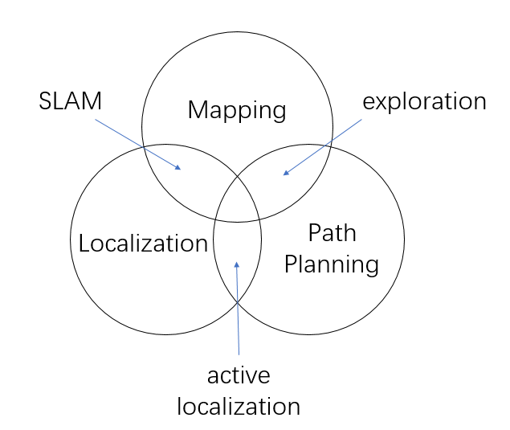

我们讲的Gmapping、Karto、Hector、Cartographer都是SLAM，AMCL（自适应蒙特卡罗）是Localization（定位），路径规划包括全局路径规划算法，如Dijkstra（迪杰斯特拉）和A*。局部路径规划算法如DWA等。移动机器人有三大工程领域：建图、定位、路径规划。从严格意义上讲，SLAM只涵盖定位和建图两大任务，但在机器人应用时，往往还是需要考虑路径规划这个问题。这里我们假设路径规划是已经解决的问题。

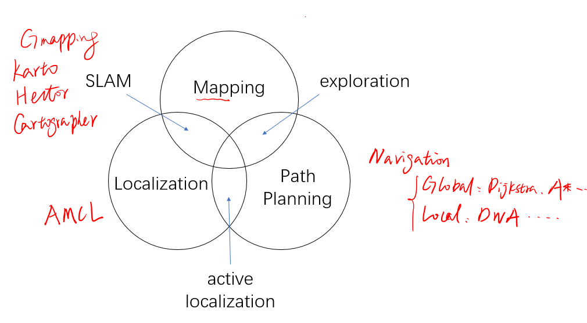

**map**

地图在ROS里是一个topic，它存储了map的数据。数据的类型是`nav_msgs`包中的`OccupancyGrid.msg`，我们来看一下map的数据结构。`OccupancyGrid.msg`分为三部分，`header`、 `MapMetaData`和数组类型的`data`。`header`里存的是这一帧`msg`的序列号、时间戳还有`frame_id`，这个`frame_id`值的就是`map`。MapMetaData是在`nav_msgs`包里另外定义的一个`msg`，这里把它嵌套在`OccupancyGrid`里面，它存储了`map`的加载时间、分辨率（m/pixel）、长宽（pixel）。`map`的像素内容，存在data数组里。建图时，程序会不断地更新这个地图，往`/map` topic上发消息，谁会接收呢？使用的时候，`/map`可能会被多个`node`订阅，像路径规划的`node`、定位的`node`，甚至是rviz可视化，这是ROS地图的实现方法。

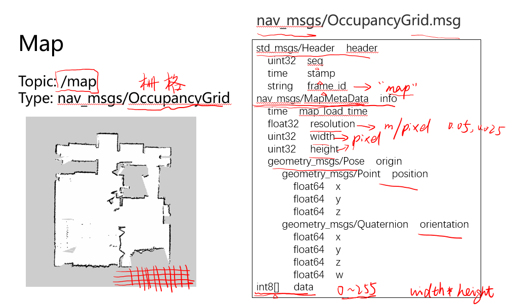

**定位和建图为什么要同时？**

有以下两个原因

 - 建立高精度地图需要在不同的地点进行探测，并把不同地点的结果拼合成一个大的地图。就需要能够精确的定位。

 - 很多时候，一开始是不知道室内的布局的，如果都需要事先构建地图，很多落地应用场景无法实现。

**定位和建图可以分开吗？**

首先定位和建图是可以分开的。前提是地图已经建好，然后只做定位。移动机器人自定位与建图问题是紧密相关的。建图的准确性依赖于定位精度，而定位的实现又离不开建图。定位和建图本身有点鸡生蛋，蛋生鸡的味道。

**定位与建图**

为了让大家对定位和建图有更深刻的认识，我在这里做一个场景假设：

*假设*：我们有一个XBot机器人，机器人底部有轮子，可以四处移动。地图上有很多障碍物（墙壁、桌椅等）。为了使XBot机器人能够在地图上轻松地行走，它至少需要知道两件事：*（这里可以先请大家思考一下，等待几秒钟后解答）*

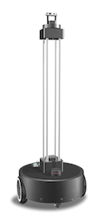

1. 我在哪？——定位，需要知道自身的状态

2. 周围环境怎么样？——建图，了解外在环境，也就是是否有障碍物

知道以上两件事情后，就可以规划自己怎么行走啦。

所以，移动机器人的移动就至少包含了以上两个部分：定位和建图。

那定位到底是什么意思？

**定位**

定位就是在地图上估测机器人的坐标和姿势形态的问题。也就是回答“我在哪”的问题。

在定位过程中肯定是需要传感器来感知外部环境的，那常用于位置估算的传感器有

 - 编码器
 - 惯性测量单元
 - 激光传感器
 - 相机

*编码器*一般安装在车轮上，通过测量车轮的旋转量，推算机器人的大致位置；

*惯性测量单元*，是通过测量运动的角速度和加速度，用于估算姿态和位置，简单理解就是通过加速度二次积分就可以得到位移信息、通过角速度积分就可以得到三个角度；

*激光雷达传感器*和*相机*都是通过读取外部环境的某种观测数据，间接估算位置。

只用传感器来定位肯定是不准确的，因为传感器都有噪声，为了提高定位的精确度，需要用相应的算法对信号进行处理，目前用于位置估计的算法有

 - 卡尔曼滤波/扩展卡尔曼滤波
 - 粒子滤波
 - ......

利用传感器和相关算法实现机器人在地图上的定位。

在定位的同时，我们还需要进行建图，那建图的定义是什么呢？

**建图**

建图： 指构建地图的过程。

这里我们再通过XBot机器人进行解释。

*假设*：XBot机器人正在位置环境里运动，由于传感器是某些时刻采集数据的，这样我们就可以把连续时间的运动变成离散时刻t=1，···，K时刻发生的事情。在这些时刻，用x表示机器人自身的位置。

从前一刻k-1移动一小段距离到k时刻，xbot通过传感器，能够知道朝什么地方移动了多少距离。有了这些信息就可以由前一时刻的状态推算出此时的状态。

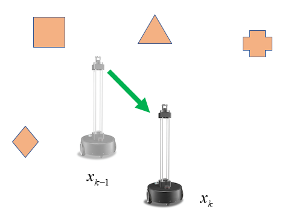

但通常情况下，由于传感器误差等因素的存在，估算出的位置是不准确的，所以需要后面的内容。

Xbot根据之前对环境的监测（橘色箭头），和对自身运动的检测（绿色箭头），和新探测的数据（红色）进行计算和匹配。

 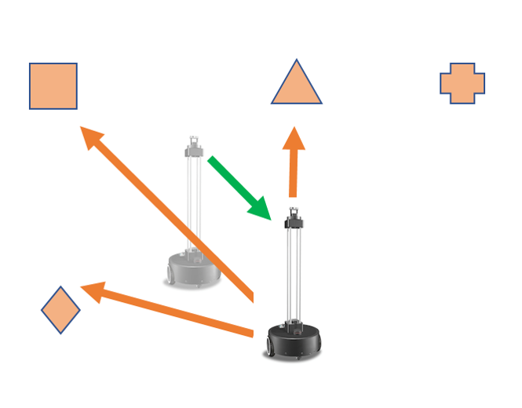

这个过程涉及很多概率和数学知识，具体细节我们这里不展开讲。Xbot经过这样的计算过程之后，知道了自己在地图里什么地方。


同时，当移动到新的位置的时候，会看到之前没有看过的标志物,这就相当于扩展了看到的范围。

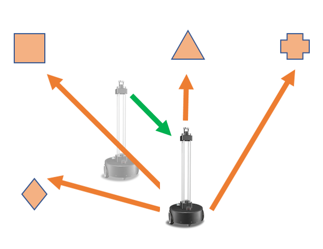

这就完成了建图过程中的一小步迭代。上述就是一个建图的过程。

**建图的难点是什么？**

主要有以下几个方面：

 - 传感器接收回来信息量一般都很大
 - 各种传感器都有误差，无论是雷达还是码盘
 - 传感器自身有物理限制或无法适用所有环境
 - 多个传感器的数据需要统一考虑（也就是多传感器融合）

这个过程对人很简单，对机器而言非常的难。

*这里有一个重要的知识，需要同学们牢记：*

*如果不考虑所有的误差，机器人领域的所有问题都已经解决了。
不仅所有的传感器会有误差存在（激光雷达会有噪点，odom不准），
所有的驱动器（轮子的电机等）也都是有误差的，机器人算法中需要处理这种误差，得到正确的结果。
对于想要以后成为机器人领域专家的同学而言，需要打牢数学基础。*

**定位仿真图**

这是模拟器环境里的定位的例子:

 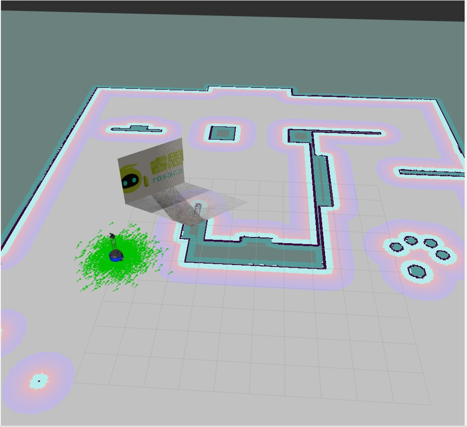


绿色部分是AMCL算法执行时候在RViz里的展示。其中这个地图使用了软件博物馆。

*这里rviz是一个可视化的工具，AMCL算法在后面会有更进一步的解释。*

**建图仿真图**

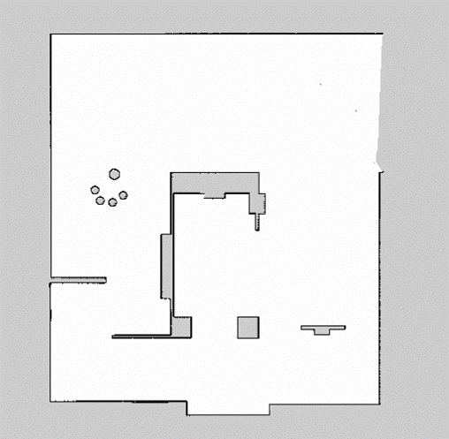

这张图是中科院软件所5号楼一层软件博物馆的建图结果，是经过后期人工整理的。

## 2. SLAM的应用场景
这一节我们讲以下SLAM的应用场景。


在VR/AR方面，根据SLAM得到地图和当前视角对叠加虚拟物体做相应渲染，这样做可以使得叠加的虚拟物体看起来比较真实，没有违和感。

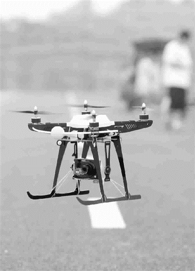 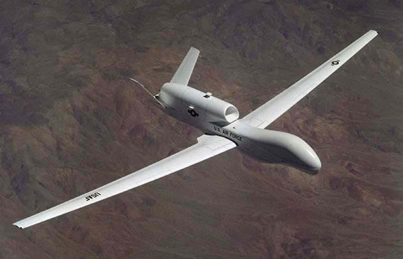

在无人机领域，可以使用SLAM构建局部地图，辅助无人机进行自主避障、规划路径。

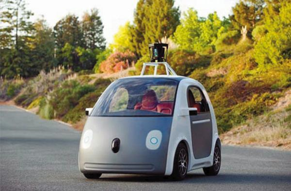 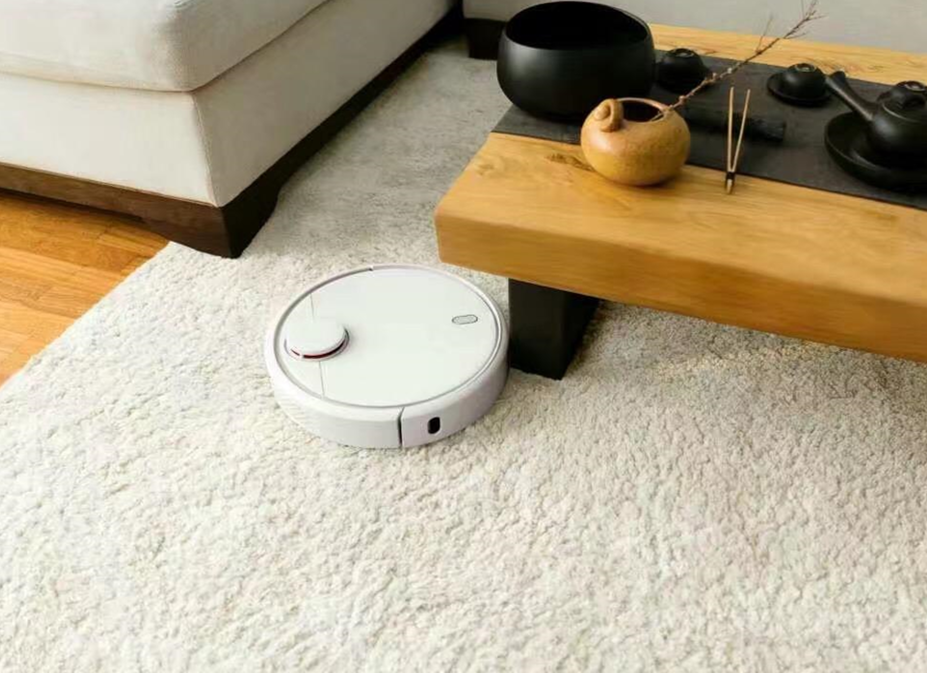

在无人驾驶和机器人定位导航方面，SLAM可以用于生成环境的地图。基于这个地图，机器人执行路径规划、自主探索、导航等任务。

## 3. 传感器

要实现同时定位和建图必须要用到传感器，这里我们讲一下SLAM常用的传感器。介绍定位时，我们曾对传感器的种类及其定义大体说了一下，这里我们将讲它们的工作原理及其在ROS中的存储格式，希望大家会对传感器这一部分有更深一步的认识。

这一节要讲的传感器有

 - 激光雷达
 - IMU
 - 编码器
 - 相机

**激光雷达**

首先，我们先讲一下激光雷达。

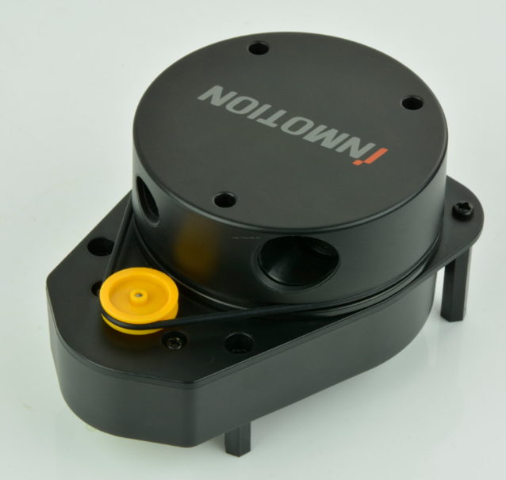

激光雷达的工作原理是激光器向目标发射探测信号（激光束），然后信号处理单元将接收到的从目标反射回来的信号（目标回波）与发射信号进行比较，作适当处理后,就可获得目标的有关信息。


激光雷达在ROS中的数据格式是三位点云数据格式`PointCloud2`

```bash
rosmsg show sensor_msgs/PointCloud2

std_msgs/Header header
  uint32 seq
  time stamp
  string frame_id
  uint32 height
  uint32 width
sensor_msgs/PointField[] fields
uint8 INT8=1  
uint8 UINT8=2 uint8 INT16=3
  uint8 UINT16=4
  uint8 INT32=5
  uint8 UINT32=6
  uint8 FLOAT32=7
  uint8 FLOAT64=8
  string name
  uint32 offset
  uint8 datatype
  uint32 count
bool is_bigendian
uint32 point_step
uint32 row_step
uint8[] data
bool is_dense
```

二维激光雷达数据格式是`LaserScan`

```bash
rosmsg show sensor_msgs/LaserScan

std_msgs/Header header
  uint32 seq
  time stamp
  string frame_id
float32 angle_min
float32 angle_max
float32 angle_increment
float32 time_increment
float32 scan_time
float32 range_min
float32 range_max
float32[] ranges
float32[] intensities
```


**超声雷达**

 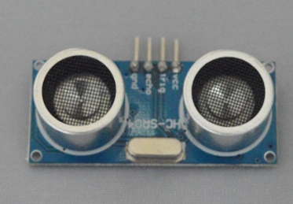

 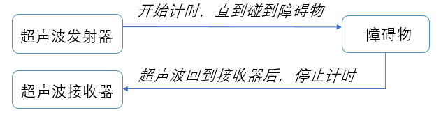

超声雷达的工作原理

发射模式：

1.  在电子振荡器的作用下传感器产生一批声波/脉冲，然后这些声波被发送到周围空气 。

2. 声波从传感器传送到目标物。

3. 传感器转换成接受模式。

接收模式：

4. 部分被物体反射的回声返回到传感器中去 。

5. 传感器的微处理器计算发射接收所用的时间t_1-t_0。（如果声速在介质中传播速度为v，传感器距离目标物的距离则为：s=v∙(t_1-t_0)/2

6. 微处理器驱动一个显示距离或开关量的输出信号。

超声雷达在ROS中的数据格式`LaserEcho`

```bash
rosmsg show sensor_msgs/LaserEcho

float32[] echoes</pre>
```

**IMU-惯性测量单元**


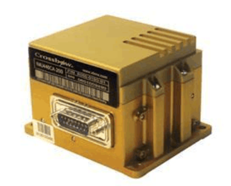

惯性测量单元是测量物体三轴姿态角（或角速率）以及加速度的装置。 

陀螺仪及加速度计是IMU的主要元件，其精度直接影响到惯性系统的精度。一般而言IMU要安装在被测物体的重心上。

一个IMU包含了三个单轴的加速度计和三个单轴的陀螺仪，加速度计检测物体在载体坐标系统独立三轴的加速度信号，而陀螺仪检测载体相对于导航坐标系的角速度信号，测量物体在三维空间中的角速度和加速度，并以此解算出物体的姿态。

IMU在ROS中的数据格式是`Imu`

```
rosmsg show sensor_msgs/Imu

std_msgs/Header header
  uint32 seq  
  time stamp  
  string frame_id
geometry_msgs/Quaternion orientation
  float64 x
  float64 y
  float64 z
  float64 w
float64[9] orientation_covariance
geometry_msgs/Vector3 angular_velocity
  float64 x
  float64 y
  float64 z
float64[9] angular_velocity_covariance
geometry_msgs/Vector3 linear_acceleration
  float64 x
  float64 y
  float64 z
float64[9] linear_acceleration_covariance</pre>```
```


**编码器**

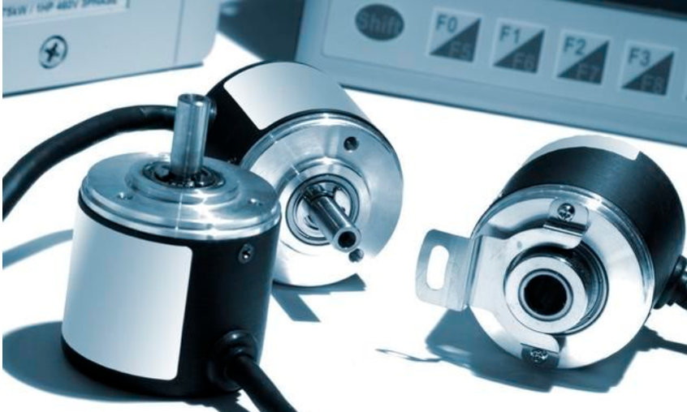
 

编码器（encoder）是将信号（如比特流）或数据进行编制、转换为可用以通讯、传输和存储的信号形式的设备。

编码器把角位移或直线位移转换成电信号，再把这个电信号转变成计数脉冲，用脉冲的个数表示位移的大小。

编码器在ROS中的数据格式`Odometry`

```bash
rosmsg show nav_msgs/Odometry

 std_msgs/Header header
  uint32 seq
  time stamp
  string frame_id
string child_frame_id
geometry_msgs/PoseWithCovariance pose
  geometry_msgs/Pose pose
    geometry_msgs/Point position
      float64 x
      float64 y
      float64 z
    geometry_msgs/Quaternion orientation
float64 x
      float64 y
      float64 z
      float64 w
float64[36] covariance
geometry_msgs/TwistWithCovariance twist
  geometry_msgs/Twist twist
    geometry_msgs/Vector3 linear
      float64 x
      float64 y
      float64 z
    geometry_msgs/Vector3 angular
      float64 x
      float64 y
      float64 z
  float64[36] covariance</pre>
```

**相机**

种类| 单目 | 双目     | 深度
------- | ---------------- | ---------- | ---------:
工作原理  | 类似于相机的成像 |由两个单目相机组成，根据已知的基线（两相机之间距离）估计每个像素的空间位置 |主动向物体发射光并接收返回的光，测出物体离相机的距离
缺点  | 无法确定深度       | 配置与标定均较为复杂，且视觉计算非常消耗计算资源，计算量是双目的主要问题之一      | 测量范围窄、噪声大、视野小、易受日光干扰、无法测量透射材质等诸多问题

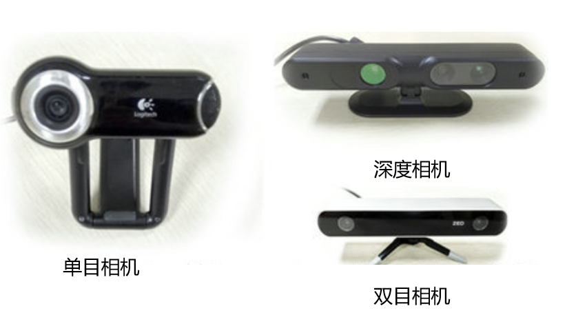

图中分别是单目相机、双目相机和深度相机。

**传感器应用**

- 传感器在Google无人车里的一些应用，包括视觉相机、声学雷达、里程计激光雷达系统。

 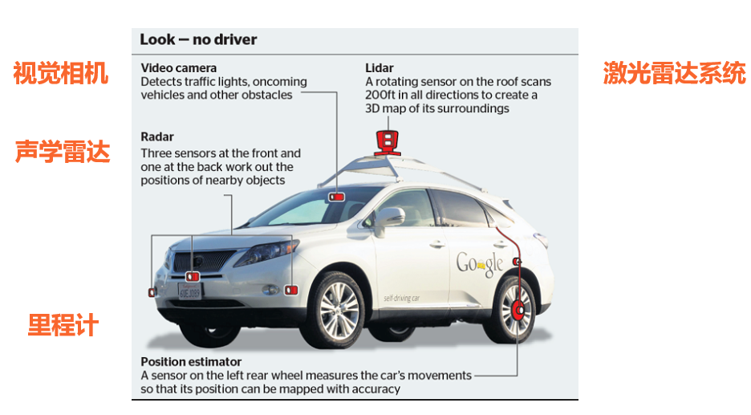

- 传感器在扫地机器人中的应用，感知系统一般包括超声波测距仪、接触和接近觉传感器、红外线传感器和CCD摄像机等。
 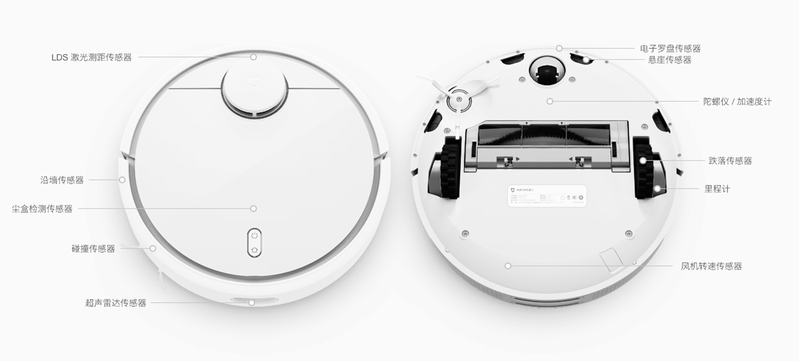

## 4. SLAM框架

SLAM框架包含以下六个方面，首先是传感器信息的读取，然后将消息传给里程计和回环检测，里程计得输出作为后端滤波和后端非线性优化得输入，并且，回环检测得信息也传递给后端优化，将后端滤波和优化结果用于建图。

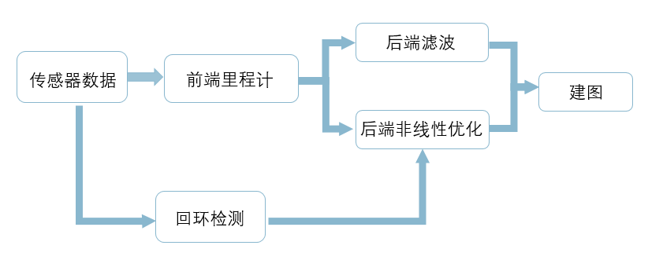

下面我们继续分析每个环节的具体作用 :

- 里程计：
能够通过相邻帧间的图像估计相机运动，并恢复场景的空间结构。只计算相邻时刻的运动，而和再往前的过去的信息没有关联。

存在问题：仅通过里程计来估计轨迹，将不可避免地出现累积漂移。由于里程计的工作方式，先前时刻的误差将会传递到下一时刻，导致经过一段时间之后，估计的轨迹将不再准确。

- 后端：后端优化主要指处理SLAM过程中噪声的问题。

后端优化要考虑的问题，就是如何从这些带有噪声的数据中估计整个系统的状态，以及这个状态估计的不确定性有多大，这里的状态既包括机器人自身的轨迹，也包含地图。

- 回环检测（闭环检测），主要解决位置估计随时间漂移的问题。

回环检测与“定位”和“建图”二者都有密切的关系。为了实现回环检测，我们需要让机器人具有识别到过的场景的能力。当我们看到两张相似的图片时，容易辨认它们来自同一个地方。如果回环检测成功，可以显著地减小累积误差。

- 建图：建图（Mapping）是指构建地图的过程。

地图是对环境的描述，但这个描述并不是固定的，需要视SLAM的应用而定。

其地图类型可以分为以下四种

1. 2D栅格地图

2. 2D拓扑地图

3. 3D点云地图

4. 3D网格地图

## 5. SLAM分类

SLAM算法按照数学表达式可以分类为基于滤波和基于图优化两种。后面我会对基于滤波的算法的思想进行一个解释。

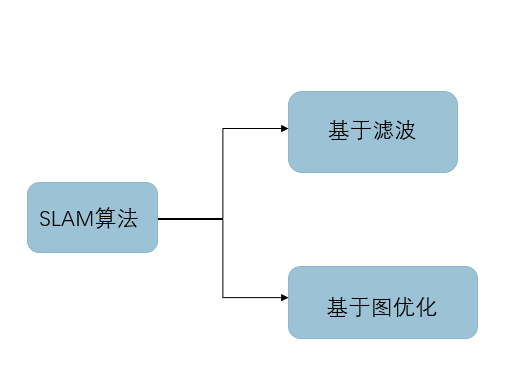

**SLAM的数学描述**

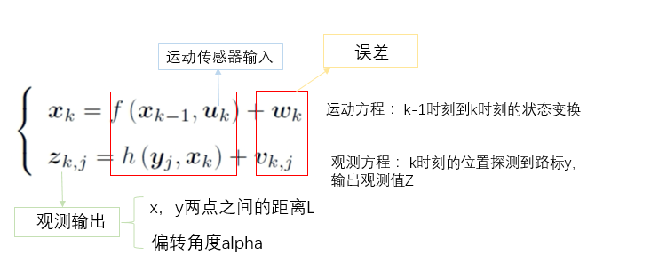


我们一般采用运动方程和观测方程描述机器人的运动过程;

第一个公式为：这里的第k 时刻的状态 为机器人的运动测量输入，实现根据上一时刻估计的状态和k-1到k 过程中IMU的运动测量预测的当前时刻状态  ，由于测量噪声的存在，预测状态和当前真实状态的差异由噪声项Wk 表示。其中u是运动传感器的输入，当前xbot是直接使用编码器使用航迹推测法求得x, y, theta的变化关系	

测量方程中， y 为k时刻可以观测到的所有路标点集，h在这里对应观测模型， h为k 时刻对路标点集y的观测，观测值为z，观测噪声为v，即k时刻3D路标点集  在相机图像上的投影点集为  。 z是观测输出，比如2D激光雷达，那么z向量包含的是当前时刻x，y两点之间的距离L和偏转角度alpha

因此，当知道了带噪声的运动测量读数u和传感器观测读数z之后，如何求取x（定位）和y（建图）的状态序列？ 这就是slam的工作！本质就是在求解状态估计的问题。

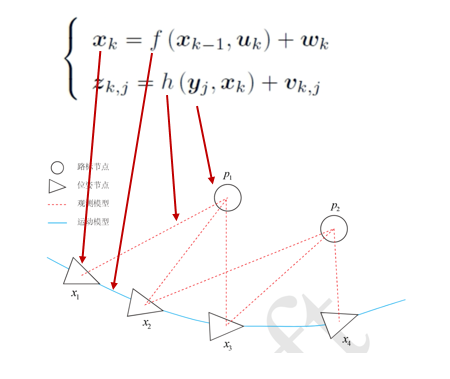

`xk`是每个节点的位姿

`f`的函数方程是节点与节点之间的状态方程

`yj`是要观测的路标节点

`h`函数是通过激光雷达传感器得到机器人的位姿节点与路标节点之间的观测模型

**基于滤波算法的思想**

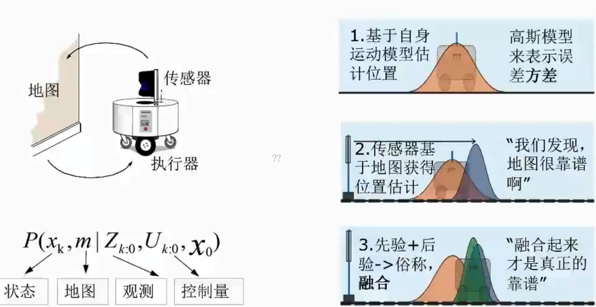

基于滤波算法的思想是：

- 第一步黄色部分是机器人基于自身运动模型估计位置；
- 第二步灰色部分是传感器基于地图估计获得位置估计；
- 第三步绿色部分是先验+后验的融合后获得的位置估计；
- 此时的位姿（绿色）重复循环到第一部的黄色部分。

**SLAM算法按照传感器的种类分类**

SLAM算法按照传感器的种类可以分为激光雷达SLAM算法和视觉SLAM算法。

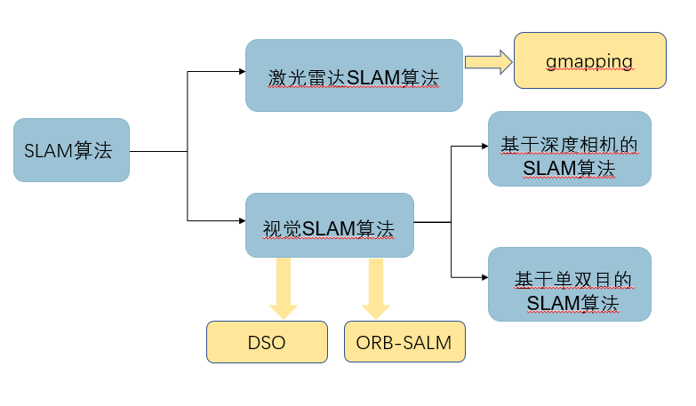

激光雷达SLAM算法中常采用算法是gampping算法，视觉SLAM算法可以分为基于深度相机的SLAM算法和基于单双目的SLAM算法。视觉SLAM算法常用算法是ORB－SLAM２算法和DSO算法，后面会对DSO和ORB－SLAM２展开讲解。

这里先对SLAM两种算法进行的一个优劣势对比

优/劣势| 激光SLAM | VSLAM    
------- | ---------------- | ----------:
优势  | 可靠性高、技术成熟|结构简单，安装方式多元化
 |.|建图直观、精度高、不存在累积误差|无传感器探测距离限制，成本低|
|.|地图可用于路径规划|可提取语义信息
劣势  | 受Lidar探测范围限制       | 环境光影响大，暗处无法工作
|.|安装有结构要求|运算负荷大，构建的地图本身难以直接用于路径规划和导航
|.|地图缺乏语义信息   | 传感器动态性能还需提高，地图构建时会存在累积误差

**VSLAM根据对图像处理的方式分类**

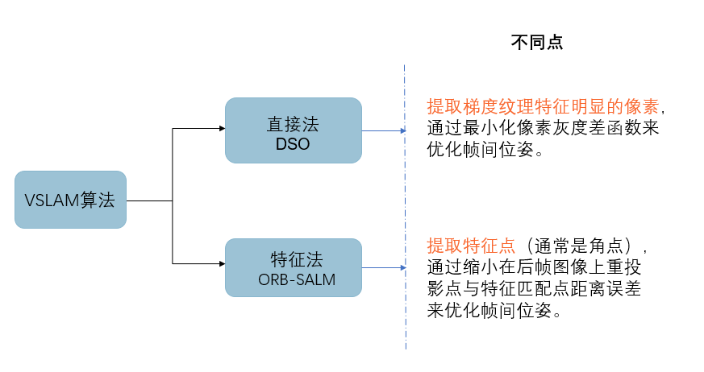

VSLAM根据对图像处理的方式可以分为直接法和特征法两种，直接法和特征点法在帧间VO阶段的不同在于

- 直接法(DSO)：提取梯度纹理特征明显的像素，通过最小化像素灰度差函数来优化帧间位姿。

- 特征点法(ORB-SLAM)：提取特征点（通常是角点），通过缩小在后帧图像上重投影点与特征匹配点距离误差来优化帧间位姿。

DSO的优点是

1. 由于不用进行特征匹配，计算特征点，从而大大节省了计算量。

2. DSO的速度比传统的特征点法要快5倍以上，这在自动驾驶等要求实时SLAM的领域来讲，无疑是质的飞跃。虽然目前算法并未成熟落地，但其展现的理论效果已经可以比拟现在的ORB2。

这是DSO的运行效果图

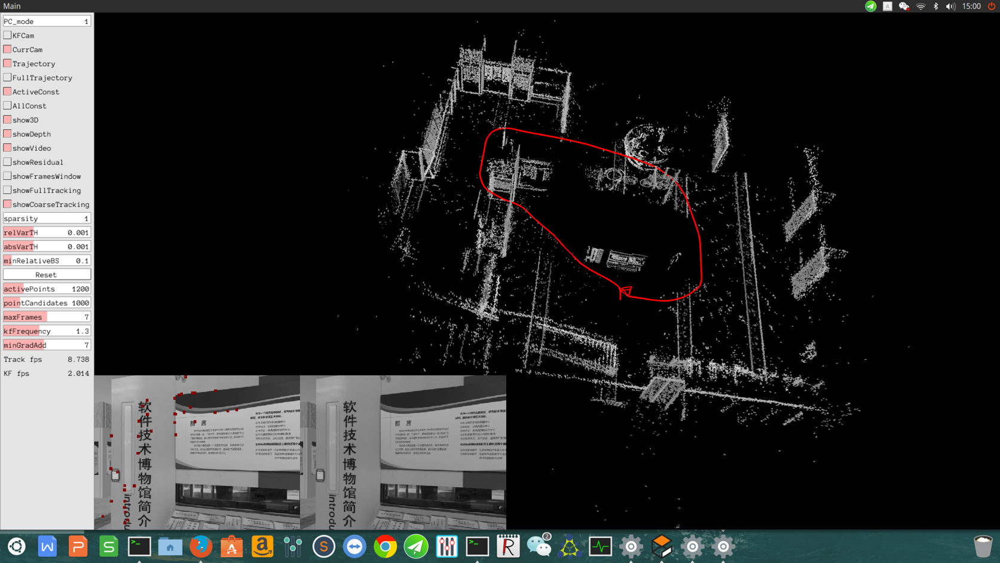


接下来，继续介绍ORB-SLAM 。

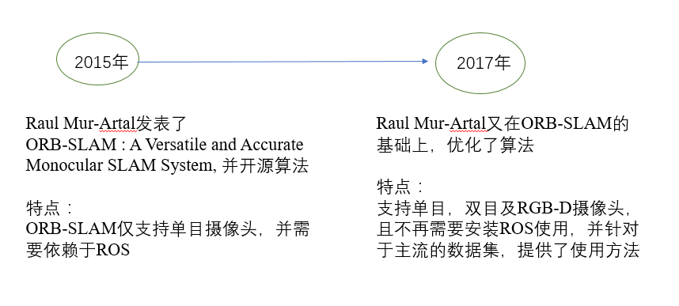

这里展示一下ORB-SLAM运行效果图:

ORB-SLAM2支持单目，双目及RGB-D相机，这里使用Intel Realsense D415作为RGB-D传感器得到效果图。主要参数

```
Camera.fy: 608.1509 Camera.cx: 318.843293 Camera.cy: 230.9963 

Camera.k1: 0.094887 Camera.k2: -0.110314 Camera.p1: 0.000909 Camera.p2: -0.001350

Camera.fps: 30.0 Camera.bf: 34.89580446 BGR, 1: RGBCamera.RGB: 1 </pre>
```
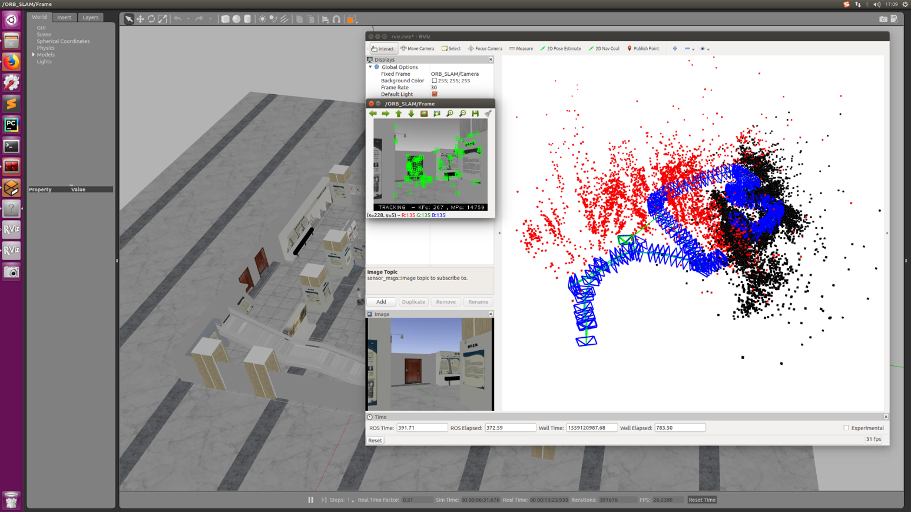


单目AR的仿真效果

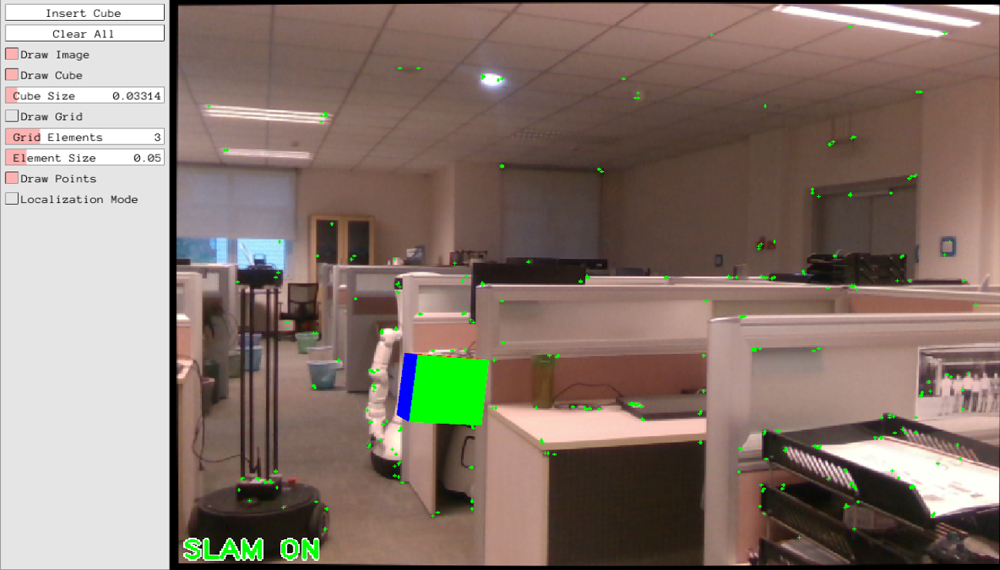


摄像头在真实办公场景

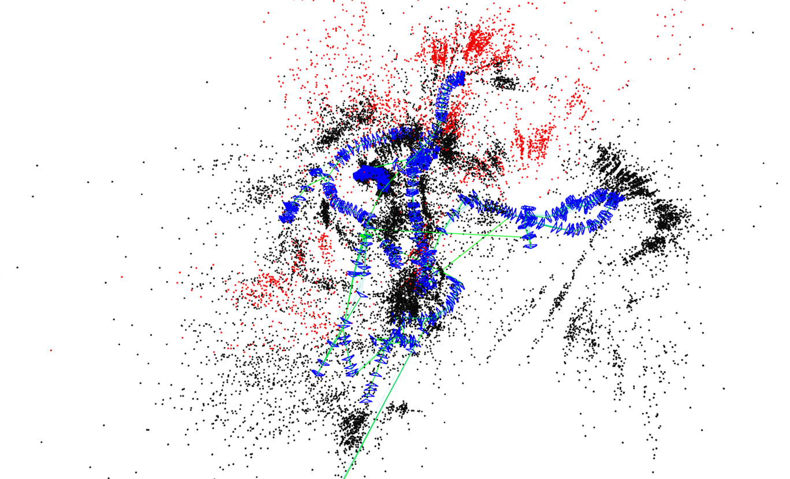

缺点：追踪丢失

原因：

- 快速旋转 （共视图 < 15%）

- 视角的快速变化（ 共视图 < 15%）

- 缺少环境特征 （特征法通病）

下图是ORB2（上）和DSO（下）的效果对比图

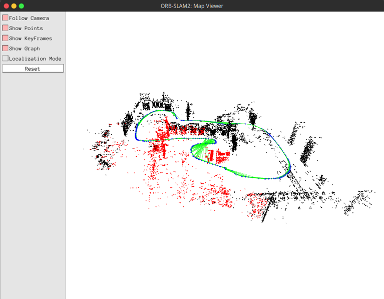


从图中我们可以看出， DSO在软件博物馆仿真环境运行，由于没有光度畸变，稳定高画质高帧率，效果非常的好。