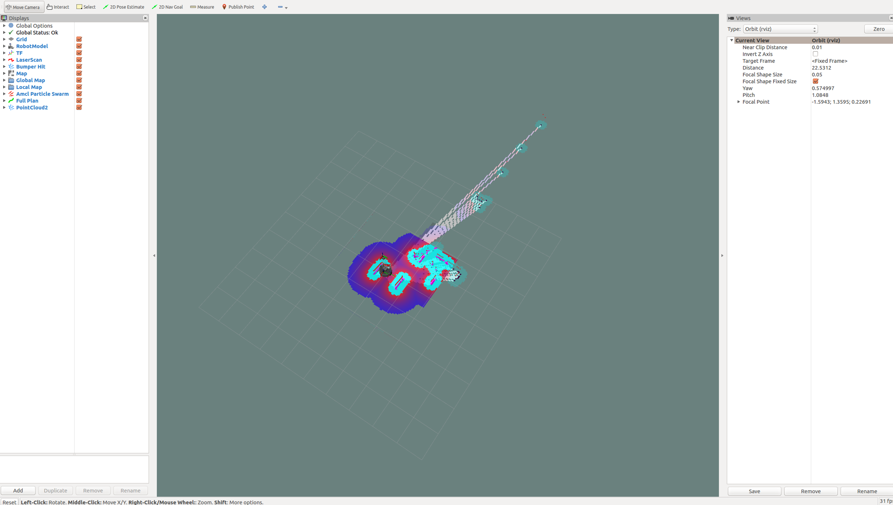
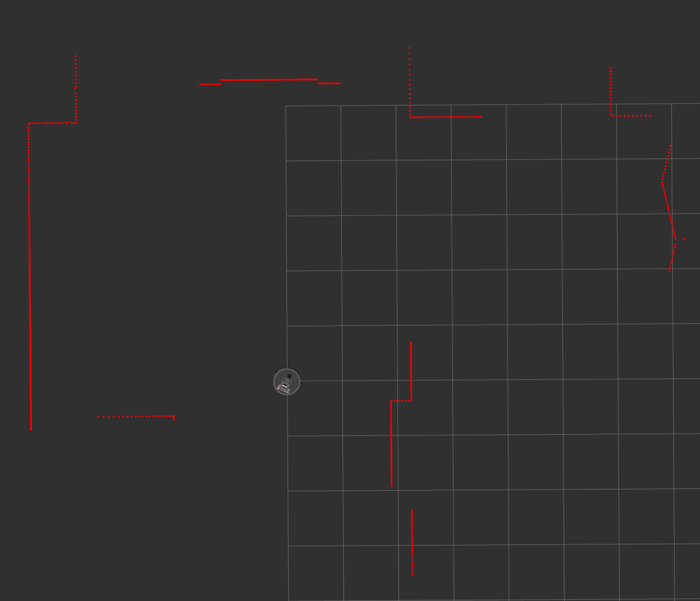
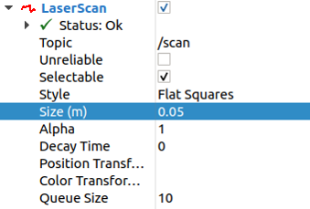
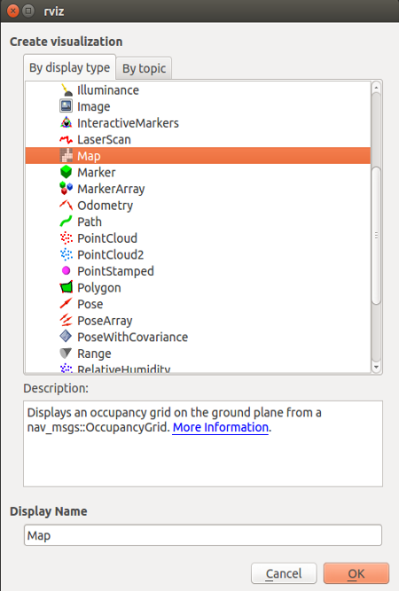
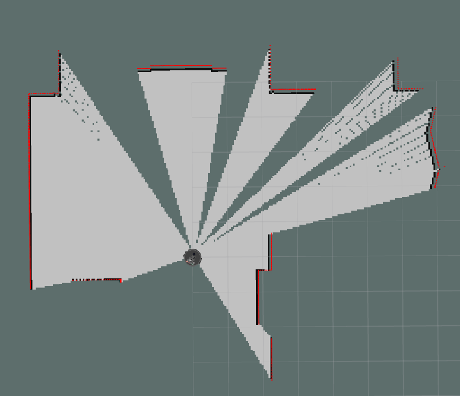
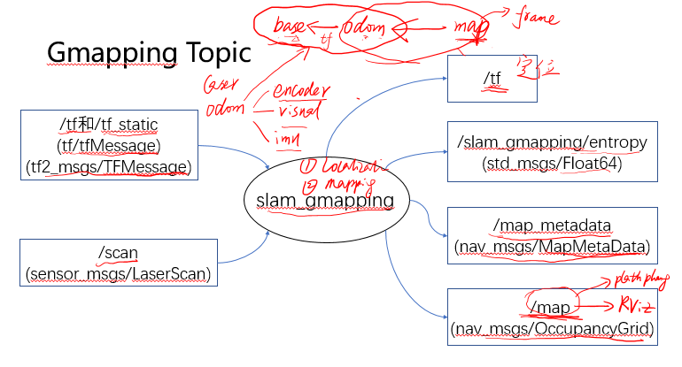
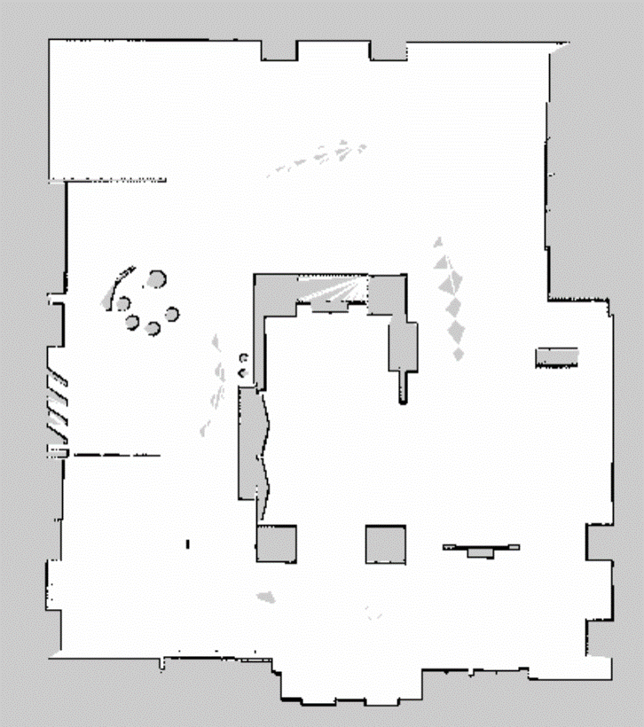
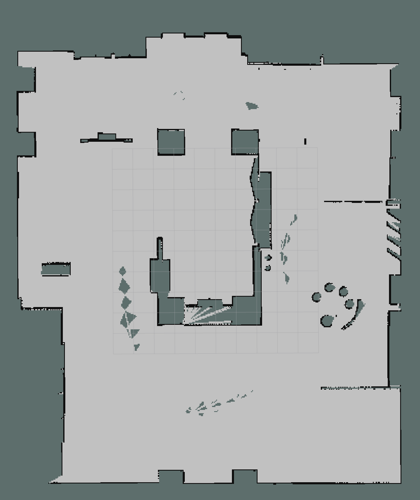
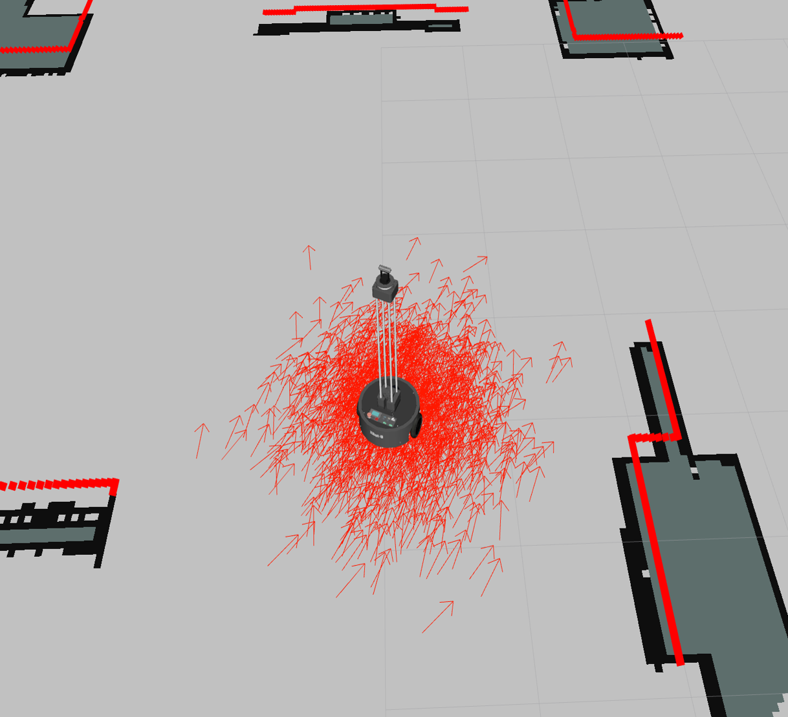
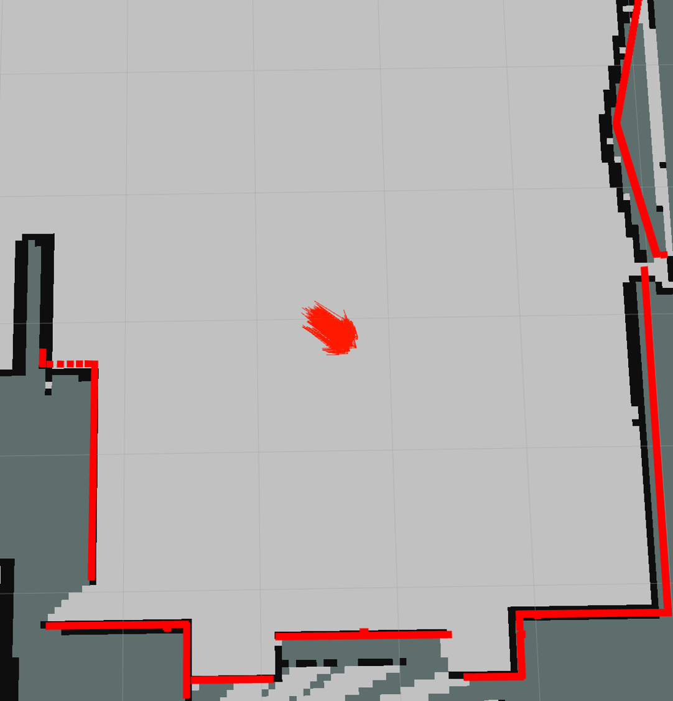

# 6.2  SLAM演示

**本讲重点**

- 地图
- 定位
- Gmapping建图
- AMCL定位

**教学目的**

- 熟练掌握XBot建图、定位、保存地图的操作步骤
- 了解Gmapping基础知识
- 了解AMCL定位工作原理

## 6.2.1 地图

SLAM最首要的事情当然是地图了，我们需要一个地图来表示当前机器人所属的环境，使用机器人去构建环境的地图，换言之，一个地图就是机器人使用它的传感器读取的数据（例如激光雷达）构建而成的环境的一种表示形式。

现在就让我们演示一下建立地图的过程，执行程序进行仿真演示，运行(程序)

```bash
roslaunch xbot_bringup xbot.launch
roslaunch xbot_bringup rplidar.launch
rosrun xbot_tools keyboard_control.launch
roslaunch slam_sim_demo view_slam.launch
rosrun xbot_tools keyboard_control.py
```



上述程序为XBot中的自带启动程序和慕课课程中的程序，慕课课程程序可在'https://github.com/DroidAITech/ROS-Academy-for-Beginners’中下载

此时使用keyboard_control.py的脚本对XBot进行控制建立环境地图（此处是真实环境的演示图，之后是仿真中的图，但是演示时应当使用真实环境进行实时演示） 在我们的可视化界面RViz中可以看到使用gmapping算法建立的地图模型，由于我们当前使用的是激光雷达实现的导航算法，在我们的RViz中有显示激光雷达的数据，我们可以看到图中的红线，这就是我们的激光雷达传感器获取到的数据，这些数据正用于建立这个地图。当我们驱动机器人在环境中四处游荡时，我们就可以获得当前环境的完整地图，就像这样。（此时操控机器人四处动绘制地图）

## 6.2.2 定位

好的，我们现在已经知道地图的重要性以及如何绘制地图了。

除了地图之外我们还需要进行定位，也就是让机器人知道自己处于给定的地图中的哪一部分，准确的说是得知自己在给定地图下的位姿，这个位姿包括位置与姿态，也就是机器人的朝向。

那么接下来我们还是简单地演示一下定位的方法

```
<pre>roslaunch robot_sim_demo robot_spawn.launch
roslaunch navigation_sim_demo amcl_demo.launch
roslaunch navigation_sim_demo view_navigation.launch
rosrun robot_sim_demo robot_keyboard_teleop.launch</pre>
```

执行程序进行仿真演示，运行以上命令。


在RViz界面中，我们可以看到这些绿色的点，仔细地看可以看出这是一些向量，它们表示对机器人当前位姿的估计，在开始的时候我们的算法对机器人的位姿估计偏差如此的大，可以说这样的定位是完全不可能直接使用的。我们接下来移动一下机器人看看会发生什么（这时移动机器人）。


可以看到在进行了移动之后，绿圈的范围逐渐缩小，这意味着我们对机器人的位姿估计更加的准确了。​事实上，你的机器人运动的越多，我们越能从机器人的传感器数据中获取到更多的信息，定位也就更加准确。在我们的传感器数据和地图数据中存在一定的偏差，运动的越多就越能对我们的定位信息进行调整。并以此减少这个偏差。

## 6.2.3 建图

建图这一任务中我们需要使用RViz来显示我们的激光雷达数据和地图数据，让我们运行之前使用过的程序，使用gmapping算法实现建图功能。

启动rviz，输入
```
rosrun rviz rviz
```

在这里现在还是一片空白。我们需要添加一些东西才能看到我们需要的。首先是非常简单的添加机器人模型，我们现在想添加激光雷达的数据，那么我们就点击添加，添加`LaserScan`。添加完之后还是什么都没有，这是因为我们没有给出需要显示的话题，在topic中可以输入或者选择需要进行显示的雷达数据话题，在添加完之后我们可以看到上节课中出现了的红线。



但是这条红线太细了，我们可以通过调整size来调整红线的宽度



和添加激光雷达数据是一样的，我们可以通过添加map在RViz中可视化的查看地图，当然我们也需要在topic中添加我们希望显示的地图，在这里我们选择显示/map这一地图信息



## 6.2.4 查看地图

```bash
rosrun rviz rviz
```



为了让我们下次打开RViz的时候能够不用重复的调整这些配置，我们可以保存RViz的配置并在下次调用时直接使用这些配置，只需要在File下选择save config as就可以将当前设置好的配置存储为一个.rviz文件，在重新调用的时候可以使用类似的launch文件直接运行。

```bash
launch
  node name="rviz" pkg="rviz" type="rviz" args="-d $(find slam_sim_demo)/rviz/slam.rviz"/
</launch>
```

## 6.2.5 Gmapping

是ROS自带的，并且比较好用的一个SLAM算法，这是一个package，它的性能还不错，而且使用比较方便，我们来看下它的用法，先从它的topic收发讲起。



核心`node`是`slam_gmapping`，从输入输出角度来看`slam_gmapping`的输入包括了`tf`这个`topic`还有`tf_static其`中必须要有的一个`tf`是`base_link->odom`（用来提供里程计信息），这个`tf`很重要，一定得有还需要激光雷达的信息`scan`那么`slalm_gmapping`也会发布`tf`，这里发布的`tf`是`/map->/odom`的`tf`，那这样就将世界坐标系和机器人坐标系之间连同了，看到没有,这里就是定位的具体实现。

建图是怎么实现的呢？

在这里，两个`topic`， `/map_metadata`和`/map`，这个`/map`和这个`/map`千万别搞混了一个是`tf`里的`frame`，是个坐标系，另一个是`topic`，它是`OccupancyGrid`，是栅格，这两个`topic`里存的就是当前地图的信息。

```
Gmapping Service
Service: /dynamic_map 
Type: nav_msgs/GetMap
nav_msgs/GetMap.srv


# Get the map as a nav_msgs/OccupancyGrid
---
nav_msgs/OccupancyGrid map
```
这个`service`是直接`call`的，不需要带参数。

```
Gmapping Param
~inverted_laser (string, default: “false”)              #雷达是否反向放置
~throttle_scans (int, default: 1)                       #每多少次scan才处理一次
~base_frame (string, default: “base_link”)              #底盘坐标系
~map_frame (string, default: “map”)                     #机器人坐标系
~odom_frame (string, default: “odom”)                   #里程计坐标系  
~map_update_interval (float, default: 5.0)              #更新地图周期(秒)
~maxUrange (float, default: 80.0)                       #激光最大可用范围
~particles (int, default: 30)                           #粒子数
~transform_publish_period (float, default: 0.05)        #tf发布周期
```

`gmapping package`包括一个名为`slam_gmapping`的节点，它允许我们使用激光雷达和机器人的位姿信息创建一个2D的地图，这个节点接收激光雷达的信息和机器人的关节变换信息，然后将这些信息转换为`Occupancy Grid Map（OGM）`也就是常用的栅格地图。

我们在之前的练习中都做了这些事情

- 创建了一个`launch`文件来运行gmapping package

- 启动一个`slam_gmapping`节点，然后开始在环境中移动机器人

- `slam_gmapping`节点去订阅激光雷达信息（`/scan`）和机器人的变换信息（`/tf`）来建立一个地图

- 通过`/map`话题来发布建立好了的地图信息，之后使用RViz查看该地图


我们使用gmapping建立的栅格地图通过`/map`话题进行发布，这个话题的消息的类型是`nav_msgs/OccupancyGrid`，它由一个取值范围在0~100的整数来表示，为0表示这个位置完全没有任何障碍物，为100表示这个位置已经完全被障碍物占领了，除此之外如果是-1则表示这个位置的地图情况完全的未知。

只能建立地图是不够的，我们还应该掌握将地图信息保存的方法，我们可以使用map_server去进行保存。

打开一个终端，运行

```bash
rosrun map_server map_saver -f my_map      
```

通过这个命令我们可以把当前正在运行的程序中的地图保存下来，在保存下来的文件中有两个部分，`my_map.pgm`文件和`my_map.yaml`文件，分别是地图的图片信息和地图的配置文件。




在`.yaml`文件中存放着地图的一些辅助信息`meta data`，使用编辑器打开这个文件，下面我们来逐条介绍一下这里包含的参数

| 参数            | 描述                                                |
| --------------- | --------------------------------------------------- |
| image           | 表示生成的图像的名称                                |
| resolution      | 地图图像的分辨率，单位是meter/pixel                 |
| origin          | 地图左下方像素点的坐标，第三个值表示旋转值通常定为0 |
| occupied_thresh | OGM的阈值，大于这个值的就被视为栅格被占有           |
| free_thresh     | 与occupied_thresh类似，低于这个值就被视为没有障碍物 |
| negate          | 是否将地图的颜色信息进行反转，默认为0               |

除了`map_saver`节点，`map_serverpackage`还提供了`map_server`节点用于读取地图文件并通过ROS服务为其他ROS节点提供这个地图。

我们可以使用`rosrun map_server map_server my_map.yaml`这行命令发布地图信息，之后使用RViz进行查看。



可以看到在RViz中添加了地图显示后就能看到我们刚刚在gmapping演示中建立的地图了！

通过刚才的学习大家必须理解，我们建立的地图属于静态地图，这意味着一旦我们建立了环境的地图它就会一直如此，而且在你创建地图的时候获得到的环境是当前时刻的环境，正因如此未来的环境改变将不会出现在我们建立的静态地图中；除此之外，我们创建的是一个2D地图，这意味着它没有高度信息，如果我们需要为无人机设计导航系统那么这个地图便没有任何用处。

## 6.2.6 AMCL定位

在上一个例子中我们学习了如何使用slam_gmappingpackage进行建图，在这个例子中我们将会学习定位，你将会学习定位在导航中意味着什么，定位是如何工作的，我们在ROS中如何表示定位。

在之前我们一直强调定位在导航中占据的重要地位，当机器人在环境中运动的时候，我们必须知道机器人在当前地图的位置和朝向，通过传感器读取的数据获取位姿的方法称为机器人定位。接下来让我们开始学习在ROS中实现定位。

首先还是让我们使用RViz帮助我们可视化地了解定位这一过程。

在`topic`中选择添加`particlecloud`话题，添加完之后可以在RViz界面中看到下图这样的一群小箭头，这些小箭头就是算法提供的对机器人当前位姿的估计，包括位置和朝向。



现在我们使用键盘控制机器人的脚本对机器人进行控制，使用PoseArray进行演示的位姿向量逐渐靠拢，我们可以关掉机器人模型的显示，最终像下图这样收敛到一起来表示机器人的当前位姿：



此时我们也可以看到激光雷达的数据已经和地图几乎是完全重合的了，这说明我们的位姿估计也是正确的。