# 8.3 Navigation简介

**本讲重点**

- 导航介绍
- move_base
- Gmapping建图
- 地图map_server
- 定位

**教学目的**

- 了解导航基础知识
- 了解global_planner、local_planner、costmap等move_base基础知识
- 了解地图map_server
- 了解航迹推测法、AMCL算法等定位基础知识

## 1. Navigation介绍

首先对导航的原理和Navigation Stack的框架结构进行简单的介绍。Navigation是机器人最基本的功能之一，简单来说，导航就是机器人基于地图，实现从起点A前进到终点B的过程，这个过程中要求不发生碰撞并满足自身动力学模型。我们将导航的任务进行细分，首先机器人在未知环境中需要使用激光传感器（或者是深度传感器）进行地图建模，然后根据构建的地图进行定位，有了地图和定位的基础，就可以根据指定位置以及感知的障碍物信息进行路径规划与导航了。

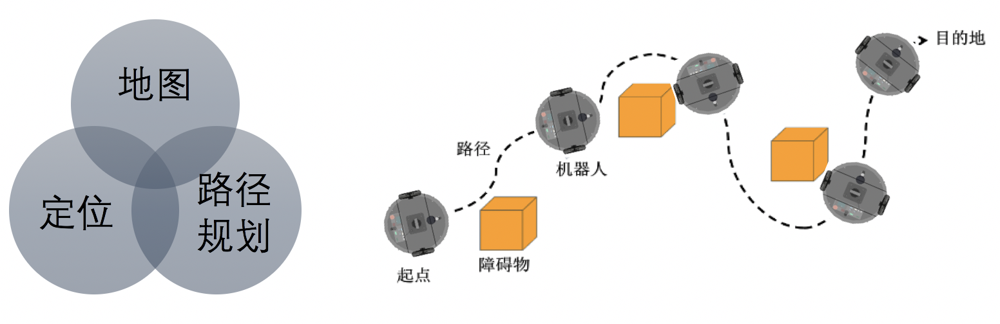

我们提取上述导航过程的一些要素，主要分为以下四个部分

- 地图
- 定位
- 感知
- 路径规划。

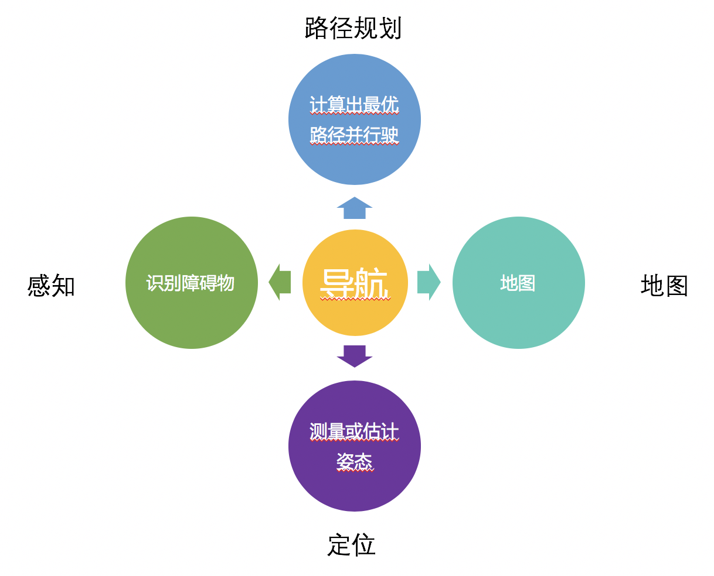

**地图**

ROS中的地图很好理解，就是一张普通的灰度图像，左边这张图像上的黑色像素表示障碍物，白色像素表示可行区域，灰色是未探索的区域。右边的图像是Rviz中可视化图。

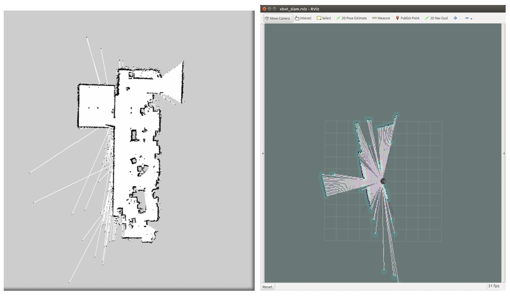

**定位**

定位是对机器人姿态的测量或估计，通过定位，机器人可以知道自己在哪儿，所面朝的方向是南还是北。


**感知**

机器人是通过传感器来感知环境的，左上是一个超声波传感器，右上是激光扫描测距传感器，右下是一个深度摄像头，通过这些传感器的数据，就可以对墙壁、路障等障碍物进行感知识别。

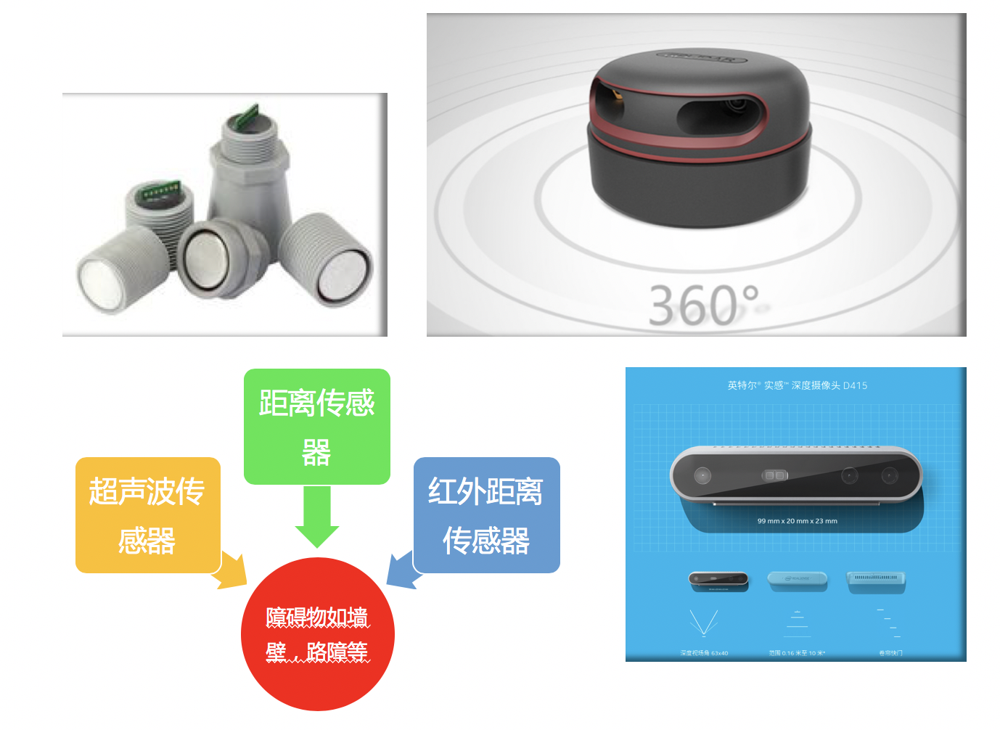

**导航流程**

再来回顾一下导航的流程，首先机器人在未知环境中需要使用激光传感器或深度传感器进行地图建模（或者在已知环境中直接使用提供的地图），然后根据地图进行定位，再通过传感器进行障碍物识别，机器人综合以上信息就可以进行自主导航了。


**Navigation Stack**

ROS Navigation Stack在github上的项目源码

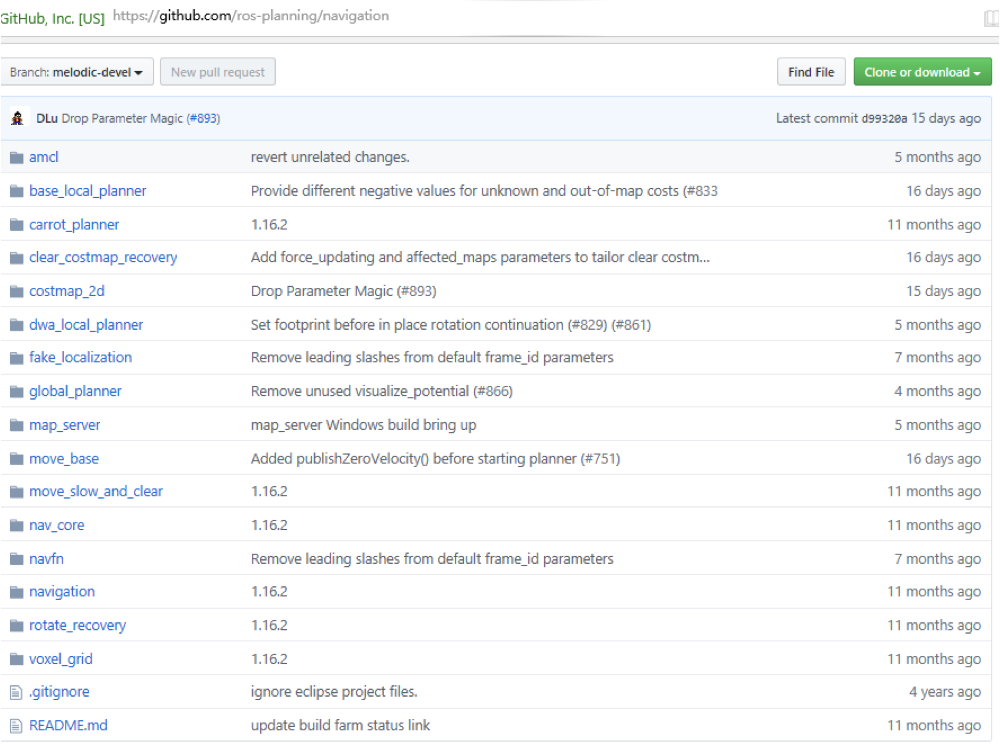

从输入输出来看，机器人要实现路径规划和移动，需要什么。白色是navigation这个包已经提供给你的节点，灰色是可选的，蓝色是你必须提供的数据。`navigation`框架里面的核心是`move_base`，这是导航最重要的一个package，它负责运动规划，这里面有`global planner`和`local planner`，把路径规划问题分解为全局和局部两部分来解决，而这两个planner做出决策，要参考全局和局部的`costmap`代价地图。然后`move_base`还包括了一些`recovery behaviors`，让机器人在某些情况下，比如说碰到障碍物，卡住，会采取一些恢复措施。我们先把`move_base`看成一个整体，就是一个路径规划的工具，看看我们要发送给`move_base`什么数据，它能返回给我们什么数据。有几个数据是必须给的，一个是`tf`，路径规划当然得知道各个坐标系的变换关系了，尤其是当前机器人在地图的什么位置。那其中必不可少的是`map->odom->base`之间的`tf`,还有base到其他各个机器人零部件的`tf`。还有就是里程计的数据，刚才`tf`只提供了位置和方向信息，但是实际路径规划，还要考虑速度和角速度，对吧？ 所以这里专门又一个`odom`来提供位置方向、线速度、角速度。这个`odom`注意，是一个topic，不是`tf`里的`odom frame`。类似的还有`map`，既是`tf`里的frame，也是一个topic。除了`odom`之外，还有一个传感器数据，可以是激光雷达，可以是rgbd-camera的点云。所以你需要提供的数据，通常来说就是这么几个，`/map` 、`/tf`、 `/scan`、 `/odom`。`navigation`输出的是路径规划算出来的当前速度`/cmd_vel`。

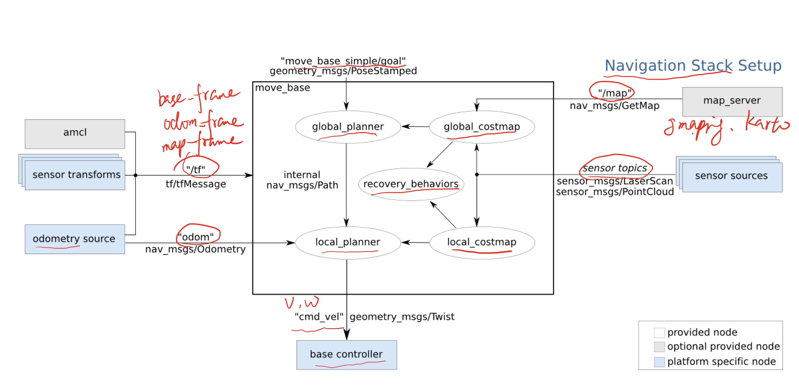

Navigation Stack是一个ROS的功能包集，里面包含了ROS在路径规划、定位、地图、异常行为恢复等方面的package，它的作用是路径规划，输入各传感器的数据，输出速度。

| 包名       | 功能        |
| -----------| -----------|
| amcl  | 定位 |
| Fake_localization | 定位 |
| map_server | 提供地图 |
| move_base  | 路径规划节点 |
| nav_core  | 路径规划接口类 |
| base_local\_planner  | 实现了Trajectory Rollout和DWA两种局部规划算法 |
| dwa_local\_planner  | 重新实现了DWA局部规划算法 |
| parrot_planner  | 实现了较简单的全局规划算法 |
| navfn  | 实现了Dijkstra和A*全局规划算法 |
| global_planner | 重新实现了Dijkstra和A*全局规划算法 |
| clear_costmap\_recovery | 实现了清除代价地图的恢复行为|
| rotate_recovery | 实现了旋转的恢复行为 |
| move_slow\_and\_clear | 路径规划接口类 |
| costmap_2d | 二维代价地图 |
| voxel_grid | 三维小方块 |
| robot_pose _ekf  | 机器人位姿的卡尔曼滤波 |

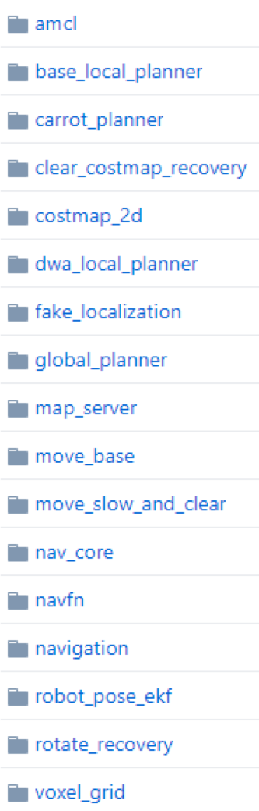

上图中的`amcl`包用于定位是通过环境信息确定小车在地图的位置，`map_server`用于提供已知地图。`xxx_planner`是路径规划插件，`xxx_recovery`是异常行为处理的插件，它们都是`move_base`的插件，`costmap_2d`是2d代价栅格地图，用来表示地图中的障碍物，`move_base`包含了导航核心`node`。

## 2. move_base

### 2.1 move_base介绍

`move_base`是`navigation`里负责导航的`node`，它负责全局规划，局部规划和处理异常行为处理。`move_base`节点位于导航框架正中心，可以理解为一个强大的路径规划器，在实际的导航任务中，只需要启动这个`node`，并且给它提供数据，就可以规划出路径和速度。从`navigation`的角度，`map`是已知信息默认是已经解决了。

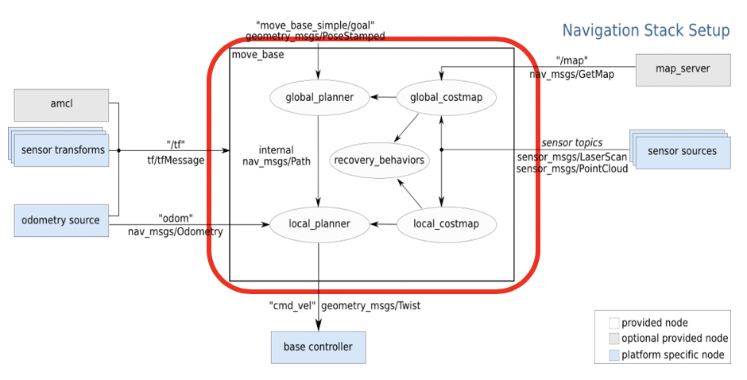

上图红框内是`move_base`的组成部分。

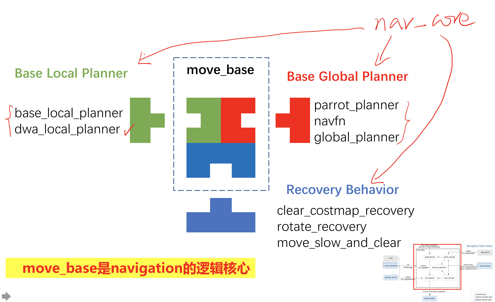

上图中间虚线框内的`node`是`movebase`，它要正常工作，需要设置好三个接口，`Base Local Planner`、`Base Global Planner`和`Recovery Behavior`， 在ROS里，实际的路径规划一般就是分为这么三部分，一部分是全局规划，负责轨迹的大方向，用户来躲避静态障碍物，一部分是局部路径规划，负责具体的运动细节，用来躲避移动中的障碍物，也就是动态避障，做好了这两部分路径规划，机器人就可以正常的运动了。但有些时候，机器人也会陷入一些运动情况，比如碰撞到障碍物，那它就会有一些恢复动作，`recovery behavior`这些恢复动作就属于异常动作处理的方法。针对这三个接口，每一个ROS都给我们提供了一些插件，供用户来选择
比如局部路径规划，ROS提供了两个插件，每一个插件，都是不同算法的实现，其实就是不同的package，在`navigation`里你都能找到这些package，它们是move_base的插件，比如`move_base`的插件`dwa_local_planner`就是`base_local_planner`的重写版本，对动态窗口的速度采样更好。可以看出，`move_base`是`navigation`的逻辑核心，是核心节点，之所以称之为核心，是因为它在导航的任务中处于支配地位，其他的一些package都是它的插件。`move_base`以及全局规划，局部规划的参数非常多，一般把参数的设置写到`yaml`文件中，使用`roslaunch`运行。

**插件**

`move_base`要运行起来，需要选择好插件，包括三种插件`base_local _planner`、 `base_global _planner` 和`recovery_behavior`。这三种插件都需指定，未指定时系统会使用默认值。

**base_local _planner插件**

局部规划插件包括`base_local_planner`和`dwa_local_planner`。 `base_local_planner`实现了`Trajectory Rollout`和`DWA`两种局部规划算法。`dwa_local_planner`可以看作是`base_local_planner`的改进版。

**base_global _planner插件**

全局规划插件包括`parrot_planner`、`Navfn`、`global_planner`。`parrot_planner`实现了较简单的全局规划算法，`Navfn`实现了`Dijkstra`和`A*`全局规划算法 ，`global_planner`可以看作`navfn`的改进版。

**recovery_behavior插件**

recovery动作插件包括`clear_costmap_recovery`、`rotate_recovery`和`move_slow_and_clear`。`clear_costmap_recovery`实现了清楚代价地图的恢复行为，`rotate_recovery`实现了旋转的恢复行为，`move_slow_and_clear`实现了缓慢移动的恢复行为。

需要说明一下，这里插件的概念并不是我们抽象的描述，而是在ROS里catkin编译系统能够认出的，也就是说插件不需要提前链接到ROS的程序上，只需在运行时加载插件就可以调用其中的功能。

**nav_core**

package `nav_core`定义了这三个接口（类），然后各自继承和实现了这些功能。

在ROS navigation中，`move_base`提供的是框架，`move_base`通过`nav_core`中规定的`planner`与`recovery_behavior`的基类的接口进行调用，与具体的实现方法隔离开来。而具体采用的方法由`pluginlib`根据不同参数导入，这样的实现方法使得`navigation`的可定制性大大增加。像`base_local_planner`中就实现了两种局部路径规划方法，`global_planner`实现了`A*`与`Dijkstra`两种方法，在`navigation_experimental`中还有更多这样的实现。这赋予了这个框架很大的灵活性，通过不同的配置方法可以让`navigation`适应很多不同的任务。

`BaseGlobalPlanner`是全局导航的接口，规定一个功能函数`makePlan`，给定起始跟目标，输出路径(一系列pose)走过去；`BaseLocalPlanner`规定了一个核心函数`computeVelocityCommands`是计算局部地图内的下一步控制指令（线速度，角速度）；还有一个`RecoveryBehavior`，规定一个`runBehavior`，在小车卡住情况下执行运动恢复，回到正常的导航状态。

### 2.2 global_planner

**global_planner 原理与实现**

在ROS的导航中，首先会通过全局路径规划，计算出机器人到目标位置的全局路线。全局路径规划一般是由`navfn`或`global_planner`插件实现的。`navfn`通过`Dijkstra`最优路径的算法，计算`costmap`上的最小花费路径，作为机器人的全局路线。在算法上还有`A*`算法。`global_planner`根据给定的目标位置进行总体路径的规划；这个package为导航提供了一种快速，内插值的全局规划器， 继承了`nav_core`包中`nav_core::BaseGlobalPlanner`接口，该实现相比navfn使用更加灵活。

**Dijkstra**

Dijkstra（迪杰斯特拉）是global_planner中算法，它是典型的用来解决最短路径的算法，由荷兰计算机科学家狄克斯特拉于1959年提出，用来求得从起始点到其他所有点最短路径。该算法采用了贪心的思想，每次都查找与该点距离最的点，也因为这样，它不能用来解决存在负权边的图。解决的问题大多是这样的：有一个无向图G(V,E)，边E[i]的权值为W[i]，找出V[0]到V[i]的最短路径。

**A* 算法**

**Global_planner A* 算法思想如下**

通过设置的代价potential[next_i] + distance * neutral_cost_代表了A*的核心思想，寻找距离start和goal代价距离都最少的点。 A* 算法是策略寻路，不保证一定是最短路径。Dijkstra算法是全局遍历，确保运算结果一定是最短路径。 Dijkstra需要载入全部数据，遍历搜索。

### 2.3 local_planner
下面介绍move_base中的局部规划。

**local_planner原理与实现**

局部规划是利用`base_local_planner`包实现的。该包使用`Trajectory Rollout`和`Dynamic Window approaches`算法，根据地图数据，通过算法搜索到达目标的多条路经，
利用一些评价标准（是否会撞击障碍物，所需要的时间等等）选取最优的路径，并且计算所需要的实时速度和角度。

`Trajectory Rollout`和`Dynamic Window Approaches(DWA)`算法的主要思路如下：

1. 采样机器人当前的状态（dx,dy,dtheta）

2. 针对每个采样的速度，计算机器人以该速度行驶一段时间后的状态，得出一条行驶的路线。 

3. 利用一些评价标准为多条路线打分。 

4. 根据打分，选择最优路径。 

5. 重复上面过程。

`Trajectory Rollout`和`Dynamic Window Approach (DWA)`两种方法，理论上来说分别对应`base_local_planner`和`dwa_local_planner`两个包，但其实`dwa`的大部分代码都放在了`base_local_planner`包里面。

**局部规划类继承图**

局部规划类继承图如图所示，其中`TrajectoryPlanners`实现了`DWA`和`Trajectory Rollout`算法。

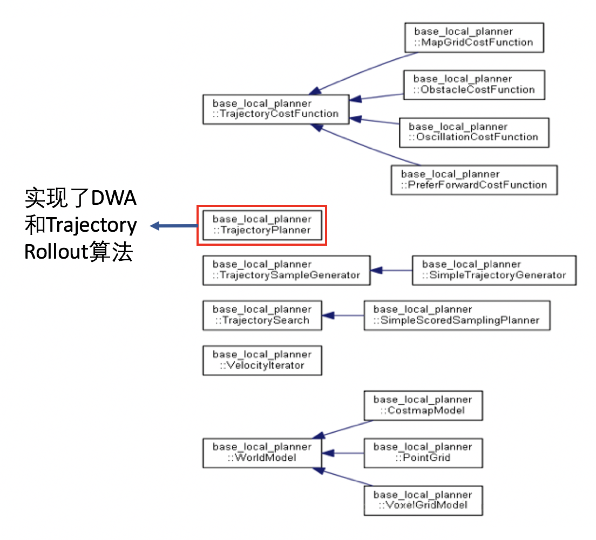

**以上接口是局部规划的核心:**

- TrajectorySampleGenerator产生一系列轨迹
- 然后TrajectoryCostFunction遍历轨迹打分
- TrajectorySearch找到最好的轨迹拿来给小车导航
- 由于小车不是一个质点，worldModel会检查小车有没有碰到障碍物

#### DWA

下面对局部规划中的DWA算法进行介绍。

**dwa_local _planner（DWA）简介**

`dwa_local _planner`包使用`DWA（Dynamic Window Approach）`算法实现了平面上移动机器人局部导航功能。输入全局规划和代价地图后，局部规划器将会生成发送给移动底座的命令。
该包适用于其`footprint`可以表示为凸多边形或者圆形的机器人，它导出配置参数为ROS参数形式，可以在启动文件进行配置，当然也可以动态配置。 这个包的ROS封装接口继承了`BaseLocalPlanner`接口。`dwa_local_planner`包实现了一个驱动底座移动的控制器，该控制器将路径规划器和机器人底座连在了一起。该规划器使用地图创建运动轨迹让机器人从起点到达目标点。移动过程中规划器会在机器人周围创建可以表示为珊格地图的评价函数。这里的控制器的主要任务就是利用评价函数确定发送给底座的速度（dx,dy,dtheta）。

**dwa_local _planner（DWA）示意图**

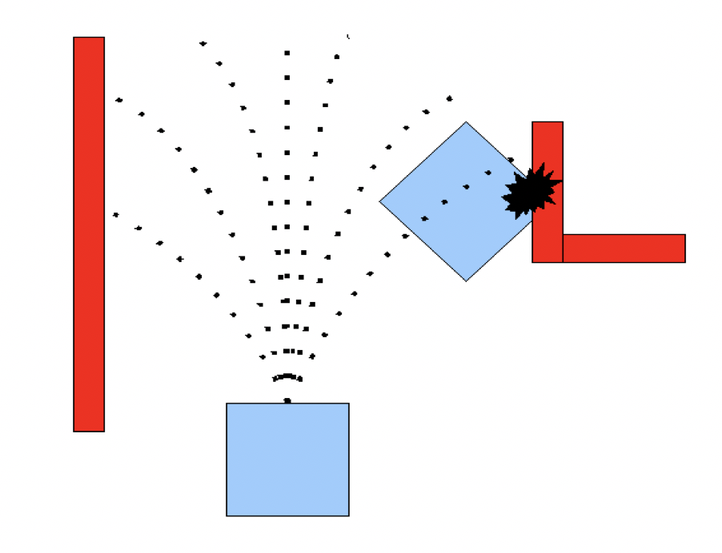

**DWA算法的基本思路**

1. 在机器人控制空间进行速度离散采样(dx,dy,dtheta)
2. 对每一个采样速度执行前向模拟，看看使用该采样速度移动一小段段时间后会发生什么
3. 评价前向模拟中每个轨迹，评价准则如: 靠近障碍物，靠近目标，贴近全局路径和速度；丢弃非法轨迹（如哪些靠近障碍物的轨迹）
4. 挑出得分最高的轨迹并发送相应速度给移动底座
5. 重复上面步骤

**DWAPlannerROS**

`dwa_local_planner::DWAPlannerROS`对象是`dwa_local_planner::DWAPlanner`对象的ROS封装，在初始化时指定的ROS命名空间使用，继承了`nav_core::BaseLocalPlanner`接口。其整个逻辑顺序就是`computeVelocityCommands->findBestTrajectory –>createTrajectories –> generateTrajectory`，最终，选择分数最低的轨迹，发布出去。这便是整个局部规划器的实现思路和逻辑。

### 2.4 costmap

ROS里面的地图，`map`，是一个topic，里面就用来存放当前的地图信息。`costmap`，它和`map`类型相同，都是`occupancygrid`类型，你也可以说它是一种加工过的`map`，把`map`加工就成了`costmap`。但是`costmap`和`map`的用途不一样，`costmap`是专门用来路径规划的，是路径规划器的输入信息，而`map`是SLAM的一个结果。`costmap`是一张2维地图，把三维空间的障碍物投影到水平面上，也就是说即使传感器看到的障碍物是一个圆柱体立在那里，`costmap`也都是一张水平的代价地图。`costmap`可以分成多层，具体有多少层是由你来指定的，不同的层次用于不同的任务分工。比如说通常我们会把地图分成`static layer`，`obstacle layer`，`inflation layer`等，`static layer`是一个全局的静态地图，比如我们之前跑SLAM算法所建立的2维地图，直接提供给`navigation stack`使用。`static layer`会默认订阅`/map` topic，存储不变的信息。`Obstacle layer`地图是根据传感器扫描到的障碍物所生成的地图，可以是激光雷达扫到的平面障碍物，也就是`laserscan`类型的数据，或者是深度摄像头扫到的三维点云，`POintCloud`类型的数据，那这个三维点云就会被投影成一个2维地图，所以这一层就是用来标记障碍物的。`Inflation layer`是进一步在一些致命障碍物（可能发生碰撞的障碍物）周围进行膨胀，然后生成了`inflation layer`，这张`costmap`就可以用来计算路径的cost了。

`costmap`是`move_base`插件，本质上是C++的动态链接库，`catkin_make`编译后生成`.so`动态链接库文件，`move_base`在启动时会通过动态加载的方式调用其中的函数。地图，topic `/map`，图片中的一个像素代表了实际的一块区域，用灰度值来表示障碍物存在的可能性。然而在实际的导航任务中，光有一张地图是不够的，机器人需要能动态的把障碍物加入，清除已经不存在的障碍物，有些时候还要在地图上标出危险区域，为路径规划提供更有用的信息。

**代价地图**

`costmap`是机器人收集传感器信息建立和更新的二维或三维地图，可以从下图简要了解。图中，红色部分代表`costmap`中的障碍物，蓝色部分表示通过机器人内切圆半径膨胀出的障碍，红色多边形是`footprint`(机器人轮廓的垂直投影)。为了避免碰撞，`footprint`不应该和红色部分有交叉，机器人中心不应该与蓝色部分有交叉。

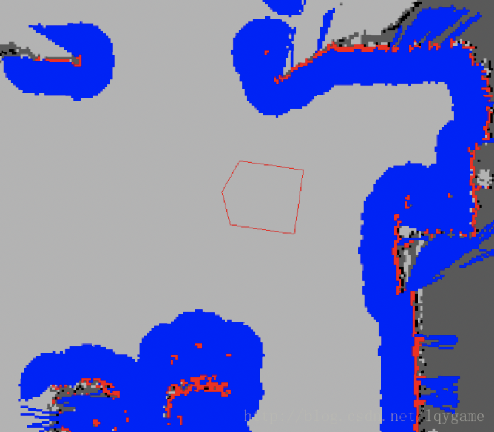

ROS的代价地图`costmap`采用网格`grid`形式，每个网格的值`cell cost`从0~255，分成三种状态：被占用（有障碍）、自由区域（无障碍）、未知区域。

代价地图具体状态和值对应如图所示。

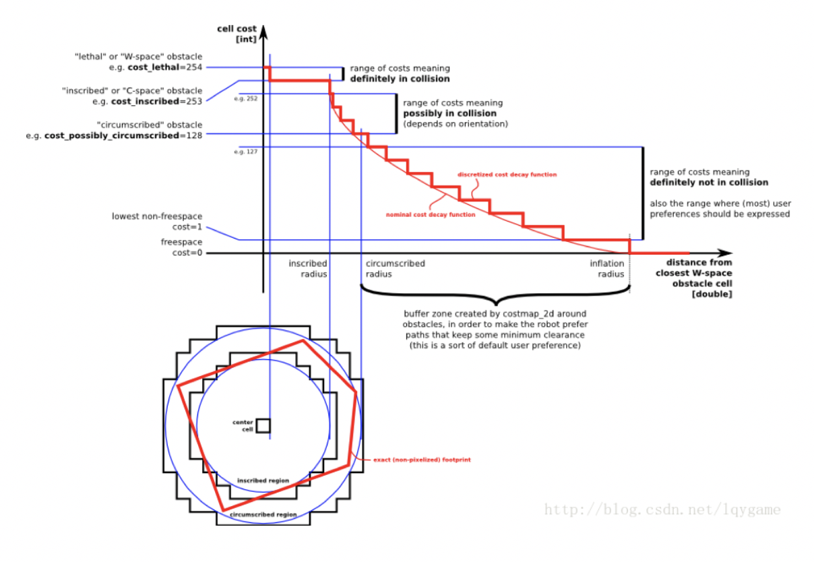

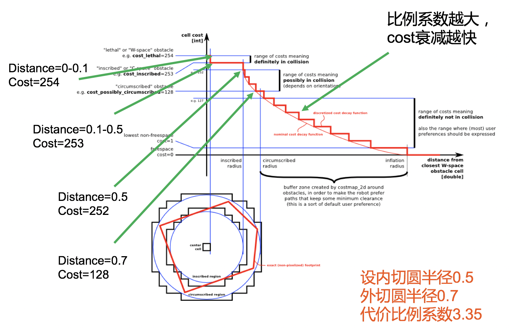

上图可分为五部分，其中红色多边形区域为机器人的轮廓：
1. Lethal（致命的）:机器人的中心与该网格的中心重合，此时机器人必然与障碍物冲突。 
2. Inscribed（内切）：网格的外切圆与机器人的轮廓内切，此时机器人也必然与障碍物冲突。 
3. Possibly circumscribed（外切）：网格的外切圆与机器人的轮廓外切，此时机器人相当于靠在障碍物附近，所以不一定冲突。 
4. Freespace（自由空间）：没有障碍物的空间。 
5. Unknown（未知）：未知的空间。

ROS中`costmap_2d`这个包提供了一个可以配置的结构维护`costmap`，其中`costmap`通过`costmap_2d::Costmap2DROS`对象利用传感器数据和静态地图中的信息来存储和更新现实世界中障碍物的信息。`costmap_2d::Costmap2DROS`为用户提供了纯粹的2维索引，这样可以只通过columns查询障碍物。

举个例子来说，一个桌子和一双鞋子在xy平面的相同位置，有不同的Z坐标，在`costm_2d::Costmap2DROS`目标对应的`costmap`中，具有相同的cost值。这旨在帮助规划平面空间。

Costmap由多层组成，例如在costmap_2d包中`StaticLayer`（静态地图层）是第一层，`ObstacleLayer`（障碍物层）是第二层，`InflationLayer`（膨胀层）是第三层。这三层组合成了`master map`（最终的`costmap`），供给路线规划模块使用。

**Costmap ROS接口**

ROS对`costmap`进行了复杂的封装，提供给用户的主要接口是`Costmap2DROS`，而真正的地图信息是储存在各个Layer中。

下图可以简要说明`costmap`的各种接口的关系

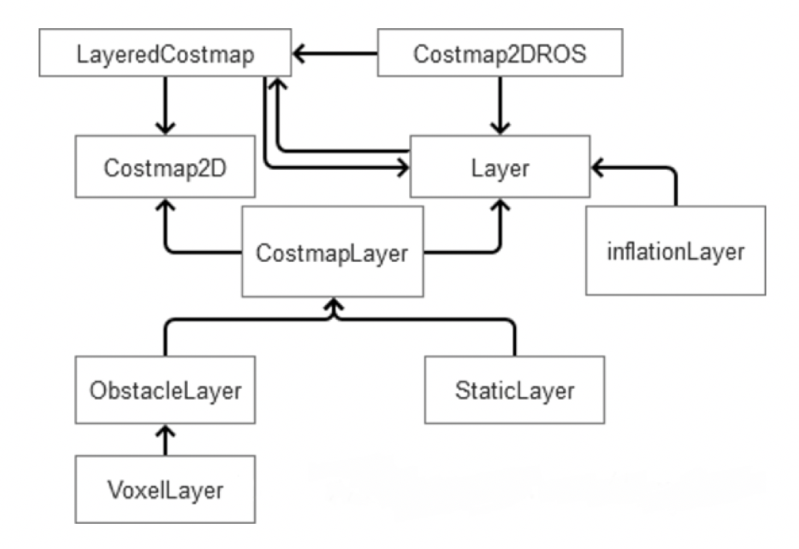

`costmap`主接口是`costmap_2d::Costmap2DROS`，它维持了`costmap`在ROS中大多数的相关的功能。它用所包含的`costmap_2d::LayeredCostmap`类来跟踪每一个层。每层使用`pluginlib`（ROS插件机制）来实例化并添加到`LayeredCostmap`类的对象中。各个层可以被独立的编译，且允许使用C++接口对`costmap`做出任意的改变。

**Costmap初始化流程**

下图为`costmap`的初始化流程。
1. `costmap`初始化首先获得全局坐标系和机器人坐标系的转换 
2. 加载各个Layer，例如`StaticLayer`，`ObstacleLayer`，`InflationLayer` 
3. 设置机器人的轮廓 
4. 实例化了一个`Costmap2DPublisher`来发布可视化数据 
5. 通过一个`movementCB`函数不断检测机器人是否在运动 
6. 开启动态参数配置服务，服务启动了更新map的线程

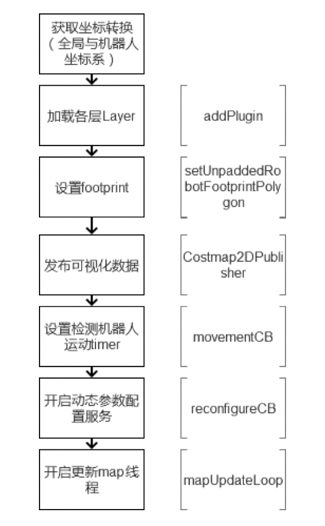

**Costmap Layer**

可以将代价地图理解为，在`/map`之上新加的另外几层地图，不仅包含了原始地图信息，还加入了其他辅助信息。

１．首先，代价地图有两张，一张是`local_costmap`，一张是`global_costmap`，分别用于局部路径规划器和全局路径规划器，而这两个`costmap`都默认并且只能选择`costmap_2d`作为插件。 

２. 无论是`local_costmap`还是`global_costmap`，都可以配置他们的Layer，可以选择多个层次。

**costmap的Layer包括以下几种**

1. `Static Map Layer`：静态地图层，通常都是SLAM建立完成的静态地图
2. `Obstacle Map Laye`r：障碍地图层，用于动态的记录传感器感知到的障碍物信息
3. `Inflation Layer`：膨胀层，在以上两层地图上进行膨胀（向外扩张），以避免机器人的外壳会撞上障碍物
4. Other Layers：你还可以通过插件的形式自己实现`costmap`，目前已有`Social Costmap Layer`、`Range Sensor Layer`等开源插件

**地图插件的选择**

`costmap`配置用`.yaml`文件来保存，存储在参数服务器上。由于`costmap`通常分为`local costmap`和`global costmap`，我们习惯把两个代价地图分开。已课程教学包为例，配置写在了`param`文件夹下的`global_costmap_params.yaml`和`local_costmap_params.yaml`里。

**global_costmap _params.yaml文件的示例**

```
global_costmap: 
global_frame: /map robot_base_  // 全局frame
frame: /base_footprint 	// frame
update_frequency: 2.0     // 更新频率
publish_frequency: 0.5   	// 发布频率
static_map: true 		
rolling_window: false 
transform_tolerance: 0.5    // 容错率
plugins:   // 加载的插件
- {name: static_layer, type: "costmap_2d::StaticLayer"} 
- {name: voxel_layer, type: "costmap_2d::VoxelLayer"} 
- {name: inflation_layer, type: "costmap_2d::InflationLayer"}
```

**local_costmap _params.yaml文件的示例**

```
local_costmap: 
global_frame: /map 
robot_base_frame: /base_footprint 
update_frequency: 5.0 
publish_frequency: 2.0 
static_map: false 
rolling_window: true 
width: 4.0 
height: 4.0 
resolution: 0.05 
origin_x: 5.0 
origin_y: 0 
transform_tolerance: 0.5 
plugins: 
- {name: voxel_layer, type: "costmap_2d::VoxelLayer"} 
- {name: inflation_layer, type: "costmap_2d::InflationLayer"}
```

**Costmap程序架构如下:**

在`move_base`启动时会建立了两个`costmap`，而这两个`costmap`都加载了3个Layer插件，它们的初始化过程如下图所示。`StaticLayer`主要为处理`gmapping`或者`amcl`等产生的静态地图。`ObstacLayer`主要处理机器人移动过程中产生的障碍物信息。`InflationLayer`主要处理机器人导航地图上的障碍物信息膨胀（让地图上的障碍物比实际障碍物的大小更大一些），尽可能使机器人更安全的移动。

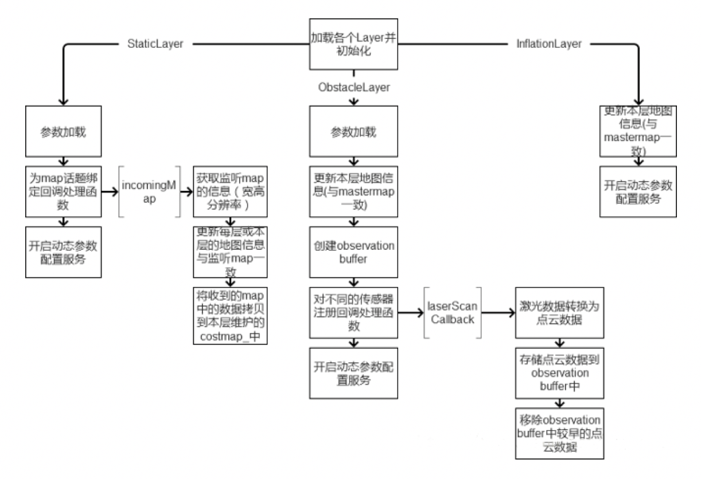

`costmap`在`mapUpdateLoop`线程中执行更新地图的操作，每个层的工作流程如下

**(1) StaticLayer更新流程**

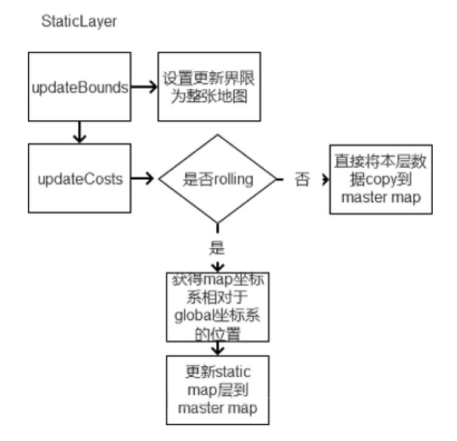

上图是StaticLayer的工作流程。`updateBounds`阶段将更新的界限设置为整张地图；`updateCosts`阶段根据`rolling`参数（是否采用滚动窗口）设置的值，如果是，那静态地图会随着机器人移动而移动，则首先要获取静态地图坐标系到全局坐标系的转换，再更新静态地图层到`master map`里。

**(2) ObstacleLayer更新流程**

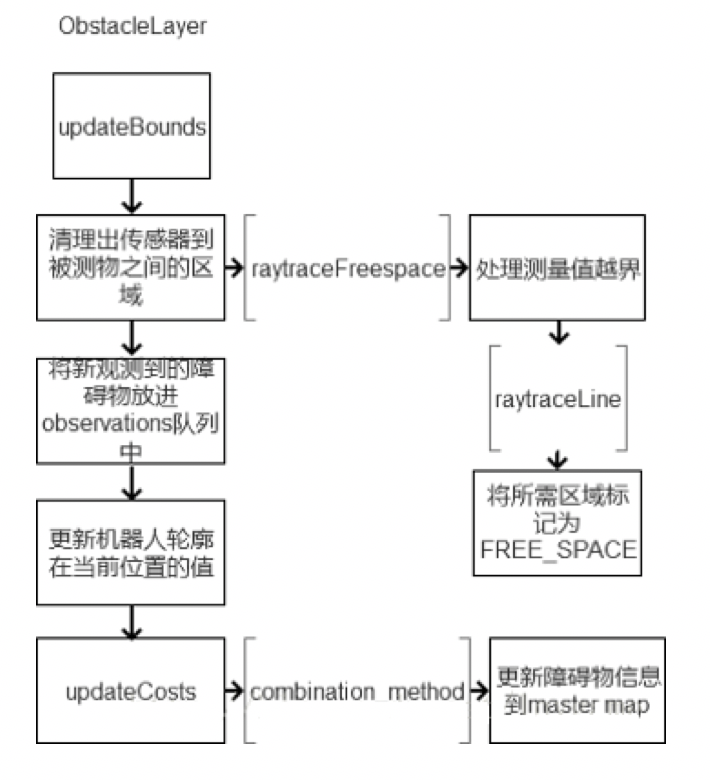

上图是ObstacleLayer的工作流程。`updateBounds`阶段将获取传感器传来的障碍物信息经过处理后放入一个观察队列中；`updateCosts`阶段则将障碍物的信息更新到master map。

**(3) inflationLayer更新流程**

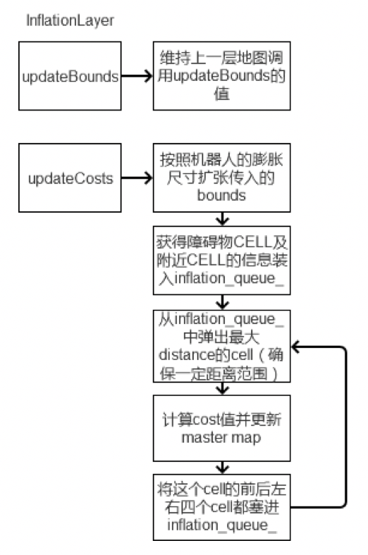

上图是`inflationLayer`的工作流程。`updateBounds`阶段由于本层没有维护的map，所以维持上一层地图调用的Bounds值（处理区域）；`updateCosts`阶段用了一个`CellData`结构存储`master map`中每个grid点的信息，其中包括这个点的二维索引和这个点附近最近的障碍物的二维索引。改变每个障碍物CELL附近前后左右四个CELL的cost值，更新到`master map`就完成了障碍物的膨胀。

## 3. map_server

导航框架中，`map_server`是作为一个可选的`node`位于右上角。

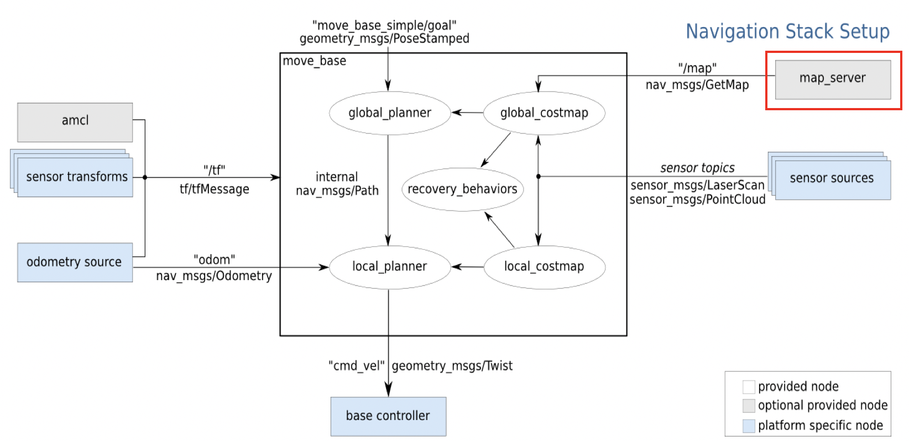

`map_server`这个`node`提供已知的地图信息，或者叫静态地图信息。发布的topic和之前讲过的其他两个`node`很像，就是SLAM里面的`gmapping`和`karto`，它们建立地图都会发布这两个topic，一个是具体的地图的图像，一个是地图的描述信息。这个service的类型，我们之前也见过，它的request不用填，直接会response给你一张当前的地图。然后需要设置一个参数，就是这个`map topic`header里面的`frame`，也就是它所在`tf`里面哪个位置，一般默认就是`map`。

**概念**

`map_server`是ROS中的一个软件包，它提供`map_server`ROS节点，即提供地图数据作为一个ROS服务器。`rosrun map_server map_saver -f xxx`能生成保存到文件中的地图。
`map_server`将地图的数据变成ROS的可以调用数据，将已经建立好的地图提供给机器人。

**map_server地图文件**

map_server地图文件以两种方式存储：
1. `.pgm`文件，它编码了地图的占据性情况。
2. `.yaml`文件，它存储了数据的元数据。

**map_server图像格式**

图像描述了相应像素的颜色中的世界的每个单元的占用状态。白色像素是自由的，黑色像素被占据，并且两者之间的像素是未知的。`map_server`接受彩色和灰度图像，但大多数地图都是灰色的（即使它们可能存储为彩色）。YAML文件中的阈值用于划分三个类别，阈值在`map_server`内部完成。

**.pgm文件**

首先我们来看一下`.pgm`文件。

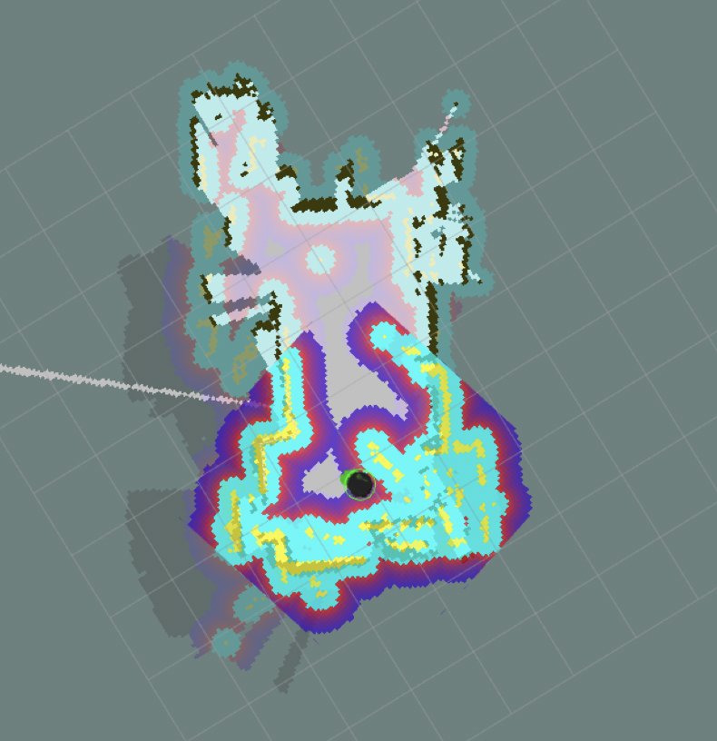

如图`.pgm`文件中白色像素是空的，黑色像素是被占据的，色彩或者灰色的是被接受的。其中图像像素被占据的概率计算公式为

```
occ = (255 - color_avg) / 255.0
```

`mapserver`到底发布什么地图呢？需要提供给他两个东西，一个是一张地图的照片，另一个是一个yaml文件，yaml格式如下，占据的概率为`occ = (255 - color_avg) / 255.0`

```
image: my_map.pgm
resolution: 0.050000
origin: [-25.000000, -25.000000,-25.000000]
negate: 0               #白/黑  自由/占据
occupied_thresh: 0.65   #高于则视为占据
free_thresh: 0.169      #低于则视为空
```

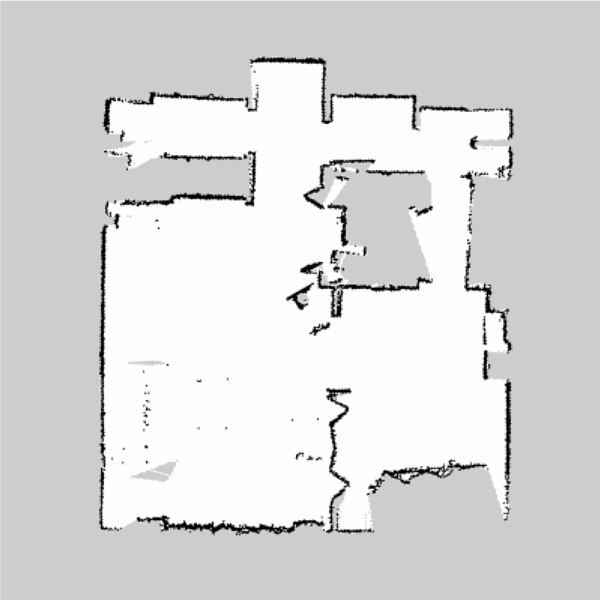

**.yaml文件**

YAML文件描述了地图元数据，并命名了图像文件。 利用图像文件对占用数据进行编码。

```
image:my_map.pgm
resolution:0.050000
origin:[-25.000000, -25.000000, -25.000000]
negate:0                #白/黑  自由/占据
occupied_thresh:0.65    #高于则视为占据
free_thresh:0.169       #低于则视为空
```

yaml文件中的参数定义

- image : 指定包含occupancy data的image文件路径; 可以是绝对路径，也可以是相对于YAML文件的对象路径
- resolution : 地图分辨率，单位是meters / pixel
- origin : The 2-D pose of the lower-left pixel in the map, 表示为 (x, y, yaw), 这里yaw是逆时针旋转角度(yaw=0意味着没有旋转)。目前多数系统忽略yaw值
- occupied_thresh : 像素的占用概率比该阈值大被看做完全占用
- free_thresh : 像素的占用概率比该阈值小被看做完全free
- negate :不论白色/黑色，自由/占用，semantics(语义/符号)应该被反转（阈值的解释不受影响）

**map_server package**

map_server package有两个节点：

1. map_server node：读取地图信息，并作为ROS service 为其余节点提供地图数据

2. map_saver node：保存现有扫描到的地图信息

**map_server node**

`map_server`是一个ROS `node`，可以从磁盘读取地图并使用ROS `service`提供地图。目前实现的`map_server`可将地图中的颜色值转化成三种占用值： `free (0)`，`occupied (100)`，`unknown (-1)`，未来可用0~100之间的不同值指示占用度。

`map_server`发布的topic如下

1. map_metadata (nav_msgs/MapMetaData)：通过这个topic来接受地图元数据(map metadata).

2. map (nav_msgs/OccupancyGrid)：通过这个topic接收地图。

**MapMetaData.msg**

MapMetaData.msg包含有关OccupancyGrid特征的基本信息

```
# 加载地图的时刻
time map_load_time

# 地图分辨率 [m/cell]
float32 resolution

# 地图宽度 [cells]
uint32 width

# 地图高度 [cells]
uint32 height

# 地图原点 [m, m, rad].  对应真实世界框架的cell (0,0) 
geometry_msgs/Pose origin
```

OccupancyGrid.msg为二维网格图，其中每个单元格代表占用概率。

```
#地图的MetaData
MapMetaData info

# 地图数据，按行序存储， 以 (0,0)开始
Occupancy

# 概率在[0,100]内, 未知为-1
int8[] data
```

map_server 提供的services（服务）

- static_map（nav_msgs / GetMap） 
  作用是：通过此服务检索地图。
  

map_server 的parameters（参数）
- ~frame_id（string，default：“map”）
  作用是：要在已发布地图的标题中设置的框架。

**map_saver node**

下面我们来介绍一下 map_server的另一个节点（node）`map_saver node`，其作用是检索地图数据并将其映射保存到磁盘，例如，从SLAM映射服务。

map_saver订阅的topic如下

- map（nav_msgs / OccupancyGrid）

其作用是检索地图数据并将其映射保存到磁盘，例如，从SLAM映射服务。

**map_server**

启动map_server，发布地图

```bash
rosrun map_server map_server  my_map.yaml
```

保存地图

```bash
rosrun map_sever  map_saver  [-f my_map]```
```

## 4. 定位

机器人定位即让机器人知道自己在哪，简单来说，定位需要解决的问题是让机器人在知道地图信息的情况下利用传感器信息确定自己的位置（Localization）。

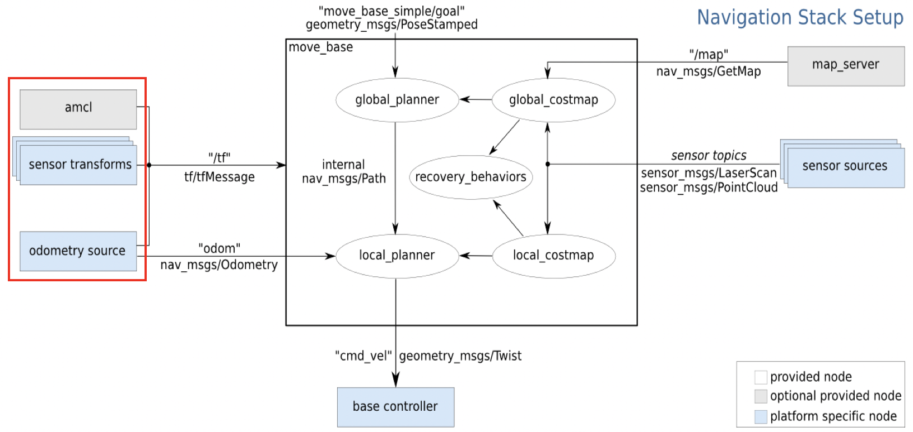


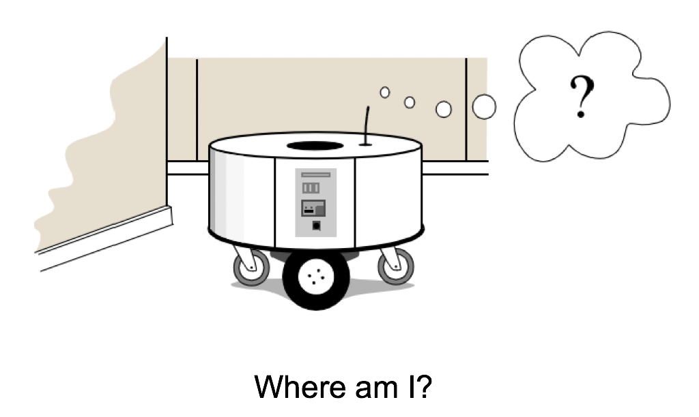

### 4.1 定位技术简介

**定位技术分类**

定位技术可以分为基于信号的定位，包括生活中很常见的全球导航卫星系统，还有超宽带定位。基于环境特征匹配的定位主要使用的传感器包括激光雷达、雷达和相机。基于航迹推演的定位使用IMU和编码器来做定位。

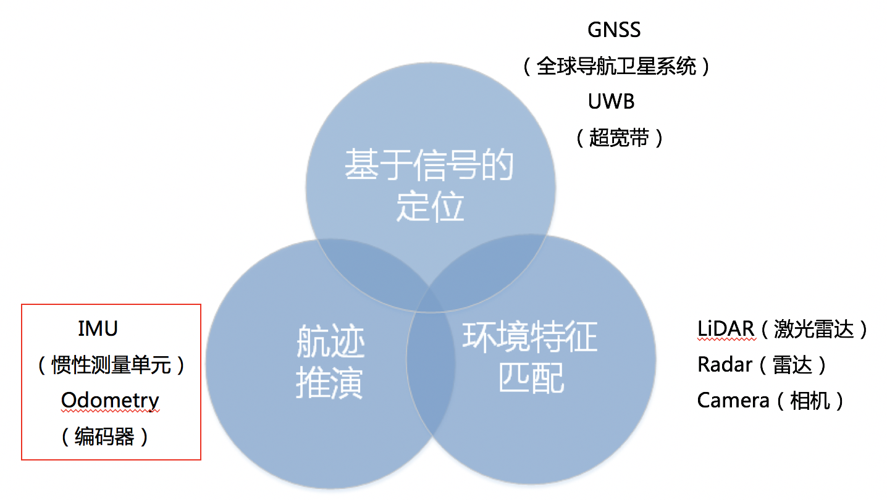

**RTK定位技术**

我们先结合几张图片来直观感受一下定位技术，首先是RTK定位技术，即实时动态定位。它的优点是
全球、全天候、全天时、高精度；缺点是基站布设成本高、 强依赖可视卫星数、易受电磁环境干扰、GNSS信号遮挡引起多径效应（即电磁波传播的一种干扰现象）。


**捷联惯性导航定位技术**

下边几张图片是IMU，即惯性测量单元，它可以测量物体的加速度和角速度，然后通过积分运算计算出速度和角度，从而推算出物体的位置和姿态。优点是包含六自由度信息、短时精度高、输出频率高；缺点是误差随时间会累积，后面我们会讲累计误差的消除。

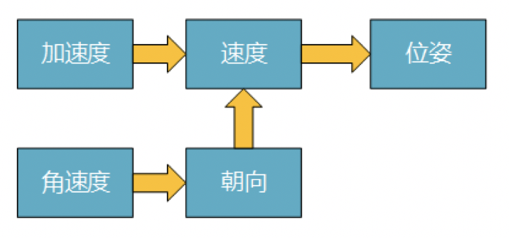
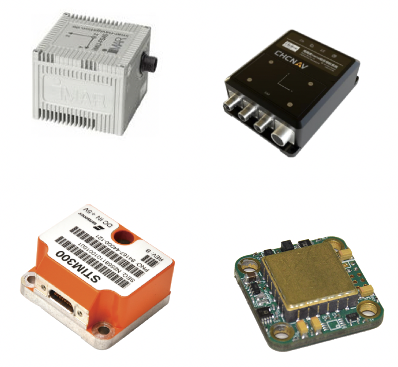

**激光雷达定位技术**

激光雷达定位技术，通常系统会预先建立3D的概率地图，然后根据实时的激光点云与先验地图进行匹配，通过运算匹配目标。优点是弱或者无GNSS区域条件下仍然可以工作、鲁棒性高；缺点是需要预先制作地图、需要定期更新地图、雨雪天会影响。

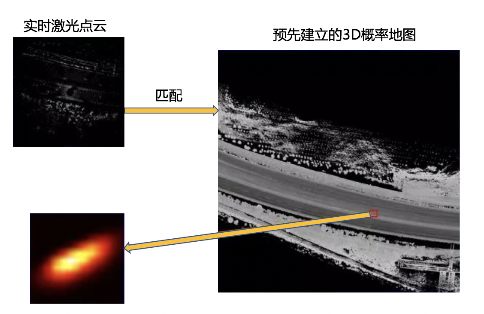

### 4.2 航迹推测法

**Dead Reckoning/导航推测**

导航推测是在初始位置上累加位移矢量计算当前位置，它是一个信息累加的过程。如下图所示，每次累加的位移矢量都较短也较精确，包括角度，位置等。起始位置（x0和y0）以及方位角（Θ）可由GPS定位得到。

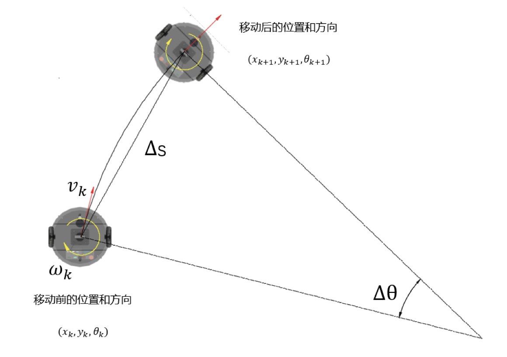

**求解(x,y)需要的已知条件**

需要的已知条件包括机器人的位置及移动方向，由于速度是已知的且是矢量，因此各个条件（包括角速度，方向等）也是已知的。

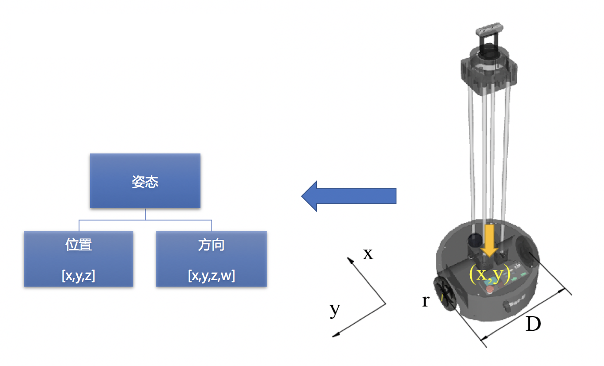

#### 4.2.1 编码器航迹推测法

下图的码盘是常用的传感器，类似于车辆里程计，记录车轮转数，获得机器人相对于上一采样时刻状态改变量。


右图的编码器（encoder）是将信号（如比特流）或数据进行编制、转换为可用以通讯、传输和存储的信号形式的设备。编码器把角位移或直线位移转换成电信号。

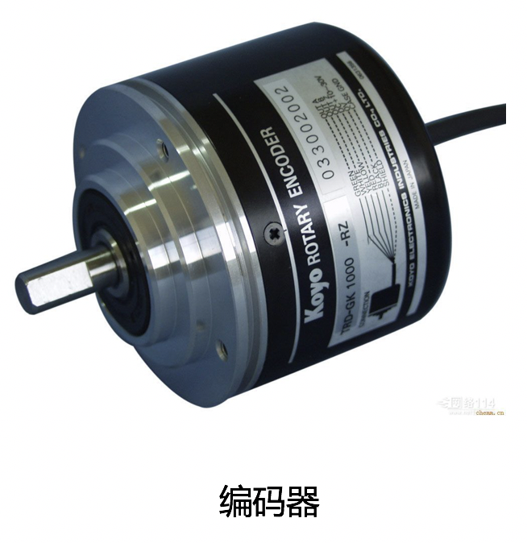

此处应使用增量式编码器，将位移转换成周期性的电信号，再把这个电信号转变成计数脉冲，用脉冲的个数表示位移的大小。

一个实际使用的例子，如图所示

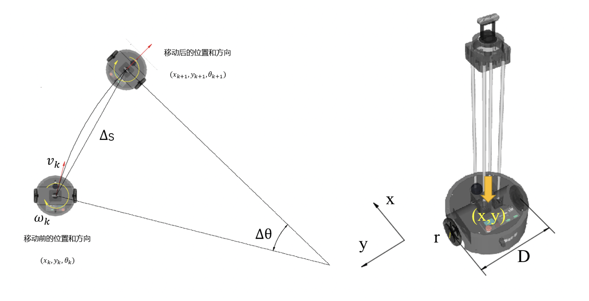

假设D是两轮间距，r是主动轮（小轮）半径。当机器人在短时间𝑇_e 内移动很小的一段距离时，可以根据左右电机旋转量计算出左右轮的转速(𝑣_𝑙,𝑣_𝑟 )，以𝐸_𝑙𝑐, 𝐸_𝑟𝑐 代表现在(current)时刻的编码器值，以𝐸_𝑙p, 𝐸_𝑟𝑝 代表之前时刻(past)的编码器值。

**编码器缺点有哪些?**

编码器的误差会积累。举个简单的例子，如果机器人在行走的时候，遇到一个小坑，颠簸了一下，结果导致机器人朝向和位置解算失败，是不是有点盲人摸象的感觉。同时善于观察生活的你一定发现，盲人在走路的时候需要一根拐杖，用来敲一敲周围环境，这就是对环境的感知，因此我们需要其他传感器进行融合。 

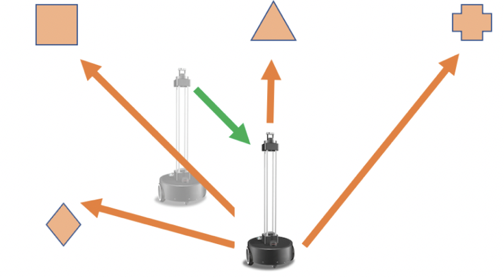

#### 4.2.2 惯性测量单元航迹推测法

**惯性测量单元简介**

IMU惯性测量单元，由加速度计和陀螺仪组成，加速度计可以测量三维空间对应坐标轴的加速度，陀螺仪则可以测量对应坐标轴的角速度。接下来我们以GY-951为例来介绍惯性测量单元航迹推测法

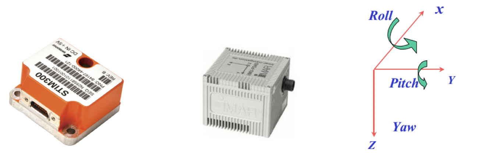

**惯性测量单元-GY951**

下图为GY-951，图中标出了x和y轴的方向，z轴的方向通过右手法则确定。我们从IMU的数据可以读取x,y,z方向的线加速度和角速度，以及IMU的朝向欧拉角Roll、Pitch、Yaw。

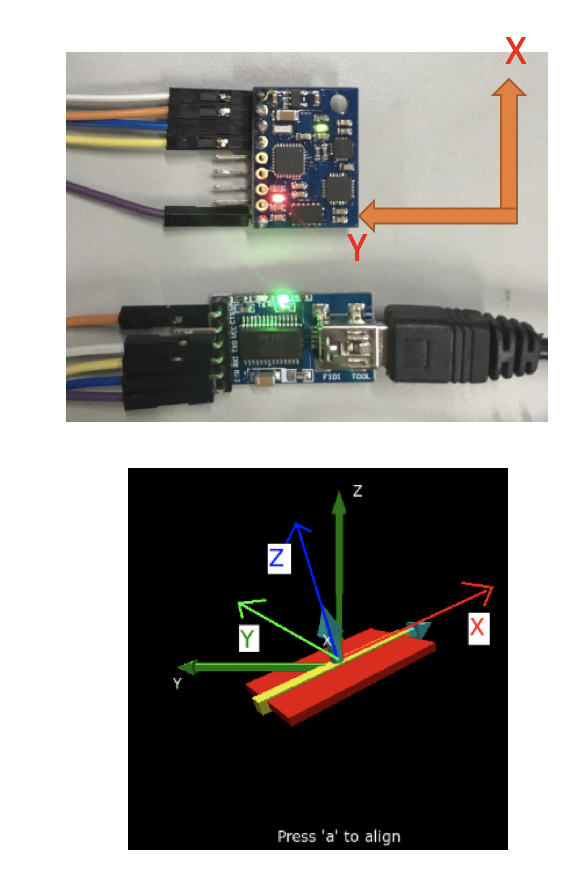

**惯性测量单元航迹推测算法**

通过高中物理知识可得到以下公式。

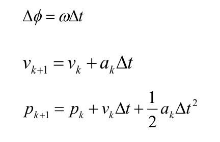

其中 w和a分别表示角速度和线加速度，k为当前时刻，Vk为k时刻的速度， Pk为k时刻的累积位移， ΔΦ为角度值。需要注意的是，公式成立的条件是:移动机器人做直线运动。

### 4.3 AMCL算法

1. 蒙特卡洛法和粒子滤波

2. 蒙特卡洛定位方法步骤

3. AMCL 及其优点

**蒙特卡洛方法**

在介绍MCL（蒙特卡洛定位）之前，我们先来引入MC。蒙特卡洛方法（ Monte Carlo method ）也称统计模拟方法，是二十世纪四十年代中期由于科学技术的发展和电子计算机的发明而被提出的以概率和统计的理论、方法为基础的一种数值计算方法，将所求解的问题同一定的概率模型相联系，用计算机实现统计模拟或抽样，以获得问题的近似解，故又称随机抽样法或统计试验法。

**蒙特卡洛方法举例**

接下来，我们介绍一个蒙特卡洛方法的例子，求函数y=x2在[0,2]区间的积分，即求如下图所示的红色区域的面积。当然直接用数学中的定积分公式算更简单精确，这里主要是举例说明下蒙特卡洛方法的使用过程。

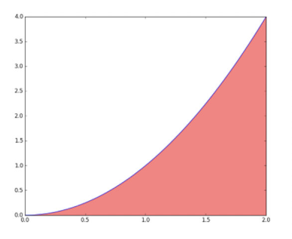

如下图所示，该红色区域在一个2×4的正方形里面。使用蒙特卡洛方法，随机在这个正方形里面产生大量随机点（数量为N），计算有多少点（数量为count）落在红色区域内（判断条件为y<x2），count/N就是所要求的积分值，也即红色区域的面积。

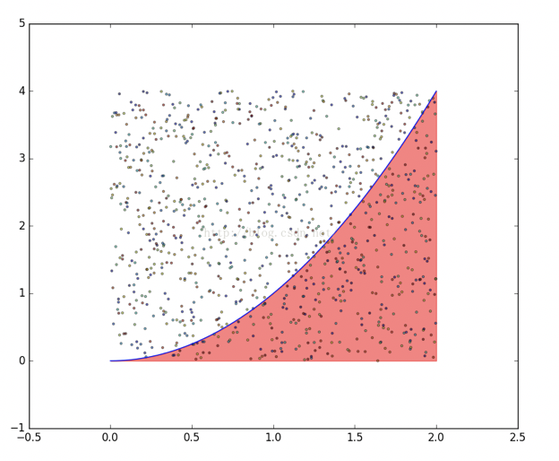

**粒子滤波**

粒子滤波（Particle Filter）思想基于蒙特卡洛方法，是指通过寻找一组在状态空间中传播的随机样本来近似的表示概率密度函数，用样本均值代替积分运算，进而获得系统状态的最小方差估计的过程，这些样本被形象的称为“粒子”，故而叫粒子滤波。简而言之，粒子数代表某个东西的可能性高低。通过某种评价方法（评价这个东西的可能性），改变粒子的分布情况。优点是其建模随机变量的非线性变换的能力，如下图所示。

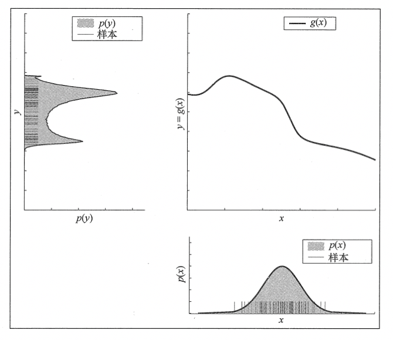

**粒子滤波举例**


在机器人定位中，某个粒子A，我觉得这个粒子在这个坐标的可能性很高，那么我给该坐标高权重。下次重新安排所有的粒子的位置的时候，就在这个位置附近多安排一些。这样多来几轮，粒子就都集中到可能性高的位置去了。

**蒙特卡罗定位（MCL）**

上面介绍了MC与PF，我们对它们的定义和应用有了一定的了解，这一节我们将介绍蒙特卡洛定位方法的步骤。我们先给出了蒙特卡罗定位的一个一维走廊的示例。初始全局不确定性通过随机抽取的位姿粒子集合取得,均匀分布在整个位姿空间

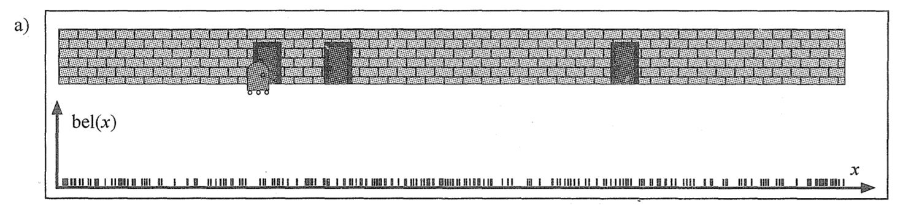

机器人感知到门时,蒙特卡罗定位为每个粒子分配重要性系数。每个粒子高度表示了它的重要性权重（注意：粒子集合不变）

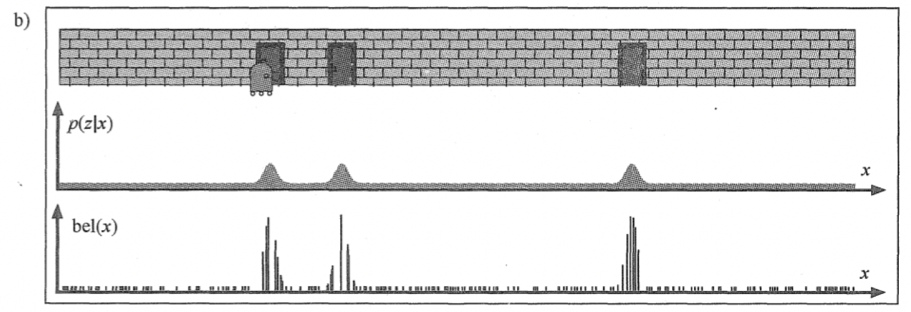

接着我们进行重采样并更新粒子集合，在3个高权重位置附近增加了粒子数。

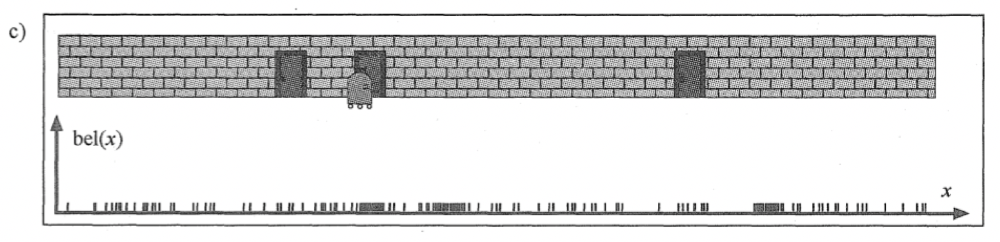

重新测量分配非均匀权重的粒子集合。此时，大部分加重的概率质釐集中在第二个门口，这也就是机器人最可能的在的位置。

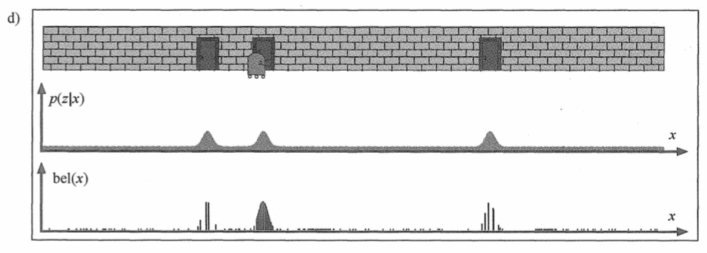

机器人进一步的运动引起新的预测流程，另一重采样步骤和根据运动模型产生新粒子集合的步骤。

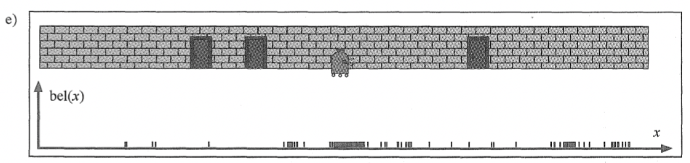

这里我们来总结一下算法MCL的流程

MCL的不足之处：

1. 数量N 越大，MCL 定位成功的几率越大，精度越高，但是计算量也越大。
2. 粒子数量N 较少就会发生了粒子贫化现象，导致全局定位失败。

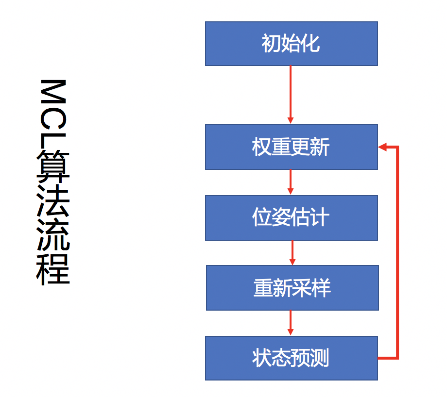

**自适应蒙特卡罗定位(AMCL)**

在蒙特卡洛定位算法中，影响机器人定位精度的关键因素之一为粒子数目，一般而言，粒子数越多，机器人定位越准确，与此同时在定位过程中计算量也越大，从而导致实时性降低；当粒子数目较少时，粒子距离真实的后验概率分布越远，导致定位精度降低 。自适应蒙特卡洛算法（Adaptive Monte Carlo localization ）可以被看作蒙特卡罗定位算法的改进版本，它通过在蒙特卡罗位置估计算法中使用少量样本来减少执行时间，以此提高实时性能。蒙特卡罗定位以目前的形式能解决全局定位问题,但是不能从机器人绑架（强制移动机器人到新的位置）中或全局定位失效中恢复幸运的是,这个问题能通过相当简单的探索算法解决，通过增加随机粒子到粒子集合。

我们来看一个AMCL算法的例子：

首先在场景中随机布置粒子

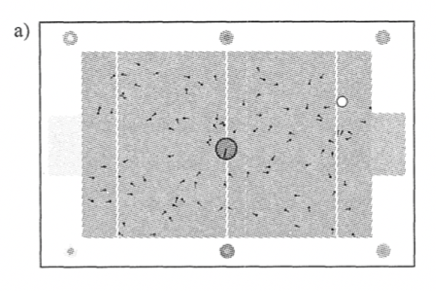

在进行第一次标记检测时,几乎所有粒子根据传感器测量值的采样检测抽取

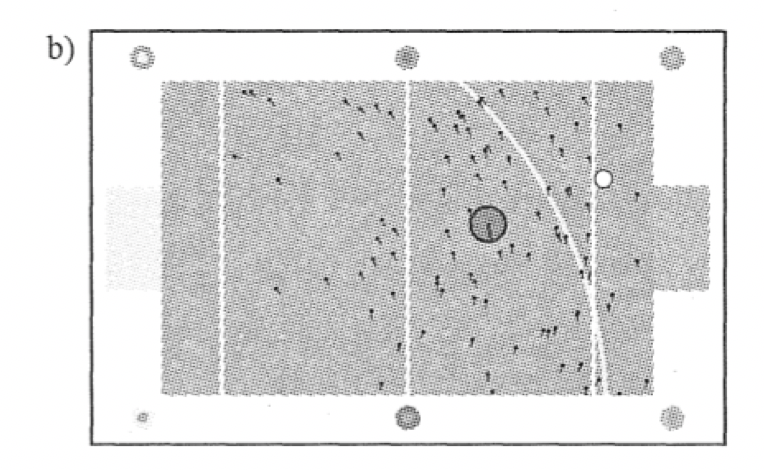


随着不断进行MCL，粒子逐渐集中，在这个定位阶段,机器人只是跟踪其位置,观察似然值,并且只偶尔增加小数最的随机粒子。

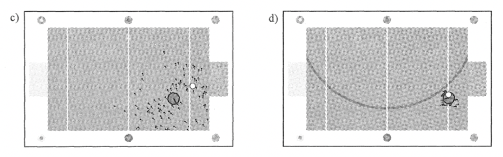

绑架机器人后，第一次标记检测还没有触发任何附加粒子，测量概率下降，进行
了几次标记检测后,有更多的随机粒子被加进来。

[98](images/Figure_4.29.png)

最后,机器人成功重定位它自己，增强的蒙特卡罗定位算法确实有能力在绑架中“幸存”下来。

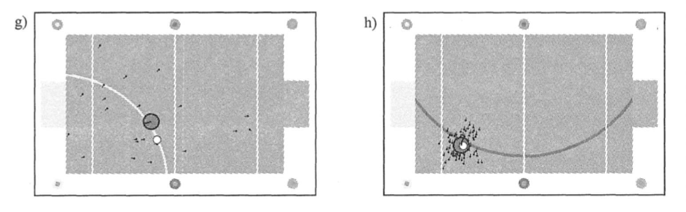

AMCL算法流程如图所示，相比于MCL算法，AMCL在重采样过程中加入了 和KLD-sampling
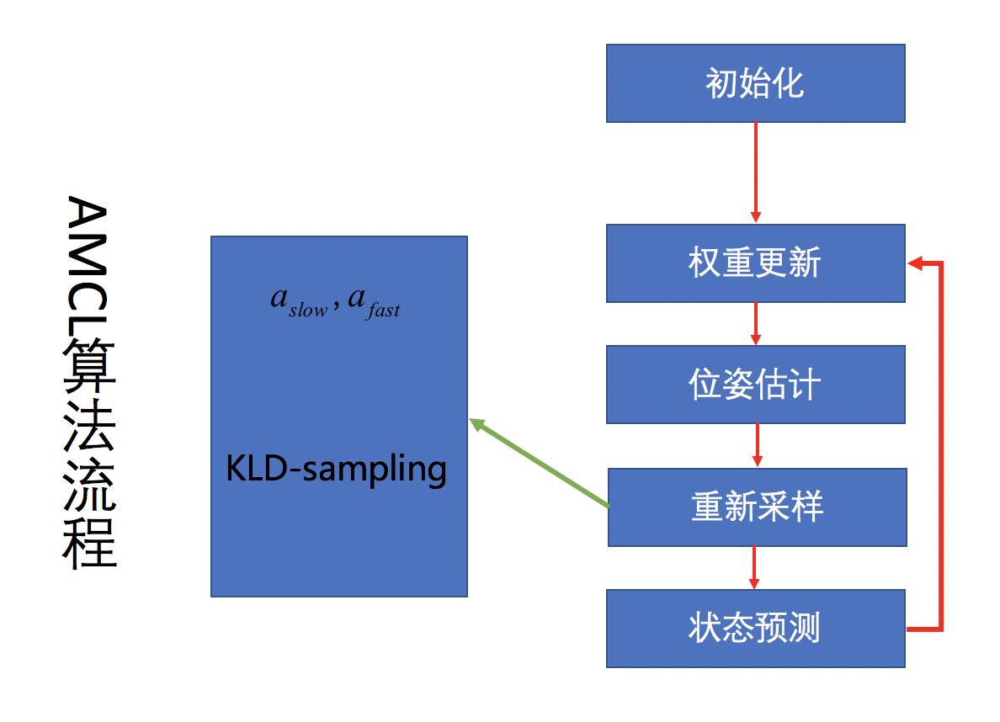

**自适应蒙特卡洛算法的优点**

1. 自适应蒙特卡洛算法解决了机器人绑架问题，它会在发现粒子们的平均分数突然降低了（意味着正确的粒子在某次迭代中被抛弃了）的时候，在全局再重新的撒一些粒子。

2. 解决了粒子数固定的问题，因为有时候当机器人定位差不多得到了的时候，比如这些粒子都集中在一块了，还要维持这么多的粒子没必要，这个时候粒子数可以少一点了。

输入是map，输出tf(odom-map)

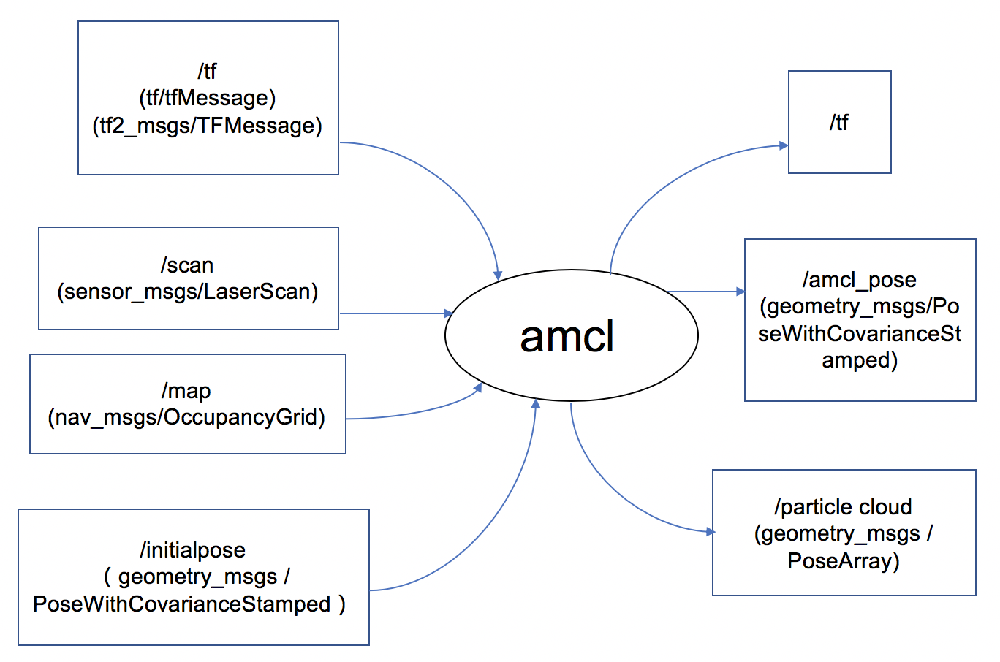

引入了AMCL后可以减小累计误差对定位准确度的影响

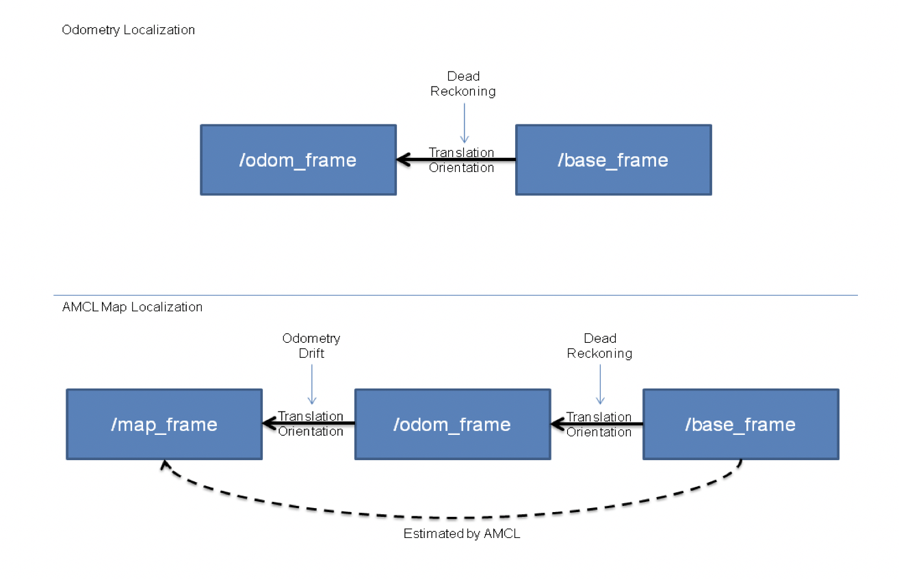