## 8.4 Navigation演示

这讲我们通过一些实例来学习ROS Navigation。全课分为定位和避障、RViz、move_base、规划器和代价地图四个部分。

**本讲重点**

- 定位和避障
- Rviz
- move_base 
- 规划器和代价地图

**教学目的**

- 熟练掌握XBot激光SLAM建图、定位、自动导航和避障的操作步骤
- 熟练掌握Rviz在建图和导航时的配置方法
- 熟练掌握全局规划器、全局代价地图、局部规划器、局部代价地图的选择和参数配置

### 1. 定位和避障

我们需要做些什么才能够实现ROS导航？首先，我们需要一个地图

#### 1.1 地图

要实现导航最最首要的事情当然是地图了，我们需要一个地图来表示当前机器人所属的环境，我们希望使用这个地图进行导航，我们的目标就是让机器人能够认知自己在环境中的位置并能够自动地导航并前往给定的目标点。我们使用我们的机器人去构建环境的地图，换言之，一个地图就是机器人使用它的传感器读取的数据（例如激光雷达）构建而成的环境的一种表示形式。现在就让我们回顾演示一下建立地图的过程。

**执行以下程序进行仿真演示**

```bash
roslaunch robot_sim_demo robot_spawn.launch
rosrun slam_sim_demo gmapping.demo.launch
roslaunch slam_sim_demo view_slam.launch
rosrun robot_sim_demo robot_keyboard_teleop.py
```

<div align="center">
  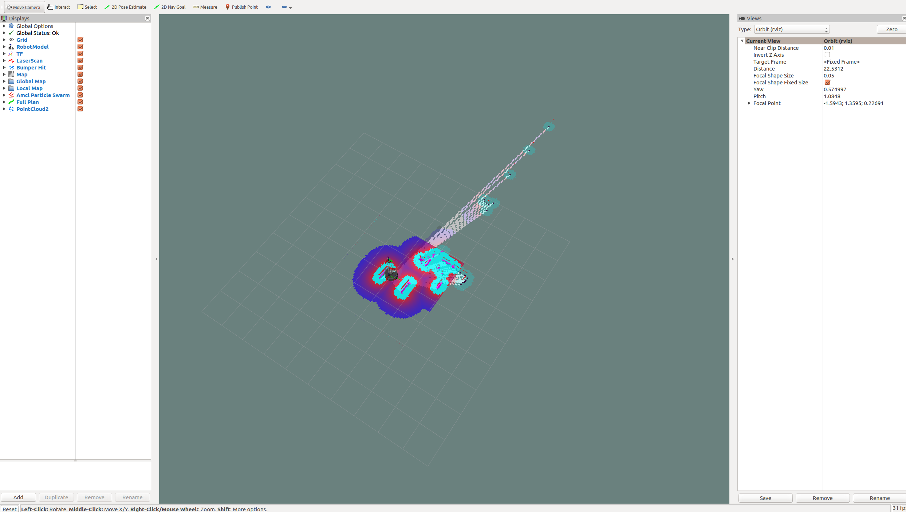
</div>

此时使用robot_keyboard_teleop.py脚本对Xbot进行控制建立环境地图（此处是真实环境的演示图，之后是仿真中的图，但是演示时应当使用真实环境进行实时演示）在我们的可视化界面RViz中可以看到使用gmapping算法建立的地图模型，由于我们当前使用的是激光雷达实现的导航算法，在我们的RViz中有显示激光雷达的数据，我们可以看到图中的红线，这就是我们的激光雷达传感器获取到的数据，这些数据正用于建立这个地图。当我们驱动机器人在环境中四处游荡时，我们就可以获得当前环境的完整地图，就像这样。

#### 1.2 定位

好的，我们现在已经知道地图的重要性以及如何绘制地图了，现在我们又有一个疑问，拥有地图是否已经足够了？如果不够，我们接下来又需要做什么才能实现我们的目的：自主导航呢？答案当然是不够，除了地图之外我们还需要进行定位，也就是让机器人知道自己处于给定的地图中的哪一部分，准确的说是得知自己在给定地图下的位姿，这个位姿包括位置与姿态，也就是机器人的朝向。那么接下来我们还是简单地演示一下定位的方法。（运行ppt中命令，之后使用2d navi goal选择目标点）

```bash
roslaunch robot_sim_demo robot_spawn.launch
roslaunch navigation_sim_demo amcl_demo.launch
roslaunch navigation_sim_demo view_navigation.launch
```

在RViz界面中，我们可以看到这些绿色的点，仔细地看可以看出这是一些向量，它们表示对机器人当前位姿的估计，在开始的时候我们的算法对机器人的位姿估计偏差如此的大，可以说这样的定位是完全不可能直接使用的。那么我们接下来移动一下机器人看看会发生什么（这时移动机器人），可以看到在进行了移动之后，绿圈的范围逐渐缩小，这意味着我们对机器人的位姿估计更加的准确了。

<div align="center">
  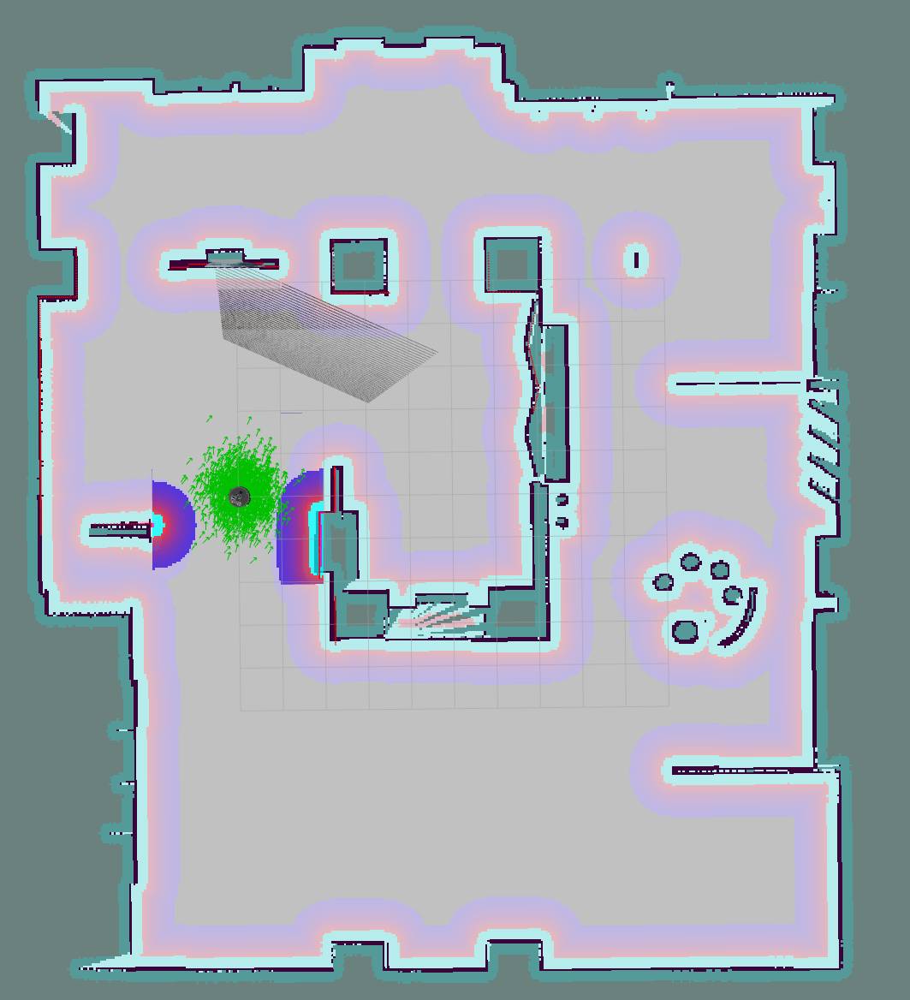
</div>

你的机器人运动的越多，我们越能从机器人的传感器数据中获取到更多的信息，我们的定位也就更加准确。

<div align="center">
  
</div>

事实上，你的机器人运动的越多，我们越能从机器人的传感器数据中获取到更多的信息，我们的定位也就更加准确。在我们的传感器数据和地图数据中存在一定的偏差，我们运动的越多就越能对我们的定位信息进行调整。并以此减少这个偏差。

#### 1.3 目的地

我们需要为机器人指定一个目的地(Goal location)，让机器人通过一系列规划到达目标位姿。和之前一样，我们还是通过程序演示展示给定目标的方法： 还是刚才的程序，不用关使用RViz中的2D Pose Estimate重新给出机器人的位姿估计。

现在我们有了地图和机器人的位置，除此之外我们还需要什么呢？很显然，我们需要的是目标，我们需要为机器人指定一个位姿，让机器人通过一系列规划到达目标位姿。和之前一样，我们还是通过程序演示展示给定目标的方法： 还是刚才的程序，不用关 我们在RViz中可以非常轻松的实现给定目标位姿，为了看得更明显，我们先使用RViz中的2D Pose Estimate重新给出机器人的位姿估计。

<div align="center">
  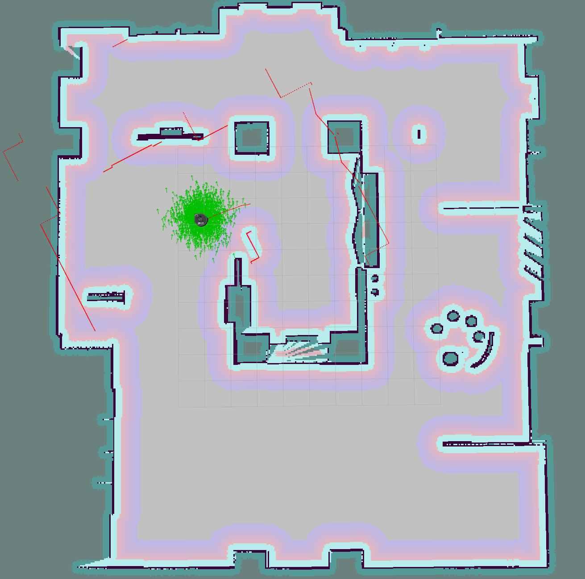
</div>
红线：表达雷达数据

一旦我们确定了这一位姿，算法给出的所有位姿估计都会转移到刚刚给定的点上，我们也可以看到此时表示雷达数据的红线和我们的地图并不是重合的了，这说明我们的位姿估计是明显错误的，我们可以还用刚才的方法通过移动机器人来找出正确的位姿，但是我们这次直接给出目标位姿，让机器人在自动的运动中找出正确的位姿。

<div align="center">
  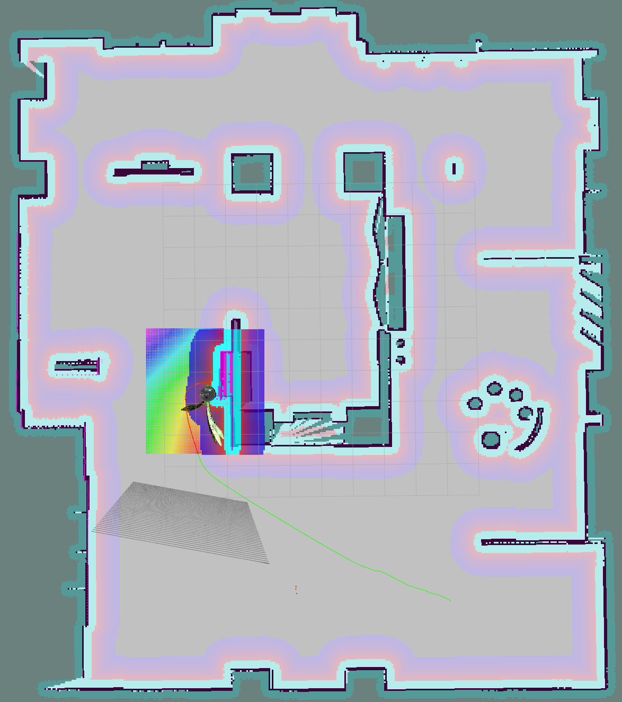
</div>

可以看到在给出了目标位姿之后，我们的算法给出了一条从机器人当前位姿到目标位姿的规划径，机器人顺着这一路径可以逐步到达目标位姿，随后结束运动。而且在运动的过程中，我们的绿色圈圈也在不断的缩小，我们代表雷达数据的红线也逐渐地和地图重合，也就是说定位越来越准确。

#### 1.4 避障

在实现了上述目标之后，我们需要知道，我们解决的仅仅是静态环境中的导航问题，在真实环境中我们是没有办法保证环境是绝对静态的，可能会有来回走动的人，这就需要我们在实现静态环境的导航基础上，实现一个避障的功能。这里的障碍物指的是在我们建立的地图中没有出现的不可通过的区域。我们继续在程序中进行演示：还是刚才的程序，不用关 我们现在Gazebo仿真环境中加一些障碍物，我们将障碍物做的大一点以凸显避障的效果。

<div align="center">
  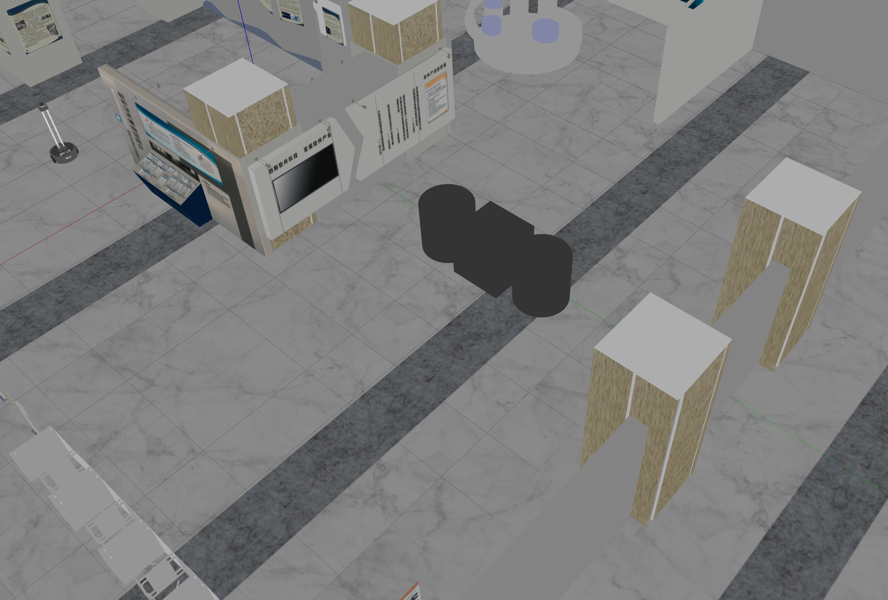
</div>

随着机器人和障碍物越来越近，我们可以发现首先是机器人的激光雷达探测到了障碍物，当机器人不断接近障碍物的时候，机器人规划的路径也发生了改变，可以看到机器人选择绕离放置障碍物的地方并最终成功地到达了目标位姿。

<div align="center">
  
</div>

接下来我们使用上一部分中使用的方法增加目标位姿，可以看到此时我们还没有探测到障碍物，规划出来的路线仍然是正常的路线，而且在RViz的地图中也没有显示障碍物。但是随着机器人和障碍物越来越近，我们可以发现首先是机器人的激光雷达探测到了障碍物，当机器人不断接近障碍物的时候，机器人规划的路径也发生了改变，可以看到机器人选择绕离放置障碍物的地方并最终成功地到达了目标位姿。

### 2. RViz

那么接下来就让我们开始使用RViz吧！

#### 2.1 在RViz中查看地图

在建图这一任务中我们需要使用RViz来显示我们的激光雷达数据和地图数据，让我们运行之前使用过的程序，使用gmapping算法实现建图功能。

**查看雷达扫描数据**
```bash
rosrun rviz rviz
```

让我们运行这行命令打开RViz： rosrun rviz rviz 与上节课中我们看到的RViz不同，在这里现在还是一片空白，我们需要添加一些东西才能看到我们需要的。首先是非常简单的添加机器人模型，我们现在想添加激光雷达的数据，那么我们就点击添加，添加LaserScan。

<div align="center">
  
</div>

添加完之后还是什么都没有，这是因为我们没有给出需要显示的话题，在`topic`中可以输入或者选择需要进行显示的雷达数据话题，在添加完之后我们可以看到上节课中出现了的红线，但是这条红线太细了，我们可以通过调整`size`来调整红线的宽度。

- 添加LaserScan。

- 通过调整size来调整红线的宽度

<div align="center">
  
</div>
**查看地图**

和添加激光雷达数据是一样的，我们可以通过添加map在RViz中可视化的查看地图，当然我们也需要在topic中添加我们希望显示的地图，在这里我们选择显示/map这一地图信息。

<div align="center">
  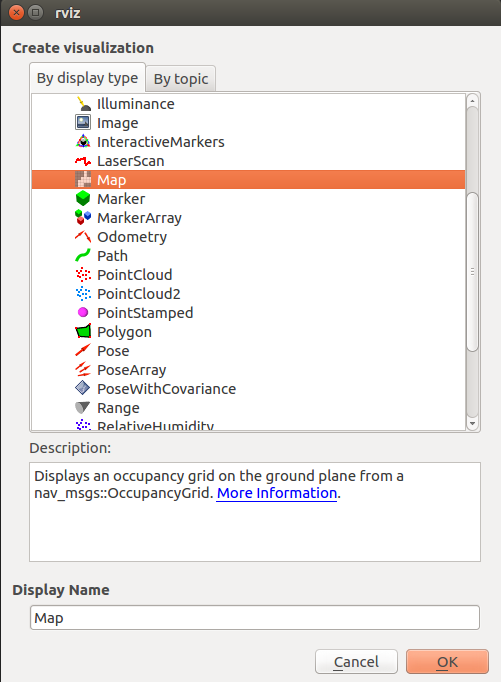
  
</div>

**保存RViz配置**

为了让我们下次打开RViz的时候能够不用重复的调整这些配置，我们可以保存RViz的配置并在下次调用时直接使用这些配置，只需要在File下选择save config as就可以将当前设置好的配置存储为一个.rviz文件，在重新调用的时候可以使用类似的launch文件直接运行。

```xml
<launch>
  <node name="rviz" pkg="rviz" type="rviz" args="-d $(find slam_sim_demo)/rviz/slam.rviz"/>
</launch>
```

#### 2.2  提供地图（map_server）

map_server节点用于读取地图文件并通过ROS服务提供地图。从map_server节点中获得地图信息，如move_base节点使用地图信息执行路径规划，服务static_map(navmsgs/GetMap)。我们可以使用下面这行命令尝试调用这一服务，可以看到这一服务调用的结果是输出地图的图像信息和辅助信息
```
rosservice call /static_map "{}”
```
除了服务以外，还有两个话题也可以得到表示地图信息的消息：
- mapmetadata(navmsgs/MapMetaData)：可以提供地图的辅助信息
- map(nav_msgs/OccupancyGrid)：可以提供地图的占用数据

使用RViz进行查看
```
rosrun map_server map_server my_map.yaml
```

<div align="center">
  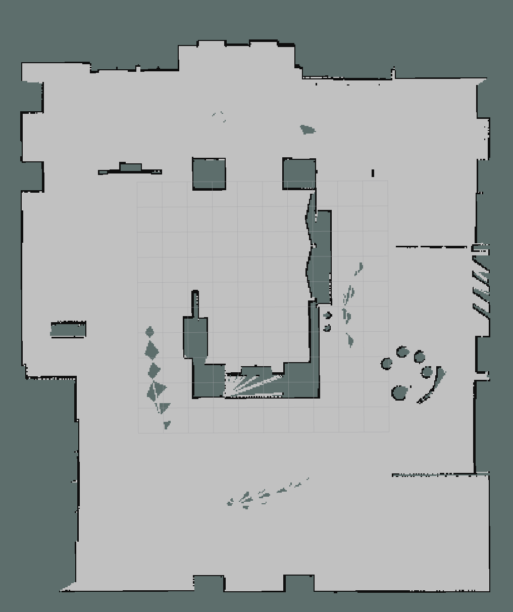
</div>

可以看到在RViz中添加了地图显示后就能看到我们刚刚在gmapping演示中建立的地图了！ 通过刚才的学习大家必须理解，我们建立的地图属于静态地图，这意味着一旦我们建立了环境的地图他就会一直如此，而且在你创建地图的时候获得到的环境是当前时刻的环境，正因如此未来的环境改变将不会出现在我们建立的静态地图中；除此之外，我们创建的是一个2D地图，这意味着它没有高度信息，如果我们需要为无人机设计导航系统那么这个地图便没有任何用处。

**在RViz中查看定位**

在接下来的演示中，我们除了上节课中添加的地图Map和激光雷达LaserScan外还会添加在AMCL定位算法中用到的PoseArray，接下来让我们先运行下面的命令来启动定位算法的演示程序。

```bash
roslaunch robot_sim_demo robot_spawn.launch
roslaunch navigation_sim_demo amcl_demo.launch
rosrun rviz rviz
```
现在我们打开了RViz可视化环境，接下来请大家复习一下上节课的操作，在界面中添加显示激光雷达数据和地图数据并设置相关的话题和其他参数，下面我们来添加这节课中新出现的PoseArray。


<div align="center">
  
</div>

在topic中选择添加particlecloud话题，添加完之后可以在RViz界面中看到下图这样的一群小箭头，这些小箭头就是算法提供的对机器人当前位姿的估计，包括位置和朝向。

<div align="center">
  
</div>

<div align="center">
  
</div>

#### 2.3 在RViz中查看路径

**需要使用rviz的3个元素**

- 地图显示(Costmaps)

- 路径显示(Plans)

- 二维工具

运行命令
```bash
roslaunch robot_sim_demo robot_spawn.launch
roslaunch navigation_sim_demo amcl.launch
```

```
我们可以使用下面这行命令打开我们这节课使用的脚本：

roslaunch robot_sim_demo robot_spawn.launch
roslaunch navigation_sim_demo amcl.launch

之后打开RViz图形界面rosrun rviz rviz
```

<div align="center">
  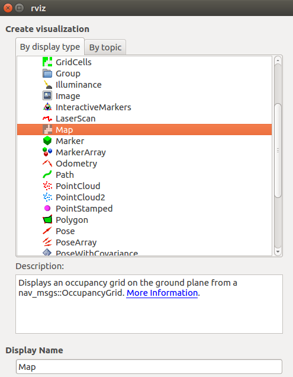
  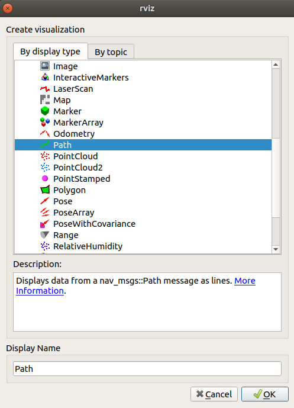
</div>
- /move_base/global_costmap/costmap
- /move_base/local_costmap/costmap
- /move_base/NavfnROS
- /move_base/DWAPlannerROS/local_plan

<div align="center">
  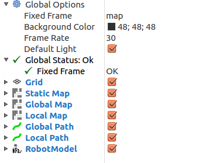
</div>

在这节课中由于使用到了路径规划，因此在添加中选择添加两个地图界面，他们显示的话题分别是全局代价地图/move_base/global_costmap/costmap和局部代价地图/move_base/local_costmap/costmap两个话题，再添加两个路径Path分别用于显示全局规划/move_base/NavfnROS和局部规划/move_base/DWAPlannerROS/local_plan

现在我们已经将需要显示的部分添加到RViz的界面中来了，首先让我们在RVIz中查看添加了的全局和局部代价地图，可以看到在全局代价地图和当前环境的地图十分相似但是线条要更粗，这不是由于我们设置了更粗的线条，具体的功能我们将会在之后进行介绍，接下来是局部代价地图，这个表示的是我们当前传感器能够探测的范围内的代价地图。

<div align="center">
  
  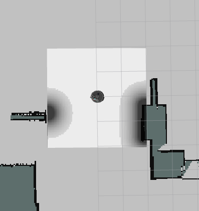
</div>

接下来让我们查看全局和局部路径规划，我们先使用RViz的可视化工具随便设定一个目标位姿，可以看到这里有一条轨迹，这就是我们的算法规划出来的路径，而这条路径有红色的部分和绿色的部分，它们分别是局部规划和全局规划的结果。

<div align="center">
  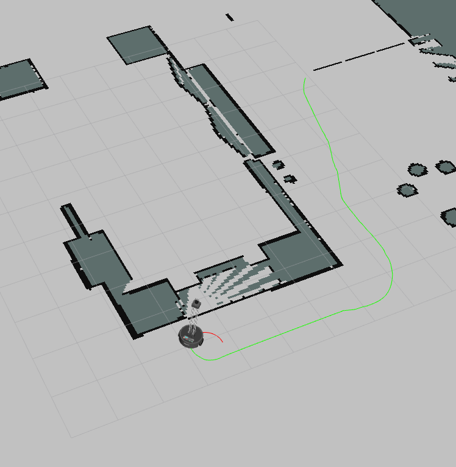
  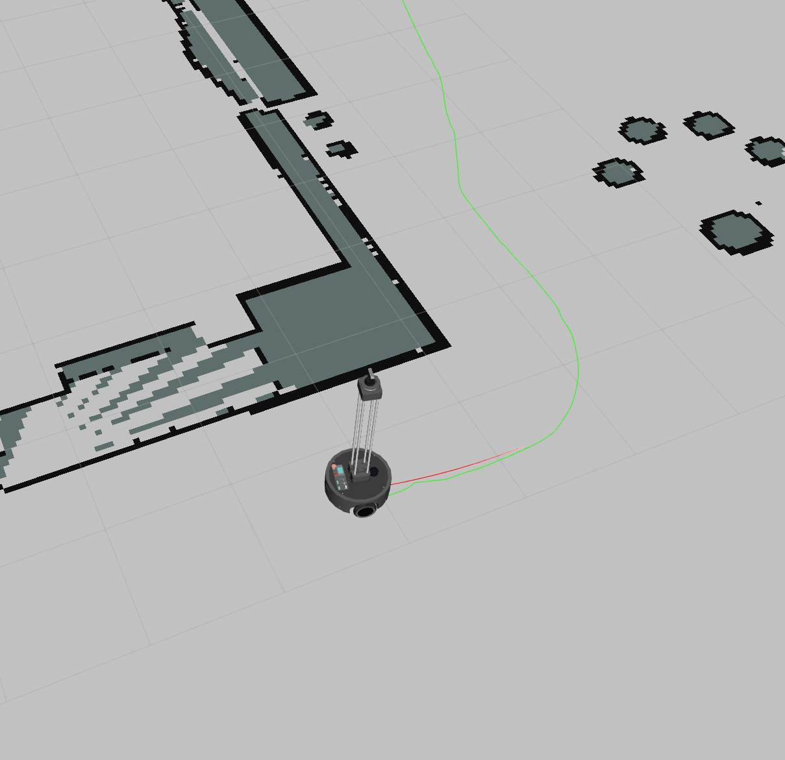
</div>

### 3. move_base package

接下来让我们介绍实现这一切功能的`move_base`package，希望各位还记得在介绍导航结构时曾经出现的那张图，`move_base`在其中起到了非常重要的作用。`move_base` pakage包含`move_base`节点，move_base节点是ROS导航堆栈中的主要部分之一，因为它链接了导航过程中发生的所有部分！没有这个节点，ROS导航就发挥不了任何作用！`move_base`节点的主要作用就是将机器人从当前位姿移动到一个目标位姿，从基础上讲，这个节点是之前介绍过的`SimpleActionServer`的一个实现，它的目标位姿使用的消息是`geometry_msgs/PoseStamped`，这样我们就能使用一个`SimpleActionClient`来发送一个目标位姿。这个动作服务器提供的话题名为`move_base/goal`，这是我们导航系统的输入。现在让我们可以查看这个话题并尝试通过命令而不是使用RViz的可视化设置目标位姿：

```bash
rostopic pub /move_base/goal 
```

在RViz中可以看到和我们手动增加目标时是一样的，即规划出了局部和全局路径

<div align="center">
  
  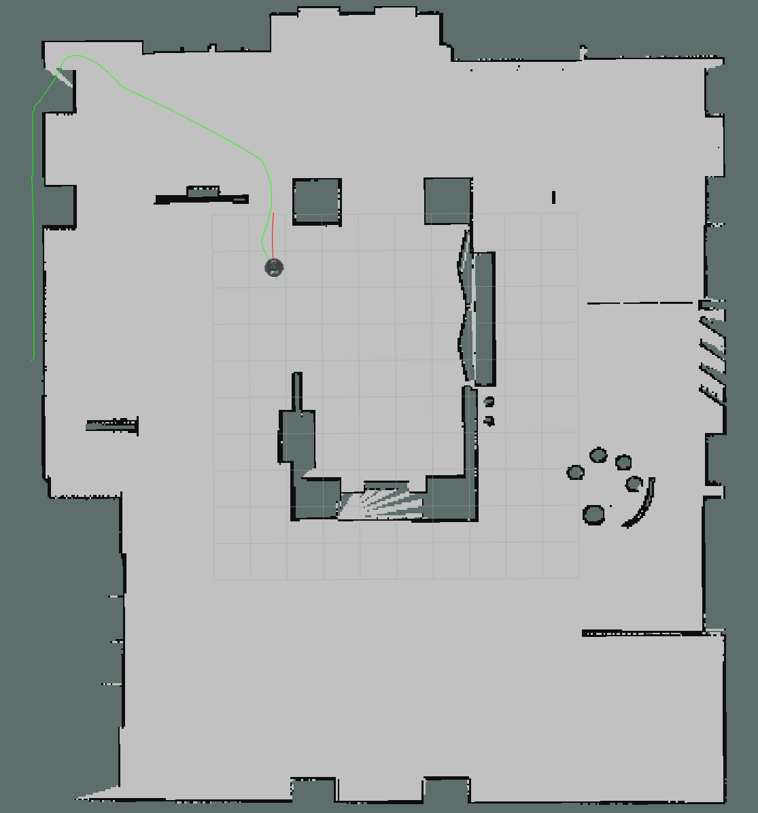
</div>


除此之外，我们还可以通过`rostopic echo`来获取动作服务器提供的反馈、状态和结果等，在此就不进行演示了，感兴趣的学员们可以自己尝试来查看这些消息的结构。

**launch文件**

接下来让我们来看看这些功能是如何实现的，我们还是去查看launch文件：

```xml
<launch>
  <arg name="map_file" default="$(find slam_sim_demo)/maps/Software_Museum.yaml"/>
  <node name="map_server" pkg="map_server" type="map_server" args="$(arg map_file)" />

  <arg name="initial_pose_x" default="5.0"/>
  <arg name="initial_pose_y" default="0.0"/>
  <arg name="initial_pose_a" default="-2.0"/>
  <arg name="custom_amcl_launch_file" default="$(find navigation_sim_demo)/launch/include/robot_amcl.launch.xml"/> 

  <include file="$(arg custom_amcl_launch_file)">
    <arg name="initial_pose_x" value="$(arg initial_pose_x)"/>
    <arg name="initial_pose_y" value="$(arg initial_pose_y)"/>
    <arg name="initial_pose_a" value="$(arg initial_pose_a)"/>
  </include>

 <include file="$(find navigation_sim_demo)/launch/include/move_base.launch.xml"/>
</launch>
```

我们现在已经知道地图的重要性以及如何绘制地图了，现在我们又有一个疑问，拥有地图是否已经足够了？如果不够，我们接下来又需要做什么才能实现我们的目的：自主导航呢？答案当然是不够，除了地图之外我们还需要进行定位，也就是让机器人知道自己处于给定的地图中的哪一部分，准确的说是得知自己在给定地图下的位姿，这个位姿包括位置与姿态，也就是机器人的朝向。那么接下来我们还是简单地演示一下定位的方法。

其中在本节课有用的部分是

```
 <include file="$(find navigation_sim_demo)/launch/include/move_base.launch.xml"/>
```
现在让我们再查看这个包含的文件

```xml
<launch>
  <arg name="odom_frame_id"   default="odom"/>
  <arg name="base_frame_id"   default="base_footprint"/>
  <arg name="global_frame_id" default="map"/>
  <arg name="odom_topic" default="odom" />
  <arg name="laser_topic" default="scan" />

  <node pkg="move_base" type="move_base" respawn="false" name="move_base" output="screen">
    <rosparam file="$(find navigation_sim_demo)/param/costmap_common_params.yaml" command="load" ns="global_costmap" />
    <rosparam file="$(find navigation_sim_demo)/param/costmap_common_params.yaml" command="load" ns="local_costmap" />
    <rosparam file="$(find navigation_sim_demo)/param/local_costmap_params.yaml" command="load" />
    <rosparam file="$(find navigation_sim_demo)/param/global_costmap_params.yaml" command="load" />
    <rosparam file="$(find navigation_sim_demo)/param/dwa_local_planner_params.yaml" command="load" />
    <rosparam file="$(find navigation_sim_demo)/param/move_base_params.yaml" command="load" />
    <rosparam file="$(find navigation_sim_demo)/param/global_planner_params.yaml" command="load" />
    <rosparam file="$(find navigation_sim_demo)/param/navfn_global_planner_params.yaml" command="load" />

    <param name="global_costmap/global_frame" value="$(arg global_frame_id)"/>
    <param name="global_costmap/robot_base_frame" value="$(arg base_frame_id)"/>
    <param name="local_costmap/global_frame" value="$(arg odom_frame_id)"/>
    <param name="local_costmap/robot_base_frame" value="$(arg base_frame_id)"/>
    <param name="DWAPlannerROS/global_frame_id" value="$(arg odom_frame_id)"/>

    <remap from="odom" to="$(arg odom_topic)"/>
    <remap from="scan" to="$(arg laser_topic)"/>
    <remap from="cmd_vel" to="/cmd_vel_mux/input/navi"/>
  </node>
</launch>
```

可以看到在这个文件中我们启动了一个`move_base`节点，同事设置了一系列的参数，除此之外我们还加载了很多的参数文件，我们将会在之后的课程中挑选其中重要的部分进行介绍，现在先让我们从全局规划器开始讲起。

### 4. 规划器
#### 4.1 全局规划器(Global Planner)

当move_base节点接收到一个新目标时，该目标会立即发送给Global Planner。然后，全局规划器负责计算一条安全路径，以达到该目标姿态。这条路径是在机器人开始移动之前计算的，因此它不会考虑机器人在移动时读取到的传感器数据。

**规划服务调用**

当我们发送一个目标以可视化全局规划器制定的路径规划时，机器人会自动开始执行该路径，这是因为通过发送这个目标位姿，我们的机器人就开始了整个导航过程。在某些情况下，我们可能对全局规划感兴趣，但对如何执行该规划无所谓，对于这种情况，movebase节点提供了名为/makeplan的服务。此服务允许可以让我们计算全局规划，而不会让机器人执行这一路径。现在让我们可以在终端中使用rosservice call来调用这一服务，在消息中设置起点和终点即可：

值得一提的是，这个服务使用的消息是nav_msgs/GetPlan，相信大家已经对消息的使用很熟练了，已经可以自己去查看这个消息的结构了。在设置好了起点和终点后可以看到规划的结果，由一个header和位姿组成。

现在我们已经开始了全局规划的第一步，我们通过调用服务实现了规划一条安全的路径以使我们的机器人能够顺利的到达目标，但是这个路径又是如何计算的呢？目前为止已经存在了很多的全局路径规划器，其中最重要也最常用的是Navfn、Carrot Planner和Global Planner，接下来简单的介绍一下这三种规划器。

<div align="center">
  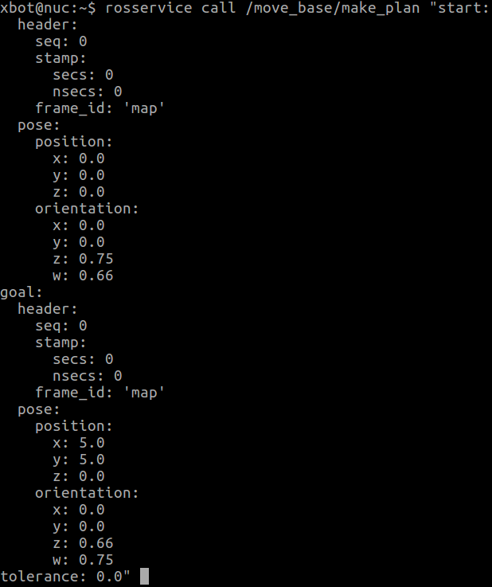
  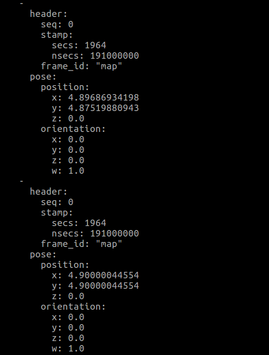
  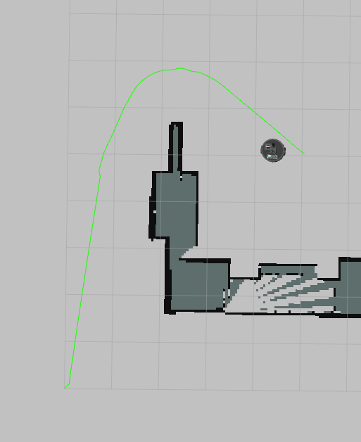
</div>

- **Navfn** navfn规划器可能是最常用的ROS全局规划器。它提供了一个快速内插值的导航功能，用于为移动基座创建路径规划，规划器假设机器人为圆形并利用代价地图来进行操作，以从栅格的起点到终点找到代价最小的路径规划，使用Dijkstra算法计算初始姿态和目标姿态之间的最短路径。

- **Carrot Planner** Carrot Planner获取目标位姿，检查这个目标是否是一个障碍物。如果它在障碍物中，它沿着目标和机器人之间的连线走，直到找到一个不在障碍物中的目标点，然后它将此目标点作为计划传递给局部规划器或控制器。因此，该Planner不进行任何全局路径规划。如果你需要你的机器人尽可能接近给定的目标，即使目标是不可达到的，这也是很有帮助的。但是在复杂的室内环境中，这种设计方法不太实用。

- **Global Planner** Global Planner是一个更灵活的选择，它允许我们更改navfn（dijkstra的算法）用于计算其他算法的路径的算法，包括A*、toggling quadratic approximation和toggling grid path。

在我们的launch文件中我们可以随意选择这三个之中的某一个作为我们的Global Planner，在我们的程序中是通过加载参数配置文件来实现的。

```bash
base_global_planner: "navfn/NavfnROS" 
base_global_planner: global_planner/GlobalPlanner 
base_global_planner: carrot_planner/CarrotPlanner
```

**Navfn 参数**

在我们常用的`Navfn`中有很多需要我们进行设置的参数，接下来就简单的进行介绍：

- /allow_unknown：指定是否允许navfn创建穿越未知区域的规划

- /planner_window_x：指定可选窗口的X大小，以限制Planner。这可以让Navfn在大的Costmap工作时被限制在一个小的窗口中

- /planner_window_y：指定可选窗口的X大小，以限制Planner。这可以让Navfn在大的Costmap工作时被限制在一个小的窗口中

- /default_tolerance：Planner对目标点的容忍度。Navfn将尝试创建一个尽可能接近指定目标位姿，但距离不超过设置方差的规划

- cost_factor

- neutral_cost

- lethal_cost

在我们的程序中参数设置如下
```
NavfnROS:
  visualize_potential: false
  allow_unknown: true
  planner_window_x: 0.0
  planner_window_y: 0.0
  default_tolerance: 0.0
```

#### 4.2 全局代价地图
现在让我问一个问题，当规划一条路径时时，这个轨道必须根据地图来计划，没有地图的路是没有意义的，那么，能猜出来Global Planner用来计算路径的地图是什么么？

**全局代价地图解释**

有的人可能会说直接使用我们在前面建立的地图就可以了，但是应该知道那个地图仅仅表示在哪个位置有障碍物，并不能直接表示机器人可以在哪里行走，我们需要使用的是之前简单提过的`Costmap`代价地图，代价地图代表的是在机器人可以不发生碰撞的前提下可以形式的区域，代价地图的每一个单元都由一个0到255的整数来表示，他们代表的情况如下所示：

- 255(NO_INFORMATION)：代表这个单元没有足够的已知信息

- 254(LETHAL_OBSTACLE)：代表在这里有可以发生碰撞的障碍物

- 253(INSCRIBED*INFLATED*OBSTACLE)：这里虽然没有障碍物，但是机器人不能在这里行驶因为会发生碰撞

- 0：代表这里没有任何障碍物
  

代价地图分为全局代价地图和局部代价地图，它们的差别主要在于：

- 全局代价地图是由一个静态地图生成的，通常是使用数字图像处理中的膨胀

- 局部代价地图是由机器人的传感器数据生成的

现在让我们关注被全局规划器使用的全局代价地图，它被用于生成一个一定不会发生碰撞的机器人轨迹，我们重新看一下全局代价地图的样子，现在应该可以理解为什么它的边框比静态地图要粗得多了，当然如果我们的机器人更小一点的话，代价地图的边框也会变得更小。

<div align="center">
  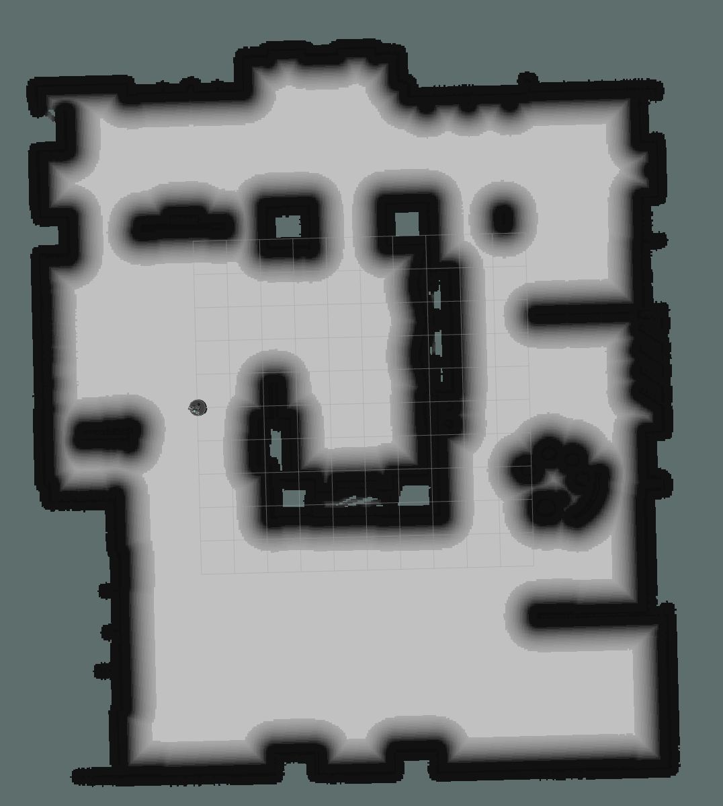
</div>

在我们使用全局代价地图的时候，我们也需要向它提供一定的参数，下面是我们程序的一个例子。

```
global_costmap:
   global_frame: /map
   robot_base_frame: /base_footprint
   update_frequency: 2.0
   publish_frequency: 0.5
   static_map: true
   rolling_window: false
   transform_tolerance: 0.5
   plugins:
     - {name: static_layer,            type: "costmap_2d::StaticLayer"}
     - {name: voxel_layer,             type: "costmap_2d::VoxelLayer"}
     - {name: inflation_layer,         type: "costmap_2d::InflationLayer"}
```

为了提供在这些参数，我们一共需要三个.yaml文件：

- global*costmap*params：用于设置全局代价地图的参数配置文件，就像上面的例子中显示的那样

- local*costmap*params：用于设置局部代价地图的参数配置文件

- costmap*common*params：用于设置全局和局部代价地图都能使用到的参数，例如robot_radius

**参数**

有的人可能会说直接使用我们在前面建立的地图就可以了，但是应该知道那个地图仅仅表示在哪个位置有障碍物，并不能直接表示机器人可以在哪里行走，我们需要使用的是之前简单提过的Costmap代价地图，代价地图代表的是在机器人可以不发生碰撞的前提下可以形式的区域，代价地图的每一个单元都由一个0到255的整数来表示，他们代表的情况如下所示：

现在让我们开始关注全局代价地图的参数：

- global_frame：代价地图进行处理的全局坐标系

- static_map：是否使用一个静态地图去初始化代价地图

- rolling_window：是否使用滚动窗口方法处理代价地图

- plugins：插件的说明，每个说明代表一层，每一个说明都是name或者type的内容。name用于定义插件的参数命名空间，这些插件都在costmap_common_params.yaml进行了具体的定义，而type则是初始化全局代价地图使用的的方法。

以我们刚才使用过的一个插件为例，我们简单地看一下inflation_layer的内容便结束我们在全局代价地图部分的内容

```
inflation_layer:
  enabled:              true
  cost_scaling_factor:  2.58
  inflation_radius:     1.0
```

#### 4.3 局部规划器

之前的部分我们介绍了全局规划器，它使用的是由静态地图生成的全局代价地图，而当全局规划器计算好了将要跟随的轨迹时，这条轨迹或者说路径就被发布到局部规划器中，之后局部规划器就像是全局规划器的一个个小段一样执行一段段的路径。所以，一旦给定了全局路径和地图，局部规划器就会给出速度控制命令来让机器人移动。不想全局规划器，局部规划器需要里程计和雷达数据作为支持，从而选择一个不会发生碰撞的局部路径，它可以重新计算路径而不是单纯的跟随全局路径。就像下图这样，全局路径和局部路径并不是重合的：

<div align="center">
  
</div>

和之前介绍过的内容一样，在局部规划器中也有已经实现了的包，我们只需要调用即可，接下来就让我们介绍一下在ROS中常用的局部规划器

**base_local_planner**

base_local_planner提供了Trajectory Rollout和Dynamic Window Approach(DWA)算法的实现，让我们介绍一下这个算法的基本想法：

- 从机器人的控制空间离散的进行采样

- 对于每一个采样到的速度，从机器人当前的状态仿真得到使用这一速度将会到达的下一状态

- 评价在每一个仿真中得到的路径

- 放弃不合理的路径

- 选择评价最好的路径并将对应的速度发送至机器人底盘

- 重复上述过程

DWA算法和Trajetory Rollout算法十分接近，但是在如何对机器人进行采样上存在不同，Trajectory Rollout的采样来自于给定机器人加速度限制的整个仿真期间的一组可实现速度，而DWA仅来自于一组可实现的速度。相比之下DWA更加高效因为它搜索的范围更小，但是由于没有考虑加速度，可能会没有Trajetory Rollout的效果好，不过我们还是通常建议使用DWA因为二者的表现在大多数情况下都十分接近，但是DWA计算速度更快，下面是可以使用的局部规划器。

- dwa*local*planner：这是最常使用的默认选项，是Dynamic Window Approach的实现

- eband*local*planner：是Elastic Band算法的实现

- teb*local*planner：是Timed Elastic Band算法的实现

和全局规划中的一样，我们仍然可以随意的更改局部路径规划器

```
base_local_planner: "base_local_planner/TrajectoryPlannerROS"
base_local_planner: "dwa_local_planner/DWAPlannerROS"
base_local_planner: "eband_local_planner/EBandPlannerROS"
base_local_planner: "teb_local_planner/TebLocalPlannerROS"
```

**参数**

接下来让我们看一下DWA局部规划器涉及到的参数。

**机器人配置参数**

- /acc_lim_x：x方向的机器人加速度限制

- /acc_lim_th：y方向的机器人加速度限制

- /max_trans_vel：机器人平移速度绝对值的的最大值

- /min_trans_vel：机器人平移速度绝对值的的最小值

- /max_vel_x：机器人移动的最大速率 

- /min_vel_x：机器人移动的最小速率 

- /max_rot_vel：机器人角速度的最大值

- /min_rot_vel：机器人角速度的最小值

目标容限参数

- /yaw_goal_tolerance：控制器达到目标时的偏航/旋转容限 

- /xy_goal_tolerance：控制器达到目标时的x或y上的距离容限 

- /latch_xy_goal_tolerance：如果目标容限被锁定，当机器人到达目标xy位置时，它将简单地原地旋转，即使它在执行此操作时超出目标容限，默认为false

前向仿真参数

- /sim_time：局部规划器预测的轨迹的仿真持续时间

- /sim_granularity：在一个给定轨迹上两点之间的距离

- /vx_samples：在探索x方向的速度空间时的采样数目

- /vy_samples：在探索y方向的速度空间时的采样数目

- /vtheta_samples：在探索角速度空间时的采样数目


<div align="center">
  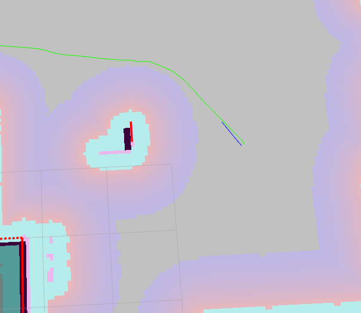
  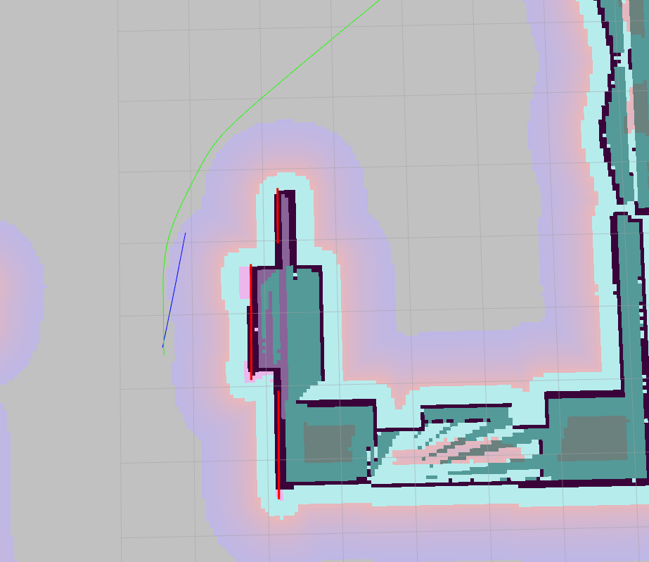
</div>

上图所示是对仿真时间进行更改的对比，左边的`/sim_time`设置为了1.0而右边的设置为了8.0，可以很明显的看到左边的局部规划路径也就是蓝线要更长一点。

**轨迹评价参数**

- /path_distance_bias：控制器保持在给定路径附近的程度所占的的权重

- /goal_distance_bias：控制器保持在局部目标和速度的程度所占的的权重

- /occdist_scale：控制器应尝试去避障所占的权重

下面是一个`dwa_local_planner_params.yaml`的例子：
```
DWAPlannerROS:
  max_vel_x: 0.5
  min_vel_x: 0.0
  max_vel_y: 0.0
  min_vel_y: 0.0

  max_trans_vel:  0.55
  min_trans_vel:  0.1
  trans_stopped_vel: 0.1
  max_rot_vel: 5.0
  min_rot_vel: 0.8
  rot_stopped_vel: 0.8

  acc_lim_x: 1.0
  acc_lim_theta: 2.0
  acc_lim_y: 0.0
  yaw_goal_tolerance: 0.3
  xy_goal_tolerance: 0.15
  
  sim_time: 4.0
  vx_samples: 20
  vy_samples: 0
  vtheta_samples: 40

  path_distance_bias: 32.0
  goal_distance_bias: 24.0
  occdist_scale: 0.1
  forward_point_distance: 0.325
  stop_time_buffer: 0.2
  scaling_speed: 0.25
  max_scaling_factor: 0.2
  oscillation_reset_dist: 0.05

  publish_traj_pc : true
  publish_cost_grid_pc: true
  global_frame_id: odom
```

还是按照在全局规划中的顺序，我们接下来就要进行局部低价地图的学习了。

#### 4.4 局部代价地图

在全局规划中我们已经介绍了什么是代价地图，也介绍了什么是全局代价地图。和全局代价地图不同，局部代价地图是由机器人的传感器数据生成的，当使用者给定了局部代价地图的宽和高后，局部代价地图就保持以机器人为中心随着机器人在环境中而移动，并在机器人移动时帮助其躲避障碍物。在真实环境中我们是没有办法保证环境是绝对静态的，可能会有来回走动的人，这就需要我们在实现静态环境的导航基础上，实现一个避障的功能。这里的障碍物指的是在我们建立的地图中没有出现的不可通过的区域，我们像在第一讲简介中进行过的那样，再次演示一下避障的功能：

```bash
roslaunch robot_sim_demo robot_spawn.launch
roslaunch navigation_sim_demo amcl_demo.launch
roslaunch navigation_sim_demo view_navigation.launch
```
我们先在Gazebo仿真环境中加一些障碍物，我们将障碍物做的大一点以凸显避障的效果。

<div align="center">
  
</div>

接下来我们使用上一部分中使用的方法增加目标位姿，可以看到此时我们还没有探测到障碍物，规划出来的路线仍然是正常的路线，而且在RViz的地图中也没有显示障碍物。

<div align="center">
  
</div>

但是随着机器人和障碍物越来越近，我们可以发现首先是机器人的激光雷达探测到了障碍物，当机器人不断接近障碍物的时候，机器人规划的路径也发生了改变，可以看到机器人选择绕离放置障碍物的地方并最终成功地到达了目标位姿。

**Recovery Behaviors**

在我们进行路径规划的时候，有一定的可能让机器人因为某些原因被卡住，比如到了一个狭窄的地方，如果这样的事情发生了，我们就需要使用ROS导航提供的恢复方法，这被称为`Recovery Behaviors`。ROS导航提供了两种恢复方式：`clear costmap`和`rotate recovery`，为了能够使用这两个方法我们首先需要设置这个参数：


- 如果机器人因为某些原因被卡住， 我们就需要使用ROS导航提供的恢复方法，这被称为Recovery Behaviors

- ROS导航提供了两种恢复方式：clear costmap和rotate recovery，为了能够使用这两个方法我们首先需要设置这个参数：

- recovery_behavior_enabled：这个参数可以让我们决定是否使用Recovery Behaviors

- Rotate Recovery是一种简单的恢复行为，它试图通过旋转机器人360度来清理机器人周围的空间。这样，机器人就可以找到一条无障碍路径来继续导航，在这里同样有一些参数需要进行调整来提高机器人的表现。

**Rotate Recovery** **参数**

- /sim_granularity：检查原地旋转是否安全时，检查障碍物之间的距离（以弧度表示），默认为1度也就是0.017

- /frequency：机器人底座发送速度命令的频率

**其他参数**

- /yaw_goal_tolerance：控制器达到目标时的偏航或旋转容限（以弧度表示）

- /acc_lim_th：机器人的角加速度上限

- /max_rotational_vel：机器人底座所允许的最大角速度

- /min_in_place_rotational_vel：进行就地旋转时底座允许的最小旋转速度

