## 7.1 ROS 机械臂简介

**本讲重点**

- 机械臂基础知识
- 机械臂发展史

**教学目的**

- 了解机械臂基础知识
- 了解机械臂发展史

### 7.1.1 什么是机械臂？

首先我们了解一下什么是机械臂 。

**机械臂是什么？**

机械臂是什么呢？

机械手臂是指具有模仿人类手臂功能并可完成各种作业的自动控制设备， 这种机器人系统有多关节连结并节允许在平面或三度立体空间进行运动或使用线性位移移动。机械臂产品有很多，请大家不妨在谷歌图片上查查，左图是我查询的部分结果。我用机械臂英文`robotic arm`作为关键词在谷歌上查到了4千多万个条目，可见机械臂的应用和研究还是挺火的。

**机械臂坐标**

机械臂的坐标形式有直角坐标型、圆柱坐标型、球坐标型、关节坐标型。其中直角坐标型，又称矩形坐标型。关节坐标型，又称关节球坐标型。

<video src="src\videos\Video_15.1.1.mp4"></video>
**直角坐标型**

直角坐标型机械臂使用笛卡尔坐标系，也就是直角坐标系，由3个线性关节组成，可独立沿X、Y、Z三个坐标轴做直线运动，英文简称3P, P是英文Prismatic棱柱的简写 。这种机械臂主要用于物品的抓取和放置，如码头的吊车。它可以前后移动，左右移动，上下移动。直角坐标型机械臂使用笛卡尔坐标，形成了长方体工作空间。它具有简单的坐标控制系统，非常适用于物流系统。 

**圆柱坐标型**

圆柱坐标型机械臂，可沿两个方向做直线运动，沿一个轴做旋转运动。英文简称R2P，R是英文Rotational旋转的简写，即沿一个轴旋转，沿两个轴做直线运动。这类机械臂主要应用于工厂流水线和物流系统。圆柱坐标型机械臂沿两个方向做直线运动，竖直方向的运动术语叫Stroke，水平方向的运动术语叫Reach，旋转运动术语叫Swing。圆柱坐标型机械臂形成了圆柱体工作空间，这种机械臂的优势是充分利用了竖杆的高度，可在从最底部到最顶部的连续空间进行作业。 此外这种结构的机械臂可在高负载的情况下高速做重复运动。

**球坐标型**

球坐标型机械臂，可沿两个方向旋转，沿一个方向做直线运动。英文简称2RP。机器人可沿Base底座和shoulder肩部旋转，沿手臂Reach方向做直线运动。这种类型的机械臂主要用于物流，焊接，绘图，流水线等场合。球坐标型机械臂可沿两方向旋转，沿Base底座旋转，沿Shoulder肩部旋转，沿一个方向做直线运动，通常是ARM手臂沿Reach方向做直线运动。球坐标型机械臂有球形工作空间，但会受到REACH方向直线运动长度的限制和shoulder肩部旋转角度的限制，它实际的工作空间不能覆盖整个球体。球坐标型机械臂通常有一个非常长的Reach杆来提高它的性能。对比关节坐标型机械臂它有价格高，底座大，灵活性差等劣势。

**关节坐标型**

关节坐标型机械臂，又称关节球坐标型机械臂，可沿3个方向旋转，简称3R。关节坐标型机械臂是最流行的机械臂，它的结构和我们的手臂非常像。关节坐标型机械臂至少可以沿三个轴旋转。左右方向的运动来源于BASE底座的旋转，水平方向的运动来源于shoulder肩部的旋转，竖直方向的运动来源于ebow肘部的旋转。关节坐标型机械臂和人的手臂非常相像，它的工作空间几乎是整个球体。其的优点是能够到达很深的位置，力矩小，手臂和终端工具灵活。缺点是机械结构和控制系统比较复杂，设备价格高。

**机械臂构成**

机械臂构造上由机械主体、控制器、伺服机构和感应器所组成。我们来看看这个例子，风扇部分是机械主体，Arduino板为控制器，黑色这块是伺服电机。

左下角显示的是在Arduino上编写的控制程序，我们可以对控制器进行编程，定义输入、输出对应的芯片管脚，设计输入到输出之间的变化关系。 

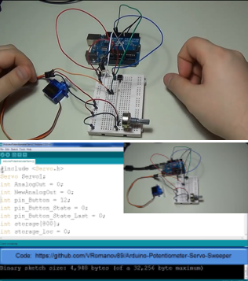

**机械臂感应器**

感应器用于获取机械臂内部和外部环境的状态信息。机械臂传感器的种类很多。分别应用于机器人视觉、安全、终端工具、位置反馈等方向。机器人视觉是基于图像的处理系统，主要使用的是3D传感器，深度摄像头等。用于识别物体，获取其位置、姿态距离信息等。

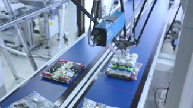

上面是机械臂结合视觉的应用，视觉可获取物品的位置、距离、姿态、形状、尺寸等信息。应用领域有流水线物品分拣、物品安装等。如福特公司安装汽车前挡风玻璃流水线的每个装配点安装了32个深度摄像头，用于结合机械臂完成装配工作。

安全

安全方面主要使用的是深度摄像头，激光雷达，碰撞传感器等。

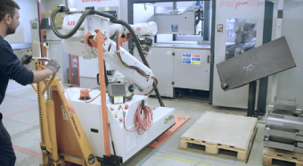

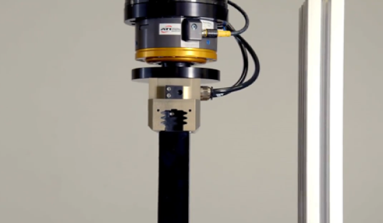

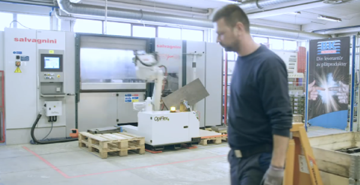

第一个视频是在机器人工作区域安装两个激光摄像头，用于探测是否有物体或人进入到了工作区域。当有物体或人进入到了工作区域时，发送信息给机械臂，令其停止工作。

第二个视频是使用碰撞传感器来避免由于碰撞造成的机械臂损坏。这个金色原件就是安装在终端工具基座上的碰撞传感器。它可以探测终端工具与外界环境发生的不同方向上的碰撞。碰撞传感器内安装有弹簧装置，当碰撞发生时，传感器会将碰撞信息发给机械臂，弹簧装置避免了在停机前，碰撞对机械臂造成损坏。

终端工具

机械臂可使用RFID和深度摄像头帮助探测需抓取的物品，测量距离，检测物品是否抓取到位等。

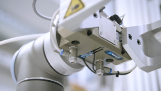

在这个领域，传感器主要用于上料系统，例如用RFID传感器或3D传感器探测应该夹取哪个物品，物品是否被正确的夹取到了，物品是否被放置到正确的位置。

位置反馈

位置反馈的获取提高机械臂准确性非常重要，通常我们会在机械臂每个转轴上安装位置传感器，用于获取机械臂各轴的信息。位置传感器可获取机械臂各轴运动的速度，位置和驱动状态。保障了机械臂运动的准确性和可重复性。

最后我们做个小结：

1、机械手臂是指具有**模仿人类手臂功能**并可完成各种作业的**自动控制设备**。

2、机械臂的坐标形式有**直角坐标型**、**圆柱坐标型**、**球坐标型**、**关节坐标型**。

3、机械臂构造上由**机械主体**、**控制器**、**伺服机构**和**感应器**所组成。

4、机械臂传感器的种类很多。分别应用于**机器人视觉**、**安全**、**终端工具**、**位置反馈**等方向。

### 7.1.2 机械臂的发展史

接着我们了解一下机械臂的发展史。1954年德沃尔提出数字、可编程机械臂概念。并申请了专利，他的专利名字是可编程的物品传输装置。该专利的要点是借助伺服技术控制机器臂的关节。1956年乔治·德沃尔（George Devol）和物理学家约瑟·英格柏格（Joe Engelberger）成立了一家名为Unimation的公司，1960年到1961年间，Unimation公司研发出第一台工业用机械手臂，名为“Unimate”，这台设备卖给了通用公司。

<video src="src\videos\Video_15.2.1.mp4"></video>
1969年日本的第一台工业机器人

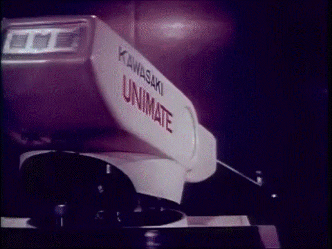

60年代的美国，机器人的形象多是呈现在恐怖的肥皂剧里，人们对新生的机械臂很不感冒，Unimate在美国市场生意惨淡，1969年，Unimation公司的工业机器人进入经济正在起飞，但缺少劳工的日本市场。Unimation公司与日本川崎重工签订许可协议，生产Unimate机器人专供亚洲市场销售。川崎把开发和生产能节省劳动力的机器人和系统作为一项重要任务来完成，成为日本在工业机器人领域的先驱。1969年，川崎重工公司成功开发了Kawasaki-Unimate（川崎-Unimate） 2000机器人，这是日本生产的第一台工业机器人。

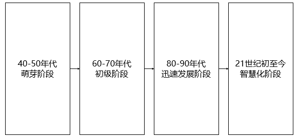

到今天，机械臂的发展经历了4个时代。它们是40至50年代“萌芽”、60至70年代“初级”、80至90年代“迅速发展”、和2000年以后的“智慧化”四个阶段。

德沃尔提出可编程机械臂概念是机械臂萌芽阶段的代表，首台机械臂Unimate的诞生实际是在6年以后。

60-70年代初级阶段

60年代机器人可按程序重复作业，1973年Kuka生产出了第一个六轴机器人Famulus

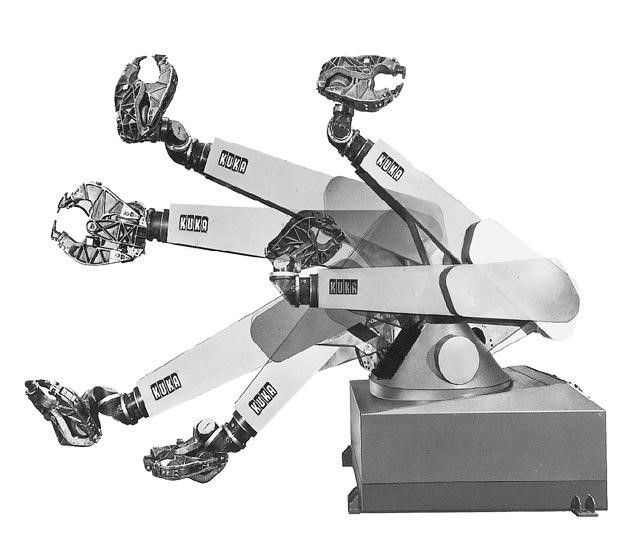

80-90年代迅速发展阶段

80年代机器人具备初步感知和回馈能力，在工业生产中广泛应用。80年代福特公司开始在汽车组装线上使用机器人。上面这个录像是上世纪80年代的机器人汽车生产线，当时的机器人用于辅助人工，使用比例还不高。下面这个视频是今天德国的汽车轮胎全机器人安装线，工人已经彻底消失了。今年4月英国诺丁汉市的市长IAN CURRYER在软件所参观了我们智能机器人研究中心，他问我你怎么看大量使用机器人造成的劳工失业问题。

<video src="src\videos\Video_15.2.2.mp4"></video>
<video src="src\videos\Video_15.2.3.mp4"></video>
<video src="src\videos\Video_15.2.4.mp4"></video>
<video src="src\videos\Video_15.2.5.mp4"></video>
当前的机器人已具有逻辑思维和决策能力。机械臂不仅广泛应用于工业，也进入到了我们的生活。左上方是由人脑意识控制的机械手臂，这项技术为残疾人带来了福音，目前这个手臂还干不了什么细活，手掌抓取的重量也比较有限。下面是韩国街头的机器人咖啡贩卖机，这已经不算是什么高科技了，1分钟1杯的速度让韩国学历不高的年轻人找工作更加困难。希望大家都来学好机器人开发技术，把别人遇到的挑战变成我们的机遇。

<video src="src\videos\Video_15.2.6.mp4"></video>
ROS机械臂能完成什么工作呢？我们通过MoveIt！官方2017年底发布的一个视频来了解一下。MoveIt！是ROS机械臂运动规划框架。它诞生于2011年。

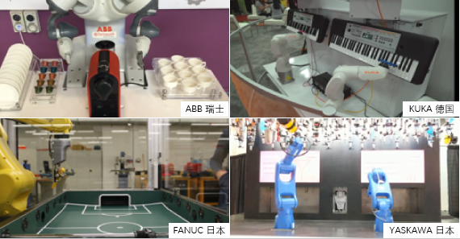

在当前的全球工业机器人业界中，以瑞士的ABB、德国的库卡、日本的发那科和安川电机最为著名，并称工业机器人四大家族。

| 公司    | 国家 | 成立时间                  | 机器人业务始于 | 核心技术                     | 主营业务                                                     |
| ------- | ---- | ------------------------- | -------------- | ---------------------------- | ------------------------------------------------------------ |
| ABB     | 瑞士 | 1988年   （合并前为1883） | 1974年         | 运动控制系统                 | 电力产品、电力系统、离散自动化与运动控制、低压产品、过程自动化 |
| KUKA    | 德国 | 1898年                    | 1973年         | 载重机器人、自动化系统解决方 | 系统集成业务、工业机器人本体                                 |
| YASKAWA | 日本 | 1915年                    | 1977年         | 伺服和运动控制器             | 运动控制、工业机器人、系统工程、驱动控制                     |
| FANUC   | 日本 | 1956年                    | 1974年         | 数控系统设计及制造           | 工厂自动化设备、金属加工机械、机器人本体                     |

四大家族除了发那科以外都是成立超过100年的老古董了，ABB原来是做电力和机械的，KUKA原来是做电灯、焊接和公车的，安川电机这个名好，我们不用查了，他家原来是做电机的。1956年成立的发那科是做数控起家的，他家的老板Inaba博士是个世界级的电控专家。目前四大家族占据中国机器人产业70%以上的市场份额。传统的工业机械臂开发大都闭源，开发方法不通用，而且设备非常昂贵，基本上起步价都是几十万一台，显然像我这样的穷人是不能人手一台的。不过告诉大家一个好消息，目前有很多工业机器人已经支持ROS了，只要大家学好这门课，今后也可以去从事工业机器人开发工作。

ROS-Industrial会员

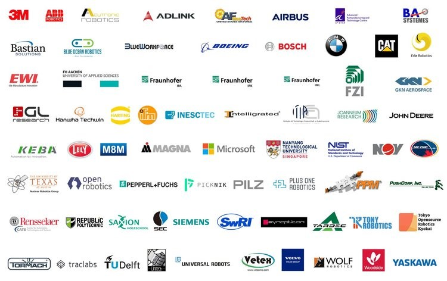

**小结**

1、**1954年德沃尔**最早**提出了工业机器人的概念**，并申请了专利。该专利的要点是借助伺服技术控制机器人的关节。

2、机械臂发展历史经历了40-50年代“**萌芽**”、60-70年代“初级”**机器人可按程序重复作业**、80-90年代“迅速发展”**机器人具备初步感知和回馈能力、当前“智慧化”**四个阶段。

3、在当前的全球工业机器人业界中，以**瑞士的ABB、德国的库卡、日本的发那科和安川电机最为著名**，并称**工业机器人四大家族**。
